# Wide-Column Stores

10 questions covering Cassandra's consistent hashing, partition/clustering keys, tombstones, tunable consistency, HBase architecture, and Discord's Cassandra implementation.

---

## Q1: What is a wide-column store and how does Cassandra differ from RDBMS?

**Role:** Mid | **Difficulty:** 🟡 Mid | **Priority:** P1 | **Format:** Quick Answer

> **What the interviewer is testing:** Whether you can describe the wide-column data model and explain why it's optimized for write-heavy, time-series-like workloads at scale.

### Answer in 60 seconds
- **Wide-column store:** Data organized by row key, and within each row, columns are stored as key-value pairs — rows can have different columns, and rows can have thousands of columns
- **Cassandra vs RDBMS:** No joins; no foreign keys; denormalized by design; schema designed around query patterns not data relationships; horizontal scale via consistent hashing ring; tunable consistency from ONE to ALL
- **Write optimized:** Cassandra writes are appends to an in-memory Memtable + WAL (Commit Log) — writes are O(1) regardless of data volume; reads are more expensive (merge SSTables)
- **Scale:** Cassandra handles 1M+ writes/sec on a 10-node cluster; each node handles ~100K writes/sec; linear scale by adding nodes

### Diagram

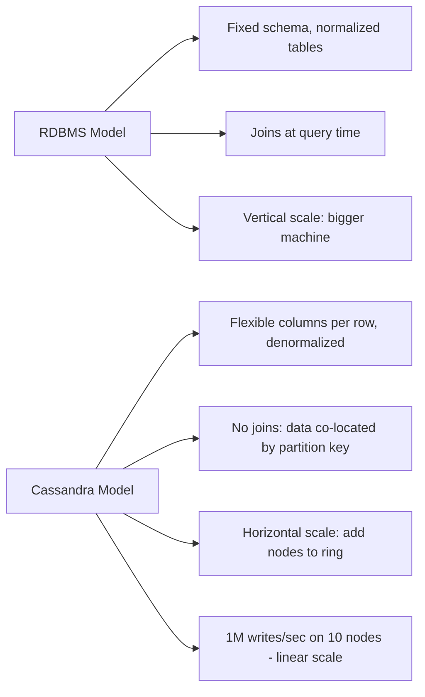

### Pitfalls
- ❌ **Querying by non-partition-key columns without ALLOW FILTERING:** A query like `SELECT * FROM messages WHERE user_id=1` when user_id is not the partition key causes a full cluster scan — forbidden in production
- ❌ **Expecting ad-hoc queries to work:** Cassandra is schema-first — you design tables around the 3 queries you'll run, not the data model; changing query patterns requires new tables

### Concept Reference
→ [SQL vs NoSQL](../../../system-design/storage-and-databases/sql-vs-nosql)

---

## Q2: What is a partition key vs clustering key in Cassandra?

**Role:** Mid | **Difficulty:** 🟡 Mid | **Priority:** P1 | **Format:** Quick Answer

> **What the interviewer is testing:** Whether you understand Cassandra's two-level key structure and can design a table schema for a specific query pattern.

### Answer in 60 seconds
- **Partition key:** Determines which node in the ring holds the data; all rows with the same partition key are stored on the same node; enables O(1) partition lookup without scatter-gather
- **Clustering key:** Determines the sort order of rows within a partition; enables efficient range queries within a partition (`WHERE partition_key = X AND clustering_key BETWEEN Y AND Z`)
- **Example:** `messages` table for a chat app: partition key = `(user_id, month)`, clustering key = `message_id DESC` → all messages for user in one month are on one node, sorted newest-first
- **Composite partition key:** `(user_id, month)` prevents a single user from creating a partition too large (unbounded months split the data)

### Diagram

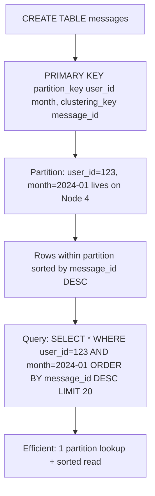

### Pitfalls
- ❌ **Single user_id as partition key for messages:** A user active for 5 years sends 50M messages → one partition with 50M rows → partition too large (>2GB), hot node, slow reads
- ❌ **Not including range column in clustering key:** If you need `WHERE created_at > X` within a partition, `created_at` must be the clustering key — otherwise it's a partition-wide scan

### Concept Reference
→ [SQL vs NoSQL](../../../system-design/storage-and-databases/sql-vs-nosql)

---

## Q3: How does Cassandra's consistent hashing ring work?

**Role:** Senior | **Difficulty:** 🔴 Senior | **Priority:** P1 | **Format:** Deep Dive

> **What the interviewer is testing:** Whether you understand how Cassandra distributes data across nodes and how token-based consistent hashing enables linear scale without resharding.

### Problem Constraints
| Dimension | Value |
|-----------|-------|
| Cluster size | 10 nodes |
| Replication factor | 3 |
| Tokens per node | 256 virtual nodes (vnodes) |

### Consistent Hashing Architecture

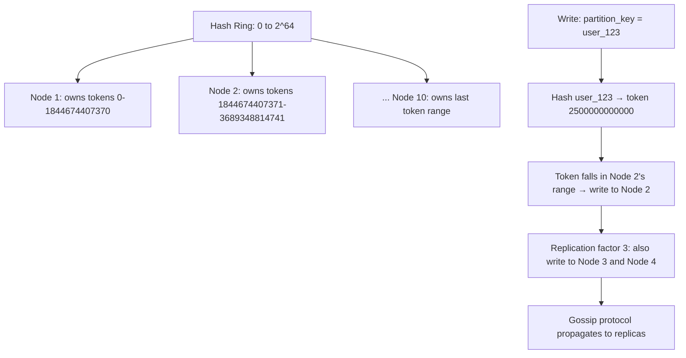

### Virtual Nodes (vnodes)

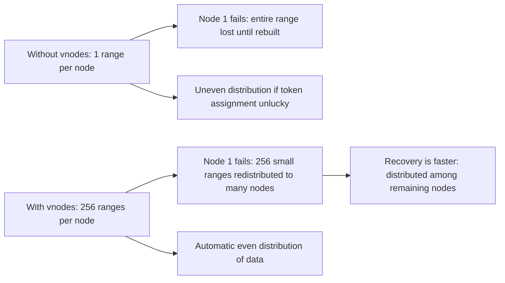

| Dimension | Without vnodes | With vnodes (256/node) |
|-----------|---------------|----------------------|
| Node failure impact | 1/N of cluster data lost | 1/(N×256) = tiny chunks redistributed |
| Recovery speed | Slow: one node rebuilds all | Fast: distributed across all nodes |
| Distribution | Uneven possible | Even by design |
| Operational complexity | Simple | Slightly more complex |

### Recommended Answer
Cassandra uses a token ring where each partition key is hashed to a 64-bit token. Each node owns a contiguous range of tokens. With vnodes (256 virtual token ranges per node), each node owns 256 non-contiguous small ranges scattered around the ring — this ensures even data distribution and fast recovery (256 small chunks redistributed across all nodes instead of one large chunk to one node).

### What a great answer includes
- [ ] Murmur3 hash function: Cassandra uses Murmur3Partitioner for uniform token distribution
- [ ] Replication placement: with RF=3, data is written to the 3 nodes that own the next consecutive tokens clockwise from the partition hash
- [ ] Gossip protocol: nodes communicate cluster state (who owns which tokens) via gossip every second — no central coordinator
- [ ] Adding nodes: new node picks token positions and streams data from existing nodes — ring re-balances automatically

### Pitfalls
- ❌ **Confusing partition key with token:** The token is the hash of the partition key — you query by partition key, Cassandra internally maps it to a token for routing
- ❌ **Low RF for write-heavy workloads:** RF=1 means no redundancy — a node failure loses data permanently; always use RF=3 for production

### Concept Reference
→ [SQL vs NoSQL](../../../system-design/storage-and-databases/sql-vs-nosql)

---

## Q4: What is a tombstone in Cassandra and why does it cause problems?

**Role:** Senior | **Difficulty:** 🔴 Senior | **Priority:** P2 | **Format:** Quick Answer

> **What the interviewer is testing:** Whether you know Cassandra's deletion mechanism and the tombstone accumulation problem that causes GC pressure and query slowdowns.

### Answer in 60 seconds
- **Definition:** A tombstone is a deletion marker — Cassandra never deletes data immediately (no in-place delete in SSTable immutable files); it writes a tombstone with a timestamp to mark the data as deleted
- **Why it exists:** SSTables are immutable; actual deletion happens during compaction when tombstones are merged with the data they mark for deletion
- **Problem:** Before compaction, tombstones accumulate — a query must skip over all tombstones to find live data; with millions of tombstones, reads scan millions of markers causing GC pressure and timeouts (default `tombstone_warn_threshold=1000`, `tombstone_failure_threshold=100000`)
- **TTL mechanism:** Setting TTL on rows generates tombstones when data expires — a table with aggressive TTLs (1-hour TTL on 100K inserts/sec) generates 100K tombstones/sec

### Diagram

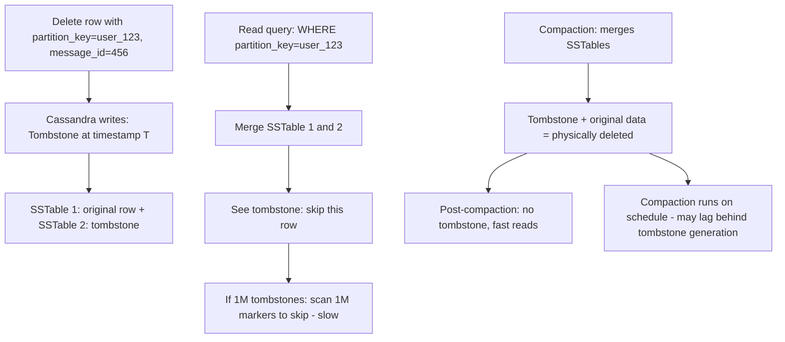

### Pitfalls
- ❌ **Deleting rows in hot partitions at high rate:** Delete-heavy workloads (chat message delete, expired sessions) generate tombstone storms — use TTL-based expiration instead of explicit deletes, and tune compaction strategy
- ❌ **Not monitoring tombstone count:** `nodetool cfstats` shows tombstone ratios; alert when tombstone:live ratio exceeds 10:1

### Concept Reference
→ [SQL vs NoSQL](../../../system-design/storage-and-databases/sql-vs-nosql)

---

## Q5: How does Cassandra achieve tunable consistency (ONE, QUORUM, ALL)?

**Role:** Senior | **Difficulty:** 🔴 Senior | **Priority:** P2 | **Format:** Deep Dive

> **What the interviewer is testing:** Whether you understand Cassandra's per-operation consistency levels and the availability-consistency trade-off each represents.

### Problem Constraints
| Dimension | Value |
|-----------|-------|
| Replication factor | 3 |
| Cluster nodes | 6 |
| Availability target | 99.99% |
| Consistency requirement | Per-operation tunable |

### Consistency Levels Explained

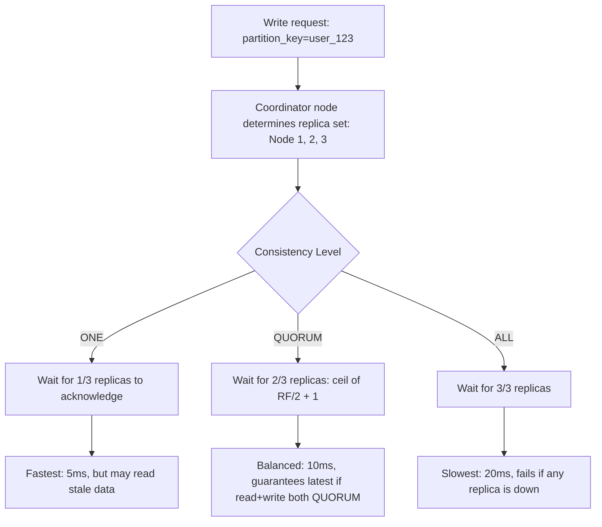

### Consistency Level Trade-offs

| Level | Writes Needed | Reads Needed | Strong Consistency? | Availability |
|-------|--------------|-------------|---------------------|-------------|
| ONE | 1 replica | 1 replica | No (may read stale) | Highest |
| QUORUM | 2/3 replicas | 2/3 replicas | Yes (overlapping majority) | Medium |
| LOCAL_QUORUM | 2/3 in local DC | 2/3 in local DC | Yes (locally) | High (tolerates DC failure) |
| ALL | 3/3 replicas | 3/3 replicas | Yes | Lowest (any node down = fail) |

### Why QUORUM Guarantees Strong Consistency

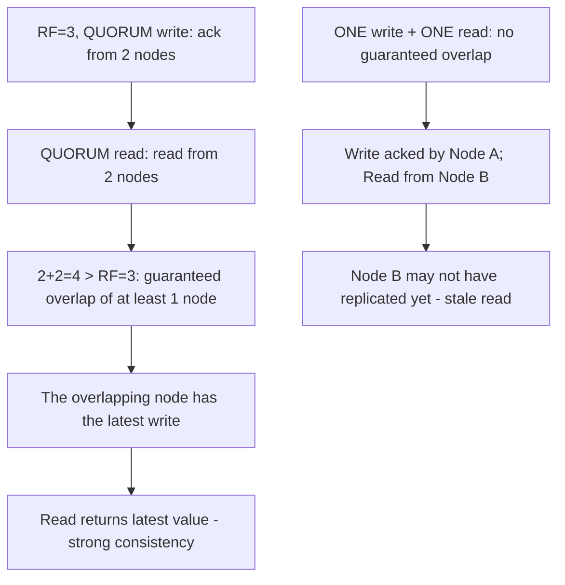

### Recommended Answer
Use `QUORUM` for financial data and critical reads/writes where staleness is unacceptable. Use `LOCAL_QUORUM` for multi-datacenter deployments where cross-DC quorum would be too slow. Use `ONE` for analytics, activity feeds, and any scenario where stale data by 50–200ms is acceptable. The formula for strong consistency: write_CL + read_CL > RF.

### What a great answer includes
- [ ] LOCAL_QUORUM: preferred for multi-DC — QUORUM requires nodes from all DCs which adds cross-DC latency
- [ ] Write CL + Read CL > RF formula: any combination that exceeds RF guarantees overlap of at least one up-to-date node
- [ ] Lightweight transactions (LWT): `IF NOT EXISTS` uses Paxos for linearizable consistency — much higher cost (5 round trips), use sparingly
- [ ] Hinted handoff: if a replica is down during a write, the coordinator stores a hint and delivers it when the replica recovers

### Pitfalls
- ❌ **Using ALL in production:** `ALL` fails if any single replica is unavailable — a routine node maintenance or network hiccup causes write failures; never use ALL for user-facing operations
- ❌ **ONE write + QUORUM read assuming staleness is prevented:** With ONE write, only 1 node has the data; QUORUM read hits 2 nodes but the 1 with fresh data may not be in that set

### Concept Reference
→ [SQL vs NoSQL](../../../system-design/storage-and-databases/sql-vs-nosql)

---

## Q6: How do you model time-series data in Cassandra?

**Role:** Staff | **Difficulty:** ⚫ Staff | **Priority:** P2 | **Format:** Quick Answer

> **What the interviewer is testing:** Whether you can design a Cassandra schema that enables efficient time-range reads without exceeding partition size limits.

### Answer in 60 seconds
- **Pattern:** Composite partition key `(entity_id, time_bucket)` + clustering key `timestamp DESC` — time_bucket prevents unbounded partition growth (e.g., group by month or day)
- **Example:** Sensor readings: `PRIMARY KEY ((sensor_id, month), timestamp)` — each sensor-month gets its own partition; range query `WHERE sensor_id=X AND month=2024-01 AND timestamp > T1 AND timestamp < T2` is efficient
- **Bucket size trade-off:** Smaller buckets (day) = more partitions, smaller reads; larger buckets (year) = fewer partitions, but risk large partitions (>2GB)
- **Rule:** Partitions should be <100MB for optimal read performance; size = avg_row_size × rows_per_bucket

### Diagram

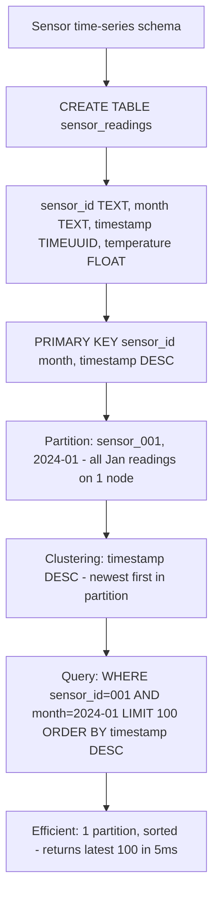

### Pitfalls
- ❌ **Using only sensor_id as partition key:** A sensor active for 5 years at 1 reading/second = 157M rows in one partition — well over the 2GB limit
- ❌ **Not choosing bucket size based on data rate:** A sensor sending 1 reading/ms needs daily buckets (86.4K rows/day); a sensor sending 1 reading/hour needs yearly buckets (8.7K rows/year)

### Concept Reference
→ [SQL vs NoSQL](../../../system-design/storage-and-databases/sql-vs-nosql)

---

## Q7: How does HBase differ from Cassandra in architecture?

**Role:** Staff | **Difficulty:** ⚫ Staff | **Priority:** P2 | **Format:** Quick Answer

> **What the interviewer is testing:** Whether you know the fundamental architectural difference between HBase (master-slave, HDFS-backed) and Cassandra (masterless, peer-to-peer).

### Answer in 60 seconds
- **HBase:** Master-slave architecture; HMaster coordinates region servers; data stored on HDFS; strong consistency (single master per region); designed for batch + random access on top of Hadoop ecosystem
- **Cassandra:** Fully peer-to-peer (no master); every node is equal; data stored on local SSDs; tunable consistency; designed for high write throughput with no single point of failure
- **Consistency difference:** HBase provides strong consistency per-row (single region server owns each row); Cassandra provides tunable consistency with eventual convergence
- **Integration:** HBase integrates natively with Hadoop/Spark/Hive; Cassandra is standalone with Spark connector for analytics

### Diagram

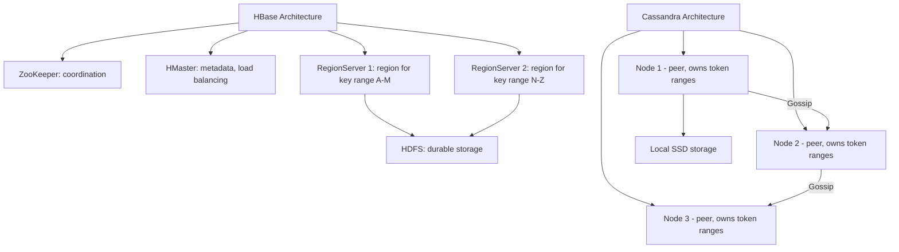

### Pitfalls
- ❌ **HMaster as SPOF:** HMaster failover with ZooKeeper takes 30–60 seconds — the cluster is in read-only mode during failover; plan for this in SLA
- ❌ **Choosing HBase outside the Hadoop ecosystem:** HBase's value comes from tight Hadoop integration; without Hadoop, Cassandra is simpler to operate with better write throughput

### Concept Reference
→ [SQL vs NoSQL](../../../system-design/storage-and-databases/sql-vs-nosql)

---

## Q8: How does Discord store trillions of messages in Cassandra?

**Role:** Staff | **Difficulty:** ⚫ Staff | **Priority:** P3 | **Format:** Deep Dive

> **What the interviewer is testing:** Whether you know Discord's real-world Cassandra architecture and the specific schema decisions that enable their scale, plus their migration to ScyllaDB.

### Problem Constraints
| Dimension | Value |
|-----------|-------|
| Messages | Trillions stored |
| Daily new messages | Billions |
| Query pattern | Load last N messages for a channel |
| Latency SLA | p99 < 100ms |

### Discord's Cassandra Schema

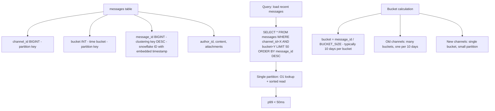

### Discord's Migration to ScyllaDB

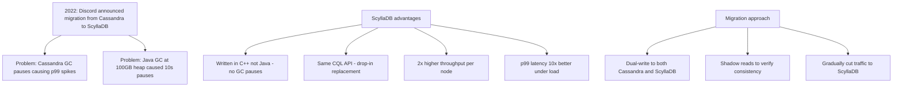

| Dimension | Cassandra | ScyllaDB |
|-----------|-----------|---------|
| Language | Java (JVM) | C++ (no GC) |
| GC pauses | Yes (JVM GC) | No |
| Throughput | 1M writes/sec/node | 2M writes/sec/node |
| p99 latency | 10–50ms | 1–5ms |
| API compatibility | CQL | CQL (same) |

### Recommended Answer
Discord's schema is textbook time-bucketed Cassandra: `(channel_id, bucket)` as partition key and `message_id DESC` as clustering key. This gives O(1) channel lookup and sorted recent message reads. The bucket prevents unbounded partition growth — each 10-day window is one partition. Discord migrated to ScyllaDB in 2022 to eliminate Java GC pauses that caused p99 latency spikes at their scale (trillions of messages).

### What a great answer includes
- [ ] Snowflake message_id: embeds timestamp, enabling time-based sorting without separate timestamp column
- [ ] Bucket size calculation: average channel message rate determines optimal bucket size
- [ ] Hotspot channels: a channel with 100M messages/day has very active buckets — ScyllaDB's better CPU utilization handles this
- [ ] ScyllaDB migration pattern: dual-write + shadow reads is the standard pattern (same as any TSDB migration)

### Pitfalls
- ❌ **No bucket in partition key:** `channel_id` alone as partition key — Discord's most active channels would have partitions with billions of rows
- ❌ **Timestamp as clustering key instead of message_id:** Two messages at the same millisecond would collide; Snowflake IDs with embedded timestamps are unique and sortable

### Concept Reference
→ [SQL vs NoSQL](../../../system-design/storage-and-databases/sql-vs-nosql)

---

## Q9: Design a Cassandra schema for a messaging app with per-user message history

**Role:** Senior | **Difficulty:** 🔴 Senior | **Priority:** P2 | **Format:** Scenario
**Real Company:** Modeled on WhatsApp and Telegram message storage patterns

### The Brief
> "Design a Cassandra schema for a direct messaging app. Each user can have conversations with multiple other users. The primary query: load the 50 most recent messages in a conversation. Secondary query: list all conversations for a user sorted by last message time."

### Clarifying Questions to Ask First
1. Is message delivery guaranteed once (fire-and-forget) or exactly-once with receipts?
2. Can messages be deleted after sending? (impacts tombstone strategy)
3. What is the expected message retention period?
4. Are group conversations in scope or only 1:1?

### Back-of-Envelope Estimation
| Metric | Calculation | Result |
|--------|-------------|--------|
| Users | 100M | - |
| Avg conversations per user | 50 | 5B total conversations |
| Avg messages per conversation | 10K | 50T messages total |
| Message write rate | 1M/sec | Peak - WhatsApp scale |
| Avg message size | 200 bytes | 200 bytes × 1M/sec = 200MB/sec |

### High-Level Architecture

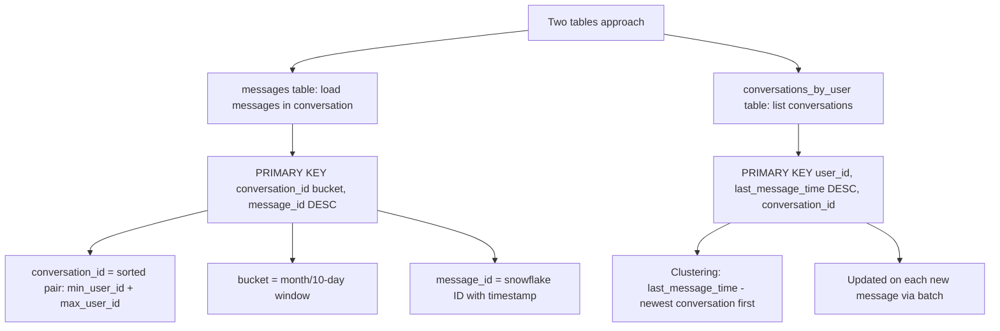

### Trade-off Decisions
| Decision | Option A | Option B | Chosen | Why |
|----------|----------|----------|--------|-----|
| Conversation ID | UUID | Sorted pair of user IDs | Sorted pair | Deterministic, no lookup table needed |
| Bucket size | Monthly | 10-day | 10-day | Active conversations may exceed 100MB/month |
| Message delete | Hard delete (tombstones) | Soft delete (is_deleted flag) | Soft delete | Tombstone accumulation is dangerous at message volume |
| Conversation list | Materialized in Cassandra | Redis sorted set | Redis sorted set | Cassandra conversation_by_user table has write amplification; Redis sorted set is simpler |

### Failure Modes
| Failure | Impact | Mitigation |
|---------|--------|------------|
| Bucket boundary queries | Missing messages at month boundary | Query current + previous bucket and merge |
| Tombstone accumulation from deletes | Read latency degradation | Soft delete flag; batch hard delete during off-peak with compaction |
| Hot conversations | High-volume chat on one partition | Bucket reduces partition size; active bucket stays in Cassandra cache |

### Concept References
→ [SQL vs NoSQL](../../../system-design/storage-and-databases/sql-vs-nosql)
→ [Database Sharding](../../../system-design/storage-and-databases/database-sharding)

---

## Q10: How does DynamoDB's single-table design map to wide-column concepts?

**Role:** Staff | **Difficulty:** ⚫ Staff | **Priority:** P3 | **Format:** Quick Answer

> **What the interviewer is testing:** Whether you see the philosophical similarity between DynamoDB's single-table design and wide-column stores, and can articulate the trade-offs of each approach.

### Answer in 60 seconds
- **DynamoDB single-table:** Store all entity types in one table; use PK/SK (partition key + sort key) to encode entity type and relationships; query by PK to get all related entities in one call
- **Wide-column similarity:** Both models store heterogeneous data under one partition key; Cassandra stores multiple column values per row, DynamoDB stores multiple items per partition key
- **Key difference:** Cassandra has a fixed-column schema per table; DynamoDB allows any attributes per item (truly schemaless within the table)
- **Why single-table:** Reduces operational complexity (one table = one billing unit, one backup, one IAM policy); enables single-request fetches of entity + all relationships

### Diagram

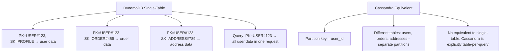

### Pitfalls
- ❌ **Single-table design without GSI planning:** Single-table requires Global Secondary Indexes for alternative access patterns — each GSI duplicates data and costs RCU/WCU; plan GSIs before commitment
- ❌ **Applying single-table for complex relational data:** Single-table works for 3–5 entity types with clear hierarchical relationships; 20+ entity types become unmaintainable — use separate tables

### Concept Reference
→ [SQL vs NoSQL](../../../system-design/storage-and-databases/sql-vs-nosql)
