# CAP Theorem — Real World

10 questions covering CAP theorem from fundamentals to Staff-level nuance.

---

## Q1: What does the CAP theorem state and what does it mean practically?

**Role:** Mid, Backend | **Difficulty:** 🟡 | **Priority:** P0 | **Format:** Quick Answer

> **What the interviewer is testing:** Whether you can translate an academic theorem into concrete engineering trade-offs.

### Answer in 60 seconds
- **CAP states:** A distributed system can guarantee at most 2 of 3: Consistency (every read sees the latest write), Availability (every request gets a non-error response), Partition Tolerance (the system continues operating despite network splits).
- **Practical reality:** Networks always partition eventually (hardware failure, packet loss, BGP misconfig). So you *must* tolerate partitions — the real choice is **CP vs AP** during a partition.
- **CP systems:** Return errors or block when partitioned (HBase, ZooKeeper, etcd). Latency p99 spikes to seconds during partition detection.
- **AP systems:** Serve stale or inconsistent data when partitioned (Cassandra, DynamoDB, CouchDB). Availability stays 99.9%+ but reads may be minutes behind.
- **Normal operations:** CAP does not apply — you have all three. The trade-off only activates during a partition.

### Diagram

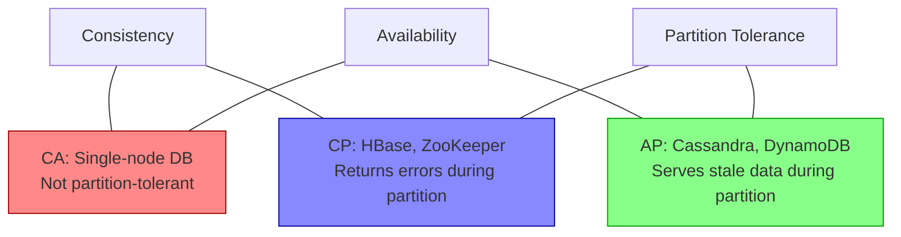

### Pitfalls
- ❌ **"We need all three":** Partition tolerance is non-negotiable in any multi-node system — you can't opt out of it.
- ❌ **Treating CAP as always active:** CAP only describes behavior *during a partition*, not steady-state behavior.
- ❌ **Ignoring latency:** PACELC shows that even without partitions, there's a latency vs consistency trade-off.

### Concept Reference
→ [Caching Strategies](../../../system-design/fundamentals/caching-strategies)

---

## Q2: What is the difference between CP and AP systems? Give 2 examples of each.

**Role:** Mid | **Difficulty:** 🟡 | **Priority:** P0 | **Format:** Quick Answer

> **What the interviewer is testing:** Whether you can map real databases to CAP positions and explain the operational consequence.

### Answer in 60 seconds
- **CP (Consistent + Partition-tolerant):** Sacrifices availability during partitions. Returns errors rather than stale data.
  - **HBase:** Blocks reads/writes during region server partition until recovered. Typical partition resolution time: 30–90 seconds.
  - **ZooKeeper:** Requires quorum (majority) to serve reads/writes. With 3 nodes, 1 partition = cluster halts writes.
- **AP (Available + Partition-tolerant):** Sacrifices strong consistency during partitions. Serves potentially stale data.
  - **Cassandra:** With `LOCAL_ONE` read/write, continues serving all requests during partition. Staleness can reach minutes.
  - **DynamoDB:** With eventual consistency reads, serves cached replica data during partition. Default read staleness: <1 second normally, unbounded during partitions.
- **Key signal in interviews:** Name the trade-off in terms users feel — errors vs stale data, not just abstract theory.

### Diagram

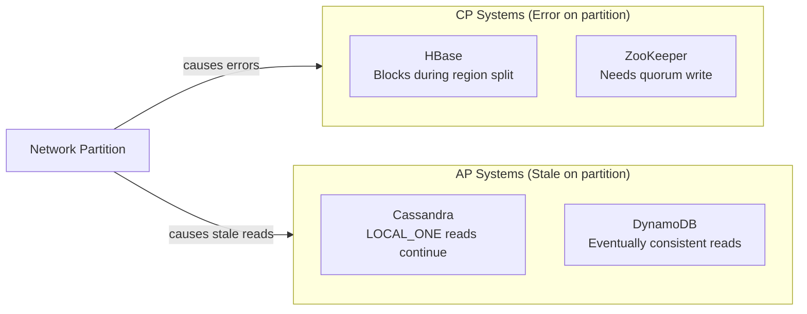

### Pitfalls
- ❌ **"MongoDB is CP":** MongoDB is CP *by default* with majority reads, but can be configured AP with `readPreference: nearest`. Configuration matters.
- ❌ **Forgetting consistency levels:** Cassandra can be CP with `QUORUM` reads — CP/AP is a setting, not a fixed property.

### Concept Reference
→ [Database Replication](../../../system-design/storage-and-databases/database-replication)

---

## Q3: Why does Cassandra choose AP over CP, and how does it handle conflicts?

**Role:** Senior | **Difficulty:** 🔴 | **Priority:** P0 | **Format:** Deep Dive

> **What the interviewer is testing:** Whether you understand Cassandra's leaderless replication model, tunable consistency, and conflict resolution strategies.

### Problem Constraints
| Dimension | Value |
|-----------|-------|
| Scale | 10K–1M writes/sec per cluster |
| Latency SLA | p99 < 10ms for writes |
| Replication | RF=3, typically across 3 AZs |
| Partition frequency | 1–4 network partitions/month in large DCs |

### Approach A — Last Write Wins (LWW)

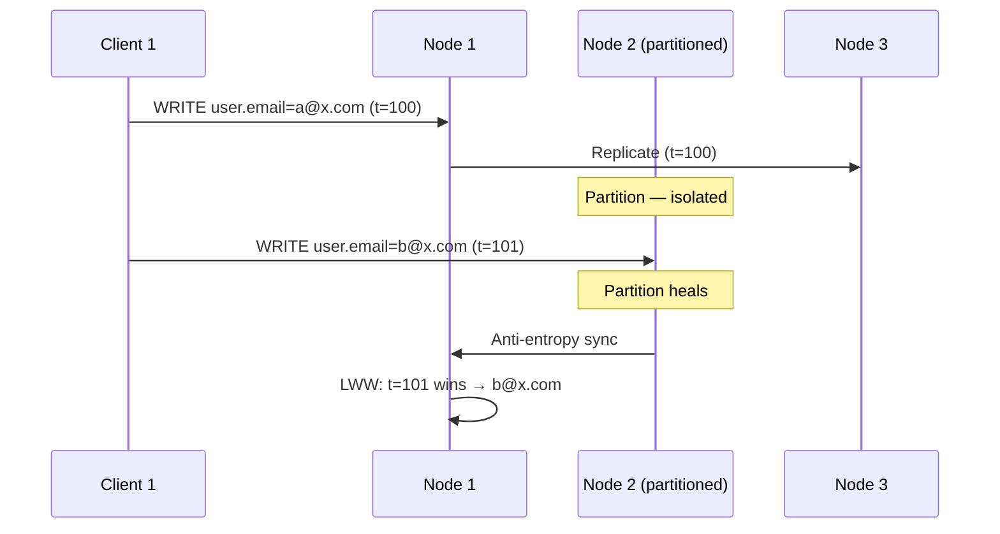

| Dimension | LWW | Read Repair |
|-----------|-----|-------------|
| Conflict resolution | Timestamp wins | Digest comparison + background fix |
| Clock skew risk | High (loses writes) | Low |
| Latency overhead | None | None on write path |
| Correctness | Loses concurrent writes | Fixes divergence eventually |

### Approach B — Tunable Consistency with Quorum

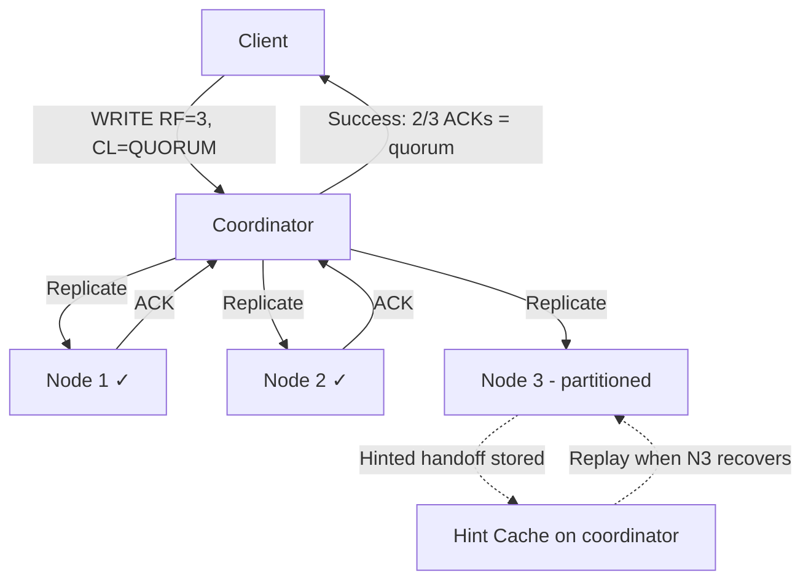

### Recommended Answer
Cassandra defaults to AP because its primary use cases (IoT telemetry, time-series, user activity) tolerate eventual consistency. The conflict resolution mechanism is **Last Write Wins using client-supplied timestamps** — the cell with the highest timestamp wins during read repair and compaction. This works *if* clocks are synchronized (NTP drift < 1ms is the target). For writes that cannot be lost, use `QUORUM` consistency level (requires 2/3 nodes in RF=3) which provides strong consistency at the cost of 1.5x latency (typically 5–15ms vs 3–8ms at `LOCAL_ONE`).

Hinted handoff stores writes for unreachable nodes for up to 3 hours (configurable) and replays them on recovery.

### What a great answer includes
- [ ] Explain tunable consistency levels (ONE, QUORUM, ALL) with latency numbers
- [ ] Describe LWW and its clock skew failure mode
- [ ] Mention hinted handoff for partition recovery
- [ ] Mention read repair and anti-entropy for eventual convergence
- [ ] State that RF=3, CL=QUORUM gives strong consistency (2 of 3 nodes agree)

### Pitfalls
- ❌ **"Cassandra is always AP":** With `CL=ALL`, Cassandra becomes CP. Always clarify the consistency level.
- ❌ **Ignoring clock skew:** LWW silently drops the write with the smaller timestamp. In multi-DC setups, clock drift can be 100ms+, causing data loss.
- ❌ **Forgetting hinted handoff expiry:** Hints older than `max_hint_window` (3 hours default) are discarded. Long partitions cause permanent divergence.

### Concept Reference
→ [Database Replication](../../../system-design/storage-and-databases/database-replication)

---

## Q4: What is a network partition and how likely is it in production?

**Role:** Mid | **Difficulty:** 🟡 | **Priority:** P1 | **Format:** Quick Answer

> **What the interviewer is testing:** Whether you treat partitions as theoretical or as operational reality.

### Answer in 60 seconds
- **Definition:** A network partition is when nodes in a distributed system cannot communicate — messages are dropped, delayed beyond timeout, or routing is broken — while the nodes themselves are still alive.
- **Causes:** Switch failure, NIC failure, BGP misconfig, congested links, cross-DC fiber cuts, firewall rules.
- **Real frequency:** Google's 2011 paper ("Spanner") reported cross-datacenter partitions lasting 30 seconds occurring every few months. Within a DC, AWS reports ~0.1% of instances experience connectivity issues per month. With 100 nodes, expect 1–2 partition events/month.
- **Timeout = partition detection:** A node is considered partitioned when heartbeat timeouts fire. ZooKeeper defaults to 6 seconds session timeout; etcd default is 5 seconds.
- **Implication:** At 1000-node scale (Netflix, Uber), assume at least 1 partition/week. Design accordingly.

### Diagram

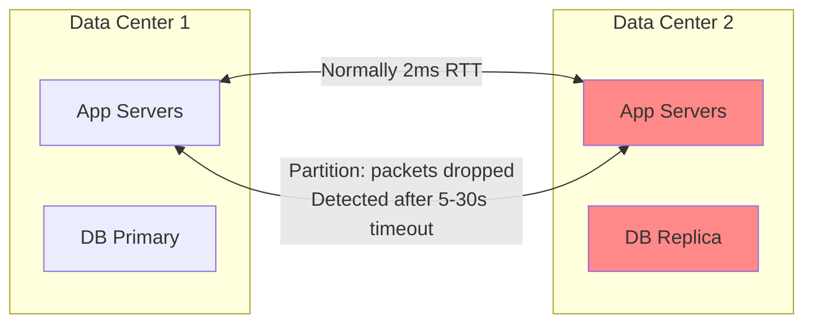

### Pitfalls
- ❌ **"Partitions only happen in bad networks":** AWS cross-AZ latency is typically 1–3ms, but partitions still occur due to software issues (misconfigured security groups, application-level timeouts).
- ❌ **"Our timeout is 1ms so we detect immediately":** Very short timeouts cause false positives — healthy nodes appear partitioned under load spikes.

### Concept Reference
→ [Database Replication](../../../system-design/storage-and-databases/database-replication)

---

## Q5: How does ZooKeeper choose CP over AP and what are the trade-offs?

**Role:** Senior | **Difficulty:** 🔴 | **Priority:** P1 | **Format:** Quick Answer

> **What the interviewer is testing:** Whether you understand ZooKeeper's ZAB consensus protocol and the operational consequences of CP design.

### Answer in 60 seconds
- **CP choice:** ZooKeeper uses ZAB (ZooKeeper Atomic Broadcast) — a leader-based consensus protocol. All writes go to the leader and must be committed by a quorum (majority) of nodes before ACKing to clients.
- **Availability sacrifice:** With 3 nodes, losing 2 (or a network split where leader is isolated) stops all writes. With 5 nodes, losing 3 nodes stops all writes. This is the CP trade-off.
- **Read consistency:** By default, reads are served from any node (may be stale). Calling `sync()` before a read forces consistency with the leader — but adds 1–5ms latency.
- **Session timeouts:** If a client cannot reach ZooKeeper within the session timeout (default 30 seconds), its ephemeral nodes are deleted. This triggers leader re-election signals.
- **Throughput limit:** ZooKeeper handles ~100K read requests/sec and ~10K write requests/sec per cluster. This is why it's used for coordination (locks, config), not data storage.

### Diagram

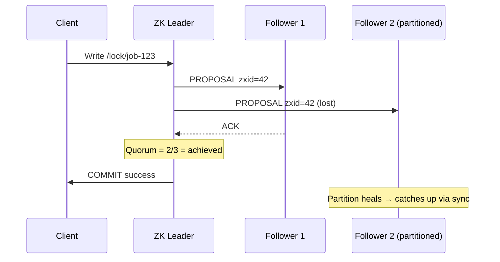

### Pitfalls
- ❌ **Using ZooKeeper as a data store:** ZooKeeper's per-znode limit is 1MB. It's designed for small coordination metadata, not payload data.
- ❌ **Ignoring CP during leader election:** Leader election itself takes 100–2000ms. During this window, ZooKeeper is unavailable for writes — use etcd (300–500ms elections) for latency-sensitive use cases.

### Concept Reference
→ [Database Replication](../../../system-design/storage-and-databases/database-replication)

---

## Q6: How do you design a system that gracefully degrades during network partitions?

**Role:** Senior | **Difficulty:** 🔴 | **Priority:** P1 | **Format:** Deep Dive

> **What the interviewer is testing:** Whether you can translate CAP theory into concrete product decisions — fallback behaviors, circuit breakers, and user experience during degradation.

### Problem Constraints
| Dimension | Value |
|-----------|-------|
| System | E-commerce product catalog + cart |
| Normal traffic | 50K req/sec |
| Partition scenario | Primary DB unreachable from app layer |
| Degraded SLA | Serve reads with <30s stale data; block writes or queue them |

### Approach A — Fail Fast (CP-like behavior)

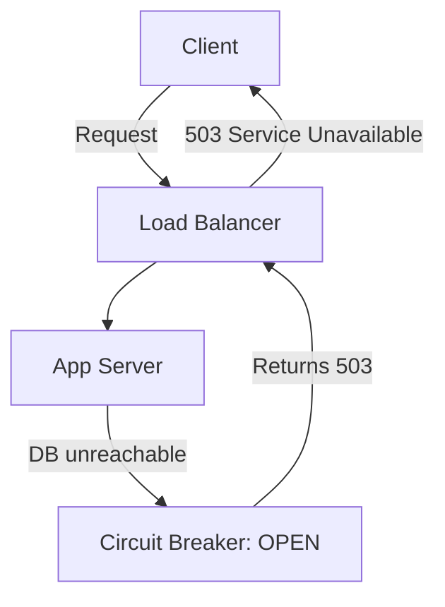

| Dimension | Fail Fast | Graceful Degradation |
|-----------|-----------|---------------------|
| User experience | Hard error | Stale data or partial content |
| Data safety | High | Medium (stale reads) |
| Implementation complexity | Low | High |
| Suitable for | Financial writes | Catalog reads |

### Approach B — Graceful Degradation (AP-like behavior)

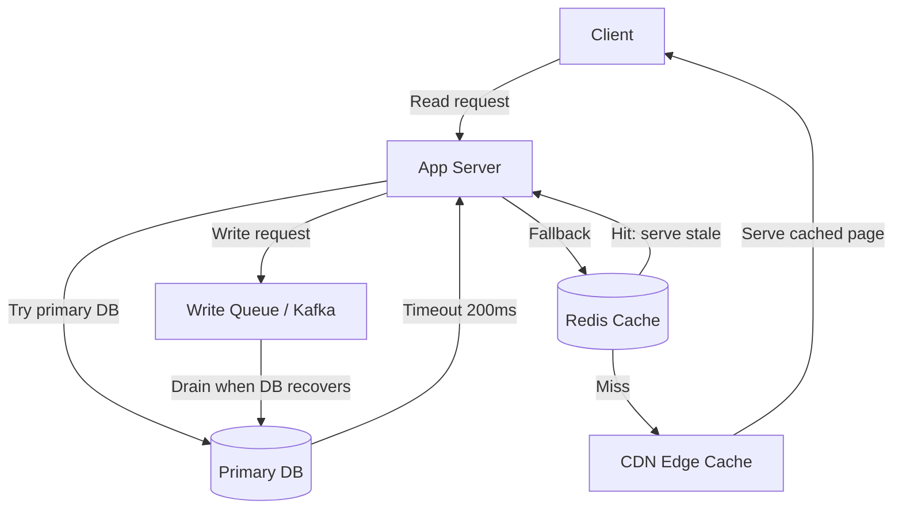

### Recommended Answer
Design separate degradation strategies for reads vs writes:

**Reads:** Use multi-level fallback — primary DB → read replica → Redis cache → CDN. Accept stale data (TTL 30 seconds) and display a "prices may not reflect latest updates" banner. Circuit breaker opens after 5 consecutive timeouts (200ms threshold), cutting over to cache within 1 second.

**Writes (cart, orders):** Queue to Kafka or SQS with a client-visible acknowledgement ("Your order is being processed"). Drain the queue when the DB recovers. This is the "optimistic availability" pattern.

**Monitoring triggers:** PagerDuty alert if cache miss rate > 20% (indicates cache is also degrading) or write queue depth > 10K (drain can't keep up).

### What a great answer includes
- [ ] Separate read vs write degradation strategies
- [ ] Circuit breaker with specific thresholds (e.g., 5 failures in 10 seconds)
- [ ] User-visible messaging ("stale data" banners)
- [ ] Write queue with bounded depth and alert thresholds
- [ ] Recovery procedure — how to drain queued writes without duplicates

### Pitfalls
- ❌ **Single degradation strategy for all traffic:** Financial writes should fail fast (CP); product reads can serve stale (AP).
- ❌ **Unbounded write queues:** If the partition lasts hours, a write queue can grow to millions of items. Set max depth and reject new writes when full.
- ❌ **Ignoring cache warming:** A cold cache during a partition provides zero benefit. Ensure cache TTL > expected partition duration.

### Concept Reference
→ [Caching Strategies](../../../system-design/fundamentals/caching-strategies)

---

## Q7: What is the PACELC theorem and how does it extend CAP?

**Role:** Senior | **Difficulty:** 🔴 | **Priority:** P2 | **Format:** Quick Answer

> **What the interviewer is testing:** Whether you know that CAP only describes partition behavior — PACELC captures the latency vs consistency trade-off in normal operation.

### Answer in 60 seconds
- **PACELC:** If there is a Partition (P), choose between Availability (A) or Consistency (C). Else (E) — in normal operation — choose between Latency (L) or Consistency (C).
- **The insight:** Even without partitions, replication adds latency. A synchronous replica commit adds 1–10ms. PACELC captures this *always-present* trade-off that CAP ignores.
- **Real examples:**
  - **DynamoDB:** PA/EL — available during partitions, low latency (1–9ms p99) in normal ops (eventual consistency)
  - **Spanner:** PC/EC — consistent during partitions, higher latency (5–10ms p99) with external consistency
  - **Cassandra with QUORUM:** PA/EC — the EL vs EC is tunable per query
- **Interview signal:** Mention PACELC when asked about "what's the trade-off beyond CAP" or when discussing databases that claim strong consistency with low latency.

### Diagram

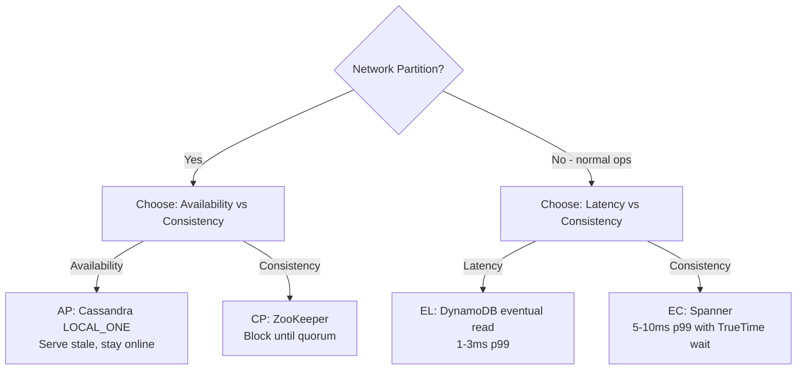

### Pitfalls
- ❌ **"CAP is enough to describe trade-offs":** CAP says nothing about latency in normal operation. A system can be CP and still have 1ms reads — or 100ms reads. PACELC forces the latency discussion.
- ❌ **Assuming EL and EC are binary:** They exist on a spectrum. Cassandra's QUORUM gives EC at 2x the EL latency.

### Concept Reference
→ [Database Replication](../../../system-design/storage-and-databases/database-replication)

---

## Q8: How does DynamoDB let you choose consistency per-request?

**Role:** Staff | **Difficulty:** ⚫ | **Priority:** P2 | **Format:** Quick Answer

> **What the interviewer is testing:** Whether you understand DynamoDB's replication model and the cost implications of consistency choices.

### Answer in 60 seconds
- **DynamoDB replication:** Each item is replicated to 3 storage nodes across 3 AZs. One node is the "leader" for that partition.
- **Eventually consistent reads (default):** Read from any replica. Staleness window: typically <1 second. Cost: 0.5 read capacity units per 4KB. Latency: 1–3ms p99.
- **Strongly consistent reads:** Read from the leader only. Guaranteed to see all writes committed before the read. Cost: 1.0 read capacity unit per 4KB (2x cost). Latency: 5–10ms p99. Not available on global tables.
- **Per-request selection:** Set `ConsistentRead: true` on individual `GetItem` or `Query` calls. Mix within the same application — use strong consistency for account balance reads, eventual for activity feeds.
- **Transactional reads:** `TransactGetItems` always strongly consistent. 2x the RCU cost of standard reads.
- **Practical guidance:** Default to eventual consistency (50% cost saving). Only use strong consistency when your application logic requires seeing the result of a previous write in the same transaction flow.

### Diagram

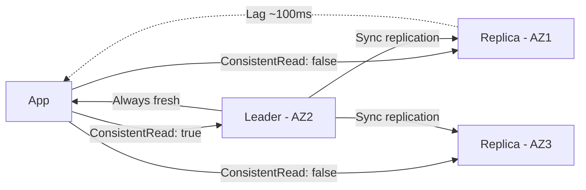

### Pitfalls
- ❌ **Using strong reads by default to "be safe":** 2x cost and 3x latency. At 100K reads/sec, this doubles your DynamoDB bill.
- ❌ **Strong reads on DynamoDB Global Tables:** Not supported. Cross-region replication lag is 1–2 seconds, and strong reads revert to eventual.

### Concept Reference
→ [Database Replication](../../../system-design/storage-and-databases/database-replication)

---

## Q9: How did Discord choose between CP and AP for their messaging system?

**Role:** Staff | **Difficulty:** ⚫ | **Priority:** P2 | **Format:** Deep Dive

> **What the interviewer is testing:** Whether you can analyze a real company's CAP trade-off decision and reason about the product requirements that drove it.

### Problem Constraints
| Dimension | Value |
|-----------|-------|
| Scale | 100M users, 4B messages/day (2022) |
| Message storage | Cassandra (then ScyllaDB migration) |
| Latency SLA | p99 < 100ms for message send |
| Consistency requirement | Messages must appear in order within a channel |

### Approach A — CP with Strong Consistency (rejected)

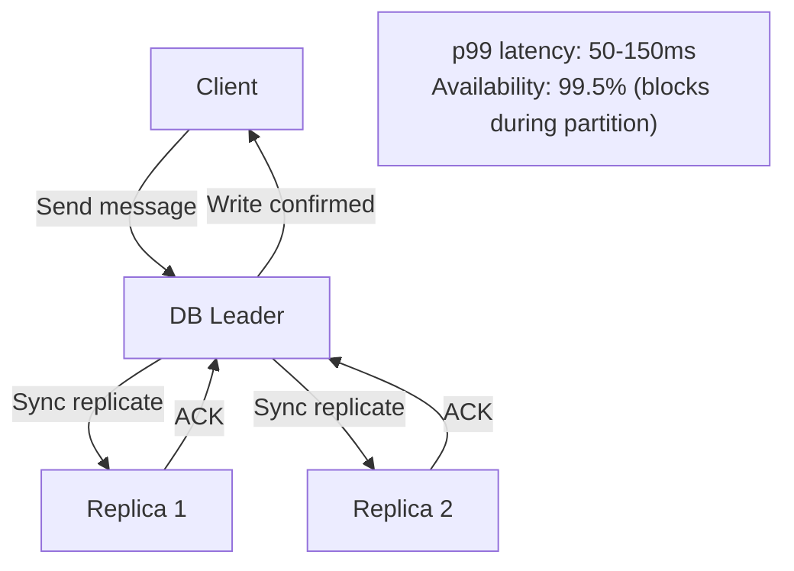

### Approach B — AP with Cassandra (chosen)

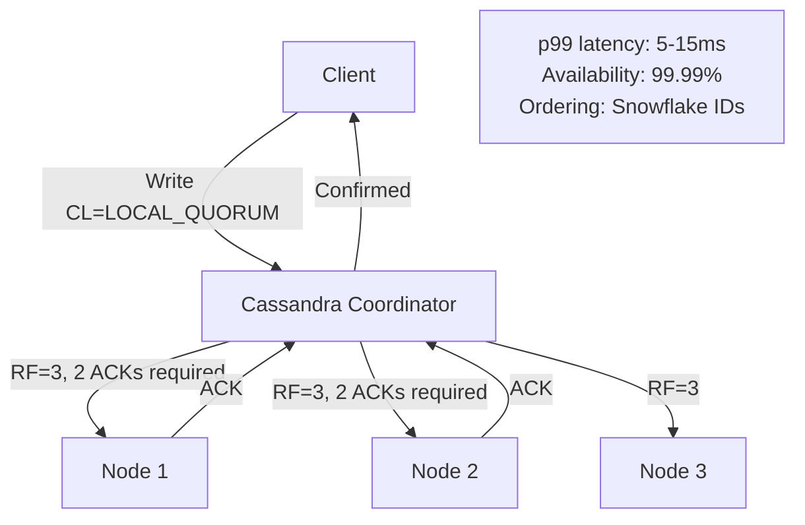

| Dimension | CP (SQL) | AP (Cassandra) |
|-----------|----------|----------------|
| Write latency p99 | 50–150ms | 5–15ms |
| Availability during partition | 99.5% | 99.99% |
| Message ordering | Database-enforced | Application-enforced (Snowflake) |
| Scale ceiling | ~1M writes/sec (sharded) | 10M+ writes/sec |
| Conflict risk | None | Low (monotonic Snowflake IDs) |

### Recommended Answer
Discord chose **AP with Cassandra** (later migrated to ScyllaDB for better p99 tails). The product decision: **seeing a message 100ms late is better than a 503 error**. Messaging apps are AP by nature — users tolerate slight delivery delays but not unavailability.

Message ordering is guaranteed by application-level Snowflake IDs (64-bit IDs with millisecond timestamp prefix) rather than database-level ordering. This avoids distributed transaction overhead entirely.

The primary consistency mechanism: Cassandra's `LOCAL_QUORUM` (2 of 3 nodes in the same DC) ensures the message is durable before ACKing to the sender. Cross-DC replication is async (best-effort, ~1 second lag).

Discord migrated from Cassandra to ScyllaDB in 2023, reducing p99 read latency from 40–125ms to 15ms and cutting node count from 177 to 72 — a 3x cost reduction.

### What a great answer includes
- [ ] Name the product requirement driving AP choice (latency + availability > strict consistency)
- [ ] Explain Snowflake ID ordering as the consistency mechanism
- [ ] Mention LOCAL_QUORUM as the practical consistency level
- [ ] Include the ScyllaDB migration and its p99 improvement
- [ ] Quantify availability difference (99.5% vs 99.99%)

### Pitfalls
- ❌ **"AP means no consistency":** Cassandra with LOCAL_QUORUM gives strong consistency within a DC. True AP behavior only occurs during cross-DC partition.
- ❌ **Ignoring application-level ordering:** Without Snowflake IDs, Cassandra's LWW would produce incorrect message ordering under clock skew.

### Concept Reference
→ [Database Replication](../../../system-design/storage-and-databases/database-replication)

---

## Q10: Why is "CA" (consistent and available without partition tolerance) a myth in distributed systems?

**Role:** Staff | **Difficulty:** ⚫ | **Priority:** P3 | **Format:** Quick Answer

> **What the interviewer is testing:** Whether you understand why CA systems don't exist at scale — any networked system must handle partitions.

### Answer in 60 seconds
- **The myth:** "CA" appears in CAP's triangle, implying systems can be both consistent and available by sacrificing partition tolerance. This is misleading.
- **Why CA doesn't exist:** To sacrifice partition tolerance, a system must *not* be distributed — it's a single node. The moment you have 2+ nodes connected by a network, packets can drop, switches can fail, and you have a partition. You cannot opt out of partitions; you can only choose how to respond.
- **What "CA" databases actually are:** Traditional RDBMS like PostgreSQL or MySQL *on a single node* — they are consistent and available, but not distributed. When you add replicas, you immediately face CAP.
- **The nuance:** Some papers describe CA as "systems that do not tolerate partitions" — meaning they shut down rather than serve during a partition. This is just CP with a different availability definition.
- **Eric Brewer's own clarification (2012):** "The CA option is not really available. The choice is always between CP and AP."

### Diagram

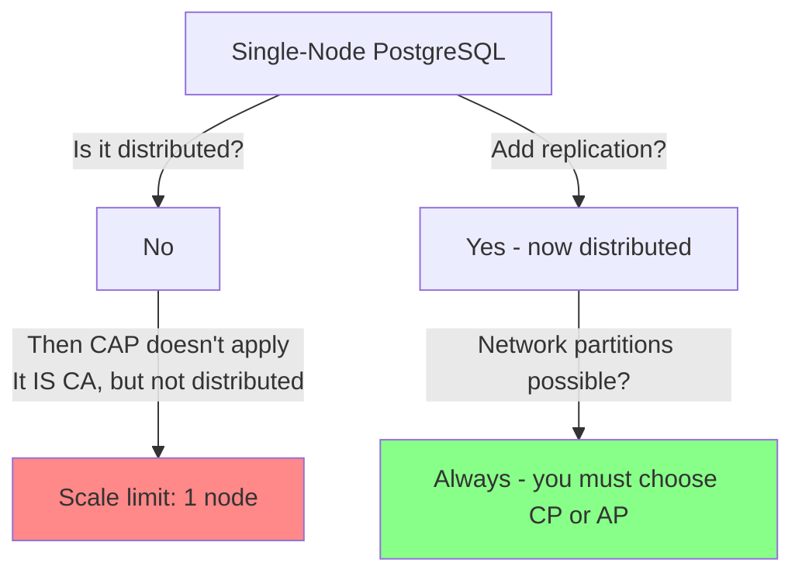

### Pitfalls
- ❌ **Citing "CA" databases in system design:** Examiners know CA doesn't exist. Saying "I'll use a CA database" signals a CAP misunderstanding.
- ❌ **Confusing CA with "high availability":** HA means multi-node redundancy — which reintroduces CAP. True CA is single-node, which is a SPOF.

### Concept Reference
→ [Database Replication](../../../system-design/storage-and-databases/database-replication)
