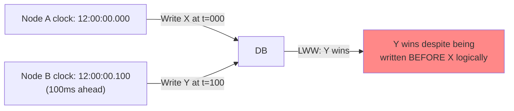
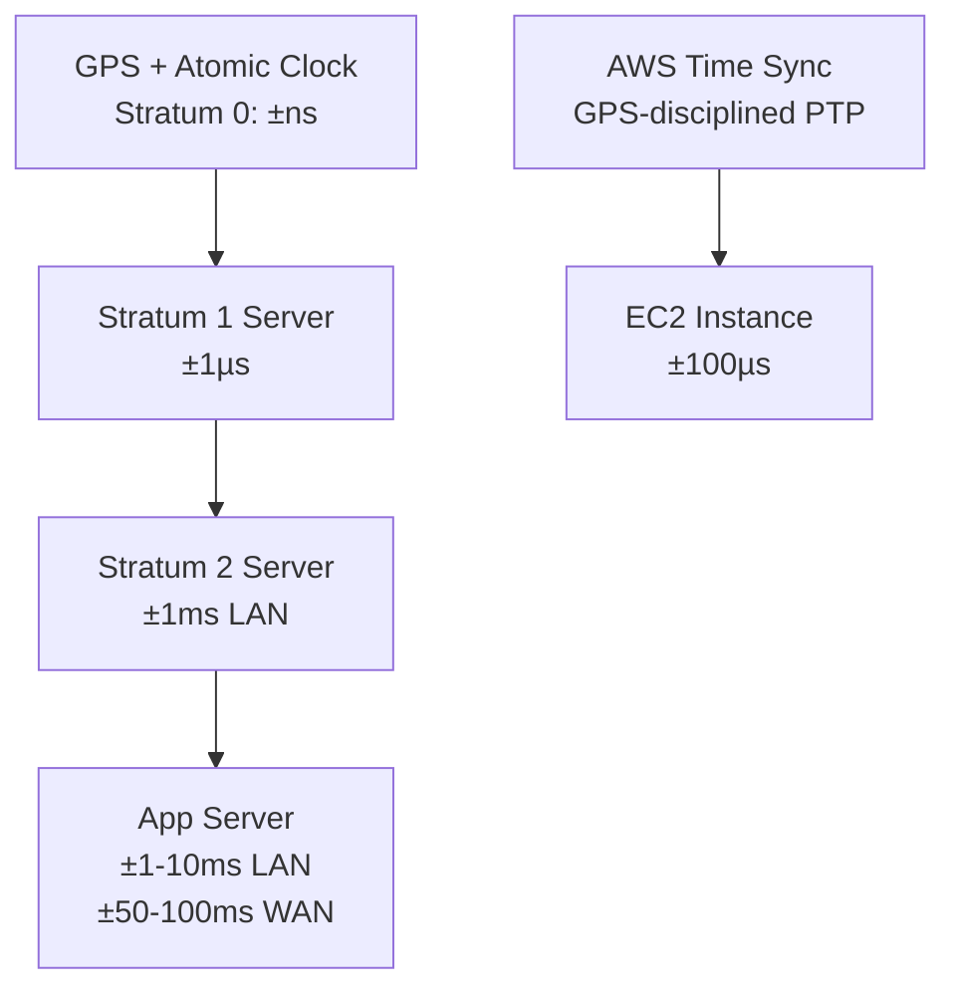
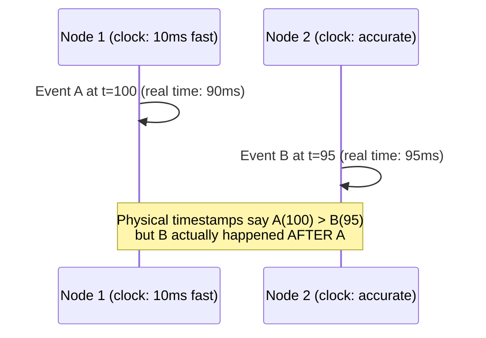
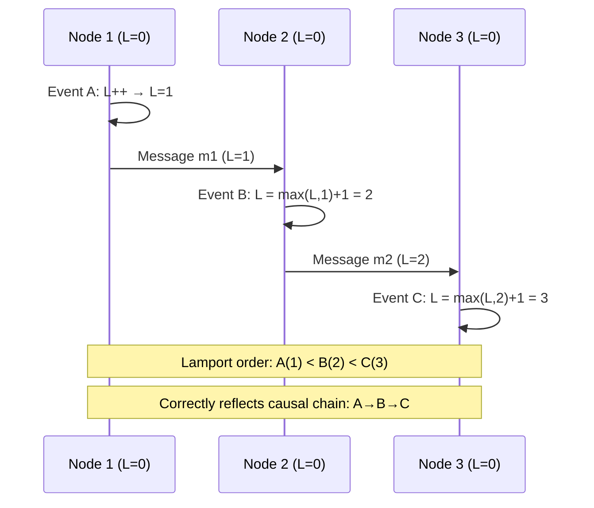
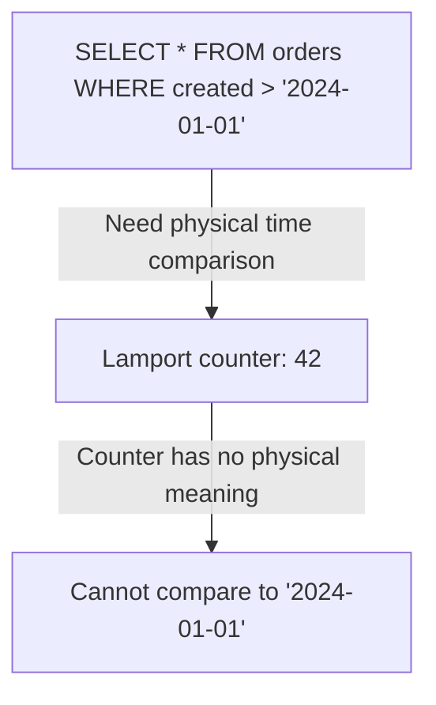
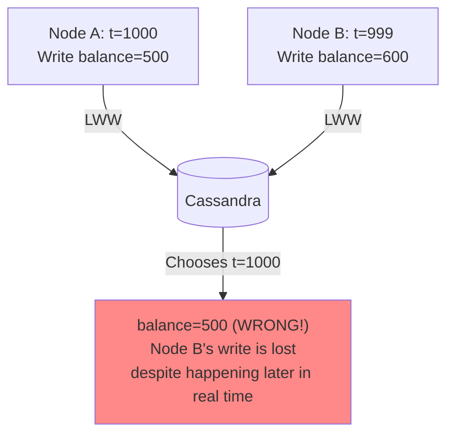
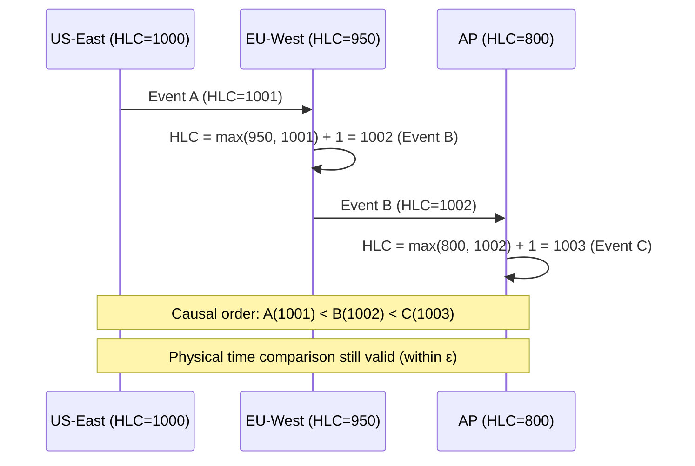
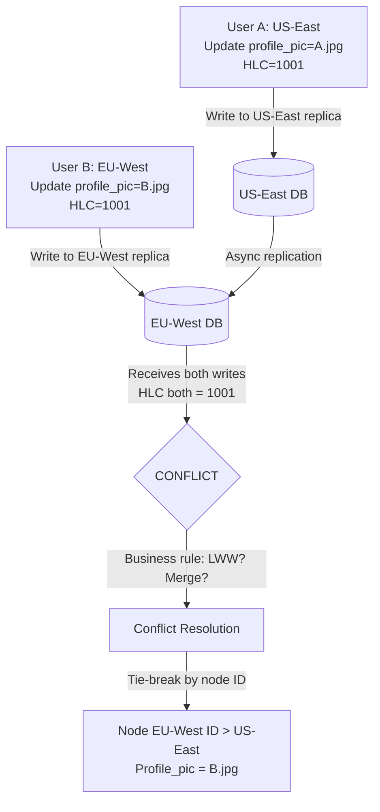

# Clock Synchronization

10 questions covering clock drift, logical clocks, Hybrid Logical Clocks, and Google's TrueTime.

---

## Q1: Why do clocks drift in distributed systems and why does it matter?

**Role:** Mid | **Difficulty:** 🟡 | **Priority:** P0 | **Format:** Quick Answer

> **What the interviewer is testing:** Whether you understand that physical clocks are unreliable and the practical consequences of clock skew.

### Answer in 60 seconds
- **Clock drift:** Physical oscillators in CPUs and network cards have manufacturing tolerances — typical drift is 10–200 parts per million (ppm). At 200ppm, a clock drifts 17 seconds per day. Drift accumulates unless corrected.
- **NTP correction:** Network Time Protocol syncs clocks to time servers, but correction is imperfect. Typical NTP accuracy: ±1–10ms on LAN, ±50ms on WAN. Google Public NTP claims ±1ms.
- **Why it matters:**
  1. **Last-write-wins conflict resolution** (Cassandra LWW): two writes with identical meaning but from different nodes — the wrong one wins if clocks disagree by > 1ms
  2. **Distributed transaction ordering**: Spanner uses clock timestamps for snapshot reads — incorrect clock = incorrect snapshot
  3. **Lease expiry**: A node holds a lease until timestamp T. If the node's clock runs fast, it thinks the lease hasn't expired when the server already revoked it
  4. **Log correlation**: Correlating logs across services by timestamp fails if node A's clock is 500ms ahead of node B
- **Safe assumption:** In production, assume up to ±100ms clock skew between hosts in different DCs. Design systems that tolerate this.

### Diagram



### Pitfalls
- ❌ **Using `System.currentTimeMillis()` for event ordering:** System clocks can go backwards after NTP sync. Use monotonic clocks for measuring duration; use logical clocks for event ordering.
- ❌ **"NTP makes clocks accurate":** NTP reduces drift but doesn't eliminate it. At best, NTP gives ±1ms in ideal conditions — not 0ms. Design for uncertainty, not precision.

### Concept Reference
→ [Database Replication](../../../system-design/storage-and-databases/database-replication)

---

## Q2: What is NTP and what precision can you realistically expect?

**Role:** Mid | **Difficulty:** 🟡 | **Priority:** P1 | **Format:** Quick Answer

> **What the interviewer is testing:** Whether you know NTP's practical accuracy limits and alternatives for precision time.

### Answer in 60 seconds
- **NTP (Network Time Protocol):** Synchronizes system clocks to UTC using a hierarchy of time servers (Stratum 0 = atomic clocks/GPS, Stratum 1 = servers directly connected to Stratum 0, etc.).
- **Practical accuracy:**
  - Same LAN, Stratum 2: ±1–5ms typical
  - Cross-DC over internet: ±50–100ms typical
  - Google Public NTP (time.google.com): ±1ms claimed
  - AWS Time Sync Service: ±100µs on EC2 (uses GPS + PPS)
- **Precision Time Protocol (PTP):** IEEE 1588 standard. Uses hardware timestamping to achieve ±1µs in dedicated networks. Used in financial HFT, industrial control. Requires hardware support (specialized NICs).
- **Google TrueTime:** GPS + atomic clocks at every data center. Provides a time interval [earliest, latest] with uncertainty ε ≈ 7ms. More precise than NTP; less precise than PTP.
- **Real-world implication:** For Cassandra LWW with multi-DC replication, assume 100ms clock skew potential. Write timestamps within 100ms of each other may be reordered. Use application-level sequence numbers for strict ordering.

### Diagram



### Pitfalls
- ❌ **Running without NTP and relying on VM clocks:** VM clocks drift much faster than physical clocks (up to 1 second/minute under heavy load). Always run NTP; preferably use AWS Time Sync or equivalent.
- ❌ **Confusing NTP precision with accuracy:** NTP can be precise (consistent) but inaccurate (consistently wrong). A stratum 3 server with bad network path has high uncertainty.

### Concept Reference
→ [Database Replication](../../../system-design/storage-and-databases/database-replication)

---

## Q3: What are Lamport timestamps and how do they provide causal ordering?

**Role:** Senior | **Difficulty:** 🔴 | **Priority:** P1 | **Format:** Deep Dive

> **What the interviewer is testing:** Whether you understand Lamport's happens-before relation and why logical clocks solve ordering without synchronized physical clocks.

### Problem Constraints
| Dimension | Value |
|-----------|-------|
| System | 3 nodes, no clock synchronization |
| Problem | Determine if event A happened before event B |
| Solution | Lamport logical clock — monotonically increasing counter |
| Property | If A→B (A happens before B), then L(A) < L(B) |

### Approach A — Physical timestamps (unreliable)



### Approach B — Lamport timestamps (correct causal ordering)



| Property | Physical Clocks | Lamport Timestamps |
|----------|----------------|-------------------|
| Clock sync required | Yes (±1ms or better) | No |
| Causal ordering | Unreliable (skew) | Guaranteed: if A→B then L(A) < L(B) |
| Concurrent events | May order incorrectly | Incomparable (L(A) < L(B) doesn't prove A→B) |
| Use case | Timestamps for humans | Determining causal ordering |

### Recommended Answer
Lamport's insight: physical time is irrelevant for causal ordering. What matters is the "happens-before" relation: A → B if A and B are on the same node and A comes first, OR A sends a message and B receives it, OR transitively.

**Algorithm:** Each node maintains counter L. On local event: L++. On send: include current L in message. On receive: L = max(local_L, msg_L) + 1.

**Limitation:** Lamport clocks only give partial ordering. L(A) < L(B) does NOT prove A caused B — it could be that A and B are concurrent (causally unrelated) but the counter happens to order them. Vector clocks solve this.

### What a great answer includes
- [ ] Define the happens-before relation (→)
- [ ] State Lamport's guarantee: A → B implies L(A) < L(B)
- [ ] Explain the converse is NOT true (L(A) < L(B) doesn't imply A → B)
- [ ] Describe the algorithm: increment on local event, max+1 on receive
- [ ] Name the limitation: can't detect concurrent events

### Pitfalls
- ❌ **"Lamport timestamps fully order events":** Lamport timestamps give a consistent total order (no cycles), but the order may not reflect causality for concurrent events. Use vector clocks to detect true concurrency.
- ❌ **Forgetting to include timestamp in messages:** If the sender doesn't include its Lamport timestamp in the message, the receiver cannot update its clock, breaking causal ordering.

### Concept Reference
→ [Vector Clocks](vector-clocks)

---

## Q4: What are vector clocks and what do they add over Lamport timestamps?

**Role:** Senior | **Difficulty:** 🔴 | **Priority:** P1 | **Format:** Quick Answer

> **What the interviewer is testing:** Whether you understand vector clocks' ability to detect concurrency — the critical property Lamport timestamps lack.

### Answer in 60 seconds
- **Vector clock:** Each node maintains a vector of counters — one per node in the system. `[N1:2, N2:3, N3:0]` means "I've seen 2 events from N1, 3 from N2, 0 from N3."
- **Update rules:** On local event: increment own position. On send: include full vector. On receive: element-wise max + increment own position.
- **Causal comparison:** VC(A) < VC(B) if *all* positions in A ≤ B and *at least one* is strictly less. A and B are **concurrent** if neither VC(A) ≤ VC(B) nor VC(B) ≤ VC(A).
- **What vector clocks add over Lamport:** They can detect that two events are concurrent (causally unrelated). Lamport timestamps impose a total order on concurrent events arbitrarily.
- **Practical use:** Amazon Dynamo used vector clocks to detect when two write versions of the same key were concurrent (neither caused the other) and required conflict resolution.

### Diagram

```mermaid
graph LR
  A["Node 1: Event A\nVC=[1,0,0]"] -->|Send msg with VC=[1,0,0]| B["Node 2: Event B\nVC=[1,1,0]"]
  C["Node 3: Event C\nVC=[0,0,1]"]

  B -->|VC=[1,1,0] vs C=[0,0,1]| Compare{Compare}
  Compare -->|Neither ≤ other| Concurrent[A and C are CONCURRENT]
```

### Pitfalls
- ❌ **Vector clock size grows with node count:** With 1000 nodes, each vector clock is 1000 entries. Not practical at large scale — use version vectors or dotted version vectors for practical systems.
- ❌ **Confusing vector clocks with physical timestamps:** Vector clocks are logical counters, not timestamps. You cannot use them to answer "what time did this happen?"

### Concept Reference
→ [Vector Clocks](vector-clocks)

---

## Q5: What are Hybrid Logical Clocks (HLC) and why does CockroachDB use them?

**Role:** Senior | **Difficulty:** 🔴 | **Priority:** P2 | **Format:** Deep Dive

> **What the interviewer is testing:** Whether you know HLC as the practical middle ground between physical and logical clocks — used in production NewSQL databases.

### Problem Constraints
| Dimension | Value |
|-----------|-------|
| Database | CockroachDB (distributed SQL) |
| Requirement 1 | Causal ordering (like Lamport/vector clocks) |
| Requirement 2 | Timestamp close to physical time (for TTL, queries) |
| Requirement 3 | No global synchronization (must work with NTP) |

### Approach A — Pure Lamport clocks (insufficient for SQL)



### Approach B — HLC (physical + logical component)

```mermaid
graph TD
  subgraph HLC["HLC = Physical Component + Logical Component"]
    PT[Physical time component<br/>max(physical_now, msg.pt)]
    LC[Logical counter<br/>Increments only when physical time matches]
  end
  PT --> Compare[If pt(A) ≠ pt(B): use physical time to order]
  LC --> Compare2[If pt(A) = pt(B): use logical counter to break tie]
  Compare --> Result[Causal + close to physical time]
```

| Property | Physical Clock | Lamport | HLC |
|----------|---------------|---------|-----|
| Causal ordering | No (can disagree) | Yes | Yes |
| Close to physical time | Yes | No | Yes (within ε) |
| Handles NTP jumps | Poorly | Yes | Yes (takes max) |
| Clock comparison with wall clock | Direct | Not meaningful | Direct |

### Recommended Answer
**HLC = max(physical_now, msg.pt) + logical counter.** The physical component ensures HLC stays close to wall-clock time (within the NTP uncertainty bound ε ≈ 500ms). The logical counter handles events that happen faster than the physical clock's resolution, preserving causality.

CockroachDB uses HLC for transaction timestamps. This enables: (1) historical queries (`AS OF SYSTEM TIME '2024-01-01'`) — timestamps are meaningful physical times; (2) Distributed transaction ordering — HLC ensures if T1 commits before T2 starts, T1's commit timestamp < T2's start timestamp (causal); (3) Garbage collection of old MVCC versions — HLC timestamps are comparable to wall clock for TTL-based cleanup.

CockroachDB's max clock skew assumption: 500ms. If nodes' clocks skew by > 500ms, CockroachDB aborts affected transactions and requires clock fix.

### What a great answer includes
- [ ] HLC = physical component + logical counter
- [ ] Physical component tracks max(local clock, received PT)
- [ ] Logical counter breaks ties when physical components match
- [ ] CockroachDB's 500ms max clock skew assumption
- [ ] Compare to Spanner's TrueTime (hardware-enforced vs NTP-based)

### Pitfalls
- ❌ **"HLC eliminates clock skew problems":** HLC assumes clock skew < ε (500ms for CockroachDB). If skew exceeds ε, causal ordering is violated. HLC reduces skew sensitivity but doesn't eliminate it.
- ❌ **Confusing HLC with TrueTime:** TrueTime uses GPS + atomic clocks for hardware-enforced precision. HLC uses NTP with software-based skew bounding. TrueTime is more precise but requires special hardware.

### Concept Reference
→ [Database Replication](../../../system-design/storage-and-databases/database-replication)

---

## Q6: How does Google Spanner's TrueTime API work and what is the uncertainty interval?

**Role:** Senior | **Difficulty:** 🔴 | **Priority:** P2 | **Format:** Quick Answer

> **What the interviewer is testing:** Whether you understand TrueTime's GPS+atomic clock approach and how Spanner uses it for external consistency.

### Answer in 60 seconds
- **TrueTime API:** Returns not a point in time but an interval `[earliest, latest]` = `TT.now()`. The guarantee: actual current time is within this interval. Typical uncertainty ε = 7ms (p99.9 < 10ms).
- **Hardware setup:** Every Google data center has GPS receivers and atomic clocks. GPS receiver provides microsecond-accurate time; atomic clock serves as backup during GPS signal interruption. Multiple time sources are cross-checked.
- **Why an interval:** Network latency between the app server and the time masters + atomic clock drift within the interval creates irreducible uncertainty. Exposing this uncertainty explicitly is honest and allows the algorithm to reason about it.
- **Commit wait:** Spanner assigns commit timestamp t from TrueTime. Before returning to the client, Spanner waits until `TT.after(t)` = true (current time is definitely past t). This ensures no future transaction can have a timestamp < t.
- **External consistency achieved:** If T1 commits before T2 starts (in real time), T1's commit timestamp < T2's start timestamp. This is global linearizability across all Spanner nodes worldwide.

### Diagram

```mermaid
graph TD
  Commit[Commit transaction] -->|TT.now() = [100, 107]<br/>choose t = 107| Choose[Commit timestamp = 107ms]
  Choose -->|Wait until TT.after(107) = true<br/>~7ms wait| Wait[Wall clock > 107ms]
  Wait -->|Return to client| Client
  Client -->|Start new transaction T2| T2
  T2 -->|TT.now() = [109, 116]<br/>t2 > 107 guaranteed| Order[T2 sees T1's writes ✓]
```

### Pitfalls
- ❌ **"TrueTime removes the need for 2PC":** Spanner still uses 2PC internally for cross-shard transactions. TrueTime provides commit ordering, not atomicity. The two are orthogonal.
- ❌ **Using TrueTime for sub-millisecond ordering:** TrueTime uncertainty is 7ms. Two events within 7ms of each other cannot be reliably ordered by TrueTime — Spanner waits for the uncertainty to resolve.

### Concept Reference
→ [Database Replication](../../../system-design/storage-and-databases/database-replication)

---

## Q7: How does clock skew cause bugs in distributed transactions?

**Role:** Staff | **Difficulty:** ⚫ | **Priority:** P2 | **Format:** Quick Answer

> **What the interviewer is testing:** Whether you can enumerate concrete clock skew bugs and their symptoms.

### Answer in 60 seconds
- **Bug 1 — Lost write (Cassandra LWW):** Node A writes `balance=500` at t=1000. Node B writes `balance=600` at t=999 (B's clock is 2ms behind). LWW chooses t=1000 (A's write). Result: balance=500, but the correct latest value is 600.
- **Bug 2 — Stale lease:** A distributed lock holder believes its lease expires at t=10000. The lock server's clock reads t=10001. Server revokes the lock. The lock holder continues operating as if it holds the lock. Result: two processes simultaneously believe they hold the lock.
- **Bug 3 — Read-your-writes violation:** Transaction T1 commits at timestamp t=100 (according to leader). T2 starts at timestamp t=99 (according to follower with lagging clock). T2 does a snapshot read at t=99 and doesn't see T1's writes. Result: a read that immediately follows a write doesn't see the write.
- **Bug 4 — Incorrect billing/audit:** Event A (request received) at t=100 on Node 1. Event B (request processed) at t=95 on Node 2 (fast clock). Audit log shows B happened before A — physically impossible, violates causality.
- **All bugs share one root cause:** Physical timestamps are treated as ground truth when they are only approximations within ±ε.

### Diagram



### Pitfalls
- ❌ **Relying on event log timestamps for causality in multi-node systems:** Always include a logical clock (Lamport/HLC) alongside physical timestamps for causality tracking. Use physical timestamp for human display only.
- ❌ **"We sync NTP every 5 minutes so skew is < 1ms":** NTP sync frequency doesn't determine skew — it determines maximum accumulated drift between syncs. 5-minute sync interval at 200ppm drift = 60ms max skew.

### Concept Reference
→ [CAP Theorem](cap-theorem-real-world)

---

## Q8: How do you order events across 3 data centers without synchronized clocks?

**Role:** Staff | **Difficulty:** ⚫ | **Priority:** P2 | **Format:** Deep Dive

> **What the interviewer is testing:** Whether you can design a practical multi-DC event ordering system using logical clocks or hybrid approaches.

### Problem Constraints
| Dimension | Value |
|-----------|-------|
| Topology | 3 DCs (US-East, EU-West, AP-Southeast) |
| Clock skew | Up to ±100ms between DCs |
| Requirement | Total causal ordering of events across DCs |
| Event rate | 100K events/sec globally |

### Approach A — Physical timestamps (unreliable)

```mermaid
graph LR
  DC1[US-East t=1000] -->|Physical timestamp ordering| DB[Global DB]
  DC2[EU-West t=1005] -->|t=1005| DB
  DC3[AP t=999<br/>100ms behind] -->|t=999 wins even though last| DB
  DB -->|Order by t| Order[1:DC3(999), 2:DC1(1000), 3:DC2(1005)]
  Note["Wrong! DC3 happened LAST but sorts FIRST"] -.->Order
```

### Approach B — HLC with propagation



| Approach | Causal ordering | Physical time meaning | Skew tolerance |
|----------|----------------|----------------------|----------------|
| Physical timestamps | No | Yes | ±ε only |
| Lamport clocks | Yes | No | Unlimited |
| HLC | Yes | Within ε | ±500ms |
| Spanner TrueTime | Yes | Exact (±7ms) | Hardware-enforced |

### Recommended Answer
For 3 DCs with ±100ms skew and causal ordering requirements, use **Hybrid Logical Clocks (HLC)**:

Each event carries an HLC value. Cross-DC messages propagate HLC, advancing the receiver's clock if the sender's is ahead. This ensures causal ordering while keeping timestamps within ε of physical time.

Implementation: every inter-DC message includes `hlc` header. The receiving service calls `hlc.update(msg.hlc)` before processing. All stored events include their HLC value. Queries that need causal ordering sort by HLC, not physical timestamp.

For events that are truly concurrent (no causal relationship), HLC gives a consistent but arbitrary order — this is acceptable for most use cases (activity feeds, audit logs). If strict physical-time accuracy is needed (financial transactions), use Spanner/CockroachDB with hardware time or wait-out-uncertainty protocols.

### What a great answer includes
- [ ] Identify that physical timestamps fail under 100ms skew
- [ ] HLC propagation via message headers
- [ ] Explain events within ε can't be physically ordered → use causal order
- [ ] Distinguish concurrent events (no causal link) from causally ordered ones
- [ ] Give a practical implementation (HLC in message headers)

### Pitfalls
- ❌ **Assuming all events have causal relationships:** In a multi-DC system, most events are concurrent (causally unrelated). HLC orders them consistently but not causally. Only causally linked events (via message passing) are guaranteed correctly ordered.
- ❌ **Not propagating HLC across all event pathways:** If some code paths skip HLC propagation, the causal ordering guarantee breaks. Enforce HLC as middleware/interceptor, not opt-in per endpoint.

### Concept Reference
→ [Vector Clocks](vector-clocks)

---

## Q9: Two events happen "simultaneously" in two data centers — how do you determine order?

**Role:** Senior | **Difficulty:** 🔴 | **Priority:** P1 | **Format:** Scenario
**Real Company:** Amazon, Google, Discord

### The Brief
> "Two users simultaneously update their profile on your social platform — one in US-East, one in EU-West. Both updates arrive at the same millisecond wall-clock time. How do you determine which one is 'later' and what is the authoritative state?"

### Clarifying Questions
1. Is there a causal relationship between the two updates? (Are they triggered by the same event?)
2. What is the business rule for conflict resolution? (Last write wins? Merge? User choice?)
3. Is there a global sequence coordinator available, or is this fully distributed?
4. What are the latency SLAs for profile reads? (Determines if sync resolution is required)

### Back-of-Envelope Estimation
| Metric | Calculation | Result |
|--------|-------------|--------|
| Simultaneous updates | 10M users × 0.01% same-second edit | ~1000 conflicts/sec at peak |
| Clock skew | NTP between US and EU | ±50–100ms |
| Resolution latency | Sync resolution adds | +10–50ms per conflicted write |

### High-Level Architecture



### Trade-off Decisions
| Decision | Option A | Option B | Chosen | Why |
|----------|----------|----------|--------|-----|
| Concurrent detection | Physical clock | Vector clocks | Vector clocks | Detect true concurrency, not clock artifacts |
| Conflict resolution | Last Write Wins | Semantic merge | LWW (profile fields) | Profile fields are independent; merge is safe |
| Tie-breaking | Node ID | User session ID | Deterministic hash(userId+eventId) | Same result on all replicas |
| User experience | Silent resolution | Show conflict | Silent resolution | Profile conflicts are low-stakes |

### Failure Modes
| Failure | Impact | Mitigation |
|---------|--------|------------|
| Clock skew > 100ms | LWW chooses wrong winner | Use logical clock, not physical timestamp |
| Same HLC value for concurrent events | Non-deterministic order | Add tie-breaker (node ID or hash) |
| Replication lag > 5 seconds | User sees stale profile | Read from write region for 10s after update (sticky reads) |

### Concept References
→ [Vector Clocks](vector-clocks)
→ [CAP Theorem](cap-theorem-real-world)

---

## Q10: Why does Spanner wait out the TrueTime uncertainty interval before committing?

**Role:** Staff | **Difficulty:** ⚫ | **Priority:** P3 | **Format:** Quick Answer

> **What the interviewer is testing:** Whether you understand the external consistency guarantee and why the commit wait is necessary (not just an implementation detail).

### Answer in 60 seconds
- **The problem:** Spanner assigns commit timestamp t to transaction T1 using `TrueTime.now()`. Due to uncertainty, actual time is in `[t-ε, t+ε]` where ε ≈ 7ms.
- **Without commit wait:** T1 commits with timestamp t=100. Actual commit time may be t=107 (within ε). T2 starts at actual time t=103 (between 100 and 107). T2 is assigned timestamp t=103. T2 reads and doesn't see T1's writes (T1's timestamp 100 < T2's start 103). **External consistency violated:** T1 committed before T2 started in real time, but T2 doesn't see T1.
- **With commit wait:** T1 commits with timestamp t=100. Spanner waits until `TrueTime.after(t=100)` = true — meaning actual time is definitely > 100 (accounting for ε uncertainty). Wait time ≈ 2ε ≈ 14ms. Now any T2 starting after commit completes will have timestamp > 100, guaranteed to see T1.
- **The invariant:** For any T2 that starts after T1 commits (in real time), T2's start timestamp > T1's commit timestamp. T2 always sees T1's writes.
- **Cost:** 14ms per read-write transaction. Spanner p99 latency: ~14ms for this reason. Read-only transactions use snapshot reads with no commit wait: ~1–5ms.

### Diagram

```mermaid
graph TD
  T1[T1: commit at timestamp t=100] -->|Wait: is TT.after(100) true?| Wait[TrueTime says: current = [107, 114]]
  Wait -->|Yes, 107 > 100| Release[T1 returns to client]
  Release -->|T2 starts NOW| T2[T2: TT.now() = [108, 115], choose t=115]
  T2 -->|t=115 > t=100| Sees["T2 sees T1's writes (115 > 100) ✓"]
  style Sees fill:#8f8
```

### Pitfalls
- ❌ **"Commit wait is a performance bug":** Commit wait is a correctness requirement for external consistency. Removing it would violate the key Spanner guarantee that differentiates it from eventual consistency systems.
- ❌ **Using Spanner's external consistency for every query:** External consistency is provided by read-write transactions. Read-only queries with `AS OF SYSTEM TIME` bypass commit wait and run at 1–5ms. Use the right transaction type for the latency SLA.

### Concept Reference
→ [Database Replication](../../../system-design/storage-and-databases/database-replication)
