# Consensus Algorithms

10 questions covering Paxos, Raft, quorum math, and production deployments.

---

## Q1: What is the consensus problem in distributed systems?

**Role:** Mid | **Difficulty:** 🟡 | **Priority:** P1 | **Format:** Quick Answer

> **What the interviewer is testing:** Whether you can articulate why distributed systems need a formal mechanism to agree on values, and why it's hard.

### Answer in 60 seconds
- **Definition:** Consensus is the problem of getting N independent nodes to agree on a single value (or sequence of values) even when some nodes fail or messages are delayed.
- **Why it matters:** Leader election, distributed locks, configuration storage, replicated state machines — all require consensus.
- **Three requirements:** (1) Agreement — all non-faulty nodes decide the same value. (2) Validity — the decided value was proposed by some node. (3) Termination — every non-faulty node eventually decides.
- **The impossibility:** FLP impossibility (1985) proves no deterministic algorithm can achieve all three in a fully asynchronous system with even 1 crash. Real systems work around this with timeouts (partial synchrony assumption).
- **Failure tolerance math:** A system tolerating F node failures needs at least 2F+1 nodes. To tolerate 1 failure: 3 nodes. To tolerate 2 failures: 5 nodes.

### Diagram

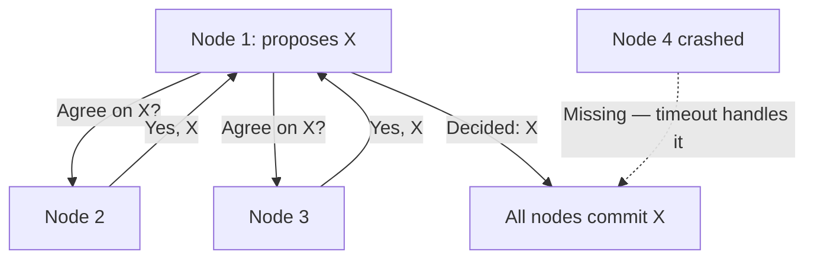

### Pitfalls
- ❌ **"Just use a database for coordination":** A database itself needs consensus to replicate. Using it for coordination creates a circular dependency.
- ❌ **Ignoring FLP:** Claiming an algorithm "always terminates" in an async network violates FLP. Real systems assume partial synchrony.

### Concept Reference
→ [Microservices Migration](../../../system-design/scale-and-reliability/microservices-migration)

---

## Q2: What is Paxos in plain English?

**Role:** Mid | **Difficulty:** 🟡 | **Priority:** P1 | **Format:** Quick Answer

> **What the interviewer is testing:** Whether you can explain Paxos's two-phase protocol without getting lost in formal notation.

### Answer in 60 seconds
- **Paxos in one sentence:** A proposer gets a promise from a majority of acceptors that they won't accept older proposals, then asks that majority to accept its value.
- **Phase 1 — Prepare:** Proposer sends `PREPARE(n)` with proposal number n. Acceptors reply with a PROMISE: "I won't accept proposals < n, and here's the highest value I've already accepted."
- **Phase 2 — Accept:** Proposer sends `ACCEPT(n, v)` where v is either its own value or the highest-numbered value from any PROMISE response. Acceptors reply ACCEPTED if n is still the highest they've seen.
- **Commit:** Once a majority ACCEPTs, the value is chosen. Learners are notified.
- **Key insight:** Proposal numbers break ties. A higher-numbered proposal can "steal" the round — but must carry any already-accepted value, ensuring consistency.
- **Practical limitation:** Paxos is notoriously hard to implement correctly. The original paper describes single-value consensus; Multi-Paxos extends it to log replication (and is what most "Paxos" implementations actually do).

### Diagram

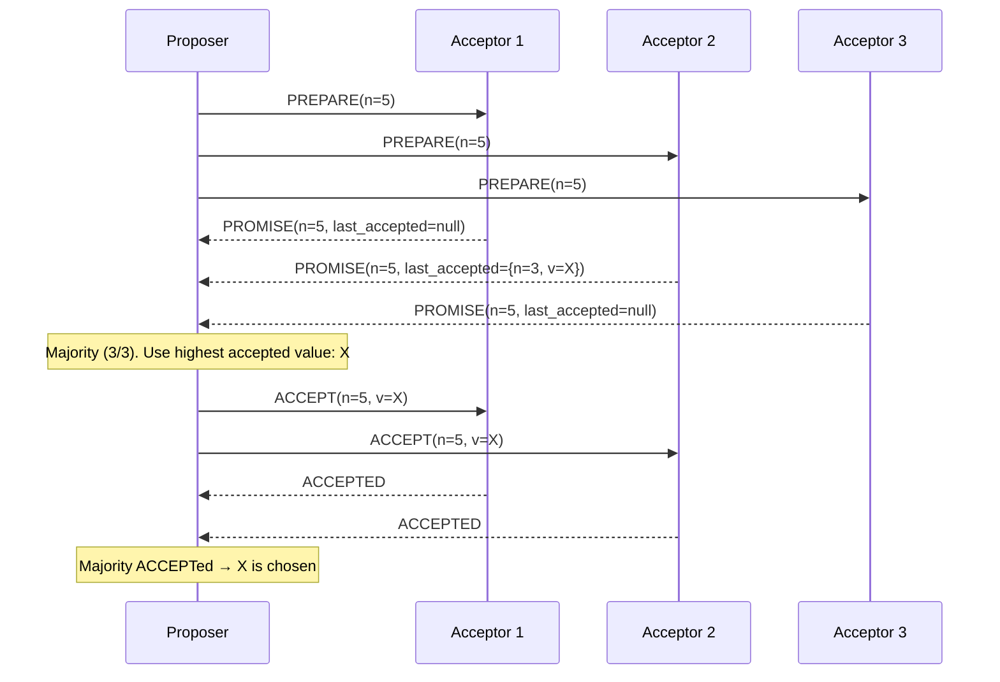

### Pitfalls
- ❌ **Confusing Paxos with 2PC:** 2PC has a coordinator that can block; Paxos tolerates coordinator failure by using quorums and proposal numbers.
- ❌ **Thinking Paxos is used directly in production:** Almost no system uses vanilla Paxos. Raft, ZAB, and Multi-Paxos are the practical implementations.

### Concept Reference
→ [Microservices Migration](../../../system-design/scale-and-reliability/microservices-migration)

---

## Q3: How does Raft differ from Paxos and why is it easier to understand?

**Role:** Senior | **Difficulty:** 🔴 | **Priority:** P1 | **Format:** Deep Dive

> **What the interviewer is testing:** Whether you understand Raft's design goals (understandability) and the specific mechanisms that make it more tractable than Multi-Paxos.

### Problem Constraints
| Dimension | Value |
|-----------|-------|
| Goal | Replicated log consensus for distributed state machines |
| Fault tolerance | F failures with 2F+1 nodes (same as Paxos) |
| Leader election time | 150–300ms election timeout in Raft |
| Log replication latency | 1 RTT (append + majority ACK) |

### Approach A — Multi-Paxos (complex)

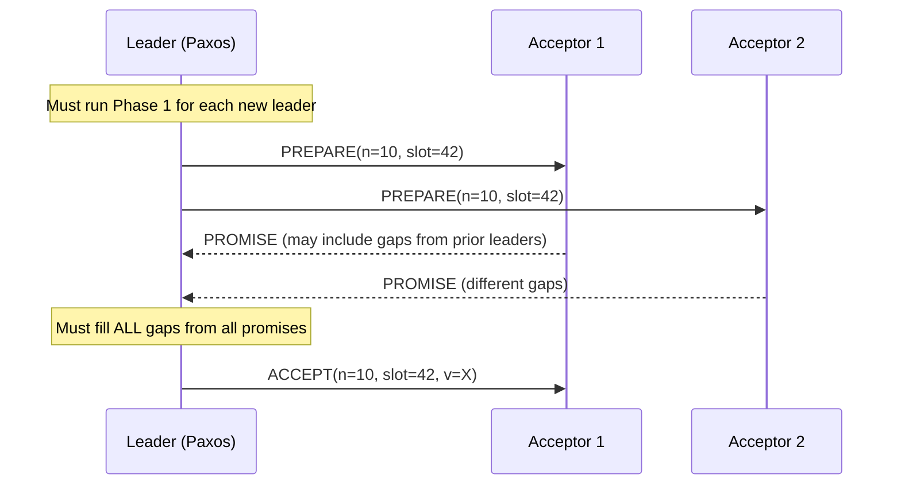

| Dimension | Multi-Paxos | Raft |
|-----------|-------------|------|
| Log gaps | Possible — must detect and fill | Impossible — leader has complete log |
| Leader handoff | Complex log reconciliation | Simple: higher-term leader wins |
| Understandability | ~7/10 difficulty | ~4/10 difficulty |
| Performance | Similar | Similar |
| Membership changes | Ad-hoc | Built-in joint consensus |

### Approach B — Raft (decomposed, explicit)

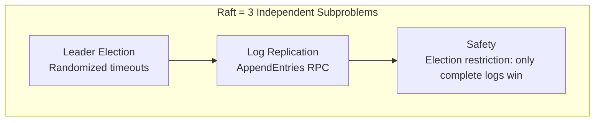

### Recommended Answer
Raft was designed explicitly for understandability. Three key structural differences from Paxos:

1. **Strong leader:** All log entries flow through the leader. Raft never has log gaps or partial states to reconcile. Paxos leaders must discover and fill gaps from previous leaders' partial accepts.

2. **Randomized election timeouts:** Each node picks a random timeout (150–300ms). The first to time out becomes a candidate. This simple mechanism replaces Paxos's complex proposal number management.

3. **Log matching invariant:** If two logs have the same index and term for an entry, all preceding entries are identical. This makes consistency proofs tractable and implementation straightforward.

The Raft paper measured comprehension in student experiments: 33 of 43 students answered Raft questions correctly vs 15 of 43 for Paxos (same material, different format).

### What a great answer includes
- [ ] Explain the "strong leader" property and why it eliminates log gaps
- [ ] Describe randomized timeouts vs Paxos proposal numbers
- [ ] State that Raft has same O(log N) message complexity as Multi-Paxos
- [ ] Mention the Log Matching Property
- [ ] Give election timeout numbers (150–300ms)

### Pitfalls
- ❌ **"Raft is more efficient than Paxos":** Raft and Multi-Paxos have similar performance profiles. Raft's advantage is correctness of implementation, not throughput.
- ❌ **Forgetting leader restriction:** A Raft candidate wins election ONLY if its log is at least as up-to-date as the majority. Without this, a node with missing entries could become leader and overwrite committed data.

### Concept Reference
→ [Microservices Migration](../../../system-design/scale-and-reliability/microservices-migration)

---

## Q4: How does Raft perform leader election?

**Role:** Senior | **Difficulty:** 🔴 | **Priority:** P1 | **Format:** Quick Answer

> **What the interviewer is testing:** Whether you understand Raft terms, the candidate state machine, and the election safety guarantee.

### Answer in 60 seconds
- **Terms:** Time is divided into monotonically increasing terms. Each term starts with an election. Terms act as a logical clock — nodes reject messages from smaller terms.
- **Election trigger:** A follower becomes a candidate if it doesn't receive a heartbeat within its election timeout (randomized 150–300ms). It increments its term, votes for itself, and sends `RequestVote` RPCs to all other nodes.
- **Winning:** A candidate wins if it receives votes from a majority (>N/2) of nodes. Each node votes for at most one candidate per term (first-come, first-served), and only if the candidate's log is at least as up-to-date as the voter's.
- **Log completeness check:** Candidate's last log term > voter's last log term, OR (same last term AND candidate's log length ≥ voter's). This ensures only nodes with complete logs can win.
- **Split vote:** If no candidate wins majority, the term times out and a new election starts with a higher term. Randomized timeouts make split votes rare (avg < 1 in 100 elections in practice).

### Diagram

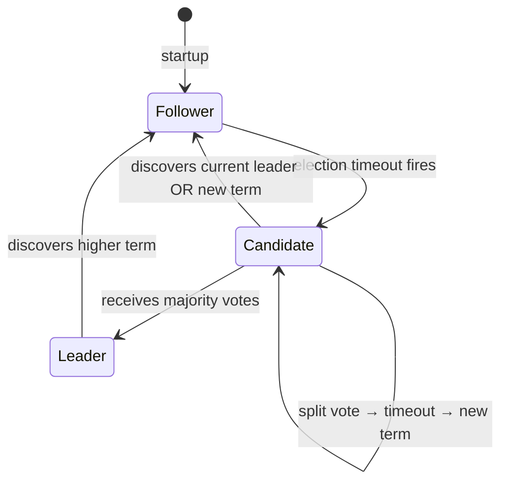

### Pitfalls
- ❌ **"Leader sends heartbeats every election timeout":** Heartbeat interval should be much less than the election timeout (e.g., 50ms heartbeat, 150–300ms election timeout). Otherwise, network jitter causes unnecessary elections.
- ❌ **Forgetting the log completeness requirement:** Without it, a node that missed the last 1000 entries could win and truncate committed data.

### Concept Reference
→ [Microservices Migration](../../../system-design/scale-and-reliability/microservices-migration)

---

## Q5: How does Raft replicate log entries and handle a leader crash mid-write?

**Role:** Senior | **Difficulty:** 🔴 | **Priority:** P2 | **Format:** Deep Dive

> **What the interviewer is testing:** Whether you understand AppendEntries, commit index, and the durability guarantee under leader failure.

### Problem Constraints
| Dimension | Value |
|-----------|-------|
| Cluster size | 5 nodes (tolerates 2 failures) |
| Write path | Leader receives, replicates, commits on majority ACK |
| Leader crash timing | After PREPARE but before majority replication |
| Recovery guarantee | No committed entry is ever lost |

### Approach A — Entry committed to majority (safe)

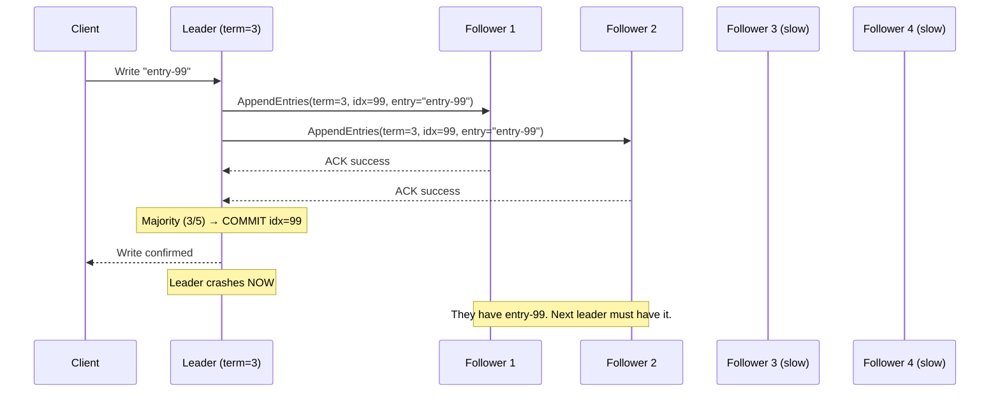

### Approach B — Leader crashes before majority (potentially lost)

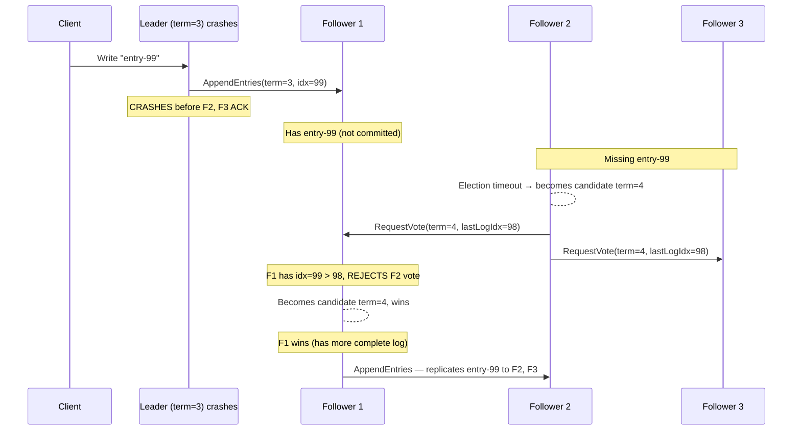

| Scenario | Entry committed? | What happens |
|----------|-----------------|--------------|
| Leader crashes after majority ACK | Yes | New leader has entry, continues |
| Leader crashes before majority ACK | No | Entry may be replicated to 1 node; new leader may or may not keep it depending on election outcome |
| Client received ACK before crash | Should not happen | Raft only ACKs client after majority commit |

### Recommended Answer
Raft's durability guarantee: **an entry is safe (committed) only after the leader receives ACKs from a majority of nodes**. The leader sends `AppendEntries` RPCs in parallel, waits for majority ACKs, advances the commit index, responds to the client, and then sends commit notifications on the next heartbeat.

If the leader crashes after a minority replication: the entry is uncommitted. The new leader (which must have a log at least as complete as majority) may or may not have the entry. If it doesn't, the entry is simply absent — the client's write timed out (no ACK was sent). Raft never reports a write as committed unless it's safe.

The subtle edge case: a leader can replicate an entry from a *previous term* but cannot commit it until a new entry from the *current term* is committed (the leader commits rule). This prevents phantom commits from prior leaders.

### What a great answer includes
- [ ] Explain commit = majority ACK, not just leader write
- [ ] Describe the commit index propagation via heartbeats
- [ ] Mention the "leader only commits entries from current term" rule
- [ ] Explain why the election log completeness check prevents data loss
- [ ] State that client never receives ACK before commit

### Pitfalls
- ❌ **"Write is committed when leader writes to its log":** Writing to the leader's log is step 1. Commit requires majority ACK. This is the same mistake as 2PC coordinator-only commit.
- ❌ **Ignoring the previous-term entry commit rule:** A leader with uncommitted entries from prior terms must wait for a current-term commit before those entries become durable. This confuses many candidates.

### Concept Reference
→ [Distributed Transactions](distributed-transactions)

---

## Q6: What is a quorum and how does the math work (3 nodes, 5 nodes)?

**Role:** Senior | **Difficulty:** 🔴 | **Priority:** P2 | **Format:** Quick Answer

> **What the interviewer is testing:** Whether you understand quorum math and can reason about fault tolerance requirements.

### Answer in 60 seconds
- **Quorum definition:** The minimum number of nodes that must participate in a read or write for the operation to be valid. Quorum = floor(N/2) + 1.
- **3-node cluster:** Quorum = 2. Tolerates 1 failure. Write needs 2 ACKs; read needs 2 responses. If 2 nodes are down, cluster halts.
- **5-node cluster:** Quorum = 3. Tolerates 2 failures. Better availability for large deployments.
- **Why odd numbers:** Even numbers don't improve fault tolerance. A 4-node cluster needs 3 for quorum (tolerates 1 failure), same as a 3-node cluster — but costs 33% more. 6-node needs 4, same tolerance as 5-node.
- **Read-write quorum intersection:** For any read quorum R and write quorum W in an N-node system, R + W > N guarantees a read sees the latest write. Cassandra's QUORUM+QUORUM satisfies this.
- **Flexible quorums:** Modern systems (Cassandra) allow R + W = N + 1 with asymmetric values (R=1, W=N or R=N, W=1) for specific read/write optimization.

### Diagram

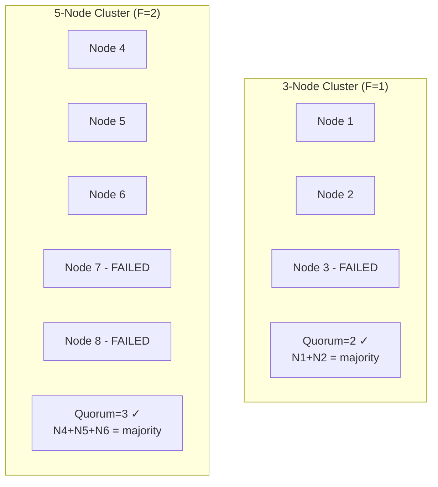

### Pitfalls
- ❌ **"More nodes = more availability":** Adding nodes without increasing quorum threshold doesn't help. 10 nodes with quorum=6 still fails if 5 nodes go down — just like a 5-node cluster.
- ❌ **Confusing quorum with replication factor:** RF=3 means 3 copies exist. Quorum=2 means you need 2 nodes to agree. Both are needed: RF=3, CL=QUORUM for strong consistency.

### Concept Reference
→ [Database Replication](../../../system-design/storage-and-databases/database-replication)

---

## Q7: How does etcd implement Raft for Kubernetes cluster state?

**Role:** Staff | **Difficulty:** ⚫ | **Priority:** P2 | **Format:** Quick Answer

> **What the interviewer is testing:** Whether you understand etcd's operational role in Kubernetes and the performance characteristics of a consensus-backed key-value store.

### Answer in 60 seconds
- **etcd's role:** etcd is the single source of truth for all Kubernetes cluster state — pod specs, service configs, secrets, ConfigMaps. It uses Raft via a custom Go implementation.
- **Write path:** Every Kubernetes write (kubectl apply) hits the API server → etcd leader → Raft replication to followers → majority ACK → committed → API server returns.
- **Read path:** By default, reads go to the leader (linearizable). Followers can serve reads if clients accept potential 1–2 second staleness (`--consistency=serializable`).
- **Performance:** etcd handles ~10K writes/sec and ~100K reads/sec per cluster. Kubernetes large clusters (5000 nodes) approach this limit — hence etcd tuning is critical.
- **Election tuning:** Default heartbeat interval 100ms, election timeout 1000ms. In GKE/EKS large clusters, tuned to 250ms heartbeat + 1250ms election timeout to handle higher latency.
- **Watch API:** etcd's Watch is how Kubernetes controllers react to changes. Uses long-lived gRPC streams — much more efficient than polling. A 5000-node cluster may have 100K+ concurrent watchers.

### Diagram

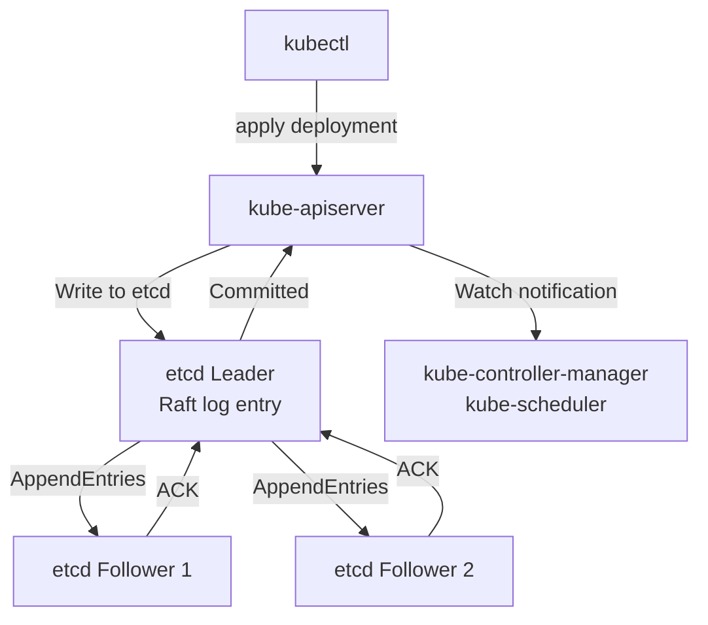

### Pitfalls
- ❌ **Putting etcd on the same nodes as workloads:** etcd's p99 latency degrades sharply under disk contention. It needs dedicated SSDs with fsync latency < 10ms.
- ❌ **Running a 2-node etcd cluster:** 2 nodes = no fault tolerance (quorum=2, lose 1 = halt). Always run 3, 5, or 7 etcd nodes.

### Concept Reference
→ [Microservices Migration](../../../system-design/scale-and-reliability/microservices-migration)

---

## Q8: What is the trade-off between safety and liveness in Raft?

**Role:** Staff | **Difficulty:** ⚫ | **Priority:** P2 | **Format:** Deep Dive

> **What the interviewer is testing:** Whether you understand how Raft prioritizes safety (correctness) over liveness (progress) and the practical implications of this choice.

### Problem Constraints
| Dimension | Value |
|-----------|-------|
| Cluster | 5-node Raft |
| Safety property | No two nodes commit different values for same log index |
| Liveness property | Every proposed value is eventually committed |
| FLP implication | Both cannot be guaranteed in async networks |

### Approach A — Prioritize Safety (Raft's choice)

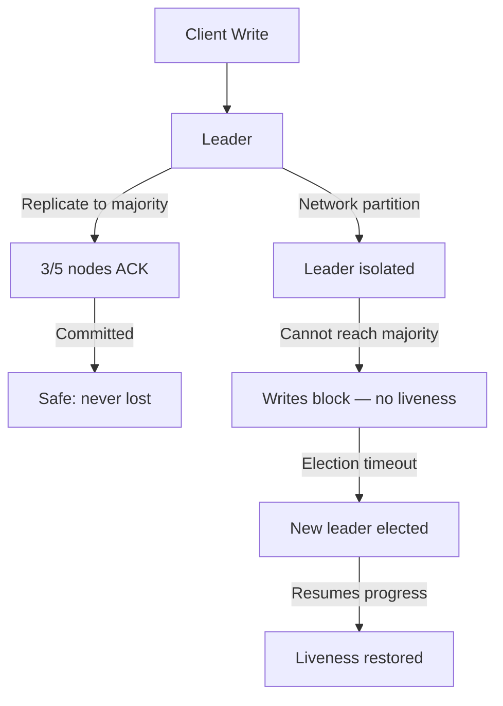

### Approach B — Prioritize Liveness (Multi-master, unsafe)

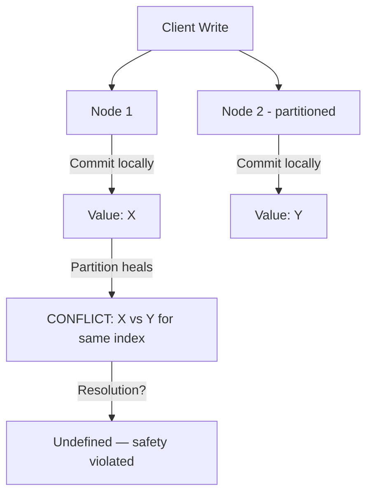

| Property | Raft (Safety First) | Multi-Master (Liveness First) |
|----------|--------------------|-----------------------------|
| Data loss risk | None (committed entries safe) | High (split-brain conflicts) |
| Write availability during partition | Blocks (minority partition) | Continues (both sides write) |
| Recovery complexity | Simple (new leader) | Complex (manual conflict resolution) |
| Use cases | Config stores, locks | Shopping carts (tolerable conflicts) |

### Recommended Answer
Raft prioritizes **safety over liveness**. If a leader cannot replicate to a majority (network partition isolating the leader), it stops accepting writes. This causes a brief availability gap (typically 150–600ms for election + new leader establishment) but guarantees no data loss or inconsistency.

The trade-off in practice: a 5-node Raft cluster in a cross-AZ setup experiencing an AZ failure will block writes for 300–500ms while electing a new leader. This is acceptable for configuration stores and distributed locks but unacceptable for high-write data stores — hence why Raft is used for coordination (etcd, Consul) rather than primary data storage.

Liveness is eventually guaranteed: Raft always makes progress as long as a majority of nodes can communicate. The FLP impossibility is addressed by randomized election timeouts — in practice, split votes are extremely rare (< 1% of elections).

### What a great answer includes
- [ ] Define safety (no incorrect results) and liveness (eventual progress)
- [ ] Explain why Raft blocks rather than serves during minority partition
- [ ] Quantify the availability gap (300–500ms election)
- [ ] Name use cases appropriate for this trade-off (etcd, Consul)
- [ ] Mention randomized timeouts addressing the FLP impossibility

### Pitfalls
- ❌ **"Raft guarantees liveness":** Raft guarantees safety. Liveness requires "eventually stable" network conditions — it can halt indefinitely in adversarial timing scenarios (though rare in practice).
- ❌ **Confusing leader availability with cluster availability:** A cluster can be available (reads from followers) while the leader is down, but new writes block until a new leader is elected.

### Concept Reference
→ [Distributed Transactions](distributed-transactions)

---

## Q9: What is Byzantine fault tolerance and when do you need it?

**Role:** Staff | **Difficulty:** ⚫ | **Priority:** P3 | **Format:** Quick Answer

> **What the interviewer is testing:** Whether you know the distinction between crash failures and Byzantine (arbitrary/malicious) failures and the cost of tolerating each.

### Answer in 60 seconds
- **Crash fault:** A node stops responding. Paxos/Raft handle this — they assume failed nodes are simply silent.
- **Byzantine fault:** A node behaves arbitrarily — sending incorrect data, lying about votes, replaying old messages, or being actively malicious. A Byzantine node can send `yes` to one node and `no` to another in the same round.
- **Why standard consensus fails:** Raft assumes a node either responds correctly or not at all. A Byzantine node can vote for two different leaders in the same term, violating Raft's single-vote guarantee.
- **BFT requirement:** To tolerate F Byzantine failures, you need 3F+1 nodes (vs 2F+1 for crash faults). 1 Byzantine node = 4 nodes minimum; 2 Byzantine nodes = 7 nodes.
- **When you need BFT:** Blockchain networks (Bitcoin PoW, Ethereum PoS), multi-party financial systems, federated databases across untrusted organizations. NOT needed in homogeneous cloud infrastructure where you control all nodes.
- **Cost:** PBFT (Practical Byzantine Fault Tolerance) requires O(N²) message complexity per round — unsuitable for clusters > 20 nodes.

### Diagram

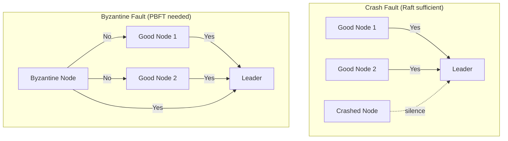

### Pitfalls
- ❌ **Using BFT in internal microservices:** If you control all nodes (same cloud account, same team), crash fault tolerance (Raft) is sufficient. BFT's 3x node overhead is unnecessary.
- ❌ **Confusing BFT with security:** BFT handles *some* malicious behavior but doesn't replace TLS/authentication. A Byzantine node inside your security perimeter implies a breach — fix the breach, not the consensus algorithm.

### Concept Reference
→ [Microservices Migration](../../../system-design/scale-and-reliability/microservices-migration)

---

## Q10: How does Apache Kafka use Raft (KRaft mode) instead of ZooKeeper?

**Role:** Staff | **Difficulty:** ⚫ | **Priority:** P3 | **Format:** Quick Answer

> **What the interviewer is testing:** Whether you understand Kafka's architectural evolution and why replacing ZooKeeper with Raft improved operational complexity.

### Answer in 60 seconds
- **The problem with ZooKeeper:** Kafka used ZooKeeper for broker metadata, controller election, and topic partition leadership. This required running and operating a separate ZooKeeper cluster — doubling the operational surface.
- **KRaft (Kafka Raft Metadata mode):** Introduced in Kafka 2.8 (2021), made default in 3.3 (2022), ZooKeeper removed in 3.7 (2024). Metadata is stored in a Kafka topic itself (`__cluster_metadata`) replicated via Raft among a small set of controller nodes (typically 3).
- **Architecture:** 3–5 Kafka nodes act as controllers; one is the active controller (Raft leader). All metadata updates (topic creation, broker joins, leader elections for partitions) go through this Raft log.
- **Performance improvement:** Kafka supports 1M partitions in KRaft mode vs ~200K in ZooKeeper mode. Controller failover time: ~20ms in KRaft vs ~30 seconds in ZooKeeper mode. This is a 1500x improvement in partition leadership recovery.
- **Operational benefit:** Eliminates ZooKeeper cluster management — no separate JVM process, no separate monitoring, no separate upgrade cycle.

### Diagram

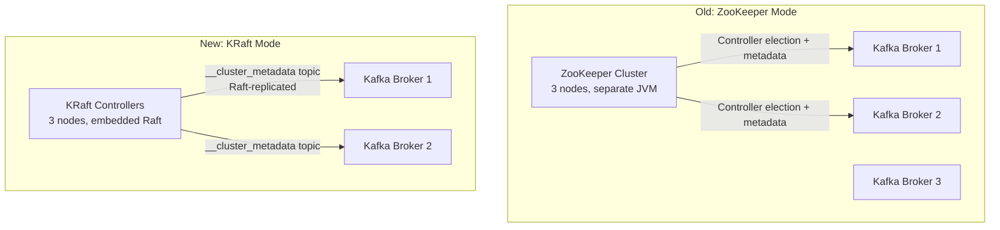

### Pitfalls
- ❌ **Running KRaft with only 1 controller:** Loss of the single controller = cluster halt. Always run 3 controllers for production KRaft deployments.
- ❌ **Mixing KRaft and ZooKeeper modes in a cluster:** KRaft is incompatible with ZooKeeper mode. Migration requires a clean migration procedure (Kafka provides a migration tool in 3.5+).

### Concept Reference
→ [Kafka & Messaging](../../../system-design/messaging-and-streaming/kafka-rabbitmq)
