# Distributed Transactions

10 questions covering 2PC, Saga, XA, and real-world transaction patterns.

---

## Q1: Why are distributed transactions hard?

**Role:** Mid | **Difficulty:** 🟡 | **Priority:** P0 | **Format:** Quick Answer

> **What the interviewer is testing:** Whether you understand the fundamental challenges — atomicity across independent systems, failure modes, and network unreliability.

### Answer in 60 seconds
- **Atomicity challenge:** A distributed transaction touches N independent services or databases. Any of them can fail independently. Making "all or nothing" atomicity work across these requires coordination.
- **The 8 fallacies:** The network is not reliable. A request may succeed on the remote side but the ACK never arrives — you don't know if it committed or not (the "two generals problem").
- **Partial failure:** Service A commits, then the message to Service B is lost. Now A is committed, B is not. No single point can atomically roll back A without complex protocols.
- **Performance cost:** Every coordination round adds latency. Two-phase commit adds 2 RTTs minimum. At 5ms inter-service RTT, that's 10ms of pure coordination overhead before any business logic.
- **Lock contention:** Distributed transactions often hold locks across services, blocking unrelated operations. A slow participant can block all other transactions touching the same resources.

### Diagram

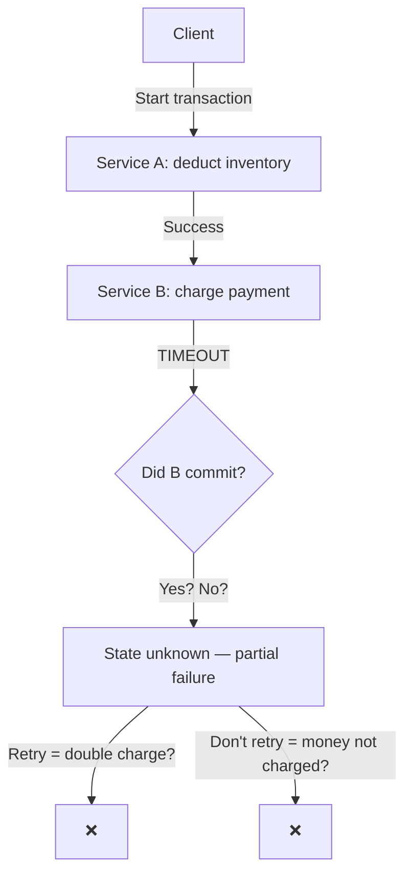

### Pitfalls
- ❌ **"Use a distributed transaction database":** Even Spanner has distributed transaction latency of 10–50ms. The fundamental coordination cost exists regardless of the database.
- ❌ **Ignoring idempotency:** Retrying a failed distributed transaction without idempotency keys causes double-writes. Always design for at-least-once with idempotent operations.

### Concept Reference

---

## Q2: What is two-phase commit (2PC) and what are its failure modes?

**Role:** Mid | **Difficulty:** 🟡 | **Priority:** P1 | **Format:** Quick Answer

> **What the interviewer is testing:** Whether you can explain 2PC's protocol and identify its blocking failure mode under coordinator crash.

### Answer in 60 seconds
- **Phase 1 — Prepare:** Coordinator sends `PREPARE` to all participants. Each participant writes the transaction to its WAL, acquires locks, and replies `YES` (ready to commit) or `NO` (abort).
- **Phase 2 — Commit/Abort:** If all participants vote YES, coordinator sends `COMMIT`. If any votes NO, coordinator sends `ABORT`. Participants execute the decision and release locks.
- **Failure modes:**
  - **Coordinator crash after PREPARE:** Participants hold locks and wait indefinitely. They cannot commit (don't know if others voted YES) or abort (coordinator may have sent COMMIT to others). This is the **blocking** failure.
  - **Participant crash after voting YES:** Coordinator waits for participant to recover, then resends the decision. Participant checks its WAL and executes the stored decision.
  - **Network partition:** Coordinator cannot reach a participant = equivalent to coordinator crash scenario.
- **Recovery:** Uses a transaction log. On coordinator restart, it checks the log — if COMMIT was written before crash, it retries the commit; if not, it aborts.

### Diagram

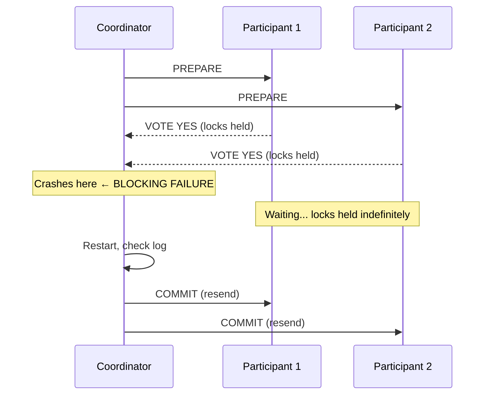

### Pitfalls
- ❌ **"2PC guarantees no data loss":** 2PC guarantees atomicity if the coordinator recovers. If coordinator data is lost (disk failure without replication), the transaction outcome is unrecoverable.
- ❌ **Using 2PC across microservices without timeout handling:** Without a transaction timeout, a crashed participant can hold locks for hours. Always configure `innodb_lock_wait_timeout` (default 50 seconds) or equivalent.

### Concept Reference

---

## Q3: How does 2PC block if the coordinator crashes after PREPARE?

**Role:** Senior | **Difficulty:** 🔴 | **Priority:** P1 | **Format:** Deep Dive

> **What the interviewer is testing:** Whether you understand the uncertainty problem and the operational impact of indefinite blocking on lock contention.

### Problem Constraints
| Dimension | Value |
|-----------|-------|
| Cluster | 3 participants, 1 coordinator |
| Lock duration | From PREPARE until COMMIT/ABORT |
| Coordinator crash timing | After all participants vote YES |
| Recovery time | Until coordinator restarts (could be hours) |

### Approach A — Wait for coordinator recovery (default 2PC behavior)

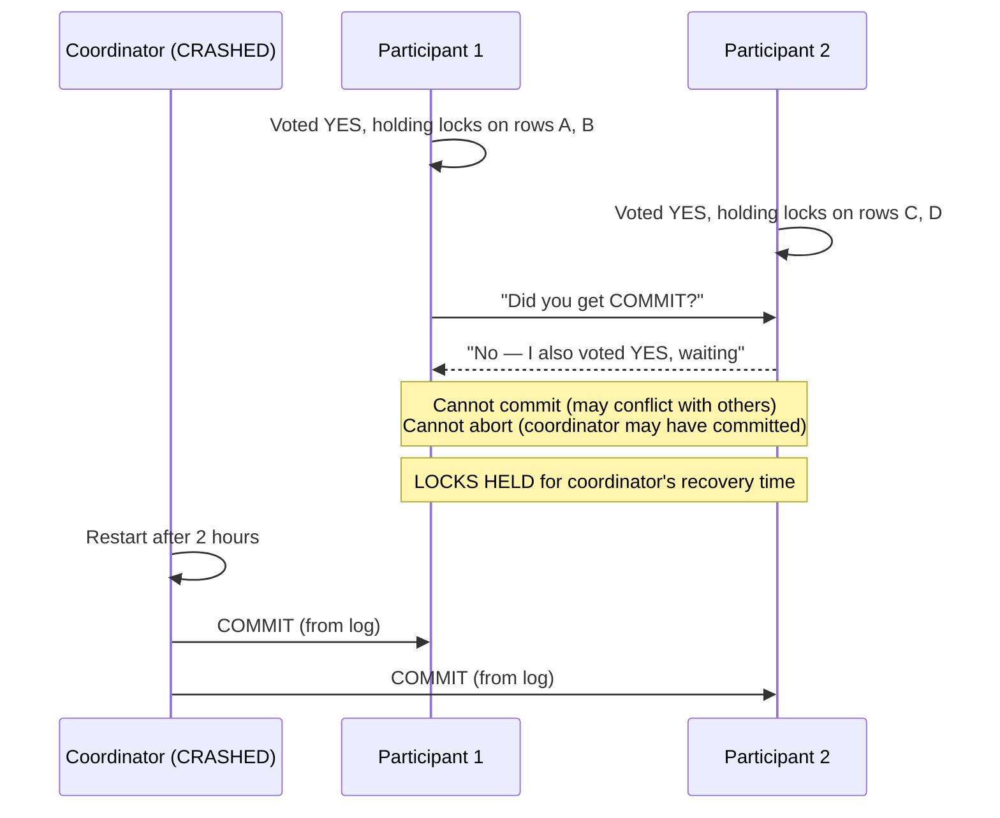

| Dimension | Wait | Timeout+Abort |
|-----------|------|---------------|
| Correctness | Guaranteed | UNSAFE: another participant may have committed |
| Lock hold time | Hours (coordinator downtime) | Configurable |
| Data safety | Safe | Risk of split: P1 aborts, P2 commits |
| Use case | Correct | Cannot be used safely in 2PC |

### Approach B — Cooperative termination (some 2PC variants)

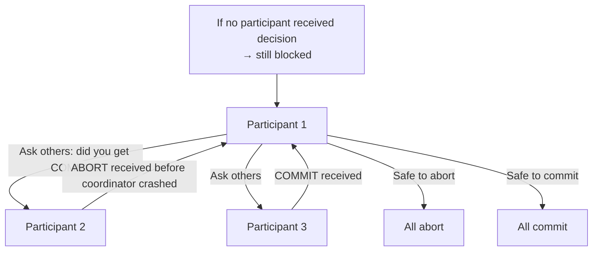

### Recommended Answer
The blocking is fundamental to 2PC. Once a participant votes YES, it *cannot* safely abort or commit unilaterally — if it aborts and the coordinator committed others, you have split atomicity. The only safe option is to wait.

In practice this means: coordinator downtime = proportional lock contention. If coordinator takes 30 minutes to restart, all affected rows are locked for 30 minutes. In high-write systems (10K writes/sec), this cascades — new transactions waiting for locks back up in queues, causing timeouts chain reaction.

**Operational mitigations:**
1. Coordinator is always replicated (e.g., using Raft itself) — reduces coordinator downtime from minutes to seconds.
2. Coordinator is deployed in 3 AZs with automatic failover.
3. Monitor transaction log for "prepared but not committed" entries > 30 seconds → alert.
4. Use 3PC (three-phase commit) for non-blocking at the cost of additional RTT.

**The real answer in interviews:** 3PC adds a pre-commit phase that allows safe abort under coordinator failure — but it's still not safe under network partitions. The real solution is to avoid 2PC and use Saga patterns for microservices.

### What a great answer includes
- [ ] Explain the uncertainty problem — participants can't commit or abort safely
- [ ] Quantify the lock hold time = coordinator recovery time
- [ ] Describe cascade failure from lock contention
- [ ] Mention coordinator replication as mitigation
- [ ] Mention 3PC and its limitations (not partition-safe)

### Pitfalls
- ❌ **"Just set a timeout and abort":** Unilateral abort after a timeout is UNSAFE in 2PC — the coordinator may have committed other participants. This is precisely why 2PC blocks.
- ❌ **"3PC solves all blocking":** 3PC is non-blocking under crash failures but still blocks under network partitions (CAP applies to 3PC too).

### Concept Reference

---

## Q4: What is the Saga pattern and how does it avoid 2PC?

**Role:** Senior | **Difficulty:** 🔴 | **Priority:** P1 | **Format:** Quick Answer

> **What the interviewer is testing:** Whether you understand Saga as a sequence of local transactions with compensating actions, not a distributed transaction.

### Answer in 60 seconds
- **Saga definition:** A saga is a sequence of local transactions, each with a corresponding compensating transaction that undoes its effects if a later step fails.
- **No distributed lock:** Each step commits immediately to its local database. There are no cross-service locks. Each step is autonomous.
- **Failure handling:** If step N fails, the saga executes compensating transactions for steps N-1, N-2, ... 1 in reverse order. Each compensating transaction undoes the effect of one step.
- **Example — e-commerce order:**
  - T1: Create order (compensate: cancel order)
  - T2: Reserve inventory (compensate: release inventory)
  - T3: Charge payment (compensate: refund payment)
  - T4: Ship item (compensate: initiate return)
- **Eventual consistency:** Between steps, the system is temporarily inconsistent. A saga provides ACD (Atomicity, Consistency, Durability) but not I (Isolation) — other transactions can see intermediate states.

### Diagram

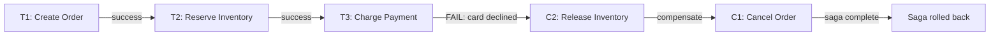

### Pitfalls
- ❌ **"Sagas are atomic":** Sagas provide eventual atomicity through compensation, but between steps, the system is in intermediate states. Other users may see a "reserved inventory" that was later released.
- ❌ **Forgetting compensating transaction failures:** What if C2 (release inventory) also fails? You need a retry mechanism with exponential backoff — compensating transactions must be idempotent and retryable.

### Concept Reference

---

## Q5: How do you design compensating transactions for a failed Saga step?

**Role:** Senior | **Difficulty:** 🔴 | **Priority:** P1 | **Format:** Deep Dive

> **What the interviewer is testing:** Whether you understand the properties compensating transactions must have and the edge cases they must handle.

### Problem Constraints
| Dimension | Value |
|-----------|-------|
| Saga | Order → Inventory → Payment → Fulfillment |
| Failure point | Payment step fails |
| Compensating actions needed | Release inventory, cancel order |
| Retry budget | 3 attempts with exponential backoff |

### Approach A — Simple compensation (wrong)

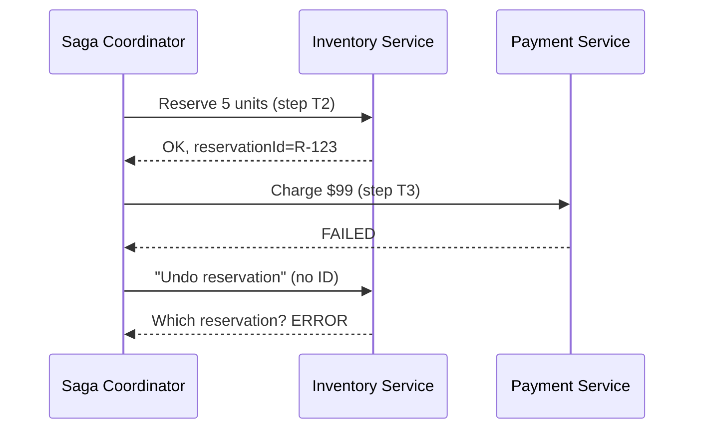

### Approach B — Idempotent compensation with correlation IDs (correct)

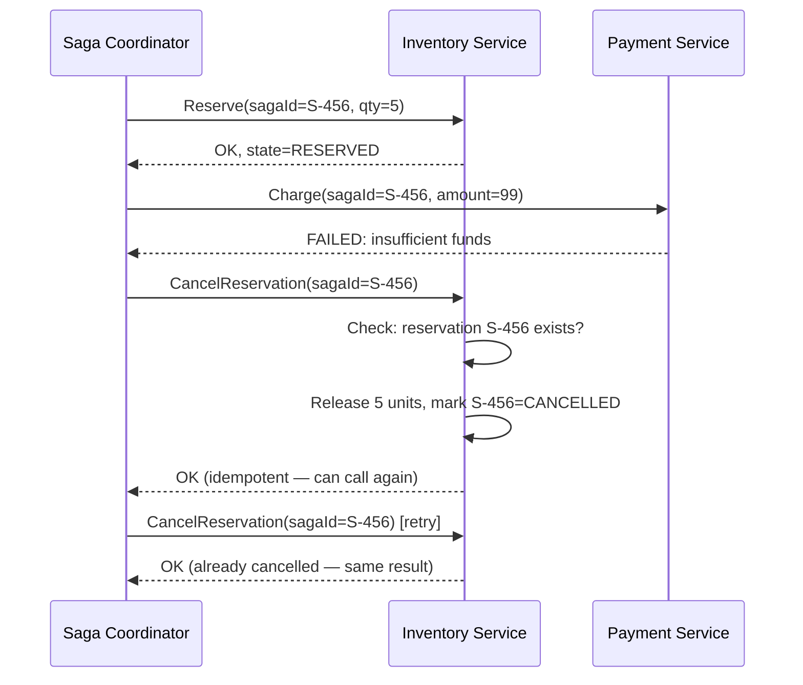

| Property | Requirement | Why |
|----------|-------------|-----|
| Idempotency | Must be re-callable with same result | Network failures cause retries |
| Correlation ID | saga-scoped ID per compensating action | Identifies what to undo |
| Ordered execution | Reverse order of forward steps | Dependencies must be respected |
| Timeout | Max retry budget (3 attempts, 30 seconds) | Avoid infinite loops |
| Failure handling | Dead letter queue if all retries fail | Human intervention required |

### Recommended Answer
Compensating transactions must satisfy four properties:

1. **Idempotency:** Calling `CancelReservation(sagaId)` twice must produce the same result — the first call cancels, subsequent calls detect it's already cancelled and return success. Use the saga ID as the idempotency key.

2. **Semantic undo, not exact undo:** A compensating transaction may not perfectly reverse the original. If a "send confirmation email" step succeeds, the compensating transaction sends a "cancellation email" — you cannot un-send an email. Design forward-recovery when backward-recovery is impossible.

3. **Persistent saga state:** The saga coordinator must durably record which steps completed before attempting compensation. If the coordinator crashes mid-compensation, it must resume from the right step. Use a saga table in a database with saga state (`STARTED`, `T1_DONE`, `T2_DONE`, `COMPENSATING`, `DONE`).

4. **Dead letter handling:** If compensation fails after max retries (e.g., inventory service is down for 2 hours), route to a dead letter queue and alert on-call engineers. Never silently swallow compensation failures.

### What a great answer includes
- [ ] Idempotency of compensating transactions using saga ID
- [ ] Durable saga state machine persisted in a database
- [ ] Dead letter queue for permanently failed compensations
- [ ] Semantic undo concept (some steps can only be compensated forward)
- [ ] Retry with exponential backoff (3 attempts, 2s→4s→8s)

### Pitfalls
- ❌ **Compensation without correlation IDs:** "Undo the last reservation" is ambiguous if the service has multiple reservations. Always scope compensation to a specific transaction identifier.
- ❌ **Not handling compensation failures:** If `CancelReservation` fails, inventory leaks — reserved units are never returned. Monitor compensation failure rate (alert at > 0.1%).

### Concept Reference

---

## Q6: How does Google Spanner implement distributed transactions without 2PC's blocking?

**Role:** Senior | **Difficulty:** 🔴 | **Priority:** P2 | **Format:** Quick Answer

> **What the interviewer is testing:** Whether you know Spanner's TrueTime + Paxos approach and how it achieves external consistency without the 2PC blocking problem.

### Answer in 60 seconds
- **Spanner's model:** Spanner uses Paxos groups per shard. Distributed transactions use a two-phase commit protocol, but the coordinator is the Paxos leader of one of the participant groups — not a separate coordinator process.
- **Why no blocking:** The coordinator (Paxos leader) is itself highly available via Paxos. If the coordinator crashes, the Paxos group elects a new leader within 1–10 seconds and resumes the transaction. This eliminates the indefinite blocking of classic 2PC.
- **TrueTime for commit timestamps:** Spanner assigns each transaction a commit timestamp from TrueTime (GPS + atomic clock-based API with uncertainty interval ε ≈ 7ms). After choosing a commit timestamp t, Spanner waits until wall-clock time > t before serving reads at t (the "commit wait"). This ensures external consistency — any transaction that starts after this one commits must see this transaction's writes.
- **Performance numbers:** Spanner single-region read-write transactions: 5–10ms p99. Multi-region: 20–100ms depending on inter-region RTT. Read-only transactions (no locking): 1–5ms p99.
- **External consistency = linearizability across distributed transactions:** If T1 commits before T2 starts (in real time), T2 is guaranteed to see T1's writes. No other distributed database provides this guarantee at global scale.

### Diagram

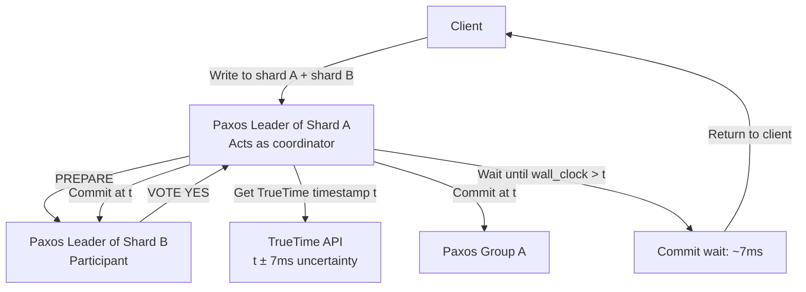

### Pitfalls
- ❌ **"Spanner eliminates 2PC":** Spanner still uses 2PC internally. The improvement is that the coordinator is a Paxos leader (highly available), not a single point of failure.
- ❌ **Using Spanner for sub-5ms latency:** Spanner's TrueTime commit wait adds 7–14ms per read-write transaction. For sub-5ms requirements, use single-region databases with no cross-shard transactions.

### Concept Reference

---

## Q7: What are XA transactions and why are they rarely used in microservices?

**Role:** Senior | **Difficulty:** 🔴 | **Priority:** P2 | **Format:** Quick Answer

> **What the interviewer is testing:** Whether you know the XA standard and its practical limitations in microservices architectures.

### Answer in 60 seconds
- **XA standard:** An X/Open standard for distributed transactions across heterogeneous resource managers (databases, message brokers). Java JTA (Java Transaction API) is the most common XA implementation.
- **How it works:** An application server (e.g., JBoss, WebLogic) acts as the 2PC coordinator. Participants (PostgreSQL, ActiveMQ) implement the XA interface — `prepare()`, `commit()`, `rollback()`. The app server drives the 2PC protocol.
- **Why it's avoided in microservices:**
  1. **Tight coupling:** XA requires all participants to be reachable from a single JTA coordinator — violates microservice independence.
  2. **Language limitation:** XA is JVM-centric. Mixing Node.js, Python, and Go services in one transaction isn't practical.
  3. **Performance:** XA transactions disable connection pooling (each transaction needs a dedicated connection). At 1K transactions/sec, you need 1K open DB connections — connection exhaustion.
  4. **Blocking failure:** XA inherits 2PC's blocking problem under coordinator failure.
- **Where XA is used:** Legacy Java EE monoliths, same-process coordination between JMS broker and database. Not suitable for REST-based microservices.

### Diagram

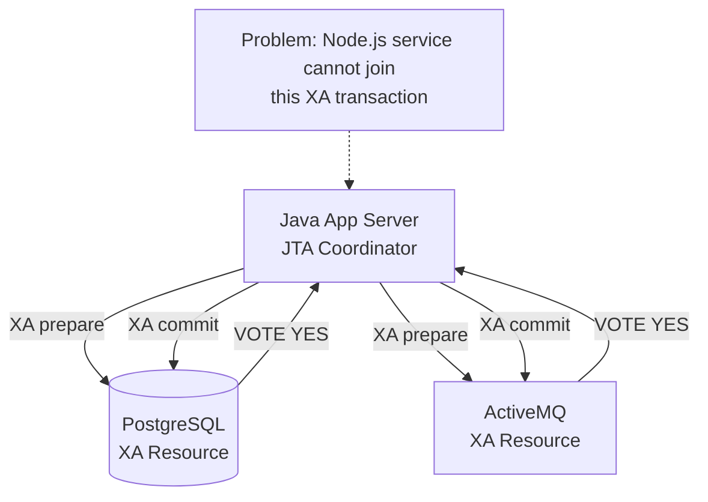

### Pitfalls
- ❌ **Using XA for performance-critical paths:** XA transactions hold database connections for the entire transaction duration. A 100ms business logic transaction holds a connection for 100ms — at 1K TPS, you need 100 connections just for one endpoint.
- ❌ **Confusing XA with Saga:** XA is synchronous 2PC; Saga is asynchronous compensation. Both solve cross-service atomicity but with entirely different trade-offs.

### Concept Reference

---

## Q8: When should you NOT use distributed transactions (and what to use instead)?

**Role:** Staff | **Difficulty:** ⚫ | **Priority:** P2 | **Format:** Deep Dive

> **What the interviewer is testing:** Whether you can recognize when distributed transaction complexity is unnecessary and propose simpler alternatives.

### Problem Constraints
| Dimension | Value |
|-----------|-------|
| System | High-write e-commerce platform |
| Services | Inventory, Orders, Payments, Notifications |
| Write volume | 50K orders/hour peak |
| Consistency requirement | Orders eventually consistent; payments strongly consistent |

### Approach A — Distributed transactions for everything (overengineered)

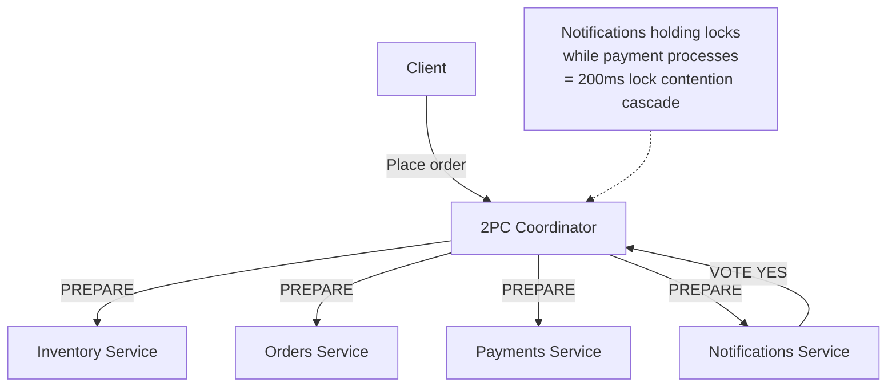

### Approach B — Tiered consistency (appropriate complexity)

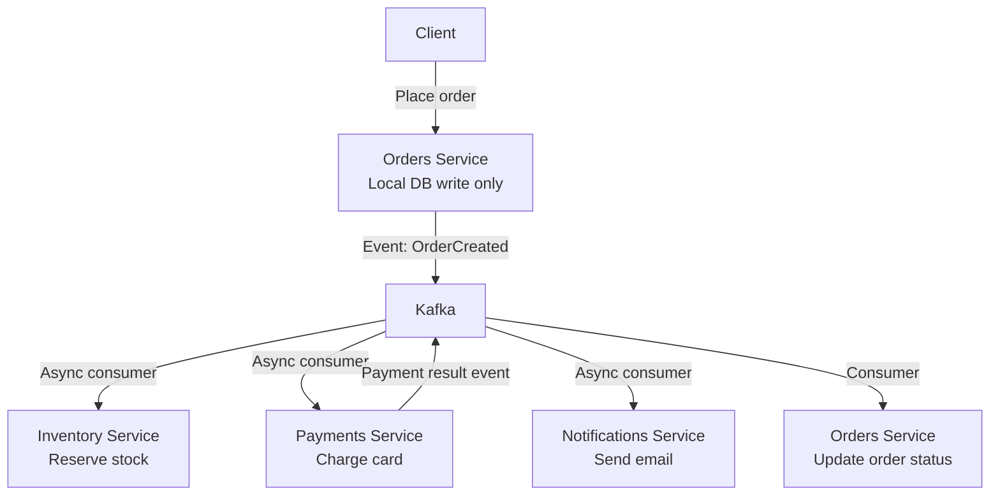

| Aspect | 2PC for Everything | Event-driven with Saga |
|--------|-------------------|----------------------|
| Latency (order placement) | 200–500ms | 10–30ms |
| Service coupling | Tight (all in same transaction) | Loose (via Kafka) |
| Notifications failure impact | Blocks entire transaction | Retried independently |
| Payment consistency | Strong | Strong (payment uses 2PC internally) |
| Inventory consistency | Strong (unnecessary) | Eventual (acceptable) |

### Recommended Answer
Don't use distributed transactions when:

1. **Operations don't need to be atomic:** Sending a notification email does not need to be in the same transaction as charging a payment card. Decouple via event bus.

2. **Eventual consistency is acceptable:** Inventory reservation can be eventually consistent — it's fine if the "1 unit left" count shows in the UI 500ms after it's reserved. Use events.

3. **Services have different consistency requirements:** Payment needs strong consistency (no double charge). Notification needs at-most-once delivery. Inventory needs eventual consistency. Force all three into a distributed transaction: the most restrictive requirement applies to all (strong consistency = 2PC blocking for all).

**Use instead:** Event-driven saga. Payment service uses a local 2PC within its own database + payment gateway (idempotency keys). Order service commits locally and publishes event. Inventory, notification services consume events independently, retry on failure.

This reduces order placement latency from 200–500ms (2PC) to 10–30ms (local commit + async event).

### What a great answer includes
- [ ] Identify which operations genuinely need atomicity (payment) vs which don't (notification)
- [ ] Propose event-driven saga as alternative
- [ ] Quantify latency difference (10–30ms vs 200–500ms)
- [ ] Mention idempotency keys for payment retries
- [ ] Address the "what if Kafka is down" failure mode

### Pitfalls
- ❌ **"Never use distributed transactions":** Payment + inventory lock (reserve before charge) may genuinely need synchronous consistency. Don't apply "use events for everything" dogmatically.
- ❌ **Ignoring the notification use case:** Notifications are the classic example of over-transactionalized operations. They should always be async with retry, never in a synchronous transaction.

### Concept Reference

---

## Q9: How does Stripe handle cross-service payment consistency without 2PC?

**Role:** Staff | **Difficulty:** ⚫ | **Priority:** P2 | **Format:** Quick Answer

> **What the interviewer is testing:** Whether you know Stripe's idempotency key pattern and event-driven consistency model.

### Answer in 60 seconds
- **The problem:** A payment must atomically update the charge record, trigger the webhook event, update the balance ledger, and initiate the bank transfer — across multiple services.
- **Stripe's approach: idempotency keys + event sourcing:** Each payment API call includes a client-generated idempotency key. Stripe stores the key → response mapping in Redis (TTL 24 hours). Retries return the cached response without re-executing.
- **Transactional outbox:** Stripe commits the charge to its database AND writes an event to an outbox table in the same local transaction. A separate poller publishes the outbox events to its internal event bus. This guarantees "at-least-once" event delivery without distributed transactions.
- **Idempotent consumers:** Every downstream service (webhook delivery, ledger update) processes events idempotently using event IDs. Duplicate events are detected and ignored.
- **Eventual consistency:** Balance is updated within 1–5 seconds of charge. Bank transfer initiation: minutes to hours (async). User-visible balance: consistent within 10 seconds. No 2PC anywhere.
- **Scale:** Stripe processes $817B in payment volume (2022) with p99 API latency < 200ms — achievable because they avoid distributed transaction overhead.

### Diagram

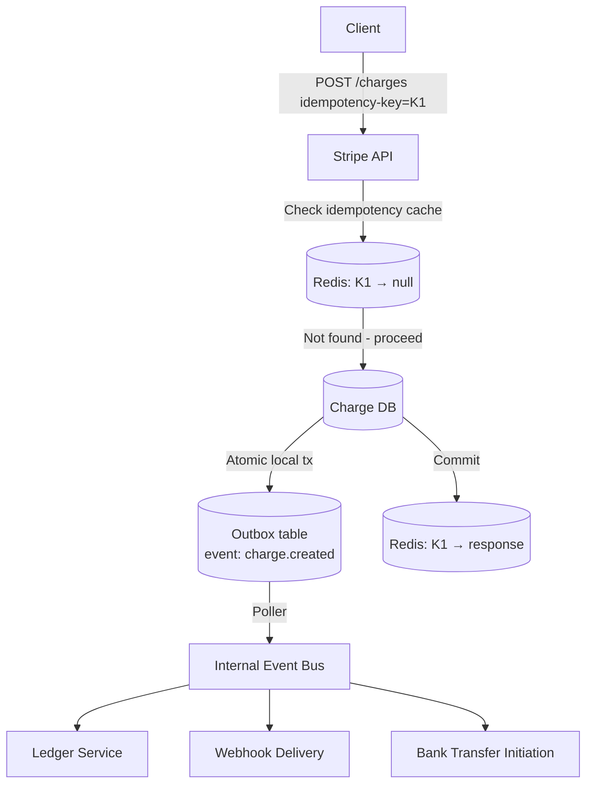

### Pitfalls
- ❌ **"Stripe uses 2PC for payment reliability":** Stripe explicitly avoids 2PC. Their reliability comes from idempotency keys + transactional outbox + idempotent consumers.
- ❌ **Forgetting idempotency key expiry:** Stripe's idempotency keys expire after 24 hours. After expiry, the same key creates a new charge. Client retry logic must handle this.

### Concept Reference

---

## Q10: Design a checkout flow spanning inventory-service + payment-service + order-service without 2PC

**Role:** Senior | **Difficulty:** 🔴 | **Priority:** P1 | **Format:** Scenario
**Real Company:** Amazon, Shopify

### The Brief
> "You're designing the checkout service for an e-commerce platform. Completing a purchase requires: (1) reserving inventory, (2) charging the payment method, (3) creating the order record. Any of these can fail. You cannot use distributed transactions (2PC). How do you ensure consistency?"

### Clarifying Questions
1. What is the acceptable staleness for inventory reads? (Can users see "1 item left" that's already sold?)
2. What happens if payment succeeds but order creation fails? (Who is responsible for the refund?)
3. Is inventory reservation optimistic (reserve then confirm) or pessimistic (hard lock)?
4. What are the retry policies for each service? (Are they idempotent by design?)

### Back-of-Envelope Estimation
| Metric | Calculation | Result |
|--------|-------------|--------|
| Peak checkouts | 100K users × 2% conversion × peak 3x | ~6K checkouts/min |
| Payment processing time | Stripe p99 | ~500ms |
| Inventory reservation | In-process Redis lock | ~5ms |
| Order creation | Local DB write | ~10ms |
| Total checkout latency target | Sum + saga overhead | < 2 seconds |

### High-Level Architecture

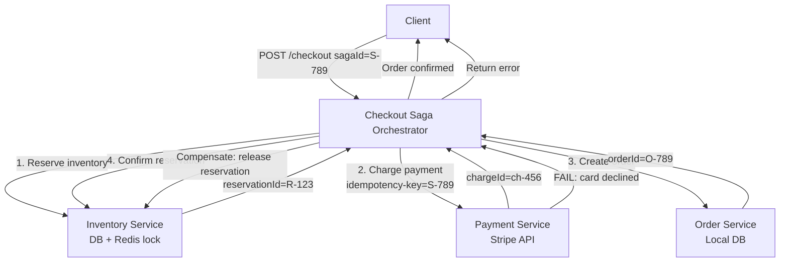

### Trade-off Decisions
| Decision | Option A | Option B | Chosen | Why |
|----------|----------|----------|--------|-----|
| Orchestration vs choreography | Orchestrator (Checkout Saga) | Event-driven choreography | Orchestrator | Simpler to reason about, explicit state machine |
| Inventory reservation | Hard reserve (decrement stock) | Soft reserve (mark as reserved) | Soft reserve | Allows oversell protection + easy compensation |
| Payment-first vs inventory-first | Charge payment first | Reserve inventory first | Reserve inventory first | Avoid charging for unavailable items |
| Saga state storage | In-memory | Database (saga table) | Database | Coordinator can crash; must resume |
| Compensation on payment fail | Refund | Release reservation (no charge) | Release reservation | Payment failed, nothing to refund |

### Failure Modes
| Failure | Impact | Mitigation |
|---------|--------|------------|
| Inventory service down | Saga fails at step 1, no charge | Retry 3x, then fail checkout gracefully |
| Payment API timeout | Unknown if charged (two generals) | Idempotency key + query payment status before compensating |
| Checkout service crashes mid-saga | Saga state lost | Recover from durable saga table on restart |
| Order creation fails after payment success | User charged, no order | Compensating tx: refund payment, release reservation |
| Reservation TTL expires before payment | User redirected to restart | Set reservation TTL > payment processing SLA + buffer (60s) |

