# Event Sourcing & CQRS

10 questions covering event store design, projections, schema evolution, and operational challenges.

---

## Q1: What is event sourcing and how does it differ from traditional CRUD?

**Role:** Mid | **Difficulty:** 🟡 | **Priority:** P1 | **Format:** Quick Answer

> **What the interviewer is testing:** Whether you understand event sourcing as an append-only log of facts rather than a mutable state store.

### Answer in 60 seconds
- **Traditional CRUD:** Store current state. A "transfer $100" operation updates the account balance column: `UPDATE accounts SET balance=balance-100 WHERE id=X`. History is lost.
- **Event sourcing:** Store every state-changing event as an immutable fact. The current state is derived by replaying the event log: `[AccountOpened($500), MoneyDeposited($200), MoneyWithdrawn($100)]` → balance = $600.
- **Key differences:**
  - CRUD: single row per entity; history requires audit log (often bolted on)
  - Event sourcing: append-only event stream per entity; current state is a projection
  - CRUD: O(1) reads, O(1) writes; Event sourcing: O(N) state reconstruction without snapshots
- **Benefits:** Full audit trail, time-travel queries, event-driven integration (publish events to other services), ability to add new projections retroactively.
- **Drawbacks:** Event replay for large histories is slow (100K events × 1ms = 100 seconds without snapshots); querying non-trivial (you query projections, not the event store directly).

### Diagram

```mermaid
graph LR
  subgraph CRUD["Traditional CRUD"]
    DB1[(accounts table<br/>id | balance<br/>A  | 600)]
    Op[UPDATE balance=600] --> DB1
  end
  subgraph ES["Event Sourcing"]
    Events[(Event Stream<br/>AccountOpened 500<br/>Deposited 200<br/>Withdrawn 100)]
    Append[Append event] --> Events
    Events -->|Replay| State[Current state: 600]
  end
```

### Pitfalls
- ❌ **Using event sourcing everywhere:** CRUD is simpler for entities with low write volume and no audit requirements. Apply event sourcing to aggregate roots with business-meaningful state transitions.
- ❌ **Storing technical events instead of business events:** `RowUpdated` is not an event. `MoneyTransferred`, `OrderPlaced`, `ItemShipped` are business events.

### Concept Reference

---

## Q2: What is CQRS and why do you use it with event sourcing?

**Role:** Mid | **Difficulty:** 🟡 | **Priority:** P1 | **Format:** Quick Answer

> **What the interviewer is testing:** Whether you understand read/write separation and why event sourcing naturally leads to CQRS for read efficiency.

### Answer in 60 seconds
- **CQRS (Command Query Responsibility Segregation):** Separate the write model (commands that change state) from the read model (queries that return data). Different data stores, schemas, and scaling strategies for each.
- **Why event sourcing needs CQRS:** The event store is an append-only log — querying it requires replaying events. For complex queries (e.g., "all orders in region X, last 30 days, >$100, grouped by customer"), replaying millions of events per request is impractical.
- **CQRS solution:** Maintain read-optimized projections (denormalized tables) built from the event stream. Each projection is a materialized view for a specific query pattern.
- **Numbers:** Event store write latency: 1–5ms (append). Read model query: 5–20ms (SQL on projection). Without CQRS, complex queries on event store: 100ms–10 seconds.
- **Trade-off:** Read model is eventually consistent with the event store (projection lag: typically < 1 second). Queries may not see the last 0–1 seconds of events.

### Diagram

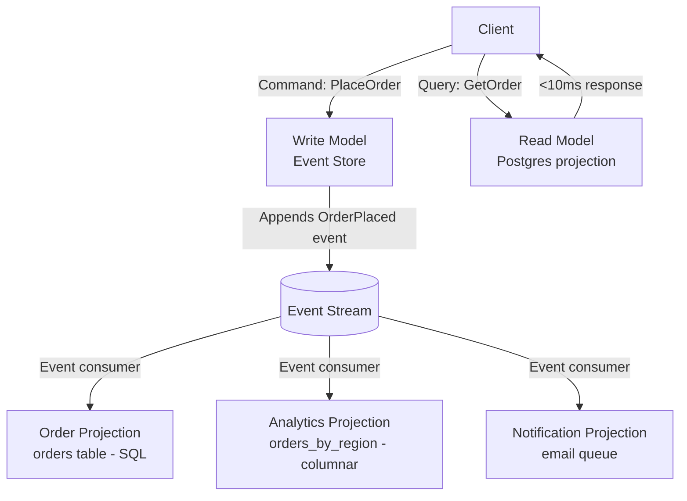

### Pitfalls
- ❌ **Using CQRS without event sourcing:** CQRS can be used without event sourcing (separate read/write DBs, replicated). But without events, projection rebuilding requires a full DB dump + replay — much more complex.
- ❌ **Synchronous projection updates:** Blocking the write path until projections are updated defeats the purpose. Projections must be asynchronous consumers of the event stream.

### Concept Reference

---

## Q3: How do you design an event store for high-throughput writes?

**Role:** Senior | **Difficulty:** 🔴 | **Priority:** P1 | **Format:** Deep Dive

> **What the interviewer is testing:** Whether you can design the event store schema and partitioning strategy to handle 100K+ events/sec.

### Problem Constraints
| Dimension | Value |
|-----------|-------|
| Write throughput | 100K events/sec |
| Event size | 1–10KB average |
| Retention | 7 years (financial compliance) |
| Read pattern | Replay by aggregate ID, 99% of reads |
| Storage | ~10TB/year at 100KB avg × 100K/sec × 31.5M sec |

### Approach A — Single-table SQL event store

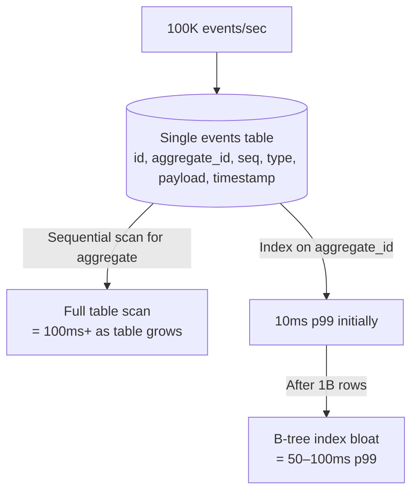

| Dimension | Single Table | Partitioned by Aggregate Type |
|-----------|-------------|-------------------------------|
| Write throughput | ~20K/sec (single PG instance) | 100K+/sec (sharded) |
| Replay latency | Degrades over time | Stable (small partition) |
| Operational complexity | Low | Medium |
| Suitability | < 10M events/day | > 10M events/day |

### Approach B — Kafka as event store (high throughput)

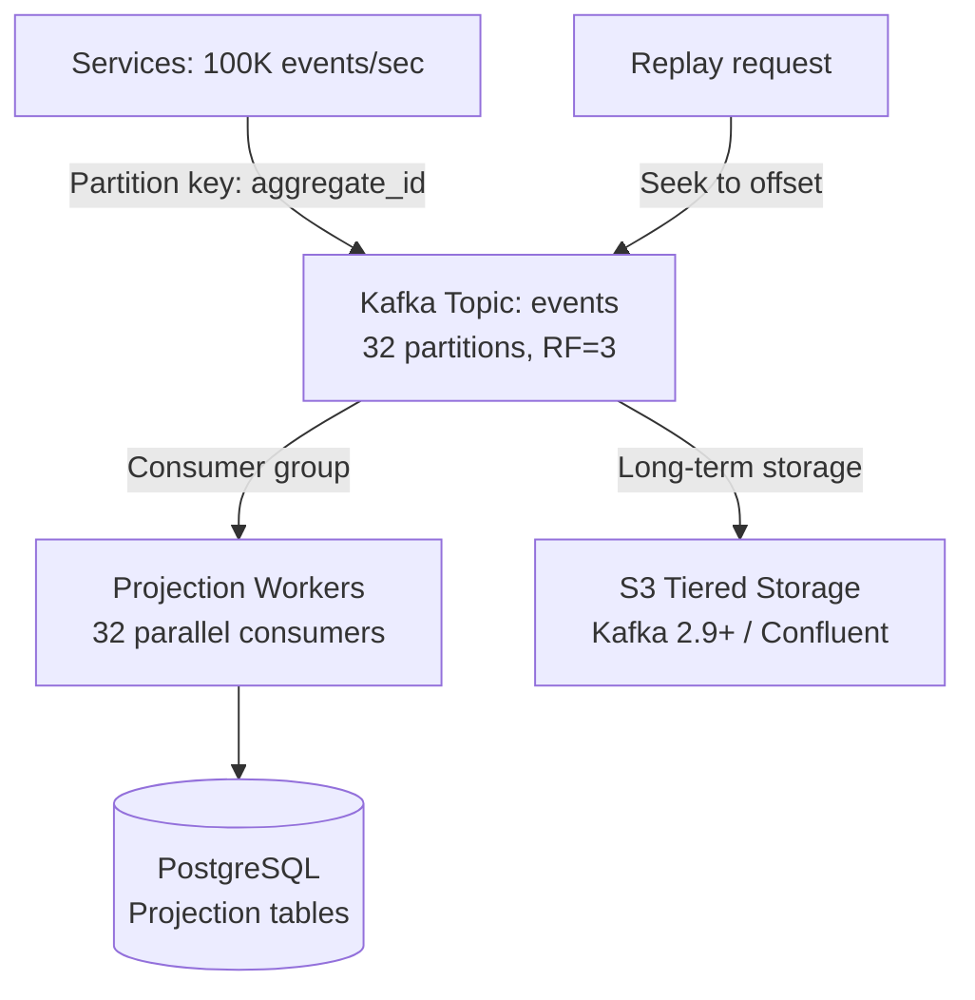

### Recommended Answer
For 100K events/sec, use **Kafka as the event store backbone** with PostgreSQL for queryable projections:

**Write path:** Producers append to Kafka with `aggregate_id` as partition key (same aggregate's events land in same partition, preserving order). Kafka with 32 partitions and 3 brokers handles 100K events/sec at p99 < 5ms.

**Replay path:** Consumer groups seek to specific offsets by aggregate ID. Kafka doesn't support native aggregate-level queries — maintain an index: `aggregate_id → (partition, start_offset)` in PostgreSQL. Replay aggregate: fetch partition + seek to start_offset + read until current offset.

**Long-term retention:** Kafka Tiered Storage (Confluent or Apache Kafka 3.6+) offloads old segments to S3 at ~$0.023/GB/month vs $0.10/GB for Kafka storage. At 10TB/year, this is $230/month vs $1000/month.

### What a great answer includes
- [ ] Partition by aggregate_id for ordering guarantees
- [ ] Separate index for aggregate_id → Kafka offset mapping
- [ ] Tiered storage for 7-year retention
- [ ] Consumer groups for parallel projection building
- [ ] Target write latency (< 5ms p99) and throughput (100K/sec)

### Pitfalls
- ❌ **Using Kafka without an offset index:** "Give me all events for order O-123" requires scanning all partitions without an index. The aggregate → offset index is mandatory for efficient replay.
- ❌ **Storing full event payload in the index:** The index should store only (aggregate_id, partition, start_offset, end_offset). Storing payload doubles storage costs.

### Concept Reference

---

## Q4: How do you replay events to rebuild state after a bug?

**Role:** Senior | **Difficulty:** 🔴 | **Priority:** P1 | **Format:** Quick Answer

> **What the interviewer is testing:** Whether you understand the full event replay workflow and its operational complexity in production.

### Answer in 60 seconds
- **Trigger:** A bug in the projection builder produced incorrect read models (e.g., balance calculations were wrong). Fix the bug, then rebuild the projection from scratch.
- **Replay steps:**
  1. Deploy fixed projection builder code (do NOT delete old projection yet)
  2. Stand up a new projection consumer reading from offset 0 of the event stream
  3. Let it run in parallel — new projection table `orders_v2` alongside `orders_v1`
  4. Monitor lag — consumer falls behind if event rate > replay rate
  5. When `orders_v2` is within 30 seconds of the live event stream, cut over application reads
  6. Delete `orders_v1`
- **Replay rate:** If event store has 1B events and consumer processes 50K events/sec, replay takes 1B ÷ 50K = 20,000 seconds ≈ 5.5 hours. Plan accordingly.
- **Partial replay:** If only events after a specific timestamp are affected, seek to that timestamp offset rather than replaying from 0. Reduces replay time proportionally.

### Diagram

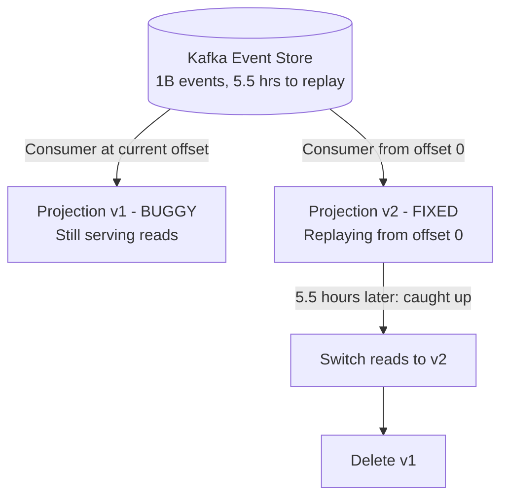

### Pitfalls
- ❌ **Deleting the old projection before the new one is ready:** Users see errors for the entire 5.5-hour replay window. Always run in parallel.
- ❌ **Replaying at full speed without throttling:** A replay consumer reading 50K events/sec competes with live consumers for Kafka broker I/O. Set replay consumer `fetch.max.bytes` to limit impact.

### Concept Reference

---

## Q5: How do you handle event schema evolution without breaking consumers?

**Role:** Senior | **Difficulty:** 🔴 | **Priority:** P2 | **Format:** Deep Dive

> **What the interviewer is testing:** Whether you can manage long-lived event schemas across multiple consumer versions in production.

### Problem Constraints
| Dimension | Value |
|-----------|-------|
| Event store retention | 7 years |
| Consumer count | 12 different services consuming events |
| Evolution type | Add new field to `OrderPlaced` event |
| Requirement | Old consumers must not break; new consumers see new field |

### Approach A — Versioned event types (simple but proliferates types)

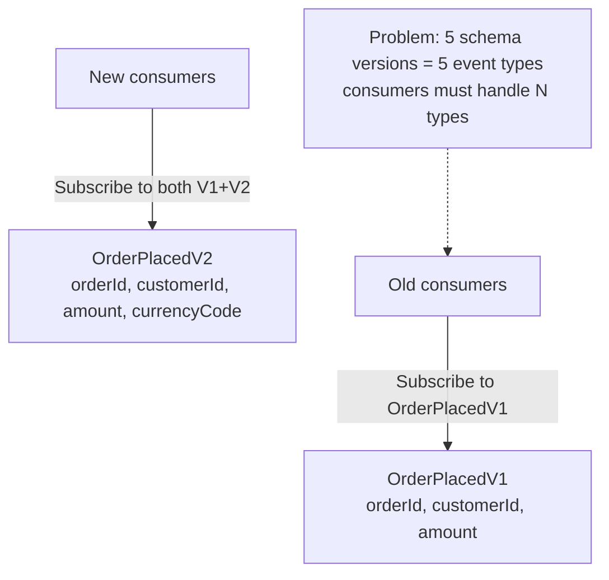

### Approach B — Schema registry with Avro/Protobuf (production standard)

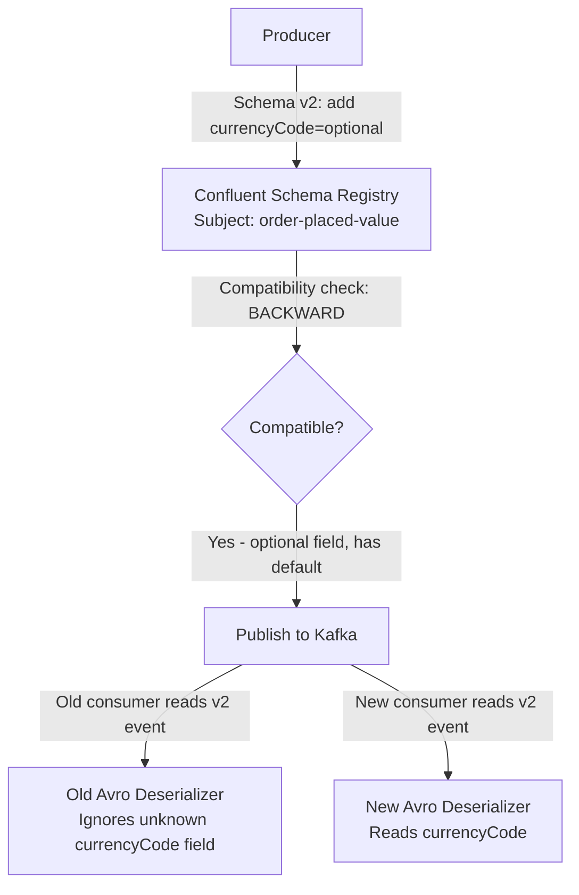

| Strategy | Description | Consumer Impact |
|----------|-------------|-----------------|
| BACKWARD compatible | New schema can read old data | Old consumers must upgrade to read new events |
| FORWARD compatible | Old schema can read new data | New consumers can read old events |
| FULL compatible | Both directions work | Zero consumer breakage |
| Best practice | FULL compatibility | No coordination required |

### Recommended Answer
Use a **schema registry with Avro or Protobuf and FULL compatibility mode**:

Rules for FULL compatible evolution:
1. Adding new fields: always optional with a default value (`currencyCode = "USD"`)
2. Removing fields: mark as deprecated for 1 major version; old consumers ignore unknown fields
3. Renaming fields: add new name as optional field, deprecate old name — never rename directly
4. Changing types: not allowed in FULL mode; add new field with new type

The schema registry enforces these rules at publish time — a producer trying to remove a required field gets a compatibility check rejection before publishing.

For 7-year event retention: the schema registry stores schema versions permanently. An event from 7 years ago carries its schema ID; consumers fetch the schema at that ID and deserialize correctly regardless of current schema version.

### What a great answer includes
- [ ] Schema registry (Confluent or AWS Glue) for compatibility enforcement
- [ ] FULL compatibility mode rules (optional fields + defaults)
- [ ] How old events stored in Kafka remain deserializable 7 years later
- [ ] Deprecation process for field removal (2-version grace period)
- [ ] Producer-side compatibility check before publish

### Pitfalls
- ❌ **Using JSON without a schema registry:** JSON doesn't enforce schema compatibility. A developer adds `"currency": "USD"` thinking it's backward compatible — a consumer that does `event["currency"].toUpperCase()` throws NullPointerException on old events without `currency`.
- ❌ **Renaming fields directly:** Field rename = remove + add. This is a BREAKING change. Old consumers that reference the old field name break. Always add new name + deprecate old.

### Concept Reference

---

## Q6: How do you maintain read-model projections with eventual consistency?

**Role:** Senior | **Difficulty:** 🔴 | **Priority:** P2 | **Format:** Quick Answer

> **What the interviewer is testing:** Whether you understand projection lag and how to handle reads that arrive before the projection is updated.

### Answer in 60 seconds
- **Projection lag:** The event store is the source of truth. Projections are eventually consistent. Typical projection lag: 50–500ms. During high load or consumer restart: up to 30 seconds.
- **Read-after-write consistency problem:** User places order → `OrderPlaced` event published → user immediately calls `GET /orders/O-123` → projection not yet updated → 404 response. Bad UX.
- **Solutions:**
  1. **Read from write model:** For the specific aggregate just written, read from the event store directly (strong consistency). Use projection for queries.
  2. **Version token:** Return a version number with each write. Client sends version in subsequent read. Projection layer waits up to 500ms for projection to reach that version, then serves the read.
  3. **Optimistic UI:** Frontend shows the new state immediately from the write response, without waiting for a confirmed read. Background polling confirms eventually.
- **Monitoring:** Track projection consumer lag. Alert if lag > 5 seconds (normal: < 500ms). Lag spikes indicate consumer processing issues.

### Diagram

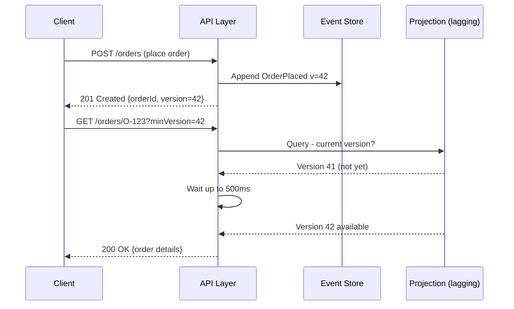

### Pitfalls
- ❌ **Ignoring read-after-write consistency:** An "eventually consistent" system that returns 404 immediately after a successful write fails basic UX expectations. Always have a strategy.
- ❌ **Waiting indefinitely for projection:** If projection consumer is down, the 500ms wait turns into an infinite hang. Always set a timeout — return 202 Accepted + polling URL if projection isn't ready.

### Concept Reference

---

## Q7: How does Shopify use event sourcing for order lifecycle management?

**Role:** Staff | **Difficulty:** ⚫ | **Priority:** P2 | **Format:** Quick Answer

> **What the interviewer is testing:** Whether you know a real-world event sourcing implementation at scale and the specific benefits it provides.

### Answer in 60 seconds
- **Shopify's Order Domain:** Each order goes through 15–20 state transitions (placed → payment authorized → inventory allocated → shipped → delivered → closed). Shopify models each as an immutable event.
- **Why event sourcing:** Shopify processes 40K+ orders/minute at peak (Black Friday). Merchants need complete audit trails for compliance, chargebacks, and customer service. Traditional CRUD would require a separate audit log table with manual maintenance.
- **Technical implementation:** Shopify uses MySQL with an `order_events` table (aggregate_id, event_type, payload JSON, created_at, version). Partition by `aggregate_id mod 4096` for horizontal sharding across MySQL shards.
- **Projections:** 3 main projections: (1) Order summary view for merchant dashboard, (2) Order line items for fulfillment, (3) Financial transactions view for accounting. Each built from the same event stream.
- **Scale numbers:** ~500M order events/day at peak season. Event store: 50TB+ per year. Uses logical replication to keep projections < 2 seconds behind the event stream.
- **Benefit realized:** When Shopify discovered a bug in tax calculation (2021), they replayed 6 months of events through a fixed projection to generate corrected tax reports — without touching the authoritative order data.

### Diagram

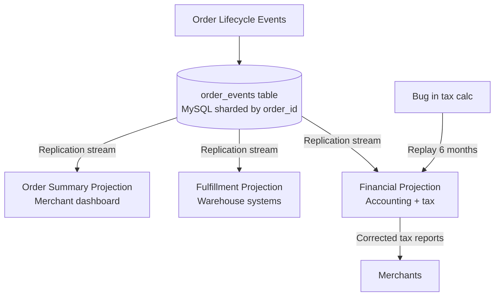

### Pitfalls
- ❌ **"Event sourcing requires Kafka":** Shopify uses MySQL for event storage (append-only table), not Kafka. Kafka is one option; a database table works fine at moderate scale.
- ❌ **Sharding by timestamp instead of aggregate_id:** Sharding by timestamp creates hot shards (all recent writes go to the "current time" shard). Always shard by aggregate_id for even distribution.

### Concept Reference

---

## Q8: What are the operational challenges of event sourcing at scale (snapshot, compaction)?

**Role:** Staff | **Difficulty:** ⚫ | **Priority:** P2 | **Format:** Deep Dive

> **What the interviewer is testing:** Whether you understand the long-tail operational problems — large event streams, replay performance, and storage costs.

### Problem Constraints
| Dimension | Value |
|-----------|-------|
| Aggregate | Bank account with 5 years of transactions |
| Events per account | 5 events/day × 365 × 5 = 9,125 events |
| Replay on every read | 9,125 events × 0.1ms = 912ms (unacceptable) |
| Target read latency | p99 < 50ms |

### Approach A — No snapshots (replay from start)

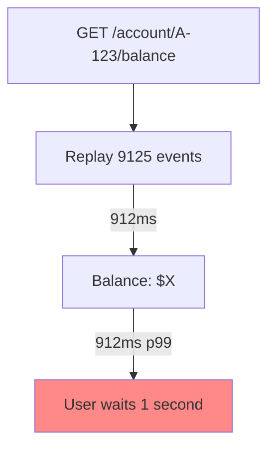

### Approach B — Periodic snapshots

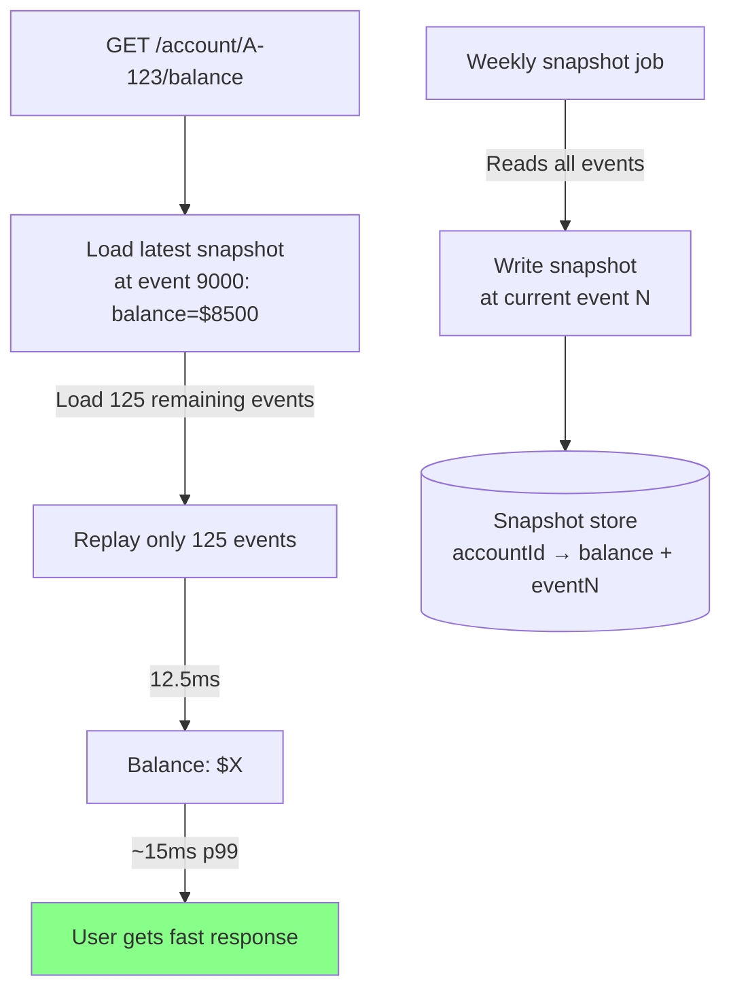

| Challenge | Problem | Solution |
|-----------|---------|----------|
| Long event streams | Replay time grows linearly | Periodic snapshots every N events or T time |
| Snapshot frequency | Too frequent = extra writes; too rare = slow replay | Every 500 events or weekly, whichever comes first |
| Snapshot invalidation | Bug in state logic = wrong snapshot | Snapshots are caches — rebuild from events on correction |
| Event log compaction | Old events consume storage but needed for replay | Compact only events before snapshot; keep snapshot |
| Schema evolution | Old events use old schema | Schema registry + version-aware deserializer |

### Recommended Answer
Two critical operational mechanisms for event sourcing at scale:

**Snapshots:** Store the derived state of an aggregate at a specific event number. On reads, load the latest snapshot and replay only subsequent events. Snapshot frequency: every 500 events or every 24 hours. Snapshots are caches — they can be invalidated and rebuilt. Never trust a snapshot from before a bugfix — rebuild from events.

**Log compaction/tiering:** Events older than a configurable threshold (e.g., 2 years) are moved to cold storage (S3 Glacier at $0.004/GB/month vs $0.10/GB hot). If a snapshot covers those events, they're needed only for rare full rebuilds. Implement tiered storage with hot/warm/cold tiers based on access frequency.

**Storage estimate:** 5 events/day × 1KB × 10M accounts × 365 days/year = 18TB/year. At Glacier pricing: $72/year vs $1800/year hot storage. Critical for long-retention event stores.

### What a great answer includes
- [ ] Snapshot frequency formula (N events OR T time, whichever first)
- [ ] Explain snapshots as caches that can be invalidated
- [ ] Storage tiering for old events (hot → warm → cold)
- [ ] Replay performance with snapshots (125 events vs 9125 events)
- [ ] Monitoring: snapshot age, replay latency percentiles

### Pitfalls
- ❌ **Treating snapshots as authoritative:** A snapshot produced by buggy code is wrong. Always be able to rebuild from events. Snapshots are performance optimizations, not source of truth.
- ❌ **Compacting events without snapshots:** Compacting/deleting events before ensuring a snapshot covers them makes full replay impossible. Snapshot first, then compact.

### Concept Reference

---

## Q9: Design an event-sourced bank account system — what events, what projections?

**Role:** Senior | **Difficulty:** 🔴 | **Priority:** P1 | **Format:** Scenario
**Real Company:** Monzo, Starling Bank, N26

### The Brief
> "Design the data model for a bank account using event sourcing. Define the events, the aggregate, the projections you'd build, and how you'd handle the 'replay time grows with account age' problem."

### Clarifying Questions
1. What are the regulatory retention requirements? (7 years for financial data in most jurisdictions)
2. Do we need real-time balance (< 100ms) or can we tolerate 1-second eventual consistency?
3. How many transactions per account per day at peak? (drives snapshot frequency)
4. Do we need cross-account queries (e.g., "all transfers over $10K today")?

### Back-of-Envelope Estimation
| Metric | Calculation | Result |
|--------|-------------|--------|
| Events per account/year | 5 tx/day × 365 days | ~1,825 events/year |
| Events per account over 7 years | 1,825 × 7 | ~12,775 events |
| Replay without snapshot | 12,775 × 0.05ms | ~639ms (too slow) |
| Events per account since last weekly snapshot | 5 tx/day × 7 days | ~35 events |
| Replay with weekly snapshot | 35 × 0.05ms | ~1.75ms (fast) |

### High-Level Architecture

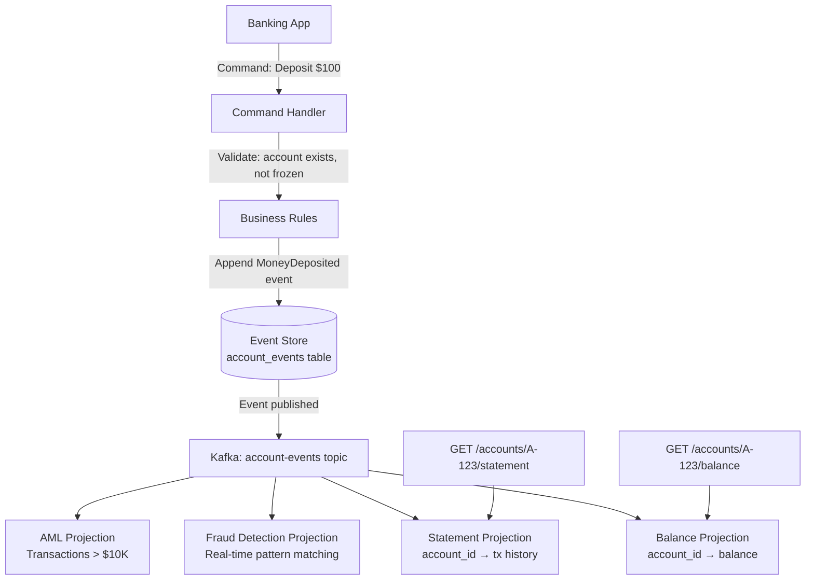

### Trade-off Decisions
| Decision | Option A | Option B | Chosen | Why |
|----------|----------|----------|--------|-----|
| Balance read strategy | Always replay events | Read from balance projection | Balance projection | <5ms vs 600ms |
| Snapshot frequency | Every 100 events | Weekly | Weekly + 100-event cap | Balance hot reads don't need frequent snapshots |
| Event storage | PostgreSQL | Kafka + S3 | PostgreSQL (< 5TB) + S3 for archive | Simpler ops at moderate scale |
| Balance consistency | Eventual (projection) | Strong (replay) | Strong for write checks; eventual for reads | Prevent overdrafts |

### Failure Modes
| Failure | Impact | Mitigation |
|---------|--------|------------|
| Balance projection lag | Overdraft risk if balance check uses stale data | Use event store (strong) for write-path balance check |
| Snapshot corruption | Full replay needed (639ms) | Checksum on snapshots; verify on load |
| Event store full | New transactions fail | Alert at 80% capacity; archive events > 3 years to S3 |
| Consumer crash mid-replay | Projection partially updated | Idempotent projection updates; track last processed event |

### Concept References

---

## Q10: How does event sourcing enable time-travel debugging in production?

**Role:** Staff | **Difficulty:** ⚫ | **Priority:** P3 | **Format:** Quick Answer

> **What the interviewer is testing:** Whether you can articulate the debugging and auditability benefits of immutable event logs beyond just "we have history."

### Answer in 60 seconds
- **Time-travel debugging:** Because the event store is immutable and append-only, you can reconstruct the exact state of any aggregate at any point in time by replaying events up to that timestamp.
- **Practical use case:** User calls support: "My account balance was wrong on March 15 at 2:47 PM." Support engineer replays account events up to `2024-03-15T14:47:00Z` and sees exactly what happened — no speculation, no log grepping.
- **Bug reproduction:** A production bug caused incorrect discount calculation on orders between 14:00–14:15 yesterday. Replay those orders through the fixed code to verify the fix without touching production data.
- **Regulatory compliance:** Financial regulators can request "what was the account state on date X?" — answer in seconds by replaying to that date. With traditional CRUD + audit log, this query may require complex JOIN chains across backup tables.
- **A/B testing new business logic:** Run new pricing algorithm against historical events in a shadow projection. Compare shadow results vs what actually happened. No production impact.
- **Numbers:** Replay 1,000 events to reconstruct state at a specific timestamp: ~50ms at 0.05ms/event. With snapshot: ~2ms for last 40 events.

### Diagram

```mermaid
graph TD
  Support[Support Engineer: "What was balance on March 15?"]
  Support -->|Query: replay account-123 up to 2024-03-15T14:47| Replay[Event Store]
  Replay -->|Load snapshot at event 8000 (March 10)| Snap[Snapshot: balance=$5,200]
  Replay -->|Replay 125 events from March 10 to March 15| Events[MoneyDeposited, MoneyWithdrawn ×125]
  Events -->|State at March 15 14:47| Result[Balance: $4,150<br/>Last event: Withdrawal $100 at 14:46]
  Result -->|Show to support engineer| Support
```

### Pitfalls
- ❌ **"Time-travel is free":** Replaying 5 years of events per debugging session is expensive. Maintain periodic snapshots specifically for debugging use cases (daily snapshots, not just weekly).
- ❌ **Storing only aggregate-level events:** To debug cross-aggregate interactions (why did Order O-123 trigger a refund on Account A-456?), you need events from both aggregates correlated by saga ID. Include correlation IDs in all events.

### Concept Reference
