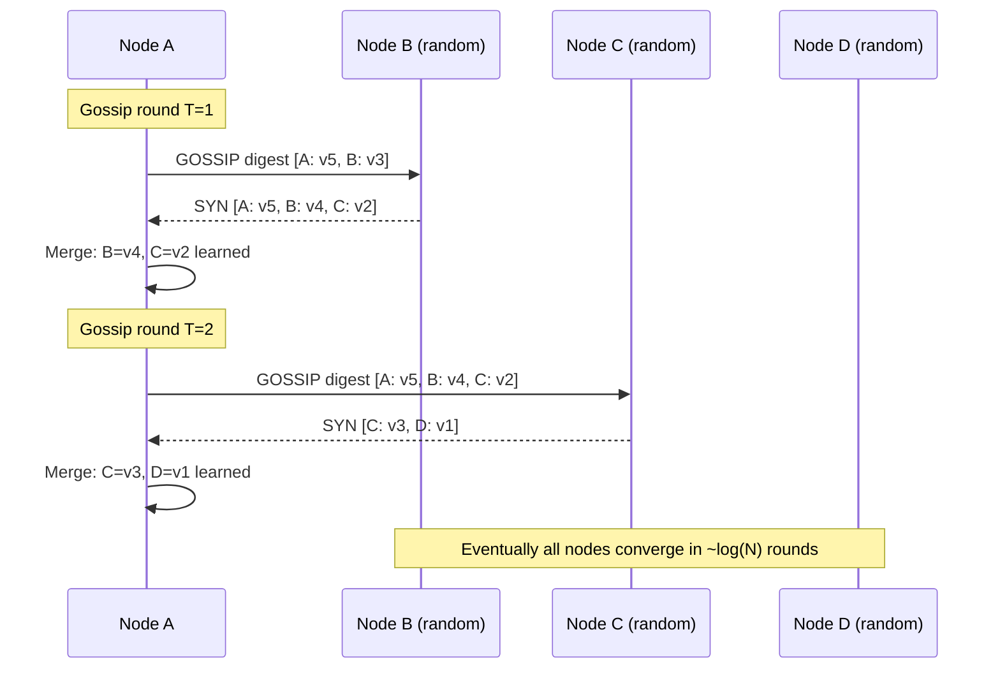
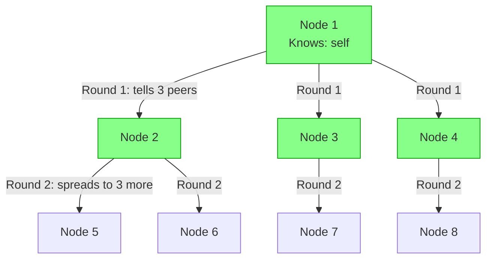
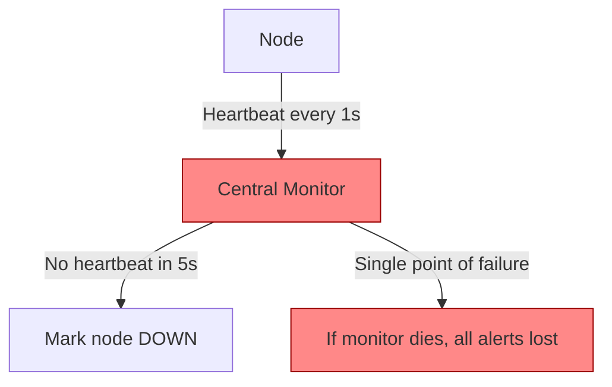
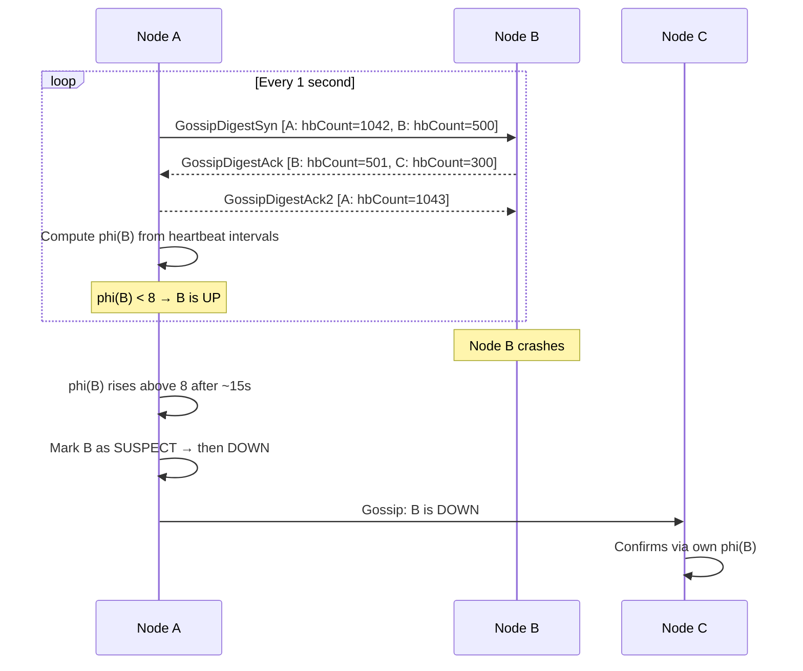
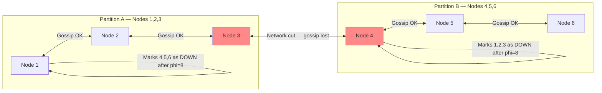
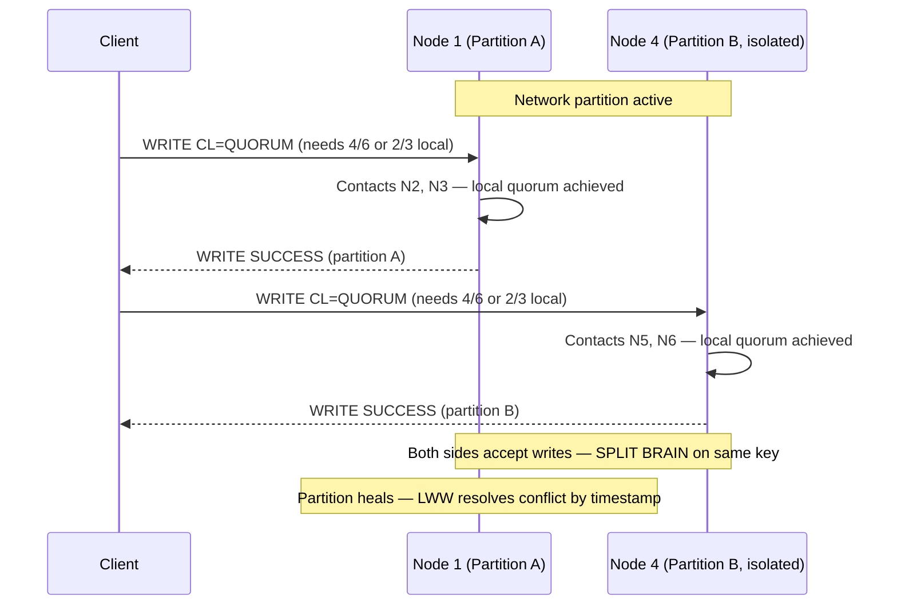
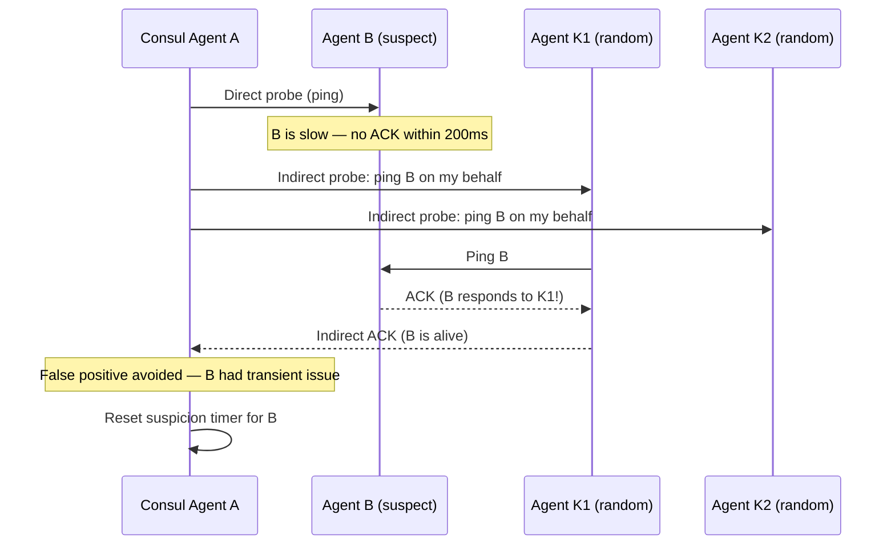
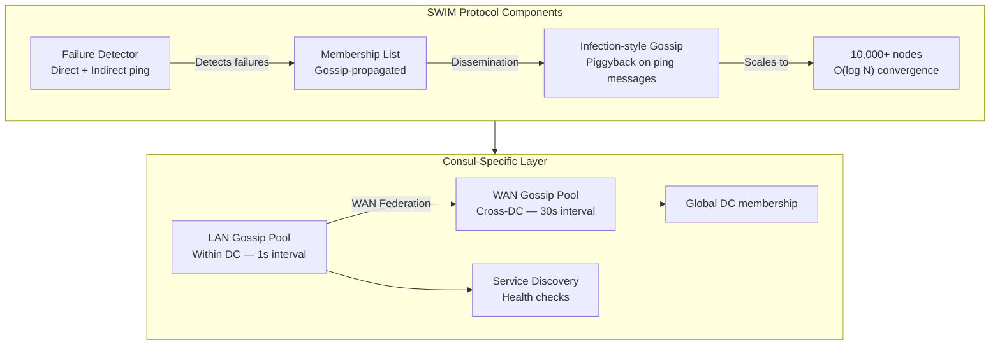

```mermaid
graph TD
  subgraph Rumor["Rumor-Mongering (Push, Fast)"]
    R1[Node learns new fact] -->|Pushes to 3 random peers| R2[Peers updated in ~log N rounds]
    R2 --> R3[Peers stop after k rounds]
    R3 --> R4[Risk: small % of nodes may miss it]
  end
  subgraph AntiEntropy["Anti-Entropy (Pull, Complete)"]
    A1[Node computes Merkle hash of state] -->|Exchange digest with peer| A2[Identify divergence]
    A2 -->|Send missing data| A3[Both nodes converge]
    A3 --> A4[Guaranteed: all differences repaired]
  end
  style R4 fill:#ff8,stroke:#880
  style A4 fill:#8f8,stroke:#090
```

# Gossip Protocol

5 questions covering gossip protocols from fundamentals to Staff-level nuance.

---

## Q1: What is the gossip (epidemic) protocol and how does it propagate information?

**Role:** Mid, Backend | **Difficulty:** 🟡 | **Priority:** P0 | **Format:** Quick Answer

> **What the interviewer is testing:** Whether you understand the core mechanics of gossip propagation and why it is preferred over centralized broadcast at scale.

### Answer in 60 seconds
- **Definition:** A gossip protocol (also called epidemic protocol) is a peer-to-peer communication method where each node periodically selects one or more random peers and exchanges state information — similar to how rumors spread through a population.
- **Propagation rate:** With N nodes, information reaches all nodes in O(log N) rounds. At 1,000 nodes with a 1-second gossip interval, full propagation completes in ~10 seconds. At 10,000 nodes: ~14 seconds.
- **Each gossip round:** Node A picks 3 random peers, sends its current state digest. Recipients update their state and reply with their own digest. Each node merges the two states (latest timestamp wins).
- **Fault-tolerant by design:** There is no single coordinator. Even if 30% of nodes fail, the remaining 70% continue to propagate information — gossip self-heals.
- **Bandwidth cost:** Each round sends a small digest (not full state). At 1,000 nodes with 200-byte digests, gossip traffic = 1,000 × 3 × 200B = 600KB/sec. Negligible.

### Diagram

### Pitfalls
- ❌ **"Gossip is slow":** O(log N) propagation is fast — 14 rounds for 10,000 nodes. The concern is *eventual* consistency, not propagation speed.
- ❌ **Confusing gossip with broadcast:** Broadcast is O(N) messages from one node. Gossip distributes the fan-out across all nodes — much more scalable.
- ❌ **Assuming eventual = unlimited staleness:** Most gossip intervals are 1 second. Full cluster convergence at 10,000 nodes takes ~14 seconds under normal conditions.

### Concept Reference

---

## Q2: How does Cassandra use gossip for cluster membership and failure detection?

**Role:** Senior | **Difficulty:** 🔴 | **Priority:** P0 | **Format:** Deep Dive

> **What the interviewer is testing:** Whether you understand Cassandra's specific gossip implementation — including the Phi Accrual Failure Detector — and how it avoids false positives.

### Problem Constraints
| Dimension | Value |
|-----------|-------|
| Cluster size | 3–200 nodes typical; Netflix runs 2,500+ |
| Gossip interval | Every 1 second per node |
| Failure detection | Phi Accrual Failure Detector (phi threshold = 8) |
| State propagated | Token ranges, load, schema version, DC/rack info |

### Approach A — Heartbeat-Based Detection (naive)

| Dimension | Heartbeat | Gossip + Phi |
|-----------|-----------|--------------|
| SPOF risk | High (central monitor) | None (decentralized) |
| False positive rate | High (fixed threshold) | Low (adaptive threshold) |
| Failure detection time | Fixed 5s | 10–30s (adaptive) |
| Scalability | Poor (O(N) to monitor) | Good (O(log N)) |

### Approach B — Cassandra's Gossip + Phi Accrual (production)

### Recommended Answer
Cassandra runs a gossip round every **1 second** per node. Each node initiates gossip with 1 random live node, 1 random dead node (to allow recovery detection), and 1 random seed node. The gossip message contains a `GossipDigest` — a compact summary of each node's heartbeat counter and schema version.

Failure detection uses the **Phi Accrual Failure Detector**: instead of a hard timeout, phi (φ) is a continuous suspicion value computed from the distribution of heartbeat arrival intervals. When phi exceeds the threshold (default **phi_convict_threshold = 8**, corresponding to ~15-second failure detection), the node is marked `SUSPECT`. After a grace period with no recovery, it is marked `DOWN`. This adaptive approach reduces false positives during GC pauses (which can last 5–10 seconds without triggering false failures).

State propagated via gossip includes: token ownership, load (disk usage), schema version hash, DC/rack topology, and node status (NORMAL, LEAVING, JOINING, MOVING).

### What a great answer includes
- [ ] Explain the 3-way gossip handshake (SYN, ACK, ACK2) each round
- [ ] Describe Phi Accrual Failure Detector with the phi threshold (8) and approximate detection time (~15s)
- [ ] Mention the seed node list and why at least 1 seed must be reachable on startup
- [ ] Explain gossip covers schema propagation, not just membership
- [ ] State gossip interval = 1 second, detection time = 10–30 seconds adaptive

### Pitfalls
- ❌ **"Cassandra uses a fixed timeout for failure detection":** The Phi Accrual detector is adaptive — it adjusts based on historical heartbeat intervals, making it robust to GC pauses.
- ❌ **Confusing seeds with special nodes:** Seed nodes are only special at startup — they bootstrap the gossip ring. During normal operation, any node can gossip with any other.
- ❌ **"DOWN means data is lost":** When a node is marked DOWN, its token ranges are still served by replicas. Hinted handoff stores writes for up to 3 hours for replay on recovery.

### Concept Reference

---

## Q3: What is anti-entropy gossip vs rumor-mongering — when do you use each?

**Role:** Senior | **Difficulty:** 🔴 | **Priority:** P1 | **Format:** Quick Answer

> **What the interviewer is testing:** Whether you know the two fundamental gossip modes and their trade-off between thoroughness and efficiency.

### Answer in 60 seconds
- **Rumor-mongering (push-based):** When a node learns new information, it actively pushes it to random peers. It stops pushing after a random number of rounds (the "infect and die" model). Fast propagation — O(log N) rounds. Does NOT guarantee all nodes receive the update (probability ~= 1 - 1/N^2 for large N, effectively 100%).
- **Anti-entropy (pull-based):** Nodes periodically exchange full Merkle tree digests of their state. They identify and repair differences — including old information. Slow but **complete**: guarantees eventual consistency even for data that was missed during rumor-mongering.
- **When to use each:**
  - Rumor-mongering: Real-time cluster membership updates, failure notifications — speed matters, occasional misses acceptable.
  - Anti-entropy: Database replica sync, storage consistency checks — correctness matters, speed is secondary.
- **Cassandra uses both:** Rumor-mongering for membership gossip (1-second intervals), anti-entropy repair via `nodetool repair` for storage consistency (weekly or per operator schedule).

### Diagram

### Pitfalls
- ❌ **"Rumor-mongering guarantees delivery":** It achieves very high probability (>99.99%) but is not 100% guaranteed. Anti-entropy fills the gap for critical data.
- ❌ **Running anti-entropy too frequently:** Cassandra's `nodetool repair` is resource-intensive — it generates Merkle tree comparisons across all data. Running it daily on large clusters causes read latency spikes of 20–50%.

### Concept Reference

---

## Q4: How does gossip handle network partitions — split brain detection?

**Role:** Senior | **Difficulty:** 🔴 | **Priority:** P1 | **Format:** Deep Dive

> **What the interviewer is testing:** Whether you understand how gossip propagates partition awareness and the limitations of gossip-only split-brain detection.

### Problem Constraints
| Dimension | Value |
|-----------|-------|
| Cluster | 6 nodes split into 2 groups of 3 |
| Gossip interval | 1 second |
| Partition duration | 30 seconds to 5 minutes |
| Risk | Both halves accept writes — data diverges |

### Approach A — Gossip-Only (incomplete)

| Dimension | Gossip-Only | Gossip + Quorum |
|-----------|-------------|-----------------|
| Detects partition | Yes (after ~15s) | Yes |
| Prevents writes on minority | No | Yes (quorum rejects) |
| Split-brain risk | High | Low |
| Complexity | Low | Medium |

### Approach B — Gossip + Quorum Writes (production pattern)

### Recommended Answer
Gossip detects partitions by observing which nodes stop sending heartbeats (phi > 8 after ~15 seconds). However, gossip alone does **not prevent** split-brain writes — both partition halves believe the other side is down and continue accepting writes.

The production mitigation is **quorum-based writes combined with gossip**. In a 6-node cluster split 3/3, `LOCAL_QUORUM` (2/3 within a DC) still allows both halves to write independently — this is the fundamental limitation. True split-brain prevention requires a majority quorum across **all** nodes (4/6), which the smaller half (3 nodes) cannot achieve and will reject writes.

Cassandra's operational recommendation: for clusters spanning 2 DCs, use `EACH_QUORUM` or design with a tiebreaker DC. For single-DC clusters with RF=3, split-brain is inherently limited by the majority quorum constraint (2/3 nodes minimum).

### What a great answer includes
- [ ] Gossip detects but does not prevent split-brain — this is the key insight
- [ ] Explain how quorum size determines split-brain risk (minority partition cannot achieve quorum)
- [ ] Mention LWW (Last Write Wins) as the conflict resolution after partition heals
- [ ] State detection time ~15 seconds (phi threshold = 8)
- [ ] Recommend tiebreaker DC or odd-numbered quorums for multi-DC

### Pitfalls
- ❌ **"Gossip prevents split-brain":** Gossip is a detection mechanism, not a prevention mechanism. Prevention requires quorum writes.
- ❌ **Ignoring the partition recovery phase:** When partitions heal, anti-entropy repair must run to reconcile diverged writes. Without `nodetool repair`, inconsistencies persist indefinitely.

### Concept Reference

---

## Q5: How does Consul use gossip (SWIM protocol) to manage 10,000 service instances?

**Role:** Staff | **Difficulty:** ⚫ | **Priority:** P2 | **Format:** Deep Dive

> **What the interviewer is testing:** Whether you understand the SWIM protocol's efficiency improvements over basic gossip and how Consul scales to large service meshes.

### Problem Constraints
| Dimension | Value |
|-----------|-------|
| Service instances | 10,000 across 50 services |
| Gossip protocol | SWIM (Scalable Weakly-consistent Infection-style Membership) |
| Failure detection SLA | < 15 seconds |
| Gossip fanout | 3 random peers per round |
| Message size | ~1KB per gossip message |

### Approach — SWIM with Indirect Probing

### Recommended Answer
Consul uses **SWIM (Scalable Weakly-consistent Infection-style Membership protocol)**, which improves over basic gossip in three ways:

1. **Indirect probing:** When node A suspects node B is down (no direct ping ACK within 200ms), A asks K random nodes to probe B on its behalf. This eliminates false positives from transient connectivity issues between specific pairs — a significant problem at 10,000 nodes.

2. **Suspicion mechanism:** A node is moved to `SUSPECT` state before `DEAD`. Other nodes that have recent gossip from the suspect can refute the suspicion. This reduces false death declarations during GC pauses or brief network blips.

3. **Piggybacking:** Membership update messages (joins, failures, recoveries) are piggybacked onto existing ping/ACK messages — no extra gossip messages needed. Bandwidth stays near O(log N) even at 10,000 nodes.

Consul runs **two separate gossip pools**: LAN pool (within a datacenter, 1-second interval, all agents) and WAN pool (cross-DC, 30-second interval, servers only). At 10,000 instances in one DC with fanout=3, bandwidth per node = 3 × 1KB × 1/second = 3KB/sec. Total cluster gossip traffic = 10,000 × 3KB = 30MB/sec — acceptable for modern networks.

Failure detection latency at 10,000 nodes: direct ping timeout 200ms + indirect probe 500ms + gossip propagation (~14 rounds × 1s) = **~15 seconds end-to-end**.

### What a great answer includes
- [ ] Explain indirect probing and why it reduces false positives at scale
- [ ] Describe the SUSPECT state as a buffer before DEAD declaration
- [ ] Mention piggybacking as the key bandwidth optimization
- [ ] Differentiate LAN gossip pool (1s) vs WAN pool (30s)
- [ ] Provide bandwidth numbers: 3KB/sec per node, 30MB/sec cluster-wide at 10K nodes

### Pitfalls
- ❌ **"Consul gossip is the same as Cassandra gossip":** Cassandra uses a custom 3-way handshake gossip. Consul uses SWIM with indirect probing — a different and more scalable algorithm.
- ❌ **"10,000 nodes means 10,000 gossip targets per round":** SWIM gossip fanout is fixed (typically 3). Each node only gossips with 3 peers per round regardless of cluster size.
- ❌ **Ignoring the WAN pool:** Cross-DC Consul federation uses a separate WAN gossip pool with only Consul servers (not all agents). This prevents WAN bandwidth explosion.

### Concept Reference
