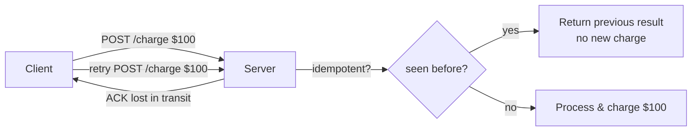
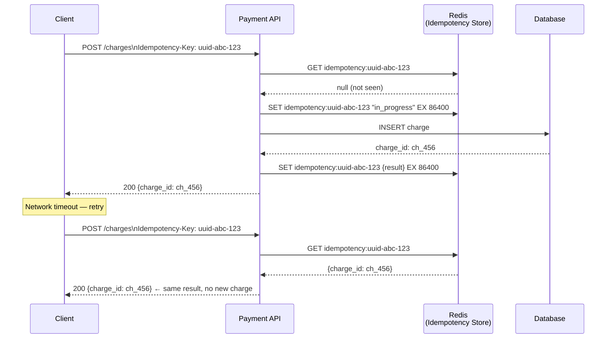
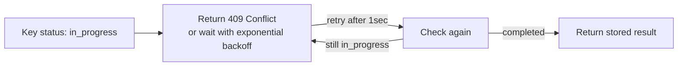
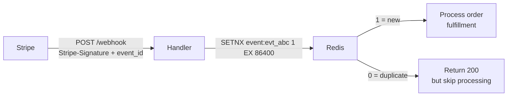
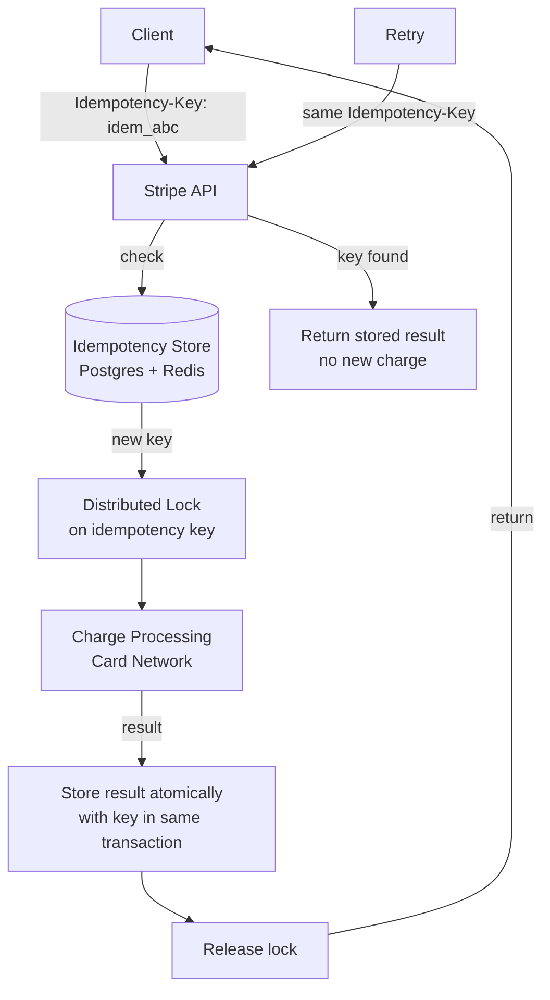

# Idempotency at Scale

8 questions covering idempotency from basics to Stripe-level payment guarantees.

---

## Q1: What is idempotency and why is it critical in distributed systems?

**Role:** Mid, Senior | **Difficulty:** 🟡 Mid | **Priority:** P0 | **Format:** Quick Answer

> **What the interviewer is testing:** Whether you understand retry storms and why at-least-once delivery requires idempotent consumers.

### Answer in 60 seconds
- **Definition:** An operation is idempotent if calling it multiple times has the same effect as calling it once. `PUT /users/1 {name: "Alice"}` is idempotent; `POST /orders` (create order) is not.
- **Why it matters:** Networks fail. Clients retry. Without idempotency, retries cause duplicate orders, double charges, duplicate emails.
- **At-least-once delivery** (Kafka, SQS, webhooks) guarantees messages are delivered ≥1 time — consumer must be idempotent.
- **Exactly-once is a lie:** True exactly-once is only achievable within a single system boundary. Across systems, you need idempotency.
- **Real cost:** Amazon processes 400M orders/year; 0.1% duplicate rate without idempotency = 400K duplicate charges.

### Diagram

### Pitfalls
- ❌ **"Retry = safe":** Without idempotency, at-least-once delivery means at-least-once side effects.
- ❌ **"Idempotent = read-only":** POST can be made idempotent with idempotency keys; GET is naturally idempotent.

---

## Q2: How do you implement idempotency keys for payment APIs?

**Role:** Senior, Backend | **Difficulty:** 🔴 Senior | **Priority:** P0 | **Format:** Deep Dive

> **What the interviewer is testing:** The complete design of client-generated keys, server storage, and expiry.

### Problem Constraints
| Dimension | Value |
|-----------|-------|
| Payment requests | 10K/sec |
| Idempotency window | 24 hours |
| Key storage size | 10K × 86400 = 864M keys/day |
| Key lookup latency | <5ms |

### Implementation Pattern

### Edge Case: In-flight key (concurrent retry)

### What a great answer includes
- [ ] Client generates UUID v4 key — server doesn't generate it
- [ ] Store key → result in Redis with 24-hour TTL
- [ ] Handle "in_progress" state (concurrent retries during processing)
- [ ] Return exact same response for duplicate requests (not a new resource)
- [ ] Key format: `{service}:{idempotency_key}` to namespace across services

### Pitfalls
- ❌ **Server-generated keys:** Defeats the purpose — client can't include the key on retry if server generates it after first request.
- ❌ **No "in_progress" state:** Concurrent retries process twice before first result is stored.

---

## Q3: How do you handle duplicate webhook delivery?

**Role:** Senior | **Difficulty:** 🟡 Mid | **Priority:** P1 | **Format:** Quick Answer

> **What the interviewer is testing:** Whether you apply idempotency to event consumers, not just API endpoints.

### Answer in 60 seconds
- **Webhook providers deliver at-least-once:** Stripe, GitHub, Twilio all guarantee ≥1 delivery; duplicates happen.
- **Each webhook has a unique event ID** (e.g., `evt_1Mq7Kk2eZvKYlo2C...` from Stripe).
- **Consumer must deduplicate** by storing processed event IDs.
- **Storage:** Redis `SETNX event:{id} 1 EX 86400` — if returns 0, already processed.
- **Window:** 24-hour dedup window covers Stripe's retry window (up to 72 hours — use 3-day window for safety).
- **Result:** Process event only if `SETNX` returns 1.

### Diagram

### Pitfalls
- ❌ **Returning 4xx on duplicate:** Stripe retries on non-2xx; always return 200 even for duplicates.
- ❌ **24-hour window only:** Stripe can retry for 72 hours — use 3-day dedup window.

---

## Q4: How do you make a database write idempotent using upsert?

**Role:** Mid, Senior | **Difficulty:** 🟡 Mid | **Priority:** P0 | **Format:** Quick Answer

> **What the interviewer is testing:** Practical SQL/NoSQL patterns for idempotent writes.

### Answer in 60 seconds
- **INSERT ... ON CONFLICT DO NOTHING / DO UPDATE** is the SQL idempotency primitive.
- **Natural key:** Use the business key as the unique constraint, not surrogate ID.
- **Example:** `INSERT INTO charges (idempotency_key, amount, user_id) VALUES (...) ON CONFLICT (idempotency_key) DO UPDATE SET updated_at = NOW()`
- **Return stored result:** After upsert, `SELECT` the row to return consistent response.
- **DynamoDB:** `PutItem` with `ConditionExpression: attribute_not_exists(pk)` — fails if exists; or use `UpdateItem` which is naturally idempotent.
- **Kafka:** Idempotent producer (`enable.idempotence=true`) ensures no duplicate messages from single producer instance.

### Pitfalls
- ❌ **`INSERT` then `SELECT` in separate transactions:** TOCTOU race condition — use single upsert.
- ❌ **Using surrogate IDs as idempotency key:** Auto-increment IDs aren't client-known; use business keys.

---

## Q5: How does Stripe guarantee exactly-once charge processing?

**Role:** Staff | **Difficulty:** ⚫ Staff | **Priority:** P2 | **Format:** Deep Dive

> **What the interviewer is testing:** End-to-end idempotency design at payment scale.

### Stripe's Multi-Layer Idempotency

### Key Stripe-specific decisions
- **Idempotency keys stored in Postgres** with the charge record — atomic write ensures key ↔ result consistency.
- **24-hour window** — keys expire; same key in a new payment is a new operation.
- **Different parameters + same key = 422 error** — prevents accidental reuse across different amounts.
- **Card network retries:** Even if Stripe's own retry is idempotent, card networks aren't — Stripe tracks network-level idempotency separately.
- **Scale:** Stripe processes ~500M API calls/day; idempotency check adds <1ms latency (Redis lookup).

### Pitfalls
- ❌ **Storing idempotency result separately from the charge:** Must be atomic — otherwise crash between charge and result storage causes duplicate on retry.
- ❌ **Same key accepted across different amounts:** Must validate parameters match on duplicate request.
