# Leader Election

10 questions covering leader election algorithms, split-brain prevention, and production deployments.

---

## Q1: Why do distributed systems need leader election?

**Role:** Mid | **Difficulty:** 🟡 | **Priority:** P0 | **Format:** Quick Answer

> **What the interviewer is testing:** Whether you understand the use cases for having a single leader and what goes wrong without one.

### Answer in 60 seconds
- **Single point of coordination:** Some operations require exactly one executor — distributed cron job, primary database write, Kafka partition leader, lock holder. Without election, multiple nodes execute the same operation simultaneously.
- **Avoiding split-brain:** If two nodes both believe they're the leader, they both write to the same resource, producing conflicting or duplicated data.
- **Failure detection + replacement:** When the current leader crashes, election determines the successor. Without a protocol, no node knows who to promote next.
- **Examples:** Kafka elects a partition leader to ensure all reads/writes are ordered. PostgreSQL with Patroni elects a primary. Kubernetes controller manager uses etcd election to ensure one controller runs per cluster.
- **Cost of election:** ~100–600ms downtime per election event. Minimize by using stable systems (etcd, ZooKeeper) rather than custom protocols.

### Diagram

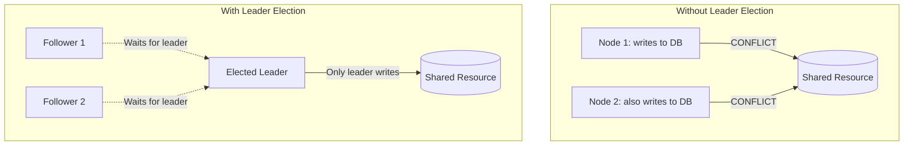

### Pitfalls
- ❌ **Using leader election for stateless services:** Load balancers already distribute work across stateless nodes. Leader election adds overhead without benefit for stateless APIs.
- ❌ **Ignoring the "no leader" window:** During election (100–600ms), no leader is active. Operations that require a leader must either queue, fail, or be served by a read replica.

### Concept Reference

---

## Q2: What is the bully algorithm for leader election?

**Role:** Mid | **Difficulty:** 🟡 | **Priority:** P1 | **Format:** Quick Answer

> **What the interviewer is testing:** Whether you know the simplest leader election algorithm and its failure modes.

### Answer in 60 seconds
- **Bully algorithm:** Each node has a unique ID. When the current leader fails, any node that detects the failure starts an election by sending an `ELECTION` message to all nodes with higher IDs. If no higher-ID node responds, the sender declares itself leader and broadcasts `COORDINATOR` to all lower-ID nodes.
- **Protocol steps:**
  1. Node N detects leader failure (heartbeat timeout)
  2. N sends `ELECTION` to all nodes with ID > N
  3. If any node M (M > N) responds `OK`, M takes over the election
  4. If no response within timeout, N sends `COORDINATOR` to all: "I am the new leader"
- **Complexity:** O(N²) messages in the worst case (N nodes each starting elections simultaneously)
- **Failure modes:** High-ID node keeps winning even if it's slow/overloaded. Network partition can cause multiple nodes to declare themselves leader (split-brain).
- **Used in:** Classroom examples, simple embedded systems. Not used in production distributed systems at scale.

### Diagram

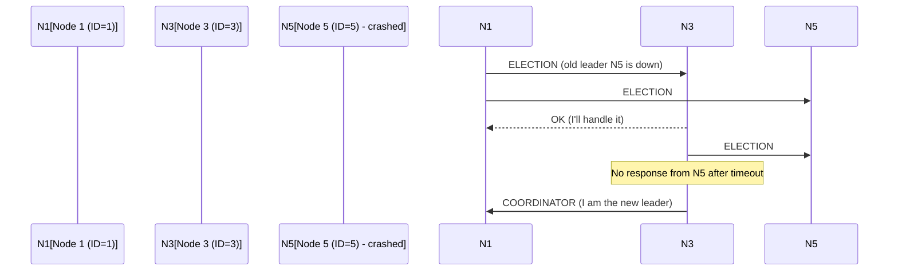

### Pitfalls
- ❌ **Using bully algorithm in production:** Bully has no split-brain protection and O(N²) message complexity. Use ZooKeeper/etcd-based election for production systems.
- ❌ **Assuming the highest-ID node is the best leader:** The node with the highest ID may be the most resource-constrained. Bully's ID-based logic doesn't account for node health.

### Concept Reference
→ [Consensus Algorithms](consensus-algorithms)

---

## Q3: How does ZooKeeper implement leader election using ephemeral nodes?

**Role:** Senior | **Difficulty:** 🔴 | **Priority:** P1 | **Format:** Deep Dive

> **What the interviewer is testing:** Whether you understand ZooKeeper's ephemeral node semantics and the sequential node election pattern.

### Problem Constraints
| Dimension | Value |
|-----------|-------|
| Cluster | 5 candidate nodes competing for leadership |
| ZooKeeper quorum | 3-node ZK ensemble |
| Election time | < 200ms after leader failure detected |
| Session timeout | 6 seconds (ZK heartbeat every 2 seconds) |

### Approach A — Create /leader node (thundering herd problem)

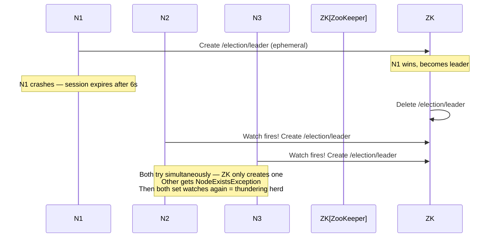

### Approach B — Sequential ephemeral nodes (production pattern)

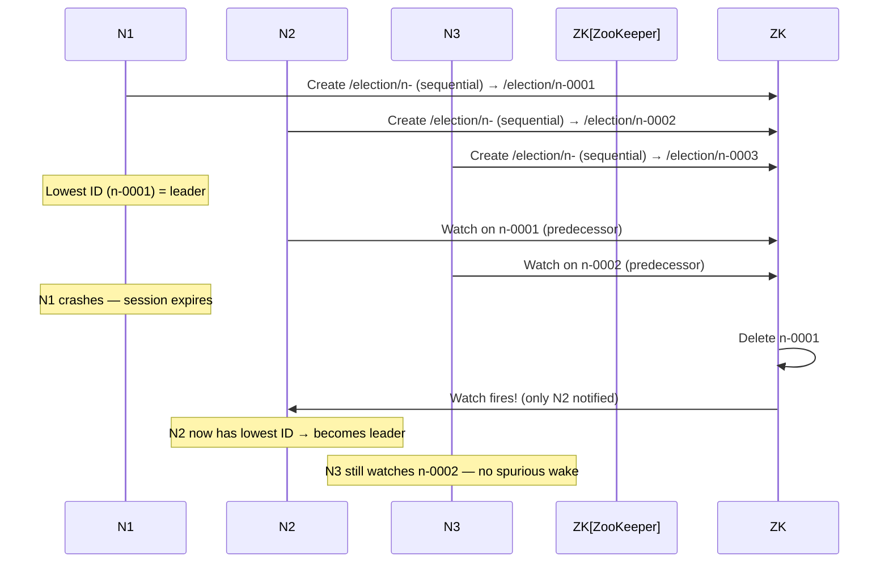

| Property | Create /leader | Sequential nodes |
|----------|----------------|-----------------|
| Thundering herd | Yes (all watchers fire) | No (only next-in-line notified) |
| Message overhead | O(N) per election | O(1) per election |
| Split-brain risk | Session timeout prevents it | Session timeout prevents it |
| Election time | < 200ms | < 200ms |

### Recommended Answer
Use the **sequential ephemeral node pattern**: each candidate creates `/election/n-XXXX` (sequential flag), then watches the node with the next-lower sequence number. The node with the lowest sequence number is the leader. On leader failure, its session expires, ZooKeeper deletes its node, and *only* the node watching that specific sequence number is notified — no thundering herd.

The ephemeral node's key property: if a node crashes, ZooKeeper automatically deletes its ephemeral node after the session timeout (configurable, typically 6–30 seconds). This provides automatic failure detection without external heartbeat management.

Session timeout is the detection latency: if the leader crashes, new leader election completes within `session_timeout + election_time` = 6s + 200ms ≈ 6.2 seconds in default configurations.

### What a great answer includes
- [ ] Explain ephemeral node semantics (deleted on session expire)
- [ ] Explain sequential flag + lowest-sequence-wins rule
- [ ] Explain predecessor watch to avoid thundering herd
- [ ] Quantify detection time (session timeout + election time)
- [ ] Mention that ZooKeeper CP nature prevents split-brain

### Pitfalls
- ❌ **Creating a single /leader node without sequential pattern:** Every follower watches the same node. On deletion, all N-1 followers wake up simultaneously and all try to become leader — O(N) ZK writes simultaneously.
- ❌ **Setting session timeout too short:** Session timeout < 2× network RTT causes false evictions under transient network jitter. Result: healthy leader evicted, unnecessary re-election.

### Concept Reference
→ [Consensus Algorithms](consensus-algorithms)

---

## Q4: What is split-brain and why is it dangerous?

**Role:** Senior | **Difficulty:** 🔴 | **Priority:** P1 | **Format:** Quick Answer

> **What the interviewer is testing:** Whether you understand split-brain as a fundamental distributed systems failure mode and its data corruption consequences.

### Answer in 60 seconds
- **Split-brain definition:** A split-brain occurs when two nodes simultaneously believe they are the leader and both accept writes to the same resource, creating conflicting states that cannot be automatically reconciled.
- **Cause:** Network partition isolates the old leader from the majority. Majority elects a new leader. Old leader's network connectivity is restored but it's still running as leader. Now: two leaders, one resource.
- **Consequences:** Duplicate payments, conflicting database writes, inventory oversell, message duplication. Financial systems can lose money; healthcare systems can produce incorrect records.
- **Why leader detection is hard:** The old leader doesn't know it lost its leadership — its own process is still running and it received no signal. It continues processing writes that conflict with the new leader's writes.
- **Example:** A Kubernetes pod autoscaler has split-brain — two controller replicas both scale up the same deployment simultaneously, resulting in 2x the desired pod count and 2x the cloud bill.

### Diagram

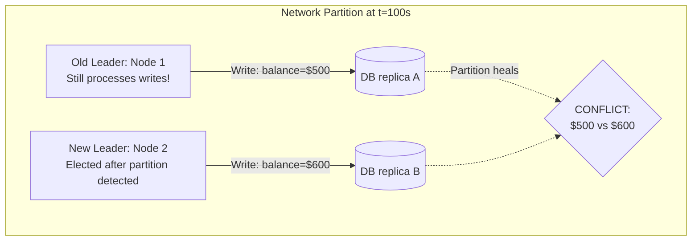

### Pitfalls
- ❌ **Thinking heartbeat timeouts prevent split-brain:** Heartbeat timeout detection tells the followers that the old leader is gone — they elect a new one. But the old leader doesn't know it was replaced. Fencing tokens (not timeouts) prevent the old leader from continuing to write.
- ❌ **Assuming ZooKeeper prevents split-brain automatically:** ZooKeeper's CP properties prevent the election system from having split-brain. But the *application* using ZooKeeper must honor fencing tokens — ZooKeeper can't stop the old leader's process from writing to a database.

### Concept Reference
→ [CAP Theorem](cap-theorem-real-world)

---

## Q5: How do you use fencing tokens to prevent a stale leader from corrupting data?

**Role:** Senior | **Difficulty:** 🔴 | **Priority:** P2 | **Format:** Deep Dive

> **What the interviewer is testing:** Whether you understand that leader election alone doesn't prevent split-brain — you need fencing tokens at the resource level.

### Problem Constraints
| Dimension | Value |
|-----------|-------|
| Scenario | Two nodes both believe they are leader |
| Resource | Shared database / object storage |
| Detection method | Resource must reject writes from stale leader |
| Token mechanism | Monotonically increasing lease number |

### Approach A — Trust the election system (insufficient)

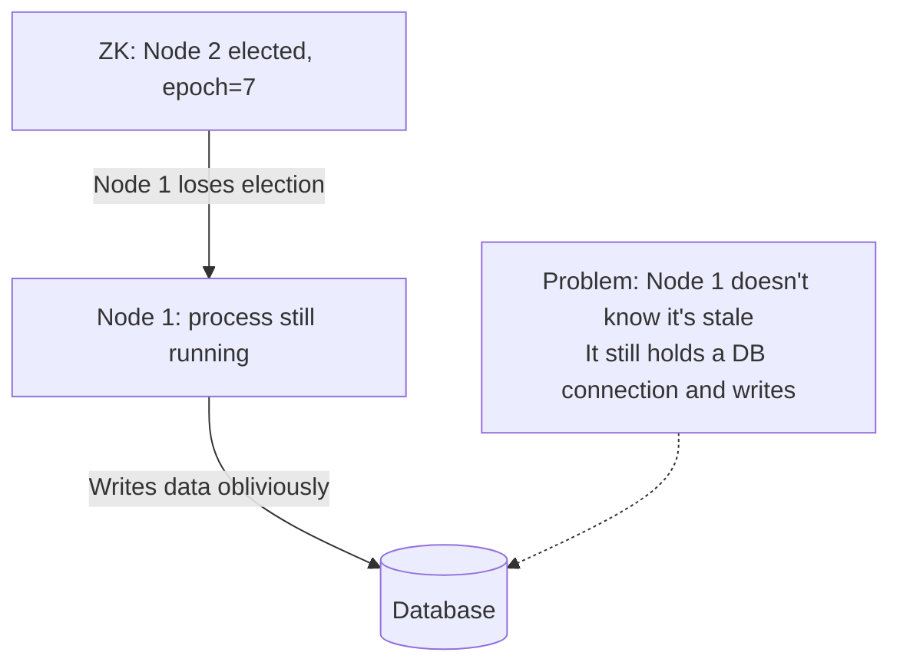

### Approach B — Fencing token at resource (correct)

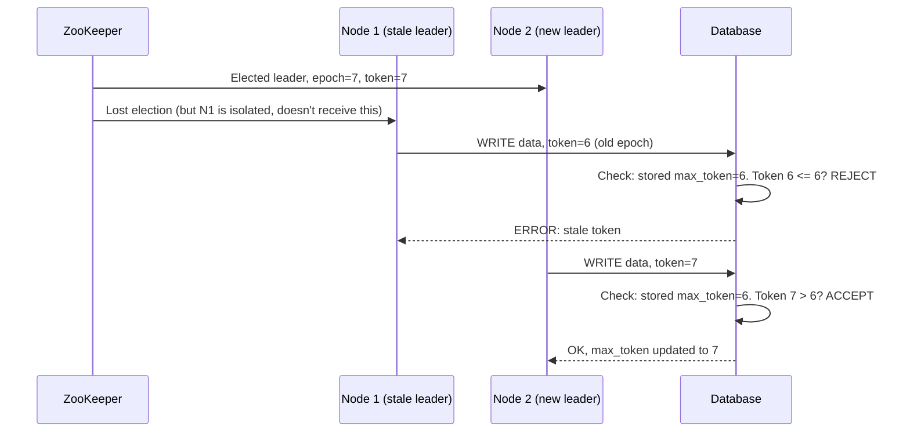

| Mechanism | What it does | What it doesn't do |
|-----------|-------------|-------------------|
| ZooKeeper election | Determines who SHOULD be leader | Stops old leader from writing |
| Fencing token | Rejects writes from stale leader | Prevent old leader process from running |
| STONITH (shoot the other node) | Physically kills old leader | Graceful handoff |

### Recommended Answer
Leader election only tells the *followers* who the new leader is. The old leader's process may still be running, and if it can reach the database, it will continue writing. Fencing tokens solve this at the resource level:

1. Each leader election produces a monotonically increasing token (ZooKeeper's `zxid`, etcd's lease ID, or custom epoch counter).
2. The leader includes this token in every write request to the resource.
3. The resource (database, object store, Kafka) stores the maximum token seen and rejects any write with a token ≤ the stored maximum.
4. The stale leader's writes are rejected. No split-brain data corruption.

In practice: AWS RDS uses generation numbers for Multi-AZ failover. PostgreSQL uses `recovery_target_timeline`. Redis Sentinel uses epoch in `REPLICAOF` commands. The pattern is consistent — always use a monotonic counter that increases on each election.

### What a great answer includes
- [ ] Explain that election alone doesn't stop old leader writes
- [ ] Describe token = monotonically increasing epoch from election system
- [ ] Resource validates token against stored maximum (rejects stale)
- [ ] Give a real implementation example (ZooKeeper zxid, etcd revision)
- [ ] Mention STONITH as an alternative (physically kill old leader)

### Pitfalls
- ❌ **Trusting the application to check for leadership:** An application that calls `amILeader()` and then writes is vulnerable to TOCTOU (time-of-check time-of-use) races. The leadership check can be true at check time but false by write time.
- ❌ **Using timestamps as fencing tokens:** Two leaders can have the same timestamp within clock skew precision (7ms for Spanner, much more for NTP). Only monotonically increasing integers from a consensus system are safe.

### Concept Reference
→ [Consensus Algorithms](consensus-algorithms)

---

## Q6: How does etcd implement leader election for Kubernetes controller manager?

**Role:** Senior | **Difficulty:** 🔴 | **Priority:** P2 | **Format:** Quick Answer

> **What the interviewer is testing:** Whether you know etcd's lease-based leader election and its Kubernetes integration.

### Answer in 60 seconds
- **Kubernetes leader election:** Multiple controller-manager replicas run simultaneously, but only one is active. They use etcd for election via the `k8s.io/client-go/tools/leaderelection` library.
- **Lease mechanism:** The leader creates/renews a `Lease` object in the `kube-system` namespace (an etcd key). The Lease contains: holder identity, acquire time, renew time, lease duration. Default lease duration: 15 seconds.
- **Election protocol:** Each candidate tries to atomically update the Lease with its own identity (using etcd's `CompareAndSwap` — only succeeds if current holder is empty or the lease has expired). Only one candidate succeeds per election.
- **Heartbeat:** The leader renews the lease every `renewDeadline/3` ≈ 3.33 seconds (10s renewDeadline / 3). If the leader fails to renew within 10 seconds (renewDeadline), the lease expires and other candidates can acquire it.
- **Failover time:** Leader failure detected after `leaseDuration` (15s) + network timeout. New election: ~1 second. Total leadership gap: 16 seconds in default config.
- **Tuning:** Production clusters often reduce `leaseDuration` to 10s and `renewDeadline` to 8s for faster failover (tradeoff: more sensitive to slow nodes).

### Diagram

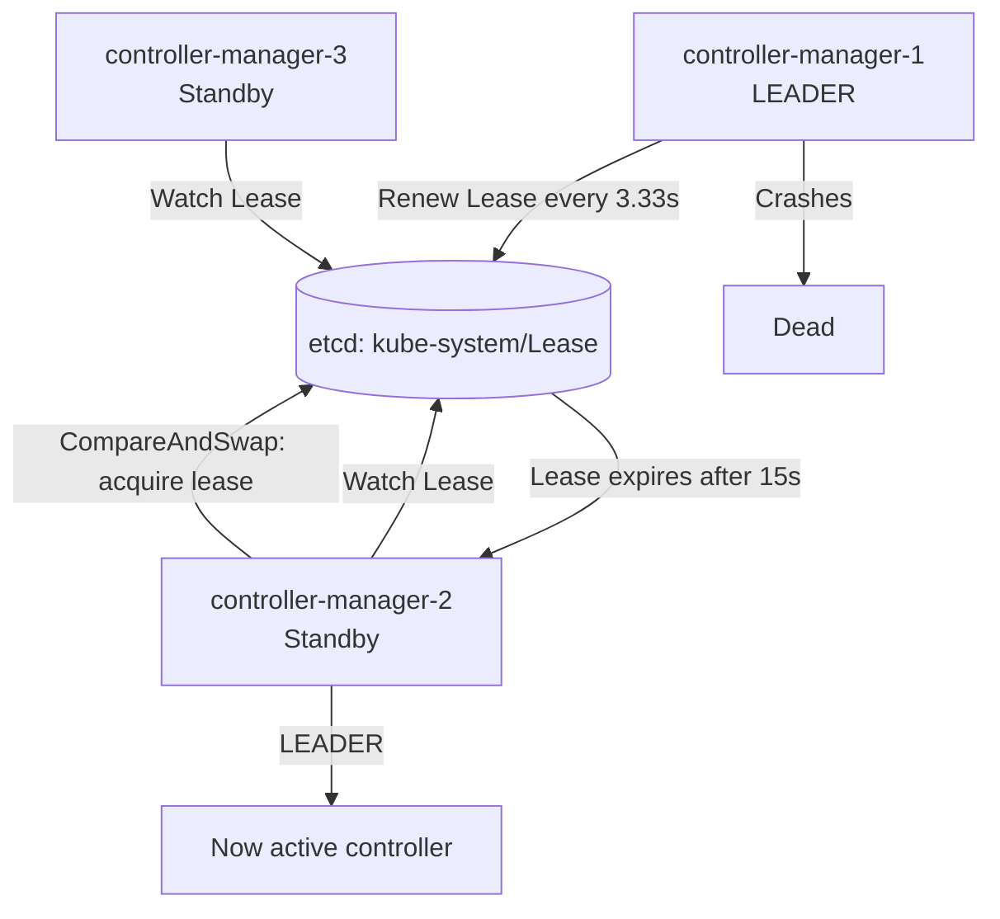

### Pitfalls
- ❌ **Running only one controller-manager replica:** Single replica = SPOF. Run 3 replicas; only 1 active but 2 ready to take over.
- ❌ **Confusing Kubernetes leader election with RAFT:** Kubernetes controller election uses a simple lease-based approach (not Raft). etcd itself uses Raft internally, but the controller election is just a CAS on a Lease object.

### Concept Reference
→ [Consensus Algorithms](consensus-algorithms)

---

## Q7: What happens if leader election loops (two nodes keep winning and losing)?

**Role:** Staff | **Difficulty:** ⚫ | **Priority:** P2 | **Format:** Quick Answer

> **What the interviewer is testing:** Whether you can diagnose and resolve election flapping — a real production issue caused by misconfigured timeouts or network instability.

### Answer in 60 seconds
- **Election flapping:** Node A wins election → A's heartbeats are slow due to GC pause → followers timeout and elect B → A's GC pause ends, A tries to reassert leadership → B rejects A → election again. Cycle repeats every 5–30 seconds.
- **Root causes:**
  1. Election timeout < leader's worst-case pause (GC, disk I/O, CPU steal on VMs)
  2. Network jitter causing intermittent heartbeat failures
  3. Clock skew causing lease expiry calculations to disagree between nodes
- **Impact:** During each election, the system has no leader for 100–600ms. In a 30-second flap cycle, 2–20% of time is leader-less — writes fail, distributed locks are lost, Kafka partition leader changes cause consumer rebalances.
- **Fix:**
  1. Increase election timeout to 3× the max observed leader pause (2× p99.9 GC pause)
  2. Use GC-tuned JVM settings or switch to non-GC runtime (Go) for leader processes
  3. Monitor election frequency — alert if > 1 election per 10 minutes
  4. Investigate GC logs and disk I/O on the leaders that keep losing

### Diagram

```mermaid
graph TD
  A[Node A wins: t=0] -->|Heartbeat delayed by GC: 8s| Timeout[Followers timeout at 5s]
  Timeout -->|Node B elected: t=5| B[Node B wins]
  B -->|Normal heartbeats| Renew[Heartbeats OK]
  A -->|GC ends, tries to reclaim| A2[Node A: "I'm still leader!"]
  B -->|Rejects A - higher epoch| Conflict[Election #2]
  Conflict -->|A wins again| Loop[Flap loop continues...]
```

### Pitfalls
- ❌ **Setting election timeout = 2× heartbeat interval:** This is too tight. Set election timeout = 10× heartbeat interval to account for OS scheduling jitter, network variance, and GC pauses.
- ❌ **Not monitoring election frequency:** Election flapping is a silent availability killer. Track `leader_election_count` as a metric; alert at > 2 elections/hour.

### Concept Reference
→ [CAP Theorem](cap-theorem-real-world)

---

## Q8: How does Kafka elect partition leaders across 1000s of partitions?

**Role:** Staff | **Difficulty:** ⚫ | **Priority:** P2 | **Format:** Deep Dive

> **What the interviewer is testing:** Whether you understand Kafka's partition leadership model and the trade-offs of leader concentration.

### Problem Constraints
| Dimension | Value |
|-----------|-------|
| Cluster | 10 Kafka brokers |
| Partitions | 10,000 partitions across 100 topics |
| Replication factor | RF=3 |
| Failure scenario | 1 broker goes down |
| Impact | Up to 3,333 partitions need new leaders |

### Approach A — ZooKeeper-based leader election (Kafka < 3.3)

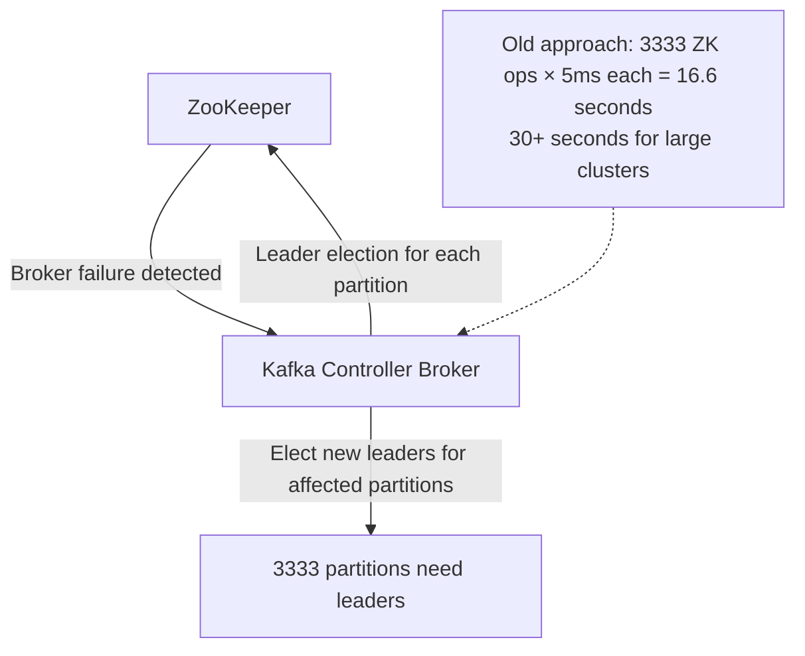

### Approach B — KRaft (Kafka Raft) — Kafka 3.3+

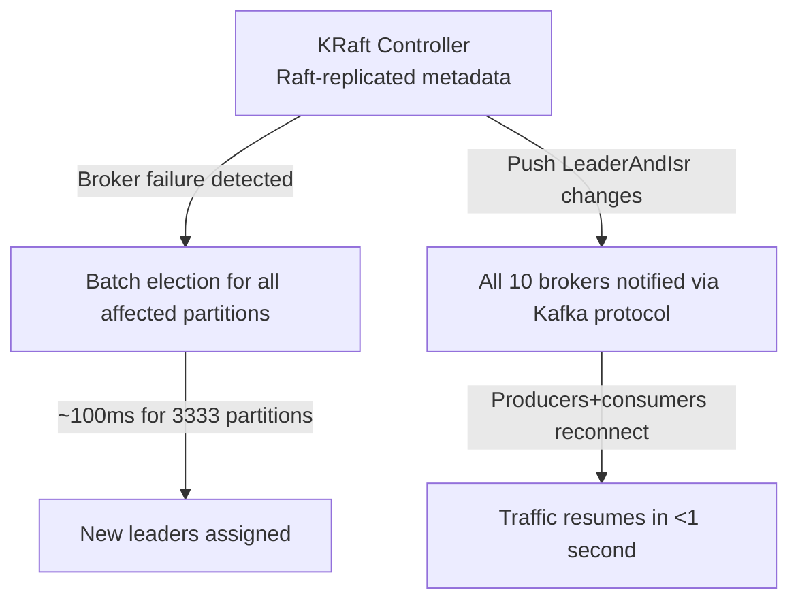

| Dimension | ZooKeeper mode | KRaft mode |
|-----------|----------------|------------|
| Max partitions | ~200K | 1M+ |
| Failover time (3333 partitions) | 30–60 seconds | < 500ms |
| Operations complexity | ZK + Kafka | Kafka only |
| Controller election | ZK ephemeral node | Raft |

### Recommended Answer
Kafka uses **partition leader election** (not node leader election) — each of the 10,000 partitions independently has a leader. With RF=3, each partition has 3 replicas; the leader handles all reads and writes, followers replicate asynchronously.

In **KRaft mode** (Kafka 3.3+): When a broker fails, the KRaft controller (a small subset of brokers running Raft) detects the failure via heartbeat timeout (~15 seconds by default, configurable to 3 seconds). It then batch-processes leader elections for all affected partitions in a single Raft log entry — this takes ~100ms for thousands of partitions vs the old ZooKeeper approach's serial per-partition election that took 30–60 seconds.

The key metric: **partition leadership imbalance**. If all partition leaders concentrate on one broker (due to repeated elections), that broker handles 10x the traffic. Kafka has a `kafka-leader-election.sh` tool and auto-leader-rebalance feature to redistribute leaders.

### What a great answer includes
- [ ] Partition leadership vs node leadership distinction
- [ ] ISR (In-Sync Replica) concept — only ISR members can become leaders
- [ ] KRaft batch election vs ZooKeeper serial election
- [ ] Failover time comparison: ZK 30–60s vs KRaft 500ms
- [ ] Leader imbalance problem and rebalancing tools

### Pitfalls
- ❌ **Confusing Kafka cluster controller election with partition leader election:** The controller is elected once (Raft-based). Partition leaders are elected per partition on each broker failure.
- ❌ **Running RF=1 in production for performance:** RF=1 means a broker failure = immediate data loss for all partitions on that broker. Always RF=3, CL=acks:-1 for durability.

### Concept Reference

---

## Q9: Design leader election for a distributed job scheduler — what do you use and why?

**Role:** Senior | **Difficulty:** 🔴 | **Priority:** P1 | **Format:** Scenario
**Real Company:** Airbnb (Airflow), LinkedIn (Azkaban), Netflix (Conductor)

### The Brief
> "You're building a distributed job scheduler that runs across 10 nodes. Jobs must execute exactly once. The scheduler needs a leader to assign jobs to workers. Design the leader election mechanism."

### Clarifying Questions
1. What is the acceptable job assignment gap if the leader fails? (Drives election timeout)
2. Are jobs idempotent? (Determines if "at-least-once" assignment is acceptable)
3. What is the deployment environment — Kubernetes, VMs, containers?
4. Do you have ZooKeeper/etcd already available, or is this greenfield?

### Back-of-Envelope Estimation
| Metric | Calculation | Result |
|--------|-------------|--------|
| Jobs per second | 1000 jobs/min | ~17/sec |
| Election gap impact | 5-second election × 17/sec | ~85 jobs delayed |
| Worker nodes | 10 nodes | 1 leader + 9 workers |
| Leader heartbeat | Every 2 seconds to etcd | 10 writes/min to etcd |

### High-Level Architecture

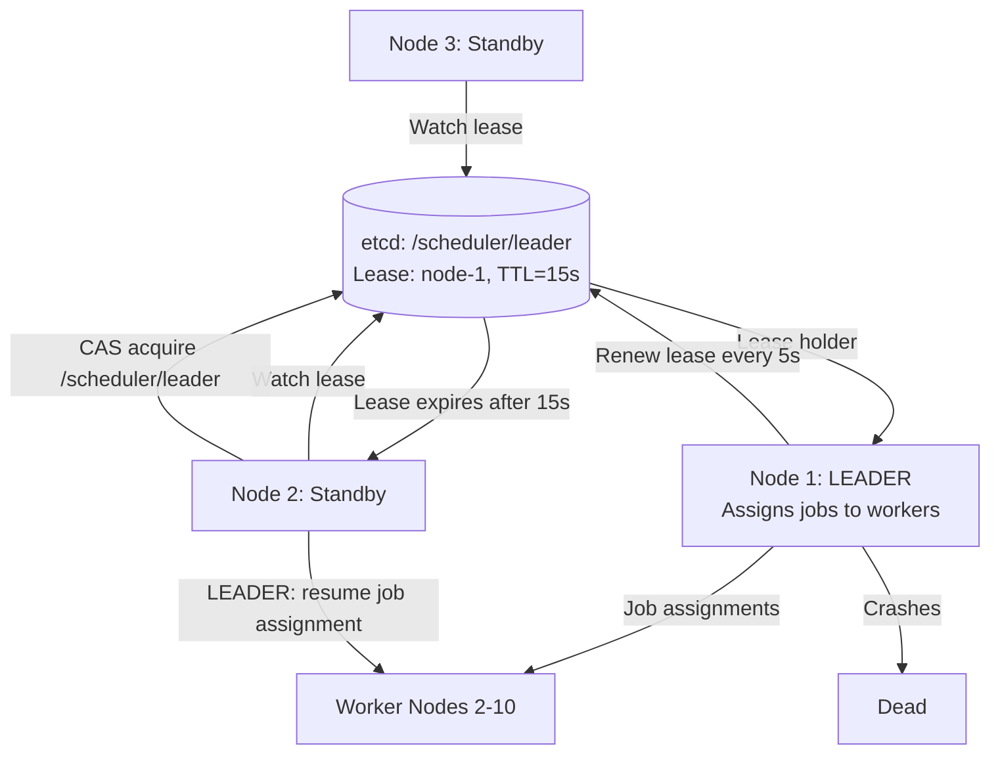

### Trade-off Decisions
| Decision | Option A | Option B | Chosen | Why |
|----------|----------|----------|--------|-----|
| Election backend | Custom Raft | etcd leases | etcd leases | Proven, operational, fast |
| Lease TTL | 5 seconds | 15 seconds | 15 seconds | Avoid flapping under GC pauses |
| Job assignment on election | Resume from queue | Reprocess last N | Resume from queue | Jobs in durable queue, not lost |
| Fencing | None | Epoch in job assignments | Epoch in job assignments | Prevent stale leader from assigning jobs |
| Multi-leader (partitioned) | Prevent (single leader) | Allow (partitioned scheduling) | Single leader | Simpler, prevents job duplication |

### Failure Modes
| Failure | Impact | Mitigation |
|---------|--------|------------|
| Leader crashes | 15s gap before new leader | Set TTL=15s; jobs queue during gap |
| Leader GC pause > TTL | Spurious re-election + 2 leaders briefly | Tune GC; increase TTL to 3× max GC pause |
| etcd unavailable | No election possible | Job assignment pauses; workers keep running existing jobs |
| Network partition isolating leader | Old leader keeps assigning (stale) | Fencing token (epoch) in job assignments; workers reject stale-epoch jobs |
| New leader starts before old leader detects loss | Split-brain assignment | etcd lease expiry is authoritative; old leader's job assignments rejected via epoch check |

### Concept References
→ [Consensus Algorithms](consensus-algorithms)
→ [Distributed Transactions](distributed-transactions)

---

## Q10: How does the Raft paper define and prevent split-brain without human intervention?

**Role:** Staff | **Difficulty:** ⚫ | **Priority:** P3 | **Format:** Quick Answer

> **What the interviewer is testing:** Whether you understand Raft's formal split-brain prevention mechanism — the "at most one leader per term" invariant.

### Answer in 60 seconds
- **Raft's split-brain invariant:** There is at most one leader in any given term. Terms are monotonically increasing; each node votes for at most one candidate per term.
- **How it's enforced:** To win election, a candidate needs votes from a strict majority (> N/2) of nodes. Since any two majorities overlap by at least one node, two different candidates cannot both win a majority in the same term — the overlapping node would have to vote for both, violating "one vote per term."
- **Network partition scenario:** 5-node cluster split 3-2. The 3-node partition has a majority, so it can elect a leader (term=5). The 2-node partition cannot reach majority — no election in the minority partition. When partition heals, the old "leader" (if it was in the minority) sees the new term=5 heartbeats, detects its term is stale, and immediately reverts to follower.
- **No human intervention:** The term check is fully automatic. A node with an older term that receives a message with a higher term immediately converts to follower and abandons leadership. No manual override or human acknowledgment needed.
- **Response time:** Partition healing → old leader sees new term → reverts to follower: within 1 heartbeat (50–150ms). Zero manual intervention.

### Diagram

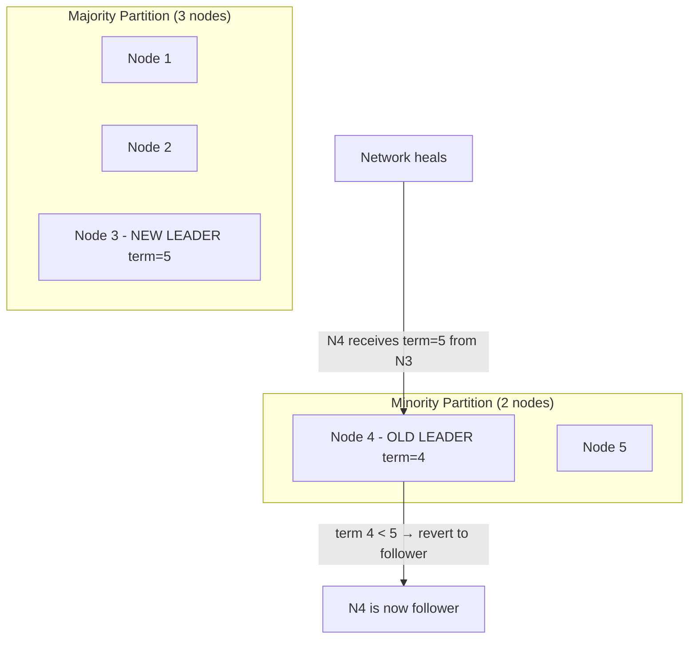

### Pitfalls
- ❌ **"Raft needs ZooKeeper to prevent split-brain":** Raft's split-brain prevention is intrinsic to the algorithm via terms and majority quorums. ZooKeeper has its own split-brain prevention. They are independent.
- ❌ **"Split-brain is impossible in Raft":** Split-brain is impossible at the Raft level, but the *application* can still have split-brain if it doesn't honor Raft's leadership decisions (e.g., an application that continues writing after Raft signals it lost leadership, without using fencing tokens at the storage level).

### Concept Reference
→ [Consensus Algorithms](consensus-algorithms)
