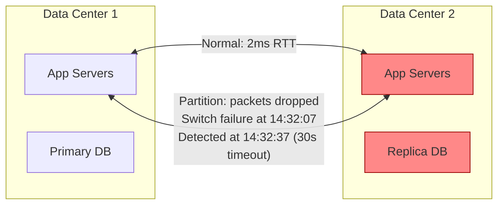
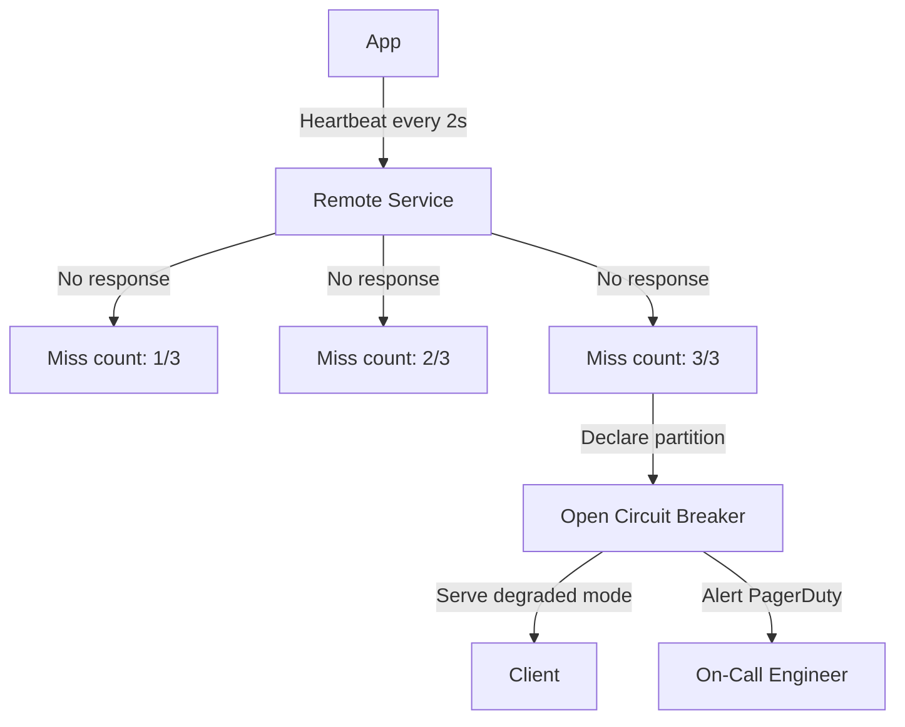
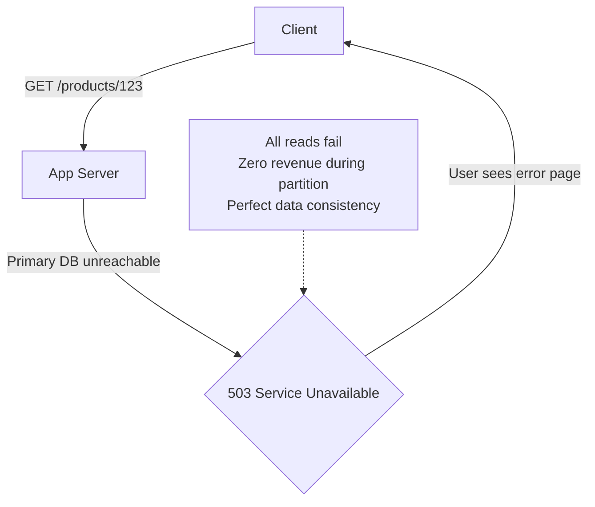
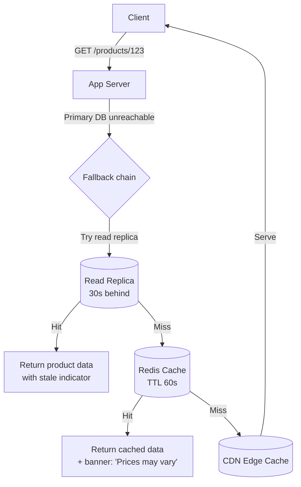
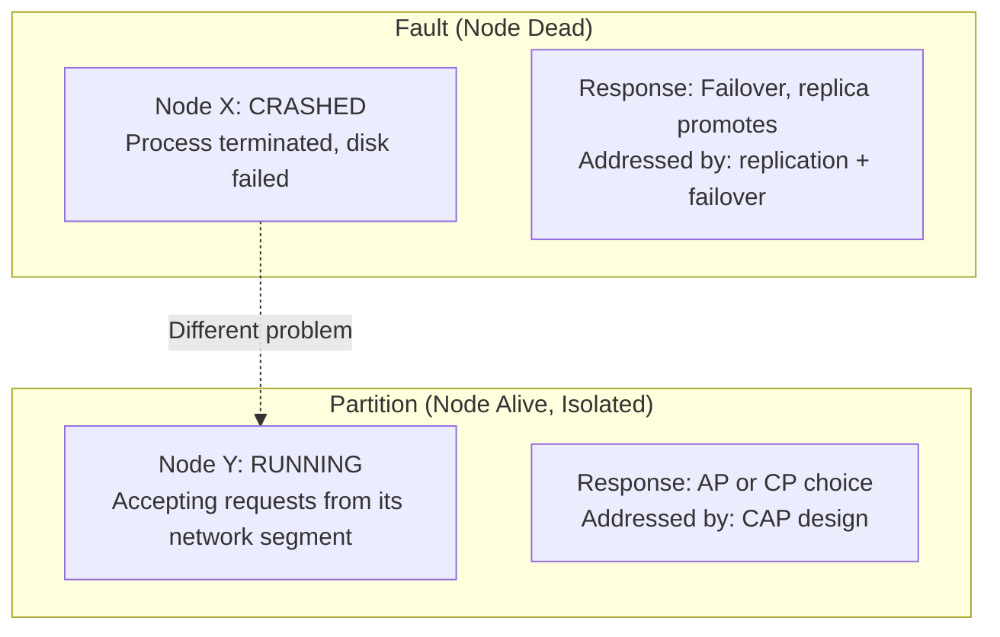
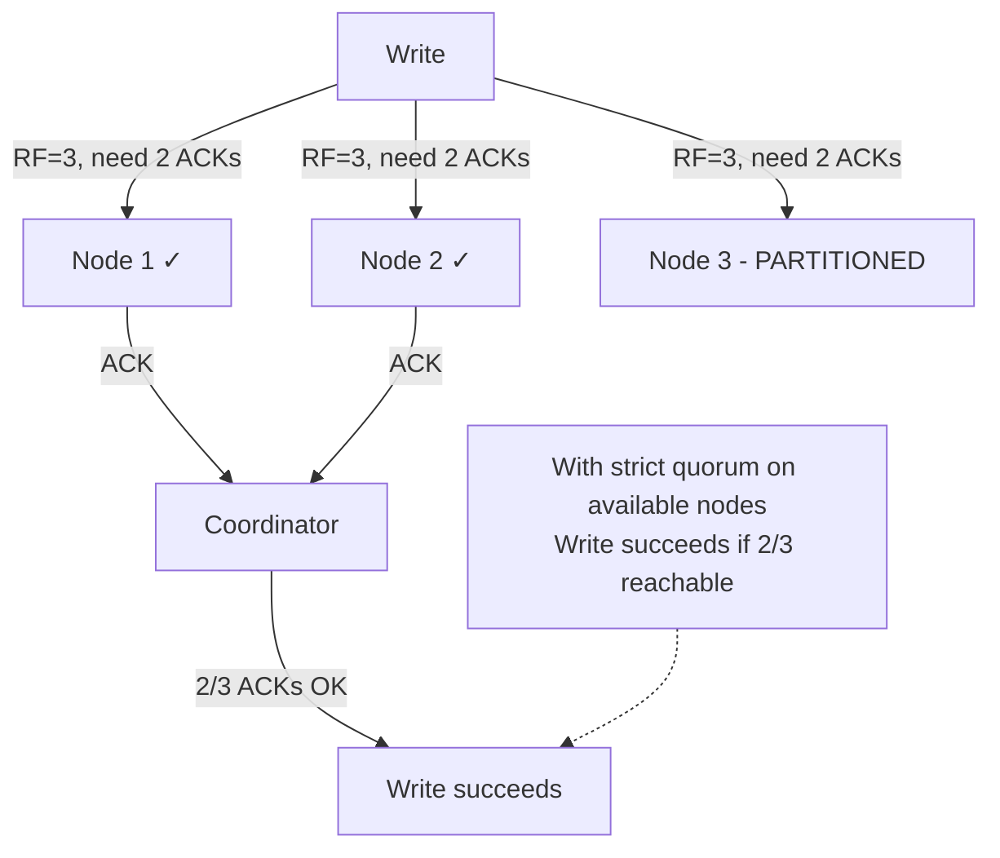
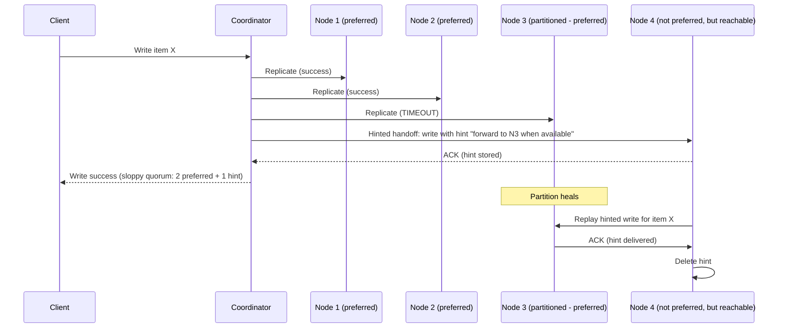
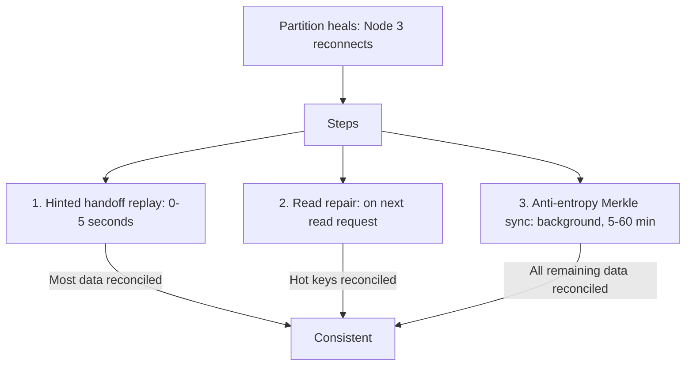
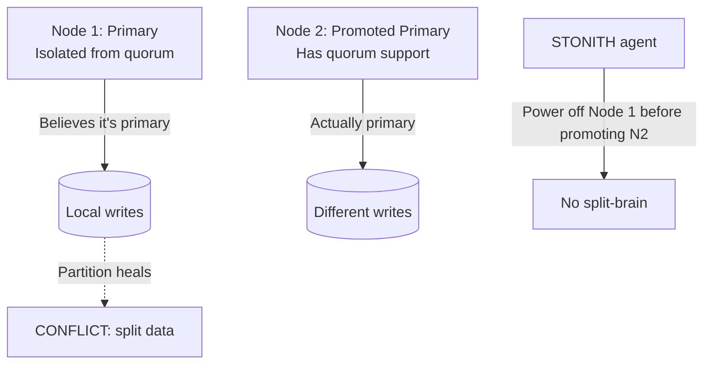
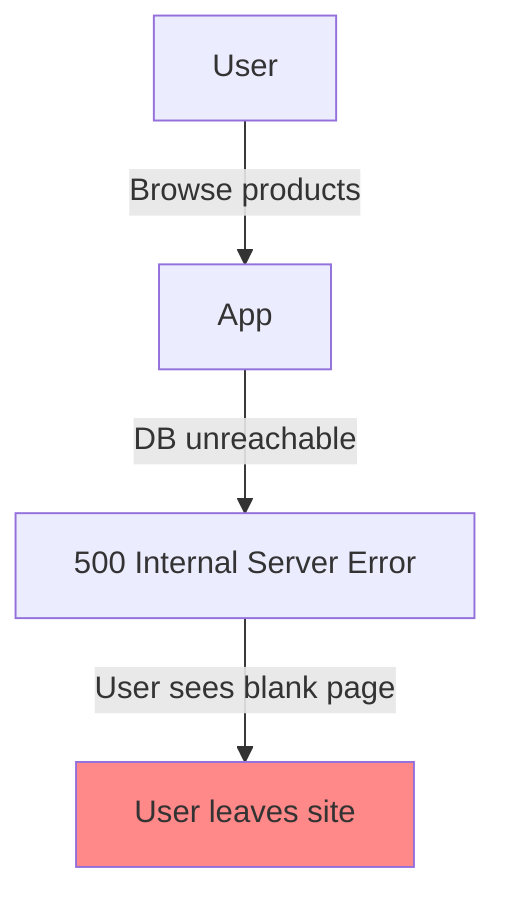

# Partition Tolerance

10 questions covering network partition behavior, detection, and graceful degradation.

---

## Q1: What is a network partition and how does it happen in practice?

**Role:** Mid | **Difficulty:** 🟡 | **Priority:** P0 | **Format:** Quick Answer

> **What the interviewer is testing:** Whether you treat network partitions as operational reality rather than theoretical edge cases.

### Answer in 60 seconds
- **Definition:** A network partition occurs when nodes in a distributed system can no longer communicate with each other, while each node remains individually operational.
- **Common causes in production:**
  - Switch/router firmware crash or misconfiguration
  - Fiber cut between data centers
  - Overloaded network links causing packet loss > timeout threshold
  - Misconfigured firewall rules or security group changes (common in AWS)
  - NIC failure on a node
  - BGP route advertisement errors (causes cross-DC partitions)
- **Frequency:** Google's Chubby paper reports 30-second partitions every few months at DC scale. AWS reports ~0.01% probability of network unreachability per instance per hour. With 100 instances: ~1 partition event per 10 hours.
- **Timeout ≠ partition:** Your application detects partitions through timeouts (TCP connection timeout: 30–120 seconds; application-level heartbeat: 1–30 seconds). Until timeout fires, you're in an "uncertainty window" — the other node may be responding, just slowly.

### Diagram



### Pitfalls
- ❌ **"We're in a single cloud region, so no partitions":** AWS networking within a region can still partition — AZ-to-AZ traffic goes through AWS backbone switches that can fail. Intra-region partitions occur during AWS hardware failures.
- ❌ **"A partition means the remote node is crashed":** A partitioned node is alive and serving other nodes it can reach. It's only unreachable from your perspective. This distinction matters for recovery strategy.

### Concept Reference
→ [CAP Theorem](cap-theorem-real-world)

---

## Q2: How do you detect that your service is experiencing a network partition?

**Role:** Mid | **Difficulty:** 🟡 | **Priority:** P1 | **Format:** Quick Answer

> **What the interviewer is testing:** Whether you understand the detection mechanisms and the uncertainty window before detection.

### Answer in 60 seconds
- **TCP timeout:** The OS-level TCP keepalive fires after kernel's `tcp_keepalive_time` (default 7200 seconds — far too long). Use application-level heartbeats instead.
- **Application heartbeat:** Services send lightweight pings every 1–5 seconds. If N consecutive heartbeats fail (e.g., 3 consecutive at 2-second intervals = 6 seconds), declare partition.
- **Circuit breaker:** When a downstream service call exceeds the timeout threshold (e.g., 200ms) for K consecutive calls, open the circuit breaker. Stop sending requests; return cached/degraded response.
- **Health endpoint patterns:** AWS ELB, Kubernetes liveness probes, and Consul health checks all implement active polling — if N consecutive checks fail, the node is marked unhealthy and removed from rotation.
- **Partial partition detection:** Partition may be partial — A can reach B, B can reach C, but A cannot reach C. Test end-to-end connectivity, not just neighbor-to-neighbor.
- **Uncertainty window:** If heartbeat interval = 2s and threshold = 3 failures, detection time = 6 seconds. During these 6 seconds, you don't know if the remote node is slow or partitioned.

### Diagram



### Pitfalls
- ❌ **Single heartbeat failure = partition:** Network hiccups cause occasional packet loss. Require N consecutive failures (not 1) before declaring partition to avoid false positives.
- ❌ **Detecting partition but continuing to queue indefinitely:** Once partition is detected, stop queueing unbounded requests. Bounded queue with backpressure; reject new requests when queue is full.

### Concept Reference
→ [CAP Theorem](cap-theorem-real-world)

---

## Q3: How should a read-heavy system behave during a partition — serve stale data or return errors?

**Role:** Senior | **Difficulty:** 🔴 | **Priority:** P1 | **Format:** Deep Dive

> **What the interviewer is testing:** Whether you can make the AP vs CP trade-off decision for reads based on business requirements.

### Problem Constraints
| Dimension | Value |
|-----------|-------|
| System | Product catalog API (read-heavy, 95% reads) |
| Primary DB | Unreachable from app servers |
| Replicas | Available, but may be 0–30 seconds behind |
| Options | Serve stale reads OR return 503 errors |

### Approach A — CP behavior (return errors during partition)



### Approach B — AP behavior (serve stale reads with caveat)



| Dimension | CP (errors) | AP (stale reads) |
|-----------|-------------|-----------------|
| User experience | Hard error page | Slightly stale data |
| Business impact | 0% conversion during partition | ~100% conversion (stale price risk) |
| Data accuracy | Perfect | Potentially 30s stale |
| Appropriate for | Payment checkout | Product browsing |
| SLA impact | 503s count against availability | No 503s, but data caveat |

### Recommended Answer
**Differentiate by operation type:**

**Reads of product data, catalog, media:** AP behavior — serve stale. A user seeing a product description from 30 seconds ago is harmless. Show a "prices may not reflect latest updates" banner if needed. Revenue impact of 503 far exceeds the risk of showing a stale price.

**Reads of account balance, payment status, inventory count:** CP behavior — return error. A user seeing a wrong account balance or being oversold a product causes real business harm. Return a graceful error with a "please try again" message.

**Writes:** Always fail fast (CP) during partition — don't accept writes that can't be committed. Queue to an outbox/SQS if the business allows eventual consistency for write confirmation.

Implement this as a multi-level fallback: primary DB → read replica → Redis cache → CDN edge cache, with each level adding staleness. Monitor cache hit rates at each level; alert if replica + cache miss rate > 5% (indicates a deeper problem).

### What a great answer includes
- [ ] Separate read strategy by data sensitivity (catalog vs financial)
- [ ] Multi-level fallback chain (replica → Redis → CDN)
- [ ] User-visible "stale data" indicator
- [ ] Write behavior during partition (fail fast or queue with backpressure)
- [ ] Monitoring: cache hit rate at each fallback tier

### Pitfalls
- ❌ **One strategy for all reads:** "Serve stale" for account balances can cause overdrafts. "Fail fast" for product images = white-box page. Always segment by data sensitivity.
- ❌ **Serving stale writes silently:** If writes are queued during a partition, the user must know (optimistic UI: "Your order is being processed"). Silent queuing + apparent success sets wrong expectations.

### Concept Reference
→ [Caching Strategies](../../../system-design/fundamentals/caching-strategies)

---

## Q4: What is the difference between partition tolerance and fault tolerance?

**Role:** Senior | **Difficulty:** 🔴 | **Priority:** P1 | **Format:** Quick Answer

> **What the interviewer is testing:** Whether you can distinguish between two closely related but distinct concepts.

### Answer in 60 seconds
- **Fault tolerance:** The ability of a system to continue operating correctly when one or more components fail (crash, data corruption, hardware failure). Addressed by redundancy, replication, failover.
- **Partition tolerance:** The ability of a system to continue operating when the network between nodes is disrupted (nodes are alive but can't communicate). Addressed by AP/CP design choices.
- **Key difference:** A fault = a node STOPS working. A partition = nodes WORK but can't TALK to each other. Fault tolerance handles dead components; partition tolerance handles isolated-but-alive components.
- **Orthogonality:** A system can have both failures simultaneously — a node crash (fault) + network partition (partition) are independent. CAP's P refers to partition tolerance specifically.
- **Example:** A database cluster loses one replica node (fault) + the primary is split from 2 of 3 replicas (partition). These are different failure modes requiring different mitigations.

### Diagram



### Pitfalls
- ❌ **"We handle faults, so we handle partitions":** A replica database handles node faults (primary crashes, replica promotes). But if the primary is alive and just network-isolated, the replica may promote incorrectly — split-brain. These require different mitigations.
- ❌ **"RAID gives us partition tolerance":** RAID protects against disk faults within a node. It provides no partition tolerance — the node itself can still be network-isolated.

### Concept Reference
→ [CAP Theorem](cap-theorem-real-world)

---

## Q5: How does DynamoDB handle read/write during a partition (sloppy quorum + hinted handoff)?

**Role:** Senior | **Difficulty:** 🔴 | **Priority:** P2 | **Format:** Deep Dive

> **What the interviewer is testing:** Whether you understand DynamoDB's AP mechanisms — sloppy quorum and hinted handoff — and their consistency implications.

### Problem Constraints
| Dimension | Value |
|-----------|-------|
| Replication factor | RF=3 (3 nodes store each item) |
| Partition scenario | 1 of 3 preferred nodes unreachable |
| Consistency level | Eventual (default) |
| Goal | Continue accepting writes; recover later |

### Approach A — Strict quorum (CP behavior under partition)



### Approach B — Sloppy quorum + hinted handoff (DynamoDB's AP approach)



| Property | Strict Quorum | Sloppy Quorum + Hinted Handoff |
|----------|--------------|-------------------------------|
| Write availability during partition | Fails if preferred nodes unavailable | Continues with hint nodes |
| Data freshness post-partition | Immediate | Within hint replay delay (minutes) |
| Consistency guarantee | Strong (quorum) | Eventual (hints may replay slowly) |
| Used by | CP systems | DynamoDB (AP default) |

### Recommended Answer
DynamoDB's AP design under partitions uses two mechanisms:

**Sloppy quorum:** If a preferred replica is unavailable, DynamoDB writes to any healthy node in the ring as a temporary replacement. The write succeeds once W nodes ACK (even if not all are preferred nodes).

**Hinted handoff:** The temporary node stores the write with a "hint" — metadata indicating the original intended destination. When the partitioned node recovers, the temporary node forwards the hint and removes it from its local store. This ensures eventual consistency without blocking writes.

**Hint storage duration:** DynamoDB stores hints for up to 1 hour (configurable). Long partitions > 1 hour = hint expiry = divergence. Merkle tree anti-entropy runs continuously in the background to detect and repair divergence without hint replay.

Sloppy quorum's implication: a read with `ConsistentRead: false` may not see a just-written item if the hint hasn't been replayed. This is the "eventually consistent" window. With `ConsistentRead: true`, DynamoDB reads from the preferred quorum — if preferred nodes are partitioned, it returns an error (CP behavior for that specific read).

### What a great answer includes
- [ ] Sloppy quorum: use non-preferred node as temporary write target
- [ ] Hinted handoff: store write with forwarding hint; replay on recovery
- [ ] Hint expiry limit (1 hour) and what happens after
- [ ] Anti-entropy via Merkle trees for long-partition recovery
- [ ] ConsistentRead=true as CP escape hatch

### Pitfalls
- ❌ **"Hinted handoff guarantees eventual consistency":** Hint expiry breaks the guarantee. If the partition lasts > hint expiry, the hint is discarded. Anti-entropy must catch up, but it's slower and less guaranteed.
- ❌ **Using sloppy quorum for financial data:** Sloppy quorum's inconsistency window is unacceptable for balance reads. Always use strong consistency reads for sensitive financial data.

### Concept Reference
→ [Database Replication](../../../system-design/storage-and-databases/database-replication)

---

## Q6: How do you reconcile data after a partition heals?

**Role:** Senior | **Difficulty:** 🔴 | **Priority:** P2 | **Format:** Quick Answer

> **What the interviewer is testing:** Whether you know the anti-entropy and reconciliation mechanisms used after partitions heal.

### Answer in 60 seconds
- **Merkle trees (anti-entropy):** Each node builds a Merkle tree of its data (hash of all keys). After partition heals, nodes exchange Merkle trees to find divergence efficiently — O(log N) to find which key ranges differ, even with billions of keys.
- **Read repair:** When a read request touches multiple replicas and detects divergence (one node returns an older version), the coordinator writes the latest value back to the stale node. This repairs divergence "on the way through" for frequently read data.
- **Hinted handoff replay:** Hints stored during the partition are replayed to the recovered node. Usually completes within seconds of reconnection.
- **Vector clock comparison:** When two versions of the same key exist, compare their vector clocks. If one strictly dominates, it wins. If concurrent (neither dominates), both are presented to the application for semantic merge.
- **Last Write Wins (LWW):** The simpler alternative to vector clocks. Compare timestamps; higher timestamp wins. Risk: silently loses concurrent writes. Acceptable for eventually consistent systems with low concurrent write rates.

### Diagram



### Pitfalls
- ❌ **Relying solely on read repair:** Read repair only fixes keys that are actually read. Cold keys (not recently read) remain diverged until Merkle anti-entropy runs.
- ❌ **Not monitoring reconciliation progress:** After a long partition, anti-entropy can take hours on large datasets. Monitor divergence rate and alert if reconciliation is not complete within expected window.

### Concept Reference
→ [Database Replication](../../../system-design/storage-and-databases/database-replication)

---

## Q7: What is a split-brain scenario in a database cluster and how do you prevent it?

**Role:** Staff | **Difficulty:** ⚫ | **Priority:** P2 | **Format:** Quick Answer

> **What the interviewer is testing:** Whether you can describe the database split-brain failure mode and the mechanisms to prevent it.

### Answer in 60 seconds
- **Database split-brain:** A network partition causes two nodes to both believe they are the primary/master. Both accept writes to the same data, creating irreconcilable conflicts.
- **Classic scenario:** PostgreSQL with streaming replication. Primary in AZ1, replica in AZ2. Network partition between AZs. Automated failover (Patroni/pgBouncer) promotes AZ2 replica to primary. Partition heals — now two primaries, both accepting writes. No automatic merge possible.
- **Prevention mechanisms:**
  1. **Quorum-based election:** Primary can only be elected by majority vote (Raft/Paxos). The minority partition cannot elect a new primary — it halts instead.
  2. **STONITH (Shoot The Other Node In The Head):** Before promoting a replica, forcibly shut down the old primary (IPMI power off, cloud instance stop). Ensures only one primary.
  3. **Fencing tokens:** New primary gets a generation number. Old primary's writes to shared storage are rejected if generation number is stale.
  4. **Lease-based leadership:** Primary holds a lease from a consensus system (etcd). Lease expires if not renewed. Primary cannot write after lease expiry — prevents a network-isolated primary from continuing.

### Diagram



### Pitfalls
- ❌ **"Automated failover prevents split-brain":** Automated failover without STONITH or fencing can cause split-brain. Automation must include a mechanism to ensure old primary is dead before new primary starts.
- ❌ **Relying on network timeout as the fence:** "The old primary will time out and stop" assumes the old primary detects its own isolation. A fully isolated primary never gets a timeout signal — it keeps running.

### Concept Reference
→ [Leader Election](leader-election)

---

## Q8: How do you design user-facing degraded mode during a partition?

**Role:** Staff | **Difficulty:** ⚫ | **Priority:** P2 | **Format:** Deep Dive

> **What the interviewer is testing:** Whether you can design a graceful degradation UX that maintains user trust while being honest about limitations.

### Problem Constraints
| Dimension | Value |
|-----------|-------|
| System | E-commerce platform |
| Partition | Primary database unreachable from 50% of app servers |
| Duration | Unknown (could be 1 minute or 4 hours) |
| User experience goal | Zero hard errors; clear communication |

### Approach A — Hard error (unacceptable)



### Approach B — Graceful degradation with user communication

```mermaid
graph TD
  User -->|Browse products| App
  App -->|DB unreachable| CB[Circuit Breaker: OPEN]
  CB -->|Cache lookup| Redis[(Redis: product cache<br/>TTL 5 min)]
  Redis -->|Hit| Stale[Serve cached product<br/>+ Banner: 'We are experiencing issues...<br/>Prices reflect last 5 minutes']
  Redis -->|Miss| CDN[CDN edge cache]
  CDN -->|Serve| User

  User2 -->|Add to cart| App2
  App2 -->|DB unreachable| Queue[SQS queue: add-to-cart operations]
  Queue -->|Returns 202 Accepted| User2
  User2 -->|Sees: 'Item added (sync pending)'| OK[User informed]

  User3 -->|Place order| App3
  App3 -->|Cannot commit order atomically| Fail[Return: 'Checkout temporarily unavailable<br/>Your cart is saved']
```

| Operation | Degraded Behavior | User Message |
|-----------|------------------|--------------|
| Browse catalog | Serve 5-min stale cache | "Prices may not reflect latest changes" |
| Add to cart | Queue operation | "Item added — syncing shortly" |
| View cart | Serve last-known cart from cookie | "Cart reflects last saved state" |
| Place order | Fail fast | "Checkout temporarily unavailable" |
| View order history | Serve cached data | "Order history may be slightly delayed" |

### Recommended Answer
Design degraded mode as explicit operational modes with feature flags:

1. **Status banner:** A global banner on all pages: "We're experiencing technical difficulties. Some features may be limited." Controlled by a feature flag in a fast config store (Redis or LaunchDarkly) that's separate from the primary database.

2. **Feature tiers:** Browse = always available (cache). Cart = best-effort (queue). Checkout = conservative (fail fast if any uncertainty). Order history = cached.

3. **Status page:** Redirect users to a status page (Statuspage.io or similar) from the banner. Reduces support ticket volume by 30–40% during incidents.

4. **Circuit breaker metrics:** Track degraded mode usage. Alert: if >10% of requests use fallback cache for > 5 minutes → escalate severity.

### What a great answer includes
- [ ] Tiered degradation: browse > cart > checkout (increasing conservatism)
- [ ] User-visible status messaging (banner + status page)
- [ ] Feature flags stored outside the failing component
- [ ] Write queuing for low-stakes operations (add to cart)
- [ ] Fail fast for high-stakes operations (payment, order commit)

### Pitfalls
- ❌ **Degraded mode without status messaging:** Serving stale data silently without informing the user erodes trust. Users prefer honesty ("we're having issues") over silent inconsistency.
- ❌ **Feature flags in the same failing database:** If your feature flags are stored in the primary database that's partitioned, you can't enable degraded mode. Store operational flags in a separate, always-available system (Redis, LaunchDarkly, CDN config).

### Concept Reference
→ [Caching Strategies](../../../system-design/fundamentals/caching-strategies)

---

## Q9: Your primary DB is unreachable from app servers but replicas are fine — what's your strategy?

**Role:** Senior | **Difficulty:** 🔴 | **Priority:** P1 | **Format:** Scenario
**Real Company:** GitHub (2012 incident), AWS RDS Multi-AZ

### The Brief
> "At 2:30 AM, your primary database in us-east-1a becomes unreachable from all app servers in the same AZ. Read replicas in us-east-1b and us-east-1c are healthy and replicating normally (lag < 1 second). Users are reporting errors on checkout. What do you do?"

### Clarifying Questions
1. Is this an automated failover setup (Patroni/RDS Multi-AZ) or manual promotion?
2. What is the replication lag at the moment of partition detection?
3. Are we certain the primary has actually crashed, or just network-partitioned?
4. What is the acceptable data loss (RPO) if we promote a replica?

### Back-of-Envelope Estimation
| Metric | Calculation | Result |
|--------|-------------|--------|
| Replication lag at failover | 1 second | ~1s of transactions at risk |
| Transactions/second | 5K writes/sec | ~5,000 txns possibly lost |
| Revenue impact of 2:30 AM outage | Night traffic 10% of peak | Low revenue window |
| RDS Multi-AZ failover time | Automated | 60–120 seconds |
| Manual Patroni failover | With STONITH | 30–60 seconds |

### High-Level Architecture

```mermaid
graph TD
  App[App Servers us-east-1a] -->|Primary unreachable| CB[Circuit Breaker: OPEN]
  Primary[(Primary: us-east-1a<br/>UNREACHABLE)] -.->|Partition| App
  Replica1[(Replica: us-east-1b<br/>Lag: 0.5s)] -->|Read traffic redirected| App
  Replica2[(Replica: us-east-1c<br/>Lag: 0.8s)] -->|Possible promotion target| Patron[Patroni / RDS Multi-AZ]

  CB -->|Read requests| Replica1
  CB -->|Write requests| Queue[Write Queue / Degrade]
  Patron -->|Verify primary is truly down| STONITH[STONITH: stop primary]
  STONITH -->|Promote Replica1| NewPrimary[New Primary: us-east-1b]
  NewPrimary -->|Update DNS (Route53)| DNS[DNS propagation: 30s]
  DNS --> App
```

### Trade-off Decisions
| Decision | Option A | Option B | Chosen | Why |
|----------|----------|----------|--------|-----|
| Immediate action | Fail all writes | Serve reads from replica | Serve reads from replica | 90% of traffic is reads; keep them working |
| Failover timing | Immediate | Wait 5 min to confirm | Wait 2 min | Confirm partition, not transient; avoid split-brain |
| Write handling | Queue to SQS | Reject with 503 | Reject with 503 | 2AM checkout is low volume; safer to fail fast |
| Promotion target | Replica with lowest lag | Manually selected | Lowest lag (1b: 0.5s) | Minimize data loss (RPO) |
| Split-brain prevention | Trust automation | STONITH first | STONITH first | No exception; always fence before promote |

### Failure Modes
| Failure | Impact | Mitigation |
|---------|--------|------------|
| Primary is alive but isolated (not crashed) | Split-brain if replica promoted | STONITH or verify primary stopped before promotion |
| DNS propagation delay (30s) | App servers still hit old primary IP | Use connection pooler (PgBouncer) that can be updated instantly |
| Replica lag at promotion (0.5s) | 0.5s × 5K TPS = 2,500 lost transactions | Accept RPO=0.5s; investigate lost transactions post-incident |
| New primary overloaded (was read-replica) | Sudden write load | Scale up instance before promotion if time allows |
| Replication lag increases during failover | Replica falls further behind | Monitor lag; if increasing, suspect primary still accepting writes (split-brain risk) |

### Concept References
→ [CAP Theorem](cap-theorem-real-world)
→ [Database Replication](../../../system-design/storage-and-databases/database-replication)

---

## Q10: How does Dynamo's vector clock + conflict resolution work post-partition?

**Role:** Staff | **Difficulty:** ⚫ | **Priority:** P3 | **Format:** Quick Answer

> **What the interviewer is testing:** Whether you understand Amazon Dynamo's original vector clock approach to conflict detection and semantic reconciliation.

### Answer in 60 seconds
- **Dynamo's original design (2007 paper):** Each stored object carries a vector clock — one counter per coordinator node that has written it. `{[Server A, 1], [Server B, 2]}` means "Server A wrote once, Server B wrote twice."
- **Conflict detection:** When two versions of the same key arrive at a node (e.g., post-partition), their vector clocks are compared. If VC(A) ≤ VC(B) (element-wise), B is a descendant of A and A is discarded. If neither dominates (concurrent writes), both versions are kept — a conflict exists.
- **Conflict resolution:** Dynamo returns ALL conflicting versions to the application. The application is responsible for semantic merge. Example: a shopping cart with items added on both sides during partition — the merge is union of both carts. Dynamo provides "conflict" to the app; the app decides the business logic.
- **Why Amazon moved away from vector clocks:** Vector clock metadata grew large (one entry per server × N partitions). Client confusion about "multiple versions returned." Amazon Dynamo (now DynamoDB) uses Last Write Wins with timestamps instead — simpler, but loses writes.
- **The lesson:** Vector clocks are technically correct but operationally complex. Most production systems choose LWW's simplicity over vector clocks' correctness, accepting that rare concurrent writes may be lost.

### Diagram

```mermaid
graph LR
  Write1["Write cart: [A,B,C]\nVC=[N1:1, N2:0]"] -->|During partition| Node1[Node 1]
  Write2["Write cart: [A,B,D]\nVC=[N1:0, N2:1]"] -->|During partition| Node2[Node 2]
  Node1 -.->|Partition heals| Merge{VCs: [N1:1] vs [N2:1]\nNeither dominates → CONFLICT}
  Node2 -.-> Merge
  Merge -->|Return both versions to app| App[Application]
  App -->|Semantic merge: union| Final["cart=[A,B,C,D]\nVC=[N1:1, N2:1]"]
```

### Pitfalls
- ❌ **"DynamoDB still uses vector clocks":** The original Dynamo (Amazon's internal system, 2007) used vector clocks. DynamoDB (the AWS managed service, 2012+) uses Last Write Wins with timestamps. They are different systems.
- ❌ **Implementing vector clocks without application-level merge logic:** Vector clocks detect conflicts but don't resolve them. If your application has no merge logic and just returns an error on conflict, vector clocks add overhead without benefit. Only use if you have semantic merge rules.

### Concept Reference
→ [Vector Clocks](vector-clocks)
