# Saga Pattern

10 questions covering Saga fundamentals, choreography vs orchestration, failure handling, and testing.

---

## Q1: What is the Saga pattern and when do you use it?

**Role:** Mid | **Difficulty:** 🟡 | **Priority:** P0 | **Format:** Quick Answer

> **What the interviewer is testing:** Whether you can define Saga correctly and identify the class of problems it solves.

### Answer in 60 seconds
- **Definition:** The Saga pattern decomposes a long-running business transaction spanning multiple services into a sequence of local transactions, each publishing an event or message. If any step fails, compensating transactions undo the preceding steps.
- **When to use:** When you need eventual atomicity across multiple microservices that each own their own database. Specifically: multi-step business workflows (checkout, onboarding, booking) where 2PC is unavailable or too costly.
- **Not suitable for:** Real-time financial transactions requiring strict isolation (use 2PC or single-DB), simple 2-service operations where a direct API call + rollback is simpler.
- **Key trade-off:** No isolation between saga steps — other transactions can see intermediate state (e.g., inventory reserved but payment not yet charged). This is acceptable for most business workflows.
- **Industry adoption:** Uber, Netflix, Amazon, Shopify — all use Saga for core business flows (trip management, order processing, checkout).

### Diagram

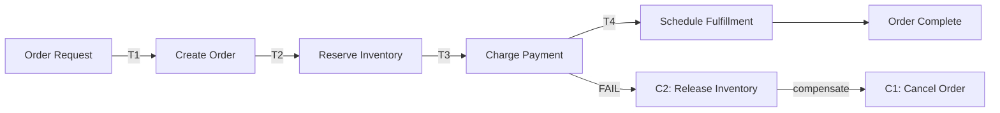

### Pitfalls
- ❌ **Using Saga for simple two-service operations:** If Service A calls Service B synchronously and B can rollback atomically, a Saga adds unnecessary complexity. Sagas are for 3+ steps with asynchronous communication.
- ❌ **Treating Saga as having ACID isolation:** Between T2 (reserve inventory) and T3 (charge payment), a concurrent saga can see the reserved inventory. Design your business logic to handle these temporary states.

### Concept Reference

---

## Q2: What is the difference between choreography-based and orchestration-based sagas?

**Role:** Mid | **Difficulty:** 🟡 | **Priority:** P1 | **Format:** Quick Answer

> **What the interviewer is testing:** Whether you understand the two coordination models and can reason about their trade-offs.

### Answer in 60 seconds
- **Choreography:** Each service knows what to do when it receives an event. No central coordinator. Service A publishes `OrderCreated` → Inventory Service listens, reserves stock, publishes `InventoryReserved` → Payment Service listens, charges card, etc.
- **Orchestration:** A dedicated Saga Execution Coordinator (SEC) tells each service what to do and listens for results. SEC sends commands: "Reserve inventory for order O-123" → waits for result → "Charge payment" → waits → etc.
- **Choreography pros:** Loose coupling, no single point of failure, easy to add new services.
- **Choreography cons:** Hard to visualize end-to-end flow, difficult to debug failures, cyclic dependencies possible.
- **Orchestration pros:** Single place to see saga state and flow, explicit compensation logic, easier debugging.
- **Orchestration cons:** SEC becomes a bottleneck/SPOF (though it can be replicated), tighter coupling to coordinator.
- **Rule of thumb:** Choreography for simple 3-step sagas; orchestration for complex flows with conditional branching and 5+ services.

### Diagram

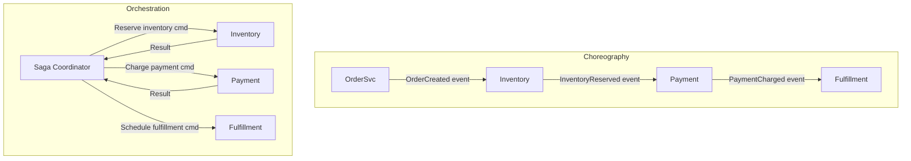

### Pitfalls
- ❌ **Using choreography for flows with >5 services:** The implicit flow across 7 services becomes impossible to trace. A failure in step 5 requires examining 5 different service logs. Orchestration makes this explicit.
- ❌ **"Orchestration is always better":** Choreography is simpler to implement and scales better for high-throughput sagas where the coordinator would be a bottleneck (e.g., 100K events/sec).

### Concept Reference

---

## Q3: How do you design a Saga for a ride-sharing trip lifecycle?

**Role:** Senior | **Difficulty:** 🔴 | **Priority:** P1 | **Format:** Deep Dive

> **What the interviewer is testing:** Whether you can model a complex real-world saga with conditional paths, timeouts, and multiple compensation scenarios.

### Problem Constraints
| Dimension | Value |
|-----------|-------|
| Company | Uber-like ride-sharing |
| Saga steps | Request → Driver Match → Driver Accept → Ride → Payment → Rating |
| Timeout | Driver match: 30 seconds; Driver accept: 60 seconds |
| Concurrent sagas | 100K active trips simultaneously |
| Failure rate | ~2% driver no-show, ~0.5% payment failure |

### Approach A — Choreography (simple but limited)

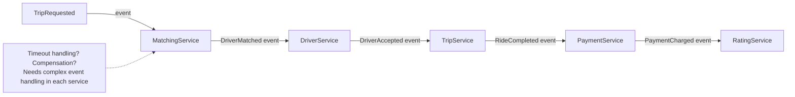

### Approach B — Orchestration with SEC (production approach)

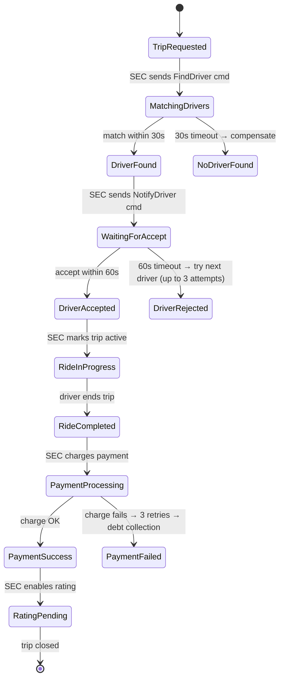

| Scenario | Action | Compensation |
|----------|--------|-------------|
| No driver in 30s | Cancel trip | Notify rider; no charge |
| Driver rejects (up to 3x) | Try next driver | After 3 rejects: notify rider, cancel |
| Rider cancels after match | Cancel trip | Possible cancellation fee |
| Driver no-show | Cancel trip | No charge; log driver |
| Payment fails | Retry 3x, then defer | Mark rider as owing; allow trip |

### Recommended Answer
Model the trip as an orchestrated saga with a state machine in the SEC. Key design decisions:

1. **State persistence:** SEC stores trip state in a database (`trip_id`, `state`, `driver_id`, `retry_count`, `last_event_time`). SEC can crash and resume from persisted state.

2. **Timeouts as first-class events:** A timer service sends `DriverMatchTimeout` after 30 seconds. SEC handles this event by transitioning to `NoDriverFound` and executing compensation.

3. **Retry with circuit breaking:** Payment failures retry up to 3 times with exponential backoff (2s, 4s, 8s). After 3 failures, the trip completes with `payment_deferred` status — revenue is not lost, user is notified.

4. **Driver retry loop:** If driver rejects, SEC re-enters `MatchingDrivers` state with blacklist of already-contacted drivers. Max 3 driver attempts before cancelling.

### What a great answer includes
- [ ] State machine diagram covering all paths including failures
- [ ] Explicit timeout handling for each blocking step
- [ ] SEC state persistence in database for crash recovery
- [ ] Retry logic with maximum attempts and fallback behavior
- [ ] Compensation actions for each failure scenario

### Pitfalls
- ❌ **Assuming timeouts are reliable:** Timer services can fail. Store `last_event_time` in SEC state. On SEC restart, check if any trip is in a state that should have timed out and handle retroactively.
- ❌ **Infinite retry loops:** Without a max retry count, a permanently failing payment step retries forever. Always set a maximum and escalate to a dead letter queue.

### Concept Reference

---

## Q4: What is a compensating transaction and how do you make it idempotent?

**Role:** Senior | **Difficulty:** 🔴 | **Priority:** P1 | **Format:** Quick Answer

> **What the interviewer is testing:** Whether you understand that compensating transactions are not simple "undo" — they're new forward-moving operations that must handle repeated execution.

### Answer in 60 seconds
- **Compensating transaction:** A business operation that semantically reverses the effect of a previous step. It is NOT a database rollback — it is a new write that produces a new event.
- **Example:** T2 = `ReserveInventory(orderId=O-123, sku=P-456, qty=5)`. C2 = `ReleaseReservation(orderId=O-123, sku=P-456, qty=5)`.
- **Why idempotency matters:** The SEC may call C2 multiple times if it crashes mid-compensation or if the inventory service times out and the SEC retries. Calling C2 twice should not release inventory twice.
- **How to implement:** Include the saga ID and step ID in the compensation call. The inventory service checks: "Is there an active reservation for saga S-789, step T2?" If yes, release it. If already released (idempotent check), return success without action.
- **Idempotency key storage:** `(sagaId, stepId, action) → result`. Use a unique constraint on `(saga_id, step)` in the reservations table.
- **Non-reversible steps:** Some operations cannot be undone (email sent, webhook fired). Forward compensation: send a correction email or cancellation notification.

### Diagram

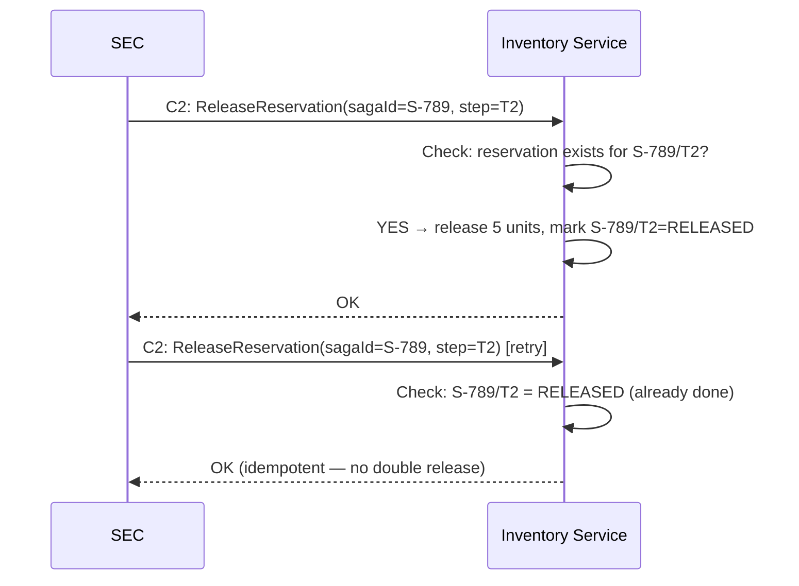

### Pitfalls
- ❌ **"RELEASED" state without a unique constraint:** If the service crashes between checking and writing "RELEASED", a race condition can execute the compensation twice. Use `INSERT INTO compensations (saga_id, step, status) ON CONFLICT DO NOTHING` for true atomicity.
- ❌ **Compensating in wrong order:** C3 must execute before C2 which executes before C1. Compensation in wrong order can create invalid business states (e.g., cancelling order before releasing inventory leaves orphaned reservations).

### Concept Reference

---

## Q5: How does the Saga Execution Coordinator (SEC) handle partial failures?

**Role:** Senior | **Difficulty:** 🔴 | **Priority:** P1 | **Format:** Deep Dive

> **What the interviewer is testing:** Whether you understand SEC state machine design, durable state storage, and the crash-recovery protocol.

### Problem Constraints
| Dimension | Value |
|-----------|-------|
| SEC deployment | 3 replicas behind a load balancer |
| Saga state store | PostgreSQL with row-level locking |
| Partial failure | SEC replica crashes mid-saga |
| Recovery time | SEC leader election + state reload: < 5 seconds |

### Approach A — In-memory SEC (dangerous)

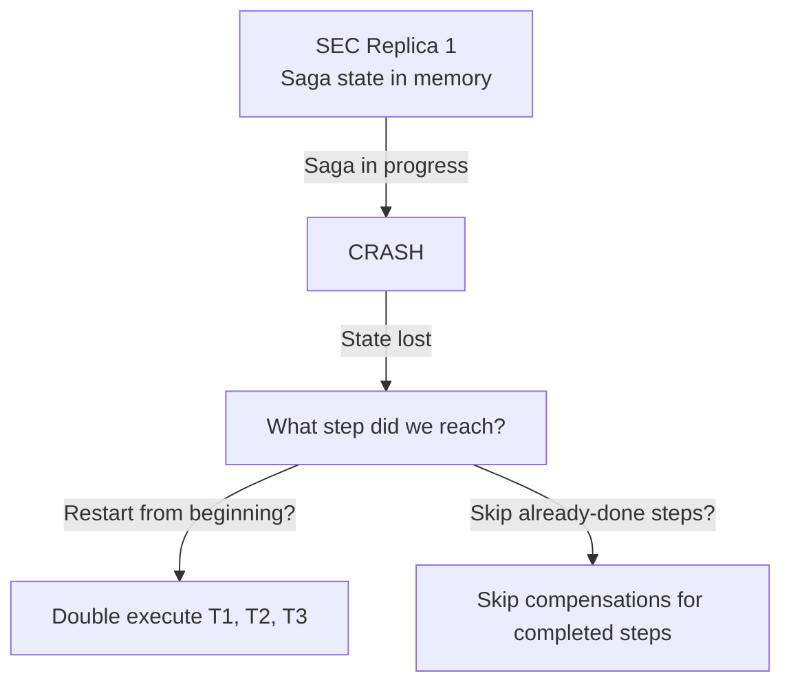

### Approach B — Durable SEC with saga table (correct)

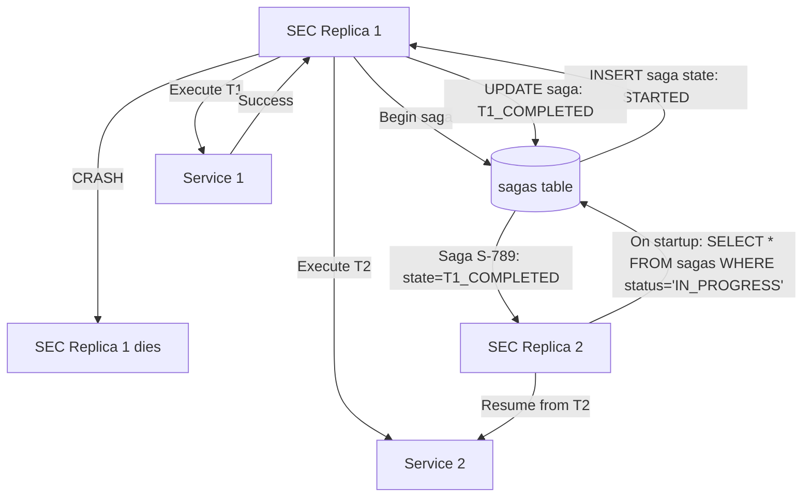

| SEC State | Meaning | On Recovery |
|-----------|---------|-------------|
| STARTED | T1 not yet sent | Re-execute from T1 (T1 must be idempotent) |
| T1_COMPLETED | T1 done, T2 not sent | Re-execute from T2 |
| T2_COMPLETED | T2 done, T3 not sent | Re-execute from T3 |
| COMPENSATING | Compensation in progress | Resume compensation |
| COMPENSATED | All compensations done | Mark complete, alert |
| COMPLETED | All steps done | Done |

### Recommended Answer
The SEC must use **durable state storage** — a database table updated at each saga step boundary. The protocol: (1) write saga state to DB before executing each step (write-ahead logging for sagas), (2) after step completes, update state to reflect completion, (3) on SEC crash + recovery, scan for IN_PROGRESS sagas and resume from their last recorded state.

All services called by the SEC must be **idempotent** because the SEC may re-execute a step after crash recovery even if the step previously completed (the "completed" status was not written before the crash). Use `(sagaId, stepId)` as idempotency keys in all participant services.

SEC state machine must handle the crash-during-compensation scenario: if the SEC crashes while compensating step T2, on recovery it finds `state=COMPENSATING, last_completed_compensation=C3`, and resumes from C2.

### What a great answer includes
- [ ] Durable saga state table with step-level granularity
- [ ] Recovery protocol: scan for IN_PROGRESS sagas on startup
- [ ] Idempotency requirement for all participant services
- [ ] Handling crash-during-compensation (resume, not restart)
- [ ] Monitoring: alert on sagas stuck in IN_PROGRESS for > max SLA

### Pitfalls
- ❌ **SEC state stored in Redis without persistence:** Redis without AOF/RDB persistence = state lost on restart = sagas cannot be recovered. Use PostgreSQL or a message broker with durable queues.
- ❌ **Not handling "already completed" on recovery:** If T2 completed but the SEC crashed before writing T2_COMPLETED, the recovery re-executes T2. Without idempotency in Service 2, this causes double execution.

### Concept Reference

---

## Q6: How does Uber implement sagas for distributed trip management?

**Role:** Senior | **Difficulty:** 🔴 | **Priority:** P2 | **Format:** Quick Answer

> **What the interviewer is testing:** Whether you know a real-world Saga implementation at extreme scale.

### Answer in 60 seconds
- **Uber's Cadence/Temporal:** Uber built Cadence (open-sourced 2017), which evolved into Temporal. It's a workflow engine that implements orchestrated sagas as durable, resumable code execution.
- **How it works:** Trip lifecycle is written as regular code (Go/Java) with `workflow.ExecuteActivity()` calls. Cadence records each activity execution as events to a persistent store (Cassandra). If a worker crashes mid-workflow, Cadence replays the event history to reconstruct state and continues from where it left off.
- **Scale:** Uber runs 100M+ workflows on Cadence. Single Cadence cluster handles 100K workflow executions/second with p99 activity latency < 50ms.
- **Trip saga in Temporal terms:** Each step (match driver, accept, in-progress, complete, payment, rating) is a workflow activity. Timeouts are built-in. Compensations are handled in workflow code using `try/catch` — compensating activities execute in the catch block.
- **Key advantage over manual SEC:** Workflow state replay is automatic (no manual DB schema for saga states). Activity retries with exponential backoff are built-in. Timer support (driver accept timeout) is first-class.

### Diagram

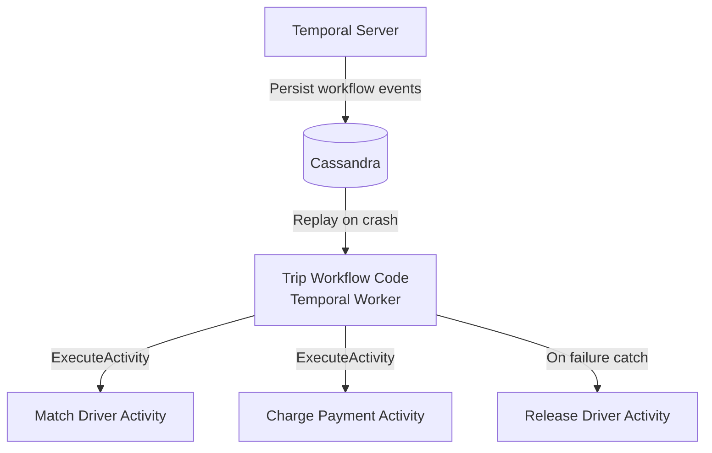

### Pitfalls
- ❌ **Building a custom SEC instead of using Temporal/Conductor:** Manual saga state machines require 1000s of lines of boilerplate. Temporal provides this infrastructure with proven production reliability.
- ❌ **Very long-running workflows without checkpoints:** A Temporal workflow that runs for 30 days accumulates a 30-day event history. Enable workflow continuation-as-new to reset history while preserving state.

### Concept Reference

---

## Q7: What happens when a compensating transaction also fails?

**Role:** Senior | **Difficulty:** 🔴 | **Priority:** P2 | **Format:** Quick Answer

> **What the interviewer is testing:** Whether you have a plan for the failure of the failure handler — the "saga gone wrong" scenario.

### Answer in 60 seconds
- **The scenario:** T1, T2, T3 complete. T4 fails. SEC executes C3, C2 — they succeed. C1 fails (Service 1 is down).
- **Retry with exponential backoff:** Retry C1 up to 5 times with backoff (1s, 2s, 4s, 8s, 16s). Most transient failures resolve within 30 seconds.
- **Dead Letter Queue (DLQ):** After max retries, push the failed compensation to a DLQ. A human operator or automated job monitors the DLQ and executes manual compensation.
- **Saga stuck in COMPENSATING state:** Monitor sagas stuck in `COMPENSATING` for > max SLA (e.g., 5 minutes). Alert with full saga context (saga ID, failed step, last retry time, error message).
- **Business decision:** In extreme cases (C1 = "cancel order" fails because order service is down for 24 hours), a business-level decision must be made: hold the partial compensation or proceed with partial state. This is a product/finance decision, not a technical one.
- **Design principle:** Compensating transactions must be designed to eventually succeed or have a known fallback. If a compensation is potentially impossible (can't unsend an email), use forward compensation (send a correction email).

### Diagram

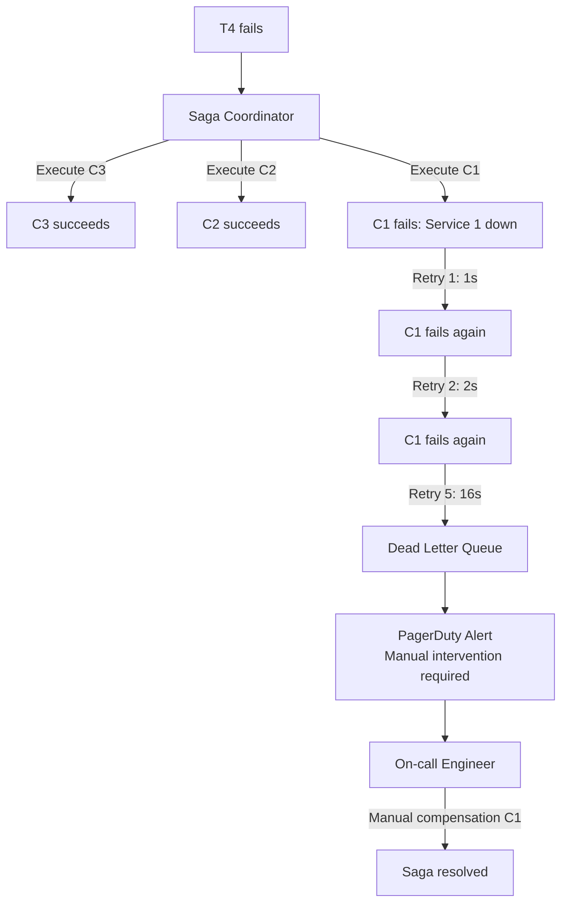

### Pitfalls
- ❌ **No DLQ for compensation failures:** Without a DLQ, failed compensations are silently dropped. Users are charged or inventory is leaked without any alert.
- ❌ **Retrying compensation indefinitely:** An infinite retry loop against a permanently down service will never resolve. Set a max retry count and escalate.

### Concept Reference

---

## Q8: How do you test sagas — what failure scenarios must you cover?

**Role:** Staff | **Difficulty:** ⚫ | **Priority:** P2 | **Format:** Deep Dive

> **What the interviewer is testing:** Whether you think systematically about saga failure modes and can design a test strategy covering happy path, compensation paths, and crash recovery.

### Problem Constraints
| Dimension | Value |
|-----------|-------|
| Saga | 4-step checkout saga |
| Test environments | Unit tests, integration tests, chaos tests |
| Critical scenarios | All N combinations of step failures + SEC crash |

### Approach A — Happy path only (insufficient)

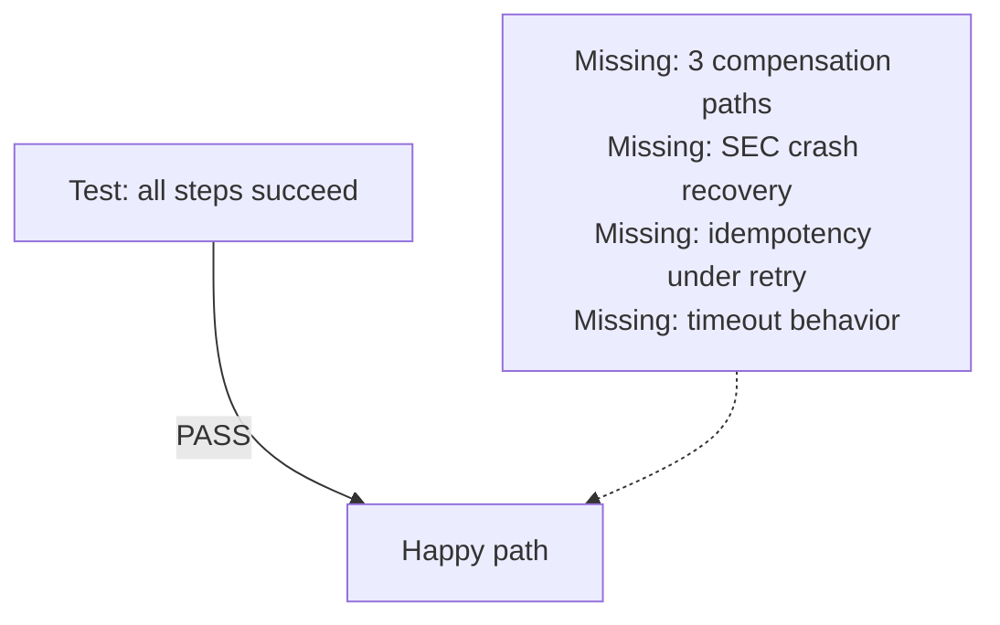

### Approach B — Systematic failure matrix (production-grade)

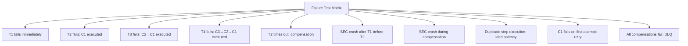

| Test Category | Scenarios | What to Verify |
|---------------|-----------|---------------|
| Happy path | All 4 steps succeed | Correct final state, all events published |
| Step N fails | Failure at each step (4 tests) | Compensations for steps 1..N-1 execute correctly |
| Timeout | Each step times out | Same as failure: compensation triggered |
| SEC crash | Crash before/after each step (8 tests) | Recovery resumes from correct step without double-execution |
| Idempotency | Same step called twice | No double write, same result |
| Compensation failure | C1 fails after max retries | DLQ entry created, alert fired |
| Concurrency | Two sagas for same resource | No inventory double-spend |

### Recommended Answer
Test at three levels:

**Unit tests (fast, isolated):** Mock all external services. Test the SEC state machine transitions for every combination of success/failure/timeout. 4-step saga = 16 failure combinations minimum.

**Integration tests (real services, controlled failure injection):** Use a test double that can be instructed to fail on the Nth call. Verify end-to-end saga completion with failure injection at each step.

**Chaos tests (production-like environment):** Use Chaos Monkey or Gremlin to kill service replicas mid-saga. Verify that sagas complete correctly (either forward or via compensation) without data inconsistency.

Key metric: **saga completion rate** = (completed + compensated) / (started). Should be 100%. A saga stuck in `IN_PROGRESS` for > 10 minutes indicates a test gap.

### What a great answer includes
- [ ] Systematic failure matrix: fail at each step (N test cases for N steps)
- [ ] SEC crash recovery tests (crash before/after each step)
- [ ] Idempotency tests (duplicate step execution)
- [ ] Compensation failure tests (DLQ path)
- [ ] Concurrency tests (two sagas competing for same resource)

### Pitfalls
- ❌ **Testing only the happy path in integration tests:** Production saga bugs almost always occur in failure paths. If you test only happy path, you discover failures in production.
- ❌ **Forgetting to test recovery after SEC crash:** If SEC state is correct but not tested under crash conditions, the first production outage will reveal an untested code path in SEC recovery.

### Concept Reference

---

## Q9: When should you choose orchestration over choreography?

**Role:** Staff | **Difficulty:** ⚫ | **Priority:** P2 | **Format:** Quick Answer

> **What the interviewer is testing:** Whether you can articulate the trade-offs beyond "orchestration is more complex" and give concrete decision criteria.

### Answer in 60 seconds
- **Choose orchestration when:**
  1. **>4 steps:** Choreography sagas with 5+ services create "saga spaghetti" — following the flow requires tracing events across 5 service logs. Orchestration externalizes the flow to a single coordinator.
  2. **Conditional branching:** "If payment method is credit card, do X; if PayPal, do Y; if bank transfer, wait 3 days." Conditional logic in a choreography saga requires each service to know about branches it doesn't own.
  3. **Complex compensation order:** Compensation must happen in reverse order. Choreography requires each service to know its compensation predecessor — coupling services to each other's compensation logic.
  4. **Audit/visibility requirements:** Orchestrated sagas give a single place to see the current state of any saga. Choreography requires log aggregation across N services.
- **Choose choreography when:**
  1. **Simple 2–3 step flow** with no branching.
  2. **High throughput** where the coordinator would be a bottleneck (>50K sagas/sec).
  3. **Loose coupling is critical** and teams don't want a central dependency.

### Diagram

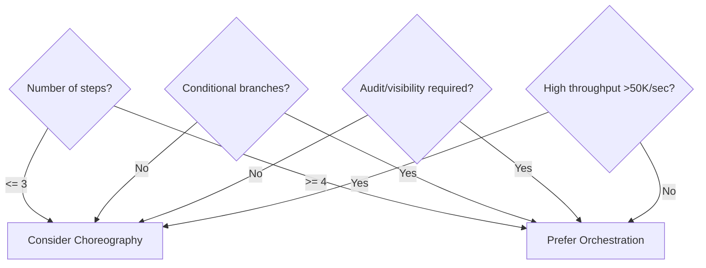

### Pitfalls
- ❌ **Using choreography because "it's simpler to start":** Choreography sagas grow in complexity faster than orchestrated sagas as requirements evolve. Adding a new step to a choreography saga requires updating every downstream service's event handling.
- ❌ **Making the SEC a monolith:** If the SEC contains business logic for all sagas (order saga, refund saga, onboarding saga), it becomes a distributed monolith. Keep each saga type in its own SEC deployment.

### Concept Reference

---

## Q10: Design the saga for an e-commerce checkout: cart → inventory lock → payment → fulfillment

**Role:** Senior | **Difficulty:** 🔴 | **Priority:** P1 | **Format:** Scenario
**Real Company:** Amazon, Shopify, Zalando

### The Brief
> "Design a checkout saga for an e-commerce platform. The checkout involves: validating the cart, reserving inventory, processing payment, and initiating fulfillment. Any step can fail. Define the steps, compensation transactions, state machine, and failure handling."

### Clarifying Questions
1. How long can inventory be reserved before timing out? (Determines reservation TTL)
2. What happens if payment succeeds but fulfillment is temporarily unavailable? (Forward compensation vs hold)
3. Can inventory be oversold? (Determines if soft or hard reservation is used)
4. What is the maximum checkout duration SLA? (Drives timeout values)

### Back-of-Envelope Estimation
| Metric | Calculation | Result |
|--------|-------------|--------|
| Peak checkouts | Black Friday: 50K/min | 833/sec |
| Avg checkout duration | Validate + Reserve + Pay + Fulfill | ~2 seconds |
| Concurrent sagas | 833/sec × 2 sec | ~1,660 concurrent sagas |
| SEC throughput required | 833 sagas/sec × 6 state transitions | 5K state updates/sec |

### High-Level Architecture

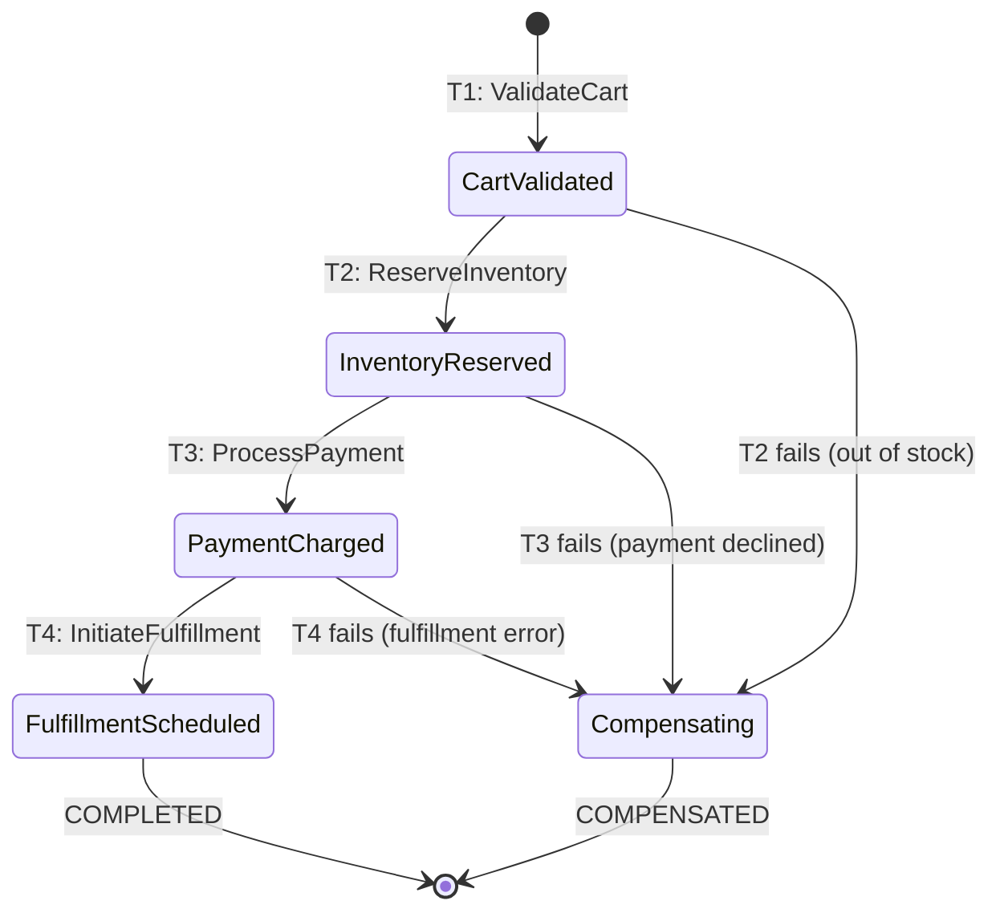

### Trade-off Decisions
| Decision | Option A | Option B | Chosen | Why |
|----------|----------|----------|--------|-----|
| Coordination | Orchestration | Choreography | Orchestration | 4 steps + conditional payment methods |
| Inventory reservation | Hard decrement | Soft reservation TTL | Soft reservation (60s TTL) | Easy compensation; prevents oversell |
| Payment failure | Fail checkout | Queue for retry | Fail checkout | User should retry with correct payment info |
| Fulfillment failure | Fail checkout | Hold as pending | Hold as pending | Fulfillment system failure should not cancel a successful payment |
| SEC state store | Redis | PostgreSQL | PostgreSQL | Durability required; SEC must survive crashes |

### Failure Modes
| Failure | Impact | Mitigation |
|---------|--------|------------|
| Cart validation fails | No downstream impact | Return 400 to user |
| Inventory out of stock | T2 fails; C1 (nothing to compensate) | Return "out of stock" error |
| Inventory service down | T2 times out after 5s | Retry 3x; fail checkout gracefully |
| Payment declined | T3 fails; C2 (release reservation) | Release reservation; return payment error |
| Fulfillment unavailable | T4 fails after payment success | Mark order as PAYMENT_CAPTURED, queue for fulfillment retry (forward compensation) |
| SEC crashes mid-saga | Saga state lost (if in-memory) | PostgreSQL saga table; resume on recovery |
| Reservation TTL expires | Inventory released before payment | Set TTL > payment timeout (60s reservation TTL, 30s payment SLA) |

### Concept References
→ [Distributed Transactions](distributed-transactions)
