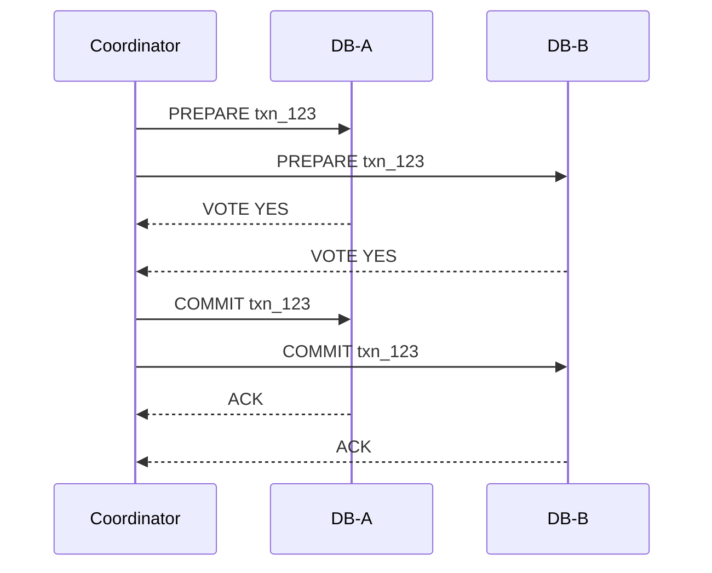
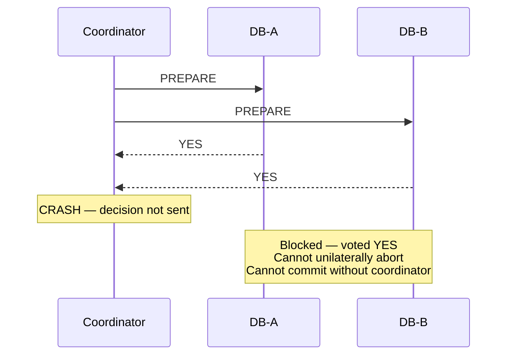
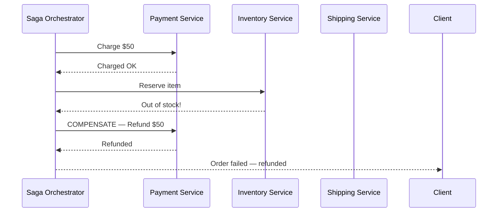
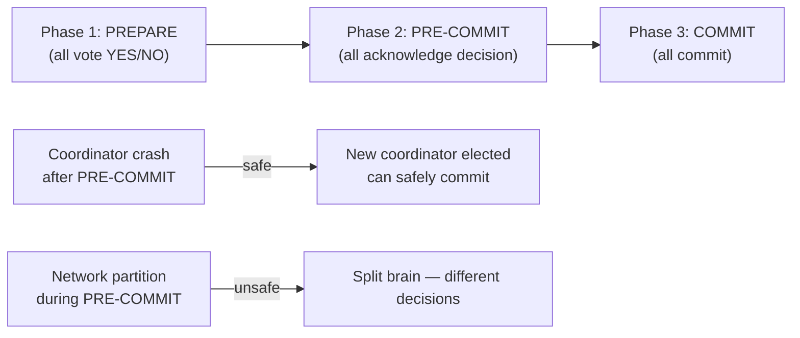
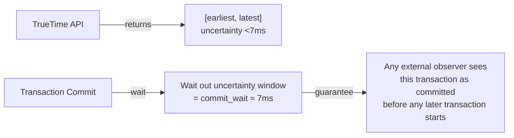

# Two-Phase Commit (2PC)

8 questions covering 2PC from fundamentals to Google Spanner's implementation.

---

## Q1: What is two-phase commit and what problem does it solve?

**Role:** Mid, Senior | **Difficulty:** 🟡 Mid | **Priority:** P0 | **Format:** Quick Answer

> **What the interviewer is testing:** Whether you can explain distributed atomicity and the coordinator role.

### Answer in 60 seconds
- **Problem:** How do you make a write to 3 different databases appear atomic — all succeed or all fail?
- **Phase 1 — Prepare:** Coordinator sends `PREPARE` to all participants. Each participant logs intent and responds `YES` (can commit) or `NO` (abort).
- **Phase 2 — Commit:** If all say YES, coordinator sends `COMMIT`; any NO → coordinator sends `ABORT` to all.
- **Key guarantee:** Once all participants vote YES and coordinator decides COMMIT, the transaction will eventually commit even if participants crash.
- **Failure window:** If coordinator crashes after Phase 1 votes but before Phase 2 — participants are **blocked** waiting indefinitely.

### Diagram

### Pitfalls
- ❌ **"2PC is safe":** 2PC is a **blocking protocol** — coordinator failure leaves participants locked indefinitely.
- ❌ **Using 2PC between microservices:** Network latency makes it impractical; use Saga pattern instead.

### Concept Reference
→ [Distributed Transactions](./distributed-transactions)

---

## Q2: What is the coordinator failure problem in 2PC?

**Role:** Senior | **Difficulty:** 🔴 Senior | **Priority:** P0 | **Format:** Deep Dive

> **What the interviewer is testing:** The fundamental weakness of 2PC — why it's called a blocking protocol.

### Problem Constraints
| Scenario | State |
|----------|-------|
| After Phase 1 (all voted YES) | Participants locked — cannot abort on their own |
| Coordinator crashes | Participants block until coordinator recovers |
| Recovery time | Minutes to hours if coordinator needs manual intervention |

### The Failure Scenario

### Why participants can't unilaterally decide
- If DB-A aborts on its own while coordinator planned to COMMIT — DB-B commits → **inconsistency**
- If DB-A commits on its own while coordinator planned to ABORT — DB-B aborts → **inconsistency**
- Participants must wait for coordinator to recover from its transaction log.

### What a great answer includes
- [ ] Coordinator crash after all YES votes = participants block (cannot abort or commit)
- [ ] Participants hold row locks during this block — causing cascading delays
- [ ] Recovery requires coordinator to replay its WAL after restart
- [ ] Block duration = coordinator restart time (can be minutes)

### Pitfalls
- ❌ **"Participants can time out and abort":** They cannot — they voted YES, a unilateral abort risks inconsistency.
- ❌ **Confusing 2PC with Paxos:** Paxos is a consensus algorithm that tolerates coordinator failure; 2PC does not.

---

## Q3: How does the Saga pattern solve the 2PC blocking problem for microservices?

**Role:** Senior, Backend | **Difficulty:** 🔴 Senior | **Priority:** P0 | **Format:** Quick Answer

> **What the interviewer is testing:** Whether you know the practical alternative to 2PC in modern distributed systems.

### Answer in 60 seconds
- **Saga splits a transaction into local transactions** — each service commits its own change and publishes an event.
- **Compensating transactions** undo committed steps if a later step fails (e.g., refund a charge if shipping fails).
- **Choreography Saga:** Services react to each other's events (no central coordinator).
- **Orchestration Saga:** A central Saga Orchestrator sends commands and handles failures (easier to debug).
- **Trade-off:** No atomicity — intermediate states are visible. Users might see "order placed" before "payment confirmed."

### Diagram — Orchestration Saga

### Pitfalls
- ❌ **"Saga is exactly like 2PC":** Saga has eventual consistency — intermediate states are visible.
- ❌ **Not implementing compensating transactions:** Every Saga step must have a defined compensation.

---

## Q4: What is three-phase commit (3PC) and why doesn't it fully solve 2PC's problems?

**Role:** Senior | **Difficulty:** 🔴 Senior | **Priority:** P1 | **Format:** Quick Answer

> **What the interviewer is testing:** Understanding why 3PC exists but is rarely used in practice.

### Answer in 60 seconds
- **3PC adds a pre-commit phase** between Phase 1 (prepare) and Phase 2 (commit) to avoid blocking.
- **Pre-commit phase:** Coordinator sends `PRE-COMMIT` after all YES votes — participants acknowledge they know coordinator decided to commit.
- **If coordinator fails after PRE-COMMIT:** Participants can elect a new coordinator and safely commit (they know everyone voted YES).
- **Still fails under network partition:** If the partition isolates the coordinator during PRE-COMMIT, different partitions may make different decisions — **network partition breaks 3PC**.
- **Why nobody uses it:** Extra round trip (latency), complex failure handling, network partitions still break it.

### Diagram

### Pitfalls
- ❌ **"3PC is strictly better than 2PC":** 3PC breaks under network partitions — CAP theorem applies.
- ❌ **Using 3PC in practice:** Virtually no production databases implement 3PC; Paxos/Raft are preferred.

---

## Q5: How does Google Spanner use 2PC with TrueTime for globally distributed transactions?

**Role:** Staff | **Difficulty:** ⚫ Staff | **Priority:** P2 | **Format:** Deep Dive

> **What the interviewer is testing:** Understanding how bounded clock uncertainty enables distributed transactions without coordination overhead.

### The TrueTime Innovation

### How Spanner does 2PC at scale
- **Lock Table per Paxos group:** Each shard is managed by a Paxos group with a leader.
- **2PC across shards:** Spanner uses 2PC where each Paxos group leader is a participant.
- **Coordinator:** One Paxos leader acts as 2PC coordinator.
- **Commit timestamp:** Coordinator assigns a timestamp after all participants vote YES.
- **Commit wait:** All participants wait `max(latest)` of TrueTime before making visible — ensures causal ordering across data centers.
- **Result:** External consistency — Spanner is the first system to offer globally consistent, serializable transactions at planetary scale.

### Pitfalls
- ❌ **"TrueTime eliminates network coordination":** TrueTime reduces coordination but 2PC is still used across Paxos groups.
- ❌ **"7ms commit wait is free":** It adds 7ms to every read-write transaction — significant for latency-sensitive workloads.
