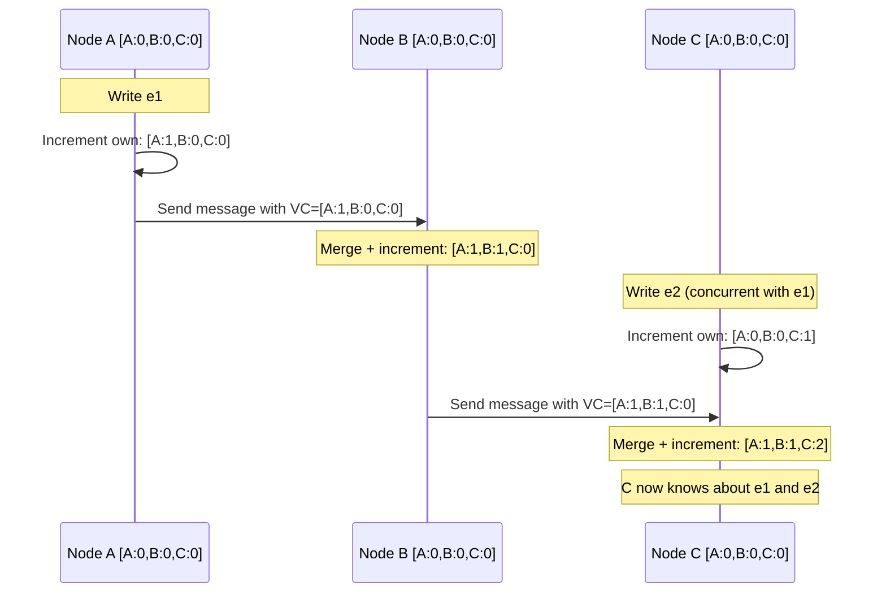
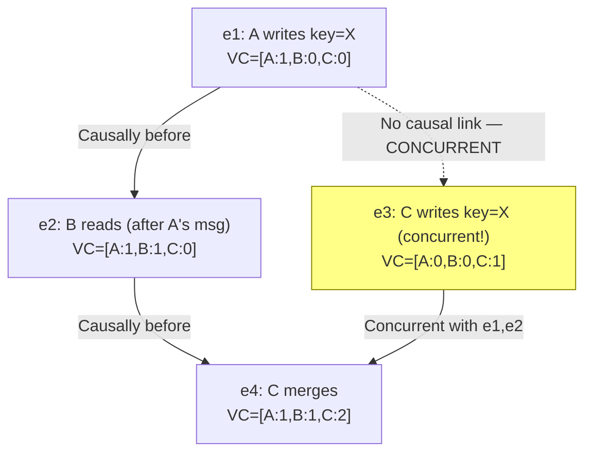
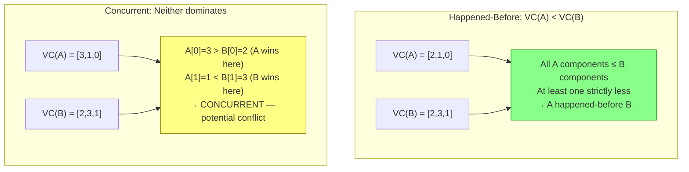
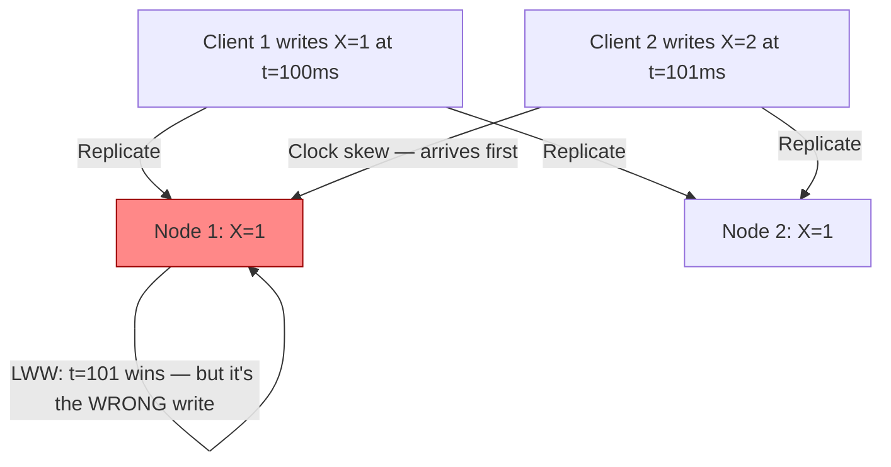
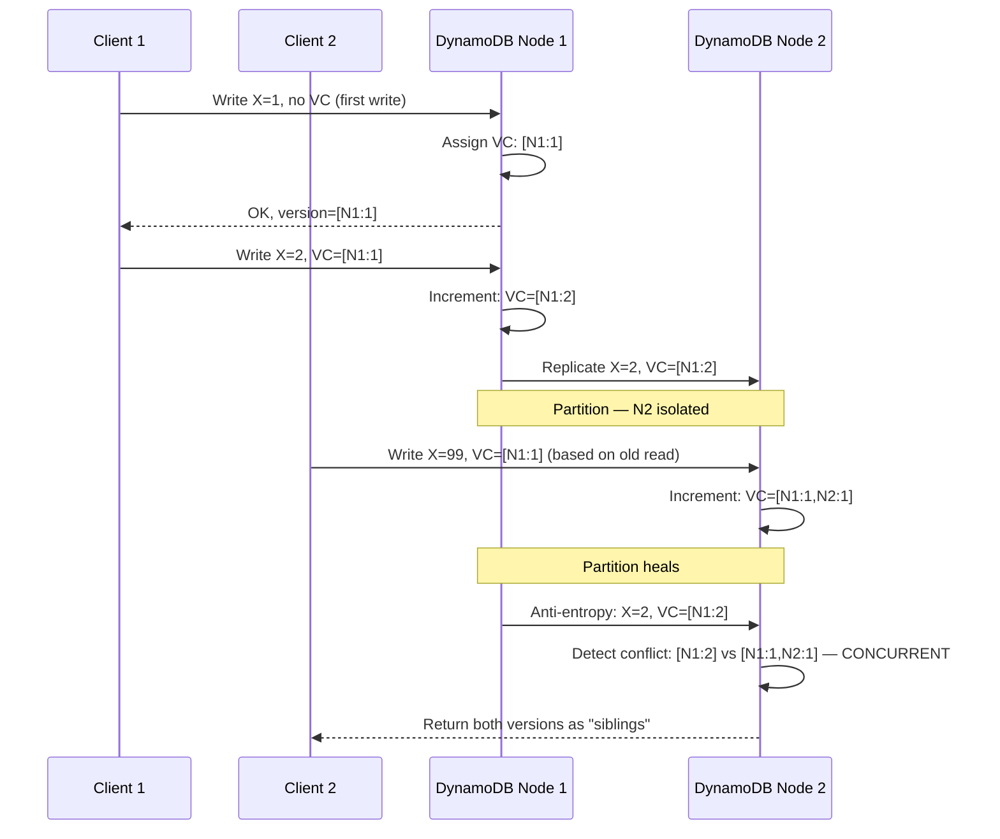
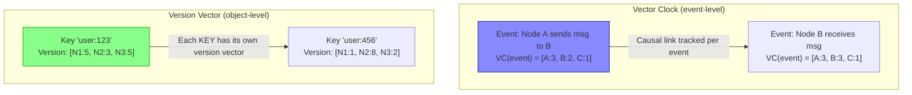
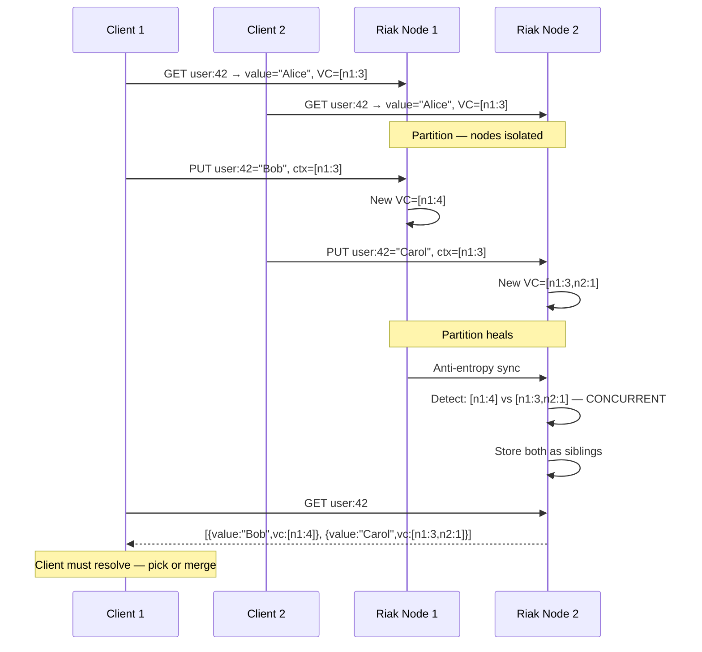

# Vector Clocks

5 questions covering vector clocks from fundamentals to Staff-level nuance.

---

## Q1: What is a vector clock and what does it track (causal ordering)?

**Role:** Mid, Backend | **Difficulty:** 🟡 | **Priority:** P0 | **Format:** Quick Answer

> **What the interviewer is testing:** Whether you understand how vector clocks capture causality in distributed systems where wall-clock time is unreliable.

### Answer in 60 seconds
- **Definition:** A vector clock is a data structure — an array of N counters, one per node — that tracks the causal history of events in a distributed system. Each node maintains its own counter and the last-known counters of all other nodes.
- **Why not wall-clock time:** Clocks across nodes can drift by 100ms–1 second. Two events timestamped 50ms apart cannot reliably be ordered. Network Time Protocol (NTP) accuracy is typically 1–100ms.
- **How it works:** When node A performs a write, it increments its own counter: `[A:3, B:1, C:2]`. When A sends a message to B, it includes its vector clock. B merges: `max(each position)` and increments its own counter.
- **What it captures:** Causal ordering — if event X caused event Y (X happened-before Y), then `VC(X) < VC(Y)`. If neither dominates, events are **concurrent** (potential conflict).
- **Size:** Vector clock grows linearly with number of nodes — N nodes = N integers per clock. At 10 nodes with 4-byte integers, a vector clock is 40 bytes.

### Diagram





### Pitfalls
- ❌ **"Vector clocks give total ordering":** They give partial ordering (causal). Two concurrent events have no defined order — that's by design.
- ❌ **Using Lamport clocks instead:** Lamport timestamps give total order but cannot detect concurrency — if `L(A) < L(B)`, it does not mean A happened-before B.
- ❌ **Ignoring clock size growth:** In dynamic systems where nodes join and leave, vector clocks can grow unboundedly. DynamoDB caps them with periodic pruning.

### Concept Reference
→ [Distributed Systems Fundamentals](../../../system-design/distributed-systems/fundamentals)

---

## Q2: How do you determine if event A happened before event B using vector clocks?

**Role:** Mid | **Difficulty:** 🟡 | **Priority:** P0 | **Format:** Quick Answer

> **What the interviewer is testing:** Whether you can apply the happened-before rules concretely — the core algorithm every distributed systems engineer must know.

### Answer in 60 seconds
- **Happened-before rule:** `VC(A) < VC(B)` (A happened-before B) if and only if: every component of `VC(A)` is ≤ the corresponding component of `VC(B)`, AND at least one component is strictly less.
- **Concurrent rule:** `VC(A)` and `VC(B)` are concurrent (neither happened-before the other) if neither `VC(A) < VC(B)` nor `VC(B) < VC(A)` — meaning there are positions where A's value is greater AND positions where B's value is greater.
- **Example:**
  - `[A:2, B:1, C:0]` vs `[A:2, B:3, C:1]` → First is happened-before second (all ≤, some <)
  - `[A:3, B:1, C:0]` vs `[A:2, B:3, C:1]` → Concurrent (A:3>2, but B:1<3)
- **Practical significance:** Concurrent = potential write conflict. System must choose: last-write-wins, application-level merge, or expose both versions to the client.

### Diagram



### Pitfalls
- ❌ **"Higher total sum means later":** Summing vector components is meaningless. `[3,0,0]` and `[1,1,1]` both sum to 3 but have different causal relationships.
- ❌ **Treating concurrent as an error:** Concurrency is expected in distributed systems. The system must have a defined policy for handling concurrent writes (merge, LWW, or multi-version).

### Concept Reference
→ [Distributed Systems Fundamentals](../../../system-design/distributed-systems/fundamentals)

---

## Q3: How does Amazon DynamoDB use vector clocks for conflict detection?

**Role:** Senior | **Difficulty:** 🔴 | **Priority:** P1 | **Format:** Deep Dive

> **What the interviewer is testing:** Whether you understand DynamoDB's original leaderless replication model and how vector clocks enabled its "always writable" guarantee.

### Problem Constraints
| Dimension | Value |
|-----------|-------|
| Architecture | Leaderless replication, RF=3 |
| Consistency model | Eventual consistency (default), tunable |
| Conflict rate | Low in practice (< 0.1% of writes) |
| Vector clock size | Pruned to max 10 entries per item |

### Approach A — Last Write Wins without Vector Clocks (lossy)



### Approach B — DynamoDB Vector Clock (original design)



| Dimension | LWW | Vector Clock |
|-----------|-----|--------------|
| Concurrent write detection | No — silently drops | Yes — exposes both versions |
| Client complexity | Low | Higher (must resolve conflicts) |
| Data loss risk | High (clock skew) | None |
| Storage overhead | None | ~10 extra bytes per item |

### Recommended Answer
DynamoDB's original 2007 Dynamo paper used vector clocks to detect concurrent writes in its leaderless replication model. Each item version carries a vector clock. When a client reads an item, it receives the vector clock. When writing, it sends back the vector clock as a precondition.

If two clients write concurrently (based on the same old vector clock version), the system detects the conflict by comparing the clocks — neither dominates, so both versions are returned as **siblings**. The client application is responsible for merging them (e.g., shopping cart: union of items; last-write-wins for scalar fields).

Vector clock entries are pruned when they exceed a maximum count (10 entries) by dropping the oldest entries with their timestamps. This can cause false-positives (concurrent events appear causal) but prevents unbounded growth.

**Note:** AWS has since moved DynamoDB away from client-visible vector clocks for most use cases. The current DynamoDB uses a single-leader model per partition key, reducing concurrency conflicts. The original Dynamo paper's vector clock design is more representative of open-source systems like Riak and Voldemort.

### What a great answer includes
- [ ] Explain the "send vector clock on read, include it on write" workflow
- [ ] Describe what happens when two writes have the same base version (concurrency)
- [ ] Explain sibling resolution as the client's responsibility
- [ ] Mention vector clock pruning and its false-positive risk
- [ ] Note that current DynamoDB uses single-leader per partition, reducing vector clock use

### Pitfalls
- ❌ **"DynamoDB still uses vector clocks today":** Modern DynamoDB uses a single-leader per partition key. The vector clock design is from the original 2007 Dynamo paper and is more relevant to Riak/Voldemort.
- ❌ **"Pruning vector clocks is safe":** Pruning drops causal history. It can cause the system to treat a causally-ordered pair as concurrent — creating spurious conflicts. It is a correctness trade-off.

### Concept Reference
→ [Database Replication](../../../system-design/storage-and-databases/database-replication)

---

## Q4: What is a version vector vs a vector clock?

**Role:** Senior | **Difficulty:** 🔴 | **Priority:** P1 | **Format:** Quick Answer

> **What the interviewer is testing:** Whether you can distinguish between two related but different concepts that are often confused in interviews and engineering blogs.

### Answer in 60 seconds
- **Vector clock:** Tracks causality of **events** (individual operations) across all nodes. Each event gets its own vector clock. Used for total causal ordering of operations.
- **Version vector:** Tracks causality of **data items** (object versions) — one vector per key, updated on each write. Answers "which replica has the current version of this key?" Used for replica synchronization.
- **Key difference:** A vector clock associates a clock with an *event*. A version vector associates a clock with a *data object*. In practice, version vectors are used in storage systems (Riak, CouchDB); vector clocks are used in process communication (logical clocks in distributed algorithms).
- **DynamoDB context:** DynamoDB's per-item clocks are technically **version vectors** (track object versions, not process events), even though the Dynamo paper called them "vector clocks."
- **Practical impact:** This distinction matters for garbage collection — version vectors can be pruned when all replicas have acknowledged a version; vector clocks require tracking all historical events.

### Diagram



### Pitfalls
- ❌ **Using "vector clock" and "version vector" interchangeably in interviews:** Examiners who know distributed systems will notice. The Dynamo paper itself mislabels version vectors as vector clocks — acknowledge this if asked.
- ❌ **"Version vectors require one entry per node in the cluster":** Modern implementations use **dotted version vectors** which are more space-efficient, tracking only nodes that have written the specific key.

### Concept Reference
→ [Distributed Systems Fundamentals](../../../system-design/distributed-systems/fundamentals)

---

## Q5: How does Riak use vector clocks to handle concurrent writes with siblings?

**Role:** Staff | **Difficulty:** ⚫ | **Priority:** P2 | **Format:** Deep Dive

> **What the interviewer is testing:** Whether you understand the full sibling lifecycle in a production AP database and the operational challenges of conflict resolution at scale.

### Problem Constraints
| Dimension | Value |
|-----------|-------|
| Architecture | Leaderless, consistent hashing, RF=3 |
| Write model | Always-write (AP) — never rejects writes |
| Conflict representation | Siblings (multiple versions of same key) |
| Default sibling limit | max_siblings = 100 (configurable) |
| Vector clock pruning | After 1 hour or 1,000 entries |

### Approach A — Allow All Siblings (AP default)



```mermaid
graph TD
  subgraph SiblingLifecycle["Sibling Lifecycle in Riak"]
    Write1[Client 1 write: Bob<br/>VC=[n1:4]] --> Detect[Riak detects concurrent writes]
    Write2[Client 2 write: Carol<br/>VC=[n1:3,n2:1]] --> Detect
    Detect --> Siblings[Store both as siblings]
    Siblings --> Read[Next GET returns both siblings]
    Read --> Resolve{Client resolution strategy}
    Resolve -->|Application merge| Merge[PUT merged value<br/>with combined VC context]
    Resolve -->|Last write wins| LWW[Pick latest timestamp<br/>Discard other sibling]
    Resolve -->|CRDT| CRDT[Riak CRDT handles automatically<br/>Counters, Sets, Maps]
    Merge --> Clean[Single version restored]
    LWW --> Clean
    CRDT --> Clean
  end
  style Siblings fill:#ff8,stroke:#880
  style Clean fill:#8f8,stroke:#090
```

### Recommended Answer
Riak stores multiple versions of an object (siblings) when it detects concurrent writes using vector clocks. A sibling is created when two writes happen with the same causal context (same base version) — the clocks are concurrent, so Riak cannot determine which is authoritative.

**Three sibling resolution strategies:**

1. **Application-level merge (recommended):** The client reads siblings, merges them (e.g., shopping cart = union of items from all sibling carts), and writes the merged result back with the combined causal context. Riak will collapse all siblings into one on the next write.

2. **Last-Write-Wins (LWW, `allow_mult=false`):** Riak automatically resolves using timestamps — simpler but risks losing writes. Suitable for non-critical data (session tokens, caches).

3. **CRDTs (Riak Data Types):** For common data structures, use Riak's built-in CRDTs: `counter` (increment-only, always mergeable), `set` (add/remove, uses 2P-Set internally), `map` (nested fields). CRDTs have **no siblings** — the data structure semantics define automatic merge.

**Operational risk:** If clients never resolve siblings, `max_siblings` (default 100) can fill up. Riak will start dropping new writes when the limit is hit. Monitor sibling counts as a key operational metric — alert if any key exceeds 5 siblings.

### What a great answer includes
- [ ] Explain the causal context flow: read VC → include in write → conflict detected when two writes share same base context
- [ ] Name all three resolution strategies (application merge, LWW, CRDT) with use-case guidance
- [ ] Warn about sibling accumulation as an operational hazard
- [ ] Mention CRDTs as the preferred pattern for new designs (no sibling risk)
- [ ] State that Riak's `allow_mult=true` is required for sibling-based conflict detection

### Pitfalls
- ❌ **"Siblings are an error":** Siblings are Riak's explicit design choice for AP systems. They are the correct representation of a write conflict — better than silently losing a write.
- ❌ **Leaving siblings unresolved indefinitely:** Accumulated siblings bloat object size and slow reads. A key with 100 siblings returns 100 versions — all must be transferred over the network.
- ❌ **Using LWW for all data types:** LWW is safe for last-valued semantics (user name, profile photo URL) but loses writes for additive operations (shopping cart, like count). Use CRDTs for additive data.

### Concept Reference
→ [Database Replication](../../../system-design/storage-and-databases/database-replication)
