# Mobile App Architecture

6 questions covering mobile app architecture from the 16ms frame budget to Spotify's audio preloading with WorkManager.

---

## Q1: What is the 16ms frame budget and what causes jank?

**Role:** Mid | **Difficulty:** 🟡 | **Priority:** P0 | **Format:** Quick Answer

> **What the interviewer is testing:** Whether you understand the rendering pipeline budget, what blocks it, and how to profile and fix jank.

### Answer in 60 seconds
- **60fps requirement:** Modern displays render at 60 frames per second. Each frame has 1000ms / 60 = **16.67ms** to complete all work before the display needs the next frame.
- **Frame budget breakdown:** Layout (measure + layout pass) + Draw (canvas operations) + Composite (GPU layer composition) + any main-thread code must fit within 16ms. If any frame exceeds 16ms, it is dropped — the user sees a "jank" (stutter).
- **Main thread work is the killer:** Any synchronous operation on the main (UI) thread blocks rendering. Network I/O, database queries, JSON parsing, image decoding — all must run on background threads. If they run on main thread, every frame they touch is dropped.
- **Measure/layout thrashing:** Alternating reads and writes to layout properties forces the browser/OS to recalculate layout multiple times per frame. Example (web): read `offsetHeight`, set `height`, read `offsetHeight` again — layout calculated 3 times. On mobile: avoid calling `measure()` inside `layout()`.
- **Overdraw:** Drawing pixels that are immediately covered by other pixels. A pixel drawn 5 times costs 5x the GPU fill rate. Android Debug GPU Overdraw shows overdraw in red. Fix: remove unnecessary background colors from nested views.
- **60fps is the floor; 120fps displays (ProMotion) need 8ms budget** — increasingly important for premium devices.

### Diagram

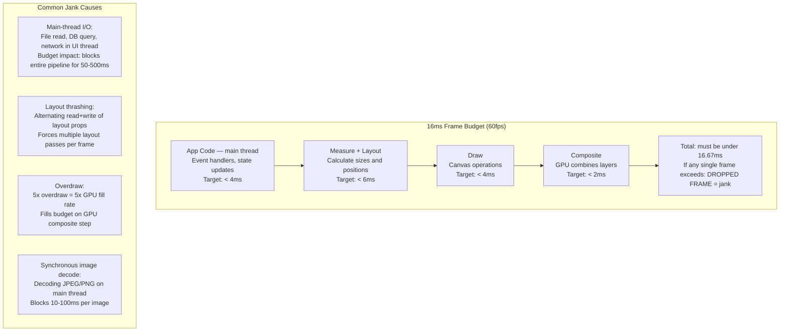

### Android Jank Profiling

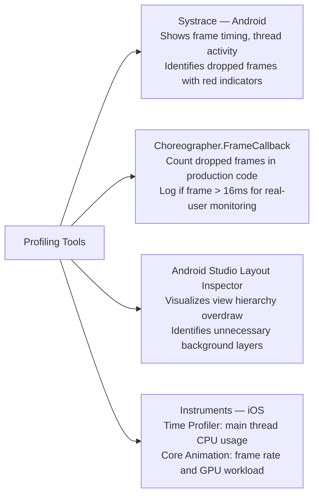

### Pitfalls
- ❌ **JSON parsing on main thread:** A 1MB API response parsed on the main thread takes 50–200ms — 3–12 dropped frames. Always parse JSON on a background thread, post result to main thread.
- ❌ **RecyclerView / ListView creating views not recycling:** Creating new view objects in `getView()` / `onCreateViewHolder()` for every item is expensive. The recycling mechanism in RecyclerView exists to reuse view objects — never bypass it.
- ❌ **Large Bitmaps loaded at full resolution:** Loading a 4K image (8MB decoded) to display in a 100x100dp thumbnail wastes memory and causes GC pauses. Downsample to display size using `BitmapFactory.Options.inSampleSize` before loading into memory.

### Concept Reference

---

## Q2: Cursor-based pagination for infinite scroll — why offset fails at 1M+ items?

**Role:** Mid | **Difficulty:** 🟡 | **Priority:** P0 | **Format:** Quick Answer

> **What the interviewer is testing:** Whether you understand the performance and consistency problems with OFFSET-based pagination at scale and can implement cursor-based pagination.

### Answer in 60 seconds
- **OFFSET pagination:** `SELECT * FROM posts ORDER BY created_at DESC LIMIT 20 OFFSET 200`. Returns rows 201–220. Simple but has two critical problems at scale.
- **Problem 1 — Performance:** `OFFSET 200` scans and discards the first 200 rows even though they are not returned. At `OFFSET 10000` (user scrolled to page 500), the DB scans 10,020 rows to return 20. At 1M items, deep pages require scanning millions of rows — query time: O(offset).
- **Problem 2 — Consistency during scroll:** User loads page 1 (posts 1–20). A new post is inserted. User loads page 2 (OFFSET 20) — but now row 1 has shifted to row 2, so page 2 shows post 1 again (duplicate) or skips post 21.
- **Cursor-based pagination:** Instead of OFFSET, use the last-seen item's unique identifier as the cursor. `SELECT * FROM posts WHERE id < :cursor ORDER BY id DESC LIMIT 20`. The cursor (last seen id) is returned with each response and included in the next request.
- **Performance:** Cursor query uses the indexed `id` column — O(log N) B-tree lookup regardless of position. `id < cursor` with an index scan returns 20 rows in 2ms whether the feed has 1K or 100M items.
- **Consistency:** New posts inserted at the top do not shift the cursor position. Infinite scroll never shows duplicates.

### Diagram

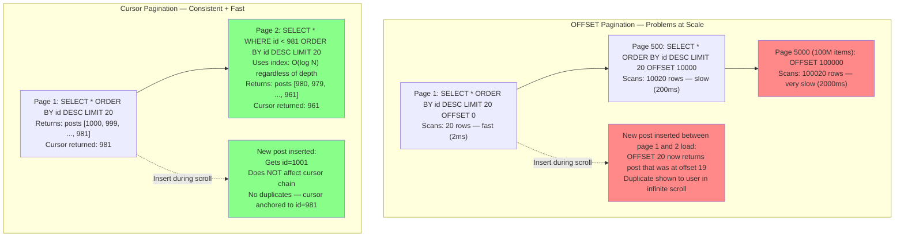

| Dimension | OFFSET Pagination | Cursor Pagination |
|-----------|------------------|------------------|
| Query performance | O(offset) — degrades with depth | O(log N) — constant regardless of depth |
| Consistency during inserts | Duplicates or skips | Stable — anchored to cursor |
| Jump to arbitrary page | Yes (`OFFSET = page * size`) | No (must traverse from beginning) |
| Implementation complexity | Simple | Moderate (return cursor with each response) |
| Infinite scroll suitability | Poor at depth | Excellent |

### Pitfalls
- ❌ **Using cursor on non-unique columns:** If cursor is on `created_at` (not unique), two posts with the same timestamp cause the cursor to skip one. Always use a unique column (id, uuid) as cursor, or composite (created_at, id) for time-ordered feeds.
- ❌ **Exposing database IDs as cursors:** If cursor = database auto-increment id, users can enumerate your entire dataset. Encode cursor as `base64(id + timestamp)` or use opaque tokens.
- ❌ **Not returning `hasNextPage` flag:** Mobile UI needs to know when to stop showing "load more" — when the last page returns fewer than `limit` items, or when the API returns `hasNextPage: false`. Without this, the app may show an infinite spinner on the last page.

### Concept Reference

---

## Q3: Push notification architecture — APNs (iOS) and FCM (Android) delivery flow

**Role:** Senior | **Difficulty:** 🟡 | **Priority:** P1 | **Format:** Quick Answer

> **What the interviewer is testing:** Whether you understand the end-to-end push notification pipeline for both platforms and the reliability considerations.

### Answer in 60 seconds
- **Why platform push services exist:** Apps cannot maintain persistent TCP connections on mobile — it drains battery. Apple (APNs) and Google (FCM) maintain a single platform-level persistent connection from each device. Your server routes through them.
- **iOS APNs flow:** App registers with APNs → APNs returns a device token (64-byte hex) → app sends token to your backend → your server sends push payload to APNs API → APNs delivers to device.
- **Android FCM flow:** App registers with FCM → FCM returns a registration token → app sends token to backend → server sends to FCM API → FCM delivers to device.
- **Token management:** Tokens can change (app reinstall, factory reset). Backend must update tokens on each app launch, and handle `InvalidRegistrationToken` response from FCM/APNs by deleting the stale token.
- **Silent push (background data):** Both platforms support silent pushes — notifications with no visible alert that wake the app for 30 seconds to sync data. iOS: `content-available: 1` APNs payload. Android: `data` payload only (no `notification` key).
- **Reliability:** APNs and FCM are best-effort. Firebase FCM provides a `collapse_key` to merge queued notifications and tracks delivery receipts.

### Diagram

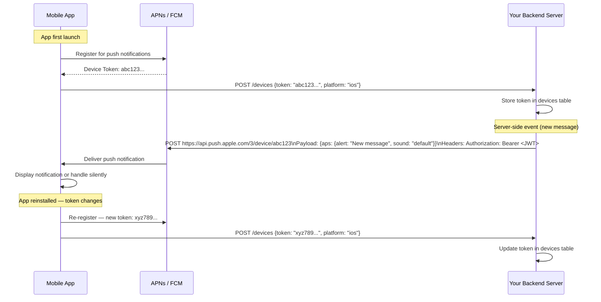

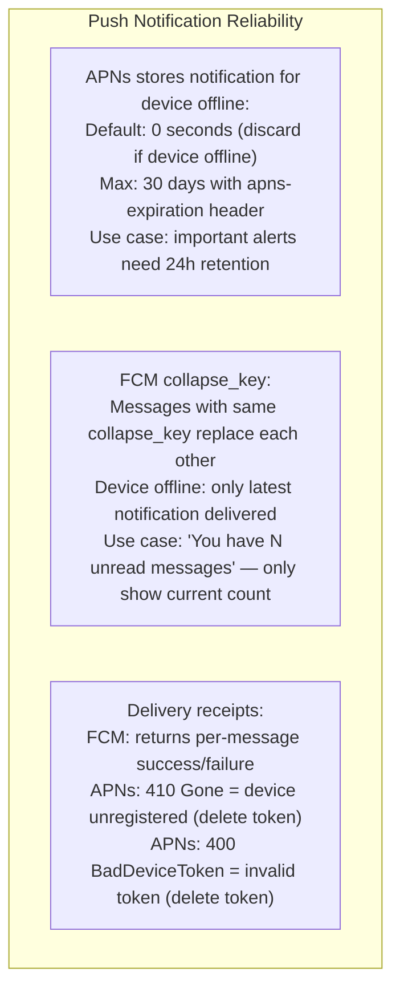

### Pitfalls
- ❌ **Storing push tokens indefinitely:** Tokens from uninstalled apps return `410 Gone` (APNs) or `NotRegistered` (FCM). If not deleted, your backend wastes API calls to dead tokens. Delete on first 410/NotRegistered response.
- ❌ **Sending full payload in silent push:** Silent pushes have a 4KB payload limit (APNs) and are rate-limited (30 per hour for background fetch). Silent push should contain only a notification type and a minimal ID — the app fetches the full content from your API on wake.
- ❌ **Not handling notification permission denied:** iOS 12+ requires explicit permission prompt for push. If user denies, your app silently never receives notifications. Must check `UNNotificationSettings.authorizationStatus` and offer a re-prompt flow when appropriate.

### Concept Reference

---

## Q4: React Native bridge — JS thread vs native thread, serialization overhead, new JSI architecture

**Role:** Senior | **Difficulty:** 🔴 | **Priority:** P1 | **Format:** Deep Dive

> **What the interviewer is testing:** Whether you understand React Native's threading model, the bottleneck of the old bridge, and how the new architecture (JSI) addresses it.

### Problem Constraints
| Dimension | Value |
|-----------|-------|
| React Native context | JavaScript runs in a JS engine (Hermes); native UI renders on the main thread |
| Old bridge bottleneck | All data between JS and native must be JSON-serialized — async, batched, cannot share memory |
| Impact | Animation at 60fps requires 60 JS→native calls/sec; each crossing the bridge adds 2–10ms |
| New architecture | JSI — JavaScript Interface — enables direct synchronous native method calls without serialization |

### Old Bridge Architecture

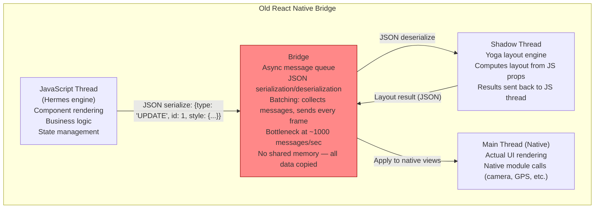

### New Architecture — JSI (JavaScript Interface)

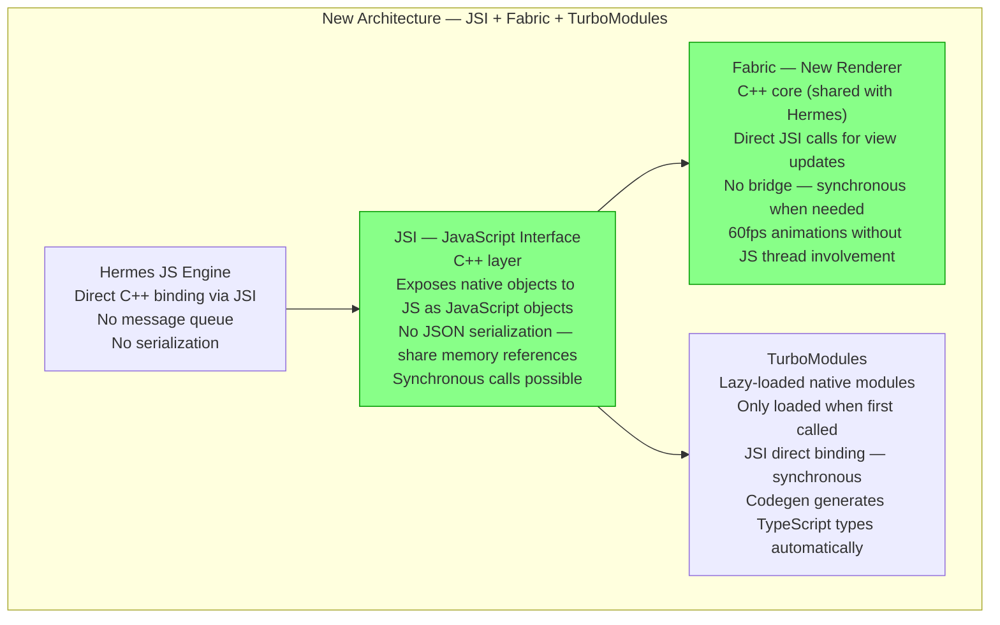

| Dimension | Old Bridge | New Architecture (JSI) |
|-----------|-----------|------------------------|
| Communication | Async, batched JSON | Synchronous, direct C++ |
| Serialization | JSON on every call | No serialization (memory refs) |
| Animation performance | Limited to bridge throughput | Synchronous — no bridge crossing |
| Module initialization | All modules loaded on startup | Lazy load via TurboModules |
| Type safety | Manual — TypeScript not enforced | Codegen generates types from spec |
| Memory sharing | Not possible — all data copied | Possible — JSI references |

### What a great answer includes
- [ ] JS thread runs business logic; main thread renders native UI — separate threads
- [ ] Old bridge: async message queue with JSON serialization — bottleneck at high-frequency updates
- [ ] Animation problem: 60fps = 60 JS→native calls/sec; each bridge crossing adds latency
- [ ] JSI: C++ layer that exposes native objects directly to JS as JavaScript objects
- [ ] Fabric + TurboModules: synchronous rendering and lazy-loaded modules via JSI

### Pitfalls
- ❌ **Doing complex JS computation on the animation frame:** Even with JSI, JS-driven animations that require recalculating positions on every frame (JS → native 60x/sec) can stutter if JS thread is busy. Use Animated API with `useNativeDriver: true` to run animations entirely on native thread.
- ❌ **Large data across the bridge on every render:** Passing large objects (user feed, image data) from JS to native on every render floods even the new JSI layer. Compute heavy objects once and pass references.
- ❌ **Not migrating to new architecture:** React Native 0.74+ defaults to the new architecture. Old bridge code that relies on legacy module initialization order may break. Migration guide required when upgrading.

### Concept Reference

---

## Q5: Secure token storage — iOS Keychain vs Android Keystore vs SharedPreferences

**Role:** Senior | **Difficulty:** 🔴 | **Priority:** P1 | **Format:** Quick Answer

> **What the interviewer is testing:** Whether you know the security properties of each storage mechanism and why SharedPreferences is insecure for secrets.

### Answer in 60 seconds
- **What to store securely:** OAuth access tokens, refresh tokens, API keys, encryption keys. These grant access to user data — compromising them is equivalent to compromising the user's account.
- **iOS Keychain:** Hardware-backed secure storage managed by the iOS security enclave. Data encrypted with AES-256 using a key derived from the device passcode and hardware UID. Survives app reinstall (optional). Accessible only to app with matching bundle ID. Jailbroken device bypasses most protections except Secure Enclave keys.
- **Android Keystore:** Hardware-backed key storage (available since Android 6 with hardware backing). Cryptographic operations (sign, encrypt) happen inside the secure hardware — the key material never leaves the hardware. Applications can generate keys and use them, but cannot extract the raw key bytes.
- **SharedPreferences / UserDefaults:** Plain XML/property list files stored in the app's data directory. Encrypted only by Android file system encryption (not key-specific encryption). On a rooted Android device: `cat /data/data/com.app/shared_prefs/*.xml` exposes all values. On iOS UserDefaults: stored in plain plist — extractable via iCloud backup or jailbreak.
- **Rule:** Anything that must survive app uninstall and is security-sensitive → Keychain/Keystore. Non-sensitive user preferences → SharedPreferences/UserDefaults.

### Diagram

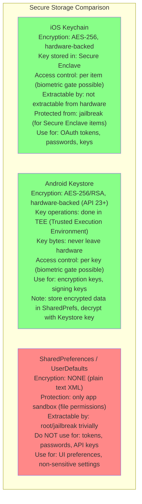

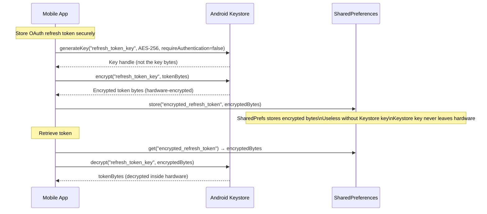

| Storage | iOS | Android | Security Level | Survives Reinstall |
|---------|-----|---------|----------------|---------------------|
| Keychain | ✓ (native) | N/A | Hardware-backed | Optional |
| Keystore | N/A | ✓ (native) | Hardware-backed | Yes |
| EncryptedSharedPreferences | N/A | ✓ (Jetpack Security) | Software (key in Keystore) | No |
| SharedPreferences / UserDefaults | N/A / ✓ | ✓ | None | Yes |

### Pitfalls
- ❌ **Storing access tokens in AsyncStorage (React Native):** AsyncStorage is unencrypted and accessible on rooted devices. Use `react-native-keychain` or `expo-secure-store` which wrap platform Keychain/Keystore.
- ❌ **Not setting Keychain accessibility options correctly:** Default iOS Keychain item accessibility `kSecAttrAccessibleAlways` means data is accessible even when device is locked. Use `kSecAttrAccessibleWhenUnlockedThisDeviceOnly` for sensitive tokens.
- ❌ **Forgetting token rotation:** Even securely stored tokens can be exfiltrated via runtime memory inspection or screenshot exploits. Implement short-lived access tokens (15 min) and long-lived refresh tokens (90 days with rotation). Refresh token rotation means a stolen refresh token becomes invalid after first use.

### Concept Reference

---

## Q6: Spotify preloads 30s audio while conserving battery — WorkManager constraints and foreground service lifecycle

**Role:** Staff | **Difficulty:** ⚫ | **Priority:** P2 | **Format:** Deep Dive

> **What the interviewer is testing:** Whether you understand how to build a battery-efficient background worker with platform constraints for a high-value use case like media prefetching.

### Problem Constraints
| Dimension | Value |
|-----------|-------|
| Goal | Preload next track's first 30 seconds while user is listening to current track |
| Constraint 1 | Cannot drain battery — user complains if Spotify causes excessive drain |
| Constraint 2 | Android Doze blocks network in background — must work despite it |
| Constraint 3 | App may be backgrounded during preload — process must survive |
| Preload size | 30s × 320kbps MP3 = ~1.2MB per track preload |

### Architecture

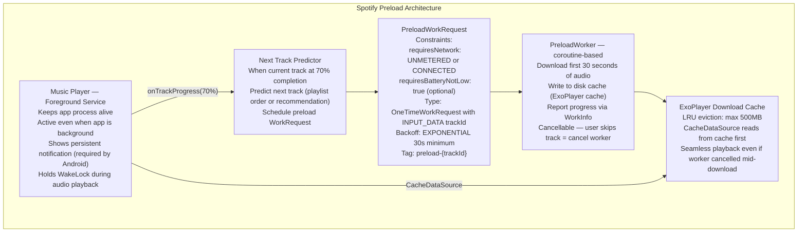

### Foreground Service for Continuous Playback

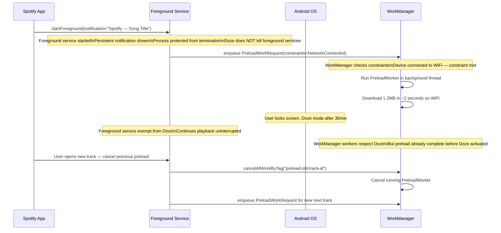

### Battery Optimization Strategy

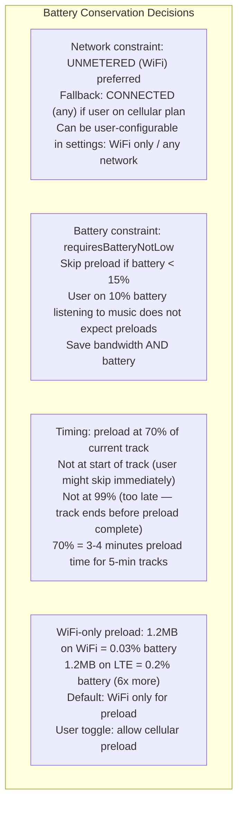

| Feature | Implementation | Battery Impact |
|---------|----------------|----------------|
| Playback continuity | Foreground Service | Required — cannot optimize |
| Next track preload | WorkManager + Network constraint | Minimal — WiFi only, 1.2MB |
| Album art prefetch | Glide / Coil disk cache | Tiny — JPEGs < 50KB |
| Lyrics prefetch | WorkManager, low priority | Tiny — text < 10KB |
| Offline download | WorkManager, charging preferred | High — full track, user-initiated |

### What a great answer includes
- [ ] Foreground Service required for continuous audio playback — exempt from Doze
- [ ] WorkManager for preload: constraint-based (network), guaranteed execution, cancellable
- [ ] Trigger preload at 70% of current track — gives enough time before end without wasting resources on skipped tracks
- [ ] WiFi-only constraint by default — reduces battery/data impact 6x vs LTE
- [ ] ExoPlayer cache for preloaded audio — seamless playback uses cache-first data source

### Pitfalls
- ❌ **Using background Service (not Foreground) for audio playback:** A regular background Service is killed by Android when memory is needed. Audio stops mid-song. Foreground Service with visible notification is required for continuous background audio on Android 8+.
- ❌ **Not cancelling preload on track skip:** User skips the track. If the old PreloadWorker is not cancelled, it continues downloading the preloaded track that will never be played — wasting bandwidth and battery. Always cancel workers by tag when track changes.
- ❌ **Preloading too aggressively:** Preloading 10 tracks ahead wastes 12MB of data per session. Users on metered connections or low-storage devices will have a bad experience. Preload only the next 1 track; expand to 3 tracks if user is on WiFi and has 200MB+ free storage.

### Concept Reference
