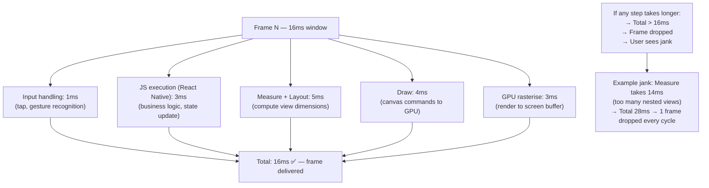
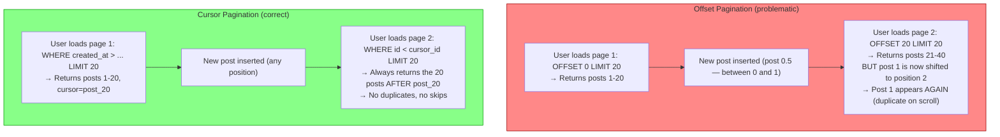
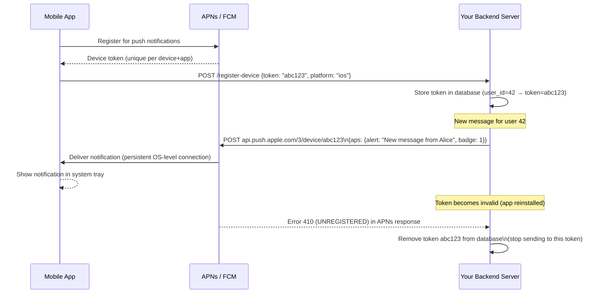
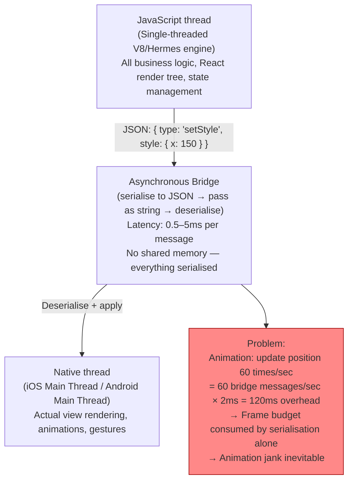
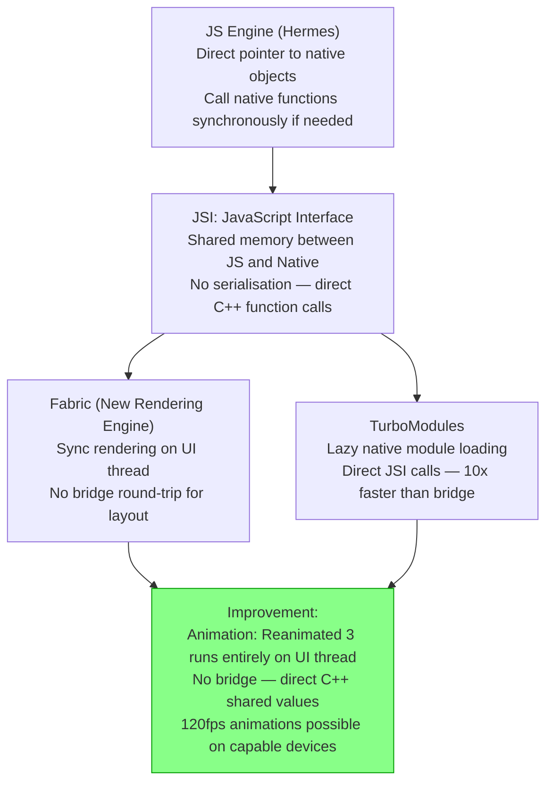
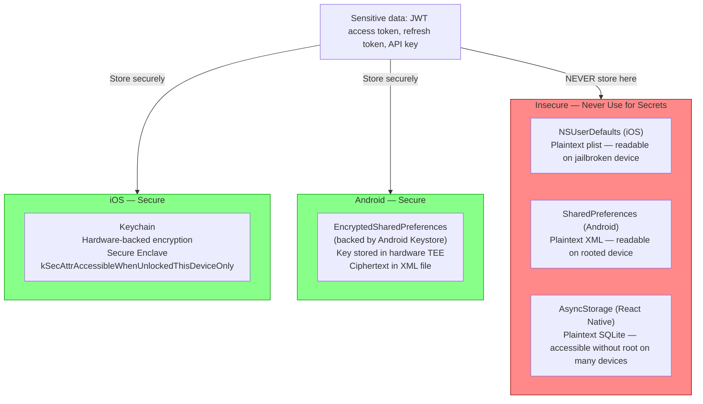
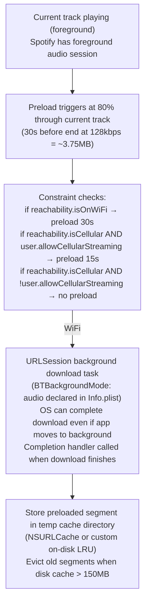
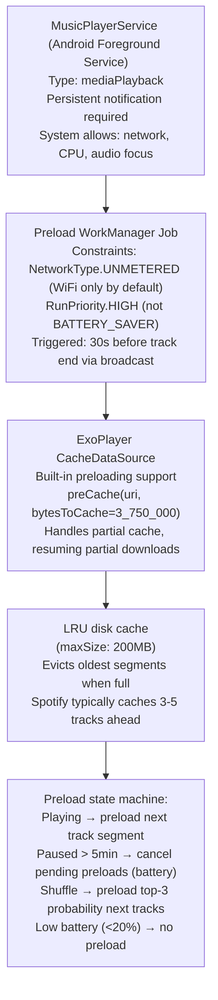

# Mobile App Architecture

6 questions covering mobile architecture from frame budgets to Spotify's background audio preloading strategy.

---

## Q1: What is the 16ms frame budget and what causes jank?

**Role:** Mid | **Difficulty:** 🟡 | **Priority:** P0 | **Format:** Quick Answer

> **What the interviewer is testing:** Whether you understand the 60fps rendering target and the main thread work that causes dropped frames.

### Answer in 60 seconds
- **16ms budget:** A 60fps display renders a new frame every 16.67ms. If the UI thread takes longer than 16ms to produce a frame, the frame is dropped — the display shows the previous frame again. Users perceive this as "jank" (stutter, lag).
- **The main thread:** All UI work runs on a single main thread (UI thread). This includes: measure, layout, draw, input event handling, and (in most mobile frameworks) JavaScript execution (React Native) or activity lifecycle callbacks (Android).
- **What causes jank:**
  - **Expensive measure/layout:** Complex view hierarchies require many measure + layout passes. A `RecyclerView` with deeply nested `ConstraintLayout` items can take 8ms per item — easily exceeding 16ms.
  - **Overdraw:** Rendering pixels multiple times (background behind a background behind a view). Each overdraw layer costs GPU time. More than 3× overdraw on complex screens is a warning sign.
  - **Main thread I/O:** Reading from a file or database on the main thread blocks the UI thread. Even 1ms of I/O can cause a dropped frame at peak.
  - **GC pauses:** Java/Kotlin Android apps experience GC pauses of 5–50ms. React Native's JavaScript engine has its own GC. GC during animation = dropped frames.
  - **Synchronous bitmaps decode:** Loading a bitmap synchronously on the main thread blocks for 10–100ms. Always load images off-thread (Glide, Picasso, Coil on Android; SDWebImage on iOS).
- **90fps and 120fps displays:** Modern devices (iPhone 15 Pro, Pixel 8 Pro) have 120Hz ProMotion/LTSPO displays. Frame budget: 8.3ms at 120fps. Jank thresholds are proportionally stricter.

### Diagram

### Pitfalls
- ❌ **Assuming 60fps is guaranteed on all devices:** Low-end Android devices with 1GB RAM and a slow CPU may budget only 33ms (30fps). Always profile on low-end devices, not just flagship hardware.
- ❌ **Main thread work disguised as "lightweight":** `SharedPreferences.getInt()` on Android reads from disk on the main thread by default. Even a "simple" preferences read can block for 2–5ms if storage is slow. Use `DataStore` (async).
- ❌ **Not using hardware acceleration:** Most Android drawing is hardware-accelerated (GPU) by default. Disabling it (`setLayerType(LAYER_TYPE_SOFTWARE)`) reverts to software rasterisation — 10× slower. Never disable hardware acceleration without profiling.

### Concept Reference
→ [Mobile Performance](../../../mobile/concepts/mobile-performance)

---

## Q2: Why does cursor-based pagination beat offset-based for infinite scroll at scale?

**Role:** Mid | **Difficulty:** 🟡 | **Priority:** P0 | **Format:** Quick Answer

> **What the interviewer is testing:** Whether you understand the performance and consistency problems with OFFSET-based pagination and the cursor alternative.

### Answer in 60 seconds
- **Offset-based pagination:** `SELECT * FROM posts ORDER BY created_at DESC LIMIT 20 OFFSET 1000`. Page 1 is offset 0, page 2 is offset 20, page N is offset N×20.
- **Problems with offset at scale:**
  - **Performance:** `OFFSET 1000` causes PostgreSQL to scan and discard 1000 rows before returning 20. At `OFFSET 100000`, the DB scans 100,020 rows to return 20 — latency grows linearly with offset.
  - **Consistency:** If a new post is inserted while the user is scrolling, all subsequent pages shift down by 1 — the user sees a duplicate item (the row that was on page N is now on page N-1).
- **Cursor-based pagination:** Use the last item's unique, ordered field (e.g., `created_at` + `id`) as a cursor. Next page query: `SELECT * FROM posts WHERE (created_at, id) < (cursor_created_at, cursor_id) ORDER BY created_at DESC, id DESC LIMIT 20`.
- **Why cursor is better:**
  - **Performance:** Index lookup at the cursor position — O(log N) regardless of how deep in the list. Page 1M is as fast as page 1.
  - **Consistency:** Cursor anchors to a specific position in the data — new inserts don't shift the cursor. No duplicates on scroll.
  - **Trade-off:** Cannot jump to arbitrary page (no "go to page 50"). Suitable for infinite scroll (sequential access); not suitable for "jump to page N."
- **Implementation:** Encode cursor as base64-encoded JSON: `{"created_at":"2026-01-01T10:00:00Z","id":12345}`. Pass as query parameter: `?cursor=base64string`.

### Diagram

### Pitfalls
- ❌ **Compound cursor without consistent ordering:** Cursor requires a stable total order. Using only `created_at` as cursor fails when two rows have the same timestamp (tie-breaking undefined). Always use `(created_at, id)` as a compound cursor where `id` is the tiebreaker.
- ❌ **Exposing raw database IDs in cursors:** `cursor=12345` reveals your database's sequential ID, information about record count, and allows enumeration. Encode cursors: `cursor=base64(json({created_at, id}))`. Or use opaque tokens.
- ❌ **Not indexing the cursor column:** `WHERE (created_at, id) < (X, Y)` requires a composite index on `(created_at DESC, id DESC)`. Without the index, cursor pagination degrades to a full table scan — slower than offset.

### Concept Reference
→ [Mobile Performance](../../../mobile/concepts/mobile-performance)

---

## Q3: How do APNs (iOS) and FCM (Android) deliver push notifications?

**Role:** Mid | **Difficulty:** 🟡 | **Priority:** P1 | **Format:** Quick Answer

> **What the interviewer is testing:** Whether you understand the two-tier push notification architecture and the flow from your server to the end user's device.

### Answer in 60 seconds
- **The two-tier model:** Your backend server does not connect directly to devices. It connects to Apple's APNs (Apple Push Notification service) or Google's FCM (Firebase Cloud Messaging), which maintain persistent connections to all registered devices.
- **iOS APNs flow:**
  1. App registers with APNs → receives a device token (unique per app+device, rotates periodically).
  2. App sends device token to your backend server.
  3. To send a push: your server sends an HTTP/2 request to `api.push.apple.com` with the device token + notification payload (JSON, max 4KB).
  4. APNs delivers to the device over a persistent TLS connection maintained by iOS.
  5. Device receives notification even if app is in background (iOS manages the APNs connection at OS level).
- **Android FCM flow:** Similar — app gets an FCM registration token, sends to your backend, backend sends notification to `fcm.googleapis.com` with token + payload.
- **Silent push (background fetch trigger):** APNs and FCM both support "silent" notifications (no visible notification) that wake the app in the background. Used to trigger data sync without user-visible alert. iOS: `content-available: 1`. Android: `data` payload without `notification`.
- **Token management:** Device tokens change on app reinstall, OS upgrade, and periodically for privacy. Always update your backend token on each app launch and handle APNs/FCM error codes that indicate invalid tokens (UNREGISTERED → delete from your database).

### Diagram

### Pitfalls
- ❌ **Sending individual push per user in a loop:** If you need to notify 1M users, a serial loop of 1M HTTP requests to APNs takes hours. Use batch notification APIs: FCM supports up to 500 tokens per batch request. For APNs, use HTTP/2 multiplexing — multiple concurrent streams on one connection.
- ❌ **Not handling APNs certificate expiry:** APNs authentication uses either a certificate (expires annually) or a token-based authentication with a private key (doesn't expire — preferred). Certificate expiry at 3 AM stops all iOS push notifications until renewed. Use token-based auth.
- ❌ **Sending notifications during Doze on Android:** FCM delivers notifications via a high-priority flag that wakes the device. Overusing high-priority (marking all notifications as high-priority to bypass Doze) violates Google Play policy and trains the OS to throttle your app's notifications.

### Concept Reference
→ [Mobile Architecture](../../../mobile/concepts/mobile-architecture)

---

## Q4: What are the performance bottlenecks in React Native's bridge architecture?

**Role:** Senior | **Difficulty:** 🔴 | **Priority:** P1 | **Format:** Deep Dive

> **What the interviewer is testing:** Whether you understand React Native's historical bridge bottleneck, the serialisation overhead, and the new JSI (JavaScript Interface) architecture that replaces it.

### Problem Constraints
| Dimension | Value |
|-----------|-------|
| Architecture | React Native (Legacy Bridge architecture) |
| Performance bottleneck | JavaScript ↔ Native bridge serialisation |
| Impact | Animations at <60fps, list scroll jank, gesture delay |
| New architecture | JSI (JavaScript Interface) — removes serialisation |

### Legacy Bridge Architecture (Bottleneck)

### JSI Architecture (New — React Native 0.68+)

| Dimension | Legacy Bridge | JSI (New Architecture) |
|-----------|--------------|----------------------|
| Communication | Async JSON serialisation | Synchronous C++ calls via shared memory |
| Latency | 0.5–5ms per message | <0.1ms (same-thread access) |
| Animation | Jank at 60fps (bridge overhead) | 120fps capable (Reanimated 3) |
| Module loading | All modules loaded at startup | Lazy (TurboModules) |
| Thread model | 3 threads (JS, Bridge, Native) | Concurrent rendering (Fabric) |

### Recommended Answer
React Native's legacy bridge is the primary performance bottleneck: all communication between JavaScript and native code is serialised to JSON, passed as a string across the bridge, and deserialised on the other side. At 60fps, an animation updating a single value (x position) requires 60 bridge messages per second, each adding 0.5–5ms of overhead — consuming the entire 16ms frame budget in serialisation alone.

**Workarounds (legacy):** `react-native-reanimated` v1/v2 moved animation logic into a separate worklet that runs on the UI thread — no bridge for the animation values themselves, only for configuration. `Animated` with `useNativeDriver: true` offloads specific animations to native directly.

**JSI (New Architecture):** React Native 0.68+ introduces JSI (JavaScript Interface) which gives the JS engine a direct pointer to native C++ objects. No serialisation — calling a native function is a direct C++ call with shared memory. Reanimated 3 uses JSI shared values to update animations at 120fps without any JS thread involvement during the animation.

**Startup time:** Legacy bridge loads all native modules at startup (100+ modules × registration overhead). TurboModules (JSI-based) loads modules lazily on first use — startup time reduced by 30–50%.

### What a great answer includes
- [ ] Bridge bottleneck: JSON serialisation latency (0.5–5ms per message)
- [ ] Animation impact: 60 messages/sec × bridge latency = frame budget exceeded
- [ ] `useNativeDriver: true` as legacy workaround
- [ ] JSI: shared memory, no serialisation, direct C++ function calls
- [ ] Reanimated 3 on JSI: 120fps animations with zero bridge involvement

### Pitfalls
- ❌ **"React Native is slow":** React Native's performance problem is specifically the legacy bridge. With JSI + Fabric + Reanimated 3, React Native can achieve near-native performance for most UI interactions. The statement "React Native is slow" is 2018-era advice.
- ❌ **Not knowing that JSI is production-ready:** JSI / New Architecture is stable and production-ready as of React Native 0.73 (2023). Recommending "just use Flutter/native" without knowing about JSI shows outdated knowledge.
- ❌ **Treating all React Native operations as bridge-constrained:** The JavaScript rendering and state logic runs at full JS engine speed. Only native API calls and view property updates go through the bridge. Heavy JSON processing or algorithm work is a JS thread problem, not a bridge problem.

### Concept Reference
→ [Mobile Performance](../../../mobile/concepts/mobile-performance)

---

## Q5: How do you securely store tokens — iOS Keychain vs Android Keystore vs SharedPreferences?

**Role:** Senior | **Difficulty:** 🔴 | **Priority:** P1 | **Format:** Quick Answer

> **What the interviewer is testing:** Whether you know the correct secure storage mechanism on each platform and why naïve approaches (AsyncStorage, SharedPreferences) are insecure.

### Answer in 60 seconds
- **iOS Keychain:** The only correct place for secrets (tokens, passwords, certificates) on iOS. Keychain items are encrypted at rest using the device's hardware Secure Enclave key. Protected by the device passcode. Can be configured with accessibility levels: `kSecAttrAccessibleWhenUnlockedThisDeviceOnly` (most secure — accessible only when device unlocked, not backed up to iCloud). Keychain items survive app reinstall (unlike React Native AsyncStorage or NSUserDefaults). Access via Security framework: `SecItemAdd`, `SecItemCopyMatching`.
- **Android Keystore:** Android equivalent of Keychain. Stores cryptographic keys backed by hardware (TEE or Secure Element on Android 6+). The key never leaves the Keystore — you use the key for crypto operations but cannot export the raw bytes. For storing tokens: encrypt the token with a Keystore key, store the ciphertext in EncryptedSharedPreferences. Android Jetpack: `EncryptedSharedPreferences` wraps Keystore transparently.
- **SharedPreferences (without encryption):** Stores data as plaintext XML files in the app's internal storage. On a rooted Android device, these files are readable. Never use for secrets. Use only for non-sensitive preferences (dark mode, language setting).
- **React Native:** No native Keychain/Keystore API. Use `react-native-keychain` library (wraps iOS Keychain + Android Keystore). Do NOT use `AsyncStorage` for tokens — it stores in plaintext SQLite.

### Diagram

### Pitfalls
- ❌ **Storing tokens in AsyncStorage in React Native:** A common mistake in tutorials. AsyncStorage is unencrypted SQLite — accessible via `adb shell` on a debuggable build or on rooted devices. Use `react-native-keychain` for all secrets.
- ❌ **iOS Keychain without proper accessibility flags:** `kSecAttrAccessibleAlways` means the token is accessible even when the device is locked and when backed up to iCloud. Use `kSecAttrAccessibleWhenUnlockedThisDeviceOnly` for auth tokens — accessible only when device is unlocked, never backed up.
- ❌ **Treating EncryptedSharedPreferences as equally secure on all Android devices:** Android Keystore hardware-backing requires API level 18+ (TEE) or 23+ (mandatory hardware). On devices without a hardware TEE, keys are stored in software — still better than plaintext, but not hardware-backed. Check `KeyInfo.isInsideSecureHardware()`.

### Concept Reference
→ [Mobile Security](../../../mobile/concepts/mobile-security)

---

## Q6: How does Spotify preload 30 seconds of audio while conserving battery?

**Role:** Staff | **Difficulty:** ⚫ | **Priority:** P2 | **Format:** Deep Dive

> **What the interviewer is testing:** Whether you understand how a media-intensive app balances aggressive prefetching with battery and data constraints on both iOS and Android.

### Problem Constraints
| Dimension | Value |
|-----------|-------|
| Goal | Preload next track's first 30 seconds before current track ends |
| Constraint | Do not drain battery on background preload |
| Constraint | Respect user's data limits (no large preload on cellular) |
| Constraint | iOS background execution limits (App Nap, background time budget) |
| Android | Foreground service required for background audio + work |

### iOS Preload Architecture

### Android Foreground Service Architecture

| Dimension | Aggressive preload | Conservative (Spotify's approach) |
|-----------|---------------------|----------------------------------|
| Preload trigger | Start at beginning of track | 30 seconds before end |
| WiFi | Full track | 30-second segment |
| Cellular | Full track | 15s or user-configurable |
| Low battery (<20%) | Continue | Stop preloading |
| Foreground/background | Background preload | Background via foreground service |
| Disk cache | Unbounded | 200MB LRU |

### Recommended Answer
Spotify's preloading strategy balances seamless playback (no buffering) with battery and data frugality through intelligent scheduling:

**Preload trigger:** Not at track start — at 80% through the current track (typically ~30 seconds before end). Earlier preloading wastes resources if the user skips; later risks buffering if the network is slow.

**iOS implementation:** `URLSession` with background configuration (`URLSessionConfiguration.background(withIdentifier:)`) allows the OS to complete the download even if the app moves to background. Spotify declares `audio` background mode in Info.plist (required for background audio). The background session persists across app kills.

**Android implementation:** ExoPlayer's built-in `CacheDataSourceFactory` with `SimpleCache` handles the prefetch. The `MediaSessionService` (foreground service) keeps the process alive during playback — preload work runs on this process's threads without triggering Doze restrictions. `WorkManager` is used for non-real-time prefetch (e.g., podcast episode downloads) but not for the next-track preload (requires lower latency than WorkManager provides).

**Network constraints:** Check WiFi vs cellular before preloading. WiFi: preload 30-second segment (~3.75MB at 128kbps). Cellular: respect user's "Download over Wi-Fi only" setting. Never preload if cellular unless explicitly allowed.

**Battery optimisation:** Cancel active preloads when battery < 20% (use `BatteryManager.getBatteryProperty(BATTERY_PROPERTY_REMAINING_ENERGY)`). Resume preloading when battery returns above 30% (hysteresis to prevent oscillation).

### What a great answer includes
- [ ] Trigger at 80% through current track (not start) — balance between preparedness and waste
- [ ] iOS: URLSession background download task (OS manages completion)
- [ ] Android: ExoPlayer CacheDataSource + foreground service (avoids Doze)
- [ ] Network constraint: WiFi full preload, cellular limited or disabled
- [ ] Battery constraint: stop preloading at <20%, resume at >30% (hysteresis)

### Pitfalls
- ❌ **Using WorkManager for next-track preload on Android:** WorkManager is designed for deferrable tasks. The OS may delay a WorkManager task by seconds or minutes. For "preload next track in the next 30 seconds," this is too unpredictable. Use direct async coroutines within the foreground service instead.
- ❌ **No disk cache eviction:** Preloading 3 tracks ahead at 128kbps = ~30MB. Over 24 hours of listening = 900MB. Without LRU eviction, the preload cache fills the device. Always set a maximum cache size and evict least-recently-accessed segments.
- ❌ **Preloading when Airplane Mode is on:** Attempting network requests in Airplane Mode fails and wastes battery retrying. Always check `ConnectivityManager.getActiveNetwork()` before initiating preload. Subscribe to network callbacks to resume preloading when connectivity is restored.

### Concept Reference
→ [Mobile Architecture](../../../mobile/concepts/mobile-architecture)
