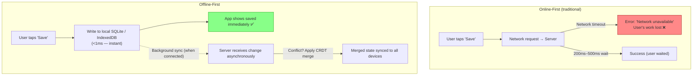
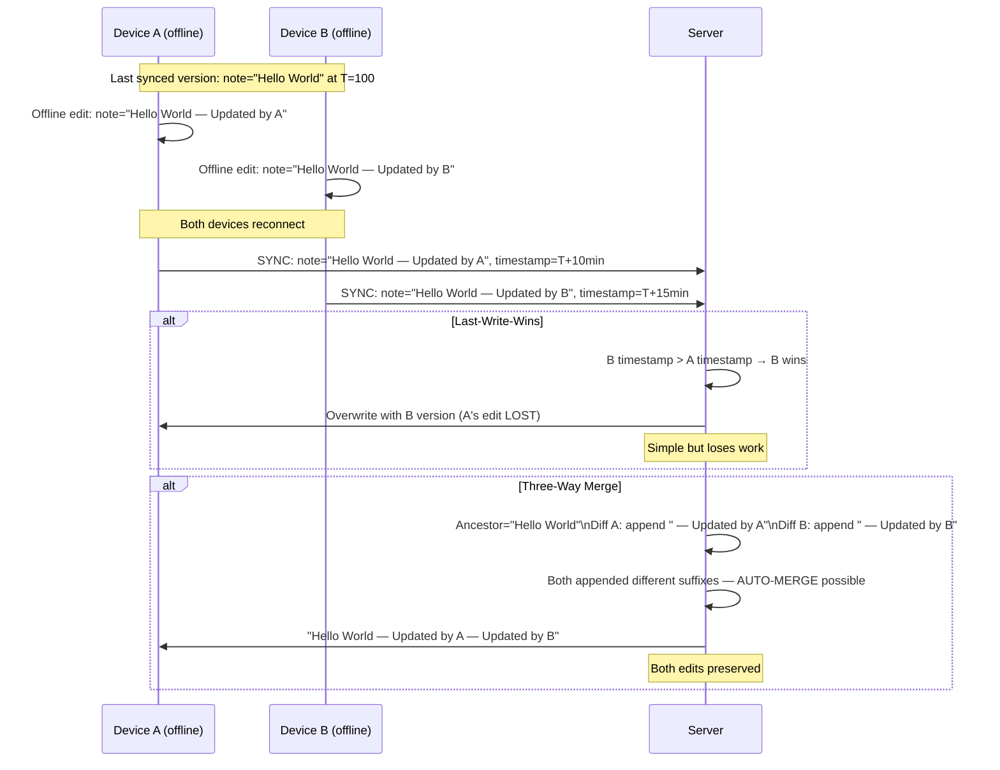
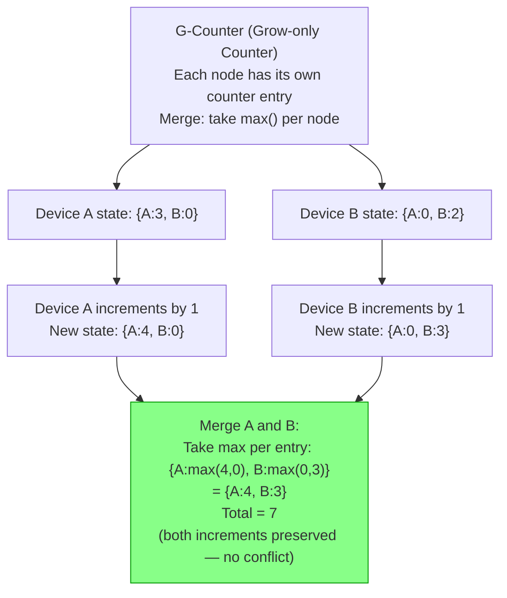
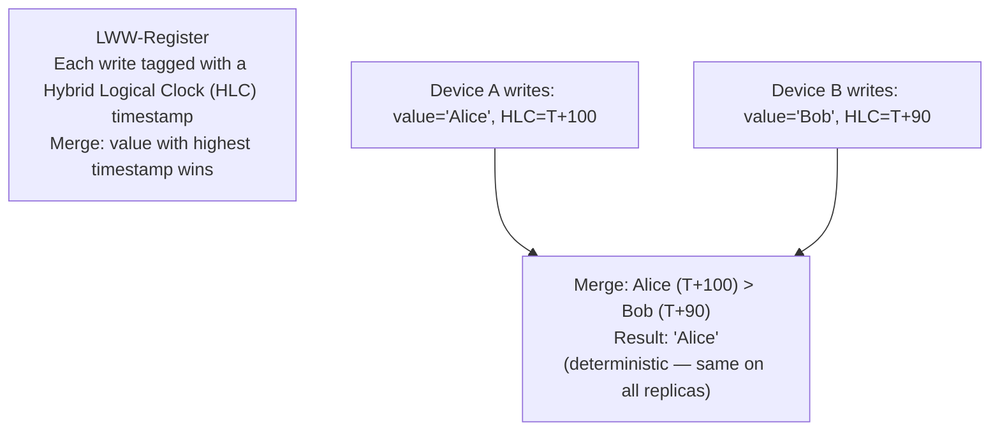
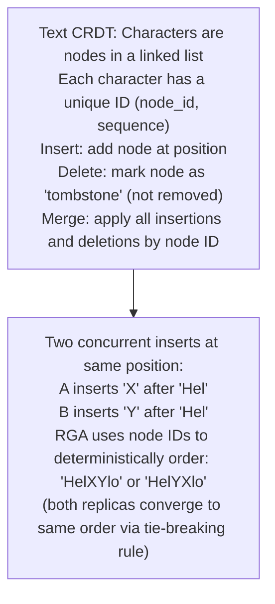
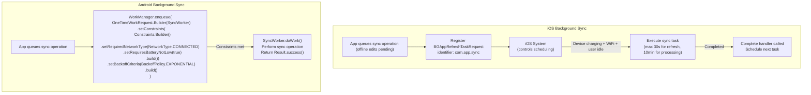
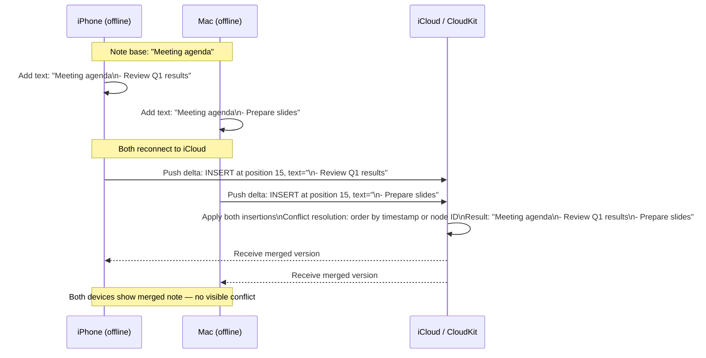
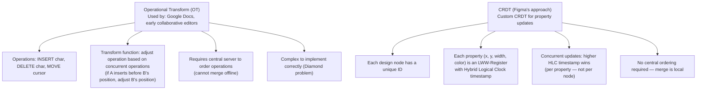
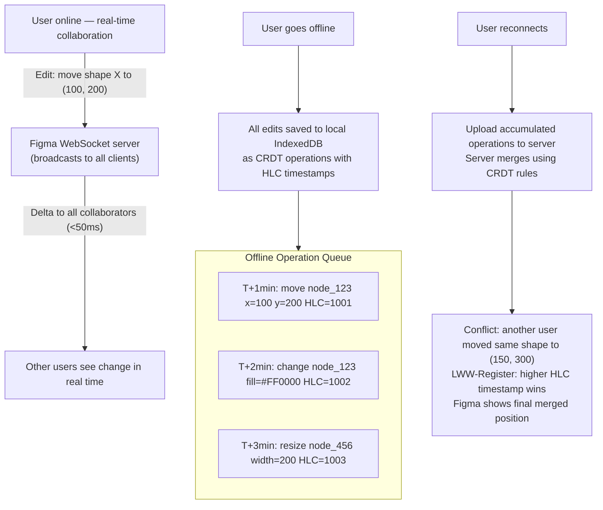

# Offline-First & Sync Patterns

6 questions covering offline-first architecture from fundamentals to Figma's multiplayer editing with offline support.

---

## Q1: What is offline-first architecture and why does it matter?

**Role:** Mid | **Difficulty:** 🟡 | **Priority:** P0 | **Format:** Quick Answer

> **What the interviewer is testing:** Whether you understand the user experience and reliability motivation behind offline-first and can articulate the design philosophy.

### Answer in 60 seconds
- **Offline-first definition:** Design the app to work fully without a network connection, treating the network as an enhancement rather than a requirement. Local storage is the source of truth; the server is synchronised in the background.
- **Why it matters — intermittent networks:**
  - Mobile users experience intermittent connectivity: tunnels, elevators, rural areas, congested networks.
  - Without offline-first: app shows spinner, fails to load, user data is lost on submit.
  - With offline-first: app continues working, changes are queued locally, sync happens automatically when connected.
- **Why it matters — fast UX:**
  - Reads from local store are <1ms. Reads requiring network are 50–500ms.
  - Offline-first apps feel instant — no waiting for network on every interaction.
  - Google Docs, Notion, GitHub Mobile, Figma all use offline-first for this reason.
- **Core pattern:** Local writes succeed immediately (optimistic). Sync job pushes changes to server in the background. Conflict resolution handles divergent edits.
- **When offline-first is NOT appropriate:** Real-time financial transactions (balances must be current), multi-user collaborative editing without conflict resolution, security-critical operations requiring server validation.

### Diagram

### Pitfalls
- ❌ **Offline-first without conflict resolution:** Two devices edit the same document offline — without conflict resolution, one edit silently overwrites the other. Offline-first requires a conflict resolution strategy (last-write-wins, merge, CRDTs).
- ❌ **Unbounded local sync queue:** If a user creates 10,000 items offline, syncing them all at once overwhelms the server and the device battery. Rate-limit sync: 100 operations per sync batch, exponential backoff between batches.
- ❌ **Not communicating sync status to users:** Users need to know "this is saved locally but not yet synced to the cloud." Show a sync indicator (cloud icon with pending count). Failing to communicate creates trust issues ("did my data save?").

### Concept Reference
→ [Mobile Architecture Patterns](../../../mobile/concepts/offline-first)

---

## Q2: How do you resolve conflicts when a user edits offline on two devices?

**Role:** Mid | **Difficulty:** 🟡 | **Priority:** P0 | **Format:** Quick Answer

> **What the interviewer is testing:** Whether you know the two primary conflict resolution strategies and their trade-offs for different data types.

### Answer in 60 seconds
- **The conflict scenario:** User edits a note on Device A while offline. Same note edited on Device B while offline. Both devices sync to the server. Server receives two versions of the same note — which wins?
- **Strategy 1 — Last-Write-Wins (LWW):** The version with the most recent timestamp wins. Simple to implement. Problem: one user's edit is silently discarded. If clocks are not synchronised between devices, the "latest" timestamp may be wrong. Acceptable for: shopping cart contents, profile photo, app settings — where one canonical value is needed.
- **Strategy 2 — Merge (Three-Way Merge):** Find the common ancestor (last synced version), compute the diff from ancestor to each device's version, apply both diffs to the ancestor. If diffs don't conflict (edit different fields), the merge is automatic. If they conflict (edit the same field to different values), present to the user for resolution. Acceptable for: text documents, structured data with multiple fields.
- **Strategy 3 — Operational Transform (OT) / CRDTs:** For real-time collaborative editing — see Q3.
- **Strategy 4 — Server authoritative:** Server is always right. Device edits are sent as proposals; server applies them in order. Simplest consistency but requires connectivity for every write — defeats offline-first.

### Diagram

### Pitfalls
- ❌ **LWW for collaborative documents:** A 30-minute editing session on Device A, overwritten silently by a 1-character edit on Device B 1 minute later (later timestamp), is unacceptable. LWW only works when one write semantically replaces the other (profile photo, setting value).
- ❌ **Not recording the base version:** Three-way merge requires knowing the common ancestor. Without recording the last-synced version, you only have two versions to compare — making accurate merge impossible (any difference looks like a conflict).
- ❌ **Requiring user resolution for every conflict:** If every offline sync requires the user to manually resolve conflicts, they will abandon the feature. Auto-merge what can be auto-merged (non-overlapping edits); only prompt for true conflicts (same field edited to different values).

### Concept Reference
→ [Mobile Architecture Patterns](../../../mobile/concepts/offline-first)

---

## Q3: What are CRDTs and how do they resolve conflicts without central authority?

**Role:** Senior | **Difficulty:** 🔴 | **Priority:** P1 | **Format:** Deep Dive

> **What the interviewer is testing:** Whether you understand the mathematical foundation of CRDTs and can describe concrete CRDT types for common offline-first use cases.

### Problem Constraints
| Dimension | Value |
|-----------|-------|
| Use case | Collaborative note app — multiple users, multiple devices |
| Conflict scenario | Two users concurrently increment a counter, edit the same text |
| Requirement | No central server needed for conflict resolution |
| Goal | All replicas converge to the same state when all operations are applied |

### Counter CRDT (G-Counter)

### LWW-Register (Last-Write-Wins)

### Text CRDT (RGA — Replicated Growable Array)

| CRDT Type | Use Case | Conflict Behaviour |
|-----------|----------|-------------------|
| G-Counter | Unidirectional counter (view count) | Both increments preserved via max() |
| PN-Counter | Bidirectional counter (likes, inventory) | Add and remove merged separately |
| LWW-Register | Single value (profile name, photo) | Higher timestamp wins (deterministic) |
| OR-Set | Set of items (tags, collaborators) | Add/remove tracked per unique ID |
| RGA / YATA | Text editing | Concurrent insertions ordered by ID |

### Recommended Answer
A CRDT (Conflict-free Replicated Data Type) is a data structure designed so that any two replicas can be merged without conflicts — the merge operation is always deterministic and results in the same state on all replicas, regardless of the order operations arrive.

**Mathematical properties:** Merge must be: (1) Commutative (A ∪ B = B ∪ A), (2) Associative ((A ∪ B) ∪ C = A ∪ (B ∪ C)), (3) Idempotent (A ∪ A = A). These properties ensure that applying operations in any order, any number of times, always converges to the same result.

**Why "no central authority":** With CRDTs, each device applies its operations locally and merges incoming operations using the CRDT merge function — no coordination with a server required. A device can be offline for weeks, accumulate many local changes, and merge with the server state deterministically when it reconnects.

**Production examples:** Redis (CRDT-based geo-replication in Redis Enterprise), Apple Notes (uses a form of CRDT for conflict-free sync), Riak (CRDT data types for distributed storage), Figma (custom CRDT for vector design data).

### What a great answer includes
- [ ] Three mathematical properties of CRDT merge: commutative, associative, idempotent
- [ ] G-Counter: max() merge preserves all increments from all replicas
- [ ] LWW-Register: hybrid logical clock (not wall clock) for tie-breaking
- [ ] RGA/YATA for text: unique character IDs enable deterministic ordering of concurrent inserts
- [ ] Why CRDTs don't need central authority: merge function is purely local

### Pitfalls
- ❌ **CRDTs for all data types:** CRDTs have overhead (tombstones for deleted items, clock vectors per operation). For simple last-write-wins use cases (profile photo), LWW-Register is sufficient. Use heavy CRDTs (RGA) only for collaborative editing scenarios.
- ❌ **Tombstone accumulation:** Deleted items in CRDTs become tombstones (marked deleted, not removed) to prevent resurrection on merge. Without periodic garbage collection (compaction), the CRDT state grows indefinitely. Design a GC pass for tombstones older than N days.
- ❌ **Wall clock timestamps in LWW-Register:** Wall clocks drift across devices and can go backward (NTP adjustment). Use Hybrid Logical Clocks (HLC = max(physical_clock, logical_clock+1)) which are monotonic and causally ordered.

### Concept Reference
→ [Mobile Architecture Patterns](../../../mobile/concepts/offline-first)

---

## Q4: How do you implement background sync respecting iOS App Nap and Android Doze?

**Role:** Senior | **Difficulty:** 🔴 | **Priority:** P1 | **Format:** Quick Answer

> **What the interviewer is testing:** Whether you know the battery-saving restrictions on both platforms that affect background sync and how to design compliant, reliable sync.

### Answer in 60 seconds
- **iOS App Nap:** When an iOS app is in the background, App Nap aggressively reduces its CPU and network access to save battery. Background network tasks are managed via `URLSession` background configuration — the OS completes them when convenient, not immediately. No background JS execution.
- **iOS Background Fetch:** `application(_:performFetchWithCompletionHandler:)` is called by the OS periodically (approximately every 15–30 minutes based on usage patterns). App must complete its work and call the completion handler within 30 seconds. Use this for periodic sync.
- **iOS BGTaskScheduler (iOS 13+):** `BGProcessingTask` for long-running background work (batch sync). `BGAppRefreshTask` for short refresh. System decides when to run tasks based on device usage patterns, battery, and network availability. Request scheduled tasks: `BGTaskScheduler.submit(BGAppRefreshTaskRequest(identifier: "com.app.sync"))`.
- **Android Doze mode:** When the device is idle and not charging, Doze restricts network access, wakelocks, and alarms. Sync jobs queued during Doze execute when the device exits Doze or during maintenance windows.
- **Android WorkManager:** The recommended API for deferrable background work. Supports `Constraints` (network type, battery level, device idle). Work persists across app restarts and device reboots. Use `NetworkType.CONNECTED` constraint: sync only when connected. Use exponential backoff policy for retry.

### Diagram

### Pitfalls
- ❌ **Using `Timer` or `setInterval` for background sync on iOS:** Background timers are suspended by App Nap. Use `BGTaskScheduler` — the OS manages execution based on device state.
- ❌ **Requiring immediate sync for offline operations:** Offline-first design must accept that sync may be delayed by minutes or hours on mobile (Doze, App Nap, no connectivity). Design the UX to show "pending sync" status rather than requiring immediate confirmation.
- ❌ **Not using network type constraint on Android:** Syncing large datasets over cellular without user consent drains data plans and battery. Always use `NetworkType.CONNECTED` minimum; consider `NetworkType.UNMETERED` for large binary sync (photos, videos).

### Concept Reference
→ [Mobile Architecture Patterns](../../../mobile/concepts/offline-first)

---

## Q5: How does Apple Notes sync across devices without visible conflicts?

**Role:** Senior | **Difficulty:** 🔴 | **Priority:** P1 | **Format:** Quick Answer

> **What the interviewer is testing:** Whether you can reason about a real-world offline-first app and infer the conflict resolution strategy from observable product behaviour.

### Answer in 60 seconds
- **Observable behaviour:** Edit a note on iPhone offline, edit the same note on Mac offline, reconnect — both edits appear merged in the note. Apple Notes does not show "conflict" dialogs (unlike Google Drive's "conflict copy" files).
- **Likely mechanism — CRDT-based text merging:** Apple Notes uses a form of operational sync (likely based on CRDTs or operational transforms) that merges text at the character level. Adding text in different parts of a note (you add to the top, your colleague adds to the bottom) merges cleanly.
- **Delta sync protocol:** Notes syncs deltas (changes since last sync), not full note content. Each edit is a timestamped operation (insert text at position P, delete text from P1 to P2). Operations applied to the base version converge to the same result regardless of order.
- **CloudKit as the sync backend:** Apple Notes uses CloudKit (Apple's sync framework) for cross-device sync. CloudKit provides delta sync, conflict resolution via server-side merge, and per-record change tokens. The sync is incremental — only changed fields are transmitted.
- **When conflicts occur (rarely):** If the conflict is irresolvable (both devices deleted the same note but one re-created it), Notes creates a copy — "Recovered Note" — similar to Dropbox's conflict copy. But character-level merge handles most cases without user intervention.

### Diagram

### Pitfalls
- ❌ **Assuming Apple Notes uses simple LWW:** LWW would overwrite one device's edits with the other's. Apple Notes clearly preserves concurrent edits — a character-level merge (CRDT or OT) is the only mechanism that achieves this.
- ❌ **Thinking offline-first sync is simple:** Apple spent years building CloudKit's conflict resolution. Do not underestimate the complexity when designing a sync system from scratch. For new apps, use battle-tested libraries: Automerge (CRDT), Yjs (CRDT), or a managed sync platform (Realm, Firestore).
- ❌ **Not testing offline sync with network simulation:** The most common offline sync bugs appear only under specific network conditions (partial sync, simultaneous sync from two devices). Use iOS Network Link Conditioner and Android's emulator network throttling to test edge cases.

### Concept Reference
→ [Mobile Architecture Patterns](../../../mobile/concepts/offline-first)

---

## Q6: How does Figma support multiplayer editing with offline capabilities?

**Role:** Staff | **Difficulty:** ⚫ | **Priority:** P2 | **Format:** Deep Dive

> **What the interviewer is testing:** Whether you understand the difference between OT and CRDT for real-time collaborative editing, and how Figma's specific design data model influences the conflict resolution strategy.

### Problem Constraints
| Dimension | Value |
|-----------|-------|
| Use case | Real-time multiplayer vector design tool |
| Simultaneous editors | Up to 1,000 on one file |
| Offline support | Users can edit locally; sync on reconnect |
| Data model | Hierarchical vector graphics (nodes with properties) |
| Conflict scenario | Two users move the same shape to different positions simultaneously |

### Operational Transform (OT) vs CRDT

### Figma Offline Sync Architecture

### Why Figma Chose CRDT over OT

| Dimension | OT | CRDT |
|-----------|-----|------|
| Server dependency | Required (to order operations) | None (merge is local) |
| Offline support | Difficult (must queue and transform on reconnect) | Natural (local merge function) |
| Implementation complexity | Very high (Diamond problem) | Medium |
| Convergence guarantee | Yes (with correct implementation) | Yes (by construction) |
| Figma's data model fit | Poor (OT designed for linear text) | Good (property-per-node maps to LWW-Register) |

### Recommended Answer
Figma uses a custom CRDT designed for hierarchical vector graphics data. Their engineering blog describes the approach: each design element (layer, group, shape) is a node with a unique UUID. Each property of a node (position, size, color, opacity) is tracked as an LWW-Register with a Hybrid Logical Clock (HLC) timestamp.

**Conflict resolution:** When two users modify the same property of the same node concurrently (one moves shape X to (100,200), another to (150,300)), the LWW-Register resolves by taking the higher HLC timestamp. This is deterministic — all clients converge to the same value without server coordination.

**Why not OT:** OT was designed for linear text where the position of an operation changes as other operations are applied. Figma's data model is property-based (key-value per node), not positional — LWW-Register CRDT maps naturally to "last write to this property wins."

**Real-time vs offline:** In real-time mode (WebSocket connected), Figma broadcasts operations immediately — clients see updates within 50ms. In offline mode, operations are queued in IndexedDB. On reconnect, the queued operations are uploaded and merged using the same CRDT function. Offline users joining a session receive a full state snapshot, then incremental operations.

**1,000 simultaneous editors:** Each editor sends operations to the server; the server broadcasts to all connected clients. The CRDT merge is applied locally by each client. No central lock or transform needed — the CRDT's commutativity ensures all clients converge.

### What a great answer includes
- [ ] Figma uses CRDT (not OT) because property-based model fits LWW-Register
- [ ] Each node property is an LWW-Register with Hybrid Logical Clock
- [ ] CRDT allows offline editing without central ordering (OT requires server)
- [ ] Real-time: WebSocket broadcast (<50ms). Offline: queue in IndexedDB + merge on reconnect
- [ ] Conflict resolution: higher HLC timestamp wins per property (deterministic, all clients converge)

### Pitfalls
- ❌ **Assuming OT is better for collaborative editing:** OT was the original approach (Google Docs) and remains valid for linear text. For property-based data models (design tools, spreadsheets), CRDTs are simpler to implement correctly and support offline naturally.
- ❌ **LWW-Register with wall clock for collaborative tools:** Two users on different continents may have 100ms+ clock skew. Wall clock LWW silently drops the write with the smaller timestamp even if it was causally later. Always use HLC (Hybrid Logical Clocks) which are monotonic and causally consistent.
- ❌ **Not considering undo with CRDTs:** Undo in a CRDT environment is complex — you cannot simply reverse the last operation if concurrent operations have been applied since. Figma handles this with a separate undo stack per user session, not a global undo.

### Concept Reference
→ [Mobile Architecture Patterns](../../../mobile/concepts/offline-first)
