# Offline-First Sync

6 questions covering offline-first architecture from fundamentals to Figma's multiplayer editing with offline support.

---

## Q1: What is offline-first architecture and why does it matter for mobile?

**Role:** Mid | **Difficulty:** 🟡 | **Priority:** P0 | **Format:** Quick Answer

> **What the interviewer is testing:** Whether you understand why mobile apps must treat the network as unreliable and can articulate the user experience and technical benefits of offline-first design.

### Answer in 60 seconds
- **Offline-first:** Design the app to work fully without a network connection, syncing to the server whenever connectivity is available. The local device database is the source of truth for reads; syncs happen in the background.
- **Why mobile networks are unreliable:** Subway tunnels (zero signal), elevator dead zones, conference halls with 500 people on WiFi, international roaming gaps, rural areas. Mobile networks have intermittent connectivity — not "always on" like server-to-server communication.
- **Performance benefit (perceived):** An offline-first app reads from the local database — response time is < 10ms regardless of network quality. A network-first app waits for server round-trip — 100–5000ms depending on signal. Users perceive offline-first apps as 10–50x faster.
- **User experience:** User fills out a form in the subway. Offline-first: form submits instantly to local DB, syncs when back online. Network-first: form submission fails with error, user loses their work.
- **The trade-off:** Offline-first introduces conflict resolution complexity — what if two devices modify the same record while both are offline?

### Diagram

```mermaid
graph TD
  subgraph NetworkFirst["Network-First App (bad mobile experience)"]
    NF1["User taps Save"]
    NF2["App sends HTTP POST to server"]
    NF3["Server returns response (100-5000ms)"]
    NF4["App shows result"]
    NF5["If no network: Error dialog — data lost"]
    NF1 --> NF2 --> NF3 --> NF4
    NF2 -->|"No network"| NF5
  end

  subgraph OfflineFirst["Offline-First App (resilient)"]
    OF1["User taps Save"]
    OF2["App writes to local SQLite/Realm DB (< 10ms)"]
    OF3["UI updates immediately — user sees success"]
    OF4["Background sync job detects connectivity"]
    OF5["Sync: push local changes to server"]
    OF6["Receive server changes, merge into local DB"]
    OF1 --> OF2 --> OF3
    OF3 -.->|"Async — when network available"| OF4 --> OF5 --> OF6
  end

  style NF5 fill:#f88,stroke:#900
  style OF3 fill:#8f8,stroke:#090
```

### Pitfalls
- ❌ **"Just show a loading spinner":** A mobile user on a slow 3G connection waiting 5 seconds for a spinner is a failed UX. Offline-first eliminates the spinner entirely for reads and local operations.
- ❌ **Not handling sync conflicts:** Offline-first apps that do not implement conflict resolution will silently lose user data when two devices modify the same record. Conflict resolution is mandatory, not optional.
- ❌ **Syncing entire dataset on reconnect:** A user offline for 3 days syncing 3 days of server changes is a 10MB+ download on reconnect — destroys battery and data plan. Use incremental sync (only changes since last sync timestamp).

### Concept Reference

---

## Q2: Conflict resolution strategies — last-write-wins, merge, user-prompt — when to use each?

**Role:** Mid | **Difficulty:** 🟡 | **Priority:** P0 | **Format:** Quick Answer

> **What the interviewer is testing:** Whether you understand the three conflict resolution strategies and can match each to an appropriate use case.

### Answer in 60 seconds
- **Conflict scenario:** Device A and device B both have the same record (e.g., a note). Both go offline, both edit the same record, both sync to the server. The server receives two divergent versions — which wins?
- **Last-Write-Wins (LWW):** The update with the most recent timestamp wins. Simple to implement. Data loss for the "losing" device.
  - Use when: Data can be lost without consequence (analytics events, location updates, ephemeral data). Or when the domain has natural LWW semantics (e.g., "current location" — newer location is always correct).
  - Failure: User edits a note on phone at T=100, edits on laptop at T=101. Laptop edit wins. Phone edit silently lost.
- **Three-Way Merge:** Compare device A's version, device B's version, and the common ancestor. Merge non-conflicting changes. Flag conflicts where the same field changed differently.
  - Use when: Structured data with multiple independent fields (contacts: device A changes phone number, device B changes email — both changes valid, no conflict).
  - Failure: Both devices change the same field — still need LWW or user-prompt to resolve.
- **User-Prompt:** Show both versions to the user and ask them to pick or merge manually.
  - Use when: High-value content where silent data loss is unacceptable (legal documents, medical records, financial entries).
  - Failure: User ignores the prompt; conflict lingers indefinitely.

### Diagram

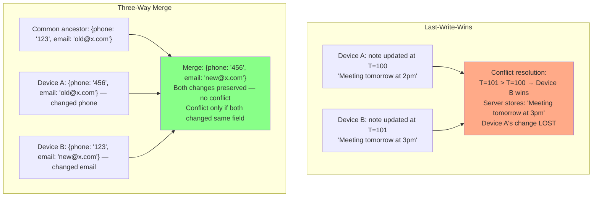

| Strategy | Data Loss | User Friction | Use Case |
|----------|-----------|---------------|----------|
| Last-Write-Wins | Yes (losing version lost) | None | Location, telemetry, ephemeral state |
| Three-Way Merge | No (for non-conflicting fields) | None (auto-merged) | Contacts, settings, profiles |
| User-Prompt | No (user decides) | High | Legal docs, financial records |
| CRDT | No (mathematically guaranteed) | None | Collaborative text, counters, sets |

### Pitfalls
- ❌ **LWW with unreliable clocks:** Mobile device clocks can be wrong (user changes timezone, NTP not synced, manual clock). LWW with wall clock timestamps can produce wrong results — device with wrong clock systematically loses. Use logical clocks (Lamport timestamps) or server-assigned sequence numbers instead.
- ❌ **User-prompt for all conflicts:** Showing conflict dialogs for every sync conflict is overwhelming. Users dismiss them without reading. Reserve user-prompt for high-value user-created content only.
- ❌ **Three-way merge without tracking the common ancestor:** Without the common ancestor version, you cannot distinguish "device A changed this field" from "device A kept it the same." Always store the ancestor version at the time of the last sync.

### Concept Reference

---

## Q3: CRDTs — G-Counter, LWW-Register, OR-Set — how they resolve conflicts without a coordinator?

**Role:** Senior | **Difficulty:** 🔴 | **Priority:** P1 | **Format:** Deep Dive

> **What the interviewer is testing:** Whether you understand the mathematical properties of CRDTs that make them conflict-free and can name specific CRDT types with their semantics.

### Problem Constraints
| Dimension | Value |
|-----------|-------|
| Use case | Collaborative app — multiple devices can edit concurrently offline |
| Requirement | No conflicts, no coordinator, eventually consistent |
| CRDT guarantee | If all updates are applied (in any order), all replicas converge to same state |

### What Makes a CRDT

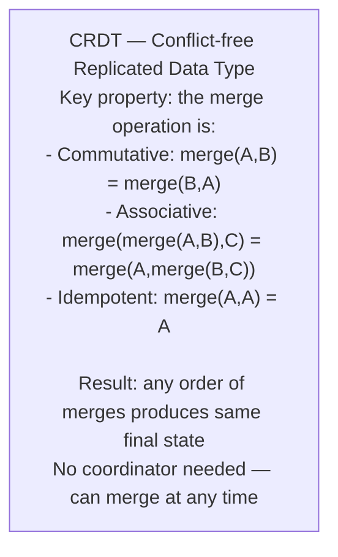

### G-Counter (Grow-only Counter)

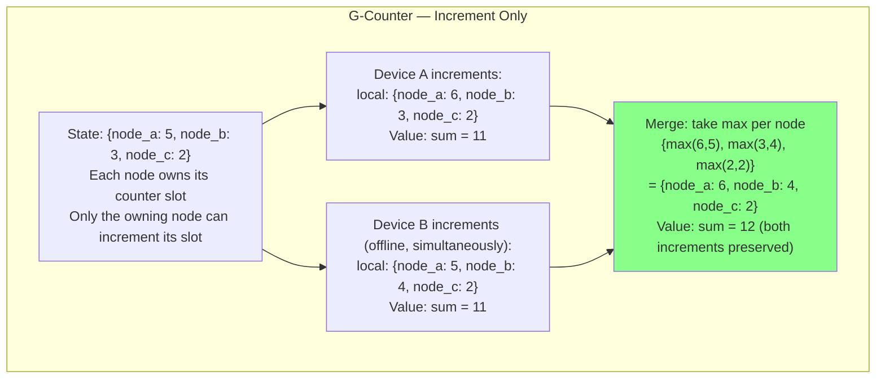

**Use case:** Like counts, view counts, download counts, cart item quantity.

### LWW-Register (Last-Write-Wins Register)

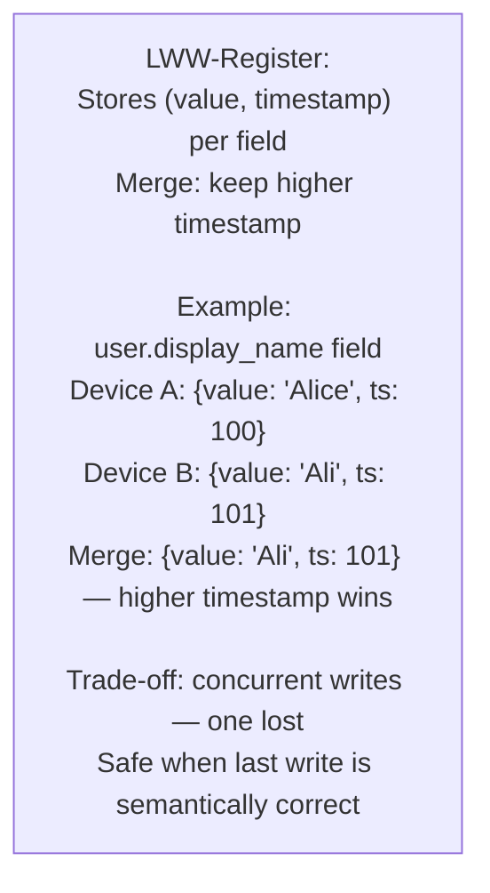

**Use case:** Profile settings, preferences, last-seen timestamp.

### OR-Set (Observed-Remove Set)

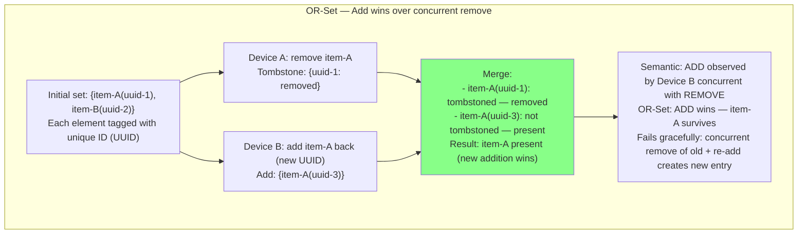

**Use case:** Shopping cart (add/remove items), todo list, collaborative tag sets.

| CRDT Type | Supports | Cannot | Use Case |
|-----------|----------|--------|----------|
| G-Counter | Increment | Decrement | View counts, like counts |
| PN-Counter | Increment + Decrement | N/A | Inventory quantity |
| LWW-Register | Any value | Preserve concurrent writes | Profile fields, settings |
| OR-Set | Add + Remove | N/A | Cart items, tag sets |
| Sequence CRDT | Text insert + delete | N/A | Collaborative text editing |

### What a great answer includes
- [ ] CRDT merge is commutative, associative, idempotent — any order, same result
- [ ] G-Counter: per-node slots, merge takes max, sum gives total
- [ ] LWW-Register: (value, timestamp) pair, merge keeps highest timestamp
- [ ] OR-Set: elements tagged with UUIDs, tombstones track removes, add-wins on concurrent ops
- [ ] No coordinator needed: any two replicas can merge without a central server

### Pitfalls
- ❌ **Using CRDT for arbitrary structured data:** CRDTs are designed for specific data types (counters, sets, registers). You cannot make an arbitrary JSON document a CRDT. Design your data model around CRDT-compatible types where conflict-free sync is needed.
- ❌ **LWW-Register with wall clocks on mobile:** Mobile device clocks are unreliable. LWW with unreliable timestamps = unpredictable merge behavior. Use logical clocks (Lamport, vector clocks) or hybrid logical clocks (HLC) which combine wall clock time with logical increments.
- ❌ **OR-Set tombstone accumulation:** Every deleted element creates a tombstone. If a set has 1M additions and 990K deletions, the OR-Set stores 1M tombstones forever (they cannot be garbage collected without coordination). Use OR-Set for small sets only (< 1000 elements).

### Concept Reference

---

## Q4: Background sync respecting iOS App Nap and Android Doze — work constraints and exponential backoff

**Role:** Senior | **Difficulty:** 🔴 | **Priority:** P1 | **Format:** Deep Dive

> **What the interviewer is testing:** Whether you understand the platform-specific battery conservation restrictions and how to design sync that works within those constraints.

### Problem Constraints
| Dimension | Value |
|-----------|-------|
| Requirement | Sync offline changes to server within 15 minutes of connectivity being restored |
| Constraint | App cannot drain battery with constant background polling |
| iOS restriction | App Nap throttles background apps; BGTaskScheduler for deferred background tasks |
| Android restriction | Doze mode blocks network access; WorkManager for constraint-based deferred work |

### iOS Background Sync

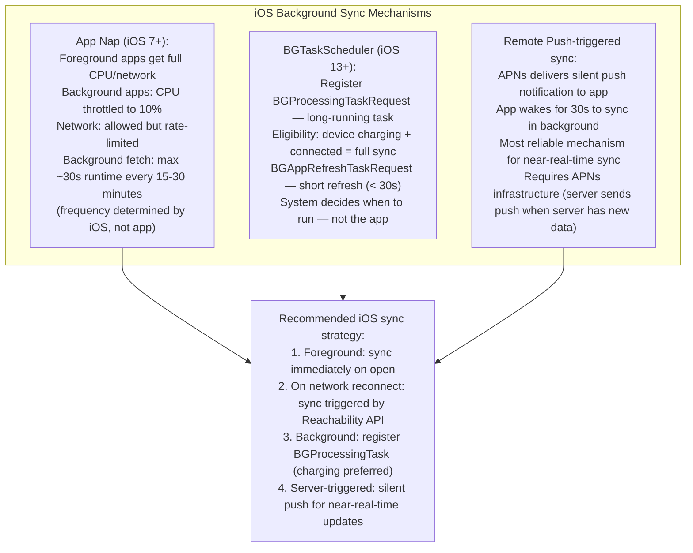

### Android Doze and WorkManager

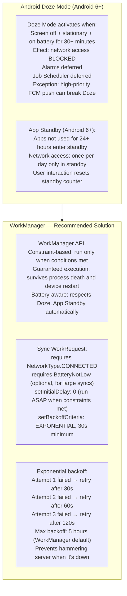

### Exponential Backoff Design

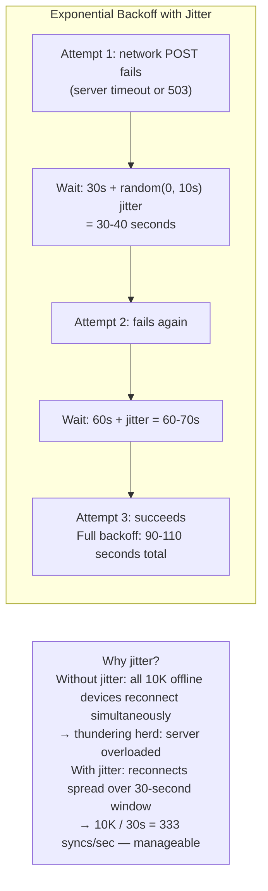

### What a great answer includes
- [ ] iOS: BGTaskScheduler (iOS 13+) for deferred background tasks; silent push for near-real-time
- [ ] Android: WorkManager with network constraint; respects Doze automatically
- [ ] Exponential backoff: 30s → 60s → 120s, prevents retry storms on server
- [ ] Jitter: add random delay to backoff to prevent synchronized reconnects from multiple devices
- [ ] Constraint-based: only sync on network connected; optionally only when not on low battery

### Pitfalls
- ❌ **Using repeating timers for background sync on iOS:** `DispatchSourceTimer` in background is throttled by App Nap and eventually killed. Use BGTaskScheduler which handles system-level scheduling correctly.
- ❌ **Polling without backoff:** An app that retries failed syncs every 5 seconds during a server outage will exhaust the error budget of the server just from retry traffic. Always use exponential backoff.
- ❌ **Not handling the case where WorkManager constraints are never met:** User is on airplane mode for 3 days. WorkManager queues the sync but never runs. The queue must have a maximum depth (e.g., 1000 pending sync operations) — beyond that, fail the oldest unsynced changes and inform the user.

### Concept Reference

---

## Q5: Apple Notes cross-device sync — conflict resolution, change log, merge algorithm

**Role:** Senior | **Difficulty:** 🔴 | **Priority:** P1 | **Format:** Quick Answer

> **What the interviewer is testing:** Whether you can analyze a real-world offline-first sync implementation and understand the specific choices Apple made for rich text document sync.

### Answer in 60 seconds
- **Apple Notes sync challenge:** Notes are rich text documents (not just key-value fields). Multiple devices can edit the same note while offline. Rich text has structure: paragraphs, formatting, attachments. Conflict resolution must preserve meaning.
- **Change log approach:** Rather than storing full document snapshots, Apple Notes stores a log of operations (inserts, deletes, format changes). On sync, exchange operation logs, replay operations in order.
- **Operational Transforms (OT):** Apple's suspected approach for Notes. When two edits conflict, transform one edit relative to the other. Example: device A inserts "Hello " at position 0; device B inserts "World" at position 0. Transform device B's operation relative to device A's: device B inserts "World" at position 6. Result: "Hello World" — both edits preserved.
- **Anchor-based sync:** iCloud sync uses "anchors" — checkpoints in the change log. On reconnect, devices exchange changes since the last common anchor. Reduces sync payload to only the delta.
- **Conflict fallback:** When OT cannot cleanly merge (e.g., one device deleted a paragraph, another edited it), Apple Notes creates two versions: "iPhone" and "MacBook" copy. User sees a merge conflict in the Notes UI.

### Diagram

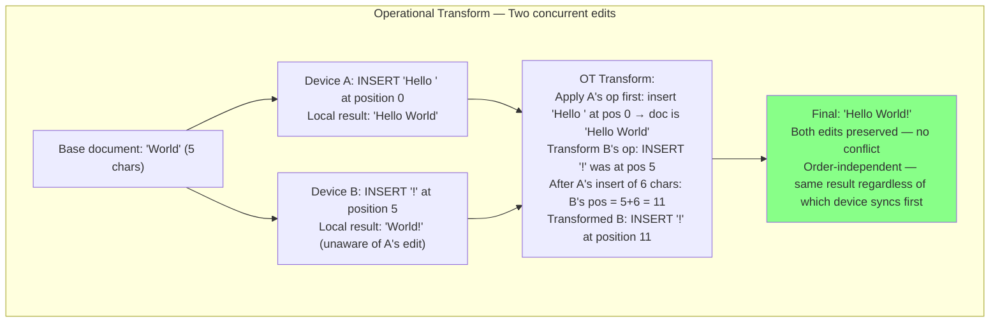

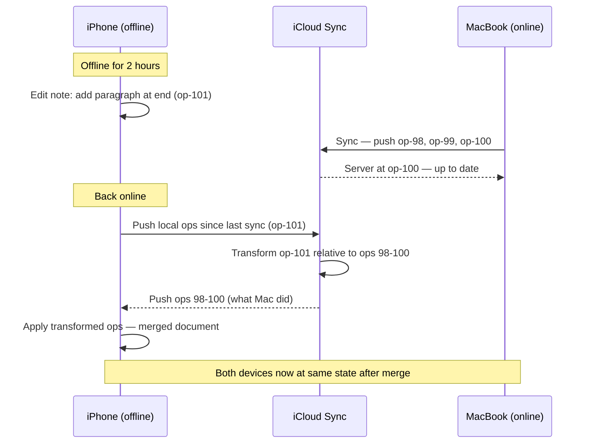

### Pitfalls
- ❌ **Snapshot-based sync for text documents:** Sending full document on every sync is too expensive for large notes. Delta-based sync (change log) is essential for rich text documents.
- ❌ **OT for concurrent structural changes:** OT works well for text inserts/deletes. For structural changes (move paragraph, change heading level), OT becomes extremely complex. CRDTs (specifically sequence CRDTs) are simpler for tree-structured documents.
- ❌ **No conflict fallback:** When OT cannot produce a clean merge, the app must create two versions and surface them to the user. Silently picking one version loses the user's work without notice.

### Concept Reference

---

## Q6: Figma multiplayer editing with offline support — OT vs CRDT for real-time collaboration

**Role:** Staff | **Difficulty:** ⚫ | **Priority:** P2 | **Format:** Deep Dive

> **What the interviewer is testing:** Whether you understand the distinction between OT and CRDT for real-time collaborative editing and how Figma handles the offline case in a design tool.

### Problem Constraints
| Dimension | Value |
|-----------|-------|
| Scale | Figma: 4M+ users, multiple editors on same document simultaneously |
| Document model | Canvas: objects with position (x,y), size, z-index, text, style properties |
| Real-time latency requirement | < 100ms for other users to see your cursor and edits |
| Offline requirement | Editor works fully offline; syncs on reconnect |

### Operational Transform vs CRDT

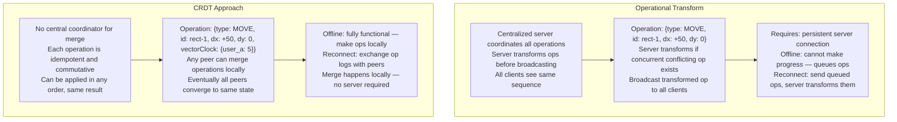

### Figma's Architecture

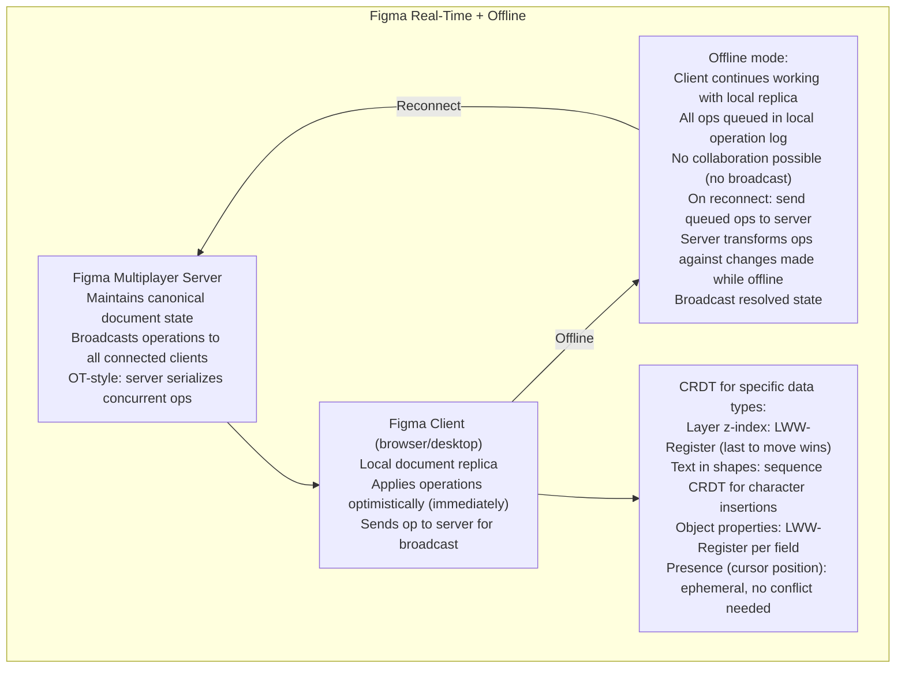

### Conflict Example: Two Users Move Same Object

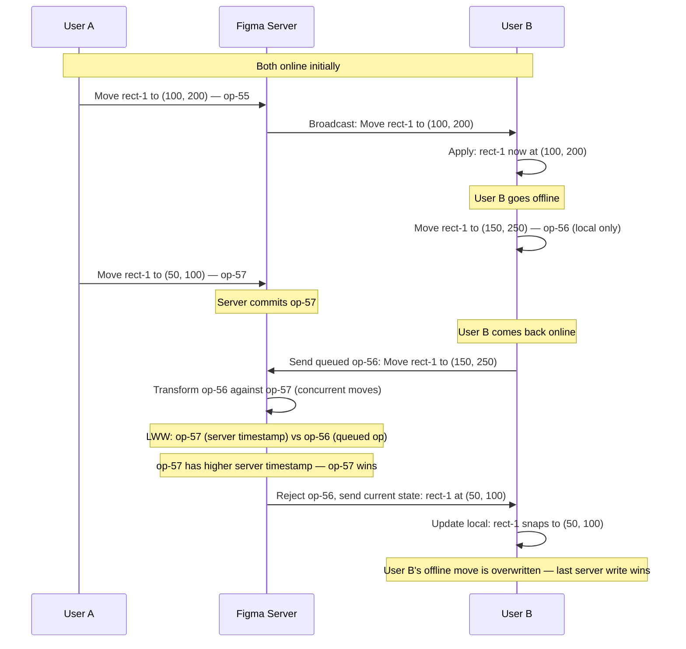

| Dimension | OT (Figma's primary) | CRDT (Figma's secondary) |
|-----------|---------------------|--------------------------|
| Concurrency model | Server serializes all ops | Peers merge independently |
| Offline support | Queue ops, transform on reconnect | Full offline, merge on reconnect |
| Complexity | High (transform functions per op type) | High (CRDT data structure design) |
| Conflict resolution | Server authority — LWW or semantic merge | Mathematical convergence — no conflict |
| Use in Figma | Document structure, object positions | Text content, z-index ordering |

### What a great answer includes
- [ ] OT requires server for coordination; CRDT allows peer-to-peer merge
- [ ] Figma offline: queue operations locally, transform on reconnect (OT approach)
- [ ] LWW for position: when two users move the same object, later server timestamp wins
- [ ] Sequence CRDT for text inside shapes: character-level concurrent edits without conflict
- [ ] State the trade-off: OT simpler for structured objects; CRDT simpler for text/set operations

### Pitfalls
- ❌ **Assuming OT and CRDT are interchangeable:** OT requires all operations to flow through a central server for transformation. CRDT works without a server. For offline-first, CRDTs are fundamentally better. Figma uses OT for its primary sync because it has always-on server infrastructure.
- ❌ **Not handling the offline reconnect surge:** If 1000 Figma users all work offline on the same document and reconnect simultaneously, the server receives 1000 queued op logs concurrently. Server must process these sequentially (to maintain causal order) — can take minutes for complex documents.
- ❌ **Using LWW for text content:** LWW on a text field loses concurrent edits. If user A types "Hello" and user B types "World" simultaneously offline, LWW keeps one and discards the other. Use sequence CRDT for text where preserving all concurrent edits is correct behavior.

### Concept Reference
