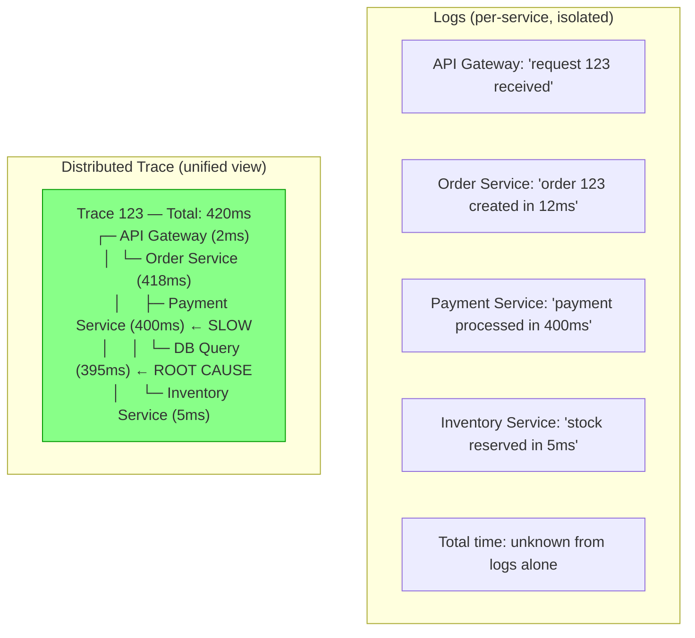
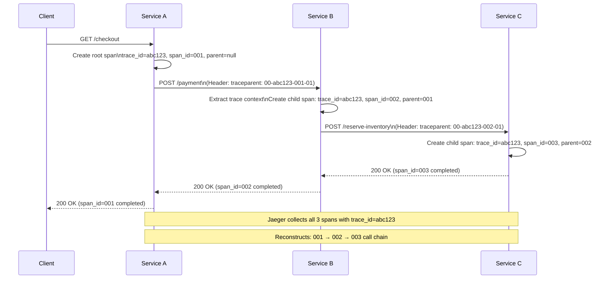
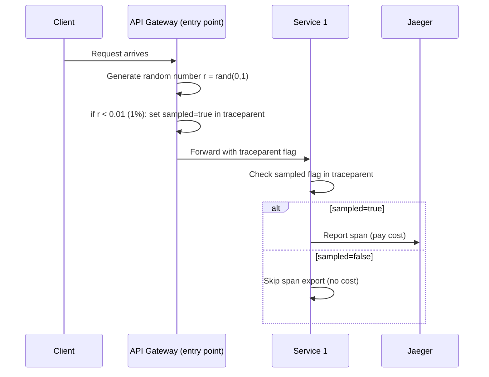
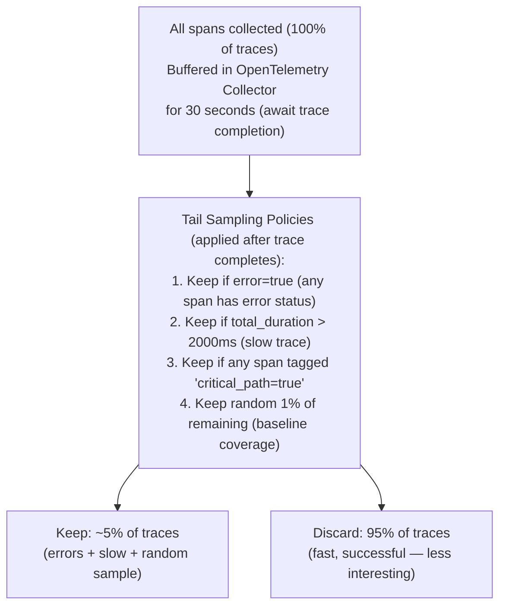
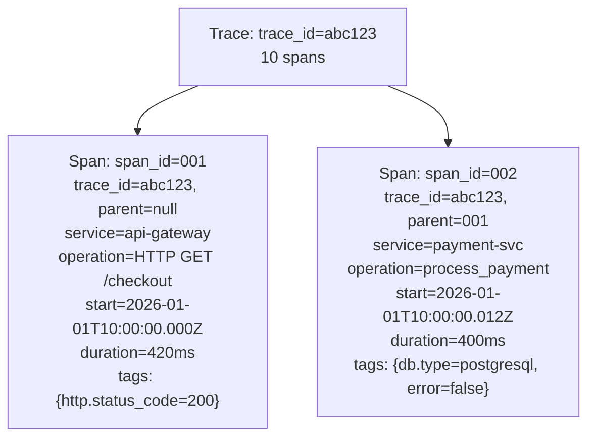
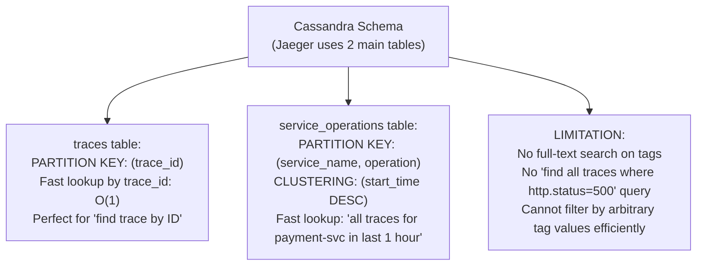
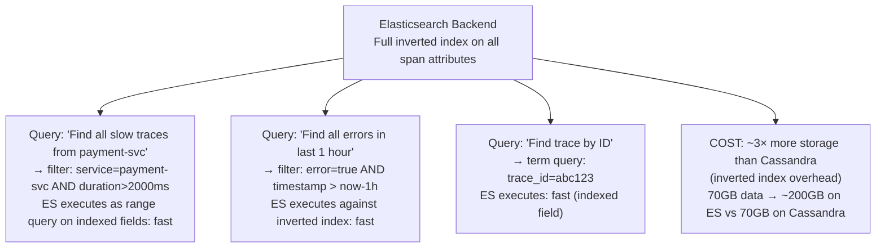
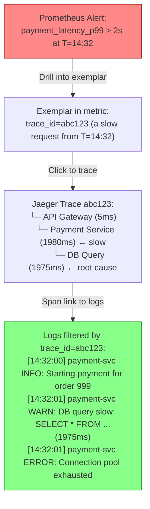
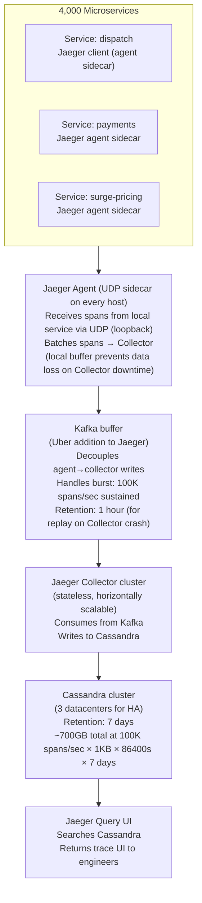
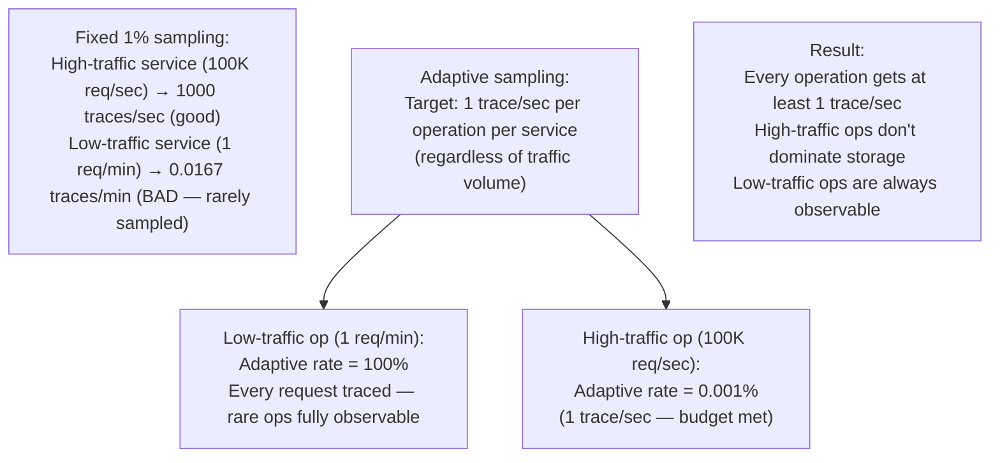

# Distributed Tracing

6 questions covering distributed tracing from fundamentals to Uber Jaeger at 10K traces/sec across 4,000 microservices.

---

## Q1: What does distributed tracing tell you that logs cannot?

**Role:** Mid | **Difficulty:** 🟡 | **Priority:** P0 | **Format:** Quick Answer

> **What the interviewer is testing:** Whether you can articulate the specific observability gap that tracing fills — causality and latency breakdown — that logs alone cannot provide.

### Answer in 60 seconds
- **Logs:** Record what happened at a single service at a single point in time. A log entry says "payment service processed order 123 in 45ms". Logs are isolated — no connection to what called the payment service or what it called next.
- **Distributed tracing:** Records the complete journey of a request across all services. Shows which service called which, in what order, with what latency at each hop. Provides:
  - **Causality:** Service A called B called C called D — the causal chain is explicit.
  - **Latency breakdown:** Of the total 500ms request time, 400ms was spent in the DB query inside service C. Without tracing, you know the end-to-end time but not which hop caused it.
  - **Parallel call analysis:** Service A called B and C in parallel. B took 200ms, C took 300ms. Total: 300ms (constrained by C). Logs show both 200ms and 300ms; only tracing reveals C was the bottleneck.
- **What logs cannot do:**
  - Correlate a slow user request to the specific DB query on a specific replica.
  - Identify which microservice in a 20-service call chain introduced the latency.
  - Show that a retry in service B caused the total latency to exceed SLA.
- **Together:** Logs + metrics + traces = unified observability. Traces navigate to the slow span; logs on that span give the specific error message; metrics show the pattern over time.

### Diagram

### Pitfalls
- ❌ **"Logs are sufficient for distributed systems":** With 20 microservices handling a request, finding which log entry corresponds to which service call requires manual correlation of request IDs — if every service even logs the correlation ID. Tracing does this automatically.
- ❌ **Thinking tracing replaces logs:** Traces show where time was spent but not *why*. The error message is in the logs. Traces and logs are complementary — use trace_id to link them.
- ❌ **Confusing tracing with profiling:** Tracing records inter-service latency at the request level. Profiling records function-level CPU time within a single process. Both are useful; neither replaces the other.

### Concept Reference
→ [Observability Patterns](../../../09-observability/concepts/observability-fundamentals)

---

## Q2: What are trace, span, and trace context — and how does W3C Trace Context propagation work?

**Role:** Mid | **Difficulty:** 🟡 | **Priority:** P0 | **Format:** Quick Answer

> **What the interviewer is testing:** Whether you understand the data model of distributed tracing and how trace context is passed between services.

### Answer in 60 seconds
- **Trace:** A complete record of a single request's journey through all services. Identified by a globally unique `trace_id` (128-bit, e.g., UUID). One trace = one user request.
- **Span:** A single unit of work within a trace. A span has: trace_id (links to parent trace), span_id (unique within trace), parent_span_id (null for root span), start_time, duration, service_name, operation_name, and key-value tags/attributes.
- **Trace context:** The propagated header that tells downstream services "you are part of trace X, your parent span is Y." Without this, each service starts a new, disconnected trace.
- **W3C Trace Context standard (RFC):** Two headers:
  - `traceparent: 00-{trace_id}-{parent_span_id}-{flags}` — e.g., `traceparent: 00-4bf92f3577b34da6a3ce929d0e0e4736-00f067aa0ba902b7-01`. The `01` flag = sampled.
  - `tracestate: vendor-specific propagation` — e.g., `tracestate: jaeger=...`.
- **Propagation flow:** Service A creates root span, sets `traceparent` header on HTTP request to B. Service B extracts trace_id and parent_span_id from header, creates a child span with parent_id=A's span_id. The trace is reconstructed in the backend by joining spans with matching trace_ids.

### Diagram

### Pitfalls
- ❌ **Not propagating trace context through message queues:** HTTP requests carry traceparent automatically with OpenTelemetry libraries. But Kafka messages, SQS messages, and database queries require manual context injection. Without it, tracing breaks at async boundaries.
- ❌ **Creating new root spans in middleware:** If a middleware or API gateway creates a new root span without checking for an incoming traceparent, it breaks the trace chain — the downstream services appear as independent traces. Always extract existing context first.
- ❌ **Not knowing the W3C standard:** Using proprietary trace headers (X-B3-TraceId for Zipkin, X-Amzn-Trace-Id for AWS) creates interoperability problems. W3C Trace Context is the standard as of 2021 — recommend it in interviews.

### Concept Reference
→ [Observability Patterns](../../../09-observability/concepts/observability-fundamentals)

---

## Q3: What are sampling strategies — head vs tail sampling, and when do you keep slow traces?

**Role:** Senior | **Difficulty:** 🔴 | **Priority:** P1 | **Format:** Deep Dive

> **What the interviewer is testing:** Whether you understand the trade-off between tracing completeness and storage cost, and when each sampling strategy is appropriate.

### Problem Constraints
| Dimension | Value |
|-----------|-------|
| Traffic | 100K requests/sec |
| Trace data per request | ~10KB (spans from 8 services) |
| Storage budget | 10M traces/day (~100GB/day) |
| Target sample rate | 1% (1,000 traces/sec) |
| Special requirement | Keep ALL traces for requests with p99 > 2 seconds |

### Head Sampling (Probabilistic)

### Tail Sampling (Keep Interesting Traces)

| Dimension | Head Sampling | Tail Sampling |
|-----------|--------------|--------------|
| Decision point | Entry point, before trace completes | After trace completes (30s delay) |
| Can keep all errors | No (errors may be in unsampled traces) | Yes |
| Can keep slow traces | No | Yes |
| Memory requirement | Low (no buffering) | High (30s buffer for all spans) |
| Implementation complexity | Simple | Complex (stateful collector) |
| Recommended for | High-volume, uniform traffic | Error/latency debugging |

### Recommended Answer
For production systems, combine both: **head sampling at 1% for baseline coverage + tail sampling to never miss errors or slow traces**.

**Head sampling:** API gateway makes a 1% random sampling decision. Encoded in the `traceparent` flag (sampled bit = 01 or 00). All downstream services respect this flag — no per-service sampling decisions. Cost: 1% of span export overhead.

**Tail sampling via OpenTelemetry Collector:** Deploy an OTel Collector as a stateful proxy. All spans from all services stream to the Collector, which buffers them for 30 seconds (the maximum trace completion time). When a trace completes, apply policies:
- Always keep: any error span (status_code=ERROR)
- Always keep: trace duration > 2,000ms
- 1% random for: normal fast-success traces (coverage without saturation)

**Storage:** With 100K req/sec at 10KB/trace:
- Head 1% sample: 1,000 traces/sec × 10KB = 10MB/sec = 864GB/day
- With error + slow filtering in tail: ~5% of traces kept = 432GB/day — within 100GB/day budget if compressed 4× (typical: 10:1 compression with Zstd).

### What a great answer includes
- [ ] Head sampling: probabilistic decision at entry point, propagated via traceparent flag
- [ ] Tail sampling: buffer complete traces, apply policies based on outcome (error/latency)
- [ ] Why tail sampling requires stateful buffers: must wait for all spans to arrive
- [ ] Adaptive sampling: keep all errors, keep slow traces, sample normal traces
- [ ] Storage estimate at 100K req/sec

### Pitfalls
- ❌ **100% sampling without realising the storage cost:** 100K req/sec × 10KB × 86,400s = 86TB/day. Budget for this before enabling 100% sampling. Use tail sampling to reduce to 1–5%.
- ❌ **Separate sampling rates per service:** If Service A samples 10% and Service B samples 1%, a trace sampled by A may not be sampled by B — incomplete traces with missing spans. Sampling must be decided once (at entry) and respected everywhere.
- ❌ **Not buffering long enough for tail sampling:** If the buffer TTL is 10 seconds but some traces take 30 seconds (slow queries, retries), tail sampling decisions are made before the trace is complete — errors in the last spans are missed.

### Concept Reference
→ [Observability Patterns](../../../09-observability/concepts/observability-fundamentals)

---

## Q4: How does Jaeger store 1M traces/day — Cassandra vs Elasticsearch backend?

**Role:** Senior | **Difficulty:** 🔴 | **Priority:** P1 | **Format:** Deep Dive

> **What the interviewer is testing:** Whether you understand Jaeger's storage model and can make an informed choice between its two backend storage options based on access patterns and scale.

### Problem Constraints
| Dimension | Value |
|-----------|-------|
| Traces per day | 1M (12 traces/sec) |
| Spans per trace | 10 average |
| Data per span | 1KB |
| Total data/day | 1M × 10 × 1KB = 10GB/day |
| Query patterns | Find trace by ID, find slow traces, find errors for service X |
| Retention | 7 days (70GB total) |

### Jaeger Data Model

### Cassandra Backend

### Elasticsearch Backend

| Dimension | Cassandra | Elasticsearch |
|-----------|-----------|--------------|
| Lookup by trace_id | O(1) | O(log N) — indexed |
| Filter by service + time | Fast (partition key) | Fast (inverted index) |
| Filter by arbitrary tag | Not supported | Fast (full-text index) |
| Storage overhead | 1× raw data | 2–3× raw data |
| Write throughput | Very high (LSM tree) | High (inverted index build) |
| Operational complexity | High (ring topology, replication) | Medium (shards, replicas) |
| Best for | High write volume, simple queries | Complex tag-based queries |

### Recommended Answer
For 1M traces/day (10GB/day, 70GB retention), either backend is viable. The choice depends on query patterns:

**Choose Cassandra when:** You primarily look up traces by ID (from a user-provided trace link), your query patterns are simple (find traces by service+time), and you expect high write volumes (>10K traces/sec). Cassandra's LSM tree write path handles burst writes well. Jaeger's Cassandra schema is optimised for these patterns.

**Choose Elasticsearch when:** You need rich query capabilities — "find all traces where http.status_code=429 in service payment-svc with duration>500ms" — that require filtering by arbitrary tag values. ES's inverted index makes these queries fast at the cost of 2–3× storage.

**Recommended for 1M traces/day (small scale):** Elasticsearch. The 70GB/day → 200GB stored (7-day retention) is easily handled by a single 3-node ES cluster. The query flexibility is worth the storage premium at this scale.

**At 100M traces/day (large scale):** Cassandra. 700GB/day raw data → Cassandra handles this comfortably. ES inverted index at this volume becomes expensive to maintain and query.

### What a great answer includes
- [ ] Jaeger's two main query patterns: lookup by ID vs search by attributes
- [ ] Cassandra: partition key = trace_id, fast lookup, no tag filtering
- [ ] Elasticsearch: inverted index enables arbitrary tag filtering
- [ ] Storage cost: ES is 2–3× Cassandra due to index overhead
- [ ] Scale threshold: Cassandra wins at 100M+ traces/day; ES wins at 1M traces/day

### Pitfalls
- ❌ **Confusing Jaeger's storage with Prometheus's storage:** Prometheus stores time-series metrics (float64 values over time). Jaeger stores trace spans (structured JSON). They are different storage problems requiring different databases.
- ❌ **Running Cassandra as a single node for Jaeger:** Cassandra is designed for clusters — running a single node provides none of the fault tolerance or performance benefits and is harder to operate than a single-node ES.
- ❌ **Not configuring TTL on trace data:** Without data TTL (Cassandra `default_time_to_live`, ES ILM), trace data accumulates indefinitely. 7 days of trace data at 1M traces/day = 70GB raw. Without TTL, this grows to TBs.

### Concept Reference
→ [Observability Patterns](../../../09-observability/concepts/observability-fundamentals)

---

## Q5: How do you correlate traces, metrics, and logs into unified observability?

**Role:** Senior | **Difficulty:** 🔴 | **Priority:** P1 | **Format:** Quick Answer

> **What the interviewer is testing:** Whether you understand the "three pillars of observability" correlation model, specifically exemplars as the bridge between metrics and traces.

### Answer in 60 seconds
- **The three pillars:** Logs (what happened), metrics (how often/how much), traces (where time was spent). Value comes from correlating all three for a single incident.
- **Correlation via shared identifiers:**
  - **trace_id in logs:** Every log line emitted during a request includes the current trace_id and span_id. Query: "Show me all logs from trace abc123." Implementation: inject trace_id into logging MDC (Mapped Diagnostic Context).
  - **service name + timestamp for metric→trace:** When a metric alert fires ("payment-svc p99 > 2s at 14:32"), navigate to Jaeger and search for slow traces from payment-svc at that timestamp.
  - **Exemplars:** Prometheus exemplar is a specific trace_id embedded in a histogram bucket. When a metric sample falls in the >2s bucket, the exemplar records the trace_id of that specific request. Click from metric graph → jump to exact trace. Grafana 8+ supports exemplar display natively.
- **Practical correlation workflow:**
  1. Metric alert fires: "p99 latency for checkout > 2s"
  2. Grafana shows exemplar link on the metric chart → one click → Jaeger trace
  3. Trace shows 400ms in payment service DB query
  4. Click span → linked log query for that trace_id + span_id → exact SQL query and error message

### Diagram

### Pitfalls
- ❌ **Logs without trace_id injection:** If logs don't include trace_id, you cannot correlate a trace to its logs — you must manually search by timestamp and service name, which is imprecise. Inject trace_id into every log line automatically via logging middleware.
- ❌ **Not configuring Prometheus exemplars:** Exemplars are supported in Prometheus 2.26+ but must be explicitly enabled (`--enable-feature=exemplar-storage`). OpenTelemetry SDKs auto-populate exemplars if configured. Without exemplars, the metric→trace link requires manual timestamp-based search.
- ❌ **Using different time sources:** If Jaeger uses UTC and Prometheus uses local time, "find traces from the alert timestamp" requires manual timezone conversion. Standardise on UTC with NTP synchronisation across all services.

### Concept Reference
→ [Observability Patterns](../../../09-observability/concepts/observability-fundamentals)

---

## Q6: How does Uber Jaeger handle 10K traces/sec across 4,000 microservices?

**Role:** Staff | **Difficulty:** ⚫ | **Priority:** P2 | **Format:** Deep Dive

> **What the interviewer is testing:** Whether you know Uber's Jaeger at scale — adaptive sampling, the Kafka buffer, and the operational model for a 4,000-service tracing infrastructure.

### Problem Constraints
| Dimension | Value |
|-----------|-------|
| Microservices | 4,000 across Uber platform |
| Traces per second | 10,000 |
| Span write rate | 100K spans/sec (10 spans/trace) |
| Infrastructure | Jaeger on bare metal + Kafka + Cassandra |
| Sampling requirement | Adaptive — adjust rate per service |

### Uber Jaeger Architecture

### Adaptive Sampling

### Recommended Answer
Uber open-sourced Jaeger in 2017 based on their internal tracing infrastructure. Key design decisions for 4,000 microservices at 10K traces/sec:

**Agent sidecar model:** A Jaeger agent runs on every host as a sidecar process. Services report spans to the local agent via UDP (loopback, no network hop, no latency impact). The agent batches spans and forwards to the Collector. This decouples the service from the Collector — if the Collector is down, the agent buffers locally.

**Kafka buffer:** Uber added a Kafka buffer between agents and the Collector. 100K spans/sec × 1KB = 100MB/sec — Kafka handles this burst capacity without dropping data. On Collector crashes, Kafka retains 1 hour of spans for replay. This is not in the stock open-source Jaeger but is critical for Uber's scale.

**Adaptive sampling:** Fixed-rate sampling creates unequal observability — high-traffic services generate too much data; low-traffic services are rarely sampled. Jaeger's adaptive sampling sets a target of N traces/sec per (service, operation) pair and continuously adjusts the sampling rate to hit the target. Result: every operation is observable at a consistent rate regardless of traffic volume.

**Cassandra backend:** At 100K spans/sec, Cassandra's LSM tree write performance is essential. Three datacenters with quorum writes. 7-day retention at 100K × 1KB × 86,400s × 7d = 60TB — distributed across hundreds of Cassandra nodes.

### What a great answer includes
- [ ] Agent sidecar: UDP local reporting decouples service from Collector latency
- [ ] Kafka buffer: handles burst and provides replay on Collector failure
- [ ] Adaptive sampling: per-operation target rate prevents data skew
- [ ] Cassandra at 100K spans/sec: LSM tree optimised for high write throughput
- [ ] Scale numbers: 4,000 services, 10K traces/sec, 60TB 7-day retention

### Pitfalls
- ❌ **Using HTTP instead of UDP for span reporting to agent:** HTTP adds synchronous latency to every traced operation. UDP is fire-and-forget — the service doesn't wait for span delivery acknowledgement. Jaeger agents use UDP by design.
- ❌ **Skipping the Kafka buffer at scale:** Without Kafka, a Collector crash means all agents start dropping spans (once their local buffers fill). At 4,000 services, a Collector rolling restart causes significant trace data loss. Kafka makes the pipeline crash-tolerant.
- ❌ **Fixed sampling for all services at Uber scale:** Uber's dispatch service handles millions of requests/day; Uber's long-tail configuration microservices handle dozens. Fixed 1% sampling gives 10K dispatch traces and 0 configuration traces. Adaptive sampling is mandatory for diverse traffic volumes.

### Concept Reference
→ [Observability Patterns](../../../09-observability/concepts/observability-fundamentals)
