# Incident Response Systems

6 questions covering incident response from P0-P4 severity definitions to PagerDuty's ML-based alert routing at 10M alerts/month.

---

## Q1: What are incident severity levels P0–P4 and what are the response time SLAs for each?

**Role:** Junior, Mid | **Difficulty:** 🟢 | **Priority:** P0 | **Format:** Quick Answer

> **What the interviewer is testing:** Whether you understand the incident classification framework and can apply it to determine appropriate response urgency.

### Answer in 60 seconds
- **P0 — Critical:** Complete service outage or data breach. All users affected. Revenue loss actively occurring. Example: payment service down, authentication broken for all users, production database corruption.
  - Response time: Page on-call immediately, acknowledge in < 5 minutes, start mitigation within 15 minutes
  - Communication: Status page update within 10 minutes, stakeholder notification within 15 minutes
- **P1 — Major:** Significant degradation affecting a majority of users or a critical feature. Example: checkout 50% error rate, login works but is 30 seconds slow, a major region down.
  - Response time: Page on-call, acknowledge in < 15 minutes, start mitigation within 30 minutes
- **P2 — Minor:** Partial feature degradation affecting a subset of users or non-critical path. Example: search slow but functional, a non-core feature returning errors.
  - Response time: Notify team via Slack, next business hours response acceptable
- **P3 — Low:** Cosmetic or minor issues. Example: dashboard chart wrong, non-critical API returning deprecated field.
  - Response time: Ticket created, addressed in next sprint
- **P4 — Informational:** Monitoring anomaly worth tracking but no user impact. Example: unusually high GC pause, disk at 70% (threshold is 85%).
  - Response time: Logged, reviewed in weekly reliability meeting

### Diagram

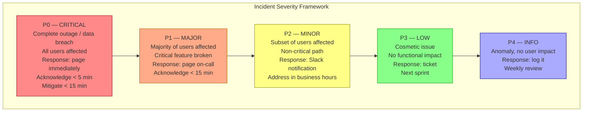

### Severity Decision Tree

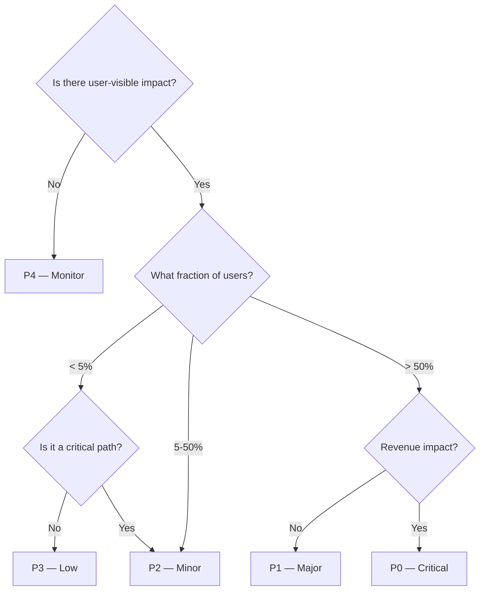

### Pitfalls
- ❌ **Everything is P1:** If teams over-escalate every issue to P1, on-call responders treat all alerts equally — including genuine P0s. Calibrate severity classifications with real examples documented in the runbook.
- ❌ **Not having a P4/informational tier:** Without a low-urgency tier, engineers either ignore genuinely important signals (high GC pauses) or escalate them inappropriately. P4 provides a formal channel for "watch this" items.
- ❌ **Severity set by the reporter not the impact:** "The CEO's dashboard is broken" is not automatically P0. Apply the severity criteria consistently. If the CEO's dashboard is non-critical and cosmetic, it's P3.

### Concept Reference
→ [Observability Fundamentals](../../../09-observability/concepts/observability-fundamentals)

---

## Q2: What is the incident commander role and why does one person need to coordinate?

**Role:** Mid | **Difficulty:** 🟡 | **Priority:** P0 | **Format:** Quick Answer

> **What the interviewer is testing:** Whether you understand the organizational dynamics of P0 incident response and why a single coordinator is essential.

### Answer in 60 seconds
- **Incident Commander (IC):** A single person who takes command of a P0 incident response. Owns coordination, not technical fixing. The IC does NOT debug the system — they ensure the right people are working on the right things.
- **Responsibilities:**
  - Maintain the incident timeline and status updates
  - Assign roles: technical lead (debugging), comms lead (status page, stakeholders), scribe (notes)
  - Make decisions when the team is stuck or disagrees
  - Time-box actions: "We have 10 minutes to diagnose, then we roll back regardless"
  - Declare incident resolved and trigger postmortem
- **Why one person coordinates:** In a crisis, multiple engineers will independently pull in different directions — one debugging DB, another restarting services, a third deploying a fix. Without a coordinator, these actions conflict (restarting services while someone is taking a DB dump invalidates the dump). The IC serializes decision-making.
- **IC is not the most senior engineer:** The IC should be someone trained in incident coordination, not necessarily the domain expert. The domain expert should be debugging, not coordinating.
- **Rotation:** IC role rotates monthly among senior engineers. Requires specific training (incident command system, ICS).

### Diagram

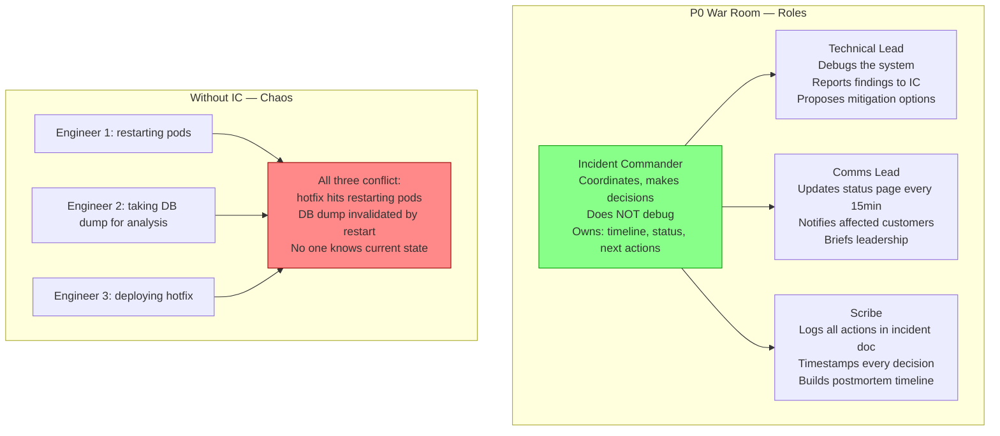

### Pitfalls
- ❌ **IC also debugging:** An IC debugging the system stops coordinating — no one tracks the timeline, no status page updates, handoffs are missed. IC must focus exclusively on coordination.
- ❌ **No IC role in small teams:** "We're a 5-person team, we don't need an IC" — you do. Even with 2 engineers on call, one coordinates (IC) and one debugs. Coordination overhead is worth it for P0s.
- ❌ **IC making technical decisions unilaterally:** IC is not a dictator. For significant decisions (rollback vs hotfix), IC seeks technical lead input, time-boxes the discussion (5 minutes), then makes the call. Unilateral decisions without technical input cause wrong choices.

### Concept Reference
→ [Observability Fundamentals](../../../09-observability/concepts/observability-fundamentals)

---

## Q3: What makes a blameless postmortem effective — 5-whys, timeline, and action items?

**Role:** Senior | **Difficulty:** 🔴 | **Priority:** P1 | **Format:** Deep Dive

> **What the interviewer is testing:** Whether you understand how to run postmortems that improve systems rather than assign blame, and the specific techniques (5-whys, timeline reconstruction) that make them effective.

### Problem Constraints
| Dimension | Value |
|-----------|-------|
| Incident | Payment service P0 — 45 minutes downtime during Black Friday |
| Impact | $2M revenue loss, 180,000 failed transactions |
| Postmortem goal | Identify root cause, prevent recurrence — not find who to blame |
| Postmortem deadline | Must complete within 72 hours while memory is fresh |

### Blameless Postmortem Structure

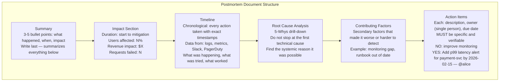

### 5-Whys Example

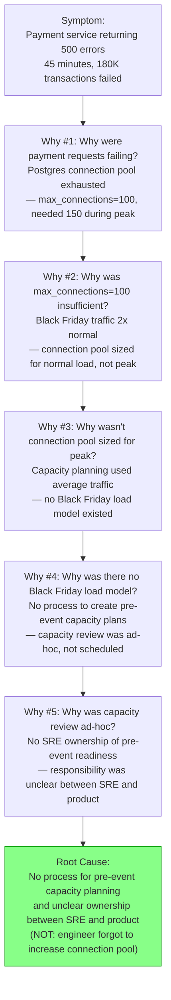

### Action Items That Are Effective vs Ineffective

| Ineffective | Effective |
|-------------|-----------|
| "Improve monitoring" | "Add PagerDuty alert for connection pool > 80% capacity by 2026-02-15 — @alice" |
| "Better capacity planning" | "Create pre-event load model template and schedule capacity review 2 weeks before any major event by 2026-03-01 — @bob" |
| "Fix the connection pool" | "Increase max_connections to 500 and enable PgBouncer connection pooling by 2026-01-30 — @charlie" |
| "Train the team" | "Add Black Friday runbook to on-call guide by 2026-02-01 — @dave" |

### What a great answer includes
- [ ] Blameless means: root cause is systemic, not personal — "the system allowed this to happen" not "alice misconfigured this"
- [ ] 5-whys: drill past first technical cause to find systemic process failure
- [ ] Timeline: exact timestamps, every action taken, built from logs and Slack — not from memory
- [ ] Action items: specific, assigned to one person, have due dates, are verifiable
- [ ] 72-hour deadline: postmortem while memory is fresh; key detail is forgotten after 1 week

### Pitfalls
- ❌ **Stopping 5-whys at the first technical cause:** "Root cause: connection pool too small." This leads to action "increase connection pool size" — which fixes this incident but not the underlying process failure. Keep asking why until you reach a systemic or organizational cause.
- ❌ **Assigning action items to teams not people:** "Platform team will add monitoring" — teams have no individual accountability. Every action item needs one owner who is responsible.
- ❌ **No follow-up on action items:** Postmortem with 10 action items, 0 completed — worse than no postmortem (false sense of learning). Assign a postmortem reviewer who checks completion at the due date.

### Concept Reference
→ [Observability Fundamentals](../../../09-observability/concepts/observability-fundamentals)

---

## Q4: Walk through a P0 payment outage — first 15 minutes step by step

**Role:** Senior | **Difficulty:** 🔴 | **Priority:** P1 | **Format:** Deep Dive

> **What the interviewer is testing:** Whether you know the operational playbook for a P0 incident — not just the tools, but the sequence of actions under pressure.

### Problem Constraints
| Dimension | Value |
|-----------|-------|
| Incident | Payment service: 100% of checkout requests returning HTTP 500 |
| Detection | PagerDuty alert at T+0, on-call engineer paged |
| Impact | $50K revenue/minute lost, 10K failed transactions/minute |
| Goal | Restore service within 15 minutes |

### First 15 Minutes Playbook

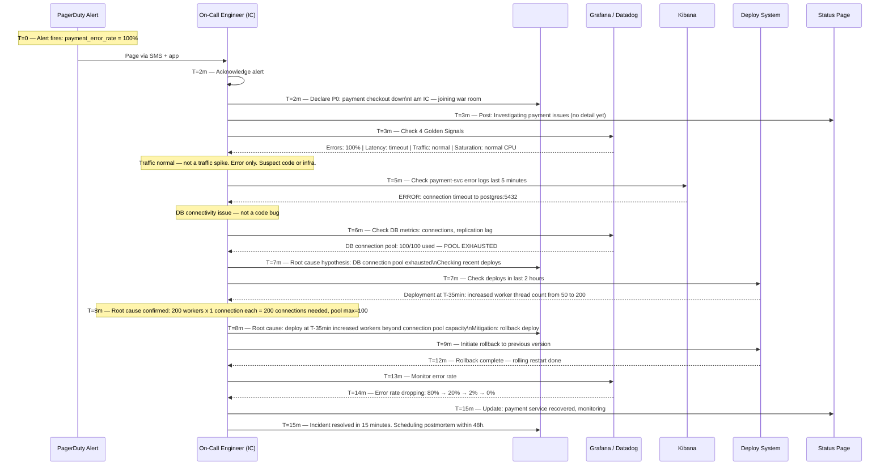

### Decision Tree During Diagnosis

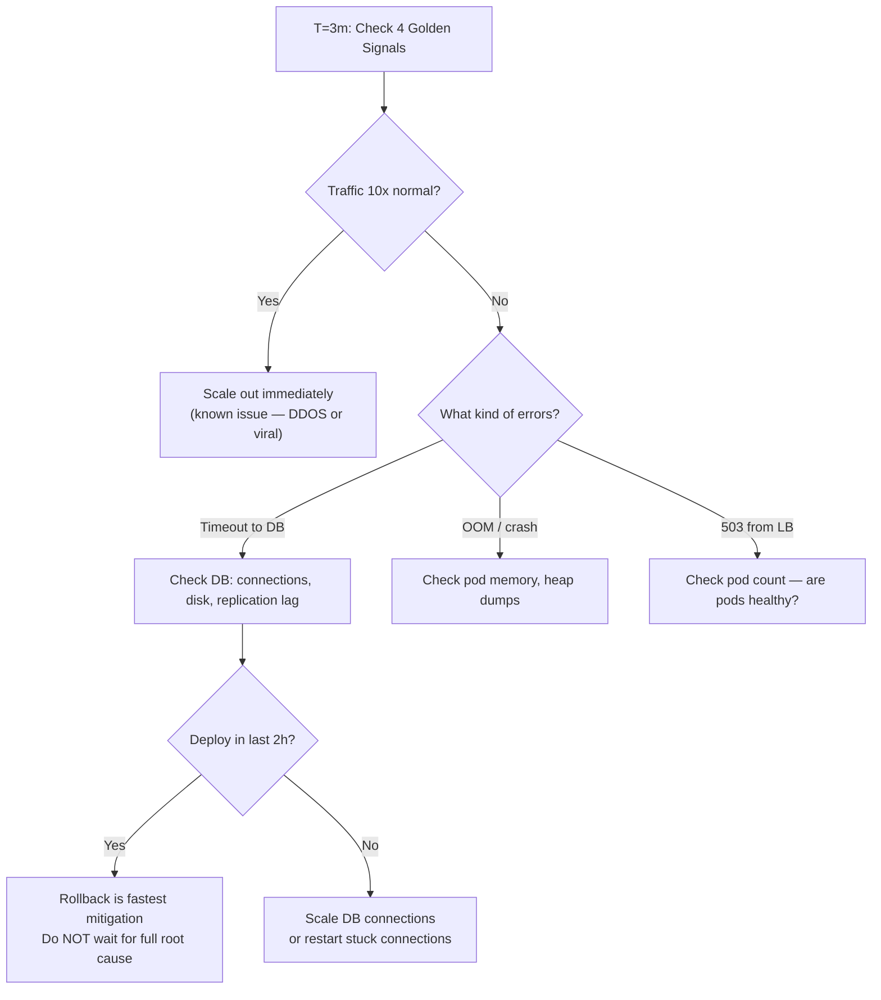

### What a great answer includes
- [ ] Acknowledge in under 5 minutes and declare in Slack immediately
- [ ] Status page update within 3 minutes (vague is fine — "investigating" reduces inbound support tickets)
- [ ] Check 4 Golden Signals first to narrow the problem space quickly
- [ ] Look at recent deploys early — most P0s are deploy-related, rollback is fastest fix
- [ ] Prioritize mitigation over root cause: restore service first, understand why later

### Pitfalls
- ❌ **Debugging root cause before mitigating:** A 20-minute deep investigation while service is down = $1M lost. Mitigate first (rollback, scale out, circuit break), then do the postmortem.
- ❌ **Not updating the status page for 30 minutes:** Support team gets 1,000 tickets in the first 10 minutes. A 3-minute status page update ("investigating payment issues") cuts inbound tickets by 60%.
- ❌ **Multiple engineers debugging independently:** Without an IC declaring "we are rolling back" at T=8m, one engineer rolls back while another is deploying a hotfix — conflict causes longer outage.

### Concept Reference
→ [Observability Fundamentals](../../../09-observability/concepts/observability-fundamentals)

---

## Q5: Chaos engineering — Netflix Chaos Monkey, Gameday, blast radius control

**Role:** Senior | **Difficulty:** 🔴 | **Priority:** P1 | **Format:** Quick Answer

> **What the interviewer is testing:** Whether you understand how to proactively find reliability weaknesses and the safety controls required to do it without causing customer incidents.

### Answer in 60 seconds
- **Chaos engineering:** Intentionally injecting failures into production (or staging) to discover weaknesses before they cause real incidents. The hypothesis: if we inject failure X, the system should handle it gracefully with behavior Y.
- **Netflix Chaos Monkey:** Randomly terminates EC2 instances in production during business hours (not nights/weekends). Forces teams to build services that tolerate instance failure automatically. If Chaos Monkey causes an incident, the team's reliability posture is exposed — they must fix it.
- **Gameday:** A planned, controlled chaos experiment. Team chooses a failure scenario (e.g., "what happens if our primary DB fails?"), runs it in a controlled environment, observes behavior, and identifies gaps. Run quarterly or before major events.
- **Blast radius control:** Limiting the impact of chaos experiments. Techniques: (1) traffic splitting — inject failures into 1% of traffic, monitor, expand if safe; (2) feature flags — inject failure only for internal users first; (3) time-boxing — run experiment for 5 minutes max, auto-stop on p99 spike.
- **What to inject:** Network latency (+200ms), packet loss (5%), CPU spike (90%), disk full (95%), process kill, dependency timeout, memory leak.

### Diagram

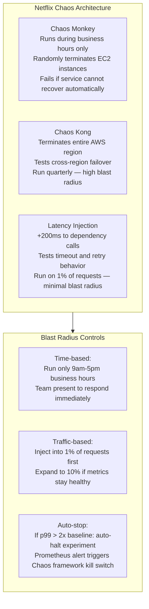

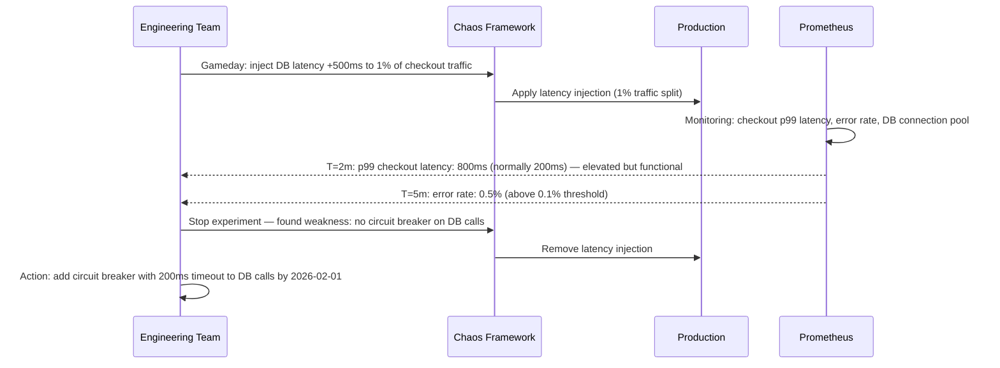

### Pitfalls
- ❌ **Running chaos without safety controls:** "Let's randomly kill services and see what happens" without auto-stop, blast radius limits, or rollback plans will cause real customer incidents. Chaos engineering requires as much engineering discipline as the system itself.
- ❌ **Only testing in staging:** Netflix runs Chaos Monkey in production for a reason — staging rarely replicates production traffic patterns, data distributions, and load. Staging chaos provides false confidence. Start with 1% production traffic.
- ❌ **No hypothesis before the experiment:** Random chaos without a hypothesis is just breaking things. Define: "We expect X to happen when we inject Y. If we observe Z instead, here is what we will fix." The hypothesis makes it an experiment, not sabotage.

### Concept Reference
→ [Observability Fundamentals](../../../09-observability/concepts/observability-fundamentals)

---

## Q6: PagerDuty routes 10M alerts/month with ML-based noise reduction — alert grouping and inhibition

**Role:** Staff | **Difficulty:** ⚫ | **Priority:** P2 | **Format:** Deep Dive

> **What the interviewer is testing:** Whether you understand alert routing at scale, intelligent deduplication, and the ML techniques PagerDuty uses to reduce on-call fatigue.

### Problem Constraints
| Dimension | Value |
|-----------|-------|
| PagerDuty scale | 10M alert events/month across all customers |
| Average on-call engineer | 500 alerts/month (16/day), 30% are actionable |
| Problem | 70% of alerts are noise — duplicates, auto-resolved, correlated |
| Goal | Route only actionable, deduplicated alerts to on-call |

### Alert Pipeline Architecture

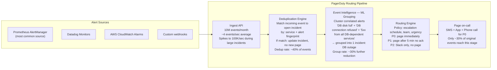

### ML-Based Alert Grouping

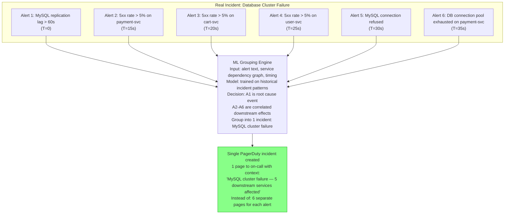

### Alert Inhibition

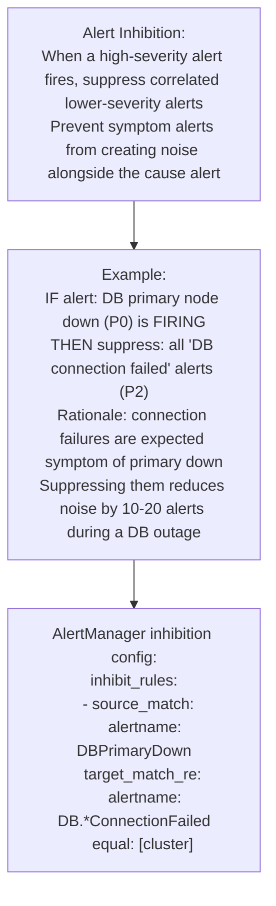

| Noise Reduction Technique | Reduction | Mechanism |
|--------------------------|-----------|-----------|
| Deduplication | 40% fewer pages | Match events to existing open incidents |
| ML grouping | 30% further reduction | Cluster correlated alerts from same root cause |
| Inhibition | 10-20% further reduction | Suppress symptoms when cause is known |
| `for` clause in alert rules | 20-30% at source | Only fire after sustained condition |
| Combined | 70-80% noise reduction | 10M events → ~30% actionable pages |

### What a great answer includes
- [ ] State the scale: 10M events/month, pipeline must handle 100K/sec burst during major incidents
- [ ] Deduplication: fingerprint-based match prevents duplicate pages for same issue
- [ ] ML grouping: service dependency graph + timing clustering identifies root cause vs symptoms
- [ ] Inhibition: source alert suppresses correlated target alerts (cause suppresses symptoms)
- [ ] Outcome: 70% noise reduction — on-call receives actionable alerts, not raw event volume

### Pitfalls
- ❌ **Only deduplicating exact duplicate alerts:** Two different alert names for the same root cause ("DB disk 90%" and "DB connection refused") are not exact duplicates but are highly correlated. ML grouping handles this; exact deduplication does not.
- ❌ **Inhibition without time bounds:** If the "DB primary down" inhibition rule is configured without a maximum TTL, and the DB recovers but the alert fails to resolve, all DB connection alerts are suppressed indefinitely. Always set inhibition TTL (maximum 2 hours).
- ❌ **Routing all alerts with equal urgency:** Not all alerts need immediate phone calls. Configure urgency policies: P0 = phone + SMS, P1 = SMS only, P2 = Slack + mobile push. Waking someone at 3am for a P2 issue destroys on-call morale.

### Concept Reference
→ [Observability Fundamentals](../../../09-observability/concepts/observability-fundamentals)
