# Incident Response Systems

6 questions covering incident response from severity definitions to PagerDuty's intelligent noise reduction at 10M alerts/month.

---

## Q1: What are incident severity levels P0–P4 and what defines each?

**Role:** Junior, Mid | **Difficulty:** 🟢 | **Priority:** P0 | **Format:** Quick Answer

> **What the interviewer is testing:** Whether you have a framework for severity classification and can articulate what factors determine severity — user impact, scope, revenue loss, and reversibility.

### Answer in 60 seconds
- **P0 — Critical / All Hands:** Complete service outage or data loss in progress. Revenue directly impacted. Affects 100% of users or all paying customers. Requires immediate response (<5 minutes). Examples: payment processing down, data breach in progress, complete website outage. Response: all senior engineers + management notified, war room opened immediately.
- **P1 — High:** Major functionality broken. Significant user impact (>10% of users). Core user flow degraded (checkout slow, not broken). Revenue at risk. Response time: <15 minutes. Examples: checkout p99 > 10s, search returning no results, login rate failing 5%.
- **P2 — Medium:** Partial impact, significant degradation but workaround exists. <10% of users affected. Non-core functionality. Response time: <1 hour. Examples: push notifications delayed by 30 minutes, image uploads failing, recommendation engine down (manual fallback available).
- **P3 — Low:** Minor issue, minimal user impact. Cosmetic bug, single-user report, non-critical degradation. Response time: next business day. Examples: incorrect text on error page, one user's export failing, analytics dashboard delayed.
- **P4 — Informational:** No user impact. Operational concern or technical debt. Scheduled maintenance, performance trend to investigate. Response time: next sprint planning.

### Diagram

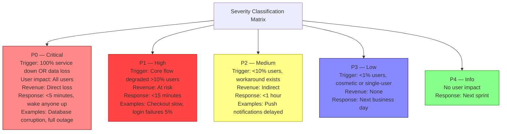

### Pitfalls
- ❌ **Severity set by gut feeling rather than criteria:** Without documented criteria, severity is politically determined ("whoever shouts loudest makes it P0"). Define criteria per service: specific error rate thresholds, latency thresholds, user impact percentages.
- ❌ **P0 for every customer complaint:** A single VIP customer reporting an issue is not P0 unless they represent all paying customers. Severity is based on scope and user impact, not customer tier (customer tier affects *response priority*, not *severity*).
- ❌ **Not down-grading severity as situation improves:** An incident declared P0 (complete outage) that is partially mitigated (50% of traffic restored) should be down-graded to P1. Not updating severity creates alert fatigue when the same P0 alert rings for 6 hours after partial recovery.

### Concept Reference
→ [Incident Response](../../../09-observability/concepts/incident-response)

---

## Q2: What is the incident commander role and why does a single person coordinate?

**Role:** Mid | **Difficulty:** 🟡 | **Priority:** P0 | **Format:** Quick Answer

> **What the interviewer is testing:** Whether you understand the ICS (Incident Command System) coordination principle and why single-commander structure prevents the chaos of multiple people trying to fix the same thing simultaneously.

### Answer in 60 seconds
- **Incident commander (IC) role:** A single person who owns the incident response process — not necessarily the most technical person. The IC: (1) declares incident severity, (2) establishes communication channel (Slack war room, Zoom bridge), (3) assigns roles (lead engineer, communications lead, scribe), (4) tracks action items and owners, (5) makes decisions when there's disagreement, (6) controls the communication cadence to stakeholders.
- **Why single coordinator:** Without an IC, every engineer works independently — two people make the same change simultaneously, causing worse degradation. Someone is applying a hotfix while another is rolling back. Communication is fragmented (5 Slack threads, no single status update). Stakeholders email 10 different people asking for status. The IC prevents this fragmentation.
- **Separation of duties:** IC does NOT fix the incident — that's the lead engineer's job. IC manages the process while the technical team focuses entirely on resolution. This prevents the "I'm trying to fix the DB AND update the CEO at the same time" cognitive overload.
- **ICS origin:** Borrowed from firefighting incident command structure. Proven at scale (NASA, military). Google adapted it for software incidents. Atlassian, PagerDuty, and most SRE-mature organisations use IC structure formally.
- **On-call rotation:** The IC role rotates separately from the technical on-call rotation. Any senior engineer can be IC — they don't need deep expertise in the failing system.

### Diagram

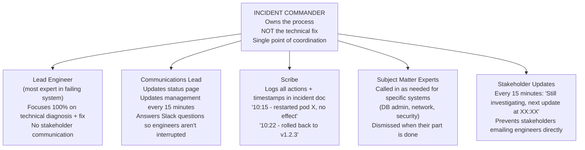

### Pitfalls
- ❌ **IC trying to fix the incident:** An IC who is also hands-on-keyboard cannot simultaneously track the full situation. The IC must maintain situational awareness — they should not be typing commands.
- ❌ **No IC declared for P0/P1 incidents:** "Everyone just join the Zoom and figure it out" leads to 45 minutes of confusion before anyone realises two engineers are making conflicting changes. Declare an IC within the first 5 minutes of a P0.
- ❌ **IC with insufficient authority:** If the IC suggests rolling back a deploy and the engineer says "I need VP approval first," the IC is ineffective. IC must have delegated authority to make time-critical decisions during the incident. Document this authority in the incident response playbook.

### Concept Reference
→ [Incident Response](../../../09-observability/concepts/incident-response)

---

## Q3: What is a blameless postmortem and how do you run one effectively?

**Role:** Senior | **Difficulty:** 🔴 | **Priority:** P1 | **Format:** Deep Dive

> **What the interviewer is testing:** Whether you understand the psychological safety principles behind blameless postmortems and can describe a structured process that leads to systemic improvements.

### Problem Constraints
| Dimension | Value |
|-----------|-------|
| Incident | P0: Payment service down 47 minutes |
| Impact | 100% of checkouts failed, ~$500K revenue loss |
| Root cause | Engineer deployed a misconfigured feature flag |
| Context | Engineer was under pressure to ship, review was rushed |

### Wrong Approach — Blame-Based

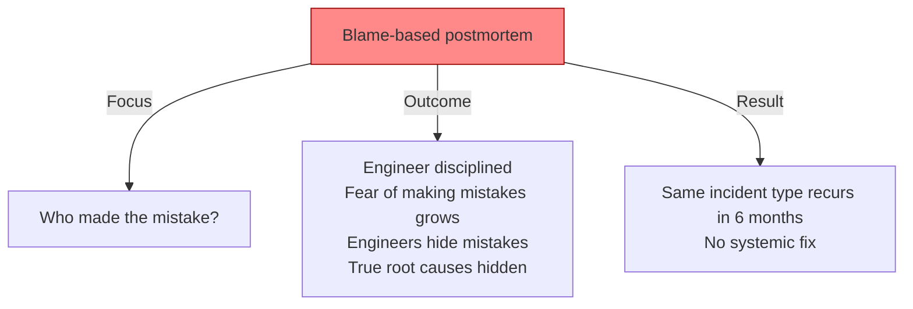

### Correct Approach — Blameless

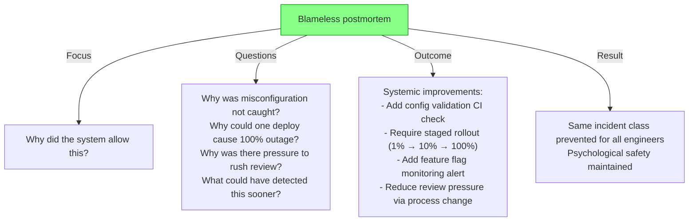

### Postmortem Document Structure

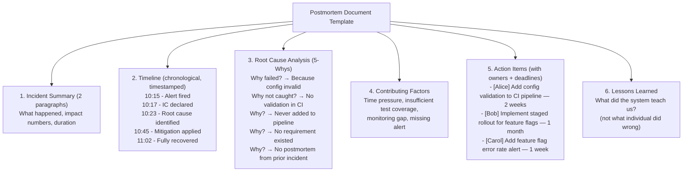

### Pitfalls
- ❌ **Blameless postmortem without real accountability:** "Blameless" does not mean "no action items." Action items should have owners, deadlines, and must be tracked to completion. Blameless = no personal blame; accountability = systemic improvements must happen.
- ❌ **5-Whys stopping at the first "why":** "Why did the outage happen? Because the engineer deployed bad config." Stop there = blame. Continue to "Why was bad config deployable? Because CI had no validation. Why? Because nobody required it. Why? Because no postmortem from the last similar incident defined this action item." The full 5-whys reveals the systemic gap.
- ❌ **Action items with no owner or no deadline:** "We should add better monitoring" → never happens. Every action item must have: exactly one owner (not "the team"), a specific deadline (not "soon"), and a defined completion criterion ("alert created and tested" not "look into alerting").

### Concept Reference
→ [Incident Response](../../../09-observability/concepts/incident-response)

---

## Q4: How do you respond to a P0 payment outage in the first 15 minutes?

**Role:** Senior | **Difficulty:** 🔴 | **Priority:** P1 | **Format:** Quick Answer

> **What the interviewer is testing:** Whether you have a mental model of P0 incident response sequencing — the difference between panic-driven and structured response.

### Answer in 60 seconds
- **Minute 0–2 — Declare and coordinate:**
  - Alert fires: IC role activates (on-call engineer or first responder)
  - Declare incident: create incident channel (#incident-payment-2026-01-01), declare severity P0
  - Open Zoom bridge: "Payment Incident War Room"
  - Broadcast: "P0 incident declared — payment processing impacted. IC: Alice. Please join #incident-payment-2026-01-01."
- **Minute 2–5 — Assess impact:**
  - Check dashboard: error rate, latency, traffic. Is it 100% outage or partial? Which regions?
  - Check recent deployments: any deploy in last 30 minutes? (most common cause)
  - Check dependencies: is the payment processor up? DB connections healthy?
- **Minute 5–10 — Immediate mitigation:**
  - If recent deploy: rollback immediately. Don't investigate — rollback first, diagnose later. A 5-minute rollback prevents 45 more minutes of investigation.
  - Enable maintenance mode / fallback UI: "Payment temporarily unavailable, please try again shortly."
  - Scale up if resource saturation: if DB connections exhausted, add replicas or restart connection pool.
- **Minute 10–15 — Communication:**
  - Update status page: "Investigating payment processing issues" — within first 10 minutes.
  - Update executive stakeholders (CEO, CTO, VP Engineering): brief factual update.
  - Internal Slack: "Payment P0 — impacting all checkouts. IC: Alice. Rollback in progress. Next update at T+30 minutes."
- **Continue:** Full diagnosis after mitigation. Postmortem scheduled within 48 hours.

### Diagram

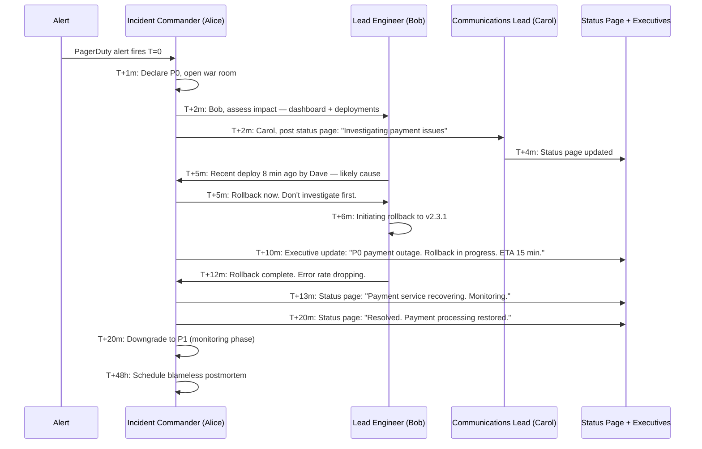

### Pitfalls
- ❌ **Investigating before mitigating:** Spending 20 minutes finding the root cause while the outage continues. If a recent deploy is likely the cause, rollback in 5 minutes — investigation can happen after recovery. "Rollback first, investigate later" is the mantra.
- ❌ **Not updating the status page within 10 minutes:** Customers and sales teams see the outage before you do. If the status page shows "All Systems Operational" while checkout is down for 10 minutes, trust is damaged. Update immediately: "Investigating" is sufficient — you don't need the root cause to post a status update.
- ❌ **No communication rhythm:** Without structured updates (every 15 minutes during P0), stakeholders assume the worst and interrupt engineers with questions. Pre-announce the next update time: "Next update at T+30 minutes."

### Concept Reference
→ [Incident Response](../../../09-observability/concepts/incident-response)

---

## Q5: What is chaos engineering — Netflix GameDay, Chaos Monkey, blast radius control?

**Role:** Senior | **Difficulty:** 🔴 | **Priority:** P1 | **Format:** Deep Dive

> **What the interviewer is testing:** Whether you understand proactive reliability testing as a discipline, not just reactive incident response, and the safety practices that make chaos engineering safe.

### Problem Constraints
| Dimension | Value |
|-----------|-------|
| Netflix context | 2011 — migrating from monolith to cloud microservices |
| Challenge | How to ensure resilience without waiting for production failures |
| Insight | Systems fail in unexpected ways — proactive testing finds unknown unknowns |
| Principle | Inject failures in production (controlled) before production surprises you |

### Chaos Monkey and the Simian Army

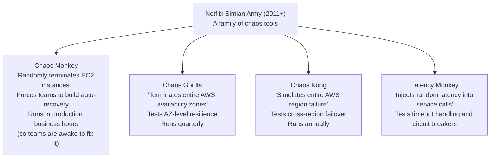

### Blast Radius Control

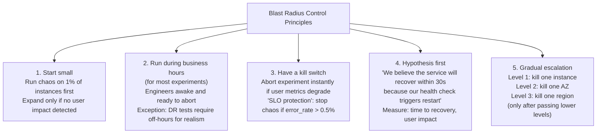

### Netflix GameDay

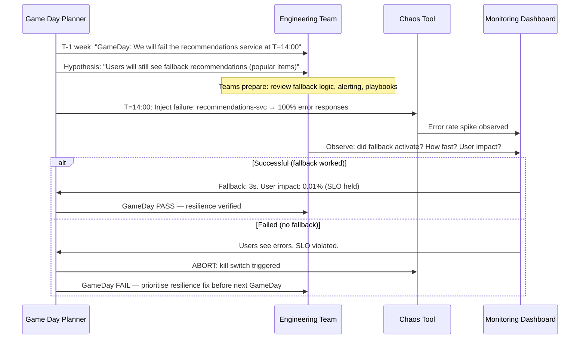

### Pitfalls
- ❌ **Chaos engineering without observability:** If you can't observe the impact (latency, error rate, user impact), you don't know if the chaos test succeeded. Observability must come before chaos.
- ❌ **Running chaos in staging only:** Staging environments have different traffic patterns, data, and dependencies. Chaos results in staging don't reflect production resilience. Netflix ran Chaos Monkey in production from day one (with blast radius controls).
- ❌ **No hypothesis:** "Let's see what breaks" is not chaos engineering — it's chaos. A hypothesis-driven experiment ("We believe X will happen; measuring Y will confirm/deny") is what distinguishes GameDay from random destruction.

### Concept Reference
→ [Incident Response](../../../09-observability/concepts/incident-response)

---

## Q6: How does PagerDuty route 10M alerts/month with intelligent noise reduction?

**Role:** Staff | **Difficulty:** ⚫ | **Priority:** P2 | **Format:** Deep Dive

> **What the interviewer is testing:** Whether you understand alert management at scale — deduplication, correlation, intelligent routing, and suppression — which are real operational challenges in large organisations.

### Problem Constraints
| Dimension | Value |
|-----------|-------|
| Alert volume | 10M alerts/month = 333K/day = 3,858/sec peak |
| Actionable incidents | ~5,000 distinct incidents/month |
| Noise ratio | 2,000:1 (10M alerts → 5K incidents) |
| Goal | Route each incident to right person within 5 minutes |
| Requirement | Never miss a P0 alert (false negative = unacceptable) |

### Alert → Incident Pipeline

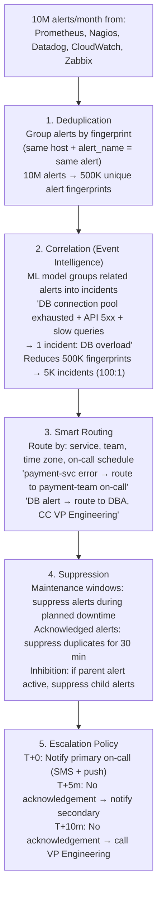

### ML-Based Noise Reduction (Event Intelligence)

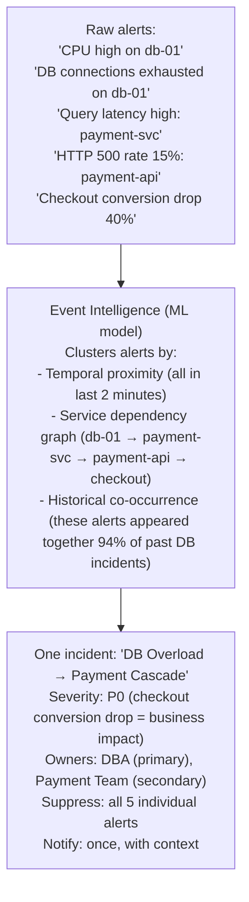

| Dimension | Naive (all alerts) | PagerDuty Event Intelligence |
|-----------|-------------------|------------------------------|
| Alerts per incident | 2,000 alerts | 1 grouped incident |
| On-call interruptions | 2,000 notifications | 1 notification |
| Context provided | None | Service dependency graph, likely cause |
| Time to acknowledge | After alert flood | Immediate (context provided) |
| False negative risk | Low | Near zero (ML tuned for high recall) |

### Recommended Answer
PagerDuty's Event Intelligence (ML-based grouping) reduces 10M alerts/month to 5K actionable incidents through three mechanisms:

**1. Deduplication:** Identical alerts (same host + same check) within a 30-minute window are collapsed into one. At 10M alerts, many are repeated Prometheus scrapes for the same threshold breach.

**2. Correlation (ML grouping):** PagerDuty's ML model (trained on historical incident data) groups related alerts into a single incident. Features: temporal proximity, service dependency topology, historical co-occurrence, shared labels. A single DB failure causing alerts across 50 dependent services becomes 1 incident.

**3. Alert suppression:** Maintenance windows suppress alerts during planned changes. Acknowledged alerts suppress duplicates. Parent-child inhibition: if `DB_Down` is acknowledged, suppress `PaymentService_5xx`, `CartService_5xx`, `CheckoutConversion_Drop` — they're all symptoms of the same root cause.

**Routing precision:** PagerDuty routes by on-call schedule, escalation policy, and service ownership. "Payment incidents at 3 AM" routes to the payment team primary on-call, not to the entire engineering org.

**False negative prevention:** ML grouping is tuned for high recall — it's better to create an extra incident than to miss one. False positive groupings (grouping unrelated alerts) are handled by the on-call engineer splitting the incident if needed. A missed P0 is far worse than an extra notification.

### What a great answer includes
- [ ] Deduplication: collapse repeated alerts from same check (10M → 500K)
- [ ] ML correlation: group related alerts into single incidents (500K → 5K)
- [ ] Suppression: maintenance windows, acknowledged-alert dedup, parent-child inhibition
- [ ] Smart routing: on-call schedule + service ownership + escalation policy
- [ ] High recall preference: false positive groupings are acceptable; false negatives (missed P0) are not

### Pitfalls
- ❌ **Deduplication as the only noise reduction:** Deduplication reduces repeated identical alerts but does nothing for correlation (a DB failure causing 50 unique downstream alerts). Event Intelligence (ML grouping) is needed for the 2,000:1 reduction.
- ❌ **Manual on-call rotation without software:** At 10M alerts/month, manual rotation management creates gaps (who covers this timezone? who is on leave?). PagerDuty/Opsgenie automate on-call schedules, handoffs, and override management.
- ❌ **Not training the ML model on historical incidents:** PagerDuty's Event Intelligence improves over time by learning from closed incidents. A new installation with no historical data has poor correlation quality. Feed historical incident data on setup to accelerate model quality.

### Concept Reference
→ [Incident Response](../../../09-observability/concepts/incident-response)
