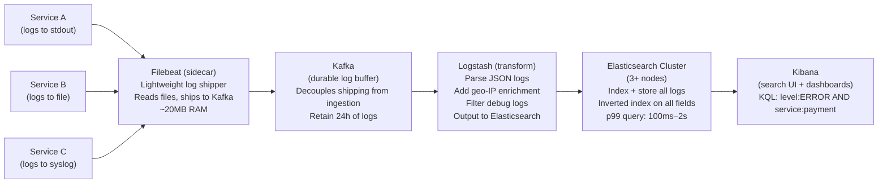
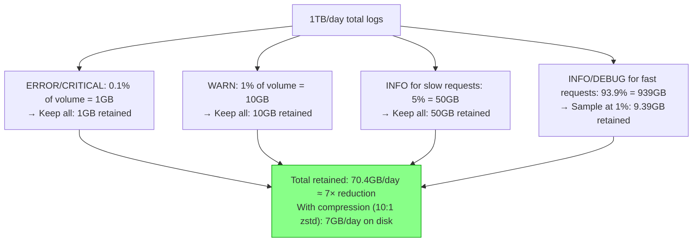
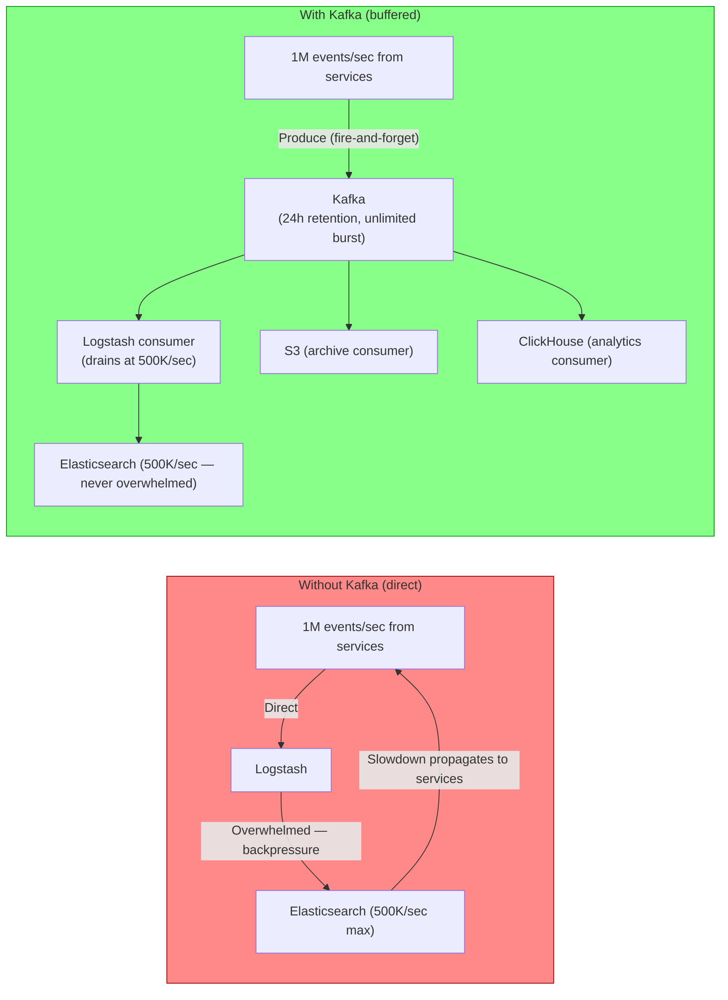
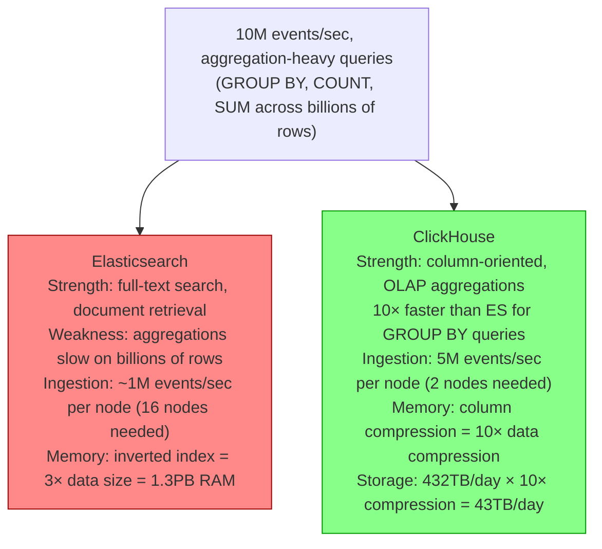
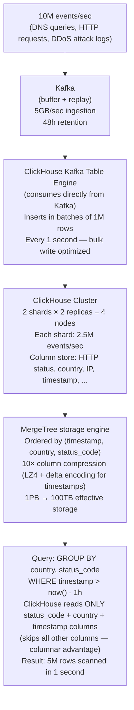

# Log Aggregation Systems

5 questions covering log aggregation from ELK fundamentals to Cloudflare processing 10M events/sec with ClickHouse.

---

## Q1: How does the ELK stack work — Elasticsearch, Logstash, Kibana?

**Role:** Junior, Mid | **Difficulty:** 🟢 | **Priority:** P0 | **Format:** Quick Answer

> **What the interviewer is testing:** Whether you understand the three components of the most popular log aggregation stack and how they work together.

### Answer in 60 seconds
- **Elasticsearch (store + search):** A distributed full-text search engine (built on Apache Lucene). Stores logs as JSON documents. Indexes every field for fast query. Handles: "find all logs with level=ERROR in service=payment in the last 1 hour." Horizontally scalable — add shards for more capacity.
- **Logstash (collect + transform):** A data pipeline that collects logs from multiple sources (files, syslog, Kafka, HTTP), transforms them (parse, filter, enrich, transform), and outputs to Elasticsearch (or other destinations). Heavy: runs on JVM, requires 1–4GB RAM. Use Filebeat for lightweight log shipping; Logstash for complex transformation.
- **Kibana (visualise + query):** A web UI for searching, visualising, and dashboarding data in Elasticsearch. KQL (Kibana Query Language) for log search. Dashboard builder for log volume charts, error rate graphs, service maps. Kibana also includes Alerting and APM in the broader Elastic Stack.
- **Modern ELK variant:** Filebeat (lightweight log shipper, runs alongside service) → Kafka (durable buffer) → Logstash (transform) → Elasticsearch → Kibana. Kafka decouples production log shipping from Elasticsearch ingestion rate.
- **Scale limits:** A 3-node Elasticsearch cluster handles ~100GB logs/day comfortably. For 1TB/day, use 10–15 nodes with tiered hot/warm/cold storage.

### Diagram



### Pitfalls
- ❌ **Shipping logs directly from app to Elasticsearch without a buffer:** If Elasticsearch is slow or down, log shipping blocks. Kafka as a buffer provides backpressure resistance — logs accumulate in Kafka and drain when Elasticsearch recovers.
- ❌ **Logstash on every app server:** Logstash requires 1–4GB RAM per instance. Running it on every app server wastes resources. Use Filebeat (20MB) on app servers, Logstash on dedicated log-processing servers.
- ❌ **No index lifecycle management (ILM):** Without ILM, Elasticsearch indices grow indefinitely. At 100GB/day, a 30-day retention requires 3TB. Configure ILM to: hot (7 days, SSD), warm (30 days, HDD), cold (1 year, frozen), delete (after 1 year). Reduces hot storage costs by 5×.

### Concept Reference
→ [Observability Patterns](../../../09-observability/concepts/observability-fundamentals)

---

## Q2: What is structured logging vs unstructured logging, and why does it matter?

**Role:** Mid | **Difficulty:** 🟡 | **Priority:** P0 | **Format:** Quick Answer

> **What the interviewer is testing:** Whether you understand why structured logging is mandatory for queryable observability at scale and the operational difference it makes.

### Answer in 60 seconds
- **Unstructured logging:** Free-text log messages. Example: `2026-01-01 10:00:00 ERROR Payment failed for order 123 user 456 amount 99.99`. Machine-readable only by parsing — requires regex extraction in Logstash/Fluentd. Adding a new field requires a new regex.
- **Structured logging (JSON):** Log messages as JSON objects with explicit key-value pairs. Example: `{"timestamp":"2026-01-01T10:00:00Z","level":"ERROR","message":"Payment failed","order_id":123,"user_id":456,"amount":99.99,"service":"payment","trace_id":"abc123"}`. Every field is queryable without parsing.
- **Why it matters in Elasticsearch:**
  - Unstructured: Elasticsearch indexes the full text. Query "order_id:123" requires a regex search or a pre-configured Logstash grok pattern.
  - Structured: Elasticsearch auto-creates a field mapping for each JSON key. Query `order_id:123` hits an indexed field — results in milliseconds.
- **Operational difference:**
  - Structured: "Find all failed payments for user 456 in the last 1 hour" → `user_id:456 AND level:ERROR AND message:payment_failed` → instant.
  - Unstructured: Requires grep-like text search across raw log strings → 10–30 seconds at scale.
- **Structured logging libraries:** Winston (Node.js), Logback JSON encoder (Java), zerolog (Go), structlog (Python). Add to all services with minimal code change.

### Diagram

```mermaid
graph TD
  subgraph Unstructured["Unstructured Log"]
    U1["'ERROR Payment failed for order 123 user 456 amount 99.99'\n\nElasticsearch: full text only\nQuery order_id=123: regex scan of all log text\nLatency: seconds\nAdding new field: update Logstash grok regex"]
  end

  subgraph Structured["Structured Log (JSON)"]
    S1["{\"level\":\"ERROR\",\"order_id\":123,\"user_id\":456,\n\"amount\":99.99,\"trace_id\":\"abc123\"}\n\nElasticsearch: individual field indexes\nQuery order_id:123: indexed field lookup\nLatency: milliseconds\nAdding new field: zero config — auto-indexed"]
  end

  style Unstructured fill:#f88,stroke:#900
  style Structured fill:#8f8,stroke:#090
```

### Pitfalls
- ❌ **Mixing structured and unstructured in the same service:** If `message` field contains free-text concatenated with variables (`"Payment failed for order " + order_id`), you've embedded a structured field inside an unstructured field. Log message separately; all variables as top-level JSON fields.
- ❌ **Logging sensitive data in structured fields:** JSON fields are indexed and searchable — easier to accidentally expose PII. Never log passwords, credit card numbers, or auth tokens. Mask or omit before logging: `user_id` is OK; `user_email` should be masked.
- ❌ **High-cardinality fields causing Elasticsearch mapping explosion:** Each unique JSON key becomes an Elasticsearch mapping field. Dynamically generated keys (e.g., `request.params.utm_campaign_xyz`) create thousands of mappings — causes OOM and mapping explosion. Use static field names; put dynamic values in string values, not keys.

### Concept Reference
→ [Observability Patterns](../../../09-observability/concepts/observability-fundamentals)

---

## Q3: How do you reduce log volume by 10× using sampling without losing critical logs?

**Role:** Senior | **Difficulty:** 🔴 | **Priority:** P1 | **Format:** Deep Dive

> **What the interviewer is testing:** Whether you can design a log sampling strategy that dramatically reduces storage costs while guaranteeing that errors and anomalies are always captured.

### Problem Constraints
| Dimension | Value |
|-----------|-------|
| Current log volume | 1TB/day (1B log lines/day) |
| Target volume | 100GB/day (10× reduction) |
| Non-negotiable | All ERROR and CRITICAL logs must be kept |
| Non-negotiable | All logs for any request with trace_id showing >p99 latency |
| Acceptable for sampling | DEBUG and INFO logs for successful fast requests |

### Sampling Strategy Design

```mermaid
graph TD
  LogLine["Log line arrives"]

  Level{Level?}
  LogLine --> Level

  Level -->|"ERROR or CRITICAL"| Keep1["KEEP (100%)\nAll errors must be retained\nNo sampling for error analysis"]

  Level -->|"WARN"| KeepWarn["KEEP (100%)\nWarnings may precede errors\nKept for correlation"]

  Level -->|"INFO or DEBUG"| Slow{Slow request?\n(trace_id latency > p99?)}

  Slow -->|Yes| Keep2["KEEP (100%)\nSlow request logs needed for debugging"]

  Slow -->|No| Sample{"Sample rate\nby service tier"}

  Sample -->|"High-traffic service (>10K req/sec)"| S1["Keep 1% of INFO logs\n(100× reduction)"]
  Sample -->|"Medium traffic (1K–10K req/sec)"| S2["Keep 10% of INFO logs\n(10× reduction)"]
  Sample -->|"Low traffic (<1K req/sec)"| S3["Keep 100% of INFO logs\n(insufficient volume to sample)"]
```

### Implementation — Logstash Sampling Filter

```
# Pseudo-code sampling in Logstash/OpenTelemetry Collector

IF log.level IN [ERROR, CRITICAL, WARN]:
    EMIT log (always)

ELIF log.trace_id EXISTS AND is_slow_trace(log.trace_id):
    EMIT log (always)

ELIF log.service IN HIGH_TRAFFIC_SERVICES:
    EMIT log IF rand() < 0.01  (1% sampling)

ELIF log.service IN MEDIUM_TRAFFIC_SERVICES:
    EMIT log IF rand() < 0.10  (10% sampling)

ELSE:
    EMIT log (low traffic — keep all)
```

### Volume Reduction Analysis



### Recommended Answer
Log sampling must be deterministic for correlated logs: all logs with the same trace_id must be either all kept or all dropped. Random per-line sampling breaks correlation.

**Sampling approach:**
1. **Always keep** by log level: ERROR, CRITICAL, WARN — 100% retention. These are diagnostic and auditable.
2. **Always keep** by latency signal: any log for a trace_id where the request duration exceeded p99 (determined via trace metadata or a flag set by the trace sampling decision). Inject this decision into the log context at request start: `log.with_field("sampled_for_latency", true)`.
3. **Rate-limit INFO/DEBUG by service:** High-traffic services: 1% sampling. Medium: 10%. Low: 100%.
4. **Consistency within a request:** Use the trace_id to make a deterministic sampling decision: `hash(trace_id) % 100 < sample_rate`. All log lines with the same trace_id get the same keep/drop decision.

**Result:** ~7-10× volume reduction while retaining all diagnostically critical logs.

### What a great answer includes
- [ ] Always keep errors/warnings (non-negotiable)
- [ ] Always keep logs for slow requests (via trace_id correlation)
- [ ] Deterministic sampling by trace_id (not random per log line)
- [ ] Service-tier sampling rates calibrated to traffic volume
- [ ] Quantify: 1TB/day → ~70GB/day (7× reduction) at described rates

### Pitfalls
- ❌ **Random per-line sampling:** If you randomly drop 99% of lines regardless of trace_id, you'll have some lines from request trace_id=abc but not others — correlation is broken. Use consistent hash on trace_id.
- ❌ **Sampling at the application level:** Application-level sampling means the log lines never reach Logstash — they're discarded at source. This prevents any future reprocessing. Sample at the Logstash/Collector level; mark sampled lines with metadata but don't discard at application level for post-hoc analysis.
- ❌ **No DEBUG log sampling in development vs production:** DEBUG logs are often enabled in development and accidentally left on in production. Production DEBUG logs can be 10–50× the volume of INFO. Always sample or disable DEBUG in production.

### Concept Reference
→ [Observability Patterns](../../../09-observability/concepts/observability-fundamentals)

---

## Q4: Why use Kafka as a log buffer to decouple producers from Elasticsearch at 1M events/sec?

**Role:** Senior | **Difficulty:** 🔴 | **Priority:** P1 | **Format:** Quick Answer

> **What the interviewer is testing:** Whether you understand the production problems that arise from direct log shipping to Elasticsearch and how Kafka as a buffer solves them.

### Answer in 60 seconds
- **The problem without Kafka:** Services ship logs directly to Logstash → Elasticsearch. At 1M events/sec: Elasticsearch indexing throughput limit is ~500K events/sec per node. If Elasticsearch slows (GC pause, disk saturation, shard rebalancing), backpressure propagates to Logstash → to services. Services block waiting for logs to be written — impacting production latency.
- **Kafka as a durable buffer:** Services ship logs to Kafka (producers). Logstash/Kafka Consumers read from Kafka at Elasticsearch's ingestion rate. Producers and Elasticsearch are completely decoupled. If Elasticsearch is slow for 10 minutes, Kafka accumulates the backlog and Logstash catches up when Elasticsearch recovers.
- **Additional benefits:**
  - **Replay:** Kafka retains logs for 24–48 hours. If Elasticsearch index is misconfigured or corrupt, replay the Kafka topic into a new index.
  - **Multiple consumers:** The same Kafka log topic can feed Elasticsearch (search), ClickHouse (analytics), and S3 (archival) simultaneously — write once, consume multiple times.
  - **Peak absorption:** Production log spikes (e.g., a 10× traffic event) are absorbed by Kafka. Elasticsearch processes at its steady rate. Without Kafka, peak events may overwhelm Elasticsearch, causing log loss.
- **Trade-off:** Adds 500ms–2s latency to log availability in Kibana (Kafka consumer lag + Logstash processing). Acceptable for logs; would not be acceptable for real-time metrics.

### Diagram



### Pitfalls
- ❌ **Kafka retention shorter than expected outage duration:** If Elasticsearch is down for 8 hours but Kafka retention is 6 hours, the first 2 hours of logs are lost. Size Kafka retention at 2× expected maximum Elasticsearch downtime (typically 48 hours).
- ❌ **Not monitoring Kafka consumer lag:** Consumer lag = how far Logstash is behind Kafka. If lag grows continuously, Logstash can't keep up with production. Alert if lag > 10 minutes: `kafka.consumer.lag > 600000ms`.
- ❌ **Using Kafka for real-time metric pipelines:** Kafka's 500ms–2s latency is acceptable for logs. For real-time metrics (Prometheus scrape → alerting in 15 seconds), Kafka adds unacceptable latency. Don't Kafkaify your metric pipeline.

### Concept Reference
→ [Observability Patterns](../../../09-observability/concepts/observability-fundamentals)

---

## Q5: How does Cloudflare process 10M log events/sec with ClickHouse?

**Role:** Staff | **Difficulty:** ⚫ | **Priority:** P2 | **Format:** Deep Dive

> **What the interviewer is testing:** Whether you know ClickHouse as the modern alternative to Elasticsearch for high-throughput log analytics and can reason about the technical trade-offs.

### Problem Constraints
| Dimension | Value |
|-----------|-------|
| Scale | 10M log events/sec (Cloudflare network traffic logs) |
| Data per event | ~500 bytes |
| Ingestion rate | 5GB/sec = 432TB/day |
| Query patterns | Aggregation: "Group HTTP errors by country for last 1 hour" |
| Latency requirement | Query p99 < 5 seconds |
| Retention | 30 days (13PB total) |

### ClickHouse vs Elasticsearch for This Use Case



### ClickHouse Architecture for Log Analytics



| Dimension | Elasticsearch | ClickHouse |
|-----------|--------------|-----------|
| Write throughput | 500K events/sec/node | 5M events/sec/node |
| Aggregation query speed | Seconds–minutes | Milliseconds–seconds |
| Storage compression | 2–3× | 10–30× (columnar) |
| Full-text search | Native (inverted index) | Limited (no inverted index) |
| Row retrieval (by ID) | Fast | Slow (not optimised) |
| Best for | Log search, document lookup | Log analytics, aggregations |

### Recommended Answer
Cloudflare uses ClickHouse for its network traffic logs because the primary query pattern is aggregation-heavy analytics ("HTTP errors by country in the last hour"), not document retrieval ("show me this specific request's details"). ClickHouse's column-oriented storage makes aggregation queries 10–100× faster than Elasticsearch.

**Column-oriented advantage:** When computing "COUNT(*) GROUP BY country WHERE status_code=500", ClickHouse reads only the `country` and `status_code` columns — skipping all other columns (URL, user-agent, headers, etc.). Elasticsearch's row-oriented storage reads entire documents. At 10B rows/day, this is the difference between reading 10GB and reading 1TB of data.

**ClickHouse MergeTree:** The MergeTree table engine sorts data by primary key (typically timestamp + key dimensions) and applies delta encoding + LZ4 compression per column. Timestamp columns compress 100×; HTTP status codes (few unique values) compress 50×. 432TB/day → 43TB after compression.

**Ingestion:** ClickHouse Kafka Table Engine consumes directly from Kafka in large batches (1M rows per batch, every second). Large batch writes are 100× more efficient than row-by-row inserts.

**Limitation:** ClickHouse is not a general-purpose search engine. For "show me all logs containing this specific user ID in the last 10 minutes" (document retrieval), Elasticsearch is faster. Cloudflare uses both: ClickHouse for analytics, Elasticsearch for search/debugging.

### What a great answer includes
- [ ] Column-oriented storage: read only relevant columns for aggregations (10× speedup)
- [ ] MergeTree compression: 10–30× via delta encoding + LZ4 per column
- [ ] Kafka → ClickHouse Kafka Table Engine: batch insert optimisation
- [ ] ClickHouse's weakness: not optimised for full-text search or row retrieval
- [ ] Scale numbers: 10M events/sec, 432TB/day, 30TB after compression

### Pitfalls
- ❌ **Using ClickHouse for full-text search:** ClickHouse has no inverted index. "Find logs containing error message X" requires full column scan. Use Elasticsearch (or OpenSearch) for text search; ClickHouse for aggregation analytics.
- ❌ **Row-by-row inserts into ClickHouse:** ClickHouse is optimised for bulk inserts (10K–1M rows per batch). Inserting 1 row at a time triggers 1 LSM merge per row — at 10M events/sec, this causes severe write amplification. Always buffer and batch.
- ❌ **Not understanding ClickHouse's eventual consistency model:** ClickHouse uses ReplicatedMergeTree for HA. Inserts are acknowledged after writing to the primary replica; background replication to replicas is async. Reading from a replica immediately after write may return stale data. Understand this for write-then-read consistency requirements.

### Concept Reference
→ [Observability Patterns](../../../09-observability/concepts/observability-fundamentals)
