# Log Aggregation Systems

5 questions covering log aggregation from ELK fundamentals to Cloudflare processing 10M events/sec with ClickHouse.

---

## Q1: How does the ELK stack work — what does each component do?

**Role:** Junior, Mid | **Difficulty:** 🟢 | **Priority:** P0 | **Format:** Quick Answer

> **What the interviewer is testing:** Whether you can explain the three ELK components and their responsibilities in a log pipeline.

### Answer in 60 seconds
- **E — Elasticsearch:** Distributed search and analytics engine. Stores log documents as JSON, builds inverted indexes on every field, enables full-text search and aggregations over log data. Cluster of nodes with shards and replicas for scale and HA.
- **L — Logstash:** Data processing pipeline. Ingests logs from multiple sources (files, sockets, Kafka, Beats), applies filters (parse, transform, enrich), outputs to Elasticsearch or other destinations. CPU-intensive for parsing; can be a bottleneck at high volume.
- **K — Kibana:** Visualization UI. Connects to Elasticsearch, provides: log search with Lucene query syntax, dashboards (metric panels, timelines), Discover for ad-hoc log exploration, Alerting for threshold-based alerts. Not a data store — purely a query and visualization layer.
- **Beats:** Lightweight data shippers (Filebeat for log files, Metricbeat for system metrics, Packetbeat for network). Run as agents on each server, forward to Logstash or directly to Elasticsearch. 10MB RAM footprint vs Logstash's 500MB+.
- **Flow:** Application writes logs → Filebeat ships to Logstash → Logstash parses → Elasticsearch indexes → Kibana queries.

### Diagram

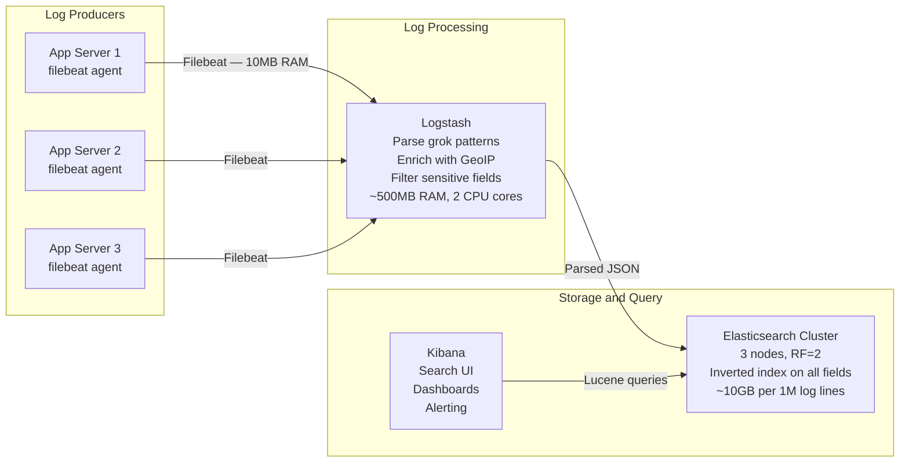

### Pitfalls
- ❌ **Using Logstash for every pipeline:** At high volume (>10K events/sec), Logstash becomes a bottleneck due to JVM overhead. Use Kafka between Beats and Logstash to buffer bursts. Or skip Logstash and use Elasticsearch's Ingest Pipelines for simple parsing.
- ❌ **Single Elasticsearch node:** ES is a distributed system — single node provides no HA and limits indexing throughput. Minimum 3 nodes for production (allows quorum for master election).
- ❌ **Indexing everything at field level:** ES indexes every field by default. For logs with 200 unique fields, this creates a massive index. Use `dynamic: false` and explicitly map only queried fields to reduce index size by 3-5x.

### Concept Reference

---

## Q2: Structured logging vs unstructured — JSON fields, queryability, and parsing overhead?

**Role:** Mid | **Difficulty:** 🟡 | **Priority:** P0 | **Format:** Quick Answer

> **What the interviewer is testing:** Whether you understand why structured logging is a prerequisite for effective log aggregation and can quantify the trade-offs.

### Answer in 60 seconds
- **Unstructured log:** A free-form string. Example: `[2026-01-01 14:32:00] ERROR payment-svc: failed to process order 123, user 456, amount 99.99, reason: timeout`. Information exists but requires regex to extract.
- **Structured log:** A JSON document where each field is a key-value pair. Example: `{"timestamp":"2026-01-01T14:32:00Z","level":"error","service":"payment-svc","order_id":123,"user_id":456,"amount":99.99,"error":"timeout"}`.
- **Queryability difference:** Unstructured: `grep "ERROR" payments.log | grep "user 456"` — works on single files. Elasticsearch query on unstructured: full-text search, imprecise. Structured in Elasticsearch: `{"query":{"bool":{"filter":[{"term":{"user_id":456}},{"term":{"level":"error"}}]}}}` — exact field match, milliseconds on billions of logs.
- **Parsing overhead:** Unstructured logs require grok patterns in Logstash (regex parsing) — CPU-intensive, 50K–200K events/sec per CPU core. Structured JSON is parsed natively by ES Ingest Pipelines — 10x faster, no regex required.
- **Cardinality pitfall:** Structured fields with high cardinality (e.g., `user_id`, `order_id`) create large Elasticsearch keyword indexes. Use numeric fields for IDs; enable `doc_values` only for aggregation fields.

### Diagram

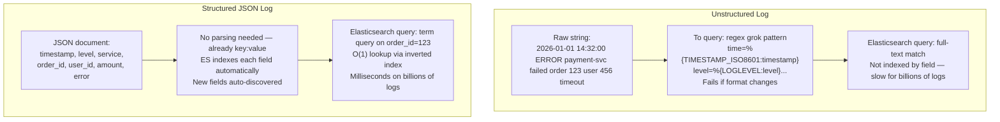

| Dimension | Unstructured | Structured JSON |
|-----------|-------------|-----------------|
| Query by field | Regex grep — slow | Indexed field lookup — fast |
| Parsing overhead | High (grok regex, CPU-intensive) | Low (native JSON decode) |
| Schema changes | Break regex patterns | New fields auto-indexed |
| Storage size | Smaller (plain text) | Larger (JSON overhead ~30%) |
| Cross-service correlation | Hard (different formats) | Easy (consistent field names) |
| Alerting on field values | Regex match | Exact term match |

### Pitfalls
- ❌ **Mixing structured and unstructured in the same pipeline:** If 80% of services emit JSON but 20% emit plain text, your Kibana dashboards cannot aggregate across them. Enforce structured logging via linting in CI.
- ❌ **Logging sensitive data as structured fields:** A structured field `{"credit_card":"4111..."}` gets indexed in Elasticsearch where it is queryable by anyone with Kibana access. Mask or omit sensitive fields at the application layer before logging.
- ❌ **Free-form string for numeric fields:** `{"duration":"450ms"}` stores a string. `{"duration_ms":450}` stores a number. Only numeric types support range queries (`duration_ms > 200`) — critical for latency alerting.

### Concept Reference

---

## Q3: Log sampling — reduce volume 10x without losing P0 errors?

**Role:** Senior | **Difficulty:** 🔴 | **Priority:** P1 | **Format:** Deep Dive

> **What the interviewer is testing:** Whether you can design a log sampling strategy that reduces cost while preserving observability for critical events.

### Problem Constraints
| Dimension | Value |
|-----------|-------|
| Current volume | 1M log events/sec |
| Elasticsearch cost | $50K/month for cluster to handle 1M/sec |
| Error rate | 0.1% (1K errors/sec) |
| Goal | Reduce volume to 100K/sec (10x reduction) with zero error loss |
| Constraint | P0 errors (500 status, exceptions) must all be preserved |

### Approach A — Head Sampling (naive)

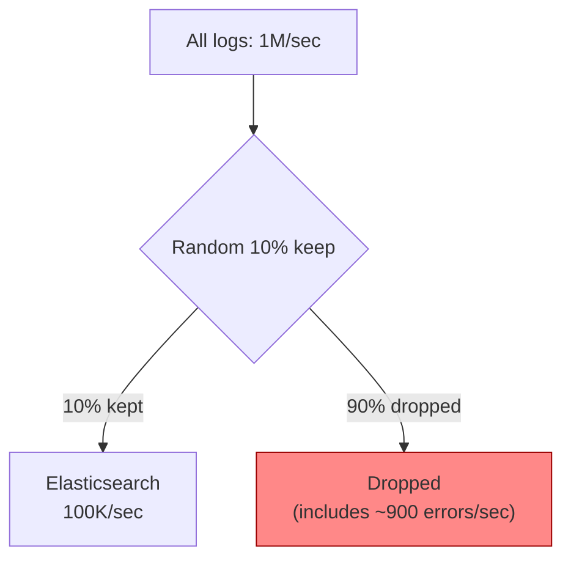

Problem: 90% of error logs dropped. Of 1K errors/sec, 900 are lost. P0 incident goes undetected.

### Approach B — Priority-Based Sampling

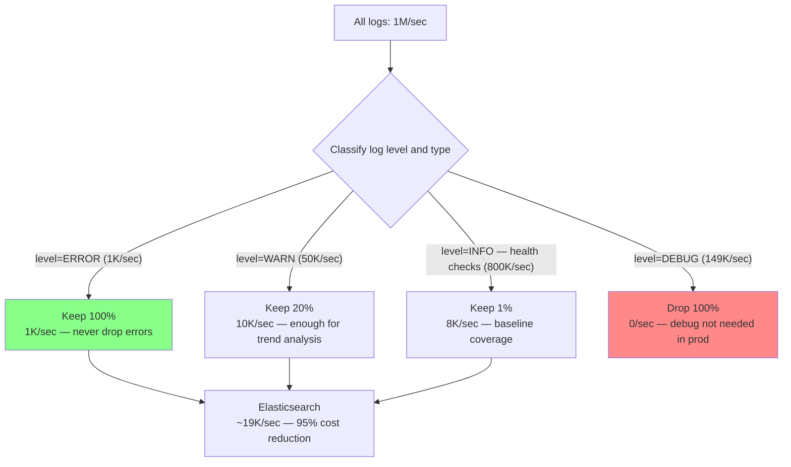

### Approach C — Tail Sampling with Error Buffer

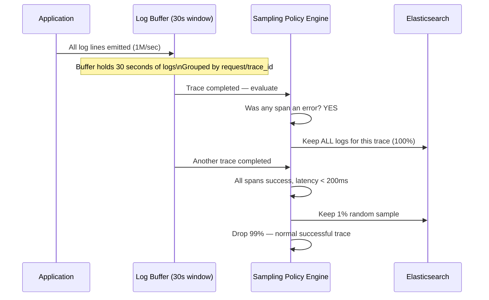

| Strategy | Error Preservation | Volume Reduction | Complexity |
|----------|-------------------|------------------|------------|
| Head sampling 10% | 90% errors lost | 10x | Low |
| Level-based priority | 100% errors kept | ~95% reduction | Medium |
| Tail sampling | 100% errors kept | 90%+ reduction | High (stateful buffer) |

### What a great answer includes
- [ ] State the constraint: P0 errors (level=ERROR, HTTP 5xx) must always be kept at 100%
- [ ] Level-based sampling: ERROR 100%, WARN 20%, INFO 1%, DEBUG 0% in production
- [ ] Calculate resulting volume: 1K + 10K + 8K = 19K/sec (vs 1M/sec) — 98% reduction
- [ ] Tail sampling: buffer logs by trace-id, keep all logs for error traces, sample success traces
- [ ] Mention cost: Elasticsearch ingestion and storage both scale linearly with volume

### Pitfalls
- ❌ **Sampling at the agent (Filebeat):** Filebeat head-sampling drops logs before they reach the pipeline — you cannot recover dropped errors. Sample at the aggregator (Logstash/Kafka) where you have full visibility.
- ❌ **Dropping WARN logs entirely:** WARN-level logs often precede P0 errors by 5–60 minutes. Keeping 20% of WARNs provides enough signal to detect degradation before it becomes an incident.
- ❌ **No sampling counter metric:** When you sample, emit a metric: `logs_sampled_total{level, service, kept=true/false}`. Without this, you cannot tell from Kibana whether low log volume means "no events" or "events dropped by sampler."

### Concept Reference

---

## Q4: Kafka as log buffer — decouple producers from Elasticsearch at 1M events/sec

**Role:** Senior | **Difficulty:** 🔴 | **Priority:** P1 | **Format:** Deep Dive

> **What the interviewer is testing:** Whether you understand why a message queue is essential between log producers and log storage at scale, and how Kafka absorbs burst writes.

### Problem Constraints
| Dimension | Value |
|-----------|-------|
| Steady state | 100K log events/sec |
| Deployment spike | 10,000 services restart simultaneously = 10M events/sec for 2 minutes |
| Elasticsearch max ingest | 500K events/sec (5-node cluster) |
| Without buffer | ES overloaded during spike; logs dropped; back-pressure crashes apps |
| With Kafka buffer | Spike absorbed; ES drains at 500K/sec over 20 minutes; no loss |

### Without Kafka (direct Logstash to ES)

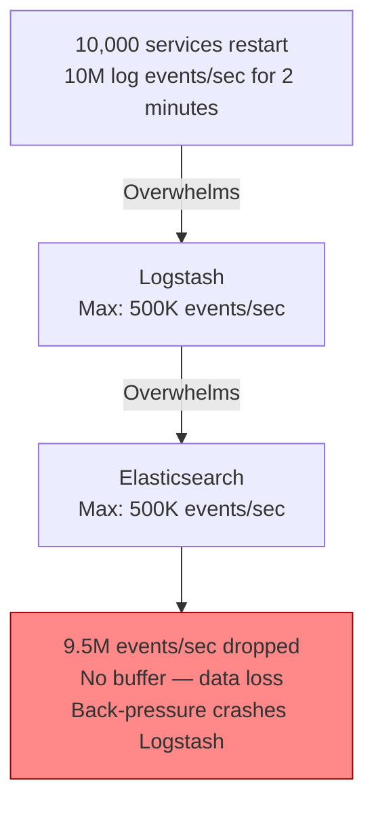

### With Kafka Buffer

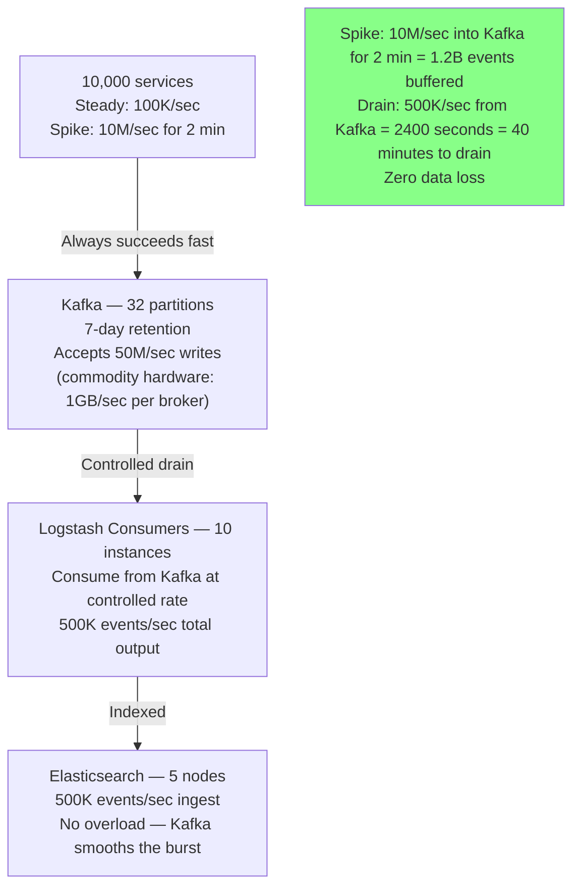

### Kafka Configuration for Log Pipeline

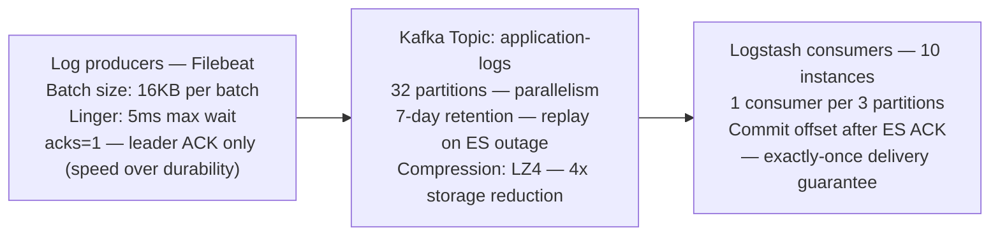

| Dimension | Direct Pipeline | Kafka-Buffered |
|-----------|----------------|----------------|
| Handles burst writes | No — data loss | Yes — buffer absorbs |
| ES outage behavior | Logs dropped during outage | Logs replay from Kafka on recovery |
| Backpressure to apps | Yes — apps stall | No — Kafka always accepts |
| Operational complexity | Low | Medium (Kafka cluster management) |
| Cost | Lower (no Kafka) | Higher ($500–2K/month for Kafka cluster) |
| Minimum production scale | < 10K events/sec | > 10K events/sec |

### What a great answer includes
- [ ] State the spike scenario: deployments cause 10–100x burst writes
- [ ] Kafka absorbs burst: writes always succeed; downstream drains at controlled rate
- [ ] Replay on ES failure: Kafka retains 7 days; resume from last committed offset
- [ ] Partition count determines parallelism: 32 partitions = 32 parallel consumers max
- [ ] Break-even: Kafka overhead justified above 10K events/sec; below that, direct pipeline is simpler

### Pitfalls
- ❌ **Using Kafka topic with 1 partition for logs:** Single partition = single consumer = sequential processing. At 1M events/sec, one Logstash instance cannot keep up. Use 32+ partitions for parallel consumption.
- ❌ **Setting acks=all for log producers:** acks=all requires all Kafka replicas to confirm — adds 10–50ms latency per log batch. For logs, acks=1 (leader only) is sufficient. Log loss risk is acceptable; write latency impact on applications is not.
- ❌ **Not monitoring Kafka consumer lag:** Consumer lag = (Kafka latest offset) - (consumer committed offset). If lag grows continuously, consumers are too slow. Alert at lag > 10M messages (20 minutes of production logs at 500K/sec).

### Concept Reference

---

## Q5: Cloudflare processes 10M log events/sec with ClickHouse — why columnar wins for log analytics

**Role:** Staff | **Difficulty:** ⚫ | **Priority:** P2 | **Format:** Deep Dive

> **What the interviewer is testing:** Whether you understand columnar storage's advantages for log analytics and why Cloudflare chose ClickHouse over Elasticsearch at extreme scale.

### Problem Constraints
| Dimension | Value |
|-----------|-------|
| Scale | 10M HTTP log events/sec (Cloudflare handles ~30% of web traffic) |
| Daily volume | 10M × 86400s × ~500 bytes = ~432TB/day raw |
| Queries | "Error rate by PoP in last 5 minutes" — aggregation over 50M rows |
| Elasticsearch limit | ~500K events/sec per cluster before degradation |
| ClickHouse ingest | 10M+ events/sec on 10-node cluster |

### Why Elasticsearch Fails at This Scale

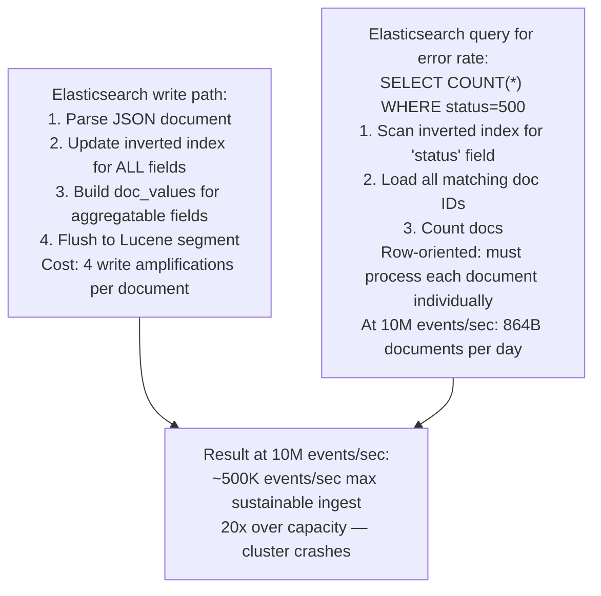

### ClickHouse Columnar Architecture

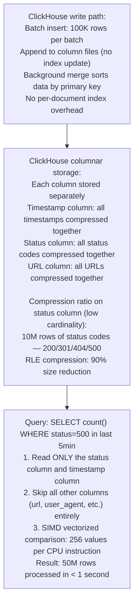

### Architecture at Cloudflare Scale

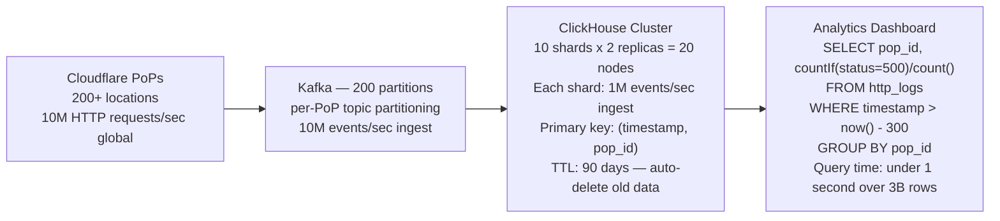

| Dimension | Elasticsearch | ClickHouse |
|-----------|---------------|------------|
| Ingest throughput | 500K events/sec (cluster) | 10M+ events/sec (cluster) |
| Query pattern | Full-text search, exact match | Aggregations, column scans |
| Storage per 1M rows | ~5GB (inverted index overhead) | ~200MB (columnar + compression) |
| p99 aggregation query | 5–30s for 1B rows | 0.5–3s for 1B rows |
| Strengths | Log search, regex queries | Aggregations, timeseries analytics |
| Best for | Debugging (find log for order X) | Analytics (error rate by region) |

### What a great answer includes
- [ ] State the bottleneck: ES inverted index write amplification — 4x overhead per document
- [ ] Columnar advantage: query only reads columns referenced by the query, skips all others
- [ ] Compression advantage: status column (200/301/404/500) compresses 90% with RLE
- [ ] SIMD vectorization: ClickHouse processes 256 values per CPU instruction for column scans
- [ ] Cloudflare architecture: Kafka 200 partitions → ClickHouse 10-shard cluster, 90-day TTL

### Pitfalls
- ❌ **Using ClickHouse for log search (find a specific log line):** ClickHouse has no full-text search index — searching for a specific error message requires full column scan. ES is better for search; ClickHouse is better for aggregation. Use both: ES for debug search, ClickHouse for dashboards.
- ❌ **Small batch inserts to ClickHouse:** ClickHouse is optimized for large batch inserts (100K+ rows). Inserting 1 row at a time creates thousands of small parts — compaction overhead crushes performance. Always buffer and batch via Kafka.
- ❌ **Ignoring primary key design:** ClickHouse primary key determines data sort order, not uniqueness. For time-series logs: `ORDER BY (timestamp, service_name)` enables partition pruning on time-range queries. Wrong primary key = full table scan for every query.

### Concept Reference
