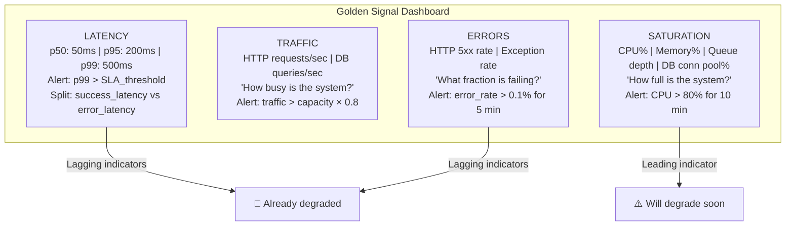
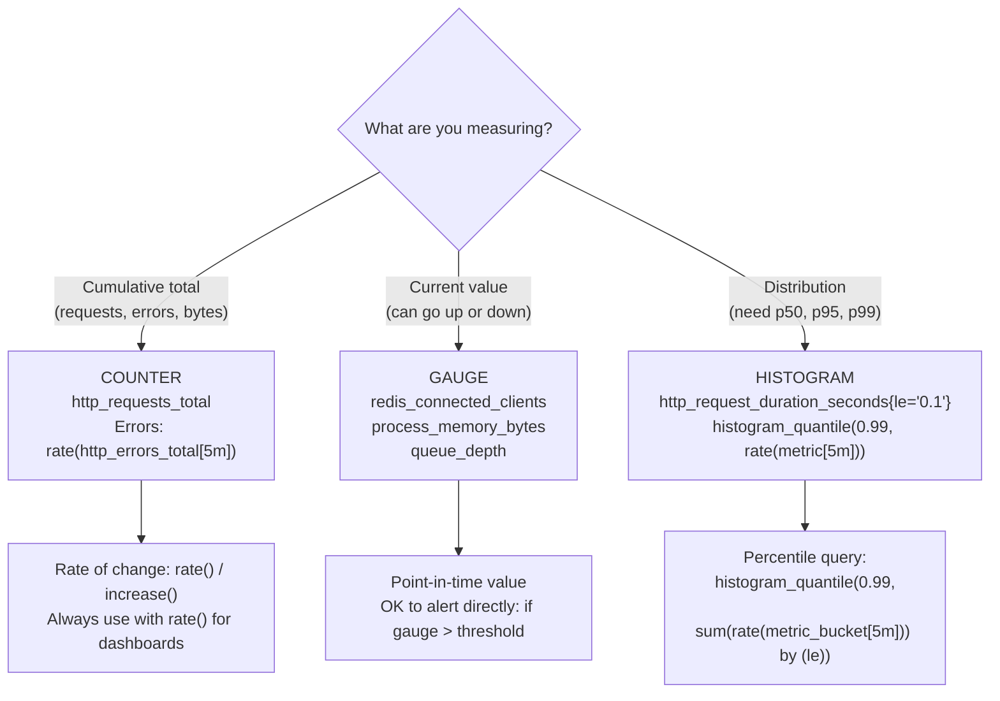
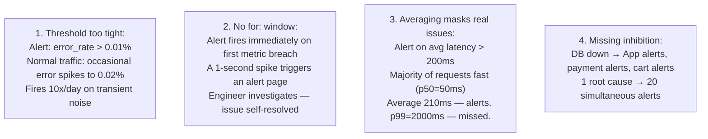
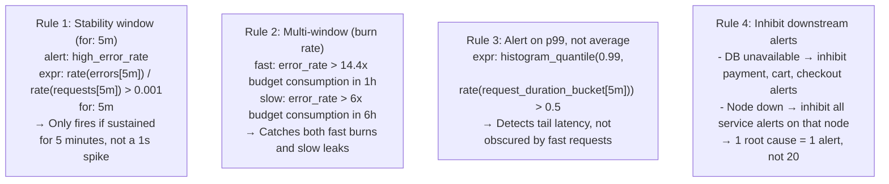
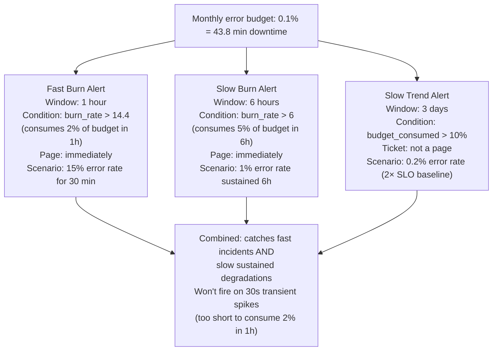
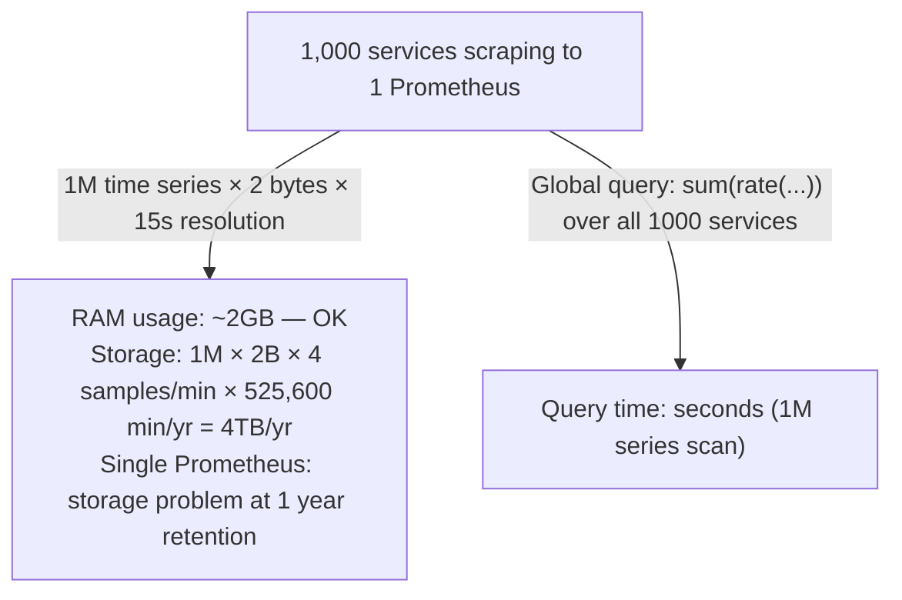
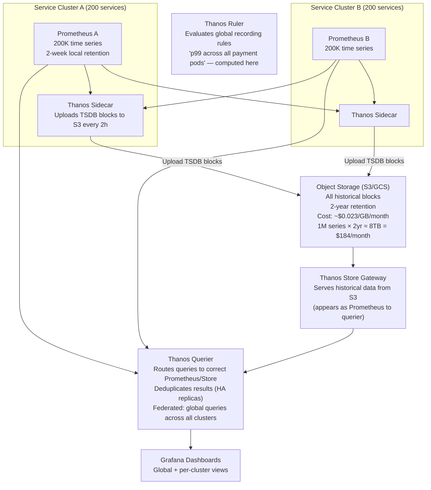
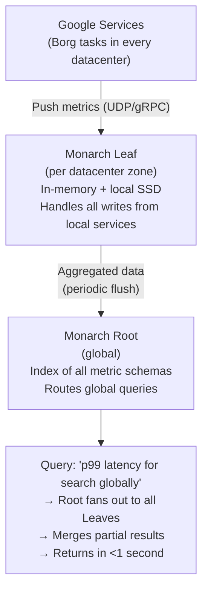

# Metrics & Alerting Design

6 questions covering metrics and alerting from the 4 Golden Signals to Google Monarch at 1B time series.

---

## Q1: What are the 4 Golden Signals?

**Role:** Junior, Mid | **Difficulty:** 🟢 | **Priority:** P0 | **Format:** Quick Answer

> **What the interviewer is testing:** Whether you know Google's canonical SRE framework for what to monitor in any service — demonstrating awareness of the SRE Book.

### Answer in 60 seconds
- **Latency:** Time to serve a request. Key nuance: track p50, p95, p99 — not average. A 500ms average can hide 10% of users experiencing 5-second responses. Track both success and error latency separately (slow errors vs fast errors signal different problems).
- **Traffic:** Volume of demand on the system. Requests/second, messages/second, transactions/second. Measures "how busy is the system." Use to calculate load factor and capacity headroom.
- **Errors:** Rate of failed requests. Both explicit errors (HTTP 5xx, exception thrown) and implicit errors (HTTP 200 but wrong content, latency exceeds SLA). Error rate = errors/total_requests × 100%. Alert when error rate > 0.1% sustained for >5 minutes.
- **Saturation:** How "full" the system is — the resource closest to its limit. CPU utilisation, memory usage, disk IOPS, thread pool queue depth, DB connection pool saturation. Leading indicator: saturation increases *before* latency and errors degrade. At 80% CPU saturation, start planning capacity increase.
- **The 4th signal is the early warning:** Latency and errors are lagging indicators (the system is already failing). Saturation is a leading indicator (system approaching failure). Monitor all four.

### Diagram

### Pitfalls
- ❌ **Alerting on average latency:** Average is misleading. 99% of requests at 10ms and 1% at 5,000ms = average of ~60ms. Looks fine; 1% of users are having a terrible experience. Always alert on p99.
- ❌ **Missing implicit errors:** HTTP 200 with incorrect content (malformed JSON, empty search results for a query that should return results) is not captured by HTTP status code monitoring. Add semantic checks (empty result rate, schema validation errors).
- ❌ **Monitoring only the 4 Golden Signals:** The 4 signals tell you *something is wrong*. They don't tell you *why*. You need lower-level metrics (JVM GC pause time, DB slow queries, external API latency) for diagnosis. Use 4GS for alerting, detailed metrics for debugging.

### Concept Reference
→ [Observability Patterns](../../../09-observability/concepts/observability-fundamentals)

---

## Q2: Histogram vs counter vs gauge — when do you use each?

**Role:** Mid | **Difficulty:** 🟡 | **Priority:** P0 | **Format:** Quick Answer

> **What the interviewer is testing:** Whether you know the three Prometheus metric types and can select the correct one for a given measurement.

### Answer in 60 seconds
- **Counter:** A monotonically increasing integer. Never decreases (only resets to zero on restart). Use for: total request count, total errors, total bytes transferred. Query with `rate()` or `increase()` to get per-second rates. Example: `http_requests_total{method="GET", status="200"}`.
- **Gauge:** A value that can go up or down at any time. Use for: current memory usage, active connections, queue depth, temperature, number of goroutines. Snapshot of current state. Example: `redis_connected_clients`.
- **Histogram:** Buckets a distribution of observations. Records count in each pre-defined bucket (e.g., <10ms, <50ms, <100ms, <500ms, <1s, +Inf). Also tracks total count and sum. Use for: request latency, response size, anything where you need percentiles. Query with `histogram_quantile(0.99, ...)` for p99.
- **Summary:** Like Histogram but computes quantiles in the client (not the server). Percentiles cannot be aggregated across instances. Generally prefer Histogram over Summary for server-side metrics.
- **Decision rule:**
  - Does it go up and down? → Gauge
  - Does it only increase (and you want rate)? → Counter
  - Do you need percentiles or distribution? → Histogram

### Diagram

### Pitfalls
- ❌ **Using Gauge for request count:** Gauge goes down on restart; a restarted pod appears to have fewer requests than it does. Use Counter — `rate(http_requests_total[5m])` gives accurate per-second rates even across restarts.
- ❌ **Histogram buckets not covering the expected range:** Default Prometheus histogram buckets are [0.005, 0.01, 0.025, 0.05, 0.1, 0.25, 0.5, 1, 2.5, 5, 10] seconds. If your API typically responds in 200–2000ms, most observations land in the same bucket — p99 query returns a coarse estimate. Define custom buckets matching your expected latency distribution.
- ❌ **Using Summary when you need to aggregate across pods:** Summary percentiles are computed per-pod and cannot be aggregated (you can't average two p99 values). `histogram_quantile()` on a Histogram works correctly across N pods. Always prefer Histogram for services with multiple instances.

### Concept Reference
→ [Observability Patterns](../../../09-observability/concepts/observability-fundamentals)

---

## Q3: How do you write alerting rules that minimise false positives?

**Role:** Senior | **Difficulty:** 🔴 | **Priority:** P1 | **Format:** Deep Dive

> **What the interviewer is testing:** Whether you understand alerting fatigue and can design alert rules with appropriate stability windows, thresholds, and inhibition to reduce noise.

### Problem Constraints
| Dimension | Value |
|-----------|-------|
| Service | Payment API (100K req/sec) |
| SLO | 99.9% success rate, p99 < 500ms |
| Current alert | Fires 15 times/day including false positives |
| Goal | Reduce to < 3 actionable alerts/day |

### Common False Positive Sources

### Better Alert Rules

| Alert Anti-pattern | Problem | Fix |
|-------------------|---------|-----|
| `error_rate > 0` | Fires on every single error | `error_rate > 0.1%` with `for: 5m` |
| No `for:` window | Fires on transient 1-second spikes | Add `for: 5m` (sustained condition) |
| Average latency alert | Misses tail problems | Alert on p99 histogram |
| Independent alerts per service | 20 alerts for 1 DB failure | Inhibition rules + dependency mapping |
| Static thresholds | Different traffic volumes need different thresholds | Dynamic threshold: `> baseline × 5` |

### Recommended Answer
Five practices to reduce false-positive alert rate from 15/day to <3/day:

**1. Sustained conditions with `for:`:** Add `for: 5m` to all alert rules. A 1-second spike that auto-resolves does not warrant a page. 5 minutes of sustained breach does.

**2. Meaningful thresholds:** `error_rate > 0.001` (0.1%) is a reasonable threshold for a payment service with 100K req/sec. That's 100 errors/sec — definitely worth paging. `error_rate > 0` fires on every transient error. Calibrate against historical data.

**3. Alert on p99, not average:** `histogram_quantile(0.99, ...) > 0.5` (500ms) aligns the metric with the SLO.

**4. Inhibition rules:** Define parent→child dependency in Alertmanager. When `DB: down` fires, inhibit `PaymentService: high_error_rate` and `CartService: high_error_rate`. This prevents alert floods from single root causes.

**5. Alert on symptom, not cause:** "Payment service error rate > 0.1%" is a symptom alert — directly tied to user impact. "CPU > 80%" is a cause alert — may or may not impact users. Prefer symptom alerts for pages; use cause alerts for tickets.

### What a great answer includes
- [ ] `for: 5m` to require sustained breach (eliminates transient spikes)
- [ ] p99 histogram_quantile instead of average latency
- [ ] Inhibition rules to prevent alert floods on single root cause
- [ ] Calibrated thresholds from historical data (not guessed)
- [ ] Symptom-based alerting (user impact) vs cause-based (infrastructure) — page on symptoms

### Pitfalls
- ❌ **Setting `for: 0m` (immediate fire):** Every brief spike wakes someone up. Start with `for: 5m` and reduce only if you're missing real incidents.
- ❌ **No alert routing:** All alerts go to all engineers → everyone ignores them (alarm fatigue). Route critical payment alerts to the on-call; infrastructure alerts to SRE; low-severity to a Slack channel.
- ❌ **Not testing alert rules:** Write unit tests for Prometheus rules using `promtool test rules`. A rule with a bug in the `expr` field fires on every evaluation (or never fires) — discover this in testing, not during an incident.

### Concept Reference
→ [Observability Patterns](../../../09-observability/concepts/observability-fundamentals)

---

## Q4: What is multi-window burn rate alerting and why is it better than simple thresholds?

**Role:** Senior | **Difficulty:** 🔴 | **Priority:** P1 | **Format:** Quick Answer

> **What the interviewer is testing:** Whether you know the Google SRE Book's advanced alerting strategy that replaces simple threshold alerts with error budget burn rate.

### Answer in 60 seconds
- **Error budget:** If SLO = 99.9% uptime/month, the error budget = 0.1% of requests can fail = 43.8 minutes of downtime/month (for latency SLOs) or 0.1% of requests failing. The budget quantifies how much imperfection is acceptable.
- **Burn rate:** How fast the error budget is being consumed. Burn rate 1 = consuming at exactly the rate that would exhaust the budget by month-end. Burn rate 10 = consuming 10× faster — would exhaust in 3 days.
- **Simple threshold problem:** `error_rate > 5%` fires regardless of duration. 5% errors for 1 minute = 0.003% of monthly budget consumed. Probably fine. 5% errors for 12 hours = 3.6% of monthly budget. Catastrophic.
- **Multi-window burn rate alert:**
  - **Fast burn (1h window):** Alert if error_rate × 1h = 2% of monthly budget consumed (burn rate = 14.4). Catches large fast incidents.
  - **Slow burn (6h window):** Alert if error_rate × 6h = 5% of monthly budget consumed (burn rate = 6). Catches slow-drip incidents missed by fast burn.
  - **Ticket (slow trend, 3d window):** If 10% budget consumed in 3 days at current rate — schedule remediation, don't page.
- **Google's recommendation (SRE Workbook 2019):** Combine fast + slow burn windows. The combination catches 99% of budget-significant incidents while reducing false positives from transient spikes.

### Diagram

### Pitfalls
- ❌ **Single short-window alert (e.g., `error_rate > 0.1% for 5m`):** Catches fast incidents but misses the slow 0.05% error rate that consumes budget over a week. Slow burn alert catches this.
- ❌ **Alerting without an error budget:** Burn rate alerting requires a defined SLO and error budget. Without these, you cannot compute burn rate. Define SLOs first, then implement burn rate alerts.
- ❌ **Same alert severity for fast and slow burn:** Fast burn (14.4×) deserves an immediate page. Slow burn (6×) deserves a page with a 30-minute response window. Ticket-level (low burn rate) does not need to wake anyone up.

### Concept Reference
→ [SRE Practices](../../../09-observability/concepts/slo-sla-fundamentals)

---

## Q5: How do Prometheus and Thanos aggregate metrics across 1,000 services?

**Role:** Senior | **Difficulty:** 🔴 | **Priority:** P1 | **Format:** Deep Dive

> **What the interviewer is testing:** Whether you understand the limitations of single-instance Prometheus at scale and how Thanos provides global query views across multiple Prometheus instances.

### Problem Constraints
| Dimension | Value |
|-----------|-------|
| Services | 1,000 microservices |
| Metrics per service | 1,000 time series each |
| Total time series | 1M time series |
| Prometheus limitation | Single instance handles ~10M series max (RAM bound) |
| Query requirement | "What is the global p99 for all payment instances?" |
| Retention | 2 years (single Prometheus retains 15 days by default) |

### Single Prometheus (Doesn't Scale)

### Thanos Architecture

### Recommended Answer
Thanos extends Prometheus to solve three problems at 1,000-service scale:

**1. Global queries:** Each cluster has its own Prometheus. A single Prometheus cannot answer "global p99 across all 1,000 payment pods" — it only knows about the pods it scrapes. Thanos Querier routes the query to all Prometheus instances, collects partial results, and merges them. The PromQL fan-out is transparent.

**2. Long-term retention:** Prometheus's local TSDB degrades with long retention (high memory, slow queries). Thanos Sidecar uploads TSDB blocks to S3 every 2 hours. Thanos Store Gateway serves historical queries directly from S3. Query spans: "last 2 hours" → Prometheus; "last 2 years" → Thanos Store.

**3. HA deduplication:** Running Prometheus in HA pairs (2 instances scraping the same targets) causes duplicate time series. Thanos Querier deduplicates using replica labels: `--query.replica-label=replica`. Two instances become one logical source.

**Scale:** 1M time series split across 5 Prometheus instances (200K each) → each at ~40% capacity. Queries fan out to 5 instances and merge in <500ms. S3 costs ~$184/month for 2-year retention at 8TB.

### What a great answer includes
- [ ] Why single Prometheus fails: no global queries, storage limits, no HA dedup
- [ ] Thanos Sidecar: uploads TSDB blocks to S3 every 2 hours
- [ ] Thanos Querier: routes and merges federated queries across all Prometheus instances
- [ ] Thanos Store: serves historical data from S3 (unlimited retention)
- [ ] Cost estimate: S3 retention at 8TB = ~$184/month vs in-house TSDB hardware

### Pitfalls
- ❌ **Using Prometheus federation instead of Thanos:** Prometheus federation (scraping /federate endpoint) only exposes aggregated metrics from sub-instances — you lose cardinality. Thanos maintains full cardinality across the federation.
- ❌ **Not sizing Prometheus correctly:** At 1M time series per instance, Prometheus needs 8–16GB RAM. Under-provisioning causes OOM restarts during query spikes. Size at 2× expected series count.
- ❌ **Forgetting Thanos Compactor:** Without compaction, S3 accumulates thousands of small 2-hour TSDB blocks. Compactor merges them into larger blocks and applies retention policies. Essential for query performance on historical data.

### Concept Reference
→ [Observability Patterns](../../../09-observability/concepts/observability-fundamentals)

---

## Q6: How does Google Monarch handle 1B time series globally?

**Role:** Staff | **Difficulty:** ⚫ | **Priority:** P2 | **Format:** Quick Answer

> **What the interviewer is testing:** Whether you know Google's internal successor to Borgmon — a planet-scale monitoring system that no open-source tool matches — demonstrating senior breadth.

### Answer in 60 seconds
- **What is Monarch:** Google's global distributed time-series database, used since ~2015. Replaced Borgmon (which inspired Prometheus). Handles 1B+ active time series globally with sub-second query latency.
- **Key design principles:**
  - **Zone-local leaves:** Monarch Leaf servers are co-located in each datacenter zone. Services push metrics to the local Leaf. No cross-zone metric push latency.
  - **Root aggregation:** Monarch Root servers aggregate and index across all zones. Global queries route to Root which fans out to Leaves.
  - **Pushes over scrapes:** Unlike Prometheus (scrape-based), Monarch uses a push model. Services push metrics to the local Monarch agent. Push allows dynamic service discovery without scrape configuration.
  - **Targets and tables:** Monarch organises metrics into "tables" per job/service. Schema is enforced at the table level — no arbitrary label pollution.
  - **Query language — MIDAS:** A SQL-like language for time series. Supports joins, subqueries, and streaming aggregations.
- **Scale context:** 1B time series × 1 sample/10s = 100M data points/sec ingested globally. Prometheus community estimated that replicating Monarch at open-source would require thousands of Thanos nodes.
- **Published in:** "Monarch: Google's Planet-Scale In-Memory Time Series Database" (VLDB 2020).

### Diagram

### Pitfalls
- ❌ **Applying Prometheus architecture patterns to Monarch:** Prometheus is scrape-based, single-region, RAM-bound. Monarch is push-based, multi-region, scales to 1B series. The architectural decisions are fundamentally different.
- ❌ **"Open-source doesn't scale to Google level":** This is approximately true for raw Prometheus. Thanos + Cortex + VictoriaMetrics can handle 100M series. But 1B+ time series requires a custom system like Monarch or a very large VictoriaMetrics cluster (the only OSS system claiming this scale).
- ❌ **Not knowing Monarch is push-based:** Saying "Google probably uses Prometheus" in a Staff interview signals unfamiliarity with Google's actual infrastructure. Know that Borgmon was the original, Prometheus was inspired by Borgmon, and Monarch replaced Borgmon.

### Concept Reference
→ [Observability Patterns](../../../09-observability/concepts/observability-fundamentals)
