# Metrics and Alerting Design

6 questions covering metrics and alerting from the 4 Golden Signals to Google Monarch at 1B time series.

---

## Q1: What are the 4 Golden Signals and give an example SLI for each?

**Role:** Junior, Mid | **Difficulty:** 🟢 | **Priority:** P0 | **Format:** Quick Answer

> **What the interviewer is testing:** Whether you know Google SRE's canonical framework for measuring service health and can map each signal to a concrete metric.

### Answer in 60 seconds
- **4 Golden Signals** (from Google SRE Book, Chapter 6): Latency, Traffic, Errors, Saturation. These four metrics provide a complete picture of service health — if all four are healthy, the service is healthy.
- **Latency:** How long it takes to service a request. SLI: `p99 response time < 500ms`. Distinguish successful request latency from error latency — a fast 500 error masks underlying slowness.
- **Traffic:** How much demand is placed on the service. SLI: `HTTP requests/sec to checkout-service`. For streaming: `messages consumed/sec`. Baseline traffic establishes what "normal" looks like — spikes indicate attack or viral load.
- **Errors:** Rate of failed requests. SLI: `HTTP 5xx responses / total requests < 0.1%`. Include both explicit errors (500 status) and implicit errors (200 response with wrong content).
- **Saturation:** How "full" the service is — the resource approaching its limit. SLI: `CPU utilization < 80%`, `connection pool used / pool size < 90%`. Saturation predicts future latency/error increases before they appear.
- **Why these four?** Together they answer: is the service fast enough (latency), handling the right load (traffic), working correctly (errors), and not about to fall over (saturation)?

### Diagram

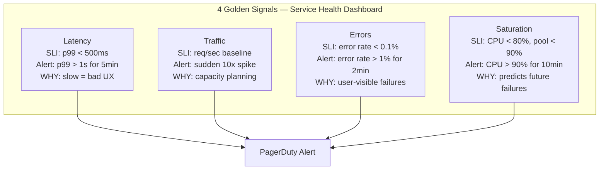

### Concrete SLI Examples by Signal

| Signal | API Service | Database | Message Queue |
|--------|-------------|----------|---------------|
| Latency | p99 HTTP response < 200ms | p99 query time < 50ms | p99 consumer lag < 5s |
| Traffic | 10K req/sec steady | 5K QPS | 100K messages/sec |
| Errors | HTTP 5xx < 0.1% | failed transactions < 0.01% | consumer errors < 0.01% |
| Saturation | CPU < 70%, memory < 80% | connection pool < 85% full | disk < 80% |

### Pitfalls
- ❌ **Only alerting on errors:** A service can have 0% error rate while being at 95% CPU — the next request spike will cause errors. Saturation is a leading indicator.
- ❌ **Using p50 (median) for latency SLI:** p50 latency means 50% of users have slower responses. Always use p99 as the primary latency SLI.
- ❌ **Ignoring implicit errors:** An API that returns HTTP 200 with `{"status": "error"}` is an error. Error rate must include application-level error responses.

### Concept Reference

---

## Q2: Histogram vs counter vs gauge — when to use each with concrete examples?

**Role:** Mid | **Difficulty:** 🟡 | **Priority:** P0 | **Format:** Quick Answer

> **What the interviewer is testing:** Whether you know Prometheus metric types and can choose the right type for a given measurement.

### Answer in 60 seconds
- **Counter:** A monotonically increasing value that only goes up (reset on restart). Use for counting events over time. Examples: `http_requests_total`, `errors_total`, `bytes_sent_total`. Query with `rate()`: `rate(http_requests_total[5m])` = requests/sec over 5 min window.
- **Gauge:** A value that can go up or down. Use for point-in-time measurements. Examples: `memory_usage_bytes`, `active_connections`, `queue_depth`, `cpu_temperature`. Query directly: current goroutine count.
- **Histogram:** Counts observations in configurable buckets. Use for measuring distributions (latency, request size). Provides: `_bucket` (cumulative counts), `_sum` (total sum), `_count` (total count). Query: `histogram_quantile(0.99, http_request_duration_seconds_bucket)` = p99 latency.
- **Summary:** Pre-calculates quantiles client-side. Use only when you need exact quantiles. Downside: cannot aggregate across instances (histograms can). Prefer histogram in almost all cases.
- **Rule of thumb:** Does the value only go up? Counter. Does it fluctuate? Gauge. Do you need percentiles? Histogram.

### Diagram

```mermaid
graph TD
  subgraph Counter["Counter — http_requests_total"]
    C1["T=0: 0 requests"]
    C2["T=60s: 1000 requests (1000 in 60s)"]
    C3["T=120s: 2500 requests (1500 in 60s)"]
    C4["rate — 25 req/sec"]
    C1 --> C2 --> C3 --> C4
  end

  subgraph Gauge["Gauge — active_connections"]
    G1["T=0: 100 connections"]
    G2["T=60s: 250 connections — spike"]
    G3["T=120s: 80 connections — resolved"]
    G1 --> G2 --> G3
  end

  subgraph Histogram["Histogram — http_request_duration_seconds"]
    H1["le=0.1: 8000 requests under 100ms"]
    H2["le=0.5: 9500 requests under 500ms"]
    H3["le=1.0: 9950 requests under 1s"]
    H4["le=+Inf: 10000 total requests"]
    H5["p99 = approximately 950ms"]
    H1 --> H2 --> H3 --> H4 --> H5
  end
```

| Metric Type | Monotonic | Can Go Down | Quantiles | Aggregatable | Use Case |
|-------------|-----------|-------------|-----------|--------------|----------|
| Counter | Yes | No | No | Yes | Request counts, error counts |
| Gauge | No | Yes | No | Yes (avg/sum) | Memory, CPU, queue depth |
| Histogram | No | No | Approximate | Yes | Latency, request size |
| Summary | No | No | Exact | No | Billing, financial accuracy |

### Pitfalls
- ❌ **Using a gauge for request count:** Gauges reset and fluctuate — you cannot reliably compute request rate from a gauge. Use a counter and `rate()`.
- ❌ **Wrong histogram bucket boundaries:** Default buckets target web latencies in seconds. For a database with p99=50ms, define buckets at [0.001, 0.005, 0.01, 0.025, 0.05, 0.1]. Wrong buckets give inaccurate percentile estimates.
- ❌ **Aggregating summaries across instances:** Five instances each report p99=200ms via Summary. You cannot average these — each computed its quantile independently. Use histograms instead; `histogram_quantile()` correctly aggregates across instances.

### Concept Reference

---

## Q3: How do you write alerting rules to minimize false positives?

**Role:** Senior | **Difficulty:** 🔴 | **Priority:** P1 | **Format:** Deep Dive

> **What the interviewer is testing:** Whether you understand alert fatigue, the `for` clause, hysteresis, and alert stability design.

### Problem Constraints
| Dimension | Value |
|-----------|-------|
| Service | Payment API — 10K req/sec |
| Error rate SLO | < 0.1% over any 5-minute window |
| Current alert behavior | Fires 30 times per day; only 2 are real incidents |
| Goal | Less than 3 alert fires per day, 0 missed incidents |

### Approach A — Naive Threshold (what NOT to do)

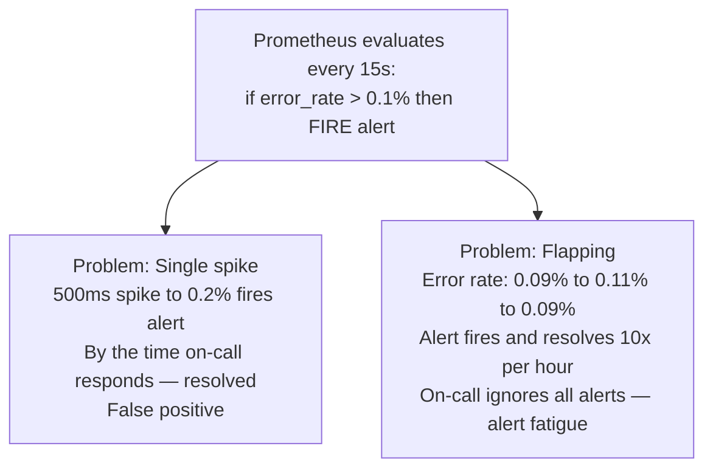

### Approach B — Stabilized Alert with `for` Clause

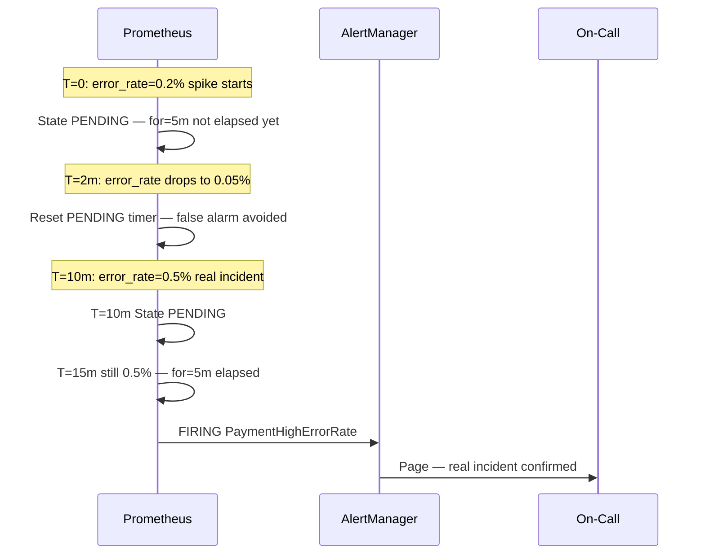

The alert rule uses `for: 5m` — the expression must be continuously true for 5 minutes before firing. A 2-minute spike is ignored. A sustained 5-minute error rate fires exactly once.

### Approach C — Hysteresis (Prevent Flapping on Recovery)

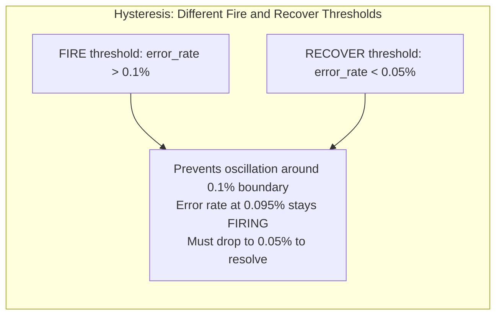

| Design Pattern | Effect | Implementation |
|----------------|--------|----------------|
| `for: 5m` clause | Ignores spikes shorter than 5 minutes | Add `for` to all page-worthy rules |
| Hysteresis | Different fire/recover thresholds | Fire at 0.1%, resolve at 0.05% |
| Longer rate windows | Smooths transient spikes | Use `[5m]` not `[1m]` in `rate()` |
| AlertManager grouping | Deduplicates related alerts | Group by service and severity |
| AlertManager inhibit | Suppresses child alerts during parent | If cluster-down fires, silence service alerts |

### What a great answer includes
- [ ] Explain the `for` clause: alert must be true for N consecutive minutes before firing
- [ ] Define alert fatigue: too many false positives cause on-call to ignore all alerts
- [ ] Hysteresis: fire at 0.1%, recover only at 0.05% — prevents oscillation
- [ ] AlertManager inhibition: silence downstream alerts when upstream alert fires
- [ ] Goal: alert precision (real incidents / total alerts) > 80%

### Pitfalls
- ❌ **`for: 0m` (instant firing):** Every transient spike pages on-call. Alert fatigue develops within a week. Always use `for: 2m` minimum for page-worthy alerts.
- ❌ **Alerting on rate() with 1-minute window:** `rate(errors[1m])` is noisy — a 3-second error burst spikes the 1-minute rate. Use `[5m]` windows for alert stability.
- ❌ **No AlertManager deduplication:** If payment-svc runs on 10 instances and all fire simultaneously, on-call gets 10 identical pages. Configure `group_by: [service, alertname]` to merge into one.

### Concept Reference

---

## Q4: What is multi-window burn rate alerting and why is it better than static thresholds?

**Role:** Senior | **Difficulty:** 🔴 | **Priority:** P1 | **Format:** Deep Dive

> **What the interviewer is testing:** Whether you understand Google SRE's error budget burn rate concept and can implement multi-window alerting for early detection of both fast and slow SLO burns.

### Problem Constraints
| Dimension | Value |
|-----------|-------|
| SLO | 99.9% availability over 30 days |
| Error budget | 0.1% × 30 days × 24h × 3600s = 2,592 seconds (~43 minutes downtime) |
| Goal | Alert when budget burns too fast, before exhaustion |
| Problem with threshold | Static 0.1% misses slow burns; pages too early on short spikes |

### Error Budget Burn Rate Concept

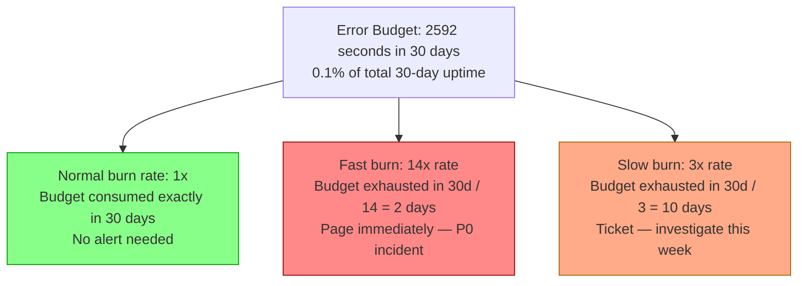

### Multi-Window Burn Rate Logic

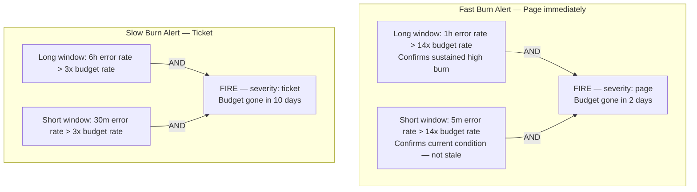

| Alert Type | Burn Rate | Long Window | Short Window | Severity | Budget Horizon |
|------------|-----------|-------------|--------------|----------|----------------|
| Fast burn | 14x | 1h | 5m | Page | 2 days |
| Slow burn | 3x | 6h | 30m | Ticket | 10 days |
| Critical fast | 36x | 5m | 1m | P0 page | 20 hours |

### Why Better Than Static Threshold
- **Static 0.1% threshold:** Fires during normal traffic fluctuations. Does not distinguish "0.2% error for 1 minute" (trivial) from "0.2% error for 3 days" (SLO breach).
- **Burn rate:** Contextualizes the error rate against the SLO time budget. Alert fires proportional to how fast the budget is being spent, not just whether errors exist.
- **Coverage gap of static threshold:** A sustained 0.05% error rate (below threshold) burns 50% of monthly budget in 15 days. Multi-window slow burn catches this. Static threshold misses it entirely.

### What a great answer includes
- [ ] Define error budget: 0.1% SLO = 43.8 minutes downtime/month = 2,592 seconds
- [ ] Explain burn rate multiplier: 1x = budget consumed in 30 days; 14x = 2 days
- [ ] Two-window check: long window (sustained trend) AND short window (current confirmation)
- [ ] Two alert tiers: fast burn pages, slow burn creates a ticket
- [ ] Why static threshold fails: no budget context, false positives on short spikes

### Pitfalls
- ❌ **Single-window burn rate:** A 1-hour window alone can fire after the problem already resolved. Two-window AND ensures the alert reflects current conditions.
- ❌ **Not calculating your specific error budget first:** "14x" is meaningless without knowing your budget. For 99.9%: budget = 43.8 min/month. For 99.99%: budget = 4.38 min/month.
- ❌ **Paging on slow burn:** Slow burn (3x, 10-day horizon) is a ticket not a page. Paging for slow burn causes alert fatigue. Reserve pages for fast burns threatening imminent SLO breach.

### Concept Reference
→ [SLO Error Budgets](./slo-sla-error-budgets)

---

## Q5: How does Prometheus + Thanos provide global query across 1000 services with long-term retention?

**Role:** Senior | **Difficulty:** 🔴 | **Priority:** P1 | **Format:** Deep Dive

> **What the interviewer is testing:** Whether you understand Prometheus's scaling limits and how Thanos extends it to a global, multi-cluster, long-term retention system.

### Problem Constraints
| Dimension | Value |
|-----------|-------|
| Services | 1,000 microservices across 5 Kubernetes clusters |
| Metrics cardinality | 10M active time series |
| Prometheus local retention | 2 weeks |
| Long-term retention requirement | 1 year |
| Query need | "Show me p99 latency for payment-svc across all clusters" |

### Prometheus Scaling Limits

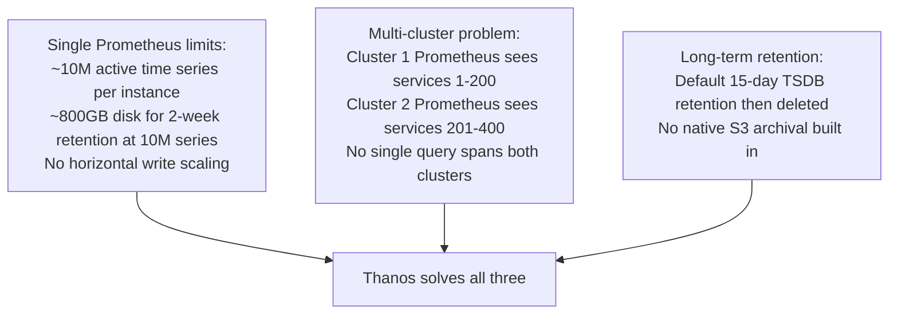

### Thanos Architecture

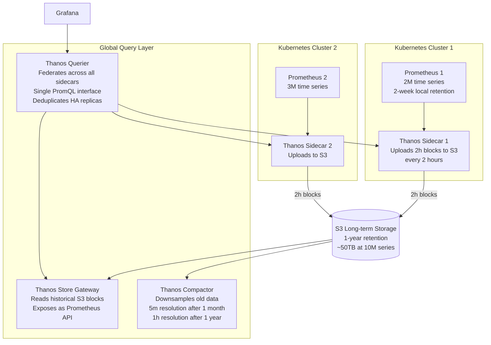

| Component | Role | Scaling |
|-----------|------|---------|
| Prometheus | Local scrape + 2-week TSDB | One per cluster |
| Thanos Sidecar | S3 upload + remote query endpoint | One per Prometheus |
| Thanos Querier | Fan-out query, merge, deduplicate | Stateless, scale horizontally |
| Thanos Store | S3 historical block reader | Scale by S3 partition |
| Thanos Compactor | Downsample and compact S3 blocks | One per S3 bucket (single instance) |

### What a great answer includes
- [ ] State Prometheus single-instance limits (10M series, 2-week retention, no horizontal scale)
- [ ] Explain Thanos Sidecar: uploads 2-hour blocks to S3 every 2 hours
- [ ] Thanos Querier: fan-out query to all sidecars + Store Gateway, deduplicates HA replicas
- [ ] Store Gateway: serves historical S3 blocks as Prometheus API without loading data into RAM
- [ ] Compactor: downsamples old data (1h resolution after 1 year) to reduce query cost

### Pitfalls
- ❌ **Running Thanos Compactor as multiple instances:** Compactor is not horizontally scalable — multiple instances corrupt S3 blocks. Always run exactly one Compactor per S3 bucket.
- ❌ **Not enabling deduplication on Querier:** When two Prometheus instances both scrape the same target (for HA), Thanos Querier sees duplicate series. Set `--query.replica-label=prometheus_replica` for deduplication.
- ❌ **Querying 1 year of raw data without downsampling:** Raw 10M series over 1 year = ~25TB per query scan. Always query downsampled resolution for long time ranges (5m or 1h resolution).

### Concept Reference

---

## Q6: Google Monarch — 1B time series globally with zone-level sharding and Dremel queries

**Role:** Staff | **Difficulty:** ⚫ | **Priority:** P2 | **Format:** Deep Dive

> **What the interviewer is testing:** Whether you know Google's internal monitoring system and can reason about hyperscale metrics architecture — zonal sharding, in-memory storage, and columnar query execution.

### Problem Constraints
| Dimension | Value |
|-----------|-------|
| Active time series | 1 billion (1B) |
| Ingestion rate | 500M samples/sec |
| Query SLA | p99 dashboard load < 5s |
| Global scope | 20+ data center zones worldwide |
| Hot retention | 24h in-memory per zone |
| Cold retention | Years in Colossus (GFS) |

### Architecture

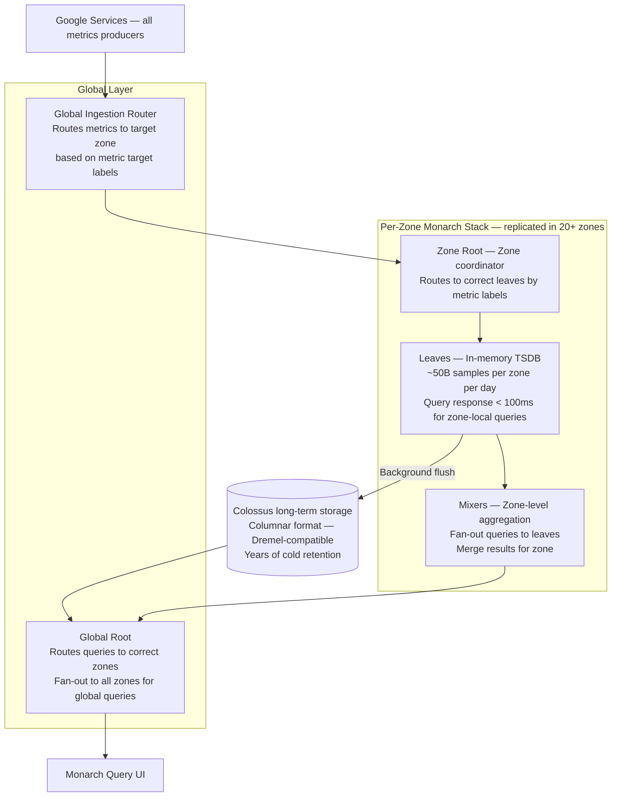

### Zone-Level Sharding

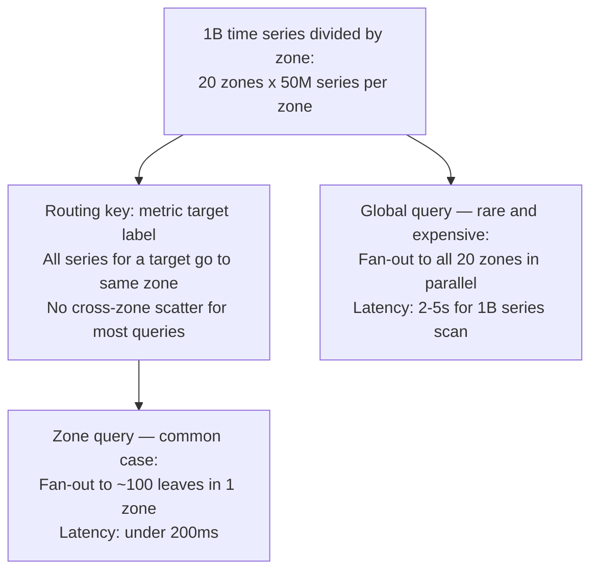

### Dremel Columnar Query

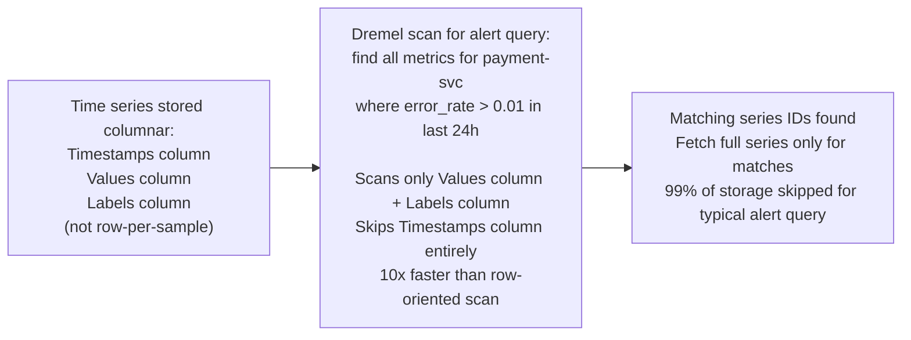

| Dimension | Prometheus + Thanos | Google Monarch |
|-----------|---------------------|----------------|
| Scale | 10M–100M time series | 1B time series |
| Storage model | File-based TSDB blocks | In-memory leaves + Colossus cold |
| Query engine | PromQL (iterative per series) | Dremel columnar scan |
| Global query | Thanos Querier fan-out | Native zone-aware routing |
| Ingestion rate | ~1M samples/sec per Prometheus | 500M samples/sec globally |

### What a great answer includes
- [ ] State the scale: 1B time series, 500M samples/sec, 20+ zones
- [ ] Zone-level sharding: each zone stores 50M series; most queries are zone-local and fast
- [ ] In-memory leaves: 24h of data in RAM for sub-100ms zone-local query response
- [ ] Dremel integration: columnar storage enables scanning only relevant columns for alert evaluation
- [ ] Two-tier storage: hot (24h in-memory) + cold (Colossus for years)

### Pitfalls
- ❌ **Claiming Prometheus scales to 1B series:** Prometheus is a single-node TSDB. Real limit is ~10M series per instance. Monarch's in-memory zone sharding is a fundamentally different architecture.
- ❌ **Treating all queries as global:** Monarch's insight is that most monitoring queries are zone-scoped. Zone-local queries hit 1/20th of infrastructure. Global queries are rare and expensive by design.
- ❌ **Row-oriented storage for alert evaluation:** Scanning 1B time series row-by-row = 1B lookups per alert evaluation. Columnar storage scans only the values column — 10-100x faster for large cardinality analytical queries.

### Concept Reference
