# SLO, SLA, and Error Budgets

6 questions covering reliability metrics from SLI/SLO/SLA definitions to Google SRE's error budget policy.

---

## Q1: What is the difference between SLI, SLO, and SLA?

**Role:** Junior, Mid | **Difficulty:** 🟢 | **Priority:** P0 | **Format:** Quick Answer

> **What the interviewer is testing:** Whether you can define the three reliability concepts precisely and explain who owns each.

### Answer in 60 seconds
- **SLI (Service Level Indicator):** A quantitative measure of service behavior. The *raw metric*. Example: "99.2% of requests returned success in the last 30 days." SLIs are computed from telemetry — metrics, logs, synthetic probes.
- **SLO (Service Level Objective):** An internal target for an SLI. The *goal*. Example: "The SLI for availability must be ≥ 99.9% over any 30-day rolling window." SLOs are owned by engineering teams. Breaching an SLO triggers internal action (freeze deploys, escalate).
- **SLA (Service Level Agreement):** A contractual commitment to an *external customer* with financial consequences for breach. Example: "If monthly availability falls below 99.5%, customers receive a 10% credit." SLAs are owned by product/legal. SLAs are always looser than SLOs (leave buffer between internal goal and contract).
- **Relationship:** SLI ≤ SLO ≤ SLA in strictness. SLI is what you measure. SLO is what you target internally. SLA is what you promise externally.
- **Error budget:** The gap between 100% and the SLO. `Error budget = 1 - SLO`. For 99.9% SLO: error budget = 0.1% of time = 43.8 minutes/month.

### Diagram

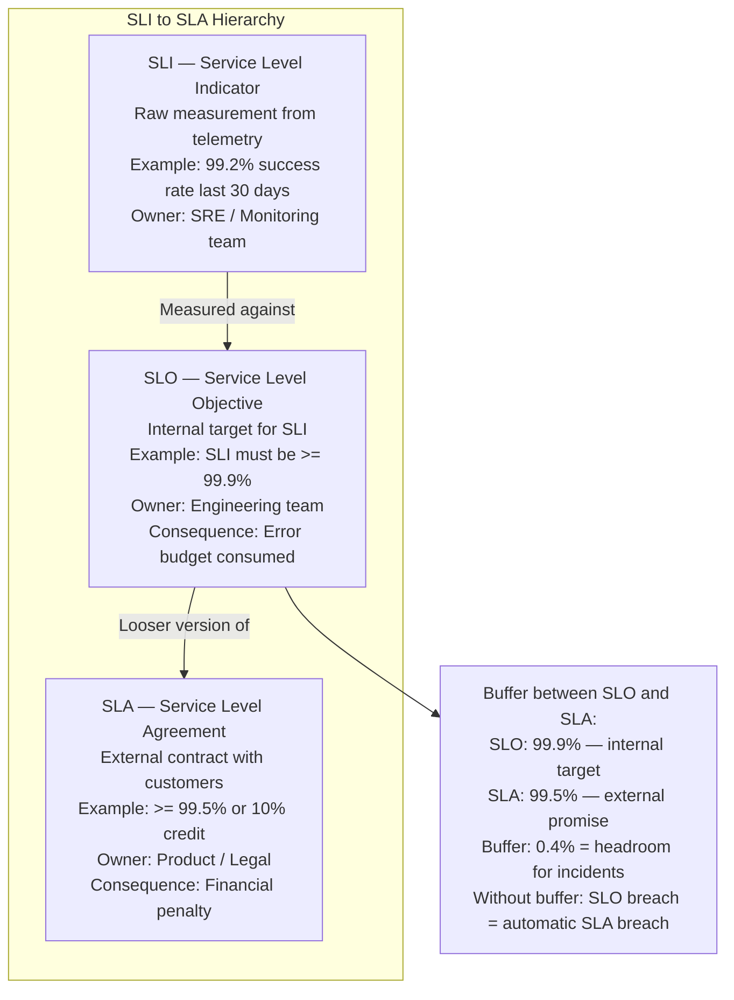

### SLI Types by Service

| Service Type | Latency SLI | Availability SLI | Throughput SLI |
|--------------|-------------|-----------------|----------------|
| HTTP API | p99 < 200ms | 200 responses / total responses > 99.9% | N/A (capacity planning) |
| Database | p99 query < 50ms | queries completed / queries attempted > 99.95% | N/A |
| Message queue | consumer lag < 5s | messages delivered / messages published > 99.99% | N/A |
| Storage | p99 read < 10ms | read success rate > 99.999% | N/A |

### Pitfalls
- ❌ **Setting SLO = SLA:** If your SLO equals your SLA, the first SLO breach immediately violates the contract. Always set SLO 0.3–0.5% stricter than SLA to create a buffer.
- ❌ **SLI over too short a window:** "99.9% in the last 1 minute" is meaningless — a single failed request in 1 minute = 0% SLI. Use 30-day rolling windows for meaningful SLIs.
- ❌ **Only measuring availability, not latency:** A service that returns 200 in 10 seconds is "available" but not useful. SLI must include latency. Standard: "requests returning 2xx in < 500ms / total requests."

### Concept Reference
→ [Observability Fundamentals](../../../09-observability/concepts/observability-fundamentals)

---

## Q2: Error budget calculation — what do different SLO tiers give you in downtime per month?

**Role:** Mid | **Difficulty:** 🟡 | **Priority:** P0 | **Format:** Quick Answer

> **What the interviewer is testing:** Whether you have the SLO/error budget numbers memorized and can translate percentages into real downtime that business stakeholders understand.

### Answer in 60 seconds
- **Error budget formula:** `Error budget per month = (1 - SLO) × 30 days × 24 hours × 3600 seconds`
- **Key numbers to memorize:**
  - 99% SLO → 7.31 hours/month downtime budget
  - 99.9% SLO → 43.8 minutes/month downtime budget
  - 99.95% SLO → 21.9 minutes/month downtime budget
  - 99.99% SLO → 4.38 minutes/month downtime budget
  - 99.999% SLO → 26.3 seconds/month downtime budget
- **How to spend the budget:** The error budget is a policy tool. While budget remains, new features can deploy (risk accepted). When budget is exhausted, freeze non-critical deploys until budget refreshes.
- **Partial request failure:** If 100K req/sec and 0.1% fail, the budget is consumed at 100 failed requests/sec. Budget = 0.1% of total requests, not just time.

### Diagram

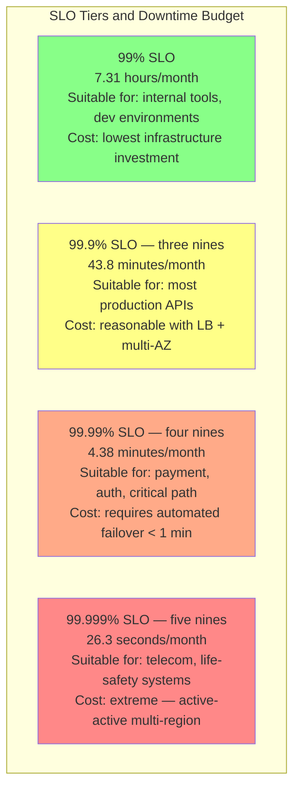

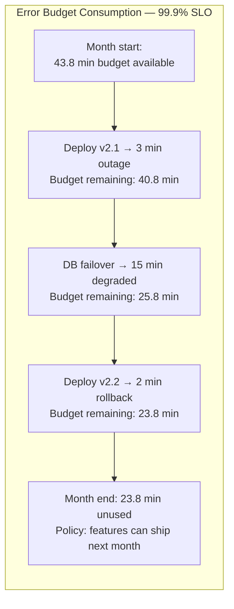

### Pitfalls
- ❌ **Targeting 100% SLO:** Zero error budget means no deploys (every deploy risks an outage). 100% SLO is unachievable and paralyzes engineering. Even Google targets 99.99%, not 100%.
- ❌ **Measuring error budget in minutes only:** For high-traffic APIs, budget in minutes understates impact. 4 minutes of outage at 10K req/sec = 2.4M failed requests. Measure both time and request count.
- ❌ **Resetting error budget on a fixed calendar:** A 30-day rolling window prevents "spend all budget on the first day then be perfect for 29 days." Rolling windows provide continuous accountability.

### Concept Reference
→ [Observability Fundamentals](../../../09-observability/concepts/observability-fundamentals)

---

## Q3: Multi-window burn rate alerting for SLOs — fast burn vs slow burn

**Role:** Senior | **Difficulty:** 🔴 | **Priority:** P1 | **Format:** Deep Dive

> **What the interviewer is testing:** Whether you can design alerting that catches both acute incidents (fast burn) and chronic degradation (slow burn) without false positives.

### Problem Constraints
| Dimension | Value |
|-----------|-------|
| SLO | 99.9% availability (error rate < 0.1%) |
| Error budget | 43.8 minutes/month |
| Fast burn scenario | 2% error rate — budget exhausted in 3.6 hours |
| Slow burn scenario | 0.15% error rate — budget exhausted in 29 days |
| Alert requirement | Catch both; minimize false positives |

### Burn Rate Calculation

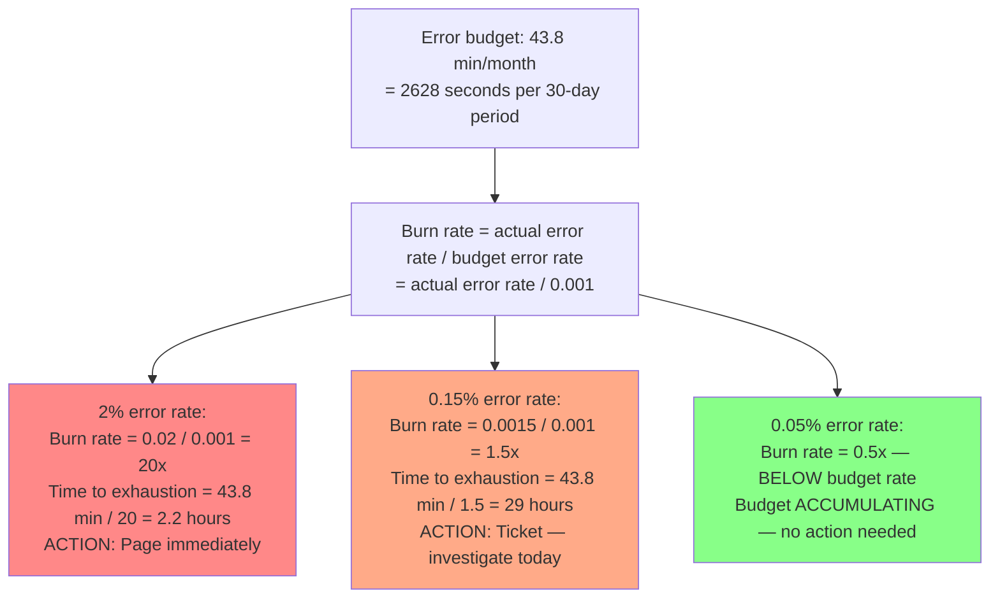

### Two-Window Alert Rules

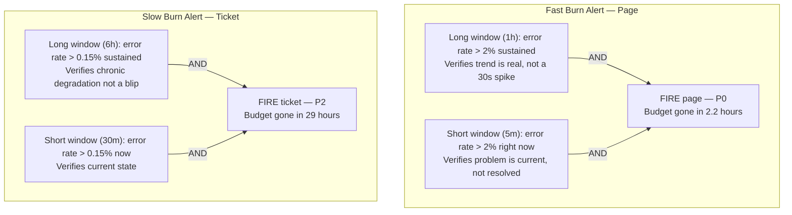

### Why Two Windows?

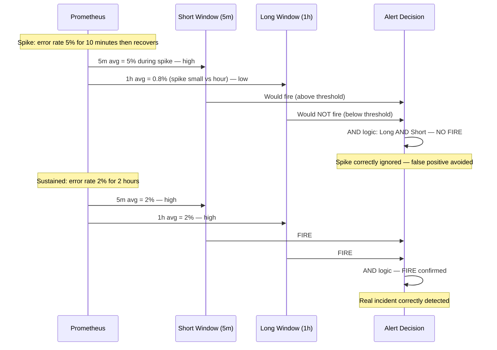

### What a great answer includes
- [ ] Define burn rate: actual error rate / budget error rate (e.g., 2% / 0.1% = 20x)
- [ ] Calculate time to exhaustion: budget minutes / burn rate multiplier
- [ ] Two-window AND logic: long window confirms trend, short window confirms current state
- [ ] Two alert tiers: fast burn (page, budget exhausted in hours) vs slow burn (ticket, days)
- [ ] State the two-window benefit: eliminates false positives from short spikes

### Pitfalls
- ❌ **Single-window alert:** A 5-minute window catches spikes but misses slow burns. A 6-hour window catches slow burns but is stale. Two windows together catch both.
- ❌ **Paging on slow burn (1.5x rate):** 1.5x burn = budget exhausted in ~29 hours. Time to investigate and fix, not wake someone at 3am. Reserve pages for fast burns threatening imminent SLO breach.
- ❌ **Not adjusting burn rate thresholds for your SLO:** These calculations depend on your specific error budget. For 99.99% SLO (budget = 4.38 min/month), a 2% error rate is 20x faster — budget exhausted in 13 minutes. Must recalculate alert thresholds per SLO tier.

### Concept Reference
→ [Observability Fundamentals](../../../09-observability/concepts/observability-fundamentals)

---

## Q4: Why is p99 the right SLI for latency APIs — not p50?

**Role:** Senior | **Difficulty:** 🔴 | **Priority:** P1 | **Format:** Quick Answer

> **What the interviewer is testing:** Whether you understand percentile semantics, the long tail problem, and why p50 (median) hides user-impacting latency.

### Answer in 60 seconds
- **p50 (median) is a lie:** If p50 latency = 50ms, it means 50% of requests are faster. But it says nothing about the other 50%. Your slowest requests could be 10 seconds — users are suffering while p50 looks fine.
- **p99 SLI:** 99% of requests complete in under X milliseconds. Only 1% are slower. This directly corresponds to user experience: for a service handling 1K req/sec, p99=500ms means 10 users/sec wait over 500ms.
- **p99.9 for tail:** At 10K req/sec, p99.9 = 1 user/sec experiencing tail latency. For payment flows, this matters.
- **Why p50 is actively harmful as an SLI:** p50 can improve as you add caching for common cases while the slowest requests (cold cache, DB queries, heavy users) get worse. p50 goes down, p99 goes up — your SLI looks better while user experience degrades.
- **Relationship:** A well-designed system has p99 < 3-5x p50. If p99 = 10x p50, investigate the long tail — often a specific slow query, GC pause, or lock contention.

### Diagram

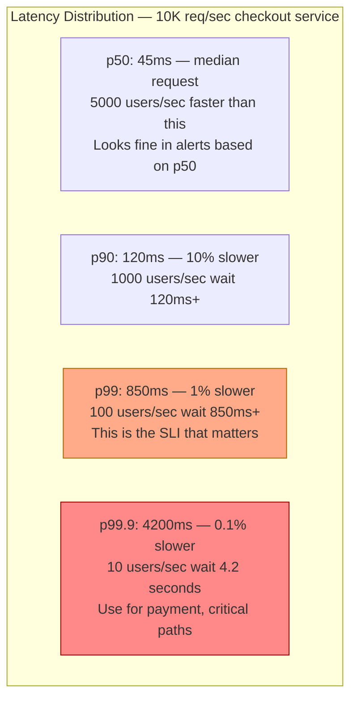

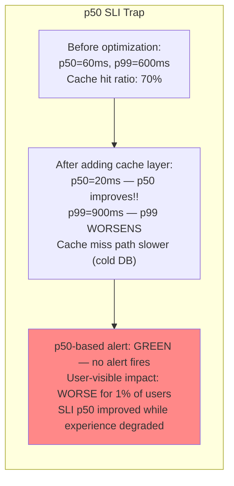

| Percentile | Users affected at 10K req/sec | When to use as SLI |
|------------|-------------------------------|--------------------|
| p50 | 5,000/sec (below this are faster) | Never as primary SLI |
| p90 | 1,000/sec experience worse | Leading indicator |
| p99 | 100/sec experience worse | Primary SLI for APIs |
| p99.9 | 10/sec experience worse | SLI for financial transactions |

### Pitfalls
- ❌ **Setting SLO on p50:** p50 SLO will always look fine while your users suffer. Never use p50 as an SLI for user-facing services.
- ❌ **Using averages instead of percentiles:** Average latency = (sum of all latencies) / count. A 10-second outlier is diluted by thousands of 50ms requests. Average hides the tail entirely. Use histograms and `histogram_quantile()`.
- ❌ **Ignoring the p99.9 for critical paths:** Payment APIs where a 4-second experience causes a user to abandon their cart — that 0.1% (10 users/sec at 10K req/sec) is 864K users/day. Calculate impact in absolute users, not percentages.

### Concept Reference
→ [Observability Fundamentals](../../../09-observability/concepts/observability-fundamentals)

---

## Q5: Error budget exhausted — what is the policy and process?

**Role:** Senior | **Difficulty:** 🔴 | **Priority:** P1 | **Format:** Quick Answer

> **What the interviewer is testing:** Whether you understand the operational and organizational process when the error budget runs out, not just the math.

### Answer in 60 seconds
- **Error budget exhausted means:** The SLO was breached for the current 30-day window. Every additional failure goes against the SLA buffer. The team is now burning customer trust, not internal budget.
- **Immediate actions (within 24 hours):**
  1. Freeze all non-critical production deployments until budget resets
  2. Escalate to product/engineering leadership — SLO breach is a business risk signal
  3. Identify root cause of the consumption (incident postmortem if applicable)
  4. Define and prioritize reliability work for the next sprint
- **Deployment freeze policy:** Only P0 security patches and critical bug fixes can be deployed. Feature work halts. This makes reliability debt visible to product management — features compete with reliability.
- **Negotiation:** If the product team believes a feature is more valuable than reliability, they can formally override the freeze and accept the reliability risk. This makes the trade-off explicit.
- **Budget recovery:** Budget refreshes on the rolling 30-day window. Each day without failures restores budget. Track remaining budget real-time on dashboards visible to all engineers.

### Diagram

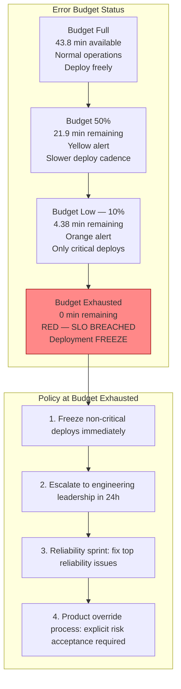

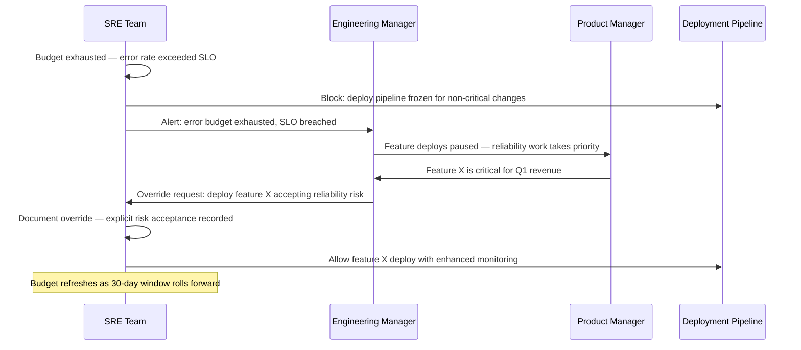

### What a great answer includes
- [ ] Immediate policy: freeze non-critical deploys when budget is zero
- [ ] Escalation: notify leadership within 24 hours — SLO breach is a business risk
- [ ] Root cause: postmortem to understand what consumed the budget
- [ ] Override process: product can override freeze with explicit risk acceptance (documented)
- [ ] Recovery: rolling 30-day window auto-restores budget as past incidents age out

### Pitfalls
- ❌ **No deployment freeze policy:** "We'll be more careful" is not a policy. Without a formal freeze, the next deployment breach goes unnoticed and the SLO continues to worsen.
- ❌ **Not communicating SLO status to product:** If product does not see error budget status, they will schedule deployments without understanding reliability risk. Make the budget dashboard visible to all stakeholders.
- ❌ **Resetting the error budget manually:** Budget resets only via the rolling time window. If a single major incident consumed all budget, the team must improve reliability — not petition for a reset to avoid accountability.

### Concept Reference
→ [Incident Response](./incident-response-systems)

---

## Q6: Google SRE error budget policy — how it balances reliability vs feature velocity

**Role:** Staff | **Difficulty:** ⚫ | **Priority:** P2 | **Format:** Deep Dive

> **What the interviewer is testing:** Whether you understand how Google operationalized the error budget concept to create a self-regulating system between SRE reliability goals and product velocity.

### Problem Constraints
| Dimension | Value |
|-----------|-------|
| Context | Google SRE teams each own SLOs for services they support |
| Conflict | Product teams want to ship faster; SREs want fewer incidents |
| Solution | Error budget as shared currency between both teams |
| Book reference | Google SRE Book (2016), Chapter 3: Embracing Risk |

### The Core Policy

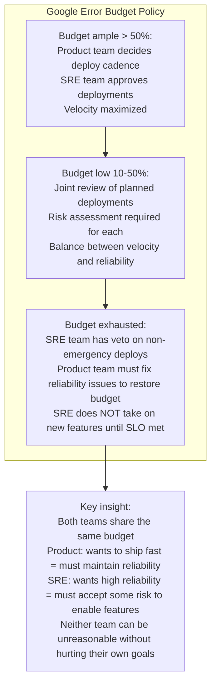

### Budget as Negotiation Tool

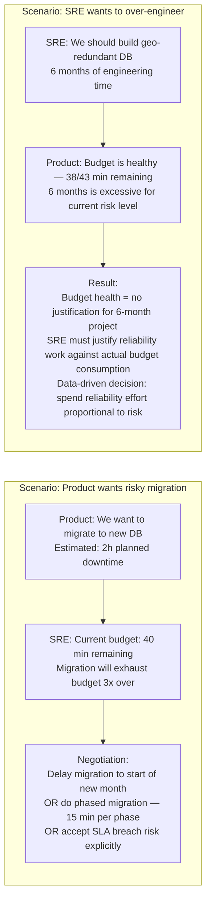

### Toil Budget as Sister Concept

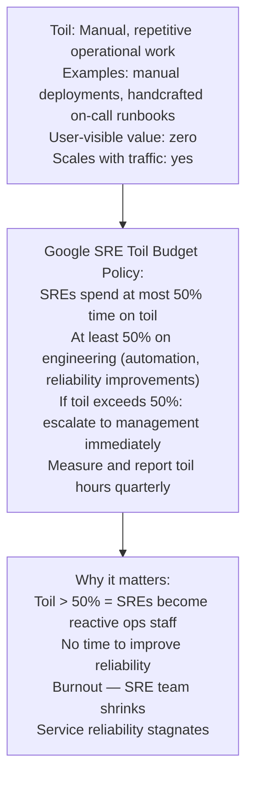

| Metric | Google SRE Target | Why |
|--------|-------------------|-----|
| Toil fraction | < 50% of SRE time | Preserve engineering time for reliability improvements |
| SLO achievement | 99.9–99.99% depending on service | Budget headroom to ship features |
| On-call burden | < 2 incidents per 12-hour shift | Prevent burnout; allow proper investigation |
| Postmortem completion | 100% of P0/P1 incidents | Learning culture; prevent recurrence |
| Error budget consumption | < 100% over 30 days | SLO is met; velocity can continue |

### What a great answer includes
- [ ] Describe error budget as shared currency: product wants velocity, SRE wants reliability
- [ ] Three-tier policy: ample budget (velocity), low budget (joint review), exhausted (SRE veto)
- [ ] Toil budget: SREs spend < 50% time on manual work or escalate
- [ ] Data-driven reliability: reliability investment justified by actual budget consumption — not intuition
- [ ] Organizational dynamic: error budget makes the reliability/velocity trade-off explicit and measurable

### Pitfalls
- ❌ **SRE team acting as gatekeeper without shared accountability:** If SRE can block deploys without sharing in the business consequences, they become obstacles. Error budget gives SRE the authority AND the accountability — they must also accept risk to enable velocity.
- ❌ **Setting SLOs that are too strict:** If the SLO is 99.99% but the service has never achieved it historically, the budget is always exhausted. Start with achievable SLOs based on historical performance, then tighten gradually.
- ❌ **Ignoring toil:** A team spending 80% on toil (manual deployments, handcrafted runbooks) has no capacity to improve reliability. Toil measurement is as important as SLO measurement in Google's framework.

### Concept Reference
→ [Observability Fundamentals](../../../09-observability/concepts/observability-fundamentals)
