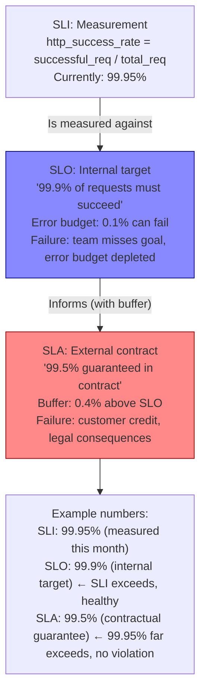
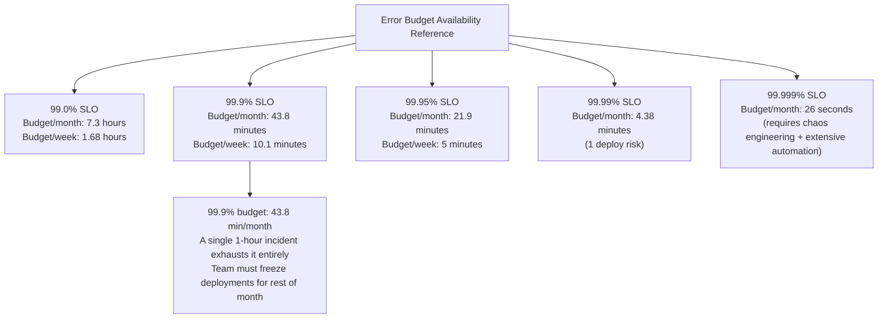
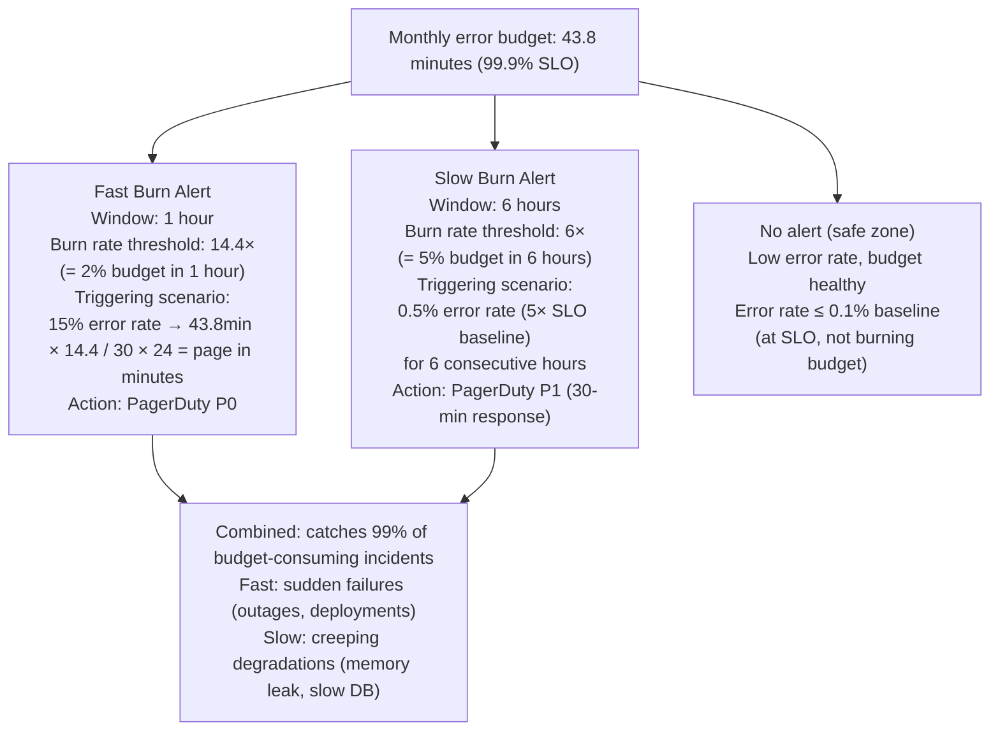
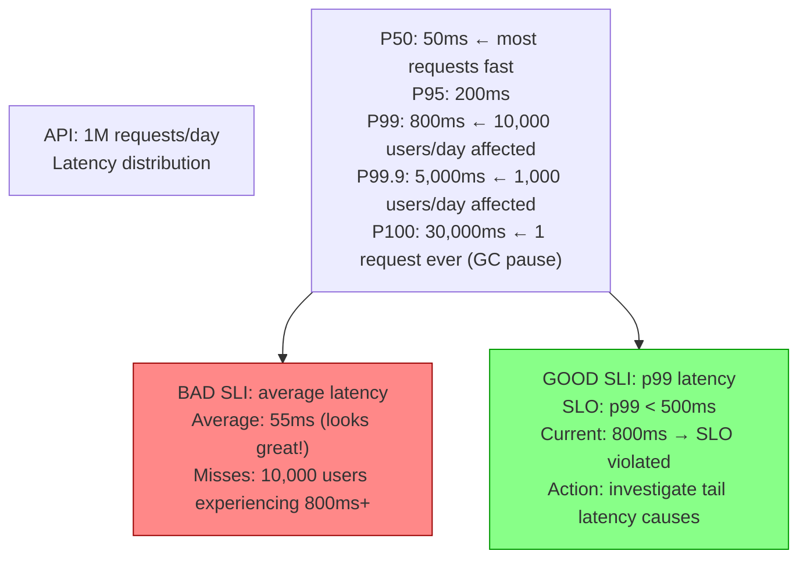
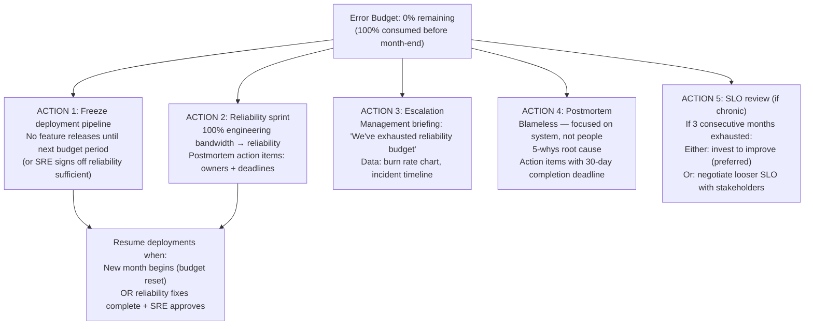
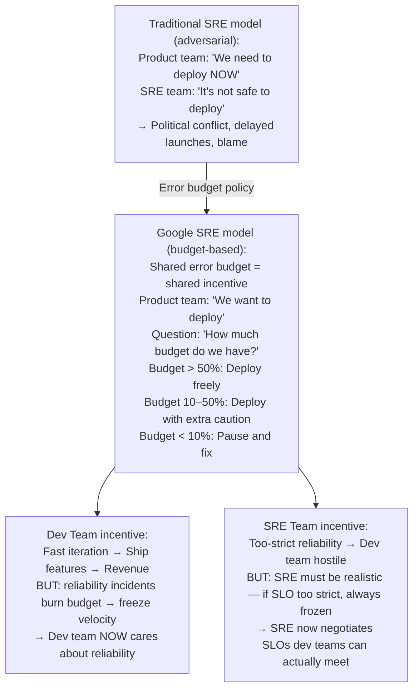
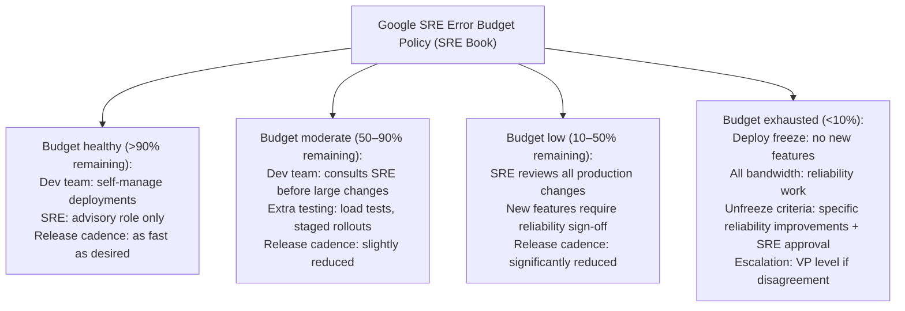

# SLOs, SLAs & Error Budgets

6 questions covering reliability engineering from SLI/SLO/SLA definitions to Google's error budget policy.

---

## Q1: What are SLI, SLO, and SLA, and how do they relate?

**Role:** Junior, Mid | **Difficulty:** 🟢 | **Priority:** P0 | **Format:** Quick Answer

> **What the interviewer is testing:** Whether you know the three-layer reliability hierarchy from Google's SRE Book and can explain each with a concrete example.

### Answer in 60 seconds
- **SLI (Service Level Indicator):** A measurable property of a service's behaviour. A specific metric that captures user-perceived reliability. Examples: request success rate, p99 latency, availability percentage.
- **SLO (Service Level Objective):** A target value or range for an SLI. The internal reliability goal the team commits to maintaining. Example: "99.9% of requests to the payment API succeed" or "p99 latency < 500ms." SLOs are internal — failure disappoints the team and depletes error budget.
- **SLA (Service Level Agreement):** A contract with customers (external) that includes remedies if SLOs are not met. Typically less strict than the internal SLO (buffer between promise and target). Example: "We guarantee 99.5% uptime. If we fall below, customers receive a 10% service credit." SLAs are external — failure has legal and financial consequences.
- **Relationship:** SLI is measured → compared to SLO target → if SLO missed, SLA may be violated. The hierarchy: SLA is the promise (loose), SLO is the target (tight), SLI is the measurement (objective).
- **Buffer strategy:** If your SLO is 99.9%, set your SLA at 99.5%. The 0.4% buffer gives you room to miss the SLO without immediately violating the SLA. This is why AWS guarantees 99.95% on services they operate at 99.99% internally.

### Diagram

### Pitfalls
- ❌ **Setting SLO = SLA:** No buffer means any SLO miss immediately violates the SLA. You need a buffer to have time to fix issues before contractual consequences. Never equate SLO to SLA.
- ❌ **SLO that isn't measurable:** "Good user experience" is not an SLI. "p99 latency < 500ms for GET /checkout, measured over 1-minute windows" is an SLI. SLIs must be precise and automatically measurable.
- ❌ **Too many SLOs:** One critical service may have 2–3 SLOs (availability, latency, correctness). Having 50 SLOs per service creates metric overload — no one knows which matters. Prioritise the 2–3 most user-impactful SLIs per service.

### Concept Reference
→ [SRE Practices](../../../09-observability/concepts/slo-sla-fundamentals)

---

## Q2: How do you calculate an error budget — 99.9% SLO = how many minutes?

**Role:** Mid | **Difficulty:** 🟡 | **Priority:** P0 | **Format:** Quick Answer

> **What the interviewer is testing:** Whether you can perform the error budget calculation and understand what error budget enables — the balance between reliability and velocity.

### Answer in 60 seconds
- **Error budget definition:** The allowable amount of unreliability within the SLO target. If SLO = 99.9%, the error budget = 1 - 0.999 = 0.001 = 0.1% of the time/requests can be "bad."
- **Calculating downtime budget (availability SLO):**
  - 99% SLO: 1% of year = 3.65 days, 1% of month = 7.3 hours, 1% of week = 1.68 hours
  - 99.9% SLO: 0.1% of year = 8.77 hours, 0.1% of month = 43.8 minutes, 0.1% of week = 10.1 minutes
  - 99.95% SLO: 0.05% of year = 4.38 hours, 0.05% of month = 21.9 minutes
  - 99.99% SLO: 0.01% of month = 4.38 minutes
- **Calculating request budget (latency/error rate SLO):** At 1M requests/day with 99.9% SLO: 0.1% × 1M = 1,000 requests/day can fail (or be slow). At 100K req/sec: 0.1% = 100 errors/sec allowed.
- **What the error budget enables:** When error budget is healthy (>50% remaining), teams can deploy frequently, run experiments, and move fast. When error budget is low (<10% remaining), freeze features, focus on reliability. The budget *quantifies* how much risk is acceptable.

### Diagram

### Pitfalls
- ❌ **Treating error budget as a per-incident allowance:** "We had one outage and that consumed our budget — we're done for the month" is correct, but the *response* (freeze deployments) is what matters. Error budget is not a free pass for 43.8 minutes of downtime.
- ❌ **Not tracking error budget in real-time:** Budget must be tracked continuously, not checked monthly. If you've consumed 80% in day 3 of a 30-day month, alert immediately — don't discover it at month-end.
- ❌ **Confusing availability budget with request budget:** 43.8 minutes of downtime (availability) vs 0.1% of requests failing are different budget types. A service can be "up" (responding) but failing 1% of requests — that exhausts the request error budget without downtime.

### Concept Reference
→ [SRE Practices](../../../09-observability/concepts/slo-sla-fundamentals)

---

## Q3: What is burn rate alerting — fast burn vs slow burn?

**Role:** Senior | **Difficulty:** 🔴 | **Priority:** P1 | **Format:** Quick Answer

> **What the interviewer is testing:** Whether you understand the Google SRE Workbook's burn rate alerting framework — the best practice for SLO-aligned alerting.

### Answer in 60 seconds
- **Burn rate:** How quickly you're consuming your error budget. Burn rate 1 = consuming at exactly the rate that would exhaust the budget over the SLO window (typically 30 days). Burn rate 10 = consuming 10× faster, exhausting in 3 days.
- **Simple threshold problem:** `error_rate > 0.1%` fires immediately on any breach, including 30-second transient spikes that consume 0.001% of budget. High false positive rate. And it won't catch a sustained 0.05% error rate (2× the SLO baseline) draining budget over a week.
- **Fast burn alert:** Target: catch incidents that will exhaust the budget in <1 hour.
  - Window: 1 hour
  - Condition: budget_consumed_in_1h > 2% (burn rate = 14.4× for 30-day SLO)
  - Action: page immediately, P0 response
  - Scenario: 15% error rate for 30 minutes = consuming 2.8% of monthly budget in 1 hour
- **Slow burn alert:** Target: catch sustained degradation that will exhaust budget in <3 days.
  - Window: 6 hours
  - Condition: budget_consumed_in_6h > 5% (burn rate = 6× for 30-day SLO)
  - Action: page, P1 response (30-minute SLA)
  - Scenario: 0.5% error rate (5× baseline) for 6 hours = consuming 1% of monthly budget
- **Combined:** Fast burn catches sudden failures; slow burn catches slow leaks. Together they detect 99% of budget-significant incidents.

### Diagram

### Pitfalls
- ❌ **Single-window alert only:** Using only a 1-hour window misses sustained low-rate incidents (0.2% error rate for 5 days). Using only a 6-hour window is too slow to catch sudden outages (100% error rate for 5 minutes). You need both.
- ❌ **Burning entire budget before alerting:** If you alert only when 100% of budget is consumed, you have no capacity to degrade gracefully or implement mitigations. Alert at 2% consumed in 1 hour (fast) and 5% in 6 hours (slow).
- ❌ **Burn rate alerting without a defined SLO:** Burn rate requires a budget to burn against. If there's no SLO, there's no budget, and burn rate alerting is impossible. Define the SLO first.

### Concept Reference
→ [SRE Practices](../../../09-observability/concepts/slo-sla-fundamentals)

---

## Q4: How do you choose the right SLI for a latency-sensitive API?

**Role:** Senior | **Difficulty:** 🔴 | **Priority:** P1 | **Format:** Quick Answer

> **What the interviewer is testing:** Whether you know why p50 latency is insufficient as an SLI for user experience and can articulate the percentile selection trade-offs.

### Answer in 60 seconds
- **p50 lies:** p50 (median) reflects the experience of the "average" user. If 49% of requests are 1ms and 51% are 1ms, p50=1ms. But if 10% of requests are 5,000ms, p50 still looks fine at 1ms. The 10% with 5,000ms response are having a terrible experience — p50 doesn't reflect this.
- **p99 is the gold standard for latency SLIs:** The 99th percentile means 1% of users experience this latency or worse. For a service with 1M requests/day, 1% = 10,000 users/day experiencing ≥p99 latency. p99 captures the tail experience and is what high-volume services must optimise.
- **p999 for extreme tail sensitivity:** Some systems need p99.9 (1 in 1,000 experiences bad latency). Payment systems, trading platforms. Very hard to optimise — p999 is sensitive to garbage collection pauses, network jitter, lock contention.
- **Why not p100 (max)?** Maximum is the worst single request ever seen. Outliers (JVM warmup, OS scheduling jitter, one-time DNS lookup) cause p100 spikes that aren't reproducible. p100 alerts create false positives. Use p99 or p99.9 for actionable SLIs.
- **Choosing the right percentile:**
  - B2C (consumer) service: p99 (1% bad = real user impact at scale)
  - Payment / financial: p99.9 (1 in 1000 unacceptable)
  - Internal service: p95 (5% acceptable for internal use cases)
  - Real-time / gaming: p99 or p99.9 (latency variance directly impacts experience)

### Diagram

### Pitfalls
- ❌ **SLO on p99 across all endpoints equally:** A p99 SLO for `GET /health` (returns 200 instantly) mixed with `POST /checkout` (complex operation) averages them together. `/health` at 1ms pulls down the average p99. Set separate SLOs per critical endpoint.
- ❌ **Not separating read vs write latency SLOs:** Write paths (DB inserts, external API calls) are inherently slower than read paths. A single p99 SLO covering both will either be too strict for writes or too lenient for reads.
- ❌ **Setting p99 SLO without knowing the distribution:** If you've never measured p99 latency, you don't know if 500ms is achievable. Measure first, set baseline, then set SLO at 2× the current p99 (provides buffer for growth). Tighten quarterly.

### Concept Reference
→ [SRE Practices](../../../09-observability/concepts/slo-sla-fundamentals)

---

## Q5: What happens when the error budget is exhausted?

**Role:** Senior | **Difficulty:** 🔴 | **Priority:** P1 | **Format:** Quick Answer

> **What the interviewer is testing:** Whether you understand the error budget as an operational policy tool — what specific actions trigger when the budget is depleted.

### Answer in 60 seconds
- **Step 1 — Stop all feature deployments:** Freeze the release pipeline. No new code goes to production until the budget is replenished (next month reset, or reliability work is completed). This is the fundamental error budget policy — it converts reliability into a shared incentive between dev and SRE.
- **Step 2 — Prioritise reliability work:** Engineering capacity immediately shifts to postmortem actions, root cause fixes, reliability improvements. Product roadmap features are deprioritised. The team knows the cost of reliability failures in concrete terms (budget depleted, velocity frozen).
- **Step 3 — Escalate to management:** If budget exhaustion is due to persistent issues rather than a single incident, escalate to leadership with budget burn rate data. "We've consumed 100% of our monthly error budget by day 10" is a concrete, understandable signal.
- **Step 4 — Incident review:** Mandatory blameless postmortem for any incident that consumed >20% of monthly budget. Action items with owners and deadlines.
- **Step 5 — Consider SLO revision:** If budget is consistently exhausted (3 months in a row), the SLO may be unrealistic for the current system maturity. Either invest in reliability or revise the SLO with stakeholder agreement.
- **Recovery:** Error budget resets at the start of each SLO window (typically monthly). If you replenish the budget by fixing reliability issues early, deployments resume.

### Diagram

### Pitfalls
- ❌ **No policy written down:** "We'll figure it out when budget depletes" leads to political arguments. Document the error budget policy before the first exhaustion event. The policy should specify exactly what freezes, who decides to unfreeze, and what work is required.
- ❌ **SRE team unilaterally freezing deployments without dev team buy-in:** Error budget policy works only when both dev and SRE teams agreed to it in advance. Surprising the product team with a deployment freeze during a feature launch creates conflict. Establish the policy as a shared agreement at team formation.
- ❌ **Resuming deployments automatically at month start without postmortem:** If you exhausted the budget due to a recurring issue and deploy again without fixing it, you'll exhaust next month's budget too. Month start should reset the budget counter but not clear the requirement for reliability work.

### Concept Reference
→ [SRE Practices](../../../09-observability/concepts/slo-sla-fundamentals)

---

## Q6: How does Google balance reliability vs feature velocity with error budget policy?

**Role:** Staff | **Difficulty:** ⚫ | **Priority:** P2 | **Format:** Deep Dive

> **What the interviewer is testing:** Whether you understand the cultural and organisational dimension of SRE error budget policy — how Google uses the budget to create shared incentives between product and SRE teams.

### Problem Constraints
| Dimension | Value |
|-----------|-------|
| Core tension | Product wants to ship fast; SRE wants reliability |
| Traditional approach | SRE as gatekeeper → adversarial relationship |
| Google's insight | Use error budget as a shared currency, not a gate |
| Outcome | Dev teams self-regulate deployments based on budget health |

### Error Budget as Shared Incentive

### Google's Published Error Budget Policy

### Recommended Answer
Google's error budget policy converts reliability from a gatekeeper mechanism into a self-regulating incentive system. The core insight from the SRE Book (Chapter 3): "If product development wants to move faster, they need to invest in reliability — because it's reliability incidents that burn their error budget and slow their releases."

**Alignment mechanism:** Dev and SRE teams co-own the SLO and the error budget. Dev teams have strong motivation to write reliable code: unreliable code burns the budget, and a depleted budget freezes their own feature velocity. SRE teams have motivation to set realistic SLOs: if SLOs are impossible to meet, the budget is always zero and nobody can deploy anything.

**Quarterly SLO review:** Teams meet quarterly to review the SLO against actual performance. If the SLO was met with >50% budget remaining every month, tighten it (better reliability). If budget was exhausted multiple months, either invest in reliability or loosen the SLO with stakeholder agreement.

**The "toil reduction" mechanism:** SRE teams are budgeted 50% of their time on engineering (automation, tooling) and 50% on operational work. If operational (toil) work exceeds 50%, SRE escalates — this signals that the service needs more automation investment. The error budget converts this abstract principle into concrete data.

**Result:** Google reports that this model dramatically reduced tension between product and SRE organisations. Dev teams became proactive about reliability (they have financial incentive: reliability = deployment velocity). SRE became more product-aligned (they understand the velocity cost of strict SLOs).

### What a great answer includes
- [ ] Error budget as shared currency: dev teams self-regulate based on budget health
- [ ] Four budget zones: healthy (self-manage) → moderate (consult) → low (SRE review) → exhausted (freeze)
- [ ] Alignment: dev teams gain reliability incentive; SRE teams gain realism incentive
- [ ] Quarterly SLO review: tighten when budget is surplus, loosen when chronically exhausted
- [ ] Cultural shift: error budget ends the SRE-as-gatekeeper adversarial dynamic

### Pitfalls
- ❌ **Error budget without a public policy document:** The policy only works if everyone knows the rules in advance. "We freeze deployments when budget is exhausted" must be written down and agreed by product, engineering, and leadership — not invented during the crisis.
- ❌ **SRE team owning the budget unilaterally:** If SRE can invoke the budget freeze without dev team agreement, it becomes a political weapon. Budget policy should be agreed jointly, with VP-level escalation path for disputes — not unilateral SRE authority.
- ❌ **Resetting budget mid-month after an incident:** "That outage wasn't our fault (third-party dependency), so we shouldn't burn budget." This undermines the policy. Budget represents user impact, regardless of root cause. Reserve vendor credit or SLA violations as separate tracks.

### Concept Reference
→ [SRE Practices](../../../09-observability/concepts/slo-sla-fundamentals)
