# API Security Patterns

7 questions covering API security from injection prevention to STRIDE threat modeling and Stripe-level abuse defense.

---

## Q1: SQL injection prevention — parameterized queries vs ORM vs input validation

**Role:** Junior, Mid | **Difficulty:** 🟢 | **Priority:** P0 | **Format:** Quick Answer

> **What the interviewer is testing:** Whether you understand why parameterized queries are the correct defense (not just input validation) and what each layer of defense provides.

### Answer in 60 seconds
- **SQL injection:** User input is concatenated into a SQL string and executed. The DBMS cannot distinguish between data and SQL commands. Result: data exfiltration, authentication bypass, data destruction.
- **Parameterized queries (prepared statements):** SQL structure is compiled separately from user data. The DBMS treats parameters as data, never as SQL. Even `' OR 1=1 --` becomes literal string data — the query structure cannot be altered.
- **ORM:** A higher-level abstraction that generates parameterized queries automatically. Reduces direct SQL exposure. Risk: raw query escape hatches (`.raw()`, `$queryRaw`) bypass ORM protections — review all raw query usage.
- **Input validation:** Reject unexpected characters before they reach the query. Useful defense-in-depth but not a primary defense — a clever payload can bypass string sanitization. Never rely on it alone.
- **Stored procedures:** SQL logic lives in the DB, not the application. Reduces injection surface but does not eliminate it if stored procedures use dynamic SQL internally.

### Diagram

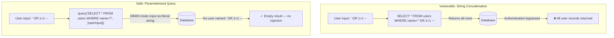

### Defense Layers

| Layer | Defense | Bypassed by |
|-------|---------|-------------|
| Parameterized queries | Separates SQL from data | Nothing — always effective |
| ORM | Auto-parameterizes standard queries | Raw query escape hatches |
| Input validation | Blocks known-bad patterns | Novel encodings, Unicode tricks |
| Least-privilege DB account | Limits blast radius | Unrelated |
| WAF (Web Application Firewall) | Blocks known SQL injection patterns | Custom payloads, obfuscation |

### Pitfalls
- ❌ **Using input validation as the primary defense:** Blacklisting characters like `'`, `;`, `--` is bypassable via encoding (`%27` for `'`, `CHAR(39)`, Unicode lookalikes). Parameterized queries are the only correct primary defense.
- ❌ **ORM raw query methods:** Frameworks always provide escape hatches for complex queries. Treat `.raw()` / `$queryRaw` / `.execute()` with the same scrutiny as manual SQL — always use bind parameters.
- ❌ **Error messages exposing DB structure:** SQL error messages leak table names, column names, and DB version. Catch SQL exceptions and return generic errors. Log details server-side only.

### Concept Reference
→ [Zero Trust Architecture](./zero-trust-architecture)

---

## Q2: Stored vs reflected vs DOM-based XSS — mitigation for each

**Role:** Mid | **Difficulty:** 🟡 | **Priority:** P0 | **Format:** Quick Answer

> **What the interviewer is testing:** Whether you can distinguish the three XSS types by attack origin and apply the correct mitigation for each.

### Answer in 60 seconds
- **Reflected XSS:** Malicious script in the URL parameter is reflected by the server in the response HTML. Victim clicks attacker's crafted link. Mitigation: output encode all user-controlled data in HTML responses.
- **Stored XSS:** Attacker stores a script in the application's DB (e.g., a comment, username). Every user who views the page executes the script. Highest impact. Mitigation: output encode on render, validate/sanitize on write.
- **DOM-based XSS:** Malicious payload never reaches the server. Client-side JavaScript reads from `window.location`, `document.referrer`, or similar and writes to `innerHTML` without sanitization. Mitigation: never write user-controlled data to `innerHTML` — use `textContent` or DOM creation APIs.
- **Output encoding:** Convert `<` to `&lt;`, `>` to `&gt;`, `"` to `&quot;` before inserting data into HTML context. Different contexts need different encoding: HTML, JS string, URL, CSS.
- **Content Security Policy (CSP):** HTTP header that restricts which scripts can execute. `script-src 'self'` prevents inline scripts and scripts from external domains. Reduces exploitability of XSS when injection bypasses output encoding.

### Diagram

```mermaid
graph TD
  subgraph Reflected["Reflected XSS"]
    Attack1["Attacker crafts URL:<br/>site.com/search?q=<script>steal()</script>"]
    Attack1 -->|"Victim clicks link"| Server1[Server]
    Server1 -->|"Returns HTML with unsanitized q param"| Browser1[Browser]
    Browser1 -->|"Executes script"| Result1["Steals session cookie"]
    Mitigation1["Fix: Output encode q value: &lt;script&gt;..."]
  end

  subgraph Stored["Stored XSS"]
    Attack2["Attacker posts comment: <script>steal()</script>"]
    Attack2 -->|"Stored in DB"| DB[Database]
    DB -->|"Every page view renders the comment"| Browser2[All visitors' browsers]
    Browser2 -->|"Executes script for every visitor"| Result2["Mass session theft"]
    Mitigation2["Fix: Sanitize on write (strip tags) + encode on render"]
  end

  subgraph DOM["DOM-based XSS"]
    Attack3["URL: site.com/page#<img onerror=steal()>"]
    Attack3 -->|"JS reads window.location.hash"| JS[Client JS]
    JS -->|"document.getElementById('out').innerHTML = hash"| Browser3[Browser]
    Browser3 -->|"Parses and executes onerror handler"| Result3["Script executed — no server involved"]
    Mitigation3["Fix: Use textContent not innerHTML<br/>Or sanitize with DOMPurify before innerHTML"]
  end
```

### Pitfalls
- ❌ **Trusting CSP as the only defense:** CSP is a second layer. If you rely only on CSP and your CSP has `unsafe-inline` or is misconfigured, XSS still executes. Output encoding is the primary defense.
- ❌ **Sanitizing at input time only:** If you store sanitized data and re-use it in multiple output contexts (HTML, JSON API, email), different contexts require different encoding. Encode at the point of output, not just at input.
- ❌ **Not considering mXSS (mutation XSS):** HTML parsers can transform safe-looking markup into executable JS when re-parsing (innerHTML round-trip). Use a well-tested library (DOMPurify) rather than hand-rolling sanitizers.

### Concept Reference
→ [Authentication Patterns](./authentication-patterns)

---

## Q3: CORS — why preflight OPTIONS request exists (same-origin policy)

**Role:** Junior, Mid | **Difficulty:** 🟢 | **Priority:** P0 | **Format:** Quick Answer

> **What the interviewer is testing:** Whether you understand why same-origin policy exists, what the preflight request prevents, and how CORS headers work mechanically.

### Answer in 60 seconds
- **Same-origin policy (SOP):** Browsers block JS on `siteA.com` from reading responses from `siteB.com`. Prevents malicious sites from reading your banking data. Does not prevent requests from being sent (CSRF exploits this), only reading responses.
- **CORS (Cross-Origin Resource Sharing):** A way for servers to relax SOP for specific origins. Server adds headers like `Access-Control-Allow-Origin: https://trusted-partner.com` to tell the browser "this origin is allowed to read my responses."
- **Simple requests:** GET/POST with simple headers (no custom headers, Content-Type limited to form types). Browser sends directly with an `Origin` header. Server responds with `Access-Control-Allow-Origin`.
- **Preflighted requests:** Custom headers (like `Authorization`), or PUT/DELETE/PATCH methods trigger a preflight. Browser sends `OPTIONS` request first: "Can I send a POST with Authorization header to your domain?" Server responds with allowed methods and headers. If approved, actual request is sent.
- **Why preflight exists:** Without it, a script could send a PUT or DELETE request with custom headers to any server. SOP prevents reading the response, but the mutation has already happened. Preflight lets the server reject the request before any side effects occur.

### Diagram

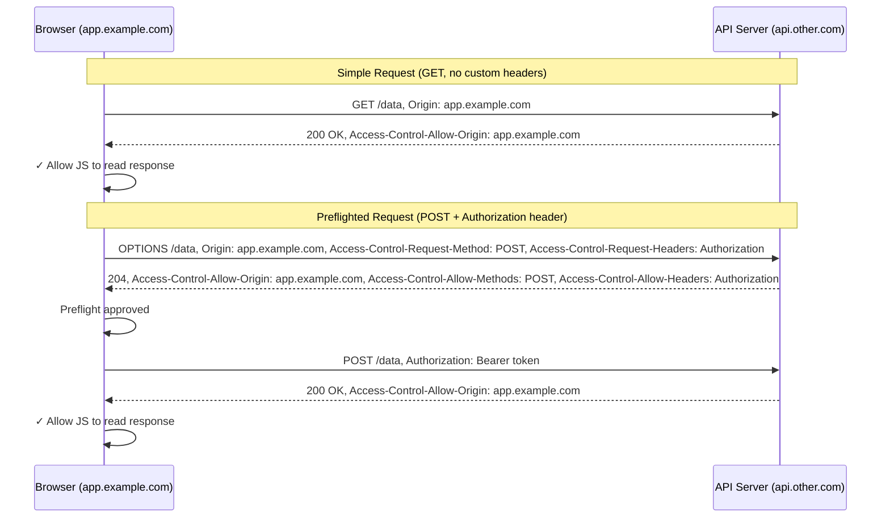

### Pitfalls
- ❌ **`Access-Control-Allow-Origin: *` with credentials:** Wildcard origin disables credential sharing (cookies, Authorization headers). Setting `Access-Control-Allow-Credentials: true` with `*` origin is an error — browsers reject it. Specify exact origins when credentials are needed.
- ❌ **CORS as a security boundary:** CORS is enforced by browsers only. A curl command, Postman, or server-to-server request ignores CORS headers entirely. CORS prevents malicious websites from reading responses — it does not prevent non-browser clients from calling your API.
- ❌ **Long preflight cache (Access-Control-Max-Age):** Setting max-age too short causes excessive OPTIONS requests (one per non-simple request). Set `Access-Control-Max-Age: 86400` (24 hours) for stable API endpoints.

### Concept Reference
→ [JWT vs Sessions vs Cookies](./jwt-sessions-cookies)

---

## Q4: OWASP Top 10 API Security 2023 — top 3 most critical for REST APIs

**Role:** Mid | **Difficulty:** 🟡 | **Priority:** P1 | **Format:** Quick Answer

> **What the interviewer is testing:** Whether you know OWASP's API-specific threat list (distinct from the general Top 10) and can describe real exploitation patterns.

### Answer in 60 seconds
- **API1: Broken Object Level Authorization (BOLA):** An API endpoint receives an object ID from the request and returns data without verifying the caller owns that object. `/api/orders/12345` — change the ID to `12345+1` and get another user's order. Defense: always verify ownership: `SELECT * FROM orders WHERE id=? AND user_id=?`.
- **API2: Broken Authentication:** Weak token validation, missing expiry checks, predictable tokens, accepting expired JWTs. Defense: validate all JWT claims (`exp`, `aud`, `iss`, `alg`); enforce rate limits on auth endpoints.
- **API3: Broken Object Property Level Authorization (BOPLA):** API returns more fields than the user should see (mass assignment, over-exposure). `GET /api/profile` returns `{name, email, password_hash, internal_score}` instead of just public fields. Defense: use allowlists (DTOs) that explicitly define returned fields — never serialize entire DB objects.
- **API4 (honorable mention): Unrestricted Resource Consumption:** No rate limits on expensive operations. Attacker calls `/api/export-all` 1000 times. Defense: rate limit at endpoint + user level; set max response size.

### Diagram

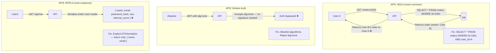

### Pitfalls
- ❌ **Testing BOLA only for your own test accounts:** BOLA vulnerabilities require cross-account testing. Your automated test suite must include "can user A access user B's resources?" as a test case.
- ❌ **Thinking authentication prevents BOLA:** BOLA affects authenticated users who access other users' objects using valid credentials. AuthN is fine; AuthZ is broken.
- ❌ **Serializing ORM models directly:** Django's `model_to_dict`, Rails' `.to_json`, and Node's `res.json(user)` often expose internal fields. Always define explicit serializers/DTOs for API responses.

### Concept Reference
→ [Authorization: RBAC vs ABAC](./authorization-rbac-abac)

---

## Q5: API rate limiting for abuse prevention — 1000 req/min/user at 10M users

**Role:** Senior | **Difficulty:** 🔴 | **Priority:** P1 | **Format:** Deep Dive

> **What the interviewer is testing:** Whether you can design a distributed rate limiter that is accurate, efficient, and handles edge cases at 10M user scale.

### Problem Constraints
| Dimension | Value |
|-----------|-------|
| Users | 10M with valid API keys |
| Limit | 1000 requests/minute per user |
| Total peak rate | 10M users × 1000/min = 166M req/min = 2.77M req/sec |
| Limiter latency budget | <1ms added per request |
| Distributed requirement | Multiple API gateway nodes — no sticky routing |
| Storage | Redis cluster (in-memory for speed) |

### Algorithm Comparison

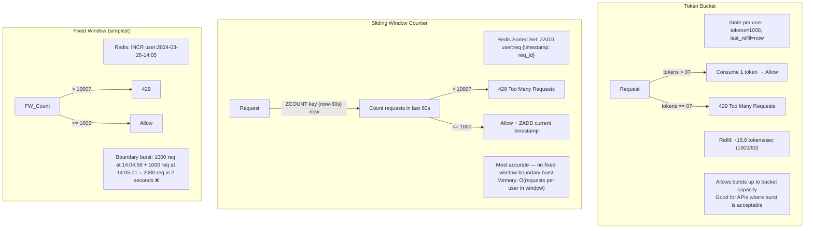

### Redis Implementation (Sliding Window)

```
Pseudo-code: Sliding Window Rate Limiter

FUNCTION is_rate_limited(user_id, limit=1000, window_seconds=60):
  key = "rl:{user_id}"
  now = current_unix_timestamp_ms()
  window_start = now - (window_seconds * 1000)

  ATOMIC pipeline:
    ZREMRANGEBYSCORE key 0 window_start        -- Remove expired entries
    count = ZCARD key                          -- Count requests in window
    IF count < limit:
      ZADD key now {score: now, member: now+random}  -- Add current request
      EXPIRE key window_seconds               -- Set TTL for cleanup
      RETURN ALLOW
    ELSE:
      RETURN DENY (429)

Redis memory per user: 1000 entries × ~50 bytes = 50KB per user
At 10M users: 500GB total if all users at max rate (only active users in Redis)
Active users at once: ~2M → 100GB Redis cluster
```

### Scale Architecture

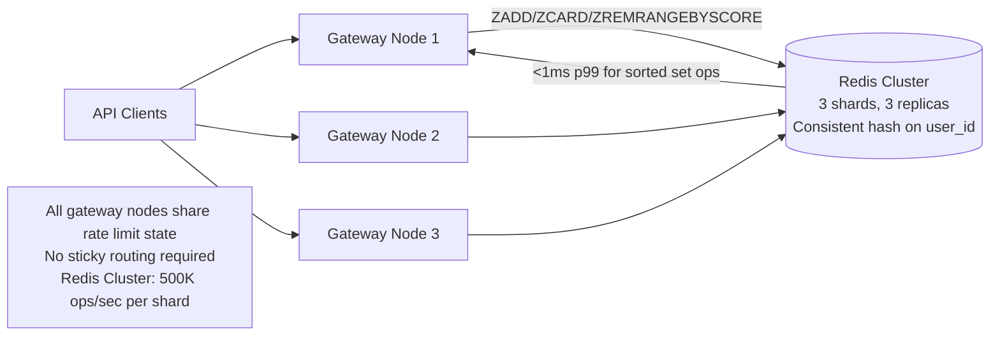

| Algorithm | Accuracy | Memory per user | Redis ops | Best for |
|-----------|----------|----------------|-----------|---------|
| Fixed Window | Low (boundary bursts) | O(1) — 1 counter | 1 INCR | Simple abuse prevention |
| Token Bucket | Medium (allows bursts) | O(1) — 2 values | 2 GET+SET | Smooth throughput |
| Sliding Window | High (no boundary burst) | O(requests in window) | 3 sorted set ops | Strict per-minute limits |

### What a great answer includes
- [ ] Algorithm choice: sliding window for accuracy, token bucket for bursty workloads
- [ ] Redis as distributed state store — required for multi-node gateways
- [ ] Atomic pipeline: ZREMRANGEBYSCORE + ZCARD + conditional ZADD in one RTT
- [ ] Memory sizing: 10M users × 50KB at max rate — only store active users (TTL-based eviction)
- [ ] Response headers: `X-RateLimit-Limit: 1000`, `X-RateLimit-Remaining: 450`, `Retry-After: 30`
- [ ] Handling Redis failure: fail open (allow) or fail closed (deny) — document the choice

### Pitfalls
- ❌ **In-process rate limiting:** Each gateway node has a separate counter. At 3 nodes, user can make 3000 req/min (1000 per node). Always use shared Redis.
- ❌ **Limiting only by IP for API users:** Legitimate users behind NAT (corporate offices) share IPs. Rate limit on API key or user_id for authenticated endpoints, IP only for unauthenticated.
- ❌ **No rate limit on authentication endpoints:** A brute-force attack targets login, not API endpoints. Rate limit auth endpoints more aggressively: 10 req/min/IP for login.

### Concept Reference
→ [Authentication Patterns](./authentication-patterns)

---

## Q6: STRIDE threat model — how to apply to a new microservice

**Role:** Senior | **Difficulty:** 🔴 | **Priority:** P1 | **Format:** Deep Dive

> **What the interviewer is testing:** Whether you can systematically enumerate threats against a system using STRIDE and propose mitigations for each threat category.

### Problem Constraints
| Dimension | Value |
|-----------|-------|
| Target system | Order processing microservice |
| Inputs | REST API (from web), internal events (from Kafka), DB reads/writes |
| Sensitive data | Customer PII, payment intent IDs, order history |
| Trust boundary | Public internet → API Gateway → Order Service → DB |

### STRIDE Categories and Application

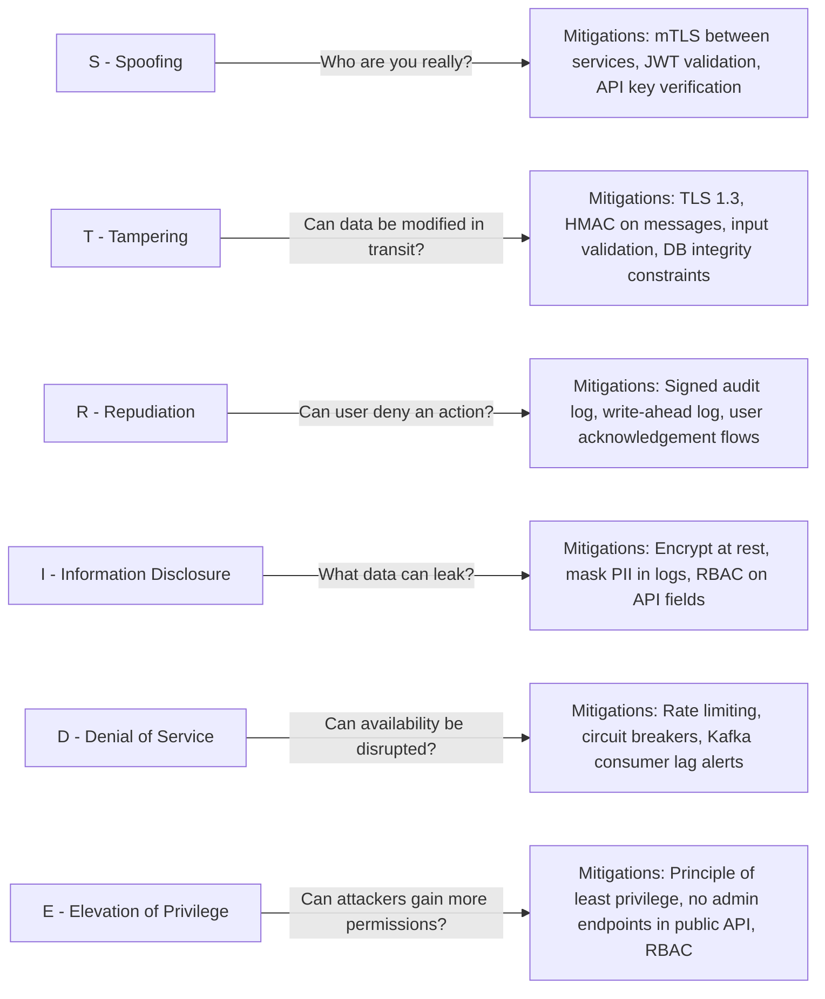

### STRIDE Analysis: Order Service

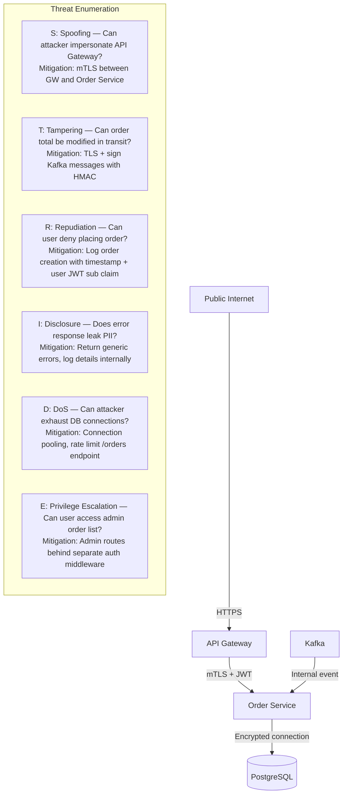

### STRIDE Worksheet Template

| STRIDE | Threat | Likelihood (H/M/L) | Impact (H/M/L) | Priority | Mitigation |
|--------|--------|-------------------|----------------|----------|-----------|
| Spoofing | Internal service impersonation | M | H | P0 | mTLS for service-to-service |
| Tampering | Kafka message modification | L | H | P1 | HMAC on message payload |
| Repudiation | Order placed then denied | M | M | P1 | Append-only audit log with user identity |
| Info Disclosure | PII in error logs | H | H | P0 | Log sanitizer removes PII fields |
| Denial of Service | Bulk order creation | M | M | P1 | Rate limit 100 orders/user/hour |
| Elevation of Privilege | User modifies other's order | M | H | P0 | BOLA check: verify order.user_id == caller |

### What a great answer includes
- [ ] Walk through all 6 STRIDE categories systematically, not just the obvious ones
- [ ] Draw trust boundaries: public internet, API gateway, internal services, DB
- [ ] Assign likelihood + impact to prioritize mitigations
- [ ] Repudiation is often forgotten — audit logging is the answer
- [ ] Denial of Service at the service level (not just network): expensive queries, unbounded loops
- [ ] Threat model is a living document — revisit when new endpoints are added

### Pitfalls
- ❌ **Only modeling external threats:** Internal microservices can be compromised (supply chain, insider). Model threats at every trust boundary crossing, not just the public API.
- ❌ **Treating STRIDE as a one-time exercise:** New features introduce new threats. Add threat modeling to the PR process for significant changes.
- ❌ **Confusing "elevation of privilege" with vertical only:** EoP includes horizontal privilege escalation — User A accessing User B's resources (BOLA) is EoP, not just admin vs user.

### Concept Reference
→ [Zero Trust Architecture](./zero-trust-architecture)

---

## Q7: Stripe API security — credential stuffing defense, API key rotation, webhook signing

**Role:** Staff | **Difficulty:** ⚫ | **Priority:** P2 | **Format:** Deep Dive

> **What the interviewer is testing:** Whether you can design production API security for a financial platform — covering key lifecycle management, webhook integrity verification, and multi-layer abuse defense.

### Problem Constraints
| Dimension | Value |
|-----------|-------|
| API keys | 100M+ live keys (businesses + developers) |
| Webhook volume | 500M webhooks/day to customer endpoints |
| Credential stuffing | 10M–100M login attempts/day on dashboard |
| Regulatory | PCI-DSS Level 1 — full audit log of all API calls |
| Key format | `sk_live_` prefix for live, `sk_test_` for test |

### API Key Architecture

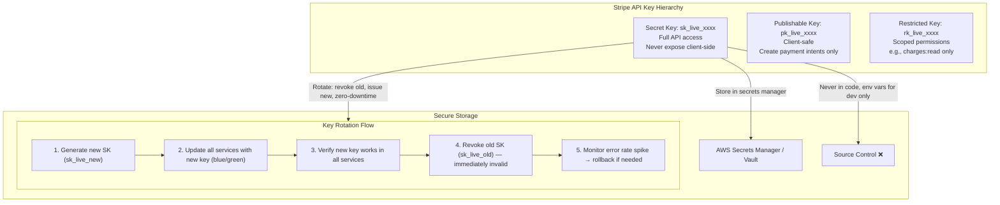

### Webhook Security (HMAC Signing)

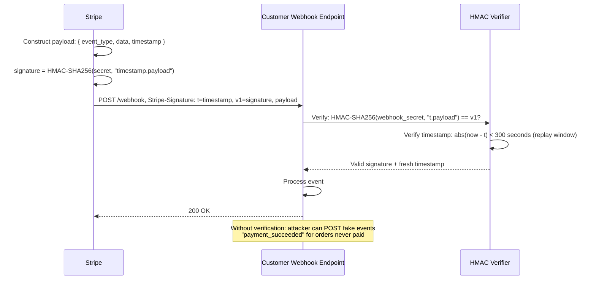

### Credential Stuffing Defense (Dashboard Login)

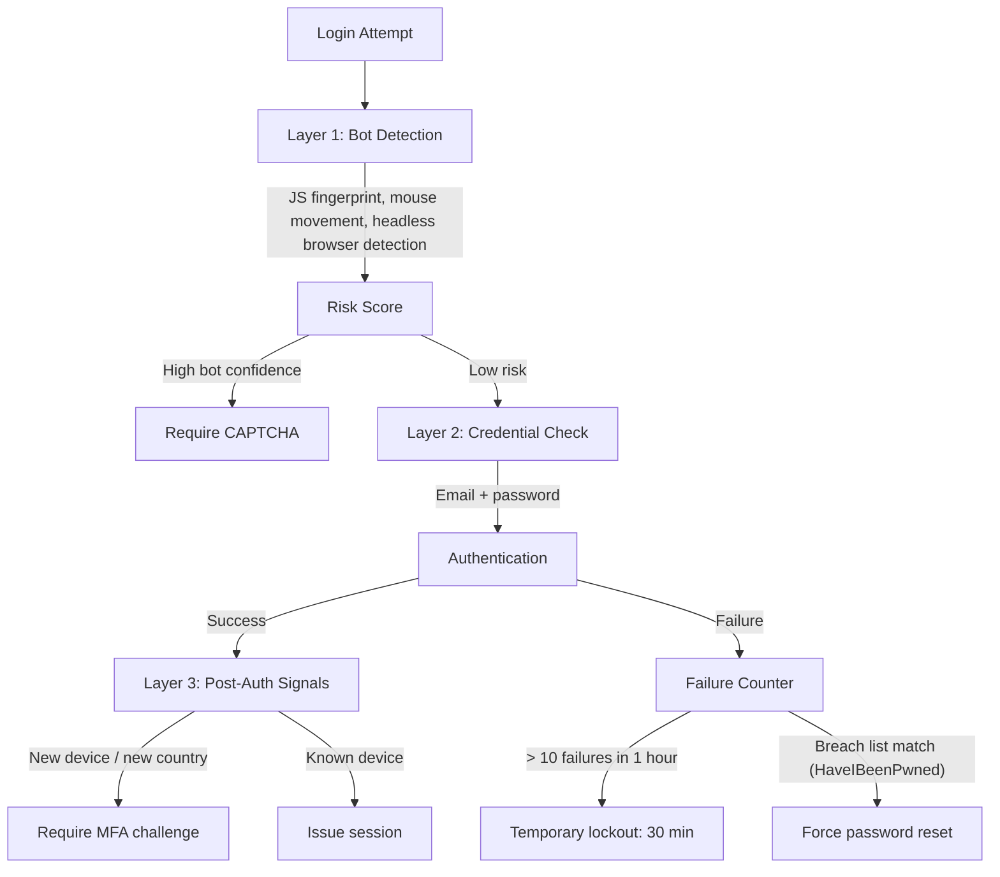

### Audit Logging (PCI-DSS Requirement)

```
Every API call must be logged with:
- api_key_id (not the key itself — use a key fingerprint: last 4 chars or SHA-256 prefix)
- timestamp (microsecond precision)
- source IP
- HTTP method + path + response status
- resource IDs accessed (charge_id, customer_id)
- duration (ms)

Retention: PCI-DSS requires 12 months active, 3 years archive.
Log storage: append-only (Kafka → S3) — no deletion, no modification.
Log access: only security team with MFA; full audit trail of log access.
```

### What a great answer includes
- [ ] Key hierarchy: secret key (server-side only), publishable (client-safe), restricted (scoped)
- [ ] Key rotation: zero-downtime rotation — new key active before old key revoked
- [ ] Webhook signing: HMAC-SHA256 of (timestamp + payload), verified by customer with shared secret
- [ ] Replay prevention: reject webhooks with timestamps >5 minutes old
- [ ] Credential stuffing: bot detection + per-account failure counting + HaveIBeenPwned check
- [ ] PCI-DSS audit log: log key fingerprint (not raw key), all requests, append-only storage

### Pitfalls
- ❌ **Logging full API keys in audit logs:** A stolen log = all customer API keys exposed. Log a fingerprint (e.g., `sk_live_****1234` or SHA-256 prefix). Stripe uses this exact pattern.
- ❌ **Webhook endpoint without replay protection:** An attacker replaying a `payment_succeeded` event from a month ago can trigger order fulfillment again. Reject events older than 5 minutes and deduplicate by event ID.
- ❌ **Restricting API key rotation to maintenance windows:** Rotation must be possible at any time (incident response). Design systems to accept two simultaneous active keys during the transition window.

### Concept Reference
→ [Authentication Patterns](./authentication-patterns)
