# Authentication Patterns

7 questions covering authentication from fundamentals to Staff-level passwordless system design.

---

## Q1: What is the difference between authentication and authorization?

**Role:** Junior, Mid | **Difficulty:** 🟢 | **Priority:** P0 | **Format:** Quick Answer

> **What the interviewer is testing:** Whether you can clearly separate two concepts that are often conflated and can explain the relationship between them.

### Answer in 60 seconds
- **Authentication (AuthN):** Verifying *who* you are. "Are you who you claim to be?" Mechanisms: password check, biometric scan, hardware token.
- **Authorization (AuthZ):** Verifying *what* you are allowed to do. "Are you allowed to access this resource?" Mechanisms: RBAC roles, ACL entries, policy engines.
- **Sequence matters:** Authentication always precedes authorization. You cannot decide what a user can do if you don't know who they are.
- **Failure modes are different:** AuthN failure → 401 Unauthorized. AuthZ failure → 403 Forbidden. Mixing them leaks information (returning 404 instead of 403 to hide resource existence is a valid technique).
- **Real example:** Logging into Gmail = AuthN. Reading another user's email = blocked by AuthZ (even though you're authenticated).

### Diagram

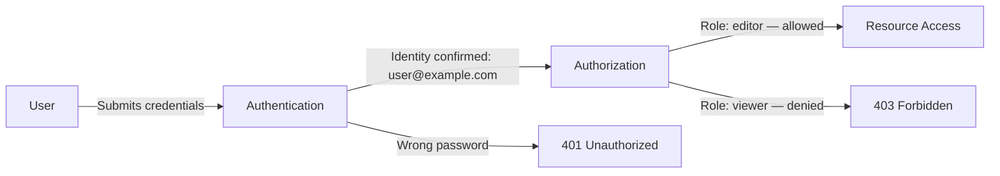

### Pitfalls
- ❌ **Using 401 for authorization failures:** 401 means "you need to authenticate." 403 means "you're authenticated but not permitted." Swapping them breaks OAuth clients and API consumers.
- ❌ **Skipping AuthN for internal services:** Internal microservices also need authentication (mTLS or service tokens) — assuming network location = trust is the perimeter security fallacy.
- ❌ **Conflating session validity with authorization:** A valid session proves AuthN only. Re-check AuthZ on each request — roles can change mid-session.

### Concept Reference
→ [Zero Trust Architecture](./zero-trust-architecture)

---

## Q2: Why hash passwords with bcrypt/argon2 instead of SHA-256?

**Role:** Junior, Mid | **Difficulty:** 🟢 | **Priority:** P0 | **Format:** Quick Answer

> **What the interviewer is testing:** Whether you understand the three pillars of password hashing: work factor, salting, and resistance to GPU-accelerated cracking.

### Answer in 60 seconds
- **SHA-256 is fast by design:** A GPU can compute 10–20 billion SHA-256 hashes/sec. At that rate, an 8-character alphanumeric password is cracked in under 30 minutes using brute force.
- **bcrypt is slow by design:** bcrypt executes 2^cost rounds (cost=12 → 4,096 rounds). A modern GPU computes ~20,000 bcrypt hashes/sec at cost=12 — 500,000x slower than SHA-256. Brute-forcing the same password takes 14 years.
- **Salting prevents rainbow tables:** Each bcrypt hash embeds a random 128-bit salt. Two identical passwords produce completely different hashes. Rainbow table attacks become infeasible regardless of hash speed.
- **Argon2 (winner of PHC 2015):** Argon2id is the current recommendation. It adds memory-hardness (128MB–2GB per hash) which defeats specialized ASIC hardware that bcrypt does not resist.
- **Timing attacks:** Use a constant-time comparison function (`crypto.timingSafeEqual`) when comparing hashes. Early-exit string comparison leaks information about how many characters matched.

### Diagram

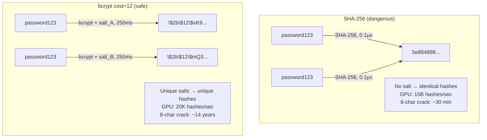

### Pitfalls
- ❌ **MD5/SHA-1 for passwords:** Both are broken for password storage. Billions of precomputed hashes exist in public databases (HaveIBeenPwned has 10B+ breached hashes).
- ❌ **Setting bcrypt cost too low:** Cost=10 gives ~65ms per hash. Cost=12 gives ~250ms. Cost below 10 is inadequate for 2024 hardware. Cost above 14 adds noticeable login latency (>1 sec).
- ❌ **Not re-hashing on login:** If you raise the cost factor, you must re-hash existing passwords on successful login — the only time you have the plaintext.

### Concept Reference
→ [API Security Patterns](./api-security-patterns)

---

## Q3: What is MFA — TOTP vs SMS vs hardware key — which is most secure and why?

**Role:** Mid | **Difficulty:** 🟡 | **Priority:** P0 | **Format:** Quick Answer

> **What the interviewer is testing:** Whether you can rank second factors by phishing resistance and explain the underlying cryptographic mechanism for each.

### Answer in 60 seconds
- **MFA principle:** Require at least 2 of 3 factor types: something you know (password), something you have (phone/key), something you are (biometric). A stolen password alone is insufficient.
- **SMS OTP:** Server sends a 6-digit code via SMS. Attack vectors: SIM swapping (carrier social engineering), SS7 protocol interception, real-time phishing. NIST SP 800-63B (2017) deprecated SMS as a primary second factor. Use only as a fallback.
- **TOTP (RFC 6238):** Shared secret generates time-based 6-digit codes (new code every 30 seconds). Based on HMAC-SHA1. Attack vector: real-time phishing — an attacker can mirror your TOTP code in <30 seconds on a proxy site. Not phishing-resistant but far better than SMS.
- **Hardware security keys (FIDO2/WebAuthn):** Browser verifies the site's origin (domain) before signing. Even if you're on `g00gle.com`, the key refuses to sign for Google's challenge. **Phishing is physically impossible.** Google reported 0 phishing incidents for 85,000 employees after rolling out security keys in 2017.
- **Ranking:** Hardware key > TOTP > SMS. Security scales with the difficulty of the attack.

### Diagram

```mermaid
graph TD
  subgraph SMS["SMS OTP"]
    A1[Server] -->|"Send 6-digit code"| B1[SMS]
    B1 --> C1[User Phone]
    C1 -->|"Code: 482917"| D1[Login]
    E1["Attack: SIM swap or real-time phishing proxy<br/>Success rate: ~60% in social engineering studies"]
  end
  subgraph TOTP["TOTP App (Authenticator)"]
    A2[Shared Secret] -->|"HMAC-SHA1 + Unix timestamp/30"| B2[6-digit code]
    B2 -->|"Valid 30 sec window"| D2[Login]
    E2["Attack: real-time phish mirrors code in <30s<br/>Not origin-bound — still phishable"]
  end
  subgraph FIDO["Hardware Key (FIDO2)"]
    A3[Browser] -->|"Challenge + origin (domain)"| B3[Security Key]
    B3 -->|"Sign with private key<br/>Verifies origin matches"| C3[Signed Assertion]
    C3 --> D3[Login]
    E3["Attack: phishing fails — origin mismatch<br/>Google: 0 account takeovers with keys"]
  end
```

### Pitfalls
- ❌ **Treating TOTP as phishing-resistant:** TOTP codes are not bound to an origin. A real-time relay attack can steal and replay them. Only FIDO2 is phishing-resistant.
- ❌ **Storing TOTP seeds in the same DB as passwords:** A single DB breach exposes both factors simultaneously. Store TOTP seeds in a separate encrypted vault.
- ❌ **No MFA recovery path:** If hardware key is lost with no backup, users are locked out. Provide recovery codes (8–10 single-use codes) generated at enrollment.

### Concept Reference
→ [OAuth2 & OIDC](./oauth2-oidc)

---

## Q4: How do you implement a secure forgot-password flow?

**Role:** Mid | **Difficulty:** 🟡 | **Priority:** P1 | **Format:** Deep Dive

> **What the interviewer is testing:** Whether you know the three hard requirements: token expiry, single-use enforcement, and avoiding account enumeration.

### Problem Constraints
| Dimension | Value |
|-----------|-------|
| Token validity window | 15–60 minutes maximum |
| Token entropy | 128–256 bits (URL-safe random bytes) |
| Account enumeration risk | Return identical response whether email exists or not |
| Brute-force surface | Token must be unguessable — never sequential IDs |

### Approach A — Insecure (common mistakes)

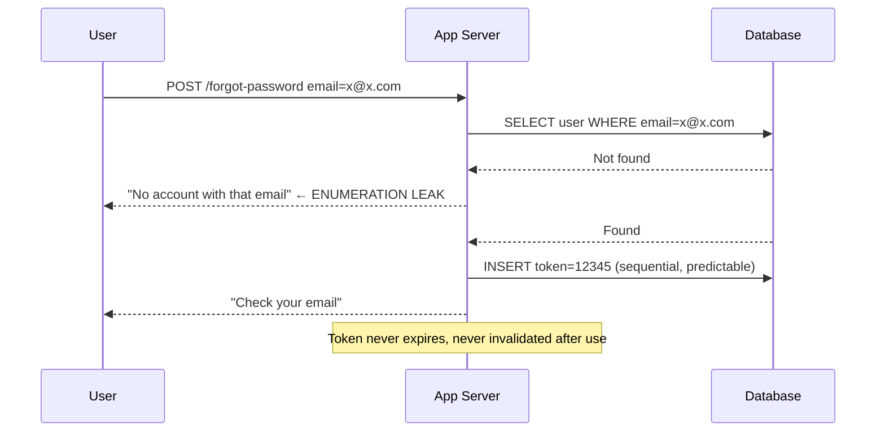

### Approach B — Secure Implementation

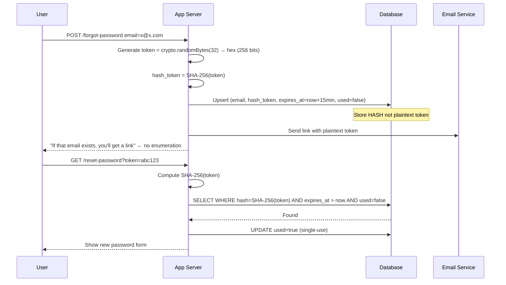

| Security Property | Insecure Approach | Secure Approach |
|-------------------|------------------|-----------------|
| Account enumeration | Leaks user existence | Identical response always |
| Token guessability | Sequential IDs | 256-bit random — unguessable |
| Token stored as | Plaintext | SHA-256 hash only |
| Token reuse | Allowed | Single-use flag |
| Expiry | None | 15 min hard limit |

### Recommended Answer
Store the SHA-256 hash of the reset token in the DB — never the plaintext. If the DB is breached, tokens cannot be used without the plaintext. Email contains the plaintext token. On use: verify hash matches, expiry not exceeded, and mark `used=true` atomically. Always return the same response regardless of whether the email exists. Rate-limit the endpoint to 5 requests/IP/hour to prevent enumeration via timing.

### What a great answer includes
- [ ] Return identical response for existing/non-existing email (anti-enumeration)
- [ ] Store hash of token, not plaintext
- [ ] Single-use flag set atomically on redemption
- [ ] 15–60 minute expiry window
- [ ] Rate limiting on the endpoint (5 req/IP/hour)
- [ ] Invalidate all existing reset tokens on successful password change

### Pitfalls
- ❌ **Timing oracle via DB lookup time:** Even with identical responses, a DB hit takes longer than a miss. Add a constant-time fake hash operation for missing accounts to prevent timing enumeration.
- ❌ **Allowing password reuse after reset:** Users cycling back to their old password defeats the purpose. Check new password against last 5 hashes.
- ❌ **Not invalidating existing sessions after reset:** A password reset should revoke all active sessions — the password may have been compromised.

### Concept Reference
→ [JWT vs Sessions vs Cookies](./jwt-sessions-cookies)

---

## Q5: What is credential stuffing — how do you detect 50K automated login attempts/minute?

**Role:** Senior | **Difficulty:** 🔴 | **Priority:** P1 | **Format:** Deep Dive

> **What the interviewer is testing:** Whether you can distinguish credential stuffing from brute force, and design a detection + mitigation system at scale.

### Problem Constraints
| Dimension | Value |
|-----------|-------|
| Attack volume | 50,000 login attempts/minute (833/sec) |
| Legitimate traffic | 5,000 logins/minute (normal baseline) |
| Attack source | 10K–100K rotating residential proxies |
| Attacker success rate | 0.1–2% (from leaked credential lists) |
| Goal | Block attack with <1% false positive rate on legitimate users |

### Approach A — IP Rate Limiting (insufficient alone)

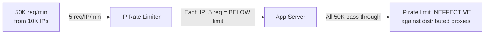

### Approach B — Multi-Signal Detection

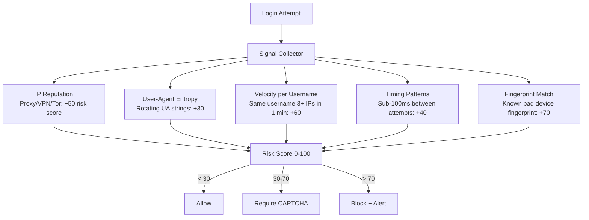

### Signal Analysis Table

| Signal | Detection Method | False Positive Risk |
|--------|-----------------|---------------------|
| IP velocity | >10 logins/IP/minute | Medium (shared NAT) |
| Username velocity | Same username, 3+ source IPs | Low |
| Credential list overlap | Match against HaveIBeenPwned API | None |
| Request timing | <200ms inter-request interval | Low |
| Browser fingerprint absent | Headless browser = no canvas/font fingerprint | Low |
| Geo-velocity | Login from US then UK in 5 min | Low |

### Recommended Answer
Credential stuffing uses *valid* credentials from prior breaches — not random guesses. Detection must focus on behavioral signals rather than password attempts per se.

The key signal is **per-username velocity across IPs**: legitimate users log in from 1–3 known devices; stuffing attacks try the same username from hundreds of IPs. Alert when a single username sees >3 distinct IPs in 5 minutes.

Integrate with HaveIBeenPwned's k-anonymity API at login: hash the password with SHA-1, send the first 5 hex chars. If the response includes the full hash, the credential is known-breached. Force a password reset silently (don't tell the attacker whether the login succeeded). At 833 req/sec, this adds ~2ms per login — acceptable.

At 50K req/min attack scale, deploy a real-time streaming pipeline (Kafka → Flink) to compute cross-request signals within a 60-second window.

### What a great answer includes
- [ ] Distinguish stuffing (valid credentials) from brute force (guessing passwords)
- [ ] Username velocity across IPs as the primary signal
- [ ] HaveIBeenPwned integration for known-breached credentials
- [ ] Risk scoring with CAPTCHA challenge at medium risk, hard block at high risk
- [ ] Streaming pipeline for real-time cross-request signal aggregation
- [ ] Rate limit at the account level, not just IP level

### Pitfalls
- ❌ **Blocking on IP alone:** Residential proxy networks rotate across 50M+ IPs. IP blocking alone blocks 0.01% of attack traffic while annoying legitimate mobile users on NAT.
- ❌ **Alerting the attacker:** Returning "invalid credentials" vs "account locked" tells the attacker which accounts exist. Return the same error always.
- ❌ **No baseline:** Without normal login velocity metrics, you cannot distinguish an attack spike from a viral product launch.

### Concept Reference
→ [API Security Patterns](./api-security-patterns)

---

## Q6: What is WebAuthn/FIDO2 and how does it eliminate phishing?

**Role:** Senior | **Difficulty:** 🔴 | **Priority:** P1 | **Format:** Deep Dive

> **What the interviewer is testing:** Whether you understand the public-key credential model, the role of the Relying Party, and why origin-binding makes phishing cryptographically impossible.

### Problem Constraints
| Dimension | Value |
|-----------|-------|
| Standard | FIDO2 = WebAuthn (W3C) + CTAP2 (FIDO Alliance) |
| Key type | Asymmetric (ES256 / RS256) per-credential key pair |
| Key storage | Private key never leaves the authenticator device |
| Phishing resistance | Origin (RP ID) is verified by the authenticator, not the user |

### Registration Flow

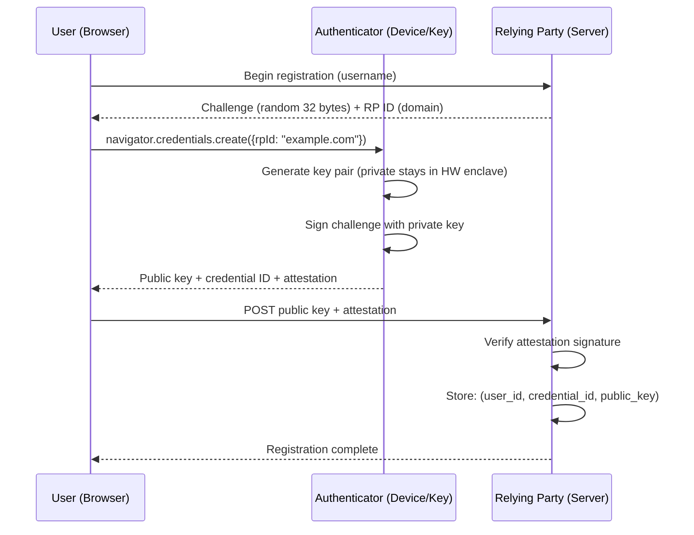

### Authentication Flow — Why Phishing Fails

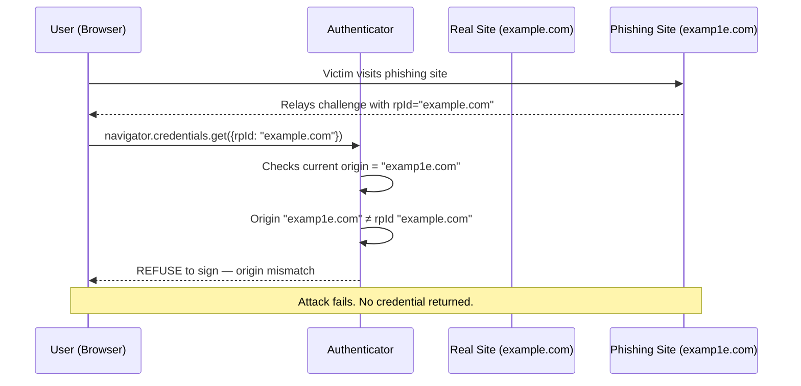

| Property | Password + TOTP | WebAuthn |
|----------|----------------|---------|
| Phishing resistant | No — codes relay in real time | Yes — origin-bound |
| Secret leaves device | Yes (password typed, TOTP shown) | No — private key never exported |
| Per-site isolation | No | Yes — separate key per RP |
| Replay attack | Possible (30s TOTP window) | Impossible (challenge is single-use) |
| Credential breach impact | High | None (no shared secret stored on server) |

### Recommended Answer
WebAuthn stores a **public key** on the server and a **private key** in the device's secure enclave (TPM, Secure Enclave, hardware key). The server stores no secret. Authentication works by the server sending a random challenge; the authenticator signs it with the private key. The server verifies the signature against the stored public key.

Phishing is eliminated at the protocol level: the authenticator includes the current origin (domain) in the signed assertion. The server verifies the origin matches its registered RP ID. A phishing site at `examp1e.com` cannot forge `example.com` — the assertion is cryptographically bound to the wrong origin.

Google's deployment: after switching 85,000 employees to security keys in 2017, zero account takeovers were reported in the following 2 years, down from frequent phishing incidents before.

### What a great answer includes
- [ ] Asymmetric keys: public key on server, private key never leaves device
- [ ] Challenge-response: each login requires a fresh server-generated challenge
- [ ] Origin-binding: authenticator checks current domain against rpId
- [ ] No shared secret on server — breach of server DB yields nothing useful
- [ ] Google 85,000 employee zero-takeover result

### Pitfalls
- ❌ **"WebAuthn requires hardware keys":** Passkeys (device-bound WebAuthn) work with platform authenticators — Touch ID, Face ID, Windows Hello. No external hardware required.
- ❌ **Storing credential IDs as secrets:** The credential ID is a public identifier. Only the private key is secret, and it never leaves the authenticator.
- ❌ **Not handling multi-device:**  A single WebAuthn credential is device-bound. Users need either multiple registrations (one per device) or a synced passkey provider (iCloud Keychain, Google Password Manager).

### Concept Reference
→ [Zero Trust Architecture](./zero-trust-architecture)

---

## Q7: Design a passwordless auth system for 10M users (magic links + passkeys)

**Role:** Staff | **Difficulty:** ⚫ | **Priority:** P2 | **Format:** Deep Dive

> **What the interviewer is testing:** Whether you can design a production passwordless system that handles multiple second-factor paths, fallback strategies, and scale requirements.

### Problem Constraints
| Dimension | Value |
|-----------|-------|
| User base | 10M registered users |
| DAU | 2M (20% daily login rate) |
| Peak login rate | 50K/minute (Monday morning spike) |
| Primary auth method | Passkeys (WebAuthn, synced via platform) |
| Fallback | Magic link email (when no passkey registered) |
| Token store | Redis cluster (TTL-based expiry) |
| Latency SLA | p99 < 500ms for login initiation |

### System Architecture

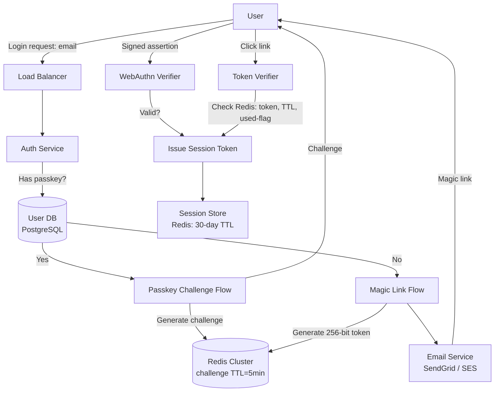

### Magic Link Security Properties

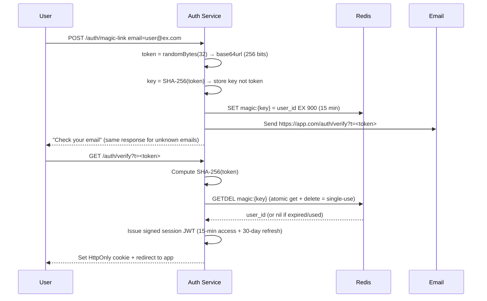

### Scale Analysis

| Component | At 50K logins/min | Solution |
|-----------|------------------|----------|
| Auth Service | 833 req/sec | Horizontally scale, stateless |
| Redis (challenges) | 833 writes/sec + 833 reads/sec | Single-shard Redis handles 100K ops/sec |
| Email delivery | 833 emails/min | SES: 14M/day limit, SendGrid: 40M/day |
| Passkey verification | CPU: ~1ms per ES256 verification | In-process — no external call |
| Session storage | 2M concurrent sessions × 500 bytes | 1GB Redis — trivial |

### What a great answer includes
- [ ] Two paths: passkey (primary) and magic link (fallback)
- [ ] Magic link: SHA-256 hash stored, plaintext in email, GETDEL for single-use atomicity
- [ ] Passkey: challenge stored in Redis with 5-min TTL, origin-verified on server
- [ ] Identical response for existing/non-existing email (anti-enumeration)
- [ ] Session issuance: short-lived access token (15 min) + long-lived refresh (30 days)
- [ ] Passkey enrollment prompt after magic link login (progressive onboarding)

### Pitfalls
- ❌ **No passkey fallback:** Passkeys can fail (new device, deleted credential). Magic links must always be available as fallback — never passkeys-only.
- ❌ **Long magic link TTL:** 1-hour TTL gives attackers a large window to intercept and use the link. 15 minutes is the maximum recommended window.
- ❌ **Not prompting magic link users to enroll passkeys:** Magic link users are higher friction. On their next login, show a "Set up passkey for one-click login" prompt to migrate them to the lower-friction path.

### Concept Reference
→ [JWT vs Sessions vs Cookies](./jwt-sessions-cookies)
