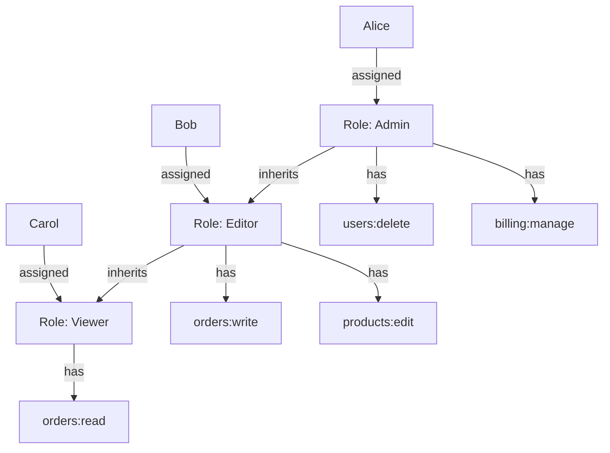
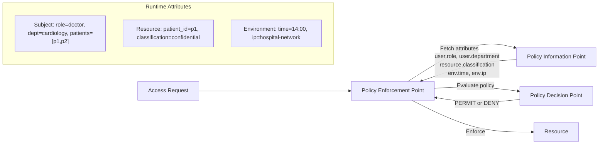
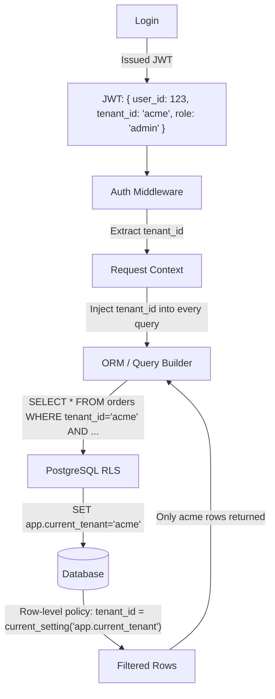
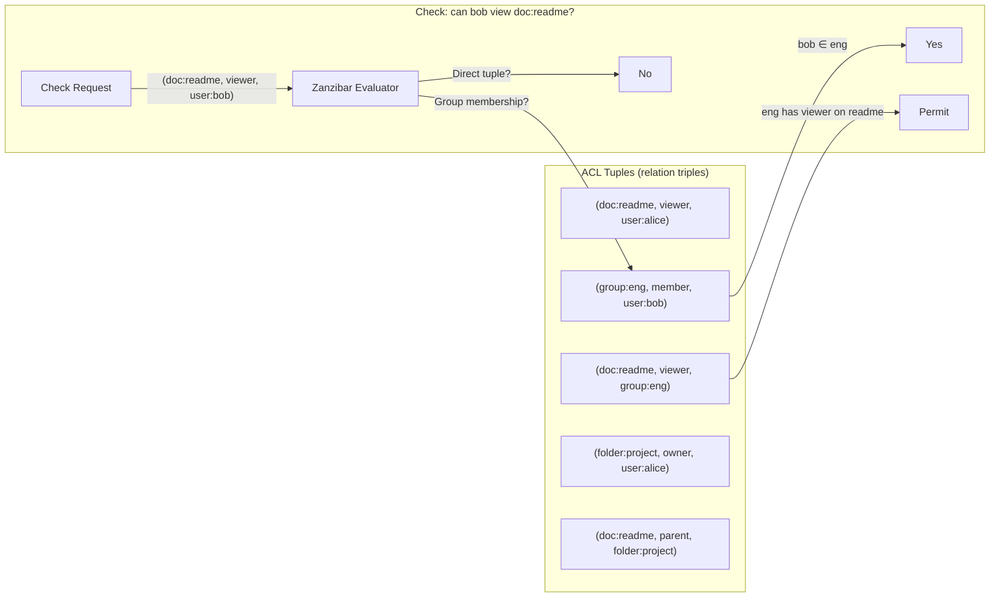
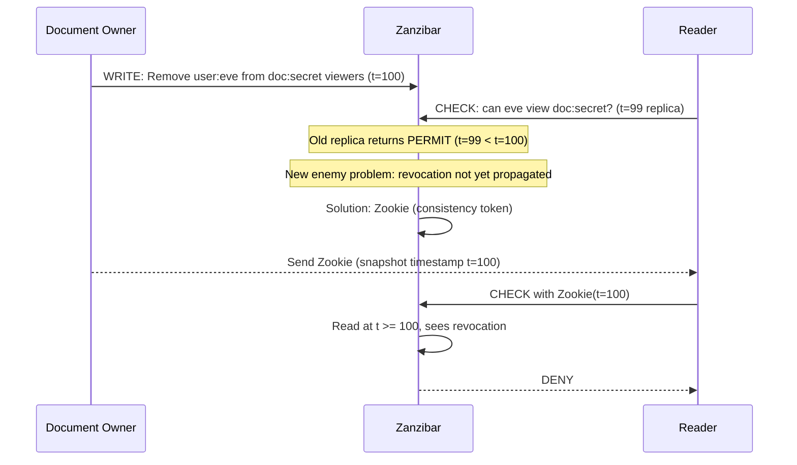
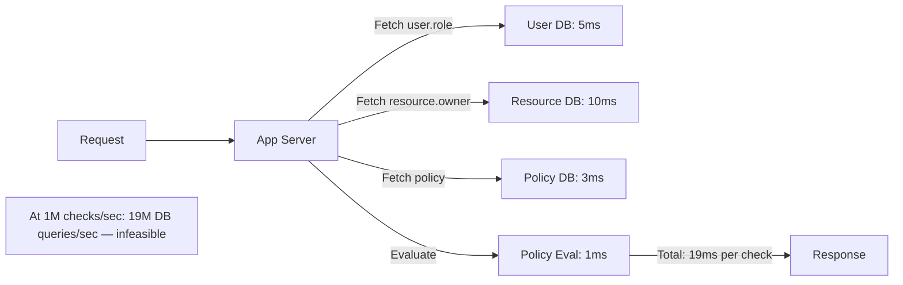
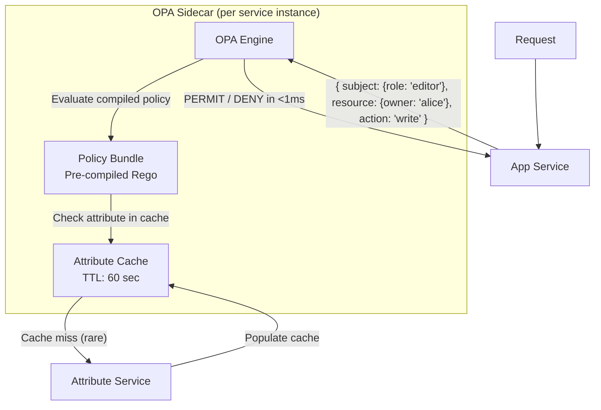
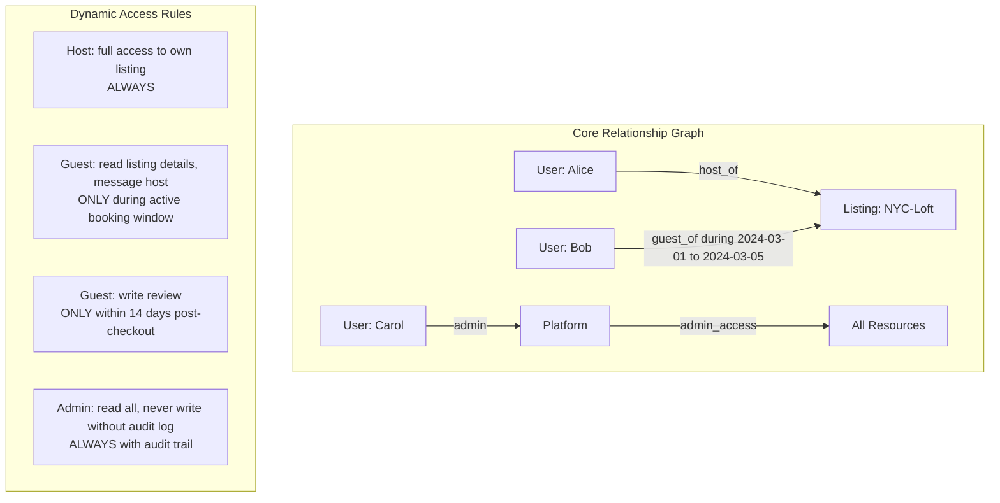
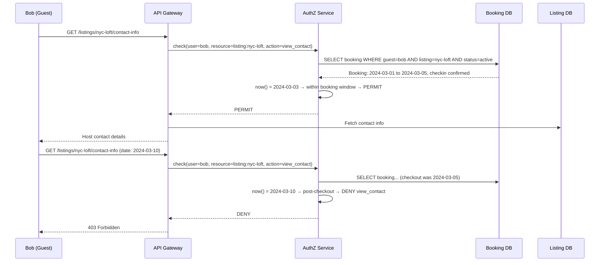

# Authorization: RBAC vs ABAC

6 questions covering authorization models from fundamentals to planet-scale policy evaluation.

---

## Q1: What is RBAC — roles, permissions, principal hierarchy?

**Role:** Mid | **Difficulty:** 🟢 | **Priority:** P0 | **Format:** Quick Answer

> **What the interviewer is testing:** Whether you can explain the RBAC data model, distinguish it from simple ACLs, and describe how role hierarchies reduce administrative overhead.

### Answer in 60 seconds
- **RBAC (Role-Based Access Control):** Permissions are assigned to roles; roles are assigned to users. Users never receive permissions directly.
- **Core entities:** Principal (user or service account), Role (named collection of permissions), Permission (action + resource: `orders:read`, `users:delete`).
- **Role hierarchy:** Roles can inherit from other roles. `admin` inherits all permissions from `editor` which inherits from `viewer`. Changing `editor` permissions automatically propagates to all editors without touching individual user records.
- **Why RBAC over ACLs:** An ACL lists permissions per-resource per-user. With 10K users and 1M resources, ACL management is O(N×M). RBAC is O(R) where R is the number of roles — typically 10–100.
- **NIST RBAC standard:** Defines 4 levels: flat RBAC, hierarchical RBAC, constrained RBAC (separation of duty), and symmetric RBAC.

### Diagram



### Pitfalls
- ❌ **Role explosion:** Without governance, organizations end up with hundreds of near-identical roles (e.g., `editor-team-a`, `editor-team-b`). Enforce a maximum role count and audit quarterly.
- ❌ **Permissions on users, not roles:** Some systems allow direct permission grants to users as exceptions. This recreates ACL complexity — avoid it.
- ❌ **Not separating authentication from RBAC:** RBAC is an authorization model. Who you are (AuthN) is determined before what role you have (AuthZ).

### Concept Reference
→ [Authentication Patterns](./authentication-patterns)

---

## Q2: What is ABAC and what problem does it solve that RBAC cannot?

**Role:** Mid, Senior | **Difficulty:** 🟡 | **Priority:** P0 | **Format:** Quick Answer

> **What the interviewer is testing:** Whether you can identify the class of policies that require attribute evaluation at runtime and explain why static roles are insufficient.

### Answer in 60 seconds
- **ABAC (Attribute-Based Access Control):** Access decisions are made by evaluating policy expressions against attributes of the subject (user), resource, action, and environment at request time.
- **The problem RBAC cannot solve:** "Allow access to patient records only if the requester is a doctor AND is assigned to that patient AND the hospital is in the same state AND it's during business hours." This is 4 dynamic conditions — no static role captures all of them without combinatorial explosion.
- **RBAC ceiling:** If you need 1,000 different permission combinations driven by data values (not structure), RBAC requires 1,000 roles. ABAC requires 1 policy with 4 attribute conditions.
- **ABAC policy example:** `subject.role == "doctor" AND resource.patient_id IN subject.assigned_patients AND env.time BETWEEN 08:00 AND 18:00`
- **Trade-off:** ABAC is more expressive but slower to evaluate (requires attribute resolution at runtime), harder to audit, and harder to explain to non-engineers.

### Diagram



| Dimension | RBAC | ABAC |
|-----------|------|------|
| Policy unit | Role assignment | Boolean expression |
| Runtime cost | O(1) — role lookup | O(P) — policy evaluation |
| Expressiveness | Low (static) | High (dynamic conditions) |
| Auditability | Easy ("Alice is an editor") | Complex (evaluate policy per request) |
| Best for | Organizational hierarchy | Fine-grained, data-driven access |

### Pitfalls
- ❌ **Using ABAC everywhere:** ABAC evaluation overhead at 1M req/sec requires caching and policy compilation (OPA). Use RBAC for coarse-grained access, ABAC for fine-grained.
- ❌ **Policies that require DB reads per check:** An ABAC policy that queries the DB for every attribute on every request adds 5–50ms latency. Pre-fetch and cache user attributes in the session token.
- ❌ **No policy testing framework:** ABAC policies are code. Unit test every policy rule with positive and negative cases before deploying.

### Concept Reference
→ [API Security Patterns](./api-security-patterns)

---

## Q3: Design a multi-tenant RBAC that prevents cross-tenant data access

**Role:** Senior | **Difficulty:** 🔴 | **Priority:** P1 | **Format:** Deep Dive

> **What the interviewer is testing:** Whether you can design a tenant-scoped permission model with defense in depth — tenant IDs in tokens, row-level security in the DB, and middleware enforcement.

### Problem Constraints
| Dimension | Value |
|-----------|-------|
| Tenants | 10,000 organizations |
| Users per tenant | 1–10,000 (average: 50) |
| Resources | Orders, invoices, users — all tenant-scoped |
| Critical failure | Tenant A reads Tenant B's data (data breach) |
| Compliance | SOC2 Type II — must log all cross-tenant access attempts |

### Approach A — Application-level Tenant Filtering (fragile)

```mermaid
graph TD
  Request -->|JWT: user_id=123| App[App Server]
  App -->|SELECT * FROM orders WHERE user_id=123| DB[(Database)]
  DB -->>|Returns orders| App
  Note["BUG: If tenant_id filter missing from one query,<br/>cross-tenant data leaks. Single developer mistake = breach."]
```

### Approach B — Defense in Depth (recommended)



### Row-Level Security Policy (PostgreSQL)

```
-- Pseudo-code: PostgreSQL RLS policy
CREATE POLICY tenant_isolation ON orders
  USING (tenant_id = current_setting('app.current_tenant')::uuid);

ALTER TABLE orders ENABLE ROW LEVEL SECURITY;

-- App sets context before each query:
SET LOCAL app.current_tenant = '<tenant_id_from_jwt>';
```

| Layer | Mechanism | Protects Against |
|-------|-----------|-----------------|
| JWT claim | tenant_id embedded at login | Token forgery (signed JWT) |
| Middleware | Extracts + validates tenant claim | Missing filter in business logic |
| ORM scope | Default scope adds tenant_id filter | Developer forgetting the WHERE clause |
| DB RLS | PostgreSQL enforces at storage level | ORM bypass, raw SQL injection |

### Recommended Answer
Design 4 defense layers: tenant ID in the signed JWT, middleware that extracts and validates it, ORM default scope that injects tenant_id into every query, and PostgreSQL Row Level Security as the last line of defense.

The RLS policy is the safety net: even if a developer forgets the tenant filter in application code, the database will not return rows from other tenants. This eliminates entire categories of cross-tenant bugs.

For the RBAC model: roles are scoped to a tenant. User Alice with role `admin` in tenant `acme` has no permissions in tenant `globex`. The permission check always includes `(tenant_id, role) → permissions`.

For SOC2 audit: log every request with `{user_id, tenant_id, resource, action, allowed}`. Alert on any query that returns 0 rows where rows were expected — this can indicate misconfigured RLS.

### What a great answer includes
- [ ] Tenant ID in JWT (not just user ID) — immutable for session duration
- [ ] Middleware enforcement as a single choke point
- [ ] ORM default scope for all queries
- [ ] PostgreSQL RLS as the final enforcement layer
- [ ] Roles are tenant-scoped, not global
- [ ] Audit log with tenant context on every request

### Pitfalls
- ❌ **Trusting client-supplied tenant IDs:** Never accept `tenant_id` from the request body or query string. Always derive it from the verified JWT.
- ❌ **Super-admin bypasses RLS:** Platform admin accounts that bypass tenant isolation should use a separate code path with explicit audit logging — not a disabled RLS policy.
- ❌ **Shared sequences across tenants:** Auto-increment IDs that are sequential across tenants allow tenant A to guess tenant B's record IDs. Use UUIDs.

### Concept Reference
→ [Authentication Patterns](./authentication-patterns)

---

## Q4: Google Zanzibar — relationship-based access control at planet scale (ReBAC)

**Role:** Senior | **Difficulty:** 🔴 | **Priority:** P1 | **Format:** Deep Dive

> **What the interviewer is testing:** Whether you know what ReBAC is, how Zanzibar models relationship graphs, and what engineering problems it solves that RBAC/ABAC cannot at Google's scale.

### Problem Constraints
| Dimension | Value |
|-----------|-------|
| Objects | Docs, Drive folders, Calendar events, YouTube videos |
| Scale | Trillions of ACL tuples across all Google products |
| Check latency | p99 < 10ms globally |
| Consistency model | "New enemy" problem — ACL changes must not violate causality |
| Throughput | Tens of millions of authorization checks/second |

### Zanzibar Data Model



### The "New Enemy" Problem



| Dimension | RBAC | ABAC | ReBAC (Zanzibar) |
|-----------|------|------|-----------------|
| Policy unit | Role | Attribute expression | Relationship tuple |
| Expressiveness | Low | High | Very high (graph traversal) |
| Scale | Millions of users | Millions of checks/sec | Trillions of tuples, tens of millions checks/sec |
| Sharing model | Cannot express "shared with Alice's team" | Partial (attribute lookup) | Native (group membership graph) |
| Google Drive equivalent | Not feasible | Complex | Native — folder inheritance |

### Recommended Answer
Zanzibar introduces **ReBAC** (Relationship-Based Access Control). Access is determined by traversing a graph of relationships stored as tuples `(object, relation, subject)`. "Can alice edit doc:readme?" resolves by following: alice → owner of folder:project → folder:project is parent of doc:readme → owners of parent have editor relation on children → PERMIT.

This naturally models Google Drive's "share folder, all children inherit" semantics — something RBAC requires explicit enumeration to achieve.

The critical engineering insight is the **Zookie** (consistency token): a snapshot timestamp returned on every write, which clients pass on subsequent reads to guarantee they see a version of the ACL at least as recent as the write. This prevents the "new enemy" problem (serving a pre-revocation ACL to a recently-removed user).

Open source implementations: **OpenFGA** (Auth0), **Oso**, **SpiceDB** (Authzed).

### What a great answer includes
- [ ] Tuple model: (object, relation, subject) as the atomic unit
- [ ] Graph traversal for transitive permissions (folder → child documents)
- [ ] Zookie mechanism for causally consistent reads after writes
- [ ] "New enemy" problem explained
- [ ] Scale numbers: trillions of tuples, p99 <10ms
- [ ] Real open-source alternatives (OpenFGA, SpiceDB)

### Pitfalls
- ❌ **Storing ACL tuples in a relational DB without optimization:** A naive JOIN-based traversal on billions of tuples is O(N) per check. Zanzibar uses leopard indexing (materialized set memberships) to achieve O(log N).
- ❌ **No caching strategy:** Zanzibar caches frequently-checked tuples in memory. Without caching, graph traversal hits storage on every check.

### Concept Reference
→ [OAuth2 & OIDC](./oauth2-oidc)

---

## Q5: How do you evaluate 1M ABAC policy checks/sec without a DB per check?

**Role:** Senior | **Difficulty:** 🔴 | **Priority:** P1 | **Format:** Deep Dive

> **What the interviewer is testing:** Whether you can design a high-throughput policy evaluation system using OPA, policy compilation, and attribute caching.

### Problem Constraints
| Dimension | Value |
|-----------|-------|
| Target throughput | 1,000,000 policy checks/sec |
| Policy complexity | 50 rules, 10 attributes each |
| Attribute sources | User service, resource service, environment |
| Latency budget | p99 < 5ms per check (10ms total request budget) |
| DB query latency | 5–50ms per attribute fetch |

### Approach A — Naive: DB Per Check (fails at scale)



### Approach B — OPA with Embedded Attributes (recommended)



### Performance Analysis

| Technique | Throughput | Latency Saved |
|-----------|-----------|--------------|
| Pre-compile Rego → Wasm | 10x vs interpreted | 4ms → 0.4ms evaluation |
| Embed OPA as sidecar | No network hop | 1–5ms network saved |
| Cache attributes (TTL=60s) | Eliminates 99% DB calls | 5–50ms per check |
| Bundle policies (not remote fetch) | No policy fetch per check | 3ms saved |
| Partial evaluation (pre-compute) | Pre-decide static rules | 2ms saved |

### Recommended Answer
At 1M checks/sec, every millisecond counts. The architecture:

1. **OPA as a sidecar** (not a remote service): Deploy OPA as a process on the same host as the app server. Policy evaluation is an in-process gRPC call (<0.5ms) instead of a network request (1–5ms).

2. **Pre-compile policies to Wasm:** OPA compiles Rego policies to WebAssembly at bundle build time. Wasm evaluation is 10x faster than interpreted Rego — ~0.4ms vs ~4ms for 50-rule policies.

3. **Attribute caching with push-based invalidation:** On login, fetch all user attributes (role, department, permissions) and embed them in the JWT or a Redis session. For resource attributes, cache with a 60-second TTL. A cache hit eliminates all DB queries. At 1M checks/sec with 99% cache hit rate: only 10K DB queries/sec — well within capacity.

4. **Partial evaluation:** Pre-compute the "static" portion of a policy offline (the parts that don't depend on runtime attributes) and cache the result. Only evaluate the dynamic portion at request time.

At 1M checks/sec with this design, OPA handles ~200K checks/sec per instance. Deploy 5 sidecars (one per app server) for full throughput with zero cross-service calls.

### What a great answer includes
- [ ] OPA sidecar vs remote service distinction with latency numbers
- [ ] Policy compilation to Wasm (10x speedup)
- [ ] Attribute embedding in JWT to eliminate per-check DB calls
- [ ] Cache hit rate target (99%) and what 1% miss rate costs at scale
- [ ] Partial evaluation for static policy pre-computation
- [ ] Horizontal scaling: OPA is stateless, scales with app servers

### Pitfalls
- ❌ **Remote OPA with no caching:** OPA as a separate service adds 1–5ms network latency per check. At 1M/sec, the OPA service becomes a bottleneck before the app servers.
- ❌ **Policy updates restart evaluation:** When a new policy bundle is deployed, in-flight requests must complete under the old policy. Use atomic bundle swaps — load new bundle, verify, then swap pointer.
- ❌ **User attributes in JWT not refreshed:** If a user's role changes, the old JWT contains the old role. Set JWT expiry to 15 minutes or push role change events to invalidate sessions.

### Concept Reference
→ [API Security Patterns](./api-security-patterns)

---

## Q6: Design Airbnb's host/guest/admin permission system with dynamic rules

**Role:** Staff | **Difficulty:** ⚫ | **Priority:** P2 | **Format:** Deep Dive

> **What the interviewer is testing:** Whether you can design a permission system that handles relationship-based access (host of this listing), time-bound permissions (guest during stay), and platform-level overrides (admin investigation), with a clean model that scales.

### Problem Constraints
| Dimension | Value |
|-----------|-------|
| Users | 150M guests, 4M hosts |
| Listings | 7M active listings |
| Bookings | 1M active bookings at any time |
| Permission complexity | Access depends on booking dates, listing ownership, relationship |
| Dynamic rules | Guest access to listing details expires at checkout |

### Permission Model



### Policy Evaluation Flow



### Permission Matrix

| Actor | Resource | Action | Condition |
|-------|----------|--------|-----------|
| Host | Own listing | CRUD | Always |
| Host | Booking of own listing | Read, message | Always |
| Guest | Booked listing contact info | Read | During active booking |
| Guest | Listing review | Write | Within 14 days post-checkout |
| Guest | Other listings | Read public details | Always |
| Admin | Any listing/booking | Read | Always + audit log required |
| Admin | Any listing/booking | Write | With 2-person approval + audit |

### What a great answer includes
- [ ] Relationship-based tuples: `(user:bob, guest_of, listing:nyc-loft, during:booking-123)`
- [ ] Time-bound permissions: evaluate `now()` against booking window at check time
- [ ] Separate permission for each phase (view-during-stay, review-post-stay)
- [ ] Admin access with mandatory audit trail (different code path)
- [ ] Cache: booking status cached with TTL = time until checkout (invalidates automatically)
- [ ] Superhost permissions: extend host capabilities (early access to new features) via role flag

### Pitfalls
- ❌ **Encoding time-bound permissions as roles:** Giving "guest role" at booking creation and revoking at checkout requires a scheduled job that can fail. Better to evaluate booking dates at check time — no state to manage.
- ❌ **Admin accounts with the same session model as users:** Admins accessing user data for support should use a separate elevated session (similar to AWS assume-role) with a 1-hour TTL and mandatory audit.
- ❌ **No permission for edge cases:** What happens if a booking is cancelled mid-stay? Define permissions for each booking state (pending, confirmed, active, cancelled, completed) explicitly.

### Concept Reference
→ [Zero Trust Architecture](./zero-trust-architecture)
