# Encryption At Rest & In Transit

6 questions covering TLS handshake mechanics to zero-downtime key rotation at petabyte scale.

---

## Q1: TLS 1.3 handshake — what it does (auth + key exchange + cipher negotiation)

**Role:** Mid | **Difficulty:** 🟡 | **Priority:** P0 | **Format:** Quick Answer

> **What the interviewer is testing:** Whether you understand the 3 goals of the TLS handshake and can describe the 1-RTT flow in TLS 1.3 vs the 2-RTT flow in TLS 1.2.

### Answer in 60 seconds
- **TLS handshake achieves 3 goals:** (1) Server authentication — prove you're talking to the real server. (2) Key exchange — agree on a shared session key without transmitting it. (3) Cipher negotiation — agree on algorithms for bulk data encryption.
- **TLS 1.3 vs 1.2:** TLS 1.2 requires 2 round trips (2-RTT) before data can flow, adding 100–300ms on high-latency links. TLS 1.3 reduces to 1-RTT by combining steps. With session resumption (0-RTT), clients can send data immediately.
- **Key exchange:** TLS 1.3 mandates ECDHE (Elliptic Curve Diffie-Hellman Ephemeral). Client and server generate ephemeral key pairs, exchange public keys, and compute a shared secret. Neither side's long-term private key is used for the shared secret — this is forward secrecy.
- **Authentication:** Server proves its identity by signing a handshake transcript with its certificate's private key. Client verifies the signature against the certificate, and the certificate against a trusted CA.
- **Latency:** TLS 1.3 adds ~1 RTT to the initial connection. At 50ms RTT (same city), that's 50ms overhead. At 150ms RTT (cross-continent), 150ms. TLS session resumption (0-RTT) eliminates this for returning clients.

### Diagram

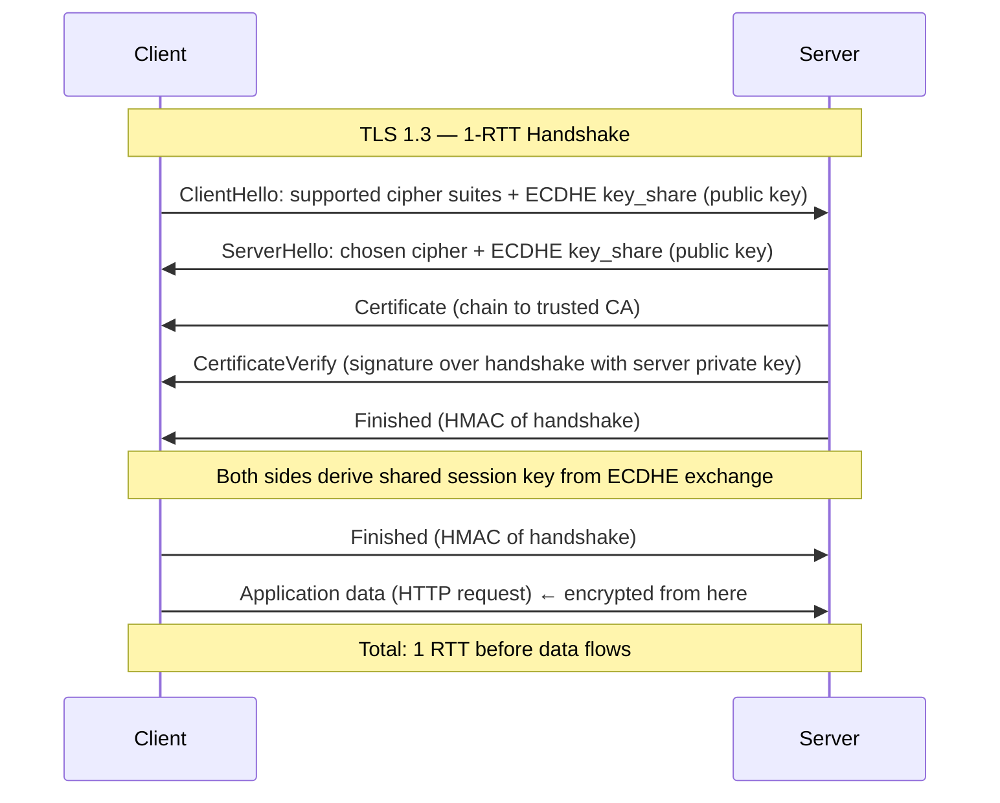

### Pitfalls
- ❌ **Confusing authentication with encryption:** The certificate authenticates the server. The ECDHE exchange provides the encryption key. A self-signed certificate authenticates nothing (no trusted CA) but can still encrypt.
- ❌ **"TLS is slow":** TLS 1.3 adds one RTT overhead per new connection. With HTTP/2 connection reuse (hundreds of requests per connection), TLS overhead amortizes to <1ms per request.
- ❌ **Not checking certificate revocation:** Certificate validity check (OCSP stapling) must be performed. A revoked certificate that is not checked allows MITM attacks with compromised certificates.

### Concept Reference
→ [Zero Trust Architecture](./zero-trust-architecture)

---

## Q2: Symmetric vs asymmetric encryption — when to use each

**Role:** Mid | **Difficulty:** 🟡 | **Priority:** P0 | **Format:** Quick Answer

> **What the interviewer is testing:** Whether you can explain the performance trade-off and the standard pattern of using asymmetric for key exchange and symmetric for bulk encryption.

### Answer in 60 seconds
- **Symmetric encryption (AES):** Same key for encryption and decryption. Speed: 10 GB/s on modern hardware with AES-NI hardware acceleration. Problem: both sides must share the key securely — the key distribution problem.
- **Asymmetric encryption (RSA, ECC):** Public key encrypts, private key decrypts (or vice versa for signing). Solves key distribution: publish public key, keep private key secret. Speed: 100–1000x slower than AES for bulk data. RSA-2048 encryption: ~1ms. AES-256 encryption: ~0.001ms per block.
- **Standard pattern (hybrid):** Use asymmetric encryption to exchange a symmetric key, then use symmetric for bulk data. This is exactly what TLS does: ECDHE exchanges a shared secret → derives AES-256-GCM session key → encrypts all application data with AES.
- **AES-GCM vs AES-CBC:** AES-GCM provides authenticated encryption — it detects tampering. AES-CBC requires a separate HMAC. Always use GCM (AEAD modes) for new systems.
- **Key sizes:** AES-128 is sufficient for most use cases (2^128 brute force). AES-256 for data classified as long-term sensitive (national security level). RSA-2048 ≈ AES-112 security level; RSA-3072 ≈ AES-128.

### Diagram

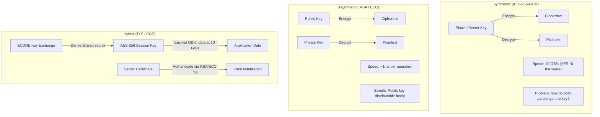

| Dimension | Symmetric (AES-256) | Asymmetric (RSA-2048) |
|-----------|--------------------|-----------------------|
| Speed | ~10 GB/s | ~1 MB/s equivalent |
| Key sharing | Same key both parties | Public key is safe to publish |
| Use case | Bulk data encryption | Key exchange, digital signatures |
| Key size | 256 bits | 2048–4096 bits |

### Pitfalls
- ❌ **Encrypting large files with RSA directly:** RSA can only encrypt data up to key_size − overhead (~245 bytes for RSA-2048 OAEP). For files, always use hybrid encryption: RSA wraps an AES key, AES encrypts the file.
- ❌ **Reusing nonces in AES-GCM:** AES-GCM security breaks completely if a nonce is reused with the same key. Nonces must be random (96-bit) or sequential. Key rotation bounds nonce reuse risk.
- ❌ **Using ECB mode:** AES-ECB encrypts identical plaintext blocks to identical ciphertext blocks, leaking data patterns. Never use ECB for anything. Use GCM.

### Concept Reference
→ [API Security Patterns](./api-security-patterns)

---

## Q3: Envelope encryption — AWS KMS implementation (DEK encrypted by CMK)

**Role:** Senior | **Difficulty:** 🔴 | **Priority:** P1 | **Format:** Deep Dive

> **What the interviewer is testing:** Whether you understand why you never encrypt data directly with a KMS key, what envelope encryption is, and how key hierarchies solve the rotation problem.

### Problem Constraints
| Dimension | Value |
|-----------|-------|
| Data volume | 100TB encrypted user data |
| Encryption granularity | Per-record or per-table |
| Key rotation | CMK rotated annually, DEKs rotated per-record on update |
| KMS throughput limit | 30,000 API calls/sec per account (AWS default) |
| Latency | KMS decrypt: 1–10ms per call |

### Why Not Encrypt Directly with KMS

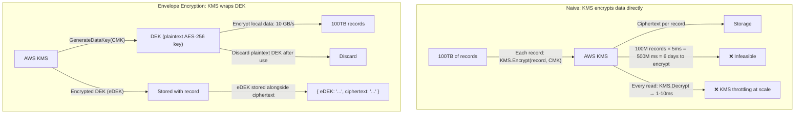

### Decryption Flow

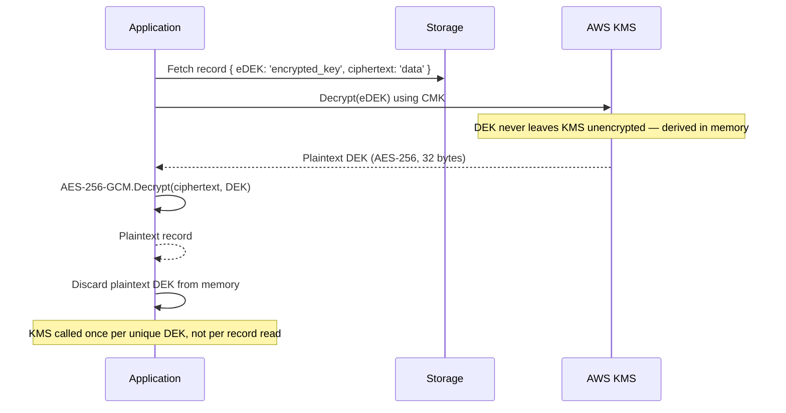

### Key Hierarchy

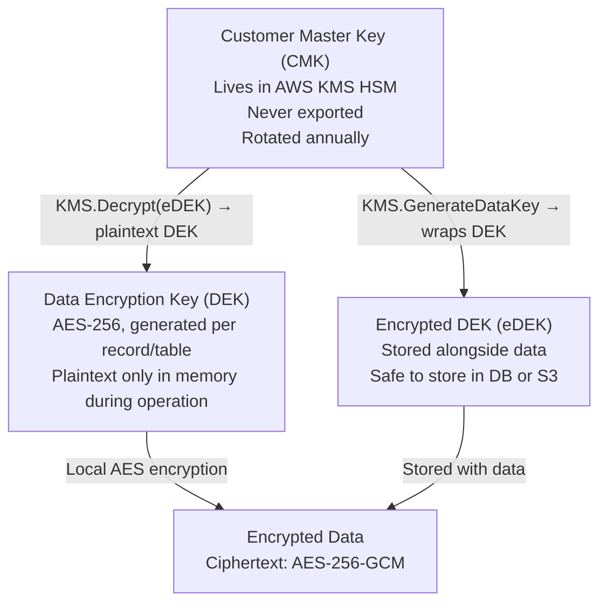

### Recommended Answer
Envelope encryption separates *key encryption* (handled by KMS) from *data encryption* (handled locally using AES). You never send actual data to KMS — only a small DEK (32 bytes). This bypasses KMS throughput limits and latency for bulk operations.

KMS call rate is determined by the number of unique DEKs accessed, not the number of records. If one DEK encrypts a 1GB block of records, you call KMS once to decrypt the DEK, then decrypt all records locally at 10 GB/s. This scales to petabytes with minimal KMS API calls.

### What a great answer includes
- [ ] CMK stays in KMS hardware — never exported
- [ ] DEK is generated by KMS but plaintext is only in application memory during use
- [ ] eDEK (encrypted DEK) stored alongside the data it protects
- [ ] Decryption: fetch eDEK → KMS.Decrypt(eDEK) → local AES decrypt with plaintext DEK
- [ ] KMS throttle limits: 30K calls/sec per account — design DEK granularity to stay under
- [ ] DEK granularity trade-off: per-record (max isolation) vs per-table (fewer KMS calls)

### Pitfalls
- ❌ **Per-row DEK with high read throughput:** At 100K reads/sec, per-row DEKs require 100K KMS decryptions/sec — 3x the default quota. Cache plaintext DEKs in memory with a 5-minute TTL. Use per-table or per-partition DEKs.
- ❌ **Caching plaintext DEKs to disk:** DEKs in memory are a bounded risk (process crash = gone). DEKs in disk cache persist across restarts and can be extracted. Keep DEKs in memory only.
- ❌ **Not rotating DEKs on CMK rotation:** Annual CMK rotation only re-encrypts the CMK — eDEKs are not automatically re-encrypted with the new CMK version. Schedule lazy re-encryption: when a record is next written, re-encrypt the DEK with the latest CMK version.

### Concept Reference
→ [Zero Trust Architecture](./zero-trust-architecture)

---

## Q4: Encrypt 100TB database without downtime (dual-write, background migration, key rotation)

**Role:** Senior | **Difficulty:** 🔴 | **Priority:** P1 | **Format:** Deep Dive

> **What the interviewer is testing:** Whether you can design a zero-downtime migration from unencrypted to encrypted storage using dual-write, background workers, and progressive cutover.

### Problem Constraints
| Dimension | Value |
|-----------|-------|
| Database size | 100TB across 500M records |
| Write rate | 50,000 writes/sec during business hours |
| Downtime budget | 0 seconds (SLA: 99.99%) |
| Migration time | Background over 30–90 days |
| Correctness guarantee | No record left unencrypted after cutover |

### Migration Phases

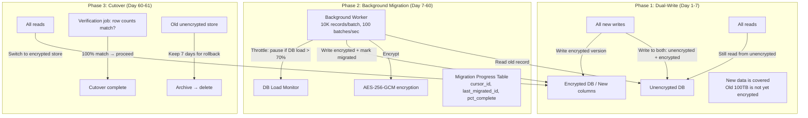

### Background Migration Strategy

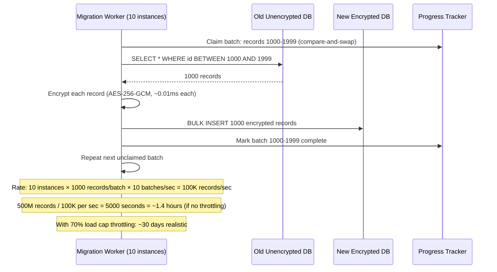

| Phase | Duration | Risk | Rollback |
|-------|----------|------|---------|
| Dual-write setup | 1–3 days (code + deploy) | Low | Remove dual-write code |
| Background migration | 30–60 days | Low | Workers read-only, no data loss |
| Read cutover | 1 hour | Medium | Switch flag back to old path |
| Write cutover | 1 hour | Medium | Switch flag back |
| Old store deletion | Day 67 | Irreversible | 7-day recovery window |

### What a great answer includes
- [ ] Phase 1: dual-write ensures all new data is encrypted from day 1
- [ ] Phase 2: background migration with batch size + throttle (don't overload production DB)
- [ ] Migration checkpointing: resume from last committed batch on worker restart
- [ ] Phase 3: verify row counts before cutover; feature flag for reads, then writes
- [ ] 7-day retention of old store before deletion (rollback window)
- [ ] Idempotent workers: re-processing already-migrated records must not cause duplicates

### Pitfalls
- ❌ **Migrating and cutting over in one step:** If the migration fails partway through, you have a mixed state. Always maintain the old store until verified 100% complete.
- ❌ **Not throttling background workers:** An unthrottled migration worker can consume 40–60% of DB IOPS, degrading production reads. Implement adaptive throttling against DB load.
- ❌ **Skipping the verification step:** Row count match is necessary but insufficient. Spot-check 1,000 random records: decrypt and compare against original to verify encryption correctness.

### Concept Reference
→ [API Security Patterns](./api-security-patterns)

---

## Q5: Forward secrecy — why TLS 1.3 mandates ephemeral keys (ECDHE)

**Role:** Senior | **Difficulty:** 🔴 | **Priority:** P1 | **Format:** Quick Answer

> **What the interviewer is testing:** Whether you understand the "harvest now, decrypt later" threat model and how ephemeral key exchange prevents it.

### Answer in 60 seconds
- **The threat:** An adversary records encrypted TLS traffic today. In 10 years, they obtain the server's private key (via breach, legal compulsion, or cryptanalysis). Without forward secrecy, they can decrypt all recorded traffic retroactively.
- **Forward secrecy:** Each TLS connection uses an ephemeral (one-time) key pair for key exchange. The session key is derived from the ephemeral keys and discarded after the session. Compromising the long-term server certificate private key does NOT enable decryption of past sessions.
- **ECDHE mechanism:** Client and server each generate a temporary EC key pair per connection. They exchange public keys and compute a shared secret (Diffie-Hellman). The shared secret is used to derive the session key, then both sides discard the ephemeral private keys.
- **TLS 1.3 enforcement:** TLS 1.3 removes all non-forward-secret cipher suites (RSA key exchange, static DH). ECDHE is mandatory.
- **TLS 1.2 gap:** TLS 1.2 allows RSA key exchange: client encrypts session key with server's public key → server decrypts with private key. No forward secrecy. Recording past traffic + later key compromise = decryption. Many legacy deployments still use TLS 1.2.
- **Performance:** ECDHE adds ~0.5ms per handshake. With P-256 curve, key generation is faster than RSA-2048 by 5x.

### Diagram

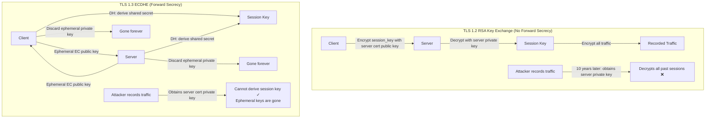

### Pitfalls
- ❌ **"TLS 1.3 on the edge but TLS 1.2 internally":** Internal service-to-service traffic is also targeted for interception. Enforce TLS 1.3 for all internal traffic, not just client-facing.
- ❌ **Disabling ECDHE for performance "savings":** ECDHE adds <1ms per handshake. On long-lived HTTP/2 connections (thousands of requests per connection), this overhead amortizes to microseconds per request.
- ❌ **Session resumption weakening forward secrecy:** TLS 1.3 0-RTT session resumption uses a resumption key derived from a previous session. If the resumption key is compromised, 0-RTT data can be decrypted. Limit 0-RTT to idempotent requests (GET).

### Concept Reference
→ [Zero Trust Architecture](./zero-trust-architecture)

---

## Q6: Rotate encryption keys for 500M stored records zero-downtime

**Role:** Staff | **Difficulty:** ⚫ | **Priority:** P2 | **Format:** Deep Dive

> **What the interviewer is testing:** Whether you can design a key rotation system for a large encrypted dataset that is versioned, lazy, and zero-downtime — and explain why you cannot do synchronous rotation at 500M record scale.

### Problem Constraints
| Dimension | Value |
|-----------|-------|
| Records | 500M encrypted records |
| Encryption | Envelope encryption: each record has eDEK (encrypted with CMK) |
| CMK rotation | Annual mandatory rotation (compliance requirement) |
| Zero-downtime | Service cannot pause during rotation |
| Re-encryption rate | 10K records/sec (background workers) |
| Time to complete | 500M / 10K per sec = 50,000 sec = ~14 hours background |

### Versioned Key Architecture

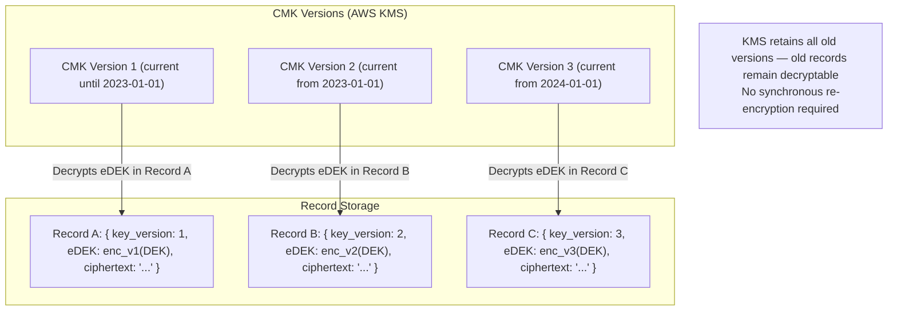

### Lazy Re-Encryption Strategy

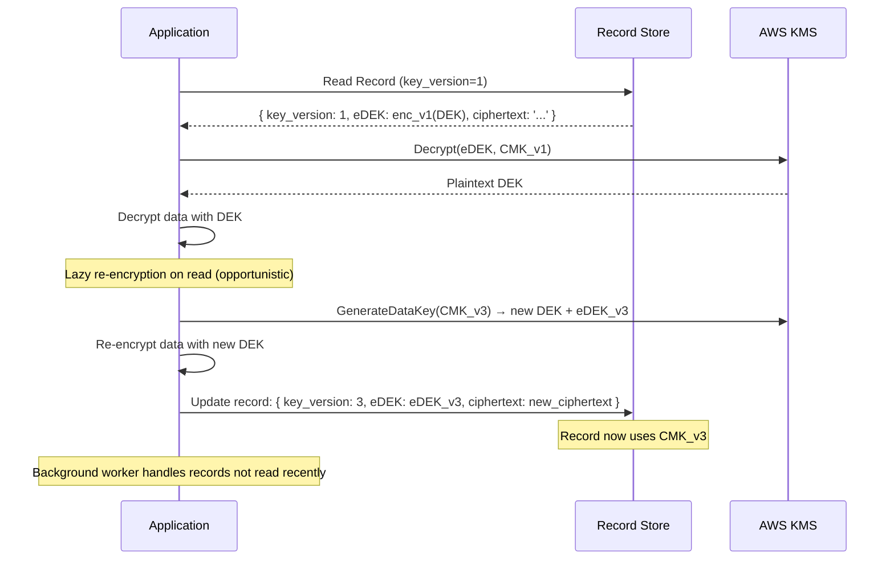

### Background Re-Encryption Worker

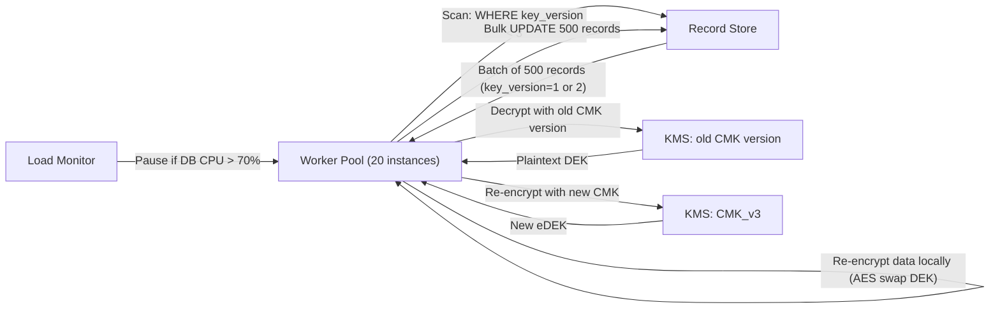

| Strategy | When | Benefit |
|----------|------|---------|
| Lazy re-encryption on read | When record is accessed | Zero cost — piggybacks existing reads |
| Background worker | For records not read recently | Ensures 100% migration within SLA |
| Write-time re-encryption | On every write | New data always uses latest key |

### Compliance Tracking

```
Old CMK versions must be retained until 100% of records using that version are re-encrypted.
Track: SELECT key_version, COUNT(*) FROM records GROUP BY key_version
Decommission CMK_v1 only when COUNT(key_version=1) = 0.
Alert when migration stalls: key_version < current AND record not updated in 30 days.
```

### What a great answer includes
- [ ] Key version tag on every record — tells decryption which CMK version to use
- [ ] KMS retains all CMK versions — old records remain decryptable indefinitely
- [ ] Lazy re-encryption: upgrade key version opportunistically on read/write
- [ ] Background worker scans for old key_version records and re-encrypts
- [ ] Only decommission old CMK version after 0 records reference it
- [ ] At 10K records/sec re-encryption, 500M records takes ~14 hours of background work
- [ ] Rate throttle workers against DB load to avoid impacting production

### Pitfalls
- ❌ **Synchronous rotation (all at once):** Re-encrypting 500M records synchronously would take hours and require downtime. Always use lazy + background rotation.
- ❌ **Deleting old CMK version before migration completes:** Any record still encrypted with the old CMK version becomes permanently unreadable. Verify 0 references before decommission.
- ❌ **Not tracking migration progress:** Without `key_version` column and progress queries, you cannot know when migration is safe to complete. Always maintain metadata for observability.

### Concept Reference
→ [API Security Patterns](./api-security-patterns)
