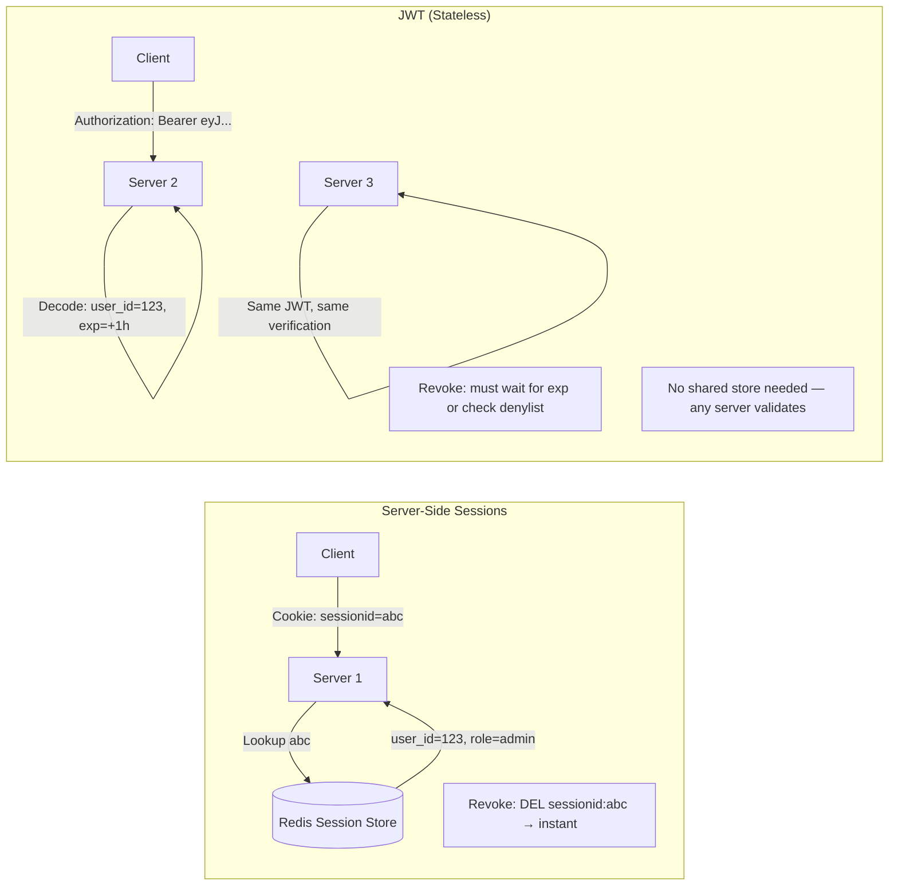
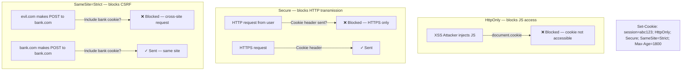
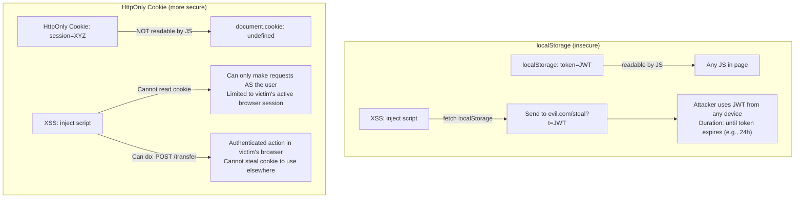
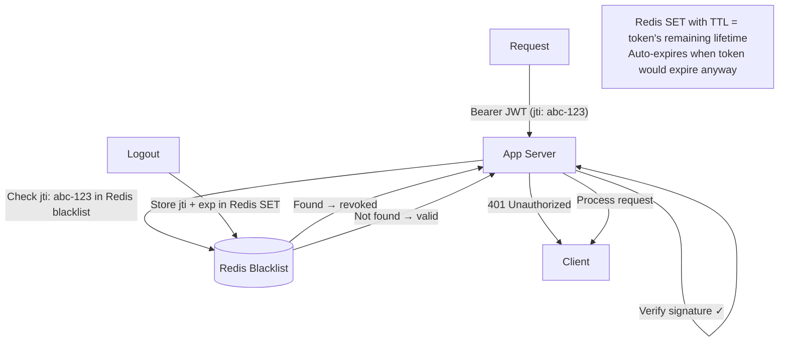
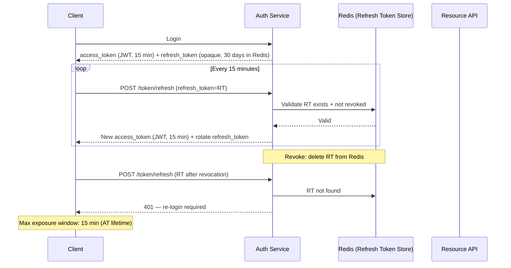
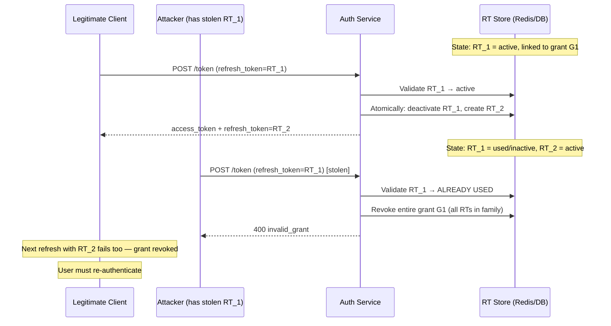
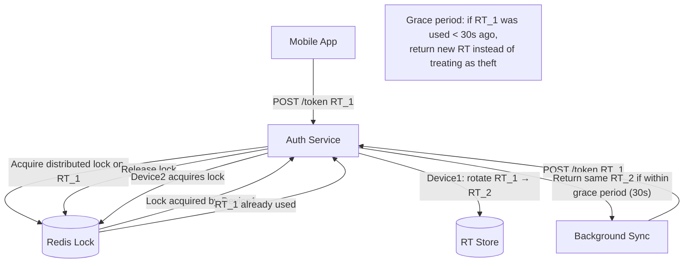
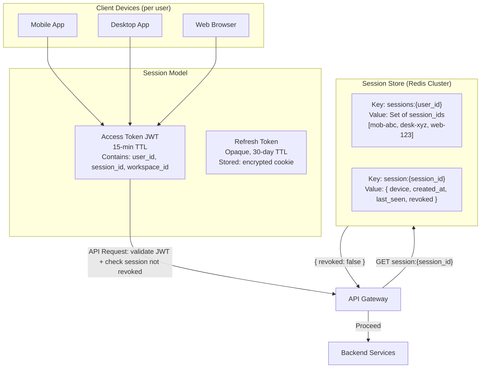
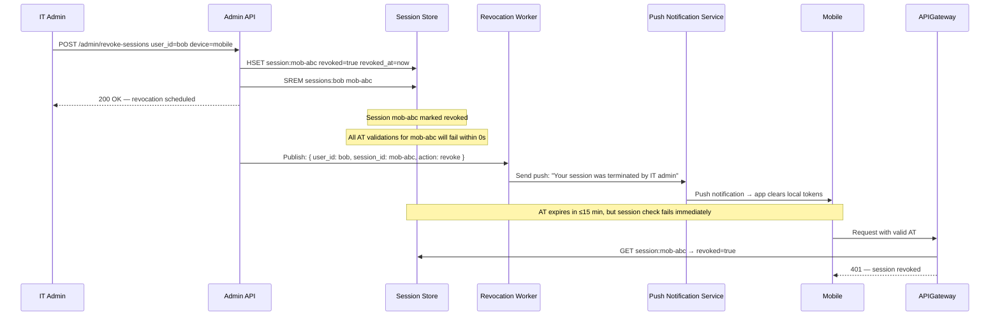

# JWT vs Sessions vs Cookies

7 questions covering token storage, cookie security attributes, session management, and revocation patterns.

---

## Q1: JWT vs server-side sessions — stateless trade-off, revocation problem

**Role:** Mid | **Difficulty:** 🟡 | **Priority:** P0 | **Format:** Quick Answer

> **What the interviewer is testing:** Whether you understand the fundamental trade-off between JWT (stateless, scalable, hard to revoke) and server-side sessions (stateful, requires session store, easy to revoke).

### Answer in 60 seconds
- **Server-side sessions:** Server stores session data in memory or Redis. Client holds only a session ID (opaque string). Revocation: delete session from store — instant, 1 DB operation. Scalability: requires sticky sessions OR a shared session store (Redis).
- **JWT (JSON Web Tokens):** Self-contained signed token. Server stores nothing. Client proves identity by presenting the token. Revocation: **impossible without additional state** — you cannot un-sign a token. Must wait for expiry or maintain a denylist.
- **JWT scalability advantage:** Any server can validate a JWT by verifying the signature against the public key — no session store call. Horizontal scaling is trivial.
- **JWT revocation trade-off:** If a user's JWT is stolen, you cannot invalidate it until it expires. With a 24-hour TTL, an attacker has 24 hours with a stolen token. Mitigation: short TTL (15 minutes) + refresh token.
- **Practical choice:** Use JWTs for stateless APIs at scale. Use server-side sessions for apps that need instant revocation (banking, medical records).

### Diagram



| Dimension | Server-Side Sessions | JWT |
|-----------|---------------------|-----|
| Server storage | Redis/DB required | None |
| Revocation | Instant (delete session) | Delayed (wait for expiry) |
| Horizontal scaling | Session store bottleneck | Trivial — no shared state |
| Token size | ~20 bytes (session ID) | ~500–2000 bytes |
| Cross-service use | Requires session store sharing | Native (public key verification) |
| Offline validation | No — must query store | Yes — verify signature locally |

### Pitfalls
- ❌ **Long-lived JWTs (24h+):** A stolen JWT is valid until expiry. Limit access tokens to 15 minutes. Use refresh tokens for longer sessions.
- ❌ **Storing sensitive data in JWT payload:** JWT payloads are base64-encoded, not encrypted. Any middleware or log can decode the payload. Never put PII or secrets in the payload.
- ❌ **Not validating `alg` header:** An attacker can send a JWT with `alg: none` to bypass signature validation. Always specify allowed algorithms on the server (reject `none`).

### Concept Reference
→ [OAuth2 & OIDC](./oauth2-oidc)

---

## Q2: Secure cookie attributes — HttpOnly, SameSite, Secure — what does each prevent?

**Role:** Junior, Mid | **Difficulty:** 🟢 | **Priority:** P0 | **Format:** Quick Answer

> **What the interviewer is testing:** Whether you can name each cookie attribute, its attack vector, and the specific attack it prevents.

### Answer in 60 seconds
- **`HttpOnly`:** Cookie is not accessible via JavaScript (`document.cookie`). **Prevents:** XSS-based token theft. An attacker who injects JavaScript cannot steal an HttpOnly cookie. Cost: none — all session cookies should be HttpOnly.
- **`Secure`:** Cookie is only transmitted over HTTPS. **Prevents:** Cookie interception on unencrypted HTTP connections (man-in-the-middle, network eavesdropping). Required in production.
- **`SameSite=Strict`:** Cookie is not sent on cross-site requests. **Prevents:** CSRF attacks. A request from `evil.com` to `bank.com` will not include the bank's session cookie. Value options: `Strict` (most secure), `Lax` (sent on top-level navigation), `None` (requires Secure, enables cross-site — use for third-party embeds only).
- **`__Host-` prefix:** Enforces: cookie must be Secure, no Domain attribute, Path must be `/`. Prevents subdomain cookie injection attacks. Highest security level.
- **`Max-Age` vs `Expires`:** Session cookies (no Max-Age) are cleared when browser closes. Persistent cookies survive browser restarts.

### Diagram



### Pitfalls
- ❌ **`SameSite=None` without `Secure`:** Modern browsers reject `SameSite=None` cookies without `Secure`. The cookie will be silently dropped.
- ❌ **Thinking `HttpOnly` prevents all XSS damage:** HttpOnly prevents cookie theft via JS, but XSS can still make authenticated API calls on the user's behalf (the browser sends cookies automatically). Defense in depth: HttpOnly + CSP headers + input sanitization.
- ❌ **`SameSite=Lax` for mutation endpoints:** `Lax` allows cookies on top-level GET navigation but not on cross-site POST/PUT/DELETE. Most CSRF attacks use POST. `Strict` prevents all cross-site cookie inclusion including navigation.

### Concept Reference
→ [API Security Patterns](./api-security-patterns)

---

## Q3: Why is localStorage insecure vs httpOnly cookies for token storage?

**Role:** Junior, Mid | **Difficulty:** 🟡 | **Priority:** P0 | **Format:** Quick Answer

> **What the interviewer is testing:** Whether you understand the XSS attack surface difference between localStorage and HttpOnly cookies.

### Answer in 60 seconds
- **localStorage:** Any JavaScript running in the page can read it: `localStorage.getItem('token')`. If an attacker injects even one line of JavaScript (via XSS), they can exfiltrate the token to their server. The token is now in the attacker's hands — they can use it from any device until it expires.
- **HttpOnly cookies:** Cannot be read by JavaScript at all. An XSS attacker can still make authenticated requests using the cookie (browser sends it automatically), but they cannot steal the cookie and use it from another machine.
- **What this means:** localStorage XSS → stolen token, attackable from anywhere for token's lifetime. HttpOnly cookie XSS → sessionjacking only while victim's browser is running the XSS payload.
- **ContentSecurityPolicy (CSP):** Reduces XSS risk but does not eliminate it. Use CSP as defense in depth, not as justification for localStorage.
- **The verdict:** Store access tokens in HttpOnly cookies. For JWTs, accept the SameSite + CSRF trade-off (see Q4) rather than localStorage.

### Diagram



### Pitfalls
- ❌ **"Our app has no XSS so localStorage is fine":** XSS can come from third-party scripts (analytics, ads, CDN libraries). A supply chain attack on any script tag puts the token at risk.
- ❌ **Storing refresh tokens in localStorage:** Refresh tokens have long TTL (days–months). Storing them in localStorage means a brief XSS window can compromise the account for months.
- ❌ **In-memory token storage as sufficient:** In-memory storage (JS variable) survives the page session but not page refresh. Developers often fall back to localStorage for persistence — building the habit of HttpOnly cookies is safer.

### Concept Reference
→ [API Security Patterns](./api-security-patterns)

---

## Q4: What is CSRF and how does SameSite=Strict prevent it?

**Role:** Mid | **Difficulty:** 🟡 | **Priority:** P0 | **Format:** Quick Answer

> **What the interviewer is testing:** Whether you can explain the CSRF attack vector and describe both the traditional CSRF token defense and the modern SameSite cookie defense.

### Answer in 60 seconds
- **CSRF (Cross-Site Request Forgery):** A browser automatically includes cookies for a domain on any request to that domain — even from other websites. An attacker's site can trigger an authenticated POST to your bank if you're logged in, and the browser will silently include your session cookie.
- **Attack example:** `evil.com` embeds ``. Your browser fetches that URL, includes your bank cookie, and transfers money.
- **Traditional defense:** CSRF token — a random value stored in session and embedded in every form. Server rejects requests where form token ≠ session token. Evil.com cannot read the CSRF token (same-origin policy) so cannot forge valid requests.
- **`SameSite=Strict` defense:** Cookie is not sent on any cross-site request. `evil.com → bank.com` = cross-site. Bank cookie is not included. CSRF is structurally impossible.
- **`SameSite=Lax` (default in modern browsers):** Protects against POST-based CSRF but allows GET-based navigation (e.g., clicking a link to bank.com). Sufficient for most apps; use Strict for high-security endpoints.

### Diagram

```mermaid
sequenceDiagram
  participant Victim as Victim Browser
  participant Evil as evil.com
  participant Bank as bank.com

  Victim->>Bank: Login → Set-Cookie: session=ABC; SameSite=None (old)
  Victim->>Evil: Visit evil.com
  Evil-->>Victim: HTML with hidden form POST to bank.com/transfer
  Victim->>Bank: POST /transfer (browser auto-includes session=ABC)
  Bank-->>Victim: 200 OK — Transfer executed ← CSRF ATTACK SUCCEEDS

  Note over Victim,Bank: With SameSite=Strict:
  Victim->>Bank: Login → Set-Cookie: session=ABC; SameSite=Strict
  Victim->>Evil: Visit evil.com
  Evil-->>Victim: HTML with hidden form POST to bank.com/transfer
  Victim->>Bank: POST /transfer (SameSite=Strict → cookie NOT sent)
  Bank-->>Victim: 401 Unauthorized — no session cookie ← CSRF BLOCKED
```

### Pitfalls
- ❌ **`SameSite=Strict` breaking legitimate cross-site flows:** OAuth2 callbacks, payment gateway redirects, and email confirmation links are cross-site navigations. With `Strict`, the cookie is not included on return. Use `Lax` for session cookies or handle with a redirect landing page.
- ❌ **CSRF tokens for GET requests:** CSRF attacks typically use state-changing requests (POST/PUT/DELETE). GET requests should be idempotent. CSRF tokens on GETs add overhead with minimal security benefit.
- ❌ **Double-submit cookie pattern without `HttpOnly`:** If the CSRF token cookie is readable by JavaScript, an XSS can read and forge it. Use `HttpOnly` for session cookies and a separate readable CSRF cookie.

### Concept Reference
→ [API Security Patterns](./api-security-patterns)

---

## Q5: How to revoke a JWT before expiry — blacklist vs short-lived + refresh token

**Role:** Senior | **Difficulty:** 🔴 | **Priority:** P1 | **Format:** Deep Dive

> **What the interviewer is testing:** Whether you can design a revocation strategy that balances the stateless advantage of JWT against the need for immediate invalidation.

### Problem Constraints
| Dimension | Value |
|-----------|-------|
| JWT TTL (current, long) | 24 hours |
| Revocation need | Logout, account compromise, role change |
| Scale | 10M active users, 100K req/sec |
| Target revocation latency | < 60 seconds globally |
| Acceptable overhead | < 1ms added per request |

### Approach A — JWT Blacklist (denylist)



| Property | Blacklist Approach |
|----------|--------------------|
| Revocation latency | Immediate (next request) |
| Storage cost | O(revoked tokens until expiry) |
| At 10M users, 1% revoked/day | 100K entries × ~200 bytes = 20MB |
| Latency overhead | 0.5–1ms Redis GET per request |
| Failure mode | Redis outage → can't check blacklist (fail open or closed) |

### Approach B — Short-lived JWT + Refresh Token (recommended)



| Dimension | Long JWT + Blacklist | Short JWT + Refresh |
|-----------|---------------------|---------------------|
| Revocation latency | Immediate | Max 15 min (AT TTL) |
| Stateful storage | 1 Redis entry per revoked token | 1 Redis entry per active session |
| Read on every request | Yes (blacklist check) | No (AT validated by signature only) |
| Implementation complexity | Low | Medium |
| Best for | Apps needing instant revocation | Most production apps |

### Recommended Answer
Use **short-lived access tokens (15 minutes) + long-lived refresh tokens (30 days)**. Access tokens are validated by JWT signature alone — no Redis call per request. Revocation is achieved by deleting the refresh token; the user is logged out within 15 minutes (the AT TTL).

For cases requiring instant revocation (account compromise, admin force-logout), layer on a blacklist for the access token's remaining 15-minute window — the blacklist is small (entries auto-expire after 15 minutes) and adds only 0.5ms per request.

Do not use a blacklist as the primary revocation mechanism for long-lived JWTs. It defeats the stateless advantage of JWT and adds a Redis dependency to every single API call.

### What a great answer includes
- [ ] Identify the core problem: JWTs are signed but not revocable without state
- [ ] Short-lived AT (15 min) reduces blast radius of stolen token
- [ ] Refresh token in server-side store (Redis) is the revocation point
- [ ] Blacklist as a supplemental mechanism for force-logout, not primary
- [ ] Failure mode: what happens if Redis is down (fail open vs fail closed)
- [ ] Refresh token rotation on every use

### Pitfalls
- ❌ **Large blacklist TTL:** Store blacklist entries only for the remaining lifetime of the token — use `SETEX jti <remaining_seconds>`. Indefinite storage wastes Redis memory and risks unbounded growth.
- ❌ **Fail open on blacklist Redis outage:** If the blacklist check fails (Redis down), deciding to "allow requests" means revoked users are re-admitted. For security-critical endpoints, fail closed (return 503) and fail open only for read-only/low-risk operations.
- ❌ **Using JWT ID (jti) sequentially:** Sequential jti values allow an attacker to probe for valid token IDs. Always generate jti as a random UUID.

### Concept Reference
→ [OAuth2 & OIDC](./oauth2-oidc)

---

## Q6: Refresh token rotation — how it limits stolen token impact

**Role:** Senior | **Difficulty:** 🔴 | **Priority:** P1 | **Format:** Deep Dive

> **What the interviewer is testing:** Whether you understand the mechanism of refresh token rotation, how it enables theft detection, and the challenge of handling concurrent refreshes safely.

### Problem Constraints
| Dimension | Value |
|-----------|-------|
| Threat | Attacker steals a refresh token from storage or network |
| Without rotation | Attacker uses stolen RT for its full lifetime (30–180 days) |
| With rotation | Stolen RT triggers detection on the next use (by either party) |
| Race condition | Mobile app refreshes from 2 devices simultaneously |

### Rotation Mechanism



### Concurrent Refresh Handling



| Scenario | Without Rotation | With Rotation |
|----------|-----------------|--------------|
| Token stolen, never used again by legitimate client | Attacker has indefinite access | Attacker has access until legitimate client next refreshes (hours–days) |
| Token stolen, legitimate client refreshes | Both have access — invisible | Legitimate refresh deactivates stolen RT. If attacker tries, theft detected. |
| Token stolen, attacker refreshes first | Both have access | Legitimate client's next refresh detects reuse → grant revoked |

### What a great answer includes
- [ ] Rotation: each refresh invalidates the used RT and issues a new one
- [ ] Reuse of a used RT signals potential theft → revoke entire grant family
- [ ] Atomic CAS (compare-and-swap) or distributed lock on RT to prevent race conditions
- [ ] Grace period (30–60 seconds) for concurrent refreshes from same device (network retries)
- [ ] User notification on suspicious RT reuse (email, push notification)
- [ ] RT families: track parent-child chain for full revocation

### Pitfalls
- ❌ **No grace period for retries:** A legitimate client that retries a refresh request after a network error will send the already-used RT. Without a grace period, this triggers false theft detection and locks out the user.
- ❌ **Not logging RT reuse events:** RT reuse is your theft detector. Log every reuse with IP, user-agent, and timestamp. Alert the security team for pattern analysis.
- ❌ **Allowing unlimited RT chain length:** A long-lived account with daily refreshes can accumulate thousands of RT entries. Prune the RT chain on each rotation — keep only the current active RT in the family.

### Concept Reference
→ [OAuth2 & OIDC](./oauth2-oidc)

---

## Q7: Slack's session management — 10M DAU, multi-device, instant revocation

**Role:** Staff | **Difficulty:** ⚫ | **Priority:** P2 | **Format:** Deep Dive

> **What the interviewer is testing:** Whether you can design a session management system that handles multiple concurrent devices per user, enforces instant revocation (security requirement), and scales to 10M daily active users.

### Problem Constraints
| Dimension | Value |
|-----------|-------|
| DAU | 10M users |
| Devices per user | Average 2.3 (mobile + desktop + web) |
| Active sessions | ~23M concurrent sessions |
| Revocation requirement | IT admin forces logout of compromised device within 5 seconds |
| Session store | Must survive single-node failures |
| Token format | Short-lived JWT (15 min) + server-side session for revocation |

### Architecture



### Revocation Flow (admin force-logout)



### Scale Analysis

| Component | Scale | Solution |
|-----------|-------|---------|
| Session writes (login) | 10M/day = ~116/sec | Redis Cluster — trivial |
| Session reads (per API request) | 100K+ req/sec | Redis: 500K ops/sec per shard, clustered |
| Session store size | 23M sessions × 300 bytes | ~7GB — fits in Redis |
| Revocation propagation | Immediate (next AT use) | Redis GET on every request — 0.5ms overhead |
| Multi-device enumeration | List sessions per user | Redis SET: `sessions:{user_id}` |

### What a great answer includes
- [ ] Session ID embedded in JWT (payload claim) — JWT validates signature, server checks session liveness
- [ ] Session store: Redis with user → set of session IDs mapping
- [ ] Instant revocation: set `revoked=true` in session store; checked on every AT validation
- [ ] Multi-device: separate session entry per device, linked to user's session set
- [ ] Device metadata: user-agent, IP, device name displayed in "active sessions" page
- [ ] Push notification to revoked device for UX (optional but user-friendly)

### Pitfalls
- ❌ **Pure JWT without session store check:** Instant revocation is impossible with pure JWT. Slack's security requirement (5-second revocation) mandates a server-side check on every request.
- ❌ **Single Redis node for sessions:** A Redis node failure drops all sessions. Use Redis Cluster (minimum 3 primary + 3 replica) with automatic failover. Session store is on the critical path.
- ❌ **Not expiring session metadata:** Sessions that expire naturally (user inactive for 30 days) must be cleaned up from the session store. Use Redis TTL on session keys — set TTL = refresh token lifetime. Expired sessions auto-delete.

### Concept Reference
→ [OAuth2 & OIDC](./oauth2-oidc)
