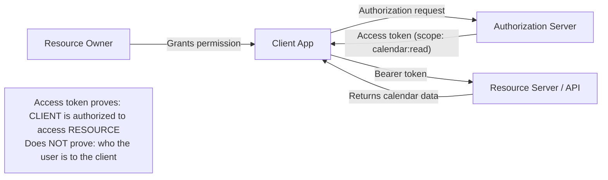
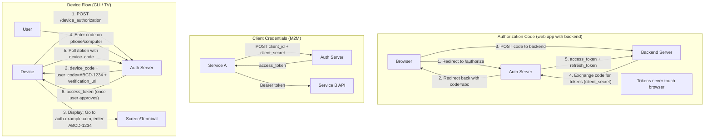
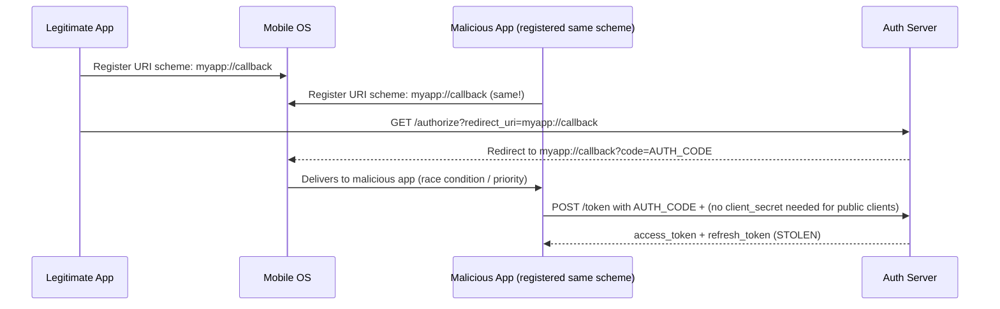
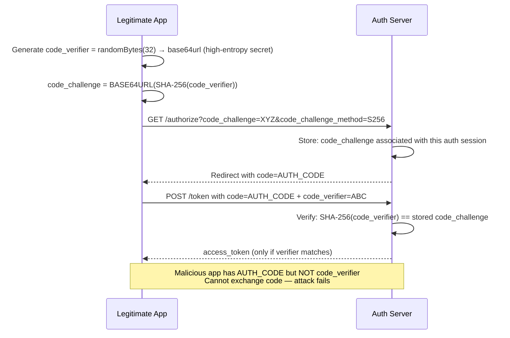
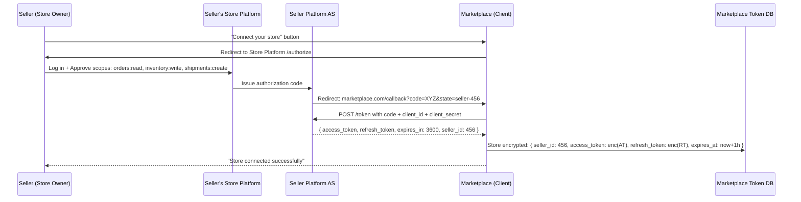
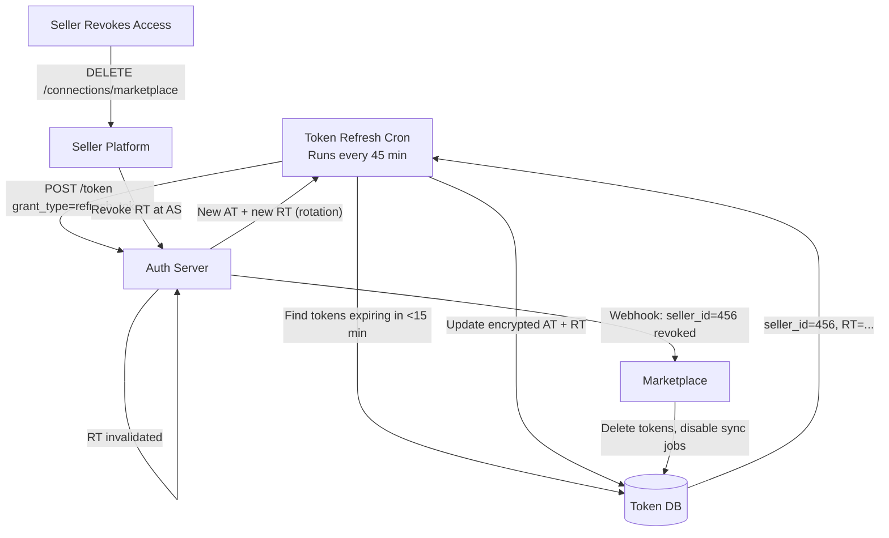
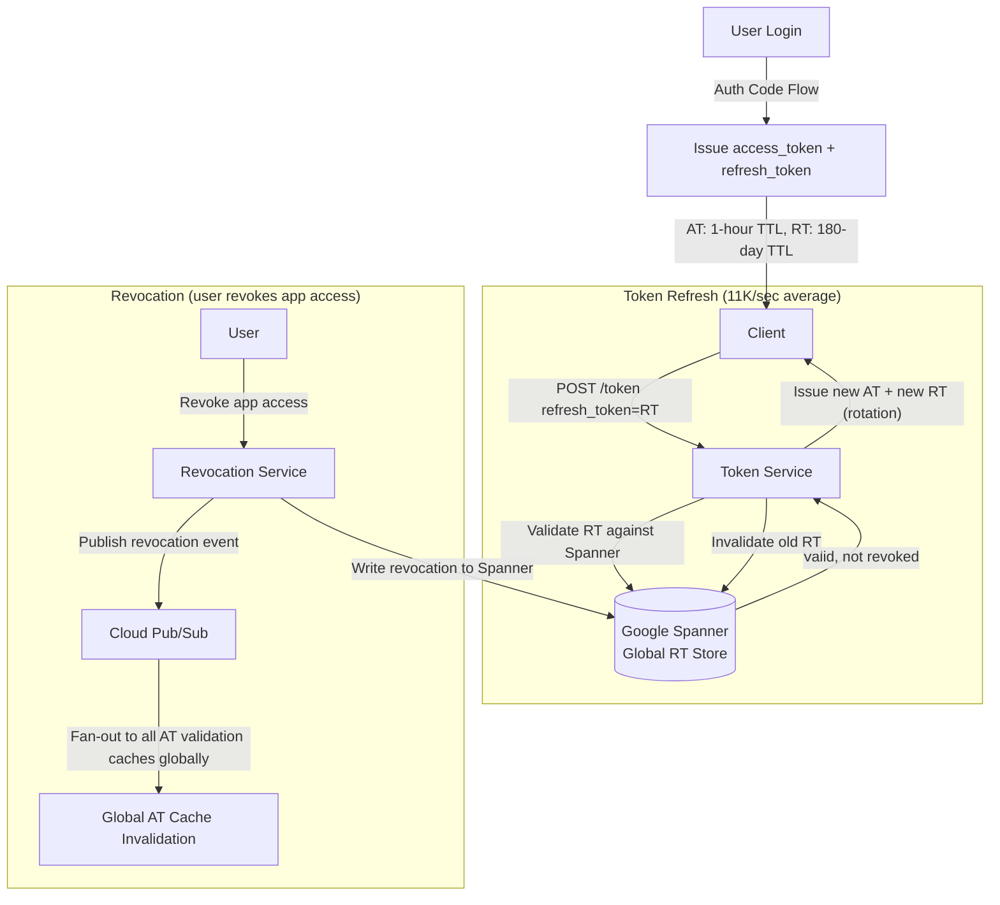
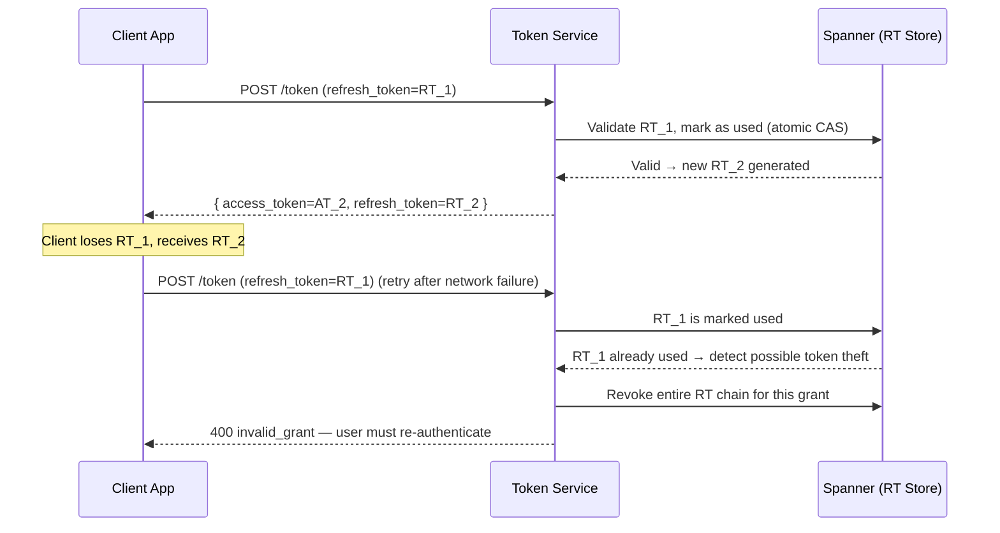

# OAuth2 & OIDC

6 questions covering OAuth2 and OpenID Connect from protocol fundamentals to billion-request-scale token management.

---

## Q1: What is OAuth2 — delegation, not authentication (common mistake)

**Role:** Mid | **Difficulty:** 🟡 | **Priority:** P0 | **Format:** Quick Answer

> **What the interviewer is testing:** Whether you can clearly state that OAuth2 is an authorization delegation protocol — not an authentication protocol — and why confusing the two causes security vulnerabilities.

### Answer in 60 seconds
- **OAuth2 purpose:** Lets a user authorize a third-party application to access their resources without sharing credentials. "I allow App X to read my Google Calendar" — that is delegation.
- **OAuth2 is NOT authentication:** The OAuth2 spec does not define how to verify who the user is. An access token proves that a user authorized an app; it does not prove the user's identity to that app.
- **The confusion:** Using an OAuth2 access token as a login mechanism. An access token says "the bearer may access /calendar" — it does not say "the bearer is alice@gmail.com."
- **The exploit:** Attacker gets an access token for their own account, replays it to your app claiming to be "logged in." Without identity verification, your app may accept it.
- **The fix:** Use OIDC (OpenID Connect) for authentication — it adds an ID token that cryptographically proves identity.
- **Core roles:** Resource Owner (user), Client (app), Authorization Server (issues tokens), Resource Server (API that accepts tokens).

### Diagram



### Pitfalls
- ❌ **"Sign in with Google" uses OAuth2:** It uses OAuth2 *and* OIDC together. The OAuth2 flow gets authorization; the OIDC layer adds the ID token with `sub` (user identity). Pure OAuth2 cannot authenticate.
- ❌ **Storing access tokens in the app DB as user identifiers:** Access tokens expire and rotate. Store the user's stable OIDC `sub` claim as the primary key, not a token.
- ❌ **Skipping token validation on the resource server:** The resource server must validate the token signature, expiry, and audience claim on every request — not just check if it's non-empty.

### Concept Reference
→ [JWT vs Sessions vs Cookies](./jwt-sessions-cookies)

---

## Q2: 4 OAuth2 flows — authorization code, client credentials, implicit (deprecated), device flow

**Role:** Mid | **Difficulty:** 🟡 | **Priority:** P0 | **Format:** Quick Answer

> **What the interviewer is testing:** Whether you can select the right flow for a given application type and explain why implicit flow was deprecated.

### Answer in 60 seconds
- **Authorization Code:** For web apps with a backend. Auth code returned to browser → exchanged for tokens server-side. Tokens never exposed to browser. Most secure for user-facing apps.
- **Client Credentials:** For machine-to-machine (M2M). No user involved. Service authenticates with its own `client_id` + `client_secret` and gets an access token. Used for microservice-to-microservice API calls.
- **Implicit (deprecated RFC 2019):** Access token returned directly in URL fragment. Designed for SPAs before CORS was widely supported. Deprecated because tokens in URL fragments are logged by servers, referrer headers, and browser history. Replace with Authorization Code + PKCE.
- **Device Flow:** For devices without browsers (smart TVs, CLI tools). Device displays a code + URL → user authenticates on a separate device → polling returns token. Used by GitHub CLI, YouTube on Roku.

### Diagram



| Flow | Use Case | User Interaction | Client Secret Needed |
|------|----------|-----------------|---------------------|
| Authorization Code | Web app with backend | Yes | Yes (server-side) |
| Auth Code + PKCE | SPA / native app | Yes | No (PKCE replaces it) |
| Client Credentials | M2M / service-to-service | No | Yes |
| Device Flow | CLI / TV / IoT | Yes (on separate device) | Optional |
| Implicit | Deprecated — don't use | Yes | No |

### Pitfalls
- ❌ **Using client credentials flow for user-facing apps:** Client credentials authenticate the app, not the user. There is no user identity in the resulting token.
- ❌ **Storing client_secret in SPA code:** Browser code is public. Use Authorization Code + PKCE instead — it requires no secret.
- ❌ **Long polling intervals in device flow:** Poll every 5 seconds maximum. Auth servers return `slow_down` error if you poll too fast — back off by 5 additional seconds per `slow_down` response.

### Concept Reference
→ [JWT vs Sessions vs Cookies](./jwt-sessions-cookies)

---

## Q3: What is PKCE — why required for native/SPA apps?

**Role:** Senior | **Difficulty:** 🔴 | **Priority:** P1 | **Format:** Deep Dive

> **What the interviewer is testing:** Whether you understand the authorization code interception attack vector and how PKCE's code verifier/challenge mechanism closes it without requiring a client secret.

### Problem Constraints
| Dimension | Value |
|-----------|-------|
| Attack | Malicious app on same device intercepts authorization code redirect |
| Vulnerable flow | Authorization Code without PKCE (no secret in public clients) |
| Fix | PKCE: cryptographically binds code to the session that requested it |
| Required since | RFC 7636 (2015), now mandatory for all public clients per RFC 9700 |

### The Attack (without PKCE)



### PKCE Flow (secure)



| Property | Without PKCE | With PKCE |
|----------|-------------|----------|
| Code interception exploitable | Yes | No — code alone is useless |
| Requires client secret | No (public client) | No |
| Added latency | None | 1 SHA-256 hash (~0.1ms) |
| Server storage | None | code_challenge stored per auth session |
| RFC | 6749 | 7636 (now mandatory for public clients) |

### Recommended Answer
PKCE (Proof Key for Code Exchange) is a protocol extension for public clients — SPAs and native apps that cannot safely store a client secret (their code is inspectable).

The mechanism: before redirecting to the auth server, the app generates a random `code_verifier` (32+ bytes of entropy), computes `code_challenge = SHA-256(code_verifier)`, and sends the challenge in the authorization request. The auth server stores this challenge. When the app exchanges the code for tokens, it must provide the original `code_verifier`. The server verifies `SHA-256(verifier) == challenge`. An attacker who intercepted only the authorization code cannot produce the verifier — they never saw it.

Since 2023 (RFC 9700), PKCE is required for all public clients and recommended for all OAuth2 clients regardless of type.

### What a great answer includes
- [ ] Explain the code interception attack (malicious app on same device)
- [ ] code_verifier = random, code_challenge = SHA-256(verifier)
- [ ] Challenge sent with authorize request; verifier sent with token request
- [ ] Server verifies: SHA-256(verifier) == challenge — code alone is insufficient
- [ ] No client secret needed — PKCE replaces it for public clients
- [ ] RFC 9700 now mandates PKCE for all public clients

### Pitfalls
- ❌ **Using `plain` as the code_challenge_method:** `plain` method sends the verifier directly as the challenge. If the challenge is intercepted (it's in the URL), the attacker has the verifier too. Always use `S256`.
- ❌ **Short code_verifier:** RFC 7636 requires 43–128 characters. A 6-character verifier is brute-forceable in milliseconds at an auth server's token endpoint.
- ❌ **PKCE in server-side apps only:** Server-side web apps with backend servers should use PKCE too, in addition to client_secret (defense in depth).

### Concept Reference
→ [Authentication Patterns](./authentication-patterns)

---

## Q4: Difference between OAuth2 and OIDC — what does ID token add?

**Role:** Mid | **Difficulty:** 🟡 | **Priority:** P1 | **Format:** Quick Answer

> **What the interviewer is testing:** Whether you can clearly articulate what OIDC adds on top of OAuth2 and what claims the ID token contains.

### Answer in 60 seconds
- **OAuth2:** Authorization delegation. Produces an **access token** (a key that grants access to an API). Does not define the token format or what identity information it contains.
- **OIDC (OpenID Connect):** Authentication layer built on OAuth2. Adds an **ID token** — a signed JWT that asserts who the user is. Adds a `/userinfo` endpoint to fetch profile data. Adds a `openid` scope to trigger the OIDC flow.
- **ID Token claims:** `sub` (stable user identifier), `iss` (issuer URL), `aud` (client ID), `exp` (expiry), `iat` (issued at), `email`, `name`, `picture` (optional profile claims).
- **Critical check:** Always verify `aud` == your client_id. An ID token issued for another app is not valid for yours — a confused deputy attack.
- **Access token vs ID token:** Access token is for the API (resource server). ID token is for the client (your app). Never send the ID token to an API as a bearer token.

### Diagram

```mermaid
graph TD
  subgraph OAuth2Only["OAuth2 only (scope: calendar:read)"]
    AS1[Auth Server] -->|"access_token (opaque or JWT)"| App1[Client App]
    App1 -->|"GET /calendar (Bearer access_token)"| RS[Resource Server]
    App1 -->|"Who is the user?"| Question["❓ OAuth2 doesn't say"]
  end

  subgraph OIDC["OAuth2 + OIDC (scope: openid email)"]
    AS2[Auth Server] -->|"access_token"| App2[Client App]
    AS2 -->|"id_token (signed JWT)"| App2
    App2 -->|"Decode id_token → sub, email, name"| Identity["✓ User identity confirmed"]
    App2 -->|"GET /userinfo (access_token)"| Userinfo[/userinfo endpoint]
    Userinfo -->|"{ sub, email, name, picture }"| App2
  end
```

### Pitfalls
- ❌ **Using access token to identify users:** Access token format is not standardized in OAuth2. Some providers return opaque strings; some return JWTs. Do not parse access tokens for identity — they're for APIs.
- ❌ **Not verifying ID token signature:** The ID token must be verified against the provider's public keys (fetched from the JWKS endpoint). An unsigned or incorrectly signed ID token is a forgery.
- ❌ **Not checking `nonce` in ID token:** For flows that support it, the `nonce` claim prevents replay attacks. Include a random nonce in the auth request and verify it in the ID token.

### Concept Reference
→ [Authentication Patterns](./authentication-patterns)

---

## Q5: OAuth2 for third-party marketplace — seller grants access to buyer platform

**Role:** Senior | **Difficulty:** 🔴 | **Priority:** P1 | **Format:** Deep Dive

> **What the interviewer is testing:** Whether you can design a real OAuth2 integration where a seller grants a marketplace limited access to their store's data, handling scopes, token management, and multi-tenant token storage.

### Problem Constraints
| Dimension | Value |
|-----------|-------|
| Sellers (resource owners) | 500,000 active stores |
| Buyer platform (client) | Single marketplace operator |
| Required access | Read orders, update inventory, create shipments |
| Token lifetime | Access token: 1 hour; Refresh token: 90 days |
| Token storage | Encrypted at rest, per-seller |
| Critical requirement | Seller can revoke access at any time |

### Architecture



### Token Refresh and Revocation



### Token Storage Security

| Property | Implementation |
|----------|---------------|
| Encryption at rest | AES-256-GCM with per-seller key (envelope encryption) |
| Key storage | AWS KMS — marketplace never sees plaintext DEK |
| Access control | Token service is the only component that can decrypt |
| Audit | Every token use logged: (seller_id, action, timestamp, result) |
| Revocation detection | Refresh failure (401) → mark seller as disconnected, notify |

### What a great answer includes
- [ ] State parameter for CSRF protection and seller context mapping (`state=seller-456`)
- [ ] Token encrypted at rest with envelope encryption (not stored plaintext)
- [ ] Proactive token refresh before expiry (not reactive on 401)
- [ ] Webhook-based revocation handling (don't wait until next API call fails)
- [ ] Scopes aligned to minimum required permissions (not wildcard)
- [ ] Seller dashboard showing what access was granted and how to revoke

### Pitfalls
- ❌ **Storing access tokens in plaintext:** A DB breach exposes all seller integrations. Always encrypt tokens at rest.
- ❌ **Reactive token refresh (on 401):** During a 401-triggered refresh, the original API call fails and must be retried. Proactive refresh prevents any downtime.
- ❌ **Single refresh token for all sellers:** If the refresh endpoint is breached, scope the breach. Issue and store separate refresh tokens per seller — one compromised token does not expose others.

### Concept Reference
→ [JWT vs Sessions vs Cookies](./jwt-sessions-cookies)

---

## Q6: Google's OAuth2 — token refresh at 1B requests/day

**Role:** Staff | **Difficulty:** ⚫ | **Priority:** P2 | **Format:** Deep Dive

> **What the interviewer is testing:** Whether you can reason about token lifecycle management at billion-request scale, including refresh token rotation, revocation propagation, and the consistency challenges in a globally distributed token store.

### Problem Constraints
| Dimension | Value |
|-----------|-------|
| Active OAuth2 clients | 100M+ (Android devices, third-party apps) |
| Token refresh rate | 1B requests/day (~11,574/sec average, 100K/sec peak) |
| Access token TTL | 1 hour |
| Refresh token TTL | Up to 6 months (Google) |
| Revocation latency | Must propagate globally within 60 seconds |
| Consistency challenge | Token used vs revoked — distributed decision |

### Token Lifecycle



### Refresh Token Rotation



| Property | Without Rotation | With Rotation |
|----------|-----------------|--------------|
| Stolen RT impact | Valid for 6 months | Single use — detected on next use |
| RT theft detection | None | Reuse of used RT → chain revocation |
| Network retry safety | Safe | Must handle retry with idempotency |
| Implementation complexity | Low | Medium |

### Scale Architecture

```
Token validation at 100K/sec peak:
- Access tokens: Validated locally by resource servers using cached public keys (JWKS)
  - No central call needed — JWT signature verification is CPU-bound (~0.5ms)
  - Key rotation: RS256 keys rotated every 6 hours, JWKS endpoint cached at CDN
- Refresh tokens: Validated against Spanner
  - Spanner: 1M+ reads/sec globally with <10ms p99 latency
  - Refresh tokens validated only at refresh time (~1/3600 of access token usage)
  - Effective RT validation rate: 100K AT/sec / 3600 sec = ~28 RT validations/sec per client
```

### What a great answer includes
- [ ] Access tokens are short-lived (1 hour) and validated locally via JWT signature (no central DB call)
- [ ] Refresh tokens validated against Spanner — the central truth store
- [ ] Refresh token rotation: single-use, rotation chain enables theft detection
- [ ] Revocation: Spanner write + Pub/Sub fan-out for cache invalidation
- [ ] JWKS endpoint for public key distribution — cached, not per-request
- [ ] Separation of concerns: AT validation is distributed, RT validation is centralized

### Pitfalls
- ❌ **Validating every access token against a central DB:** At 100K AT uses/sec, a central validation DB would need to handle 100K reads/sec just for token checks. JWTs shift this to the resource server using cached public keys.
- ❌ **No RT reuse detection:** A single-use RT that is used twice indicates theft. Without rotation, you have no signal. Log reuse attempts and notify the user.
- ❌ **Assuming RT theft requires re-authentication:** Google's approach is to revoke the entire grant on RT reuse detection. This forces re-login but protects the account. Partial revocation is complex and error-prone.

### Concept Reference
→ [Authentication Patterns](./authentication-patterns)
