# Zero Trust Architecture

6 questions covering Zero Trust from foundational principles to enterprise migration roadmaps.

---

## Q1: Zero trust vs perimeter model — "never trust, always verify"

**Role:** Mid | **Difficulty:** 🟡 | **Priority:** P0 | **Format:** Quick Answer

> **What the interviewer is testing:** Whether you can articulate why the perimeter model is broken in a cloud/hybrid world and what "never trust, always verify" means operationally.

### Answer in 60 seconds
- **Perimeter model ("castle and moat"):** Everything inside the corporate network is trusted. VPN grants full network access. One breach of the perimeter = attacker moves freely through the "trusted" interior. Assumption: "if you're inside the network, you're an employee."
- **Why perimeter fails:** (1) 80% of breaches involve lateral movement after an initial perimeter breach (Verizon DBIR). (2) Cloud services, SaaS tools, and remote work mean there is no defined perimeter anymore. (3) Supply chain attacks compromise "trusted" internal machines.
- **Zero Trust principle:** "Never trust, always verify." No implicit trust based on network location. Every request — whether from outside or inside — must be authenticated, authorized, and validated.
- **Zero Trust properties:** (1) Verify user identity (AuthN). (2) Verify device health (endpoint compliance). (3) Enforce least-privilege access per request. (4) Assume breach — log everything, assume attacker is already inside.
- **Practical example:** A laptop on the corporate WiFi must still authenticate to access Google Drive. Network location grants zero access. Identity + device certificate + policy evaluation grants access.

### Diagram

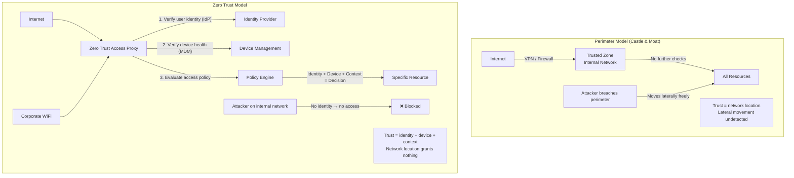

### Pitfalls
- ❌ **"Zero Trust means no VPN":** Zero Trust often uses VPN *as a transport* but adds identity and device verification on top. The key difference: VPN alone grants broad network access; Zero Trust grants access to specific resources after verification.
- ❌ **Confusing Zero Trust with Zero Perimeter:** Zero Trust does not eliminate network controls. It adds identity-centric controls on top of existing network segmentation.
- ❌ **Big-bang Zero Trust deployment:** Zero Trust is a 3–5 year transformation. Start with the highest-risk access paths (remote admin access, customer data) and expand progressively.

### Concept Reference
→ [Authentication Patterns](./authentication-patterns)

---

## Q2: mTLS vs TLS — service-to-service authentication (mutual certificate validation)

**Role:** Senior | **Difficulty:** 🔴 | **Priority:** P1 | **Format:** Deep Dive

> **What the interviewer is testing:** Whether you understand what "mutual" adds to TLS and how mTLS enables cryptographic service identity in a microservices mesh.

### Problem Constraints
| Dimension | Value |
|-----------|-------|
| Services | 500 microservices in Kubernetes |
| Threat | Compromised service impersonates another (lateral movement) |
| Authentication method | X.509 certificates per service (SPIFFE SVIDs) |
| Certificate lifetime | 24 hours (short-lived, auto-rotated) |
| Performance | mTLS adds ~1ms per new connection; amortized over HTTP/2 connection reuse |

### TLS vs mTLS

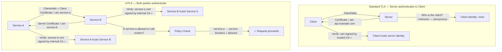

### Certificate Lifecycle in mTLS

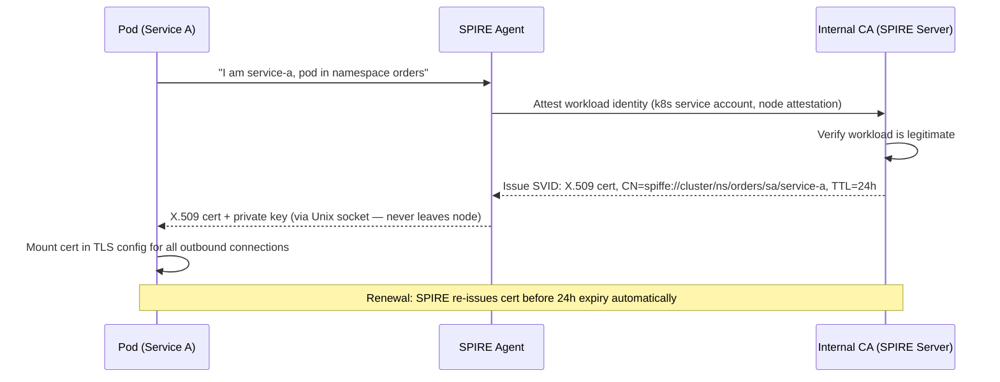

| Dimension | One-way TLS | mTLS |
|-----------|------------|------|
| Server authenticated | Yes | Yes |
| Client authenticated | No | Yes (certificate) |
| Lateral movement defense | No | Yes — impersonation blocked |
| Key management | Server cert only | Cert per service |
| Complexity | Low | High (PKI management) |
| Service mesh support | Istio, Linkerd (transparent) | Istio, Linkerd (transparent mTLS) |

### Recommended Answer
mTLS extends TLS by requiring both parties to present and verify X.509 certificates. In a service mesh, this cryptographically proves service identity: Service A cannot claim to be Service B without Service B's certificate, which only Service B's SPIFFE agent has.

In Kubernetes with Istio or Linkerd, mTLS is transparent — the sidecar proxy (Envoy) handles certificate issuance and mutual authentication without any application code changes. Services communicate as if on plain HTTP; the sidecar encrypts and authenticates.

Short-lived certificates (24 hours) eliminate revocation complexity — a compromised certificate expires quickly. SPIRE automates rotation so services never handle long-lived credentials.

### What a great answer includes
- [ ] Standard TLS: server authenticates to client; client is anonymous
- [ ] mTLS: both present X.509 certs; both verified against internal CA
- [ ] Defense: an attacker who compromises one service cannot impersonate another
- [ ] Kubernetes implementation: Istio/Linkerd service mesh handles cert issuance transparently
- [ ] SPIFFE SVIDs: spiffe://trust-domain/namespace/serviceaccount format
- [ ] Short-lived certs (24h) eliminate need for CRL/OCSP revocation infrastructure

### Pitfalls
- ❌ **Long-lived service certificates:** A 10-year certificate for a service means a single cert theft grants 10 years of impersonation capability. Use 24-hour certs with automated rotation.
- ❌ **Self-signed certs per service without a CA:** Individual self-signed certs cannot be validated against a trust root. Services must share an internal CA (SPIRE, Vault PKI, or cert-manager).
- ❌ **mTLS without policy:** mTLS proves identity but doesn't enforce authorization. Service A and Service B are both authenticated, but should A be allowed to call B's `/admin` endpoint? Combine mTLS identity with OPA policies.

### Concept Reference
→ [Zero Trust Architecture](./zero-trust-architecture)

---

## Q3: Google BeyondCorp — what replaced the VPN (device trust + user identity)

**Role:** Senior | **Difficulty:** 🔴 | **Priority:** P1 | **Format:** Deep Dive

> **What the interviewer is testing:** Whether you know Google's seminal zero-trust implementation, its key architectural components, and what specific problem each component solves.

### Problem Constraints
| Dimension | Value |
|-----------|-------|
| Trigger | 2010 Operation Aurora — sophisticated attacker moved laterally through VPN-trusted network |
| Goal | Any employee can work securely from any network without VPN |
| Timeline | 2011–2017 full rollout to 60,000+ employees |
| Published | BeyondCorp papers (2014–2018), model for industry |

### Architecture Components

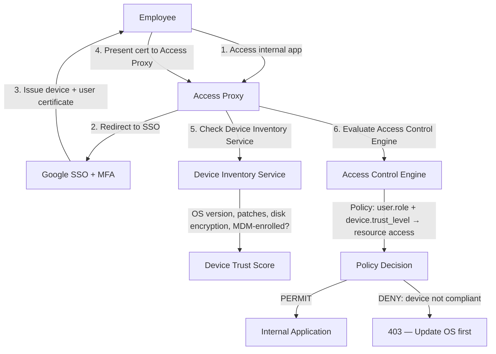

### The Four BeyondCorp Pillars

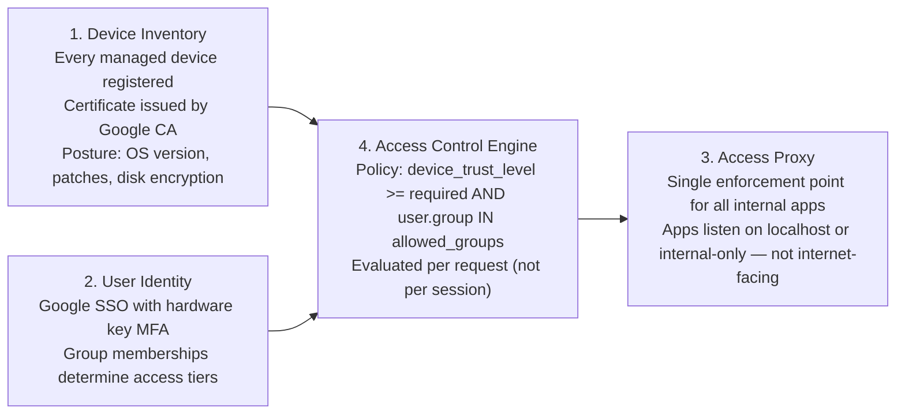

| Property | VPN (before BeyondCorp) | BeyondCorp |
|----------|------------------------|------------|
| Network trust | "Inside = trusted" | Network location irrelevant |
| Access scope | All internal resources after VPN connect | Specific app per policy decision |
| Device check | None | OS version, patches, MDM enrollment |
| Lateral movement risk | High — VPN grants broad access | Low — each app has independent policy |
| Remote work friction | VPN client, split tunnel issues | Direct HTTPS — no VPN client |
| Breach impact | Attacker moves everywhere | Attacker limited to compromised user's apps |

### What a great answer includes
- [ ] Trigger: Operation Aurora (2010) demonstrated VPN perimeter failure
- [ ] Device inventory: every device has a certificate; posture checked on every request
- [ ] User identity: Google SSO + MFA (hardware keys after 2017)
- [ ] Access Proxy: apps are not internet-facing; proxy enforces policy
- [ ] Access Control Engine: policy evaluated per-request, not just at session start
- [ ] Result: employees work from any network without VPN
- [ ] Industry impact: BeyondCorp papers became the blueprint for ZTNA (Zero Trust Network Access)

### Pitfalls
- ❌ **"BeyondCorp eliminates authentication":** BeyondCorp enhances authentication (adds device trust). The user still authenticates with SSO + MFA — every time.
- ❌ **BYOD without device enrollment:** BeyondCorp requires device management. A personal laptop not enrolled in MDM has no certificate and cannot access internal apps. Design a BYOD policy before deploying zero trust.
- ❌ **One-time policy evaluation at session start:** Policies must be re-evaluated on each request. A user whose device becomes non-compliant mid-session (pending update) should be denied further access.

### Concept Reference
→ [mTLS vs TLS](./zero-trust-architecture)

---

## Q4: Microsegmentation — how it limits blast radius (east-west traffic control)

**Role:** Senior | **Difficulty:** 🔴 | **Priority:** P1 | **Format:** Deep Dive

> **What the interviewer is testing:** Whether you can explain why flat internal networks enable lateral movement and how microsegmentation restricts east-west traffic to defined communication paths.

### Problem Constraints
| Dimension | Value |
|-----------|-------|
| Threat | Attacker compromises one host → moves to payment service → exfiltrates card data |
| Flat network | Every host can reach every other host on 10.0.0.0/8 |
| Blast radius without segmentation | Entire internal network accessible from one compromised host |
| Goal | Compromised host can only reach services it legitimately needs |

### Flat Network (before microsegmentation)

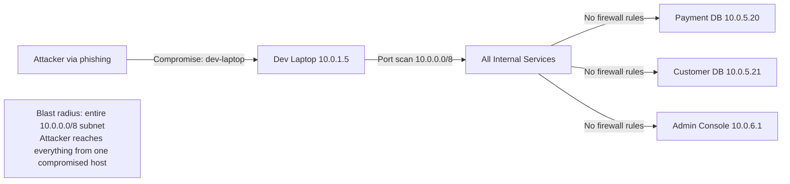

### Microsegmented Network

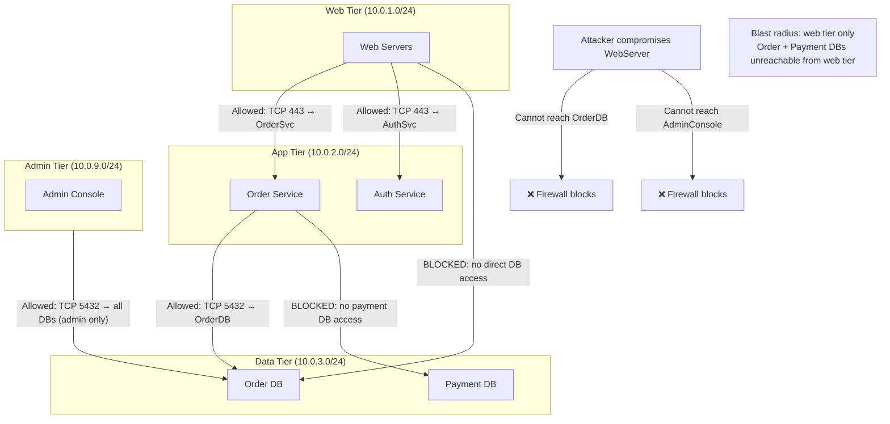

### Implementation Methods

| Method | Level | Tool | Granularity |
|--------|-------|------|------------|
| Network ACLs | Subnet → subnet | AWS Security Groups, VLANs | CIDR blocks |
| Host-based firewall | Host → host | iptables, Windows Firewall | Per-IP/port |
| Service mesh policy | Pod → pod | Istio AuthorizationPolicy, Calico | Service identity |
| Cloud security groups | Instance → instance | AWS SG, GCP VPC firewall | Security group membership |

### Kubernetes: Namespace Network Policy

```
Pseudo-code: Kubernetes NetworkPolicy

# Order Service: allow inbound from Web tier only
apiVersion: networking.k8s.io/v1
kind: NetworkPolicy
metadata:
  name: order-svc-ingress
  namespace: app-tier
spec:
  podSelector:
    matchLabels:
      app: order-service
  policyTypes:
    - Ingress
  ingress:
    - from:
        - namespaceSelector:
            matchLabels:
              tier: web        # Only web-tier namespace
      ports:
        - protocol: TCP
          port: 8080
# Default deny all → only defined rules are allowed
```

### What a great answer includes
- [ ] Flat network problem: east-west traffic unrestricted after initial breach
- [ ] Microsegmentation principle: explicitly allow required paths, deny everything else
- [ ] Tiers: web → app → data, with no skip-layer access
- [ ] Kubernetes implementation: NetworkPolicy or Calico/Cilium for pod-level control
- [ ] Service mesh: Istio AuthorizationPolicy adds identity-based east-west control
- [ ] Blast radius metric: how many services are reachable from a compromised pod

### Pitfalls
- ❌ **Overly permissive rules:** `0.0.0.0/0` on internal rules defeats segmentation. Audit rules quarterly and remove any wildcard source addresses.
- ❌ **Not segmenting dev/staging from production:** Developers often have access to staging, which has access to production DBs "for convenience." Production must be fully isolated from dev/staging network segments.
- ❌ **Perimeter segmentation only:** East-west controls within a tier are as important as between tiers. Within the app tier, the auth service should not have access to the analytics service.

### Concept Reference
→ [API Security Patterns](./api-security-patterns)

---

## Q5: SPIFFE/SPIRE — workload identity in Kubernetes (SVIDs, X.509 certs)

**Role:** Senior | **Difficulty:** 🔴 | **Priority:** P1 | **Format:** Deep Dive

> **What the interviewer is testing:** Whether you can explain the problem of workload identity (how does a pod prove who it is?) and how SPIFFE/SPIRE solves it with attestable, short-lived X.509 certificates.

### Problem Constraints
| Dimension | Value |
|-----------|-------|
| Problem | Pods need to authenticate to other services without human-managed secrets |
| Scale | 10,000 pods across 5 Kubernetes clusters |
| Certificate lifetime | 1 hour (short-lived, auto-rotated) |
| Standard | SPIFFE (Secure Production Identity Framework For Everyone) — CNCF project |
| Implementation | SPIRE (SPIFFE Runtime Environment) |

### The Workload Identity Problem

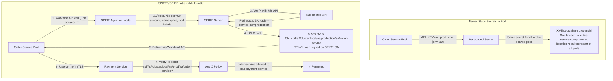

### SPIFFE SVID Format

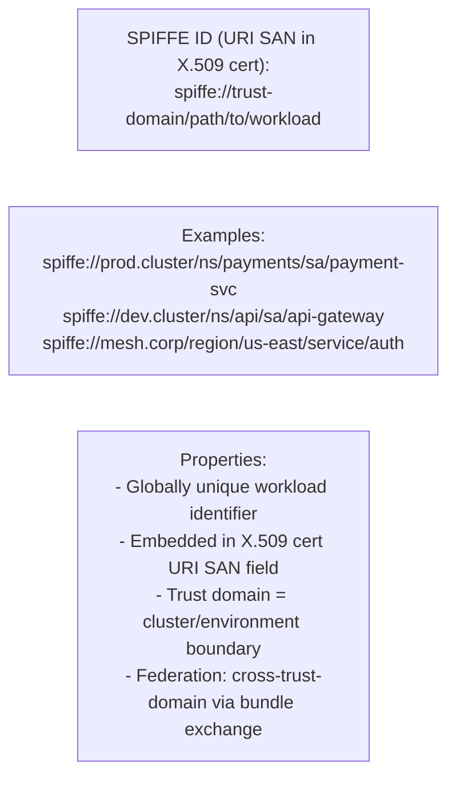

### Certificate Rotation Flow

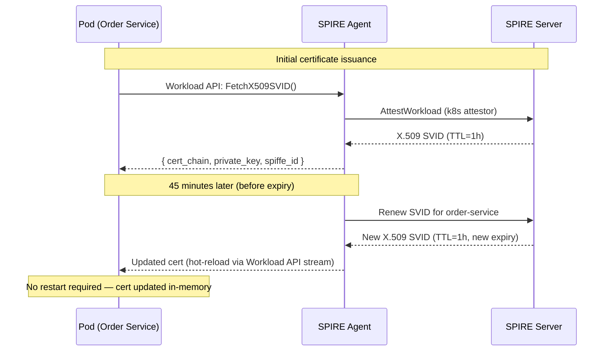

| Property | Static Secrets | SPIFFE SVIDs |
|----------|---------------|-------------|
| Identity granularity | Per-service (shared) | Per-pod-instance |
| Rotation | Manual / restart required | Automatic every hour |
| Breach impact | All pods with same secret | Single pod's 1-hour cert window |
| Human involvement | High (secret management) | Zero (fully automated) |
| Cross-cluster identity | Difficult | Native (federation via trust bundles) |

### What a great answer includes
- [ ] Problem: static secrets are shared, long-lived, and require manual rotation
- [ ] SPIFFE ID: URI format `spiffe://trust-domain/workload-path` embedded in X.509 SAN
- [ ] SPIRE attestation: node and workload attestors verify the pod's identity claims via k8s API
- [ ] Short-lived certs (1 hour): eliminates revocation infrastructure — certs expire quickly
- [ ] Hot reload: SPIRE agent streams updated certs before expiry — no pod restart
- [ ] mTLS integration: pods use SVID as their mTLS certificate for service-to-service auth

### Pitfalls
- ❌ **Long-lived SPIFFE certs:** The value of SPIFFE is short-lived automated rotation. Setting TTL to 1 year removes the key benefit. Use 1–24 hour TTLs.
- ❌ **Not federating across clusters:** Services in cluster A cannot validate SVID from cluster B without trust bundle federation. Configure SPIRE Server federation before deploying cross-cluster mTLS.
- ❌ **SPIRE Server as a single point of failure:** SPIRE Server must be highly available. Deploy with HA mode (PostgreSQL backend, multiple replicas). Agents cache SVIDs locally to survive short SPIRE Server outages.

### Concept Reference
→ [mTLS vs TLS](./zero-trust-architecture)

---

## Q6: Zero trust migration roadmap from VPN + perimeter (phases, tools, timelines)

**Role:** Staff | **Difficulty:** ⚫ | **Priority:** P2 | **Format:** Deep Dive

> **What the interviewer is testing:** Whether you can design a realistic multi-year zero trust migration that maintains availability throughout, prioritizes the highest-risk access paths first, and maps tools to phases.

### Problem Constraints
| Dimension | Value |
|-----------|-------|
| Starting state | VPN + perimeter firewall, 5,000 employees, 200 internal apps |
| Current breach risk | Lateral movement post-VPN auth affects all 200 apps |
| Timeline budget | 18–24 months for Phase 1-3; full migration 3–5 years |
| Constraint | Cannot disrupt business operations during migration |
| Regulatory | SOC2 Type II, PCI-DSS |

### Migration Phases

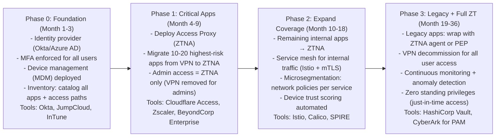

### Tool Mapping by Function

```mermaid
graph TD
  subgraph IdentityLayer["Identity & Access"]
    IDProvider[Identity Provider: Okta / Azure AD / Google Workspace]
    MFA2[MFA: Hardware Keys (YubiKey) + Authenticator App]
    SSO[SSO: SAML / OIDC federation to all apps]
  end

  subgraph DeviceLayer["Device Trust"]
    MDM[MDM: Jamf (Mac) / InTune (Windows)]
    EDR[EDR: CrowdStrike / SentinelOne]
    DeviceScore[Device Trust: OS patched, disk encrypted, EDR running]
  end

  subgraph AccessLayer["Access Enforcement"]
    ZTNA_SaaS[ZTNA SaaS: Cloudflare Access / Zscaler Private Access]
    ServiceMesh[Service Mesh: Istio / Linkerd (mTLS internal)]
    Segmentation[Network Policy: Calico / Cilium]
  end

  subgraph WorkloadLayer["Workload Identity"]
    SPIRE2[SPIRE: SVIDs for pod-to-pod auth]
    SecretsManager[Secrets: HashiCorp Vault / AWS Secrets Manager]
  end

  IDProvider --> ZTNA_SaaS
  DeviceScore --> ZTNA_SaaS
  ZTNA_SaaS --> SSO
  SPIRE2 --> ServiceMesh
```

### Risk Prioritization Matrix

| App Category | Current Risk | Phase | Approach |
|-------------|-------------|-------|----------|
| Admin/jump servers | Critical | Phase 1 | ZTNA + hardware key MFA |
| Payment systems | Critical | Phase 1 | ZTNA + device trust + BPAC |
| Developer tools (GitHub, CI/CD) | High | Phase 1 | ZTNA + SSO |
| Internal comms (Slack, email) | Medium | Phase 2 | Already SaaS — enforce SSO + MFA |
| Internal web apps | Medium | Phase 2 | ZTNA migration |
| Legacy apps (client-server) | Low-medium | Phase 3 | ZTNA agent wrapper or PEP |
| Network printing/IoT | Low | Phase 3 | Segment to isolated VLAN |

### Success Metrics

```
Phase 1 complete indicators:
- % of admin access via ZTNA: 100%
- % of employees with MFA enrolled: 95%+
- # of apps accessible directly via VPN (not ZTNA): 0 for critical tier

Phase 2 complete indicators:
- % of internal API traffic with mTLS: 80%+
- # of microsegmentation rules deployed: covers all data-tier access
- Mean time to revoke access for departed employee: < 1 hour

Phase 3 complete indicators:
- VPN monthly active users: 0 (decommissioned)
- % of workloads with SPIFFE identity: 90%+
- # of standing privileged accounts: 0 (all JIT via Vault/CyberArk)
```

### What a great answer includes
- [ ] Phase 0: identity foundation before any ZTNA deployment (IdP + MFA + device inventory)
- [ ] Phase 1: highest-risk apps first (admin access, payment systems) — not all 200 apps at once
- [ ] Parallel operation: VPN + ZTNA simultaneously during migration; VPN removed only after validation
- [ ] Service mesh in Phase 2 for internal east-west traffic (distinct from user access ZTNA)
- [ ] Legacy apps: ZTNA proxy agent wraps apps that cannot be modified
- [ ] Success metrics: quantifiable KPIs per phase, not just "we deployed zero trust"

### Pitfalls
- ❌ **Starting with microsegmentation before identity:** Network segmentation without identity-based enforcement is still perimeter security. Identity (IdP + device trust) must come first.
- ❌ **Cutting VPN before ZTNA is proven:** Remove VPN access for each app *after* ZTNA covers it and is validated by users. A big-bang VPN cutoff causes mass access outages.
- ❌ **Neglecting the contractor / third-party access model:** Contractors may not be enrolled in MDM. Define a separate ZTNA profile for managed vs unmanaged devices with different access scopes (narrower for unmanaged).

### Concept Reference
→ [Authentication Patterns](./authentication-patterns)
