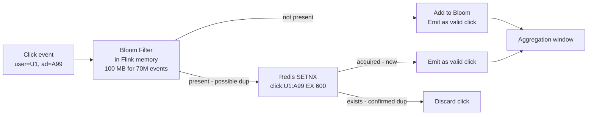
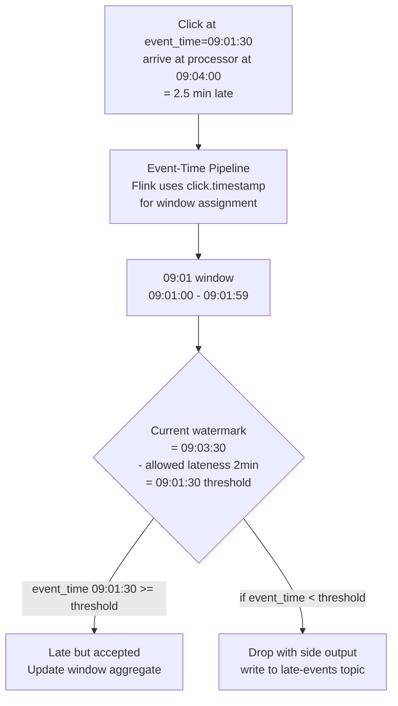
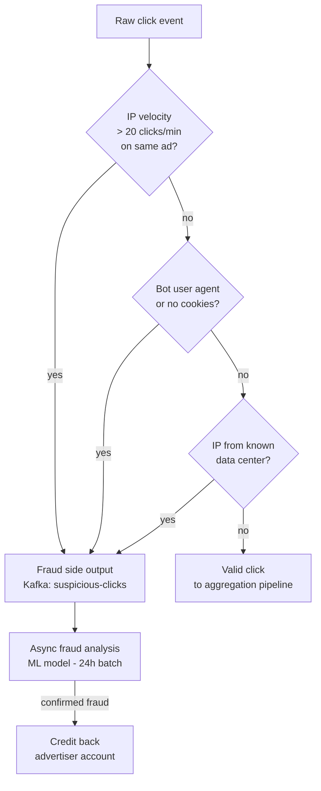
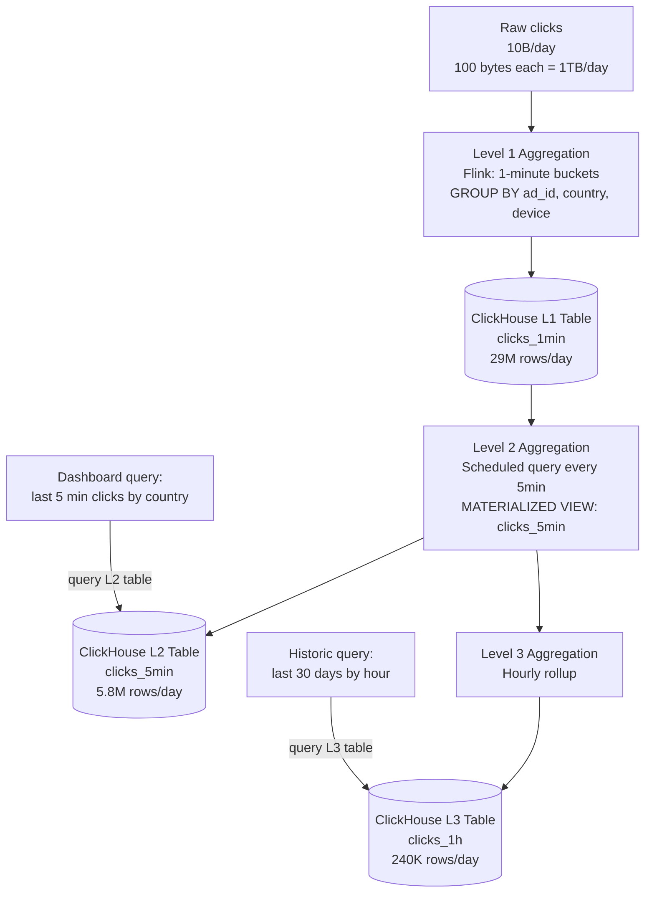

# Design an Ad Click Aggregator

---

## Q1: Design an ad click aggregator handling 10B clicks/day with under 5-minute latency

**Role:** Senior | **Difficulty:** 🔴 Senior | **Priority:** P0 | **Format:** Scenario
**Real Company:** Google Ads — $237B revenue (2023), clicks processed in near-real-time; Meta Ads — 10M+ advertisers rely on sub-minute reporting; Criteo — 100B+ events/day

### The Brief
> "Design an ad click aggregation system. Advertisers need near-real-time reports: 'how many times was my ad clicked in the last 5 minutes, by country, device type, and ad campaign.' The system must handle 10 billion clicks per day (about 116K clicks/sec), ensure no click is counted twice, aggregate results within 5 minutes of the click, and support 100 active advertisers with dashboards showing live metrics."

### Clarifying Questions to Ask First
1. Do we need raw click data queryable by advertisers, or just pre-aggregated metrics?
2. What aggregation dimensions are required — just count, or also CTR, conversion rate?
3. How do we define deduplication — within a 60-second window, or per user per ad per hour?
4. Do advertisers need historical data (30 days back) or just rolling 24h?

### Back-of-Envelope Estimation
| Metric | Calculation | Result |
|--------|-------------|--------|
| Clicks/sec | 10B ÷ 86400 | ~116K clicks/sec avg |
| Peak clicks/sec | 116K × 3 (peak hours) | ~350K clicks/sec |
| Click event size | 100 bytes (user_id, ad_id, timestamp, geo, device) | — |
| Ingest bandwidth | 116K × 100B | ~11.6 MB/sec |
| Storage (raw, 30 days) | 10B × 100B × 30 | ~30 TB/month |
| Aggregated results | 100 advertisers × 1K dimensions × 288 5-min buckets | ~29M rows/day |
| Dashboard queries | 100 advertisers × 10 queries/min | ~1K queries/sec |
| Dedup window | 10 min window, 116K × 600s | ~70M events in dedup window |

### High-Level Architecture

```mermaid
graph TD
  Ad[Ad Click\nuser browser] -->|POST /click\nHTTP pixel| ClickIngestor[Click Ingestor\nstateless pods]
  ClickIngestor -->|validate + enrich| Kafka[Kafka\nad-clicks topic\n100 partitions\npartitioned by ad_id]

  Kafka --> DedupFilter[Dedup Filter\nFlink job\nBloom filter per 10min window]
  DedupFilter -->|unique clicks| AggJob[Aggregation Job\nFlink - tumbling window 1min\ngroup by ad_id, country, device]
  AggJob -->|pre-aggregated counts| OLAP[(OLAP Store\nClickHouse / Druid\ncolumnar storage)]

  Kafka -->|raw clicks| RawStore[Raw Click Store\nS3 Parquet\nfor billing reconciliation]

  Dashboard[Advertiser Dashboard] -->|SELECT SUM(clicks) WHERE ad_id=X\nAND time > NOW()-5m| OLAP
  OLAP -->|sub-second response| Dashboard

  FraudDetector[Fraud Detector\nFlink side-output] --> FraudKafka[Kafka: suspicious-clicks]
  FraudKafka --> FraudDB[(Fraud Store\nPostgreSQL\nfor investigation)]
```

### Deep Dive: Stream Processing Pipeline

```mermaid
graph TD
  RawClick[Raw click event\n{user_id, ad_id, ip, ua, ts}] --> Validate[Validation\nreject malformed\ncheck ad_id exists]
  Validate --> Enrich[Enrichment\nip → country via MaxMind\nua → device type]
  Enrich --> DedupCheck[Dedup Check\nBloom filter:\nseen({user_id, ad_id}, 10min window)?]
  DedupCheck -->|not seen| SetSeen[Add to Bloom filter\nemit to aggregation]
  DedupCheck -->|duplicate| Drop[Drop event\nincrement dedup counter]
  SetSeen --> AggWindow[Flink Tumbling Window\n1-minute buckets\nGROUP BY ad_id, country, device\nSUM(clicks)]
  AggWindow --> WriteOLAP[Write to ClickHouse\nevery 60s]
```

### Trade-off Decisions
| Decision | Option A | Option B | Chosen | Why |
|----------|----------|----------|--------|-----|
| Ingest buffer | Kafka | Kinesis | Kafka | Kafka at 100 partitions handles 350K events/sec; replay capability for reprocessing |
| Stream processor | Spark Streaming | Apache Flink | Flink | Flink true streaming (not micro-batch); lower latency; better state management for dedup windows |
| Aggregation storage | PostgreSQL | ClickHouse | ClickHouse | ClickHouse columnar storage returns SUM queries on billions of rows in < 1s; PostgreSQL row storage = 10-60s |
| Dedup mechanism | Redis SET | Bloom filter | Bloom filter (primary) + Redis (secondary) | 70M events/10min window; Redis SET = 70M × 30B = 2.1 GB; Bloom filter = 100 MB with 1% false positive rate |

### Failure Modes
| Failure | Impact | Mitigation |
|---------|--------|------------|
| Click fraud | Advertiser charged for fake clicks; budget depleted | Velocity check: > 10 clicks/min per user per ad = suspicious; IP reputation scoring; isolate in fraud topic |
| Late data (clicks arrive after window closes) | Missing counts in 5-min bucket | Flink watermark + allowed lateness 2min; late events update existing aggregation with UPSERT |
| Hot advertiser partition | Single large advertiser's ad_id overwhelms one Kafka partition | Salt partition key: `ad_id + random(0..10)` — 10 sub-partitions per advertiser; merge in aggregation |
| OLAP write failure | Aggregation data lost | Write to Kafka `aggregated-clicks` topic first; OLAP consumes from Kafka; Kafka is durable source of truth |

### Concept References

---

## Q2: How do you deduplicate 116K clicks/second without losing valid clicks?

**Role:** Mid | **Difficulty:** 🟡 Mid | **Priority:** P0 | **Format:** Quick Answer

> **What the interviewer is testing:** Whether you know the difference between exact dedup (Redis SET) and probabilistic dedup (Bloom filter), and can reason about memory and false positive trade-offs at 10B events/day.

### Answer in 60 seconds
- **Definition of duplicate:** Same user clicking same ad within 10-minute window = one billable click
- **Bloom filter:** Probabilistic structure — `contains(user_id + ad_id)` returns false positive at ~1% rate; 100 MB for 70M events; false positive = undercounting clicks (advertiser pays less — acceptable)
- **Redis SET (exact):** `SETNX click:{user_id}:{ad_id} 1 EX 600` — exact dedup but 70M entries × 30 bytes = 2.1 GB per 10-min window; resets every window
- **Hybrid approach:** Bloom filter in Flink job memory for fast first-pass (1% false positive = 1% undercount); exact Redis check for high-value clicks (> $1 bid) where false positive has billing impact
- **Industry practice:** Google uses approximate dedup for display ads; exact reconciliation against billing log daily

### Diagram



### Pitfalls
- ❌ **Using user_id alone as dedup key:** User clicks different ads from the same advertiser — each is a valid click; dedup key must be `(user_id, ad_id)` not just `user_id`
- ❌ **Bloom filter without window reset:** Bloom filter is append-only; if not reset, after 1 day it marks all new clicks as duplicates (100% false positive rate); use sliding window Bloom filter or reset every 10 minutes

### Concept Reference

---

## Q3: How does Flink's windowing handle late-arriving clicks?

**Role:** Senior | **Difficulty:** 🔴 Senior | **Priority:** P1 | **Format:** Deep Dive

> **What the interviewer is testing:** Whether you understand event-time vs processing-time windows, watermarks, and how late data is handled in stream processing without dropping valid clicks.

### Problem Constraints
| Dimension | Value |
|-----------|-------|
| Click latency distribution | 90% arrive within 30s of event time; 99% within 2 min; 1% arrive > 5 min late (mobile offline) |
| Aggregation window | 1-minute tumbling window (merge into 5-min bucket for dashboard) |
| Late data policy | Accept up to 2 min late; drop beyond that; alert on drop rate > 0.1% |

### Event Time vs Processing Time



### Watermark Strategy

```mermaid
graph LR
  KafkaPartitions[Kafka partitions\neach has own event stream] --> WatermarkGen[Flink Watermark Generator\nper partition\nwatermark = max_event_time - 2min]
  WatermarkGen --> MergedWatermark[Global Watermark\n= min(all partition watermarks)\nconservative - waits for slowest partition]
  MergedWatermark --> WindowTrigger[Trigger window close\nwhen watermark passes window_end]
  WindowTrigger --> WriteResult[Write 09:01 window result\nto ClickHouse]
```

| Dimension | Processing-Time Windows | Event-Time Windows |
|-----------|------------------------|-------------------|
| Simplicity | High — use system clock | Medium — need watermarks |
| Accuracy | Wrong for late/out-of-order events | Correct — assigns to true occurrence time |
| Late data | Counted in wrong window | Counted in correct window (within lateness) |
| Use case | Monitoring (approx) | Billing (must be accurate) |

### Recommended Answer
Always use event-time windowing for billing-critical click aggregation. Flink watermark at max_seen_event_time - 2min means Flink waits 2 minutes after a window boundary before declaring the window complete. Mobile clicks that arrive 90 seconds late (common during spotty connectivity) still land in the correct 1-minute window. Clicks arriving > 2 min late go to a side output (`late-clicks` Kafka topic) — reconciled during nightly batch billing run against raw S3 click data. Drop rate monitored: > 0.1% late drops triggers alert to investigate network/source issues.

### What a great answer includes
- [ ] Distinguishes event-time from processing-time and states which to use for billing
- [ ] Explains watermark = max_event_time - allowed_lateness formula
- [ ] Describes side output for late events (not silently dropped)
- [ ] Mentions nightly reconciliation against raw S3 data as final accuracy check

### Pitfalls
- ❌ **Using processing-time windows for billing:** User clicks at 09:01 PM, arrives at 09:06 PM — processing-time window puts it in 09:06 bucket, not 09:01; advertiser billed in wrong reporting period
- ❌ **Setting allowed lateness too high:** 10-minute lateness = Flink keeps 10 minutes of state per window in memory; at 116K events/sec × 600s = 70M events in memory → OOM; balance accuracy vs memory with 2-minute allowed lateness

### Concept Reference

---

## Q4: How do you detect and filter click fraud in real-time?

**Role:** Senior | **Difficulty:** 🔴 Senior | **Priority:** P1 | **Format:** Quick Answer

> **What the interviewer is testing:** Whether you understand the signals for click fraud detection, where in the pipeline to apply fraud filters, and the trade-off between false positive (blocking valid clicks) and false negative (letting fraud through).

### Answer in 60 seconds
- **IP velocity check:** Same IP > 20 clicks on same ad in 1 minute → suspicious; Redis sliding window counter `ZINCRBY ip:{ip} 1; ZCOUNT last 60s`
- **User agent anomalies:** Bot-like UA strings, missing referrer, headless browser detection (no JS, no cookies)
- **Click-through-rate anomaly:** CTR > 30% on any ad = abnormal (industry avg 0.1–3%); bot traffic drives CTR to 100%
- **Conversion fraud:** Clicks never result in any downstream action (page visit > 5s, add to cart, purchase); invalid traffic = clicks with 0% conversion rate
- **Invalid Traffic (IVT):** Google classifies: General IVT (bots, known data centers) = filtered immediately; Sophisticated IVT (human-like bots) = detected via ML model in 24h batch
- **Action:** Filter GIVTs in real-time Flink pipeline; flag SIVT for async ML analysis; only flag as suspicious, don't delete — let advertiser contest

### Diagram



### Pitfalls
- ❌ **Blocking suspicious IPs immediately from aggregation:** False positives (corporate NAT behind shared IP) would undercount valid clicks and harm legitimate advertisers; flag and quarantine for review, don't immediately discard
- ❌ **Only checking IP velocity, not conversion rate:** Sophisticated bots use rotating IPs; zero-conversion clicks from diverse IPs still signal bot traffic — add downstream conversion signal to fraud model

### Concept Reference

---

## Q5: How do you design the OLAP query layer to serve 1,000 advertiser dashboard queries/second?

**Role:** Staff | **Difficulty:** ⚫ Staff | **Priority:** P2 | **Format:** Deep Dive

> **What the interviewer is testing:** Whether you understand columnar OLAP databases, pre-aggregation strategies, and query routing for high-QPS analytical dashboards.

### Problem Constraints
| Dimension | Value |
|-----------|-------|
| Query rate | 1,000 advertiser queries/sec |
| Query types | `SUM(clicks) GROUP BY country, device WHERE ad_id=X AND time > NOW()-5min` |
| Data size | 10B clicks/day × 30 days = 300B rows raw; pre-aggregated = 29M rows/day |
| Query latency SLA | p99 < 500ms for dashboard load |

### Pre-aggregation Strategy



### Query Optimization

```mermaid
graph LR
  Query[Advertiser query\nSELECT country, SUM(clicks)\nWHERE ad_id=42 AND time > NOW()-5min] --> QueryRouter[Query Router\ncheck query cache first]
  QueryRouter -->|cached result < 30s old| RedisCache[Redis Result Cache\nTTL=30s\nkey=hash(query)]
  QueryRouter -->|cache miss| ClickHouse[ClickHouse\ncolumnar scan\nL2 table: 100K rows for ad_id=42\n< 100ms]
  ClickHouse --> RedisCache
  ClickHouse --> Response[Dashboard response]
  RedisCache --> Response
```

| Dimension | Raw Query on 10B rows | Pre-aggregated L2 (5-min buckets) | + Query Cache |
|-----------|----------------------|-----------------------------------|---------------|
| Query latency | 30-120s (ClickHouse full scan) | 50-200ms (ClickHouse aggregated) | < 5ms (Redis) |
| Data freshness | Real-time | 5-minute lag | 5-minute lag + 30s cache |
| Storage | 1 TB/day | ~58 MB/day (L2) | — |
| Good for | Debugging, backfill | Live dashboard | Live dashboard |

### Recommended Answer
Three-tier pre-aggregation: (1) Flink writes 1-min aggregated buckets to ClickHouse (Level 1). (2) ClickHouse Materialized View computes 5-min and 1-hour rollups continuously. (3) Query router checks Redis result cache (TTL=30s) first — advertisers typically reload dashboard every 30s, so cache hit rate ~80%. Cache miss routes to ClickHouse L2 table — `ad_id` filter + columnar scan returns in < 100ms even for large advertisers. Raw click data retained in S3 Parquet for billing reconciliation and audit but never queried interactively.

### What a great answer includes
- [ ] Explains columnar storage advantage for SUM queries (scan only clicks column, not all columns)
- [ ] Pre-aggregation reduces query-time data from 10B rows to < 100K rows for a single advertiser
- [ ] Result cache for identical queries (same advertiser loads dashboard repeatedly)
- [ ] Raw S3 data as source of truth for billing disputes

### Pitfalls
- ❌ **Allowing advertisers to run arbitrary SQL on raw 10B-row table:** Unbound query scans the full table; one runaway query consumes cluster resources and spikes all other advertisers' latencies; enforce query time limits and pre-aggregated table access for real-time dashboards
- ❌ **No tenant isolation:** Large advertiser with 1B clicks/day runs expensive queries that starve small advertisers; use query queues per advertiser or separate ClickHouse cluster for large advertisers

### Concept Reference
