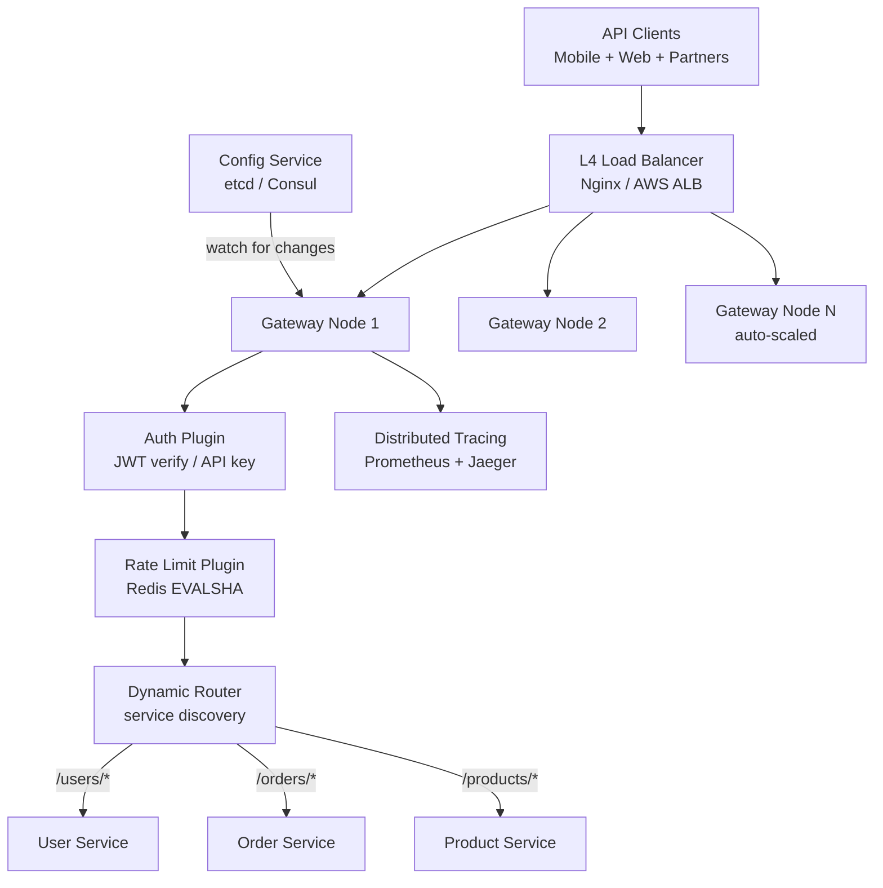
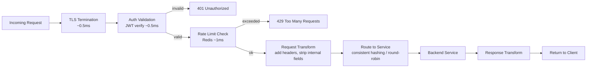
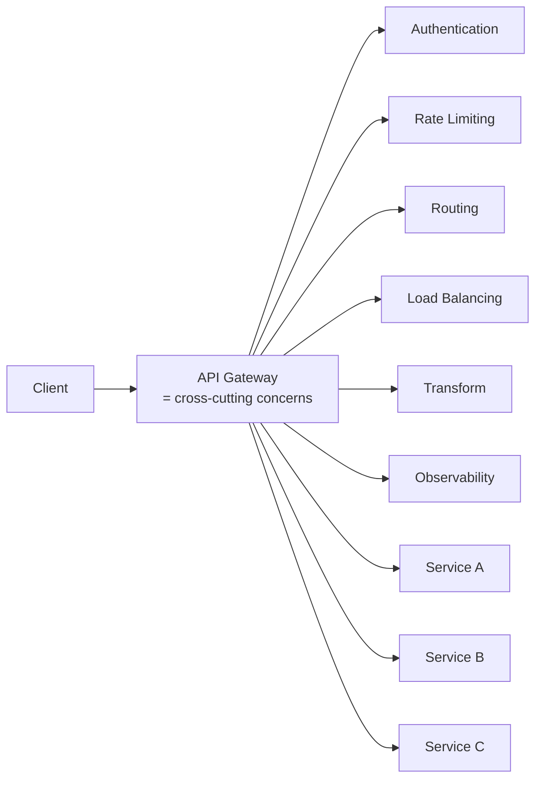
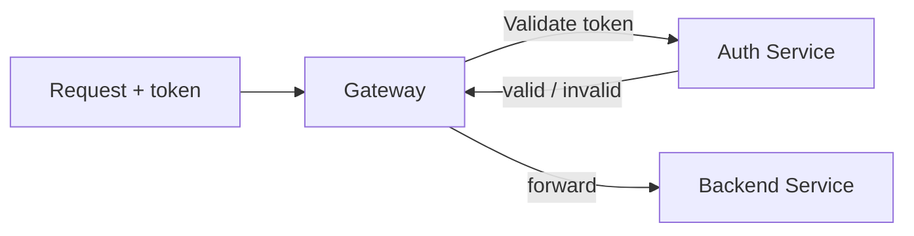
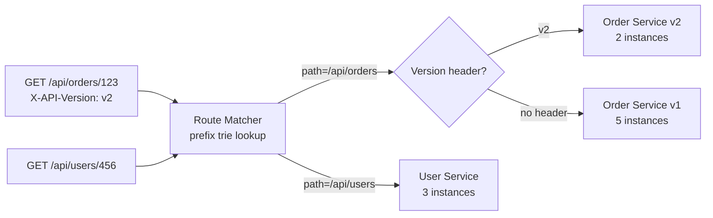
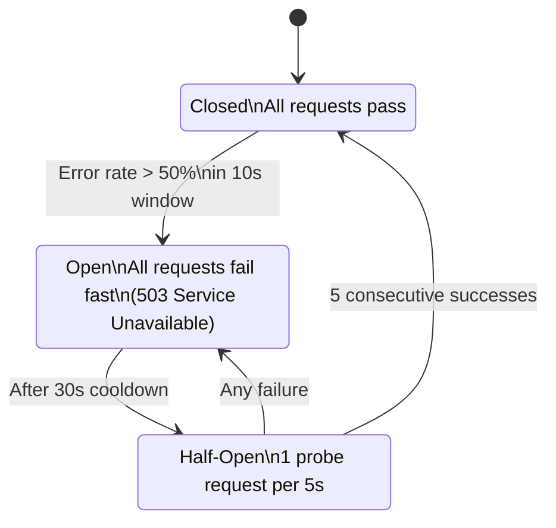
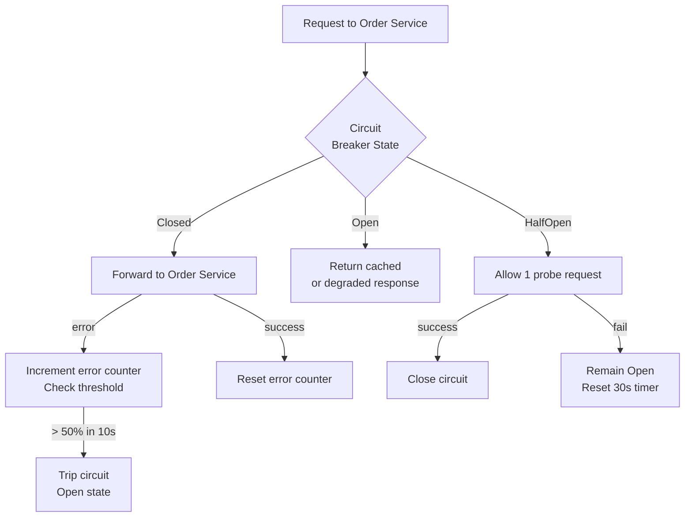
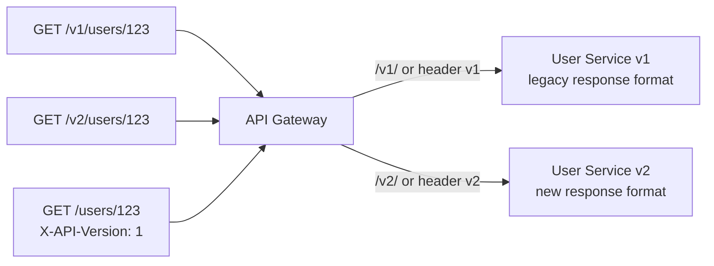
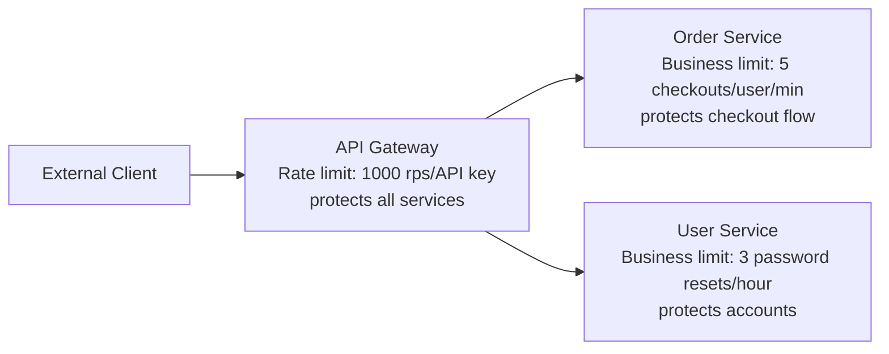
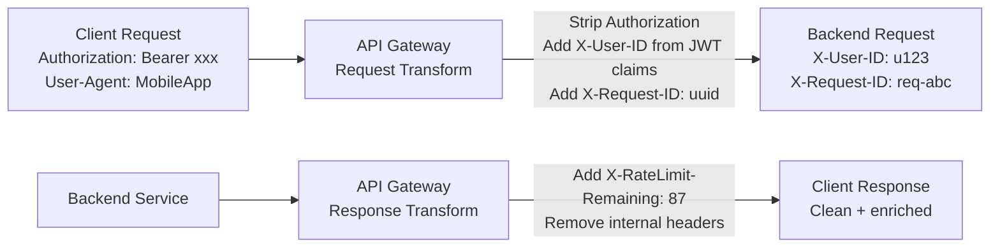

# Design an API Gateway

---

## Q1: Design an API gateway handling 100K req/sec for microservices

**Role:** Senior | **Difficulty:** 🔴 Senior | **Priority:** P0 | **Format:** Scenario
**Real Company:** Netflix — Zuul gateway handles all API traffic; Uber — Jaeger + custom gateway; AWS API Gateway — 1M+ customers

### The Brief
> "Design an API gateway that sits in front of 50+ microservices and handles 100K requests per second. The gateway must handle authentication, rate limiting, routing, and load balancing. It must add < 5ms p99 overhead, support zero-downtime deployments, and provide detailed observability."

### Clarifying Questions to Ask First
1. Is this a public-facing gateway or internal service mesh gateway?
2. Which auth mechanisms are required? (JWT, OAuth2, API keys?)
3. Should routing be static (config-file) or dynamic (service discovery)?
4. Is WebSocket proxying needed in addition to HTTP?

### Back-of-Envelope Estimation
| Metric | Calculation | Result |
|--------|-------------|--------|
| Requests/sec | 100K sustained, 300K peak | 300K rps peak |
| Gateway nodes | 300K ÷ 30K rps per node | ~10 gateway nodes |
| Auth token validation | JWT verify: ~0.5ms CPU | 300K × 0.5ms = 150 CPU-sec/sec |
| Rate limit check | Redis EVALSHA: 1ms | 300K Redis ops/sec |
| Latency budget | 5ms overhead target | Auth 1ms + RL 1ms + routing 1ms + buffer 2ms |
| Config size | 50 services × 10 routes | ~500 route entries |

### High-Level Architecture



### Deep Dive: Request Pipeline



### Trade-off Decisions
| Decision | Option A | Option B | Chosen | Why |
|----------|----------|----------|--------|-----|
| Implementation | Nginx + Lua | Kong (built on Nginx) | Kong | Plugin ecosystem; less custom Lua needed |
| Service discovery | Static config | Consul/etcd dynamic | Consul | 50+ services with frequent deploys; static config unmanageable |
| Auth | Centralized (gateway validates) | Decentralized (service validates) | Gateway | Single enforcement point; services not duplicating auth logic |
| Caching | No cache | Response caching at gateway | No cache | Gateway shouldn't own business data; caching at service layer |

### Failure Modes
| Failure | Impact | Mitigation |
|---------|--------|------------|
| Redis (rate limiter) down | Rate limiting bypassed | Fail open + local fallback limiter; alert |
| Auth service down | All requests fail | Cache JWT public keys (24h); verify locally without auth service |
| Backend service down | Requests to that service fail | Circuit breaker; return 503; health check polls for recovery |
| Gateway node OOM | Pod crashes | Kubernetes HPA; memory limit alerts; connection drain before shutdown |

### Concept References

---

## Q2: What is an API gateway and what responsibilities does it own?

**Role:** Mid | **Difficulty:** 🟡 Mid | **Priority:** P0 | **Format:** Quick Answer

> **What the interviewer is testing:** Whether you understand the role of an API gateway as a cross-cutting concerns hub that keeps microservices focused on business logic.

### Answer in 60 seconds
- **Definition:** Single entry point for all client-to-service communication; handles cross-cutting concerns so individual services don't have to
- **Core responsibilities:** TLS termination, authentication/authorization, rate limiting, routing, load balancing, request/response transformation
- **Optional responsibilities:** Caching, circuit breaking, protocol translation (REST → gRPC), API versioning, request logging/tracing
- **NOT gateway's job:** Business logic, data validation (beyond format), service-to-service auth (use service mesh / mTLS for that)
- **Products:** Kong, AWS API Gateway, Nginx, Traefik, Envoy

### Diagram



### Pitfalls
- ❌ **Putting business logic in the gateway:** Deciding whether a user can access a resource based on business rules belongs in the service; gateway only checks "are you authenticated and within rate limit?"
- ❌ **Making gateway a monolith for all microservice traffic including internal:** Gateway is for external clients; service-to-service traffic should use service mesh (Istio) to avoid gateway bottleneck

### Concept Reference

---

## Q3: How does an API gateway handle authentication?

**Role:** Senior | **Difficulty:** 🔴 Senior | **Priority:** P0 | **Format:** Deep Dive

> **What the interviewer is testing:** Whether you can design gateway-level authentication for multiple auth mechanisms (JWT, API key, OAuth2) with low latency.

### Problem Constraints
| Dimension | Value |
|-----------|-------|
| Auth mechanisms | JWT (internal users), API key (partners), OAuth2 (third-party apps) |
| Latency budget | < 1ms auth overhead |
| Token freshness | JWT valid for 1h; revocation must propagate within 5 min |
| Scale | 100K rps |

### Approach A — Remote Auth Service Call



**Problem:** 100K rps × 1 round-trip to auth service = auth service handles 100K rps; adds 5-20ms per request.

### Approach B — Local Validation with Cached Keys

```mermaid
graph TD
  Request[Request + JWT] --> GW[Gateway Node]
  GW --> LocalVerify[Local JWT Verify\nRS256 signature check\nusing cached public key]
  LocalVerify -->|valid| Claims[Extract claims\n{user_id, roles, exp}]
  LocalVerify -->|invalid/expired| 401[401 Unauthorized]
  Claims --> RevokeCheck{Token in\nrevocation list?}
  RevokeCheck -->|no| Forward[Forward to service\nwith claims header]
  RevokeCheck -->|yes| 401
  KeyFetch[Background job\nfetch JWKS every 1h] --> KeyCache[(Gateway local key store)]
```

| Dimension | Remote Auth Call | Local Validation |
|-----------|----------------|----------------|
| Latency per request | +10-20ms | +0.5ms (crypto verify) |
| Auth service load | 100K rps | 0 (background JWKS fetch) |
| Revocation propagation | Immediate | Up to 5 min (Redis cache TTL) |
| Single point of failure | Auth service | None (local + JWKS fallback) |

### Recommended Answer
Local JWT verification (Approach B). Gateway downloads JWKS (JSON Web Key Set — public keys) from auth service at startup and refreshes every 1h. JWT signature verified locally using RS256 — ~0.5ms CPU. Revoked tokens stored in Redis set `revoked_tokens` with TTL = JWT expiry time; gateway checks Redis on each request (1ms). Total auth overhead: 1.5ms. For API keys: Redis hash `api_key:{key}` → `{user_id, tier, rate_limit}` cached 5min.

### What a great answer includes
- [ ] Explains JWKS (public key endpoint) for distributed key distribution
- [ ] Addresses token revocation (JWT is stateless — revocation needs Redis list)
- [ ] Quantifies auth latency: 0.5ms local verify vs 10ms remote call
- [ ] Handles multiple auth types differently (JWT vs API key vs OAuth2)

### Pitfalls
- ❌ **No revocation mechanism for JWTs:** JWT is stateless — once issued, valid until expiry; must maintain Redis revocation list for immediate revocation (logout, security incident)
- ❌ **Calling auth service on every request:** At 100K rps, auth service becomes the bottleneck; local verification with cached public keys eliminates this dependency on hot path

### Concept Reference

---

## Q4: How do you implement request routing at the gateway layer?

**Role:** Mid | **Difficulty:** 🟡 Mid | **Priority:** P1 | **Format:** Quick Answer

> **What the interviewer is testing:** Whether you understand path-based routing, header-based routing, and dynamic service discovery as routing mechanisms.

### Answer in 60 seconds
- **Path-based:** `/api/users/*` → User Service; `/api/orders/*` → Order Service; stored in route table, O(prefix-tree) lookup ~1μs
- **Header-based:** `X-API-Version: v2` routes to v2 service; `X-Internal: true` routes to internal API; enables A/B and canary routing
- **Dynamic service discovery:** Gateway watches Consul/etcd for service registration; when Order Service deploys new instance, gateway picks up new endpoint within 5s
- **Weighted routing:** `/checkout` → 90% to stable, 10% to canary; used for canary deploys
- **Kong routing:** Define routes as `{paths: ["/orders"], service: order-svc}`; hot-reload without restart; 500 routes handled in < 1ms with prefix trie

### Diagram



### Pitfalls
- ❌ **Linear O(N) route scanning:** 500 routes with regex matching scanned sequentially = 500 comparisons per request; use prefix trie for O(L) matching where L = URL path length
- ❌ **Not supporting trailing slash normalization:** `/api/orders/` vs `/api/orders` treated as different routes; normalize in gateway before matching

### Concept Reference

---

## Q5: How do you implement circuit breaking at the API gateway?

**Role:** Senior | **Difficulty:** 🔴 Senior | **Priority:** P1 | **Format:** Deep Dive

> **What the interviewer is testing:** Whether you understand circuit breaker patterns and can design them at the gateway layer to protect backends from overload and prevent cascade failures.

### Problem Constraints
| Dimension | Value |
|-----------|-------|
| Backend error threshold | Trip if > 50% errors in 10s window |
| Half-open probe | 1 request every 5s after 30s cooldown |
| Recovery | Close circuit after 5 consecutive successes |
| Latency | Circuit check overhead < 1ms |

### Approach A — Per-Service Circuit Breaker



### Approach B — Adaptive Circuit Breaker with Fallback



| Dimension | Simple Circuit Breaker | Adaptive with Fallback |
|-----------|----------------------|----------------------|
| Failure behavior | 503 to client | Degraded response (stale cache) |
| Client experience | Hard failure | Graceful degradation |
| Implementation | Low | Medium |
| When to use | Non-critical services | Critical services with cache fallback |

### Recommended Answer
Per-service circuit breaker with fallback (Approach B). Gateway maintains circuit state per `{service_name}` in shared memory (not Redis — too slow for per-request check). Error window uses sliding counter (ring buffer) over 10 seconds. When circuit opens: check for cached response in Redis → serve stale if available; otherwise 503. Half-open sends 1 probe per 5s — if successful, gradually allow more (Hystrix-style half-open recovery). Circuit state exposed in `/health` endpoint for observability.

### What a great answer includes
- [ ] States circuit state stored in memory, not Redis (too slow per-request)
- [ ] Describes three states: Closed/Open/Half-Open
- [ ] Addresses fallback to cached/degraded response
- [ ] Mentions gradual recovery (not instant full-open)

### Pitfalls
- ❌ **Circuit breaker in Redis shared across nodes:** Redis lookup adds 1ms per request for circuit check; maintain state in-process and gossip state between gateway nodes
- ❌ **No fallback when circuit opens:** Pure 503 on circuit open is harsh; stale cached response or degraded mode (empty list instead of error) provides better UX

### Concept Reference

---

## Q6: How do you handle API versioning at the gateway?

**Role:** Senior | **Difficulty:** 🔴 Senior | **Priority:** P1 | **Format:** Quick Answer

> **What the interviewer is testing:** Whether you know the three versioning strategies (URL, header, content negotiation) and can recommend one for gateway-level implementation.

### Answer in 60 seconds
- **URL versioning:** `/v1/users`, `/v2/users` — simplest for clients; gateway routes `/v1/*` and `/v2/*` to separate service deployments
- **Header versioning:** `X-API-Version: 2` or `Accept: application/vnd.api+json;version=2` — cleaner URLs; harder to test in browser
- **Query param:** `/users?version=2` — simple but pollutes URLs and caching keys
- **Gateway routing:** Route table entry maps version + path to specific service version; `v1.user-service` and `v2.user-service` can run simultaneously
- **Deprecation:** Add `Deprecation: Sat, 31 Dec 2025 23:59:59 GMT` header to v1 responses; sunset period before removal

### Diagram



### Pitfalls
- ❌ **Removing old version without sunset period:** Breaking changes without notice violate API contracts; give partners minimum 6 months notice + `Deprecation` header warnings
- ❌ **Running v1 and v2 as separate deployments forever:** Two codebases, double the maintenance; use feature flags + adapter pattern to serve both from same codebase when possible

### Concept Reference

---

## Q7: Rate limit at the gateway vs at the service — when each?

**Role:** Senior | **Difficulty:** 🔴 Senior | **Priority:** P2 | **Format:** Quick Answer

> **What the interviewer is testing:** Whether you understand that gateway rate limiting and service rate limiting solve different problems and should coexist, not substitute for each other.

### Answer in 60 seconds
- **Gateway rate limit:** Protects ALL services from external abuse; per API key/IP/user; coarse-grained (100 rps per user across all endpoints)
- **Service rate limit:** Protects ONE service from its own clients; per operation; fine-grained (5 checkout attempts/user/min in Order Service)
- **When gateway only:** Public API where you want unified quotas across all endpoints; protects infrastructure from external load
- **When service only:** Internal service with known clients; business-rule rate limits (e.g., "max 3 password resets/hour") that don't belong in gateway config
- **Both together:** Gateway = broad protection; service = business-rule limits; defense in depth

### Diagram



### Pitfalls
- ❌ **Only gateway rate limiting:** Malicious internal service can bypass gateway and call another service directly; services need their own limits too
- ❌ **Business-rule limits in gateway:** "Max 5 checkout attempts per user per day" is business logic, not infrastructure policy; belongs in Order Service, not gateway config

### Concept Reference

---

## Q8: How would you design a gateway for a multi-tenant SaaS?

**Role:** Staff | **Difficulty:** ⚫ Staff | **Priority:** P2 | **Format:** Deep Dive

> **What the interviewer is testing:** Whether you can design tenant isolation, per-tenant rate limits, and routing to per-tenant or shared infrastructure at the gateway layer.

### Problem Constraints
| Dimension | Value |
|-----------|-------|
| Tenants | 10K tenants (companies) |
| Isolation | Data isolation required; noisy neighbor prevention |
| Rate limits | Per-tenant: tier-based (Starter 100 rps, Enterprise 10K rps) |
| Routing | Shared services for Starter; dedicated instances for Enterprise |

### Approach A — Single Shared Stack, Tenant Identified by Header

```mermaid
graph LR
  Request[Request\nX-Tenant-ID: tenant123] --> GW[Gateway]
  GW -->|extract tenant| RateLimit[Tenant-scoped rate limit\nredis: rl:{tenant_id}]
  GW --> SharedSvc[Shared Service Pool\ntenant context in request]
```

### Approach B — Tenant Routing with VIP/Dedicated Pools

```mermaid
graph TD
  Request[Request + API key] --> GW[Gateway]
  GW --> TenantLookup[Tenant Lookup\nRedis: tenant:{api_key} → {tier, pool}]
  TenantLookup -->|starter| SharedPool[Shared Service Pool]
  TenantLookup -->|enterprise| DedicatedPool[Enterprise Dedicated Pool\ntenant-A-order-svc]
  TenantLookup --> RateLimit[Apply tier-specific rate limit]
  TenantLookup --> Logging[Tag all logs/traces\nwith tenant_id]
```

| Dimension | Shared Stack | Tenant Routing |
|-----------|-------------|---------------|
| Resource isolation | None (noisy neighbor) | Full for enterprise |
| Cost | Low (shared resources) | High (dedicated instances) |
| Operational complexity | Low | High (per-enterprise infrastructure) |
| Enterprise SLA | Hard to guarantee | Guaranteed |

### Recommended Answer
Hybrid (Approach B). Starter tenants: shared pool with per-tenant rate limiting (Redis key `rl:{tenant_id}`) and request tagging for isolation. Enterprise tenants ($10K+ MRR): gateway routes to dedicated service pods via `X-Upstream: enterprise-{tenant_id}` header; Kubernetes namespaces isolate resources. Tenant metadata (tier, rate limit, upstream pool) cached in Redis per API key with 5min TTL. Gateway adds `X-Tenant-ID` to all forwarded requests for downstream services to enforce data isolation.

### What a great answer includes
- [ ] Identifies noisy neighbor problem for shared tenants
- [ ] Tier-based routing decision at gateway based on tenant metadata
- [ ] Per-tenant rate limits (not per-IP or per-user)
- [ ] Tenant context propagation to all downstream services

### Pitfalls
- ❌ **Not propagating tenant context to downstream services:** Gateway knows tenant, but if it doesn't forward tenant ID, service can't enforce data isolation between tenants — inject `X-Tenant-ID` header on every forwarded request
- ❌ **Per-tenant dedicated infrastructure for all tenants:** 10K dedicated Kubernetes namespaces is unmanageable; only Enterprise tier gets dedicated; Starter shares with tenant isolation via application-layer scoping

### Concept Reference

---

## Q9: How does Kong handle plugin extensibility?

**Role:** Staff | **Difficulty:** ⚫ Staff | **Priority:** P2 | **Format:** Quick Answer

> **What the interviewer is testing:** Whether you understand Kong's plugin architecture and how it allows custom cross-cutting logic without modifying the core gateway.

### Answer in 60 seconds
- **Plugin phases:** Kong executes plugins in phases: `init_worker → certificate → rewrite → access → header_filter → body_filter → log`; each plugin hooks into one or more phases
- **Plugin in Lua:** Kong is built on Nginx + OpenResty; custom plugins written in Lua; `handler.lua` implements phase methods; `schema.lua` declares config schema
- **PDK (Plugin Development Kit):** `kong.request`, `kong.response`, `kong.service` APIs let plugins read/modify request/response without Nginx internals
- **Execution order:** Plugins have priority (0–1000); higher priority runs first in `access` phase; built-in auth plugins run at priority 1000 before custom business plugins
- **Go and Python plugins:** Kong 2.3+ supports plugins via gRPC bridge; not as performant as Lua but familiar language

### Diagram


### Pitfalls
- ❌ **Writing business logic in Kong plugins:** Kong plugins are for cross-cutting infrastructure concerns; A/B logic, feature flags, business validation belong in microservices
- ❌ **Blocking I/O in Lua plugins:** Nginx is single-threaded event loop; synchronous blocking call in Lua plugin blocks entire worker; use `ngx.timer.at` or `resty.http` non-blocking HTTP client

### Concept Reference

---

## Q10: How do you implement request/response transformation at the gateway?

**Role:** Staff | **Difficulty:** ⚫ Staff | **Priority:** P3 | **Format:** Quick Answer

> **What the interviewer is testing:** Whether you understand when request transformation is appropriate at the gateway vs at the service, and the performance implications.

### Answer in 60 seconds
- **Use cases:** Strip internal headers before forwarding to third-party APIs; add `X-Forwarded-For`, `X-Request-ID`; translate REST → gRPC for legacy services; rename fields for API versioning
- **Header manipulation:** Gateway adds/removes headers on every request — O(1), negligible cost; add `X-Tenant-ID`, `X-User-Roles`, strip `Authorization` before forwarding to service
- **Body transformation:** Parse + modify JSON body — expensive; only do if unavoidable; adds 1-10ms depending on body size; prefer service-level transformation
- **Protocol translation:** Client sends REST; legacy backend speaks gRPC; gateway uses grpc-gateway or Envoy's transcoding — 2-5ms overhead but enables backend modernization
- **Response transformation:** Enrich response with metadata (add `X-Request-Duration`, `X-Rate-Limit-Remaining`) — response filters run after backend responds

### Diagram



### Pitfalls
- ❌ **Body transformation for large payloads at gateway:** 1 MB JSON body × 100K rps = 100 GB/sec through gateway buffer; body transformation should happen at service level where it's needed
- ❌ **Propagating raw JWT to backend services:** Extract claims at gateway, forward as structured headers (`X-User-ID`, `X-User-Roles`); services don't need to re-verify JWT

### Concept Reference
