# Design a CDN

---

## Q1: Design a CDN serving static assets to 1B users globally

**Role:** Senior | **Difficulty:** 🔴 Senior | **Priority:** P0 | **Format:** Scenario
**Real Company:** Cloudflare — 200+ cities, 3.5M+ customers; Akamai — 350K+ servers globally

### The Brief
> "Design a content delivery network that serves static assets (images, CSS, JS, videos) to 1 billion users worldwide. Assets are stored at a central origin. The CDN must achieve < 50ms latency for 95% of users globally, handle 10M requests/sec peak, and have 99.99% availability."

### Clarifying Questions to Ask First
1. What types of content? (static files, API responses, live video?)
2. How frequently does content change? (affects cache TTL strategy)
3. Are there geographic compliance requirements? (data residency laws)
4. Pull CDN (on-demand) or push CDN (pre-populate edge)?

### Back-of-Envelope Estimation
| Metric | Calculation | Result |
|--------|-------------|--------|
| Peak requests/sec | 10M globally | 10M rps |
| Avg asset size | 100 KB | — |
| Peak bandwidth | 10M × 100 KB | ~1 Tbps |
| Cache hit rate | 90% on average | 1M rps to origin (10% miss) |
| PoP count needed | 1 Tbps ÷ 100 Gbps per PoP | ~10 major PoPs (200+ actual for latency) |
| Storage per PoP | Top 10% assets × 10 TB total = 1 TB | ~1-5 TB per PoP SSD |

### High-Level Architecture

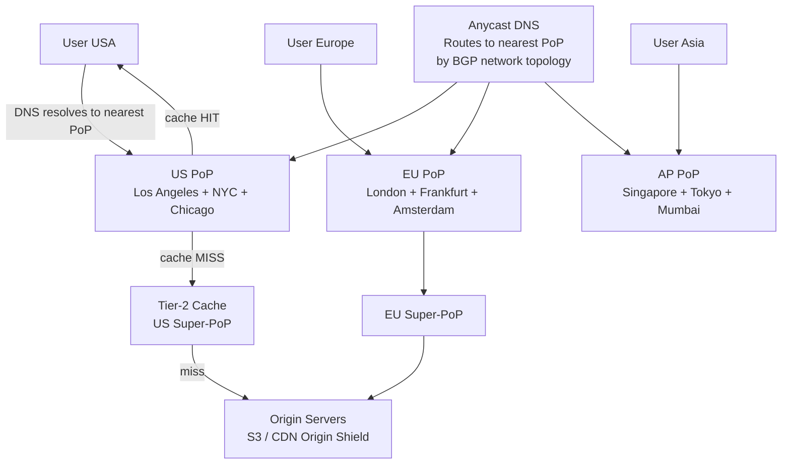

### Deep Dive: Cache Miss Hierarchy

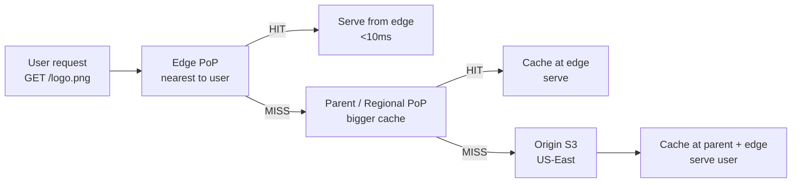

### Trade-off Decisions
| Decision | Option A | Option B | Chosen | Why |
|----------|----------|----------|--------|-----|
| Pull vs Push | Pull CDN (cache on first miss) | Push CDN (pre-populate) | Pull | Can't predict what 1B users will request; pull + warm for known assets |
| DNS routing | GeoDNS (by IP location) | Anycast (by BGP proximity) | Anycast | Anycast routes by actual network topology, not IP location estimate |
| Cache hierarchy | Flat (edge → origin) | Tiered (edge → parent → origin) | Tiered | Reduces origin load by 10× for long-tail content |
| SSL termination | At origin | At edge | At edge | TLS handshake from Asia to US-origin = 300ms; at Asian edge = 20ms |

### Failure Modes
| Failure | Impact | Mitigation |
|---------|--------|------------|
| Edge PoP node failure | Traffic rerouted to next nearest PoP | Anycast automatically reroutes; health check removes failed node |
| Origin overloaded | All cache misses slow | Origin Shield: dedicated PoP collocated with origin as buffer |
| Cache poisoning | Wrong content cached | Validate responses before caching; signed URLs for sensitive assets |
| DNS hijacking | Users routed to wrong server | DNSSEC; monitor for DNS anomalies |

### Concept References
→ [CDN Design](../../../system-design/scale-and-reliability/cdn-design)
→ [Load Balancing](../../../system-design/fundamentals/load-balancing)

---

## Q2: How does a CDN work? What happens on a cache miss?

**Role:** Mid | **Difficulty:** 🟡 Mid | **Priority:** P0 | **Format:** Quick Answer

> **What the interviewer is testing:** Whether you can explain the end-to-end CDN request flow including DNS resolution, cache lookup, origin fetch, and cache population.

### Answer in 60 seconds
- **DNS routing:** Browser resolves `cdn.example.com` → CDN DNS returns IP of nearest PoP (via anycast or GeoDNS)
- **Edge request:** Browser connects to edge PoP (~5ms away); PoP checks local cache for the URL
- **Cache hit:** File served directly from SSD at edge — response in 10-30ms; user never reaches origin
- **Cache miss:** Edge fetches from origin (or parent PoP); serves response to user; stores in local cache with TTL from `Cache-Control` header
- **Subsequent requests:** Same URL at same PoP is a hit for all users until TTL expires

### Diagram

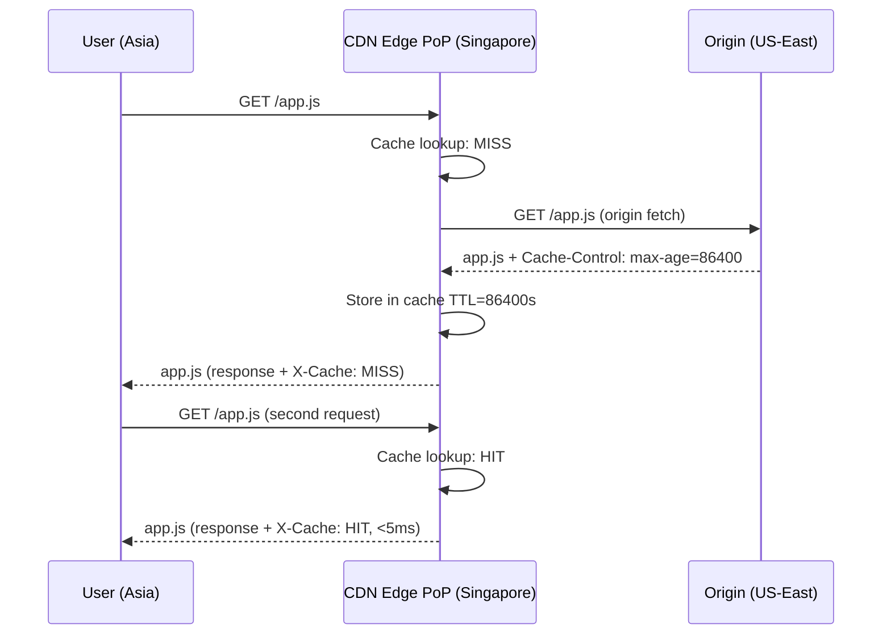

### Pitfalls
- ❌ **Not setting Cache-Control headers at origin:** Without headers, CDN may not cache at all or cache with very short TTL; always set `Cache-Control: max-age=86400, s-maxage=604800` for static assets
- ❌ **Caching responses with Set-Cookie:** Cookies make responses user-specific; CDN serves one user's cookie to another; strip cookies from CDN-cached responses

### Concept Reference
→ [CDN Design](../../../system-design/scale-and-reliability/cdn-design)

---

## Q3: How does a CDN decide which edge server to route a user to?

**Role:** Senior | **Difficulty:** 🔴 Senior | **Priority:** P0 | **Format:** Deep Dive

> **What the interviewer is testing:** Whether you understand the two primary CDN routing mechanisms — anycast routing and GeoDNS — and their trade-offs.

### Problem Constraints
| Dimension | Value |
|-----------|-------|
| PoPs | 200+ globally |
| User location | Anywhere on earth |
| Routing goal | Nearest PoP by network latency (not geographic distance) |
| Failover | Automatic if PoP unavailable |

### Approach A — GeoDNS (IP Geolocation)

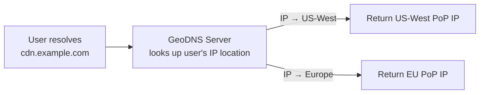

**Limitation:** IP geolocation can be wrong (VPN, mobile carrier); user in US routed to US PoP but optimal route is actually a nearby Canada PoP.

### Approach B — Anycast Routing

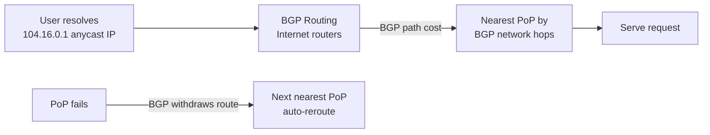

| Dimension | GeoDNS | Anycast |
|-----------|--------|---------|
| Routing accuracy | IP location (may be wrong) | Actual network topology |
| Failover | TTL-dependent (30-60s) | BGP route withdrawal (<1s) |
| Implementation | DNS infrastructure | BGP peering at PoPs |
| VPN handling | Routes to wrong region | Routes by actual path |

### Recommended Answer
Anycast (Approach B) for the routing IP. All PoPs announce the same IP (`104.16.0.1`) via BGP. Internet routing protocol naturally routes packets to the network-closest PoP — not geographic, but network-hop-closest, which better represents actual latency. Cloudflare uses anycast for their entire network. Failover is near-instantaneous (BGP convergence ~1s) vs GeoDNS TTL (30-60s).

### What a great answer includes
- [ ] Explains that anycast is same IP announced from multiple locations
- [ ] Notes BGP routes by network hops, not geographic distance
- [ ] Contrasts failover speed: BGP 1s vs GeoDNS TTL 30-60s
- [ ] Mentions Cloudflare or Akamai as real examples of anycast CDN

### Pitfalls
- ❌ **Assuming geographic nearest = lowest latency:** A city 500km away with direct fiber link is faster than a city 200km away through congested backbone — anycast routes by network topology
- ❌ **GeoDNS with long TTL:** 5-minute TTL means PoP failure takes 5 min to route around; for production CDN use anycast or 30s TTL maximum

### Concept Reference
→ [CDN Design](../../../system-design/scale-and-reliability/cdn-design)

---

## Q4: What content is suitable for CDN caching vs what should bypass it?

**Role:** Mid | **Difficulty:** 🟡 Mid | **Priority:** P1 | **Format:** Quick Answer

> **What the interviewer is testing:** Whether you can distinguish between static cacheable content and dynamic/personalized content that must bypass CDN.

### Answer in 60 seconds
- **CDN-suitable:** Static assets (JS, CSS, images, fonts), videos, public API responses with identical data per request, downloadable files
- **Bypass CDN:** Authenticated API responses (user-specific data), session cookies, real-time inventory/price data, one-time URLs (S3 presigned)
- **Cache-Control headers:** `public, max-age=86400` → CDN caches; `private, no-store` → CDN bypasses; `s-maxage=3600` → CDN caches for 1h, browser for default
- **Grey area:** Public feed (paginated) — page 1 can be cached 30s; admin dashboard pages — bypass entirely
- **Varnish/Nginx rule:** Cache everything unless `Authorization` header present or `Set-Cookie` in response

### Diagram

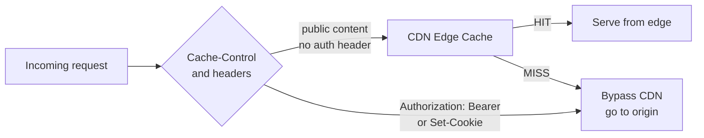

### Pitfalls
- ❌ **Caching API responses without checking for user-specific content:** `/api/user/me` returns different data per user; if CDN caches it, first user's data served to all — catastrophic privacy leak
- ❌ **Not caching dynamic pages that could be cached:** Home page with top 10 products changes every 10 min — cacheable for 10 min; improper "dynamic = no cache" assumption wastes CDN capacity

### Concept Reference
→ [CDN Design](../../../system-design/scale-and-reliability/cdn-design)

---

## Q5: How do you handle CDN cache invalidation for updated content?

**Role:** Senior | **Difficulty:** 🔴 Senior | **Priority:** P1 | **Format:** Deep Dive

> **What the interviewer is testing:** Whether you understand the cache invalidation strategies available (versioned URLs, TTL expiry, explicit purge) and their trade-offs.

### Problem Constraints
| Dimension | Value |
|-----------|-------|
| PoP count | 200+ globally |
| Purge propagation time | Cloudflare: ~150ms globally; Akamai: 5-10s |
| Content type | JS/CSS bundles (change on deploy), images (rarely change) |
| Risk | Old JS served after deploy = broken functionality |

### Approach A — URL Versioning (Cache Busting)

```mermaid
graph LR
  Deploy[New deploy] --> Build[Build: app.v2.3.1.js]
  HTML[HTML references] -->|<script src="/app.v2.3.1.js">| CDN[CDN caches at new URL]
  Old[/app.v2.3.0.js] --> StillCached[Still in CDN cache\nnobody requests it anymore]
  New[/app.v2.3.1.js] --> FirstMiss[Cache miss: fetch from origin\nthen cached forever]
```

**Advantage:** Zero invalidation needed — new version = new URL = guaranteed fresh.

### Approach B — TTL + Explicit Purge API

```mermaid
graph LR
  Deploy[New deploy] --> PurgeAPI[Call CDN purge API\ncloudflare: /zones/{id}/purge_cache]
  PurgeAPI -->|propagates in 150ms| AllPoPs[All 200+ PoPs\ninvalidate /app.js cache]
  AllPoPs -->|next request| Origin[Fetch fresh /app.js from origin]
  TooSlow[Users before purge completes] -->|get stale| OldContent[Old JS bundle served]
```

| Dimension | URL Versioning | TTL + Purge |
|-----------|--------------|------------|
| Invalidation speed | Instant (new URL) | 150ms–10s propagation |
| Old content cleanup | Automatic (no requests) | Handled by TTL expiry |
| Implementation | Build system required | Purge API call on deploy |
| Reliability | Perfect | Risk of serving stale during purge propagation |

### Recommended Answer
URL versioning for JS/CSS bundles (content hash in filename: `app.abc123.js`). These change on every deploy and must be cache-busted immediately. Images and media use TTL + explicit purge API — they don't change frequently, and 150ms propagation delay is acceptable. HTML files: short TTL (5 min) + purge on deploy — HTML must reference new versioned asset URLs after deploy.

### What a great answer includes
- [ ] Recommends content-hashed filenames for guaranteed busting
- [ ] Notes that purge propagation takes 150ms (Cloudflare) to 10s (Akamai)
- [ ] Addresses HTML separately from static assets
- [ ] Mentions CDN purge API for on-demand invalidation

### Pitfalls
- ❌ **Long TTL without purge API:** 1-year TTL on `/app.js` means users get old JavaScript for up to 1 year after deploy; content hash in URL solves this permanently
- ❌ **Not versioning images referenced in CSS:** `background: url('/logo.png')` with no versioning — logo update takes 24h to propagate via TTL; use content-hashed image filenames too

### Concept Reference
→ [CDN Design](../../../system-design/scale-and-reliability/cdn-design)

---

## Q6: What is anycast routing and how does Cloudflare use it?

**Role:** Senior | **Difficulty:** 🔴 Senior | **Priority:** P1 | **Format:** Quick Answer

> **What the interviewer is testing:** Whether you understand anycast at the network level and how Cloudflare uses it to achieve global low-latency routing.

### Answer in 60 seconds
- **Anycast:** A single IP address announced by multiple servers in different locations; BGP routing naturally directs packets to the topologically nearest server
- **Cloudflare's implementation:** Same IP block (e.g., 104.16.0.0/12) announced from every Cloudflare PoP globally; your ISP routes to nearest PoP automatically
- **DDoS protection:** Attack traffic from anywhere floods the nearest PoP, not a central server; each PoP absorbs its regional traffic; 100 Tbps total capacity across all PoPs absorbs even largest DDoS attacks
- **Failure handling:** When a PoP goes down, it stops announcing its BGP routes; BGP convergence (~1s) routes traffic to next nearest PoP automatically
- **Not for TCP state:** Anycast works per-packet; for TCP (stateful), a session must stay on same PoP — Cloudflare uses ECMP with session stickiness

### Diagram

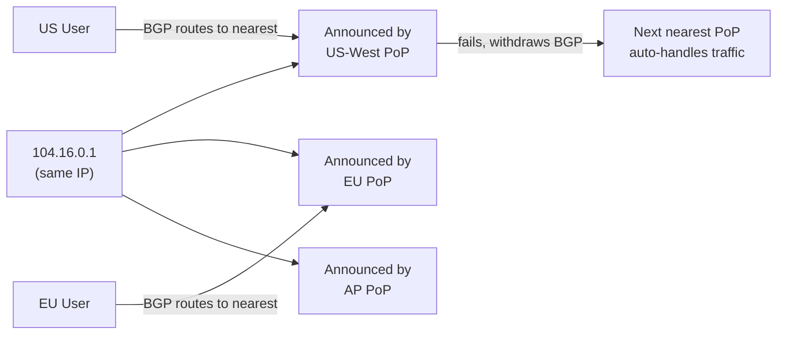

### Pitfalls
- ❌ **Confusing anycast with GeoDNS:** GeoDNS returns different IPs per user location; anycast returns same IP, BGP routing decides path — fundamentally different mechanisms
- ❌ **Using anycast without session affinity for TCP:** Mid-TCP-session packet rerouted to different PoP = connection reset; use ECMP hash on `(src_ip, src_port)` to keep session on same PoP

### Concept Reference
→ [CDN Design](../../../system-design/scale-and-reliability/cdn-design)

---

## Q7: How do you handle CDN failover when an edge node goes down?

**Role:** Senior | **Difficulty:** 🔴 Senior | **Priority:** P2 | **Format:** Quick Answer

> **What the interviewer is testing:** Whether you understand health checks, BGP route withdrawal, and graceful degradation when a CDN edge node becomes unavailable.

### Answer in 60 seconds
- **Health checks:** CDN operator runs synthetic checks from each PoP every 10s; if node fails 3 consecutive checks → remove from rotation
- **Anycast failover:** Failed node stops BGP route advertisement → BGP convergence ~1s → traffic automatically flows to next nearest PoP
- **GeoDNS failover:** Failed PoP removed from DNS; DNS TTL of 30s means up to 30s of failed requests before failover completes — shorter TTL speeds recovery
- **Origin shield:** If all PoPs in a region fail, traffic falls back to origin (slower but functional); origin shield PoP adds buffer capacity
- **Impact:** Users in failed PoP's region see latency increase (nearest PoP further away) but no complete outage

### Diagram

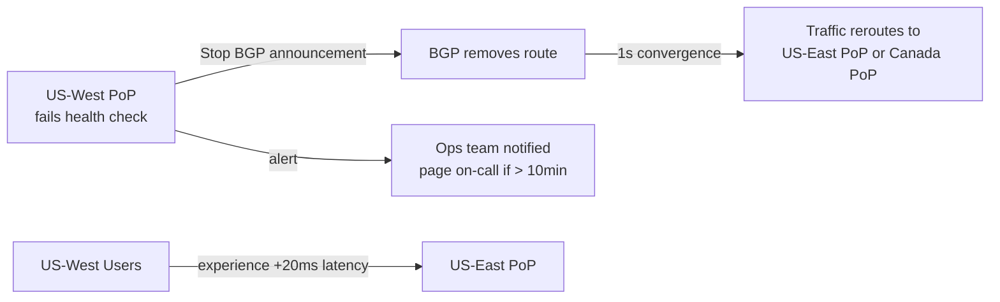

### Pitfalls
- ❌ **Long DNS TTL during failover:** 5-minute TTL means users DNS-cached the failed PoP IP for 5 min after failure; use 30–60s TTL for CDN DNS records
- ❌ **No origin fallback configuration:** If CDN entirely unavailable (rare), serve directly from origin; configure origin as CDN fallback to prevent total outage

### Concept Reference
→ [CDN Design](../../../system-design/scale-and-reliability/cdn-design)

---

## Q8: How would you design a CDN for video streaming with ABR?

**Role:** Staff | **Difficulty:** ⚫ Staff | **Priority:** P2 | **Format:** Deep Dive

> **What the interviewer is testing:** Whether you understand how CDN caching behavior must be adapted for HLS/DASH video streaming, where segment TTLs, manifest freshness, and byte-range requests require specific handling.

### Problem Constraints
| Dimension | Value |
|-----------|-------|
| Concurrent streams | 1M |
| Avg bitrate | 4 Mbps (1080p) |
| Total bandwidth | 4 Tbps |
| Segment size | 4 Mbps × 6s = 3 MB per segment |
| Manifest size | ~5 KB (list of segments) |

### Approach A — Treat Video Like Static Files

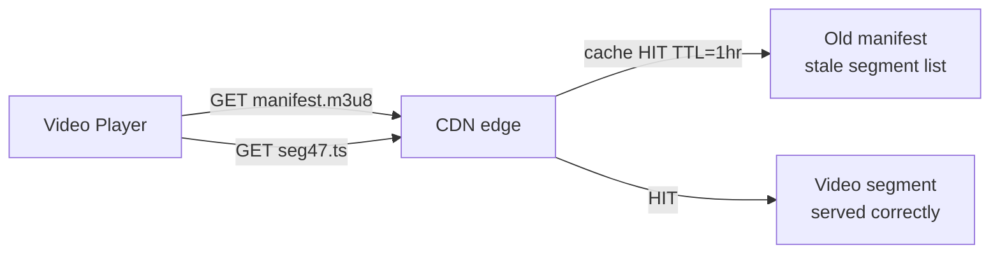

**Problem:** Manifest cached for 1 hour while new segments added every 6 seconds — player receives stale manifest, requests non-existent segments.

### Approach B — Differentiated TTL per Content Type

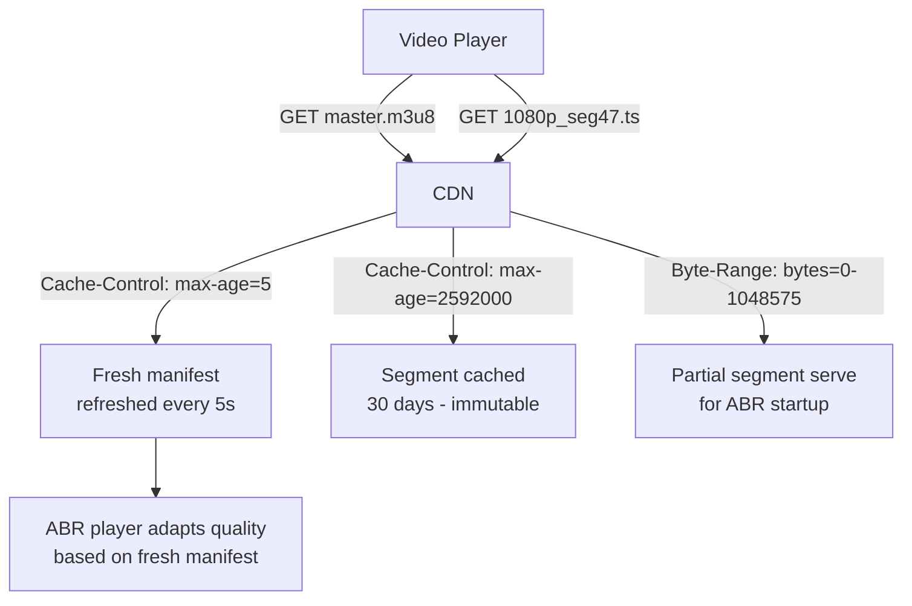

| Dimension | Uniform TTL | Differentiated TTL |
|-----------|-------------|-------------------|
| Manifest freshness | Stale (1hr) | Current (5s TTL) |
| Segment cache hit | High | High (immutable, 30d TTL) |
| Origin load from manifests | Low | Medium (refresh every 5s × 1M streams = 200K rps) |
| Bandwidth efficiency | Good | Excellent |

### Recommended Answer
Differentiated TTL (Approach B). Manifests: `Cache-Control: s-maxage=5` — CDN refreshes every 5s per PoP; at 1M concurrent streams each fetching manifest every 6s, CDN serves 99% from cache (5s window covers most requests). Segments: `Cache-Control: s-maxage=2592000` (30 days) — once a segment is cached, it's immutable. Segment URLs include quality and timestamp: `/stream/1080p/seg_00047.ts` — globally unique URL per quality/position. Byte-range requests for partial segments supported to enable fast startup.

### What a great answer includes
- [ ] Identifies manifest vs segment as having different caching requirements
- [ ] States manifest TTL = segment duration (6s) for live; longer for VOD
- [ ] Notes segment URLs are immutable (content-addressed by timestamp + quality)
- [ ] Mentions byte-range request support for ABR startup

### Pitfalls
- ❌ **Long manifest TTL for live streaming:** Live manifest changes every 2-6 seconds (new segments added); 1-hour CDN TTL makes live stream unwatchable
- ❌ **Not supporting byte-range requests:** ABR players sometimes request first 256 KB of segment to probe bitrate; CDN must support `Range: bytes=0-262143` headers

### Concept Reference
→ [CDN Design](../../../system-design/scale-and-reliability/cdn-design)

---

## Q9: How does CDN cache vary by request headers?

**Role:** Staff | **Difficulty:** ⚫ Staff | **Priority:** P2 | **Format:** Quick Answer

> **What the interviewer is testing:** Whether you understand Vary headers and cache key normalization, and the consequences of improper Vary configuration on cache hit rate.

### Answer in 60 seconds
- **Vary header:** Origin tells CDN "this response varies by Accept-Encoding" → CDN caches separate copy per unique header value
- **`Vary: Accept-Encoding`:** Separate cache entries for gzip vs brotli vs no-compression — same URL, 3 cached copies; standard and correct
- **`Vary: User-Agent`:** Thousands of User-Agent strings → thousands of cache copies per URL → effectively disables CDN caching → never do this
- **Cache key normalization:** Strip irrelevant headers (User-Agent, Accept-Language for non-localized content) before computing cache key; Cloudflare does this automatically
- **Vary: Accept:** Separate copies for JSON vs HTML responses from same URL — valid for API content negotiation

### Diagram

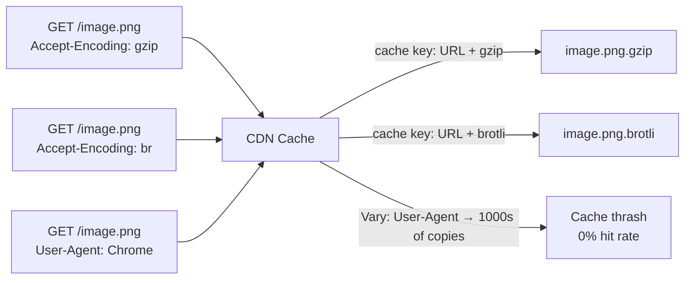

### Pitfalls
- ❌ **Origin sending `Vary: User-Agent`:** Mobile vs desktop may serve different content, but User-Agent has 5000+ values; CDN hit rate drops to near 0%; use separate mobile/desktop URLs or strip User-Agent from Vary
- ❌ **Not setting Vary: Accept-Encoding:** CDN caches gzip version, serves to client that can't decompress — corrupted response; always set Vary: Accept-Encoding when serving compressed content

### Concept Reference
→ [CDN Design](../../../system-design/scale-and-reliability/cdn-design)

---

## Q10: How would you design CDN PoP placement for India + Southeast Asia?

**Role:** Staff | **Difficulty:** ⚫ Staff | **Priority:** P3 | **Format:** Quick Answer

> **What the interviewer is testing:** Whether you understand CDN PoP placement strategy based on population density, internet exchange (IXP) availability, and peering relationships.

### Answer in 60 seconds
- **India priority cities:** Mumbai (financial hub, largest ISP peering), Delhi NCR (government + consumer), Bangalore (tech center), Chennai (South India gateway), Kolkata (East India)
- **Southeast Asia:** Singapore (regional hub, SGIX is main IXP), Jakarta (270M population), Bangkok, Kuala Lumpur, Ho Chi Minh City, Manila
- **IXP peering:** Collocate PoPs at internet exchanges — DE-CIX Mumbai, SGIX Singapore; direct peering with Jio, Airtel, BSNL in India = 200ms → 15ms latency for Indian users
- **Tier-2 cities:** Use ISP-collocated cache nodes (like Netflix Open Connect) rather than full PoPs — lower cost for smaller markets
- **Cable landing stations:** Singapore is landing point for 5+ submarine cables — ideal for international peering; Mumbai handles SEAMEWE-3, IMEWE cables

### Diagram

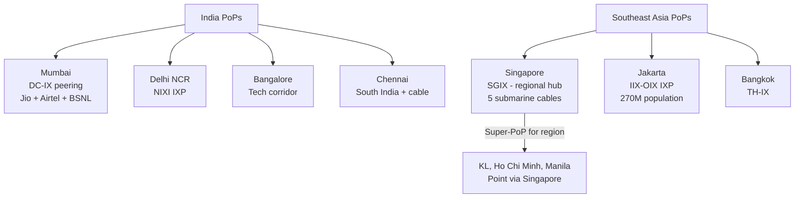

### Pitfalls
- ❌ **Placing PoPs by population only, not internet infrastructure:** 100M users in rural India are on satellite/2G — latency improvement minimal; prioritize cities with fiber internet penetration
- ❌ **Not peering with local ISPs:** A PoP in Mumbai without Jio peering still routes via international backbone for Jio users; direct IXP peering is the critical step that reduces latency from 150ms to 10ms

### Concept Reference
→ [CDN Design](../../../system-design/scale-and-reliability/cdn-design)
