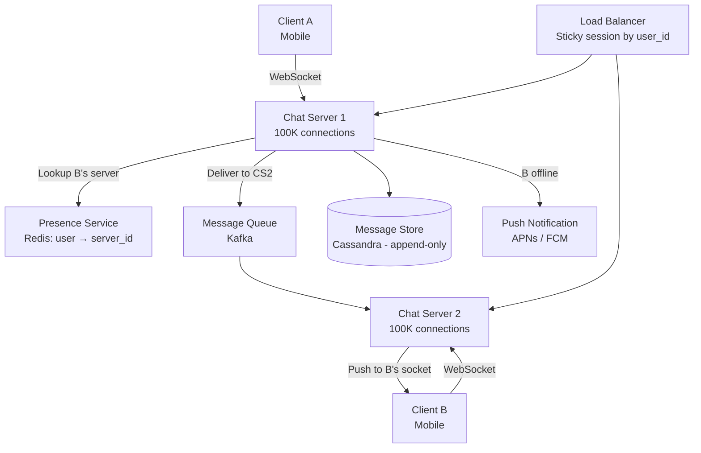
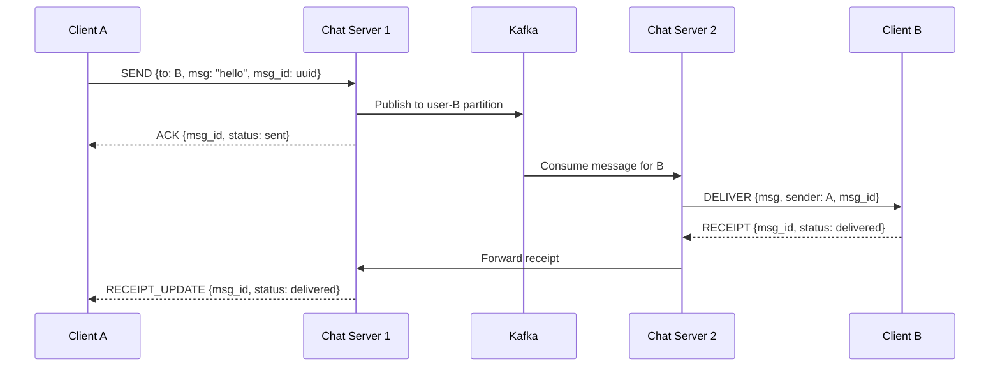
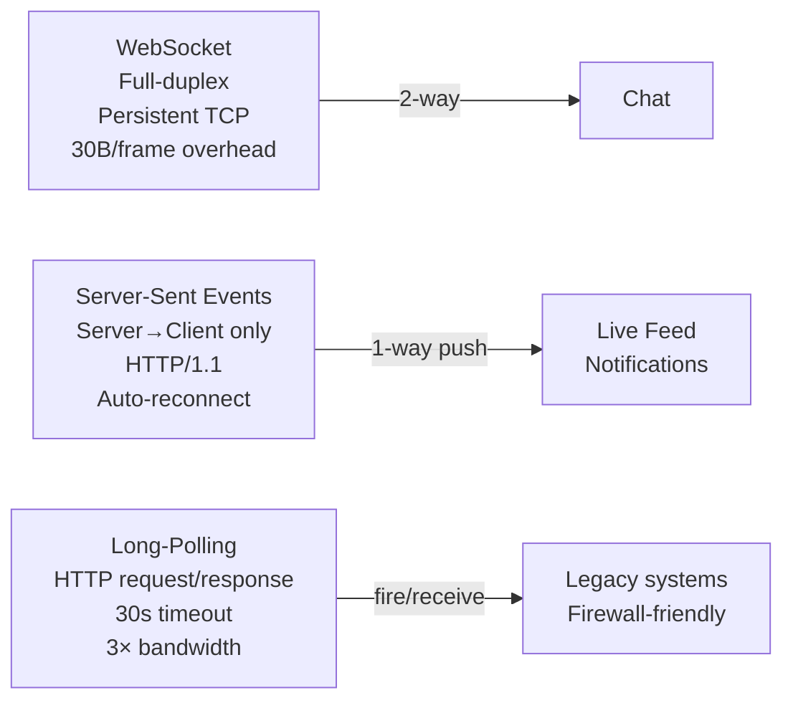
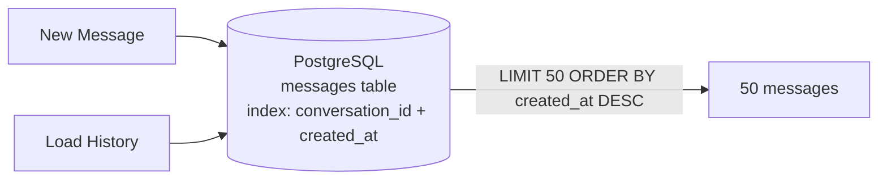
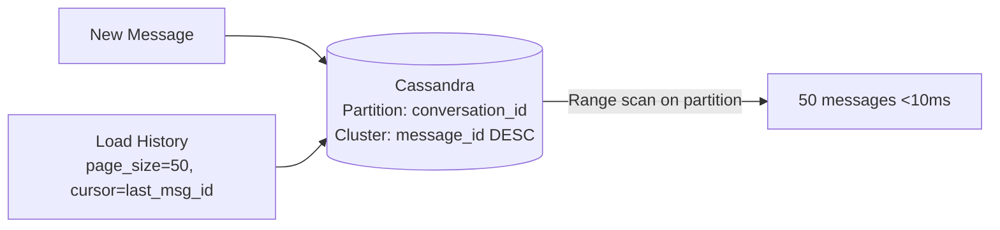
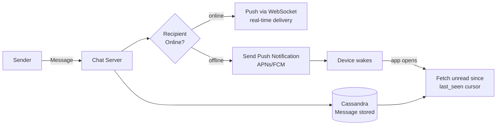
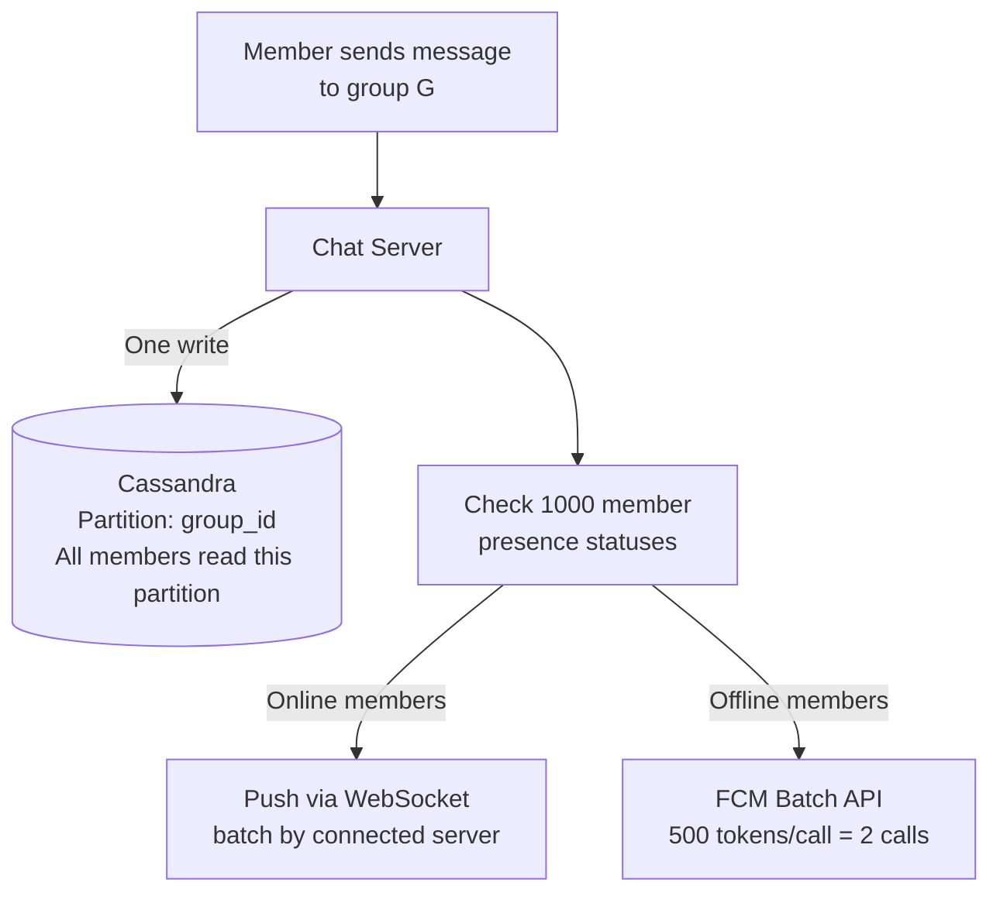
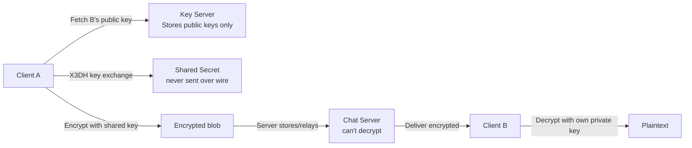
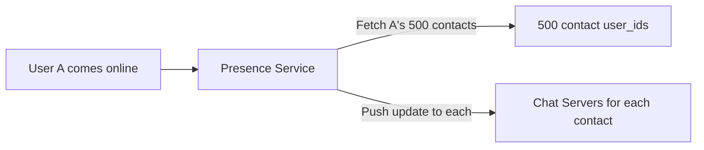
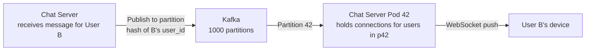

# Design a Chat System

---

## Q1: Design a real-time chat like WhatsApp for 500M users

**Role:** Senior | **Difficulty:** 🔴 Senior | **Priority:** P0 | **Format:** Scenario
**Real Company:** WhatsApp — 2B users, 100B messages/day; Slack — 10B+ messages/day

### The Brief
> "Design a real-time chat application for 500M registered users with 100M daily active users. Support 1-on-1 messaging and group chats (max 1000 members). Messages must be delivered within 1 second when both parties are online. Offline users receive messages when they come back online. Handle 1M concurrent connections."

### Clarifying Questions to Ask First
1. Should messages be end-to-end encrypted, or can the server read them?
2. What is the message retention policy — store forever or expire?
3. Is message ordering guaranteed (strict, per-conversation, or best-effort)?
4. Do we need read receipts (delivered/read status)?

### Back-of-Envelope Estimation
| Metric | Calculation | Result |
|--------|-------------|--------|
| DAU | 100M | 100M/day |
| Messages/user/day | 40 avg | — |
| Total messages/day | 100M × 40 | 4B messages/day |
| Peak messages/sec | 4B ÷ 86400 × 5 spike | ~230K msg/sec peak |
| Concurrent connections | 100M × 10% online at peak | 10M connections |
| Storage/message | 200 bytes avg (text) | — |
| Storage/day | 4B × 200B | ~800 GB/day |
| Storage/year | 800 GB × 365 | ~290 TB/year |

### High-Level Architecture



### Deep Dive: Message Delivery Flow



### Trade-off Decisions
| Decision | Option A | Option B | Chosen | Why |
|----------|----------|----------|--------|-----|
| Connection protocol | WebSocket | Long-polling | WebSocket | Long-polling: 3× bandwidth, higher latency |
| Message storage | MySQL | Cassandra | Cassandra | Append-only writes, time-series access pattern |
| Routing | Direct peer-to-peer | Server-mediated | Server-mediated | P2P NAT traversal too complex at scale |
| Offline delivery | Store-and-forward (server holds) | Push notification only | Both | Push wakes app; server delivers full message history |

### Failure Modes
| Failure | Impact | Mitigation |
|---------|--------|------------|
| Chat server crash | Connections dropped | Sticky LB + reconnect logic on client; messages in Kafka re-delivered |
| Kafka partition lag | Message delayed > 1s | Monitor consumer lag; scale consumers |
| Cassandra write failure | Message not stored | Sync write to Cassandra before ACK; retry on timeout |
| Presence service down | Can't route to recipient server | Fallback: broadcast to all chat servers, each checks local connections |

### Concept References
→ [WebSockets Real-Time](../../../system-design/real-time-systems/websockets-real-time)
→ [Kafka / Messaging](../../../system-design/messaging-and-streaming/kafka-rabbitmq)

---

## Q2: WebSockets vs SSE vs long-polling — which for real-time messaging?

**Role:** Mid | **Difficulty:** 🟡 Mid | **Priority:** P0 | **Format:** Quick Answer

> **What the interviewer is testing:** Whether you know the technical differences between the three real-time transport options and when each is appropriate.

### Answer in 60 seconds
- **WebSocket:** Full-duplex TCP — both client and server send at any time; ideal for chat, games; ~30 bytes/frame overhead; requires sticky load balancing
- **SSE (Server-Sent Events):** Server pushes only over HTTP/1.1; client sends via separate HTTP POST; simpler than WebSocket; good for notifications, live feeds; auto-reconnect built-in
- **Long-polling:** Client holds HTTP connection open until message or timeout (~30s); server sends and closes; client reconnects; 3× bandwidth vs WebSocket; works with any HTTP load balancer
- **Winner for chat:** WebSocket — bidirectional, low overhead, 10M connections per cluster; SSE for read-heavy dashboards; long-polling for legacy/firewall environments

### Diagram



### Pitfalls
- ❌ **Using long-polling for high-frequency chat:** Each message = new HTTP connection → TLS handshake overhead = 100ms+ per message; WebSocket connection is one-time cost
- ❌ **WebSocket without sticky sessions:** Message arrives at LB, gets routed to server that doesn't hold client's connection — need sticky routing by user ID or connection ID

### Concept Reference
→ [WebSockets Real-Time](../../../system-design/real-time-systems/websockets-real-time)

---

## Q3: How do you store and retrieve message history efficiently?

**Role:** Senior | **Difficulty:** 🔴 Senior | **Priority:** P0 | **Format:** Deep Dive

> **What the interviewer is testing:** Whether you understand append-only time-series storage patterns and how to design efficient pagination for message history.

### Problem Constraints
| Dimension | Value |
|-----------|-------|
| Scale | 4B messages/day, 290 TB/year |
| Access pattern | Latest N messages in conversation, paginate backward |
| Write pattern | Append-only, high write throughput |
| Latency SLA | Message fetch p99 < 100ms |

### Approach A — RDBMS (PostgreSQL)



**Limitation:** At 4B rows, index size ~50GB+; write throughput ceiling ~10K rps per node.

### Approach B — Cassandra (Wide Column)



Data model:
```
CREATE TABLE messages (
  conversation_id UUID,
  message_id TIMEUUID,     -- time-ordered UUID, newest first
  sender_id UUID,
  content TEXT,
  created_at TIMESTAMP,
  PRIMARY KEY (conversation_id, message_id)
) WITH CLUSTERING ORDER BY (message_id DESC);
```

| Dimension | PostgreSQL | Cassandra |
|-----------|-----------|----------|
| Write throughput | ~10K rps/node | ~100K rps/node |
| Storage efficiency | Good (row-based) | Excellent (wide column, compression) |
| Pagination | Cursor via WHERE id < last | Native range scan on partition |
| Cross-conversation search | Supported via full-text | Not supported natively |
| Operational complexity | Low | Medium-high |

### Recommended Answer
Cassandra with `conversation_id` as partition key and `message_id` (TIMEUUID) as clustering key in DESC order. Partition stores all messages for one conversation — a single range scan returns the last 50 messages in < 10ms. Write throughput of 100K+ rps per node handles 4B messages/day with 3 nodes (replication factor 3). PostgreSQL only for conversation metadata (participants, created_at, settings).

### What a great answer includes
- [ ] Identifies append-only, time-series pattern — drives Cassandra choice
- [ ] Shows Cassandra data model with partition key and clustering key
- [ ] Explains cursor-based pagination (message_id as cursor)
- [ ] Addresses hot partition for very active group chats (1000 members)

### Pitfalls
- ❌ **Using auto-increment ID for message ordering:** Auto-increment is single-node sequential — use TIMEUUID for distributed, time-ordered unique IDs
- ❌ **Large Cassandra partition for very active chats:** 1 conversation × 10 years × 100 msg/day = 365K rows in one partition — fine; but celebrity group chat at 10K msg/day = 36M rows/year — consider bucketing by month

### Concept Reference
→ [SQL vs NoSQL](../../../system-design/storage-and-databases/sql-vs-nosql)

---

## Q4: How do you deliver messages to offline users?

**Role:** Mid | **Difficulty:** 🟡 Mid | **Priority:** P1 | **Format:** Quick Answer

> **What the interviewer is testing:** Whether you understand the store-and-forward pattern and how push notifications integrate with message delivery for offline users.

### Answer in 60 seconds
- **Store message:** All messages stored in Cassandra regardless of recipient's online status — persistent delivery guarantee
- **Push notification:** When recipient is offline, send push notification via APNs/FCM to wake the app
- **App reconnects:** Mobile app receives push, opens, connects WebSocket, fetches unread messages since `last_seen_message_id`
- **Unread tracking:** Redis stores `last_seen:{user_id}` per conversation; on reconnect, fetch all messages after that cursor
- **WhatsApp model:** Message stored on server → delivered when recipient connects → deleted from server after delivery (optional)

### Diagram



### Pitfalls
- ❌ **Relying on push notifications alone:** APNs/FCM are unreliable (device offline, no internet) — always store messages; push is just a wake signal
- ❌ **Not tracking last_seen per conversation:** Without cursor, client fetches all messages on reconnect — O(all time) query vs O(unread)

### Concept Reference
→ [WebSockets Real-Time](../../../system-design/real-time-systems/websockets-real-time)

---

## Q5: How do you implement message ordering guarantees?

**Role:** Senior | **Difficulty:** 🔴 Senior | **Priority:** P1 | **Format:** Deep Dive

> **What the interviewer is testing:** Whether you understand the challenges of ordering in distributed systems and what guarantees are practical to implement.

### Problem Constraints
| Dimension | Value |
|-----------|-------|
| Ordering requirement | Messages within a conversation appear in send order |
| Scale | 230K messages/sec peak across 10K chat servers |
| Clock skew | ±100ms between servers |
| Guarantee level | Per-conversation causal ordering (not global) |

### Approach A — Server Timestamp Ordering

```mermaid
graph LR
  Msg[Message arrives\nat Chat Server] --> Timestamp[Assign server timestamp\ncreated_at = NOW]
  Timestamp --> Store[Store in Cassandra\nPK: (conv_id, created_at)]
  Store --> Deliver[Deliver to recipient]
```

**Problem:** Two messages sent simultaneously get same timestamp → non-deterministic order.

### Approach B — Sequence Number per Conversation

```mermaid
graph LR
  Msg[Message: conv_id=X] --> SeqGen[Redis INCR\nseq:conv:X → 4521]
  SeqGen --> Store[Store: (conv_id=X, seq=4521, content)]
  Store --> Deliver[Deliver with seq_id]
  Deliver --> Client[Client orders by seq_id]
```

| Dimension | Timestamps | Sequence Numbers |
|-----------|-----------|-----------------|
| Uniqueness | Not guaranteed with clock skew | Guaranteed per conversation |
| Global ordering | Approximate | Strong per-conversation |
| Distributed generation | Easy (local clock) | Requires coordination (Redis INCR) |
| Client-side reorder | Required | Not needed |

### Recommended Answer
Sequence numbers per conversation (Approach B): Redis `INCR seq:conv:{conv_id}` atomically generates monotonically increasing seq_id for each message in a conversation. Clients display messages in seq_id order. Gap in seq_ids (e.g., client receives seq=100 but last was seq=98) triggers fetch of missing messages. This gives strong per-conversation ordering — the only ordering that matters for user experience.

### What a great answer includes
- [ ] Scopes ordering requirement to per-conversation (not global)
- [ ] Explains why timestamps fail with clock skew
- [ ] Describes gap detection and fetch-on-gap logic on client
- [ ] Addresses Redis as single point of failure (use Redis Cluster)

### Pitfalls
- ❌ **Global sequence number across all conversations:** Single atomic counter is a bottleneck at 230K msg/sec — partition sequence by conversation_id
- ❌ **Trusting client-provided timestamps for ordering:** Client clock can be manipulated — always use server-assigned sequence

### Concept Reference
→ [Kafka / Messaging](../../../system-design/messaging-and-streaming/kafka-rabbitmq)

---

## Q6: How do you handle group chats with 1000+ members?

**Role:** Senior | **Difficulty:** 🔴 Senior | **Priority:** P1 | **Format:** Quick Answer

> **What the interviewer is testing:** Whether you understand the fan-out problem at scale and can distinguish between eager and lazy fan-out strategies for group messages.

### Answer in 60 seconds
- **Fan-out problem:** 1 message → 1000 recipients; at 100 active group chats × 1 message/min = 100K deliveries/min from group traffic alone
- **Lazy fan-out:** Store one message in Cassandra, store `group_members` list separately; each recipient client fetches group messages by polling group inbox
- **Push for offline:** One push notification per offline member per message — at 1000 members, 1000 push calls per message; batch FCM handles 500/call
- **Message fanout limit:** WhatsApp limits groups to 1024; Slack has 10K-member channels; above threshold, switch to announcement-only mode

### Diagram



### Pitfalls
- ❌ **Eager fan-out: 1 message × 1000 copies in storage:** Wastes 1000× storage; use single copy + read-path fan-out for group messages
- ❌ **Checking all 1000 members' presence synchronously:** Do presence lookups in parallel batches of 100; or use lazy delivery (let clients poll)

### Concept Reference
→ [WebSockets Real-Time](../../../system-design/real-time-systems/websockets-real-time)

---

## Q7: How do you implement end-to-end encryption?

**Role:** Senior | **Difficulty:** 🔴 Senior | **Priority:** P2 | **Format:** Quick Answer

> **What the interviewer is testing:** Whether you understand the Signal Protocol for E2E encryption and the key distribution problem without a central key server that can be subpoenaed.

### Answer in 60 seconds
- **Signal Protocol (WhatsApp/Signal):** Each device generates an identity key pair + signed prekeys; public keys uploaded to key server
- **Session establishment:** Sender fetches recipient's public key, performs X3DH key exchange → shared secret; messages encrypted with this session key
- **Server-side:** Server only sees encrypted blobs; cannot decrypt even with subpoena; key exchange happens client-to-client via server relay
- **Group E2E:** Sender Client encrypts message with group session key; group session key distributed encrypted per-member at group join
- **Key rotation:** Forward secrecy via double-ratchet algorithm; new message key per message, compromising one key doesn't expose past messages

### Diagram



### Pitfalls
- ❌ **Storing private keys on server for "account recovery":** Breaks E2E — server can then decrypt; recovery via backup passphrase stored only by user
- ❌ **E2E encryption without key verification:** Man-in-the-middle attack: server substitutes its own public key; users must manually verify safety numbers to detect this

### Concept Reference
→ [WebSockets Real-Time](../../../system-design/real-time-systems/websockets-real-time)

---

## Q8: How do you design the presence system (online/offline/typing)?

**Role:** Senior | **Difficulty:** 🔴 Senior | **Priority:** P2 | **Format:** Deep Dive

> **What the interviewer is testing:** Whether you can design a high-frequency, eventually consistent presence system that doesn't add latency to the message path.

### Problem Constraints
| Dimension | Value |
|-----------|-------|
| Scale | 10M concurrent connections |
| Update frequency | Heartbeat every 5s per connection = 2M updates/sec |
| Staleness tolerance | ±10s (offline shown after 10s no heartbeat) |
| Fan-out | User A's presence update → sent to A's 500 contacts |

### Approach A — Push All Status Changes to All Contacts



**Problem:** 10M users × 500 contacts × status change every 10 min = 833M fan-outs/sec — unsustainable.

### Approach B — Pull-based with Subscribe on Active Conversation

```mermaid
graph LR
  UserA[User A heartbeat\nevery 5s] --> PS[(Redis\npresence:{user_id} = {last_seen, status}\nTTL: 15s)]
  UserB[User B opens chat with A] --> Subscribe[Subscribe to A's presence\nvia WebSocket event]
  PS -->|A goes offline: TTL expires| Notify[Notify subscribed users only]
  Subscribe --> Display[Show online/offline\nin chat header]
```

| Dimension | Push All | Pull + Subscribe |
|-----------|---------|----------------|
| Fan-out volume | 833M updates/sec | Only active chats |
| Staleness | ~0s | ±5-15s |
| Complexity | High | Medium |
| Redis load | Extreme | Manageable |

### Recommended Answer
Subscribe model (Approach B): Redis hash `presence:{user_id}` with 15s TTL. Client heartbeat every 5s extends TTL. On TTL expiry (no heartbeat for 15s), Redis keyspace notification triggers presence update to subscribed clients. Typing indicator: ephemeral — emit WebSocket event directly, no persistence. Presence updates only fan-out to users who currently have a chat open with that user — not all 500 contacts.

### What a great answer includes
- [ ] Quantifies the fan-out problem with actual numbers
- [ ] Distinguishes heartbeat (TTL-based) from explicit online/offline
- [ ] Separates typing indicator (ephemeral) from presence (stored)
- [ ] Mentions eventual consistency tolerance (10s staleness is fine for presence)

### Pitfalls
- ❌ **Fanning out presence to all contacts:** At WhatsApp scale, presence fan-out is bigger than the message traffic itself — limit to active conversations
- ❌ **Using exact online/offline instead of TTL:** Explicit disconnect not reliable (mobile app killed by OS) — TTL-based expiry is more accurate

### Concept Reference
→ [WebSockets Real-Time](../../../system-design/real-time-systems/websockets-real-time)
→ [Caching Strategies](../../../system-design/fundamentals/caching-strategies)

---

## Q9: How do you handle message fanout at 100B messages/day?

**Role:** Staff | **Difficulty:** ⚫ Staff | **Priority:** P2 | **Format:** Quick Answer

> **What the interviewer is testing:** Whether you understand WhatsApp-scale message routing and how Kafka partitioning enables horizontal scaling of message delivery without coordination.

### Answer in 60 seconds
- **Kafka partitioned by recipient user_id:** 1000 partitions in `message-delivery` topic; each partition consumed by dedicated chat server pods
- **Consistent hashing:** User B always routed to partition `hash(user_id) % 1000`; chat server for that partition holds B's WebSocket connection
- **Throughput:** 100B msgs/day ÷ 86400s = 1.16M msg/sec; with 1000 Kafka partitions each at ~1200 msg/sec — achievable
- **Ordering:** Within partition = per-user ordering guaranteed; cross-user = no ordering needed

### Diagram



### Pitfalls
- ❌ **Not partitioning by recipient:** Random partitioning means any server must forward to any other — O(N²) server-to-server connections at 1000 servers
- ❌ **Single Kafka partition per user:** 500M users × 1 partition = impractical; hash-based assignment into fixed partition pool

### Concept Reference
→ [Kafka / Messaging](../../../system-design/messaging-and-streaming/kafka-rabbitmq)

---

## Q10: How would you design message search across billions of messages?

**Role:** Staff | **Difficulty:** ⚫ Staff | **Priority:** P3 | **Format:** Quick Answer

> **What the interviewer is testing:** Whether you understand the trade-offs of indexing encrypted messages and the architectural options for full-text search at massive scale.

### Answer in 60 seconds
- **Challenge 1 — Scale:** 100B messages × 200 bytes = 20 TB of text; full-text index would be 2-5× raw data size
- **Challenge 2 — E2E encryption:** If messages are encrypted, server cannot index them; search must happen on device (client-side) or metadata only
- **WhatsApp approach:** Client-side search — device maintains local SQLite FTS5 index of decrypted messages; no server-side search
- **Slack approach:** Server-side (no E2E encryption by default) — Elasticsearch index per workspace; 6-month window for free tier, full history for paid
- **Metadata search:** Search by sender, date range, attachment type — these are unencrypted; server can index metadata without breaking E2E

### Diagram

```mermaid
graph LR
  User[User searches\n"project deadline"] --> ClientSearch{E2E Encrypted?}
  ClientSearch -->|yes - WhatsApp| LocalIndex[SQLite FTS5\non device\nall local messages]
  ClientSearch -->|no - Slack| ServerSearch[Elasticsearch\nserver-side index]
  LocalIndex -->|results| UI[Search Results]
  ServerSearch -->|results| UI
```

### Pitfalls
- ❌ **Building server-side search for E2E encrypted chat:** You cannot search ciphertext server-side without breaking E2E — client-side search is the only option
- ❌ **Indexing all messages in Elasticsearch without retention policy:** At 100B messages/day, full history index is economically unviable — pagefind per-workspace, rolling 6-month window

### Concept Reference
→ [SQL vs NoSQL](../../../system-design/storage-and-databases/sql-vs-nosql)
