# Design a Distributed Cache

---

## Q1: Design a distributed cache like Redis Cluster handling 500K req/sec

**Role:** Senior | **Difficulty:** 🔴 Senior | **Priority:** P0 | **Format:** Scenario
**Real Company:** Twitter — Redis caches 100B+ objects daily; Airbnb — 80% of DB load served from cache

### The Brief
> "Design a distributed in-memory cache that can handle 500K requests per second with < 1ms p99 latency. The cache must survive single node failures, support horizontal scaling, and handle eviction gracefully when memory is full. Your application has 1B active cache entries."

### Clarifying Questions to Ask First
1. What is the read:write ratio? (caches are typically 90% read)
2. What are the consistency requirements? (eventual vs strong for cache invalidation)
3. What is the acceptable cache miss rate? (affects sizing)
4. Is data persistence required (RDB/AOF) or ephemeral?

### Back-of-Envelope Estimation
| Metric | Calculation | Result |
|--------|-------------|--------|
| Requests/sec | 500K sustained | 500K rps |
| Read:write ratio | 90:10 | 450K reads/sec, 50K writes/sec |
| Entries | 1B active entries | — |
| Avg entry size | 1 KB | — |
| Total data | 1B × 1 KB | ~1 TB |
| Nodes needed | 1 TB ÷ 64 GB/node | ~16 nodes |
| Throughput/node | 500K ÷ 16 | ~31K rps/node |
| Redis per node | Single Redis: 500K rps (single-threaded) | Well within capacity |

### High-Level Architecture

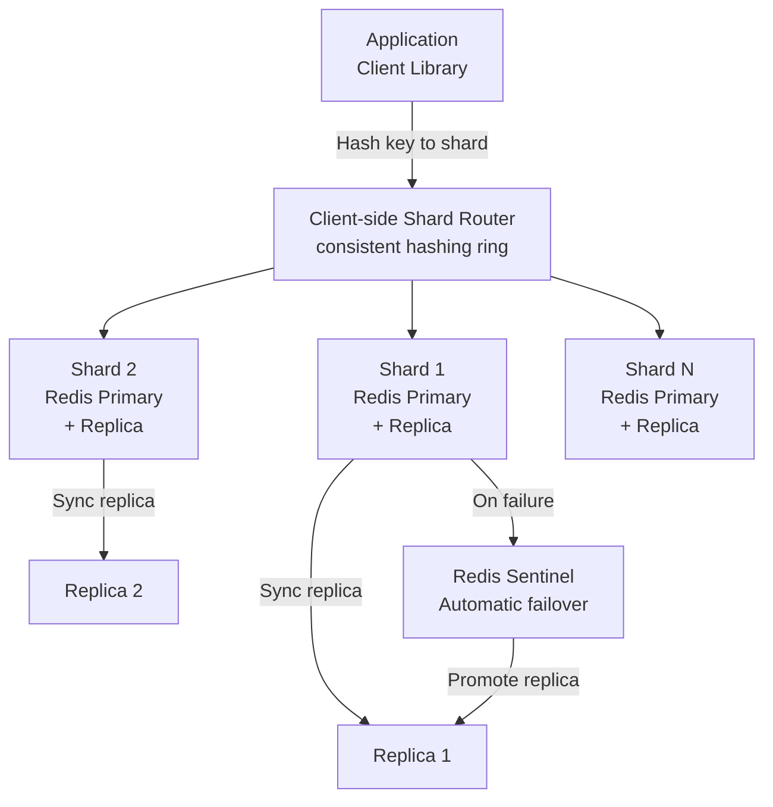

### Deep Dive: Consistent Hashing

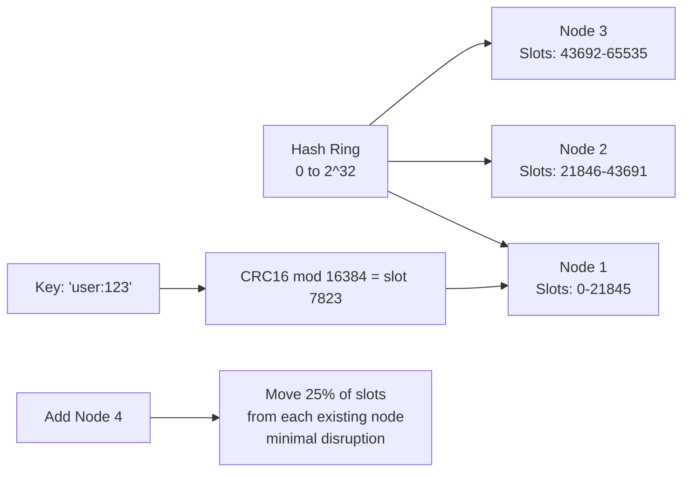

### Trade-off Decisions
| Decision | Option A | Option B | Chosen | Why |
|----------|----------|----------|--------|-----|
| Sharding | Client-side consistent hashing | Redis Cluster (server-side) | Redis Cluster | Cluster handles resharding, failover automatically |
| Replication | Sync (strong consistency) | Async (eventual) | Async | Sync adds write latency; cache staleness is acceptable |
| Eviction | LRU global | LFU per key | Allkeys-LFU | LFU handles Zipfian access patterns better than LRU |
| Persistence | AOF (durable) | RDB (periodic snapshot) | None / RDB weekly | Cache is ephemeral; warm up from DB on restart |

### Failure Modes
| Failure | Impact | Mitigation |
|---------|--------|------------|
| Node failure | 1/N of keys miss → DB load spike | Sentinel auto-failover < 30s; replica handles reads during failover |
| Thundering herd | All misses hit DB simultaneously | Probabilistic early expiry; Redis lock on cache miss (1 DB request) |
| Memory full | Evictions of hot keys | Monitor memory/key ratio; scale horizontally before 80% full |
| Network partition | Split-brain | Redis Sentinel requires majority quorum; minority side goes read-only |

### Concept References

---

## Q2: What is consistent hashing and how does it minimize cache misses?

**Role:** Mid | **Difficulty:** 🟡 Mid | **Priority:** P0 | **Format:** Quick Answer

> **What the interviewer is testing:** Whether you understand how consistent hashing reduces key remapping when nodes are added or removed, compared to naive modular hashing.

### Answer in 60 seconds
- **Naive modular hashing:** `node = hash(key) % N`; add 1 node → N changes to N+1 → all `N/(N+1)` fraction of keys remapped → cache cold = massive DB spike
- **Consistent hashing:** Keys and nodes placed on circular ring; key maps to nearest node clockwise; add/remove node → only keys between new node and its predecessor remapped (~1/N fraction)
- **Impact:** Adding 1 node to 10-node ring → only 10% of keys remapped vs 91% with modular hashing
- **Virtual nodes:** Each physical node maps to 150 virtual nodes on ring → more even distribution; fixes "hotspot" when nodes are unevenly spaced
- **Redis Cluster:** Uses 16384 hash slots; `slot = CRC16(key) % 16384`; slots assigned to nodes — consistent within slot assignment

### Diagram

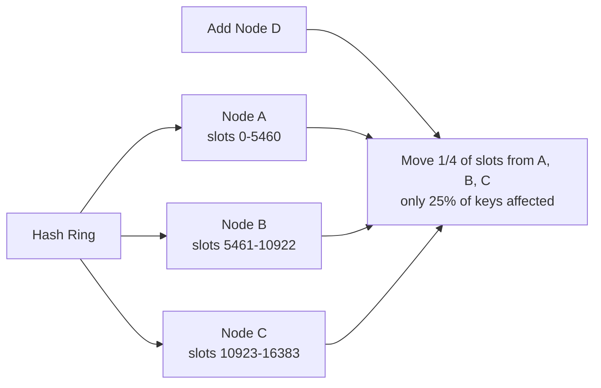

### Pitfalls
- ❌ **Using modular hashing for distributed cache:** 1 node added to 10-node cluster → 91% cache miss rate instantly → DB overload; consistent hashing limits this to 9% remapping
- ❌ **Consistent hashing without virtual nodes:** Without virtual nodes, key distribution is uneven — some nodes handle 3× the keys of others; use 150+ virtual nodes per physical node

### Concept Reference

---

## Q3: How do you handle cache eviction when memory is full?

**Role:** Senior | **Difficulty:** 🔴 Senior | **Priority:** P0 | **Format:** Deep Dive

> **What the interviewer is testing:** Whether you understand cache eviction policies and their trade-offs for different access patterns.

### Problem Constraints
| Dimension | Value |
|-----------|-------|
| Memory capacity | 64 GB per node |
| Working set size | 80 GB (20% overflow) |
| Access pattern | Zipfian (20% of keys = 80% of requests) |
| Eviction latency | < 1ms (must not impact request latency) |

### Approach A — LRU (Least Recently Used)

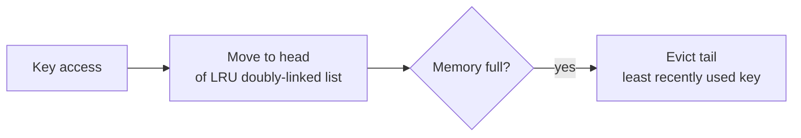

**Problem:** A key accessed once 5 minutes ago ranks higher than a key accessed 100 times 6 minutes ago.

### Approach B — LFU (Least Frequently Used)

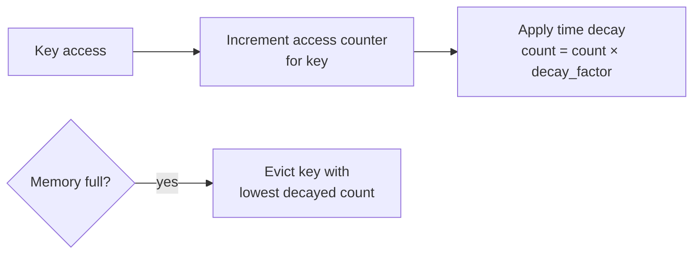

| Dimension | LRU | LFU |
|-----------|-----|-----|
| Recency bias | High | Medium (with decay) |
| Frequency bias | None | High |
| Best for | Temporal locality (recent = valuable) | Zipfian (20% hot keys = 80% requests) |
| Eviction on scan | Scans pollute cache | Frequency protects hot keys |
| Memory overhead | Doubly-linked list | Counter per key |

### Approach C — Redis Approximation (Default)

Redis uses **sampled LRU** — evicts from random sample of 5 keys (configurable `maxmemory-samples`). Fast O(1) vs exact LRU O(N). Configurable `maxmemory-policy`:
- `allkeys-lru` — evict any key by LRU
- `allkeys-lfu` — evict any key by LFU (Redis 4.0+)
- `volatile-lru` — evict only keys with TTL set

### Recommended Answer
`allkeys-lfu` for Zipfian access patterns (typical for application caches). LFU with time decay protects hot keys that are accessed thousands of times from eviction, while rare "scan" queries don't pollute the eviction order. Redis approximated LFU uses 8-bit Morris counter with exponential decay — near-ideal LFU behavior with minimal memory overhead. Monitor `evicted_keys` metric; if > 0, add memory or nodes.

### What a great answer includes
- [ ] Identifies access pattern (Zipfian) drives the eviction choice
- [ ] Explains time decay in LFU (prevents stale high-frequency keys from never evicting)
- [ ] Mentions Redis's approximation vs exact algorithm
- [ ] Recommends monitoring evicted_keys metric

### Pitfalls
- ❌ **Using noeviction policy in production:** If memory fills up, Redis returns OOM error — cache stops working; always configure an eviction policy
- ❌ **Ignoring access pattern when choosing policy:** LRU is fine for recent-is-best workloads; LFU for power-law distributions; wrong choice causes hot-key eviction under pressure

### Concept Reference

---

## Q4: Cache-aside vs read-through vs write-through — differences?

**Role:** Mid | **Difficulty:** 🟡 Mid | **Priority:** P1 | **Format:** Quick Answer

> **What the interviewer is testing:** Whether you know the three main cache interaction patterns and which use cases each serves.

### Answer in 60 seconds
- **Cache-aside (lazy loading):** App checks cache → miss → app reads DB → app writes to cache; app controls caching logic; most common; risk: thundering herd on miss
- **Read-through:** Cache sits in front of DB; on miss, cache reads DB and stores result; app only talks to cache; simpler app code; cache must know DB schema
- **Write-through:** Every write goes to cache + DB synchronously; cache always fresh; doubles write latency; good when read:write ratio is close (not 90:10)
- **Write-behind (write-back):** Write to cache only; async DB write in batch; fastest writes; risk of data loss if cache fails before DB write
- **Common choice:** Cache-aside for read-heavy, write-through for write-heavy-but-small, write-behind for bulk ingestion

### Diagram

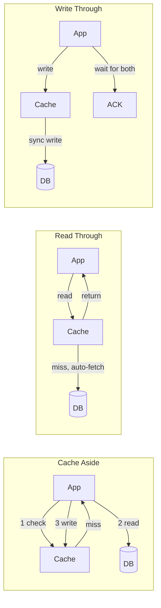

### Pitfalls
- ❌ **Using write-through for high-write workloads:** 50K writes/sec × 2 (cache + DB) = 100K write ops/sec; doubles write throughput requirement; use cache-aside for write-heavy paths
- ❌ **Cache-aside without stampede protection:** 10K concurrent misses for same key → 10K DB reads simultaneously; use Redis SETNX lock: only 1 request queries DB, others wait

### Concept Reference

---

## Q5: How do you handle a cache node failure without thundering herd?

**Role:** Senior | **Difficulty:** 🔴 Senior | **Priority:** P1 | **Format:** Deep Dive

> **What the interviewer is testing:** Whether you understand the thundering herd problem and multiple mitigation strategies.

### Problem Constraints
| Dimension | Value |
|-----------|-------|
| Cache size | 16 nodes, each handling 31K rps |
| Node failure | 1 node → 31K rps suddenly hit DB |
| DB capacity | 10K writes/sec, 30K reads/sec (near limit) |
| Recovery time | Redis Sentinel failover: 10–30s |

### Approach A — No Protection (Thundering Herd)

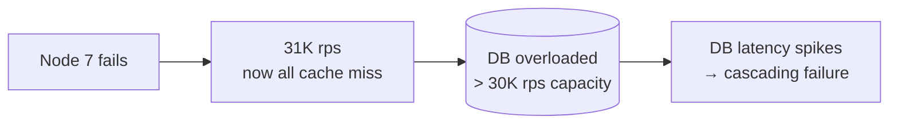

### Approach B — Multi-Layer Protection

```mermaid
graph TD
  NodeDown[Node failure] --> L1[Layer 1: Hot replica\nReplica handles reads\nduring 10-30s failover]
  L1 --> L2[Layer 2: Probabilistic expiry\nkeys expire 0-100ms early\nrandom spread of misses]
  L2 --> L3[Layer 3: Redis mutex\nSETNX miss-lock:{key}\nonly 1 thread queries DB per key]
  L3 --> L4[Layer 4: Circuit breaker\nif DB response > 100ms,\nreturn stale data]
  L4 --> Recovery[DB protected\nCache rebuilt over 60s]
```

| Dimension | No Protection | Multi-Layer |
|-----------|--------------|------------|
| DB load on node failure | 31K rps spike | < 1K rps (mutex + replica) |
| Recovery time | Manual intervention | Automatic (30s) |
| Stale data risk | None | Small window during failover |
| Complexity | None | Medium |

### Recommended Answer
Four layers (Approach B): (1) Sentinel promotes replica within 30s — misses only during failover window. (2) Probabilistic early expiry (`TTL × random(0.9-1.1)`) — spreads key expiry to avoid simultaneous stampede. (3) Redis mutex: `SETNX miss-lock:{key} 1 EX 10` — only one request queries DB per key; others wait and read from cache when populated. (4) Circuit breaker: if DB p99 > 100ms, serve stale cached data. Each layer independently reduces load spike.

### What a great answer includes
- [ ] Describes Sentinel failover mechanism and 10-30s window
- [ ] Explains probabilistic early expiry (jitter on TTL)
- [ ] Mutex pattern for single DB read on cache miss
- [ ] Serving stale as last resort to protect DB

### Pitfalls
- ❌ **Relying on Sentinel failover alone:** 10-30s with no cache → 31K rps to DB → DB fails before Sentinel promotes replica; need mutex and stale data serving in parallel
- ❌ **Mutex TTL too long:** If DB is slow (10s response), mutex lock of 10s means all requestors wait 10s → request timeout; set mutex TTL = p99 DB query time × 2

### Concept Reference

---

## Q6: How do you replicate cache data for high availability?

**Role:** Senior | **Difficulty:** 🔴 Senior | **Priority:** P1 | **Format:** Quick Answer

> **What the interviewer is testing:** Whether you know Redis replication modes, trade-offs between sync and async, and how Sentinel manages failover.

### Answer in 60 seconds
- **Async replication (default):** Primary acknowledges write immediately; sends replication stream to replica asynchronously; ~1-2ms lag; risk: replica misses last few writes if primary crashes
- **WAIT command:** `WAIT 1 100` — wait until 1 replica acknowledges the write, timeout 100ms; semi-synchronous for critical data
- **Redis Sentinel:** Monitors primary health (heartbeat every 1s); if primary doesn't respond for `down-after-milliseconds` (default 30s), promotes replica; requires 3 Sentinel nodes for quorum
- **Redis Cluster:** Built-in replication per slot; primary-replica pairs per shard; automatic failover without separate Sentinel
- **Replication lag:** Monitor `replication_offset_diff`; alert if lag > 100MB (indicates replica is behind by > 100MB of writes)

### Diagram

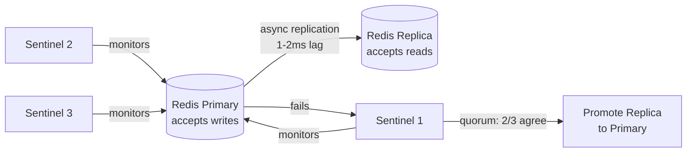

### Pitfalls
- ❌ **Only 2 Sentinel nodes:** 2 Sentinels cannot form quorum if one disagrees — need minimum 3 Sentinel nodes (quorum = majority)
- ❌ **Read from replica without acknowledging lag:** Replica lag of 100MB = significant staleness for rapidly-changing keys; check replication lag before routing read-heavy queries to replica

### Concept Reference

---

## Q7: How do you handle hot keys in a distributed cache?

**Role:** Senior | **Difficulty:** 🔴 Senior | **Priority:** P2 | **Format:** Quick Answer

> **What the interviewer is testing:** Whether you understand the hot key problem — when one cache key receives disproportionate traffic that overloads a single shard.

### Answer in 60 seconds
- **Problem:** Celebrity user profile `user:12345` receives 100K reads/sec → all routed to one Redis shard → that shard is CPU-bound while others idle
- **Local in-process cache:** Each application server maintains a small LRU cache (e.g., 100 entries) for top hot keys; `Caffeine` in Java, `lru-cache` in Node.js; ~1μs access vs 1ms Redis
- **Key replication:** For read-mostly hot keys, replicate to `user:12345:replica1`, `user:12345:replica2` across different shards; read client randomly picks a replica
- **CDN for public data:** Profile images, popular product listings — serve from CDN, not Redis
- **Detection:** Monitor `OBJECT FREQ` for LFU keys; alert on keys with access rate > 10K rps to a single shard

### Diagram

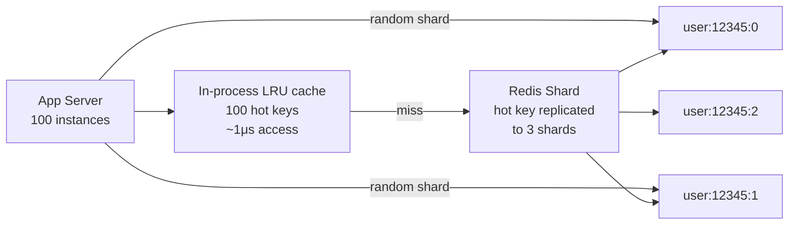

### Pitfalls
- ❌ **All traffic for hot key hitting single shard:** 100K rps to 1 Redis instance → CPU saturation at ~200K ops/sec for complex commands; replicate hot key across shards
- ❌ **Local cache without invalidation:** Hot key updated in Redis but local cache stale for TTL duration; use short TTL (1-5s) for local cache of frequently-updated keys

### Concept Reference

---

## Q8: How would you design a multi-region cache with consistency?

**Role:** Staff | **Difficulty:** ⚫ Staff | **Priority:** P2 | **Format:** Deep Dive

> **What the interviewer is testing:** Whether you understand the CAP theorem implications for distributed caches across regions and the trade-offs between read latency and write consistency.

### Problem Constraints
| Dimension | Value |
|-----------|-------|
| Regions | US-East, EU-West, AP-Southeast |
| Cross-region latency | 80–200ms |
| Consistency requirement | Session consistency (user sees their own writes) |
| Availability | 99.99% |

### Approach A — Global Single Redis Cluster

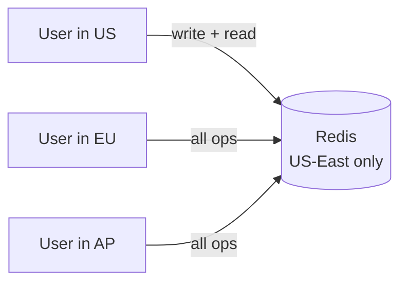

**Problem:** EU/AP users: 150ms latency for every cache read — defeats cache purpose.

### Approach B — Regional Caches + Write-to-Local + Async Invalidation

```mermaid
graph TD
  WriteSvc[Write Service\n(any region)] -->|1 write to local cache| LocalCache[Local Redis]
  WriteSvc -->|2 publish invalidation| Kafka[Global Kafka\ninvalidation events]
  Kafka -->|replicate to all regions| US_Cache[US Redis]
  Kafka --> EU_Cache[EU Redis]
  Kafka --> AP_Cache[AP Redis]
  EU_Cache -->|invalidate key| Stale[Stale EU entry removed\nnext read fetches from DB]
```

| Dimension | Single Global | Regional + Invalidation |
|-----------|--------------|------------------------|
| Read latency | 80-200ms cross-region | 1-5ms local |
| Write consistency | Strong (single source) | Eventual (50-200ms lag) |
| Availability | SPOF if US-East down | Regional isolation |
| Complexity | Low | Medium |

### Recommended Answer
Regional caches with async invalidation (Approach B). Each region has independent Redis cluster. On cache write, publish invalidation event to cross-region Kafka (or AWS EventBridge). All regional caches subscribe and evict the key — next read fetches from local DB and re-populates. Consistency lag: 50–200ms across regions. For session consistency (user sees their own writes), route user's reads to same region where they wrote using sticky session or cookie. This gives < 5ms cache latency globally.

### What a great answer includes
- [ ] States that cross-region cache read latency = defeat of cache's purpose
- [ ] Explains async invalidation vs synchronous replication
- [ ] Addresses session consistency problem (user routed to same region)
- [ ] Quantifies consistency lag (50-200ms acceptable for most use cases)

### Pitfalls
- ❌ **Replicating all cache writes to all regions:** Cache hit rate for EU data stored in US is low anyway; replication adds bandwidth cost with little benefit — only invalidate, let regions re-populate on demand
- ❌ **Ignoring write-write conflict:** Two regions update same key simultaneously — last-write-wins via timestamp; use `SETNX` or Lua compare-and-swap for critical keys

### Concept Reference

---

## Q9: How does Redis handle persistence (RDB vs AOF)?

**Role:** Staff | **Difficulty:** ⚫ Staff | **Priority:** P2 | **Format:** Quick Answer

> **What the interviewer is testing:** Whether you understand Redis persistence modes and when to use each in a cache vs durable-store context.

### Answer in 60 seconds
- **RDB (Redis Database Backup):** Point-in-time snapshot saved every N seconds; fork process to serialize; fast recovery on restart; potential data loss since last snapshot (up to 5 min)
- **AOF (Append-Only File):** Logs every write command; `fsync` modes: always (1 write/command = most durable), everysec (1 fsync/sec = 1s loss risk), no (OS decides)
- **AOF + RDB hybrid:** Redis 4.0+ supports `aof-use-rdb-preamble` — RDB snapshot + AOF log of changes since snapshot; fast startup (RDB) + minimal loss (AOF)
- **For cache:** No persistence (ephemeral); warm from DB on restart; avoids I/O overhead
- **For cache with durability SLA:** AOF `everysec` — max 1s data loss, acceptable throughput overhead (~10-20%)

### Diagram

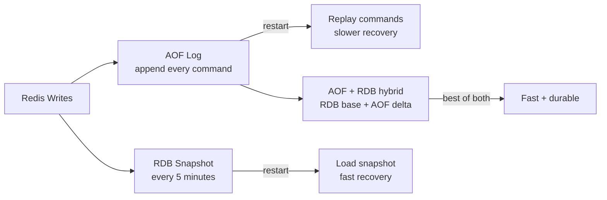

### Pitfalls
- ❌ **AOF `always` fsync for high-throughput cache:** `fsync` on every write serializes disk I/O; at 500K ops/sec = 500K fsyncs/sec → disk saturation; use `everysec` for durability with acceptable performance
- ❌ **Large AOF file without rewriting:** AOF grows indefinitely; Redis `BGREWRITEAOF` compresses by rewriting current state; run periodically to keep AOF manageable

### Concept Reference

---

## Q10: How would you implement a hierarchical cache (L1 in-process + L2 Redis)?

**Role:** Staff | **Difficulty:** ⚫ Staff | **Priority:** P3 | **Format:** Quick Answer

> **What the interviewer is testing:** Whether you can design a two-tier cache that reduces Redis latency for ultra-hot keys while maintaining reasonable consistency.

### Answer in 60 seconds
- **L1 (in-process):** JVM heap / Node.js memory; `Caffeine` LRU with max 1000 entries, 5s TTL; ~100 ns access time
- **L2 (Redis):** Distributed; holds millions of entries; ~1ms access time; shared across all app instances
- **Lookup order:** Check L1 → if miss, check L2 → if miss, query DB → populate L2, then L1
- **Invalidation problem:** Key updated in L2 → L1 still stale until 5s TTL expires; for consistency, publish invalidation to all app instances via Redis Pub/Sub
- **Use case:** Product catalog pages at 100K rps; L1 serves 95% from memory; only 5% hit Redis; Redis serves rest without DB load

### Diagram

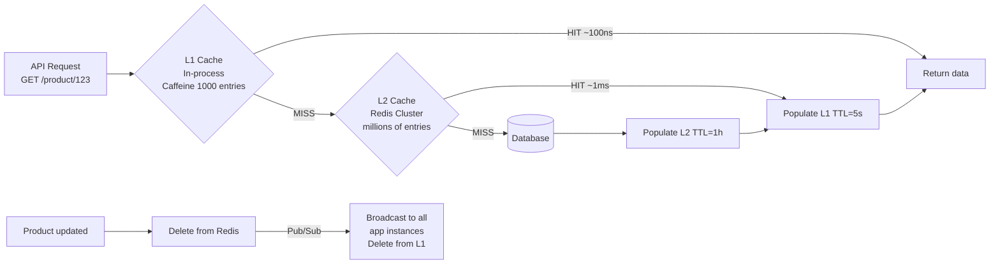

### Pitfalls
- ❌ **Long L1 TTL without invalidation:** 60s L1 TTL → updated price takes 60s to propagate to all app instances × 100 servers; for price-sensitive data use Redis Pub/Sub invalidation + short L1 TTL (5s max)
- ❌ **L1 too large:** 10,000 entries × 10KB each = 100MB per JVM instance × 100 servers = 10GB heap pressure; keep L1 small (100-1000 entries) for truly hot keys only

### Concept Reference
