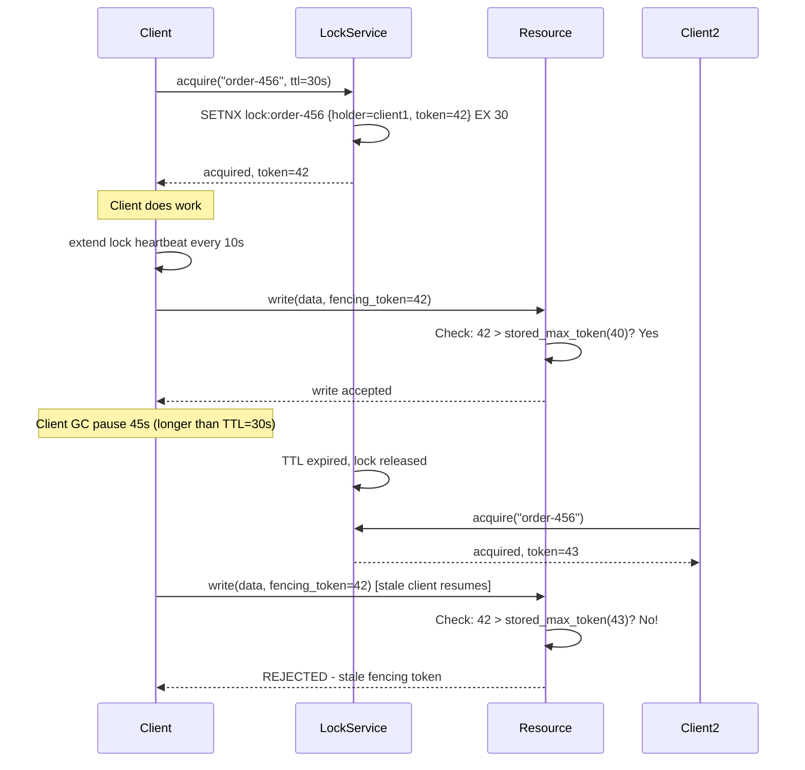
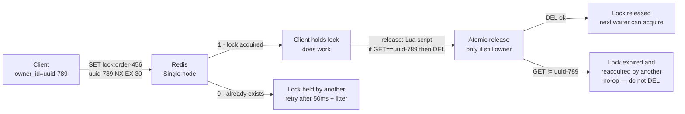
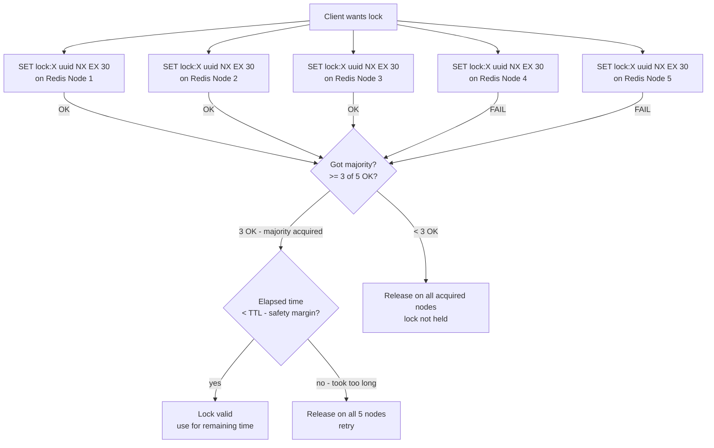
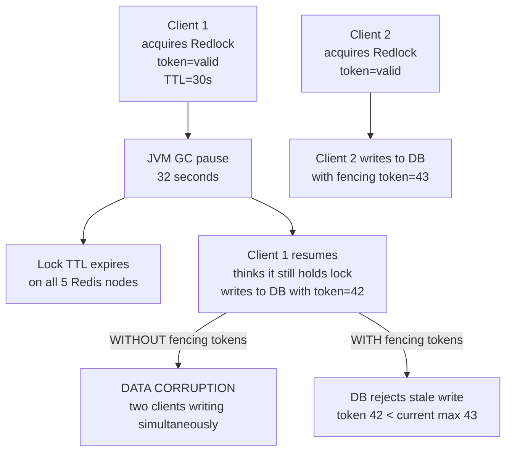
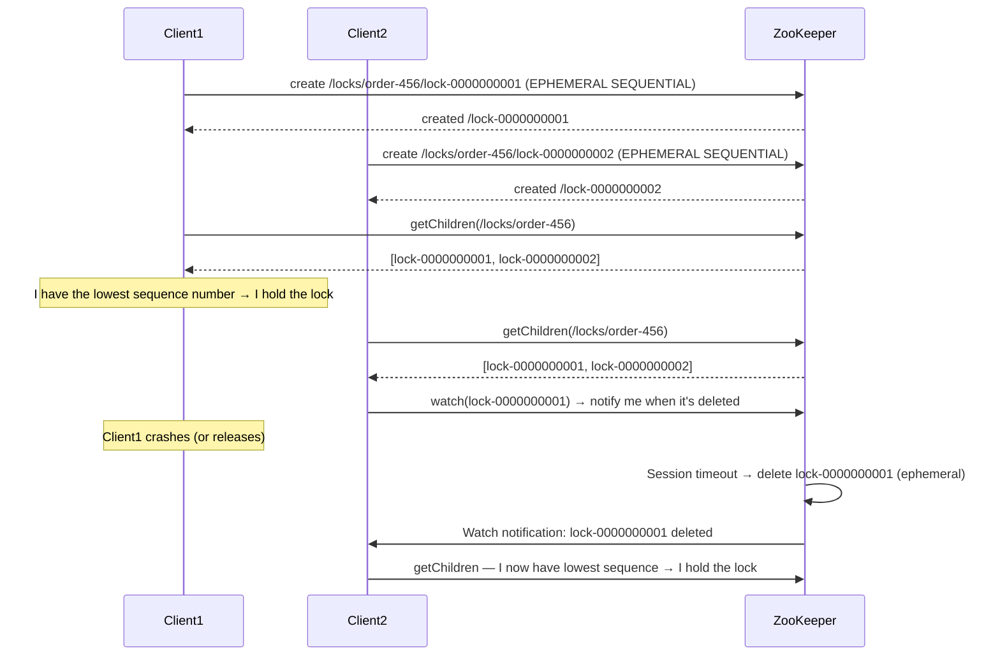
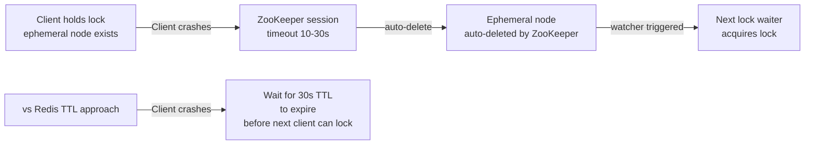

# Design a Distributed Locking Service

---

## Q1: Design a distributed locking service with 99.99% availability and sub-millisecond lock acquisition

**Role:** Senior | **Difficulty:** 🔴 Senior | **Priority:** P0 | **Format:** Scenario
**Real Company:** Google Chubby — lock service for GFS, Bigtable, Borg; Apache ZooKeeper — Kafka, Hadoop coordination; Redis Redlock — widely used but controversial (see failure modes)

### The Brief
> "Design a distributed locking service. Clients must be able to acquire and release named locks. A lock can be held by only one client at a time. The system must handle 10K lock operations per second, achieve lock acquisition latency under 1ms p99, guarantee mutual exclusion even under node failures, and achieve 99.99% availability (52 min downtime/year)."

### Clarifying Questions to Ask First
1. What should happen when a lock holder crashes — auto-release after timeout or manual release?
2. Do we need reentrant locks (same client can re-acquire the lock it holds)?
3. Is fairness required (FIFO ordering for lock waiters)?
4. Do we need fencing tokens to guard against split-brain scenarios?

### Back-of-Envelope Estimation
| Metric | Calculation | Result |
|--------|-------------|--------|
| Lock operations/sec | 10K acquire + 10K release | ~20K ops/sec |
| Active locks | 10K concurrent holders (if 1s avg hold time) | — |
| Lock metadata size | 200 bytes per lock (name, holder, expiry, token) | — |
| Memory for locks | 10K active × 200B | ~2 MB (trivially small) |
| Availability target | 99.99% | 52 min downtime/year |
| Consensus round-trip | Raft leader → follower × 2 | ~2-5ms (same DC) |
| Redis SETNX latency | Single node | ~0.1ms |
| ZooKeeper create node | Quorum write | ~2-5ms |

### High-Level Architecture

```mermaid
graph TD
  Client1[Client A\nOrderService] -->|acquire(lock=order-456, ttl=30s)| LockAPI[Lock Service API\ngRPC / REST]
  Client2[Client B\nPaymentService] -->|acquire(lock=order-456)| LockAPI

  LockAPI --> LockEngine[Lock Engine\nmutual exclusion logic]
  LockEngine --> Storage[Lock Storage\nZooKeeper / Redis / etcd]

  Storage -->|acquire OK| FencingToken[Fencing Token\nmonotonically increasing int\ntoken=42]
  FencingToken --> Client1

  Client1 -->|write to DB with token=42| ResourceDB[(Protected Resource\nPostgreSQL)]
  ResourceDB --> TokenCheck{Token 42 > last\nseen token?}
  TokenCheck -->|yes| AcceptWrite[Accept write]
  TokenCheck -->|no - stale| RejectWrite[Reject - stale lock holder]

  HeartbeatMonitor[Heartbeat Monitor\nchecker goroutine] -->|no heartbeat for 30s| AutoRelease[Auto-release expired lock]
```

### Deep Dive: Lock Lifecycle with Fencing Tokens



### Trade-off Decisions
| Decision | Option A | Option B | Chosen | Why |
|----------|----------|----------|--------|-----|
| Storage backend | Redis (SETNX) | ZooKeeper ephemeral nodes | Depends on use case | Redis: < 1ms, simpler; ZooKeeper: stronger consistency guarantees, built-in watches |
| Lock expiry | Fixed TTL | Renewable lease | Renewable lease + TTL cap | Lease renewal allows long-running operations; TTL cap prevents zombie lock holders |
| Failure handling | Client detects lock loss | Server detects via heartbeat | Server heartbeat + TTL fallback | Server detection is faster; TTL is safety net if heartbeat monitoring fails |
| Fencing tokens | Optional | Mandatory | Mandatory | Without fencing tokens, GC pause can cause split-brain with two active lock holders |

### Failure Modes
| Failure | Impact | Mitigation |
|---------|--------|------------|
| Clock skew breaking Redlock | Node A thinks lock expired (local clock advanced); grants lock to Client B while Client A still holds it | Use logical clocks (fencing tokens) not wall clocks for lock validity; fencing token is monotonic integer, not timestamp |
| GC pause causes lock expiry | JVM client holds lock; 45s full-GC pause; lock expires; Client B acquires; Client A resumes — two active holders | Fencing tokens on protected resource; resource rejects write from Client A (stale token=42 vs current token=43) |
| Split brain | Network partition: 3-node cluster splits 2-1; both sides elect leader and grant conflicting locks | Use quorum-based consensus (Raft/ZooKeeper); require N/2+1 nodes to agree; minority partition cannot grant locks |
| Lock service unavailable | Clients cannot acquire new locks; existing locks hold until TTL | Redis Sentinel / ZooKeeper quorum for HA; lock operations queue during brief outages; 99.99% = 52 min/year total acceptable downtime |

### Concept References
→ [Distributed Locking](../../../system-design/distributed-systems/distributed-locking)
→ [Caching Strategies](../../../system-design/fundamentals/caching-strategies)

---

## Q2: How does Redis SETNX implement a distributed lock?

**Role:** Mid | **Difficulty:** 🟡 Mid | **Priority:** P0 | **Format:** Quick Answer

> **What the interviewer is testing:** Whether you know the atomic SETNX pattern, why you need both NX (not exists) and EX (expiry) together, and what the fundamental race condition is without proper TTL.

### Answer in 60 seconds
- **SETNX:** `SET key value NX EX seconds` — atomic "Set if Not Exists with Expiry"; returns 1 if lock acquired, 0 if already held
- **Value = unique token:** Use `UUID` or `{client_id}:{timestamp}` as lock value; required to safely release — only the lock holder can release its own lock
- **Safe release:** `GET lock → compare value → DEL` is NOT atomic; use Lua script: `if redis.call("GET",key)==owner then redis.call("DEL",key) end` — atomic compare-and-delete
- **TTL is mandatory:** Without EX, if client crashes without releasing, lock is held forever; TTL = safety net, typically 30s
- **Renewal:** Client extends TTL before expiry: `EXPIRE lock:key 30` every 10s as long as it holds the lock

### Diagram



### Pitfalls
- ❌ **SETNX followed by EXPIRE as two separate commands:** Race condition — if client crashes after SETNX but before EXPIRE, lock is held forever with no TTL; always use `SET key value NX EX seconds` as single atomic command
- ❌ **Using DEL without value check on release:** Client A's lock expires; Client B acquires it; Client A finishes work and calls DEL — deletes Client B's lock; always verify value before deleting

### Concept Reference
→ [Distributed Locking](../../../system-design/distributed-systems/distributed-locking)

---

## Q3: What is Redlock and why is it controversial?

**Role:** Senior | **Difficulty:** 🔴 Senior | **Priority:** P0 | **Format:** Deep Dive

> **What the interviewer is testing:** Whether you understand Antirez's Redlock algorithm, Martin Kleppmann's critique (clock skew, GC pauses), and when Redis-based locking is safe vs unsafe.

### Problem Constraints
| Dimension | Value |
|-----------|-------|
| Problem | Single Redis node = single point of failure |
| Redlock goal | Achieve safety with N independent Redis nodes |
| N recommended | 5 nodes (majority = 3) |
| Claim | Safe even if minority of nodes fail |

### Redlock Algorithm



### The Critique (Martin Kleppmann's Analysis)



| Dimension | Redis Single Node | Redlock (5 nodes) | ZooKeeper |
|-----------|------------------|-------------------|-----------|
| Latency | ~0.1ms | ~5-10ms (5 round trips) | ~2-5ms (quorum) |
| Safety under GC pause | No (single node) | No (without fencing tokens) | Yes (ephemeral node) |
| Safety under clock skew | No | No | Yes (no clock dependence) |
| HA | No (SPOF) | Yes (N/2 failures tolerated) | Yes (Raft quorum) |
| Complexity | Low | Medium | High |

### Recommended Answer
Redlock is safe for use cases that tolerate a brief window of incorrect lock grants (e.g., job scheduling, cache warming — operations that are idempotent). It is NOT safe for use cases requiring strict mutual exclusion where two concurrent writers would cause data corruption (e.g., financial ledger writes, inventory deduction) — unless combined with fencing tokens on the protected resource. For strict safety, use ZooKeeper (ephemeral nodes are released on client session disconnect, eliminating TTL clock dependency entirely). Google Chubby (the inspiration for ZooKeeper) was built precisely because lock services based on time-outs alone are not safe.

### What a great answer includes
- [ ] Explains Redlock requires majority quorum (N/2+1 nodes)
- [ ] States the GC pause vulnerability — client holds lock past TTL
- [ ] Explains fencing tokens as the fix regardless of lock backend
- [ ] Acknowledges Redlock is fine for non-critical mutual exclusion

### Pitfalls
- ❌ **Using Redlock for financial transactions without fencing tokens:** GC pause causes split-brain; both clients charge the card; use fencing token validated by payment service
- ❌ **Using 3 nodes instead of 5 for Redlock:** With 3 nodes, 1 failure leaves majority = 2; network partition can split 1-2; minority of 2 grants lock; always use odd number ≥ 5

### Concept Reference
→ [Distributed Locking](../../../system-design/distributed-systems/distributed-locking)
→ [Consistency Patterns](../../../system-design/fundamentals/consistency-patterns)

---

## Q4: How does ZooKeeper implement distributed locks using ephemeral nodes?

**Role:** Senior | **Difficulty:** 🔴 Senior | **Priority:** P1 | **Format:** Deep Dive

> **What the interviewer is testing:** Whether you understand ZooKeeper's ephemeral sequential nodes pattern for distributed locking, its session-based lock release, and fair FIFO ordering of lock waiters.

### Problem Constraints
| Dimension | Value |
|-----------|-------|
| Guarantee | Lock released on client crash (ephemeral node deleted on session disconnect) |
| Fairness | FIFO — first requester gets lock when current holder releases |
| Scale | ZooKeeper handles ~60K reads/sec, ~10K writes/sec |
| Latency | 2-5ms per lock operation (quorum write) |

### ZooKeeper Lock Protocol



### Ephemeral Node Advantage



| Dimension | Redis TTL | ZooKeeper Ephemeral |
|-----------|-----------|---------------------|
| Lock release on crash | After TTL (up to 30s delay) | After session timeout (10-30s, configurable) |
| Clock dependency | Yes — TTL uses wall clock | No — session-based, not time-based |
| Fairness | No (all waiters retry simultaneously) | Yes — FIFO via sequential node numbering |
| Herd effect | Yes — all waiters wake on expiry | No — only next-in-sequence watches predecessor |
| Complexity | Low | Medium |

### Recommended Answer
ZooKeeper ephemeral sequential nodes are the gold standard for distributed locking when fairness and safety matter. Each lock requester creates `/locks/{resource}/lock-NNNNNNNNNN` (EPHEMERAL SEQUENTIAL). Client with lowest sequence number holds the lock. Others watch only their immediate predecessor (not the lock root) — this prevents thundering herd. If client crashes, ZooKeeper auto-deletes the ephemeral node when session expires (no clock dependency — purely connection-based). The watch notification triggers only the next waiter, not all waiters simultaneously. This is exactly how Apache Kafka uses ZooKeeper for controller election.

### What a great answer includes
- [ ] Explains EPHEMERAL SEQUENTIAL node creation
- [ ] States lowest sequence number = lock holder
- [ ] Describes watching predecessor (not root) to prevent herd effect
- [ ] Explains session-based auto-release eliminates TTL clock dependency

### Pitfalls
- ❌ **Watching the root node instead of predecessor:** If all 100 waiters watch `/locks/order-456` for any change, when lock releases all 100 wake up and run `getChildren` simultaneously — thundering herd of 100 ZooKeeper reads; watch only immediate predecessor
- ❌ **Using ZooKeeper for high-throughput locking:** ZooKeeper handles ~10K writes/sec; if you need 100K lock acquisitions/sec, use Redis (500K ops/sec); ZooKeeper is for correctness-critical, low-throughput coordination (leader election, config)

### Concept Reference
→ [Distributed Locking](../../../system-design/distributed-systems/distributed-locking)
→ [Consistency Patterns](../../../system-design/fundamentals/consistency-patterns)

---

## Q5: What are fencing tokens and why are they necessary even with a perfect lock service?

**Role:** Staff | **Difficulty:** ⚫ Staff | **Priority:** P2 | **Format:** Deep Dive

> **What the interviewer is testing:** Whether you understand the fundamental problem that no lock service can fully prevent split-brain (GC pauses, network delays) and that fencing tokens on the protected resource are the only reliable defense.

### Problem Constraints
| Dimension | Value |
|-----------|-------|
| Lock service | Assumed perfect — grants exactly one lock at a time |
| Attack scenario | Client holds lock, pauses for 45s (GC), lock expires, Client B acquires, both now active |
| Protection | Fencing token on protected resource must reject stale operations |
| Token type | Monotonically increasing integer (not timestamp — clocks can go backwards) |

### The Split-Brain Timeline

```mermaid
graph TD
  T0[T=0s: Client A acquires lock\ntoken=42\nTTL=30s] --> T10[T=10s: Client A starts writing\nfencing_token=42]
  T10 --> T15[T=15s: Client A enters GC pause\n...still paused...]
  T15 --> T30[T=30s: Lock TTL expires\nServer auto-releases]
  T30 --> T31[T=31s: Client B acquires lock\ntoken=43]
  T31 --> T31B[T=31s: Client B starts writing\nfencing_token=43\nresource accepts: 43 > current_max=0]
  T31 --> T45[T=45s: Client A GC pause ends\nClient A THINKS it still has lock\nattempts write with fencing_token=42]
  T45 --> TokenCheck{Resource checks\n42 > current_max_token(43)?}
  TokenCheck -->|NO| Reject[Write REJECTED\nstale lock holder detected\ndata integrity preserved]
```

### Fencing Token Implementation on the Resource

```mermaid
graph LR
  LockService[Lock Service\ngrants lock with token=N\nmonotonic counter per lock name] --> Client[Lock Holder\ntoken=43]
  Client -->|write request with token=43| Resource[Protected Resource\ne.g., PostgreSQL]
  Resource --> CheckToken{max_token_seen\nfor this resource?}
  CheckToken -->|43 > 42 (stored)| UpdateAndAccept[UPDATE max_token=43\nAccept write]
  CheckToken -->|43 < 44 (stored)| Reject[REJECT\n409 Conflict\nStale lock token]
```

| Mechanism | Protection Against |
|-----------|-------------------|
| Lock TTL only | Zombie client eventually loses lock (after TTL) but may have already written |
| Lock TTL + fencing token | Zombie client write rejected by resource even during split-brain window |
| ZooKeeper ephemeral + fencing | Same — fencing still needed; session timeout is faster but not instantaneous |
| Redlock + fencing | Fixes Redlock's safety gap — resource rejects stale writer even if Redlock has a brief split-brain |

### Recommended Answer
Fencing tokens are a defense-in-depth mechanism that makes distributed locking safe regardless of the lock service implementation. The lock service issues a monotonically increasing token with each lock grant (stored in a single-writer counter). The protected resource (DB, file system, external service) validates incoming requests: only accept writes with a token strictly greater than the last accepted token. This means even if a client resumes after a GC pause of 10 minutes and attempts to write with its old token, the resource rejects it because a newer token has already been used. This is the only known correct solution to the split-brain problem in distributed locking — no lock service alone (Redlock, ZooKeeper, etcd) can guarantee this without cooperation from the protected resource.

### What a great answer includes
- [ ] Explains why lock service alone cannot prevent split-brain (GC pauses outside lock service control)
- [ ] States fencing token is monotonically increasing integer on the lock service side
- [ ] Describes resource-side validation (reject if token < max_seen)
- [ ] Notes timestamps (wall clocks) are not safe as fencing tokens (NTP adjustments can go backwards)

### Pitfalls
- ❌ **Using timestamps as fencing tokens:** NTP clock correction can move clocks backwards; `token=1711448400.123` can be duplicated across clients on different nodes; always use monotonic integer counters managed by the lock service
- ❌ **Fencing only on lock service side (not resource):** Recording "Client A holds token=43" in the lock service is not enough; the resource must validate token on every write operation — split-brain happens when client is disconnected from lock service but still connected to the resource

### Concept Reference
→ [Distributed Locking](../../../system-design/distributed-systems/distributed-locking)
→ [Consistency Patterns](../../../system-design/fundamentals/consistency-patterns)
