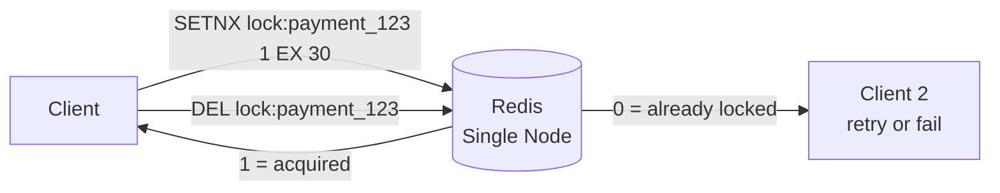
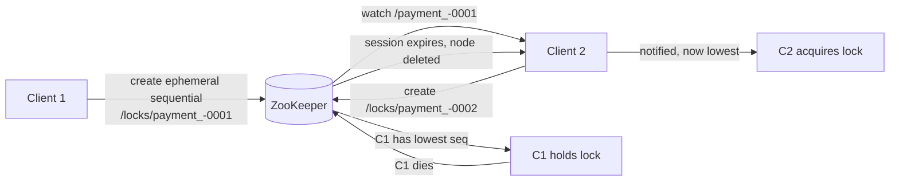
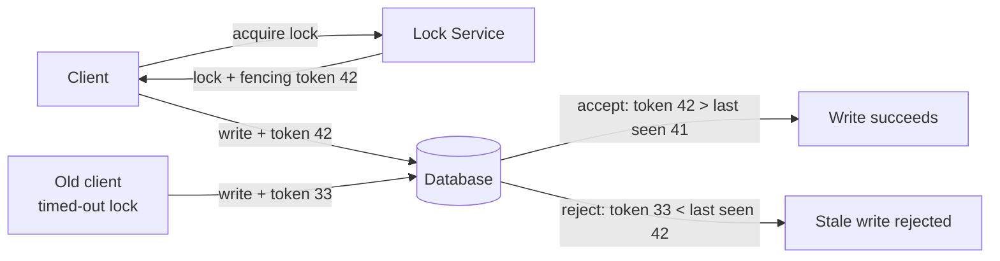

# Design a Distributed Locking Service

---

## Q1: Design a distributed locking service for preventing double-processing

**Role:** Senior, Backend | **Difficulty:** 🔴 Senior | **Priority:** P1 | **Format:** Deep Dive
**Real Company:** Google Chubby, Apache ZooKeeper, Redis Redlock

> **What the interviewer is testing:** Whether you understand the failure modes of distributed locks — clock skew, process pauses, and why "holding a lock" is not atomic.

### Problem Constraints
| Dimension | Value |
|-----------|-------|
| Lock operations | 10K/sec |
| Lock timeout | 30 seconds default |
| Availability | 99.99% |
| Latency SLA | <5ms p99 acquire |
| Use case | Prevent duplicate payment processing |

### Approach A — Redis SETNX (Single Node)

| Dimension | Single-node Redis | Redlock (5 nodes) |
|-----------|------------------|-------------------|
| Availability | ~99.9% (single failure = down) | 99.999% |
| Correctness | Good under normal ops | Weak (clock skew can break) |
| Latency | <1ms | 5ms (5 round trips) |
| Complexity | Simple | Complex |

### Approach B — ZooKeeper Ephemeral Nodes

| Dimension | ZooKeeper | Redis SETNX |
|-----------|-----------|-------------|
| Correctness | Strong (uses quorum writes) | Weaker (clock-based TTL) |
| Auto-release on crash | Yes (ephemeral node) | Yes (TTL expiry) |
| Latency p99 | 10–20ms | <1ms |
| Thundering herd | No (each client watches prev only) | Yes (all retry on release) |

### Recommended Answer
Use **ZooKeeper or etcd** for critical locks (payment, inventory). Use **Redis SETNX** for best-effort locks (rate limiting, cache warming). Never use Redis Redlock for distributed locks — Martin Kleppmann's analysis shows it fails under clock skew and GC pauses.

### Fencing Tokens — The Critical Detail

**Why fencing tokens matter:** Even with a lock, a GC pause can cause a client to think it holds the lock after TTL expired. The database must validate the monotonically increasing fencing token on every write to reject stale operations.

### Failure Modes
| Failure | Impact | Fix |
|---------|--------|-----|
| GC pause longer than lock TTL | Two clients both think they hold lock | Fencing tokens on every write |
| Clock skew between Redis nodes | Redlock grant even when lock held | Use ZooKeeper (quorum-based, not clock-based) |
| Network partition | Lock never released (ZK session hangs) | Tune ZK session timeout: 3–10 seconds |
| Lock held too long | Other clients starved | Short TTL + background heartbeat to extend |

### What a great answer includes
- [ ] Fencing tokens to handle process pauses after TTL
- [ ] Why Redlock is problematic (Martin Kleppmann's critique)
- [ ] ZooKeeper ephemeral nodes for strong consistency
- [ ] Watch mechanism for efficient handoff (not polling)
- [ ] Lock TTL + heartbeat pattern for long-running operations
