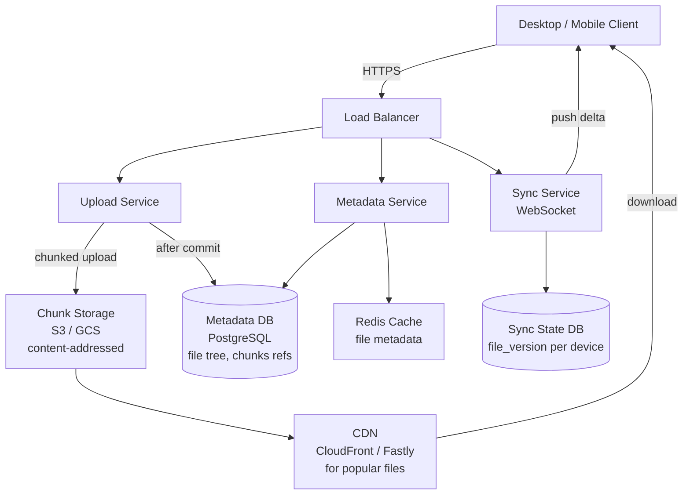
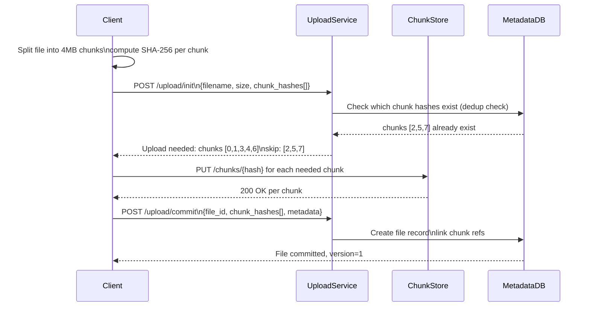
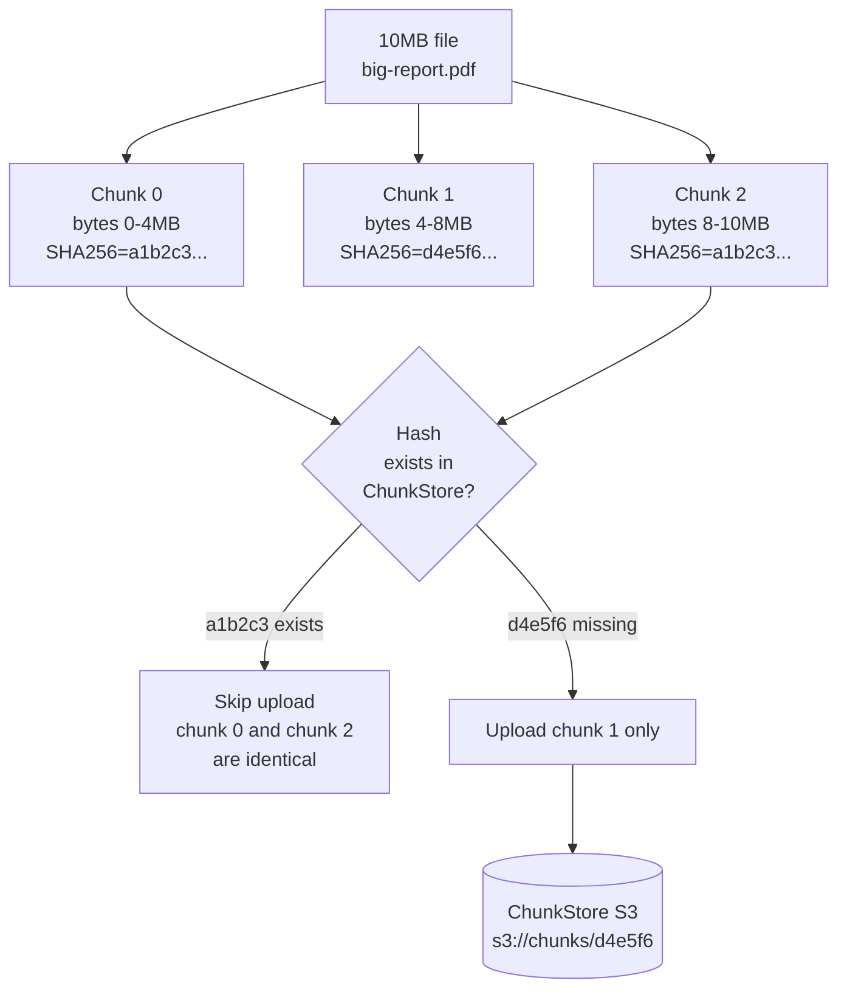
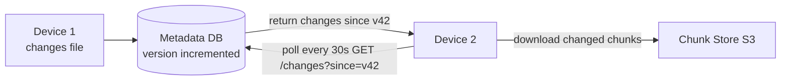
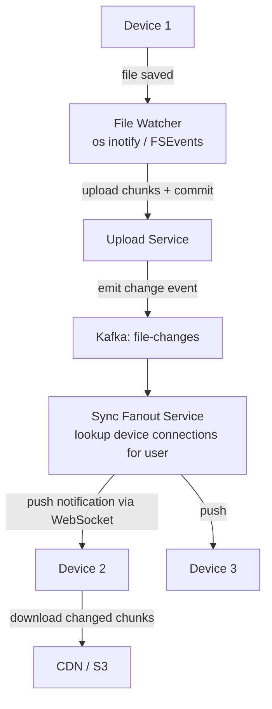
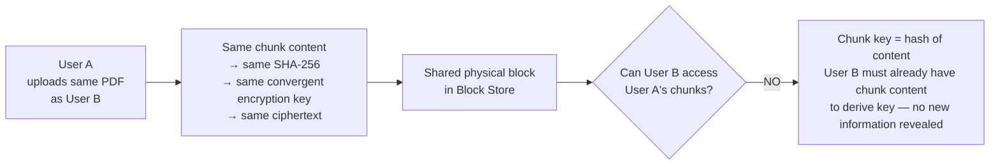

# Design a File Storage System (Dropbox/Google Drive)

---

## Q1: Design a file storage system for 500M users storing 1B files across 10PB of data

**Role:** Senior | **Difficulty:** 🔴 Senior | **Priority:** P0 | **Format:** Scenario
**Real Company:** Dropbox — 700M registered users, 500PB+ stored; Google Drive — 1B+ users, 15GB free per user

### The Brief
> "Design a file storage and sync system like Dropbox or Google Drive. Users can upload files up to 5GB from any device, access them from multiple devices, and share files with others. The system must handle 1M file uploads per day, 500M users, and 10PB of total storage. Downloads must complete in < 2s for files under 10MB."

### Clarifying Questions to Ask First
1. Do we need real-time collaboration (like Google Docs) or just sync after save?
2. Is file versioning required — and for how many versions?
3. What is the expected file size distribution — mostly small files or large files?
4. Do we need sharing/permissions, or just personal storage?

### Back-of-Envelope Estimation
| Metric | Calculation | Result |
|--------|-------------|--------|
| DAU | 500M users × 20% active | 100M DAU |
| Uploads/day | 1M uploads/day | ~12 uploads/sec |
| Avg file size | 10PB ÷ 1B files | ~10MB avg |
| Download ratio | 10:1 reads vs writes | ~120 download req/sec |
| Storage growth | 1M files/day × 10MB | ~10 TB/day |
| Metadata per file | 500 bytes (name, path, size, hash, owner) | — |
| Metadata total | 1B files × 500B | ~500 GB metadata |
| Dedup savings | 30% files are duplicates | 3 PB saved |

### High-Level Architecture



### Deep Dive: Chunking and Upload Flow



### Trade-off Decisions
| Decision | Option A | Option B | Chosen | Why |
|----------|----------|----------|--------|-----|
| Chunk size | 4MB | 64MB | 4MB | Smaller chunks = better dedup + resume granularity |
| Storage backend | Custom (Dropbox Magic Pocket) | S3-compatible | S3-compatible | Custom only worth it at Dropbox scale (500PB+) |
| Dedup scope | Per-user | Global (cross-user) | Per-user + global hash | Global dedup saves more space; privacy concerns solved by separate key management |
| Metadata DB | PostgreSQL | Cassandra | PostgreSQL | File trees are hierarchical; joins for sharing; ACID for rename/move |
| Download path | Direct from S3 | CDN | CDN | CDN serves popular files at < 20ms; S3 alone = 80-200ms |

### Failure Modes
| Failure | Impact | Mitigation |
|---------|--------|------------|
| Partial upload (client crashes mid-upload) | Incomplete file chunks in S3 | Multipart upload ID tracks progress; client resumes from last committed chunk |
| Concurrent edit conflict | Two devices save different versions of same file | Last-write-wins by timestamp; flag conflict if both modified since last sync; create conflict copy |
| Hot partition for popular shared file | Single S3 key hammered by 10K simultaneous downloads | CDN caching in front of S3; pre-warm CDN for viral files |
| Metadata DB overloaded | File listing/browsing slow | Separate read replicas for listing; cache directory listings in Redis TTL=60s |

### Concept References

---

## Q2: How does chunking enable resumable uploads and deduplication?

**Role:** Mid | **Difficulty:** 🟡 Mid | **Priority:** P0 | **Format:** Quick Answer

> **What the interviewer is testing:** Whether you understand content-addressable storage, how SHA-256 chunk hashes enable deduplication, and why chunking makes uploads resilient to network interruption.

### Answer in 60 seconds
- **Chunk files into 4MB blocks:** Each chunk gets a SHA-256 fingerprint — `hash(chunk_bytes)` → hex string
- **Content-addressed storage:** Store chunk at `s3://chunks/{sha256_hash}` — same content → same key → one physical copy regardless of how many files reference it
- **Dedup check:** Before uploading, client sends all chunk hashes to server; server returns which hashes it already has; client uploads only missing chunks
- **Resume on failure:** Upload records which chunk indices committed to DB; on resume, client skips committed chunks, re-uploads from last failure point
- **Dropbox numbers:** Chunking achieves ~30% storage reduction via dedup; eliminates re-upload of unmodified regions on file edit (delta sync)

### Diagram



### Pitfalls
- ❌ **Fixed chunk size ignoring file type:** Binary files dedup well at 4MB chunks; text files edited frequently benefit from 1MB chunks (smaller delta); use content-defined chunking (Rabin fingerprinting) for best dedup on edited files
- ❌ **Treating chunk hash as encryption:** SHA-256 is a fingerprint, not encryption; chunks must be encrypted separately (AES-256) before storing in S3; dedup key is the hash, but stored content must be ciphertext

### Concept Reference

---

## Q3: How does the sync protocol work to keep multiple devices in sync?

**Role:** Senior | **Difficulty:** 🔴 Senior | **Priority:** P0 | **Format:** Deep Dive

> **What the interviewer is testing:** Whether you understand delta sync, vector clocks or version numbers for conflict detection, and efficient change propagation across devices.

### Problem Constraints
| Dimension | Value |
|-----------|-------|
| Devices per user | Avg 3 devices (laptop, phone, tablet) |
| Sync latency SLA | Changes visible on other device within 30s |
| Change volume | 1M file changes/day across 100M DAU |
| Bandwidth efficiency | Only changed chunks transmitted (delta sync) |

### Approach A — Polling (Pull-based)



**Problem:** 100M devices × 1 poll/30s = 3.3M requests/sec on metadata service; most polls return empty (no changes).

### Approach B — Long Polling / WebSocket Push



| Dimension | Approach A (Polling) | Approach B (WebSocket Push) |
|-----------|---------------------|-----------------------------|
| Sync latency | 0-30s (poll interval) | < 5s (push notification) |
| Server load | 3.3M req/sec (all devices) | Only on change (1M events/day = 12/sec) |
| Connection overhead | Stateless HTTP | WebSocket connections (100M persistent) |
| Simplicity | High | Medium (fanout complexity) |
| Mobile battery | Wakes radio every 30s | Radio wakes only on server push |

### Recommended Answer
Approach B (WebSocket Push) for mobile + desktop clients. Dropbox uses a long-polling notification channel: when a change occurs, server sends a lightweight notification (not the actual data) to all connected devices for that user. Device receives notification, then calls `GET /changes?since={cursor}` to get the list of changed files, then downloads only changed chunks from CDN. This separates notification latency (< 5s) from data transfer latency. Cursor (monotonic version number per user) enables resumable sync after offline periods.

### What a great answer includes
- [ ] Separates notification (push) from data transfer (pull after notification)
- [ ] Explains cursor/version-based change feed for offline recovery
- [ ] Addresses device authentication on WebSocket connections
- [ ] Mentions per-user fanout — not broadcast to all users

### Pitfalls
- ❌ **Sending file content over WebSocket:** WebSocket for notification only; actual file download from CDN; pushing MBs through WebSocket bypasses CDN caching entirely
- ❌ **Ignoring offline devices:** Device offline for 7 days reconnects — must catch up all changes since last cursor; cursor-based change feed is essential

### Concept Reference

---

## Q4: How do you handle concurrent edit conflicts between devices?

**Role:** Senior | **Difficulty:** 🔴 Senior | **Priority:** P1 | **Format:** Quick Answer

> **What the interviewer is testing:** Whether you can articulate conflict detection strategies (version vectors, checksums) and user-facing resolution policies for file sync systems.

### Answer in 60 seconds
- **Conflict detection:** Each file has `version` (monotonic counter) and `last_modified_at`; device B saves file when it has `version=5`; device A also edited from `version=5` and tries to save → version conflict detected
- **Resolution policies:** (1) Last-write-wins by server timestamp — simplest, data loss risk; (2) Conflict copy — both versions kept, user resolves manually; Dropbox default for binary files
- **Operational transform / CRDT:** Google Docs model — track every edit as operation, merge concurrent ops mathematically; only feasible for text; too complex for arbitrary binary files
- **Dropbox model:** Binary conflict → create `filename (Device's conflicted copy 2026-03-26).ext`; user sees both versions in folder; no data loss
- **Google Drive model:** For Google Docs (text), CRDT merges automatically; for binary files uploaded externally, last-write-wins

### Diagram

```mermaid
graph TD
  V5[File version 5\non server] --> DeviceA[Device A\nedits offline\nlocal version 5→6]
  V5 --> DeviceB[Device B\nedits online\ncommits version 5→6]

  DeviceB -->|commit version 6| Server[Server\nfile now at version 6]
  DeviceA -->|commit version 6\nbased on version 5| Server
  Server -->|409 Conflict\nbase version 5 stale| ConflictHandler[Conflict Handler]
  ConflictHandler -->|keep both| SaveConflict[Save as\nReport (conflicted copy).pdf\nat version 7]
  SaveConflict -->|notify| DeviceA
```

### Pitfalls
- ❌ **Last-write-wins for collaborative files:** User A spends 2h editing document; User B saves a one-line change 1 minute later — User A's 2h of work is silently overwritten; always use conflict copies for non-collaborative files
- ❌ **Not syncing conflict copies back:** Creating a conflict copy on server but not syncing it to all devices defeats the purpose; conflict copies must be treated as new files and synced normally

### Concept Reference

---

## Q5: How does Dropbox implement global deduplication to save storage?

**Role:** Staff | **Difficulty:** ⚫ Staff | **Priority:** P2 | **Format:** Deep Dive

> **What the interviewer is testing:** Whether you understand content-addressed storage at PB scale, the security implications of cross-user deduplication, and convergent encryption for privacy-preserving dedup.

### Problem Constraints
| Dimension | Value |
|-----------|-------|
| Storage | 500PB total, ~30% dedup ratio potential |
| Dedup scope | Cross-user (same file uploaded by many users) |
| Privacy requirement | User A's files must not be accessible to User B |
| Performance | Dedup check must not add latency to upload path |

### Architecture: Convergent Encryption

```mermaid
graph TD
  File[User uploads file.pdf] --> ChunkFile[Split into 4MB chunks]
  ChunkFile --> HashChunk[SHA-256 each chunk\nkey = hash of chunk content]
  HashChunk --> EncryptChunk[Encrypt chunk with\nAES-256 key = hash(chunk_plaintext)\nConvergent encryption]
  EncryptChunk --> DedupCheck{Encrypted chunk\nhash exists in\nGlobal Chunk Store?}
  DedupCheck -->|exists| RefOnly[Store reference only\nno new bytes written]
  DedupCheck -->|new| WriteChunk[Write encrypted chunk\nto Block Store]
  WriteChunk --> RefOnly
  RefOnly --> MetaDB[(Metadata DB\nfile → chunk_hashes[]\nchunk_ref_count++)]
```

### Privacy Model



| Dimension | Per-User Dedup | Global Dedup + Convergent Encryption |
|-----------|---------------|--------------------------------------|
| Storage savings | ~10% (user's own duplicates) | ~30% (cross-user duplicates of common files) |
| Privacy | Strong (no cross-user sharing) | Strong if convergent encryption used |
| Complexity | Low | High |
| Known files attack | N/A | Attacker hashes known file → checks if hash in system → confirms upload; mitigated by server-side secret salt |

### Recommended Answer
Dropbox uses convergent encryption for cross-user dedup. Each chunk is encrypted with `AES-256(key=SHA256(plaintext_chunk))`. Two users uploading the same file produce identical ciphertext → stored once. Neither user can access the other's metadata (file tree) or reconstruct encryption keys without already having the plaintext — so no privacy violation. Dedup check runs as a pre-upload API call; if all chunks exist, commit completes in < 100ms with zero bytes transferred (Dropbox calls this "zero-byte upload").

### What a great answer includes
- [ ] Explains convergent encryption for privacy-preserving dedup
- [ ] States dedup check is pre-upload (not post-upload)
- [ ] Mentions reference counting for chunk garbage collection
- [ ] Addresses known-file attack and server-side mitigation

### Pitfalls
- ❌ **Global dedup without encryption:** Storing plaintext chunks globally means one user's data is physically stored next to another's — privacy violation; always encrypt before dedup
- ❌ **Deleting chunks when one user deletes file:** Chunk may be referenced by other users; use reference counting; delete chunk only when ref count reaches 0

### Concept Reference
