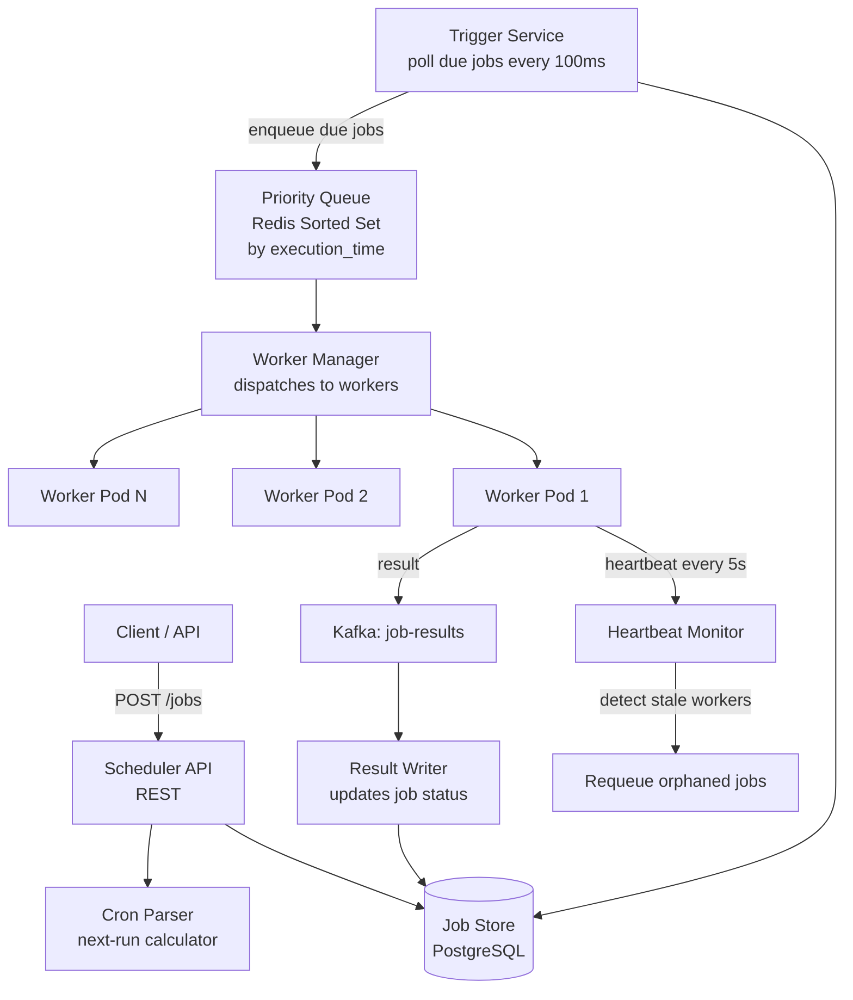
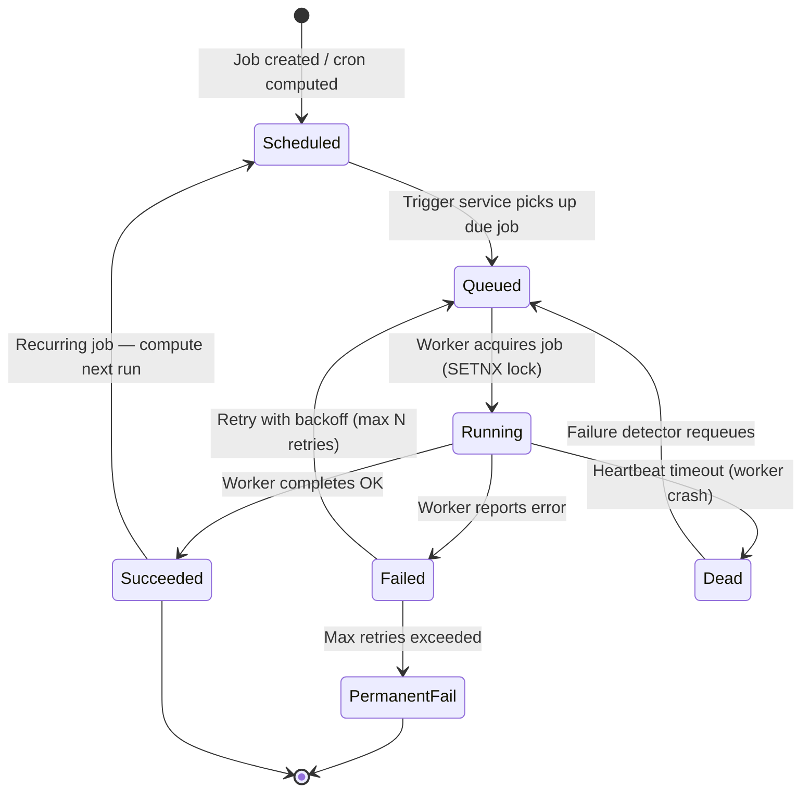
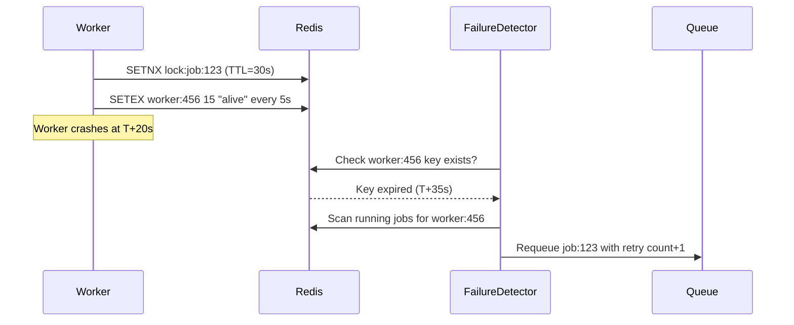
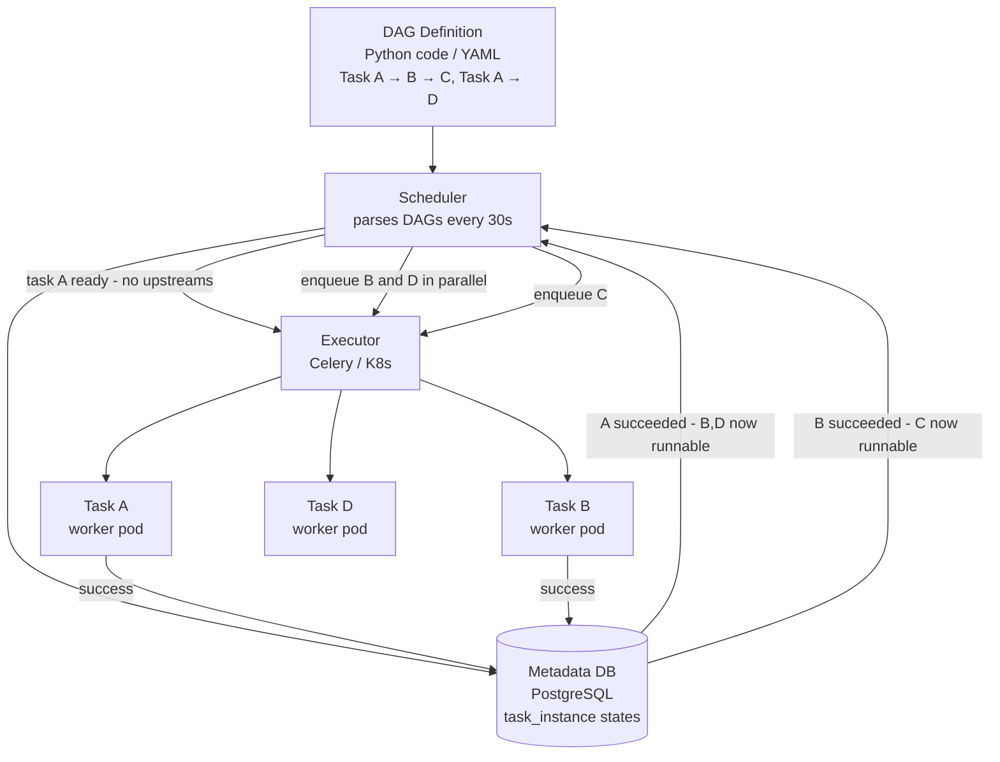
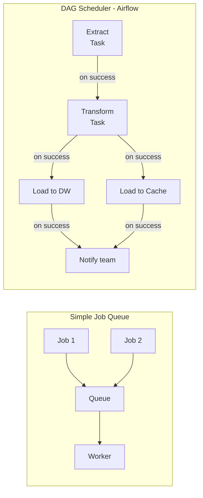

# Design a Distributed Job Scheduler

---

## Q1: Design a distributed job scheduler handling 10M jobs/day with sub-second precision

**Role:** Senior, Backend | **Difficulty:** 🔴 Senior | **Priority:** P0 | **Format:** Scenario
**Real Company:** Airflow — 10K+ DAGs at Airbnb; AWS Step Functions — trillions of executions/year

### The Brief
> "Design a distributed job scheduler that supports one-time and recurring (cron) jobs. The system must handle 10M jobs per day, support up to 1,000 concurrent job executions, trigger jobs with sub-second precision, and retry failed jobs with configurable backoff. Jobs can take anywhere from 100ms to 24 hours."

### Clarifying Questions to Ask First
1. What job types are supported — shell commands, HTTP webhooks, internal function calls?
2. Is exactly-once execution required or is at-least-once acceptable?
3. Do we need job dependencies (job B runs after job A completes)?
4. What is the max job payload size — lightweight tasks or large data processing?

### Back-of-Envelope Estimation
| Metric | Calculation | Result |
|--------|-------------|--------|
| Jobs/day | 10M/day | ~116 jobs/sec average |
| Peak throughput | 10× average | ~1,160 jobs/sec peak |
| Concurrent jobs | 1,000 workers × 1 job each | 1,000 concurrent |
| Job record size | 1KB avg (metadata + payload) | — |
| Storage/day | 10M × 1KB | ~10 GB/day |
| Cron eval/sec | 1M active schedules ÷ 60s | ~17K schedule checks/sec |
| Heartbeat load | 1K workers × 1 heartbeat/5s | 200 heartbeats/sec |

### High-Level Architecture



### Deep Dive: Job State Machine



### Trade-off Decisions
| Decision | Option A | Option B | Chosen | Why |
|----------|----------|----------|--------|-----|
| Queue backend | Redis Sorted Set | Kafka | Redis Sorted Set | O(log N) score-based pop by time; Kafka better for streaming, not time-ordered dispatch |
| Execution guarantee | At-least-once | Exactly-once | At-least-once + idempotency keys | Exactly-once requires distributed 2PC; idempotent jobs tolerate re-execution |
| Trigger polling | DB polling every 100ms | Dedicated trigger daemon | Trigger daemon | DB polling at 1K rps locks rows; daemon batches efficiently |
| Worker model | Pull (workers poll queue) | Push (manager dispatches) | Pull | Workers self-regulate load; prevents overwhelming slow workers |

### Failure Modes
| Failure | Impact | Mitigation |
|---------|--------|------------|
| Worker crash mid-job | Job stuck in Running state forever | Heartbeat TTL 15s; requeue if no heartbeat for 30s |
| Trigger service crash | Jobs not picked up at scheduled time | Trigger is stateless; restart in < 5s; max delay = 5s |
| Clock drift between nodes | Jobs trigger early/late | NTP sync; use wall-clock only for scheduling, not ordering |
| Thundering herd at cron boundary | Thousands of `:00` cron jobs fire simultaneously | Splay scheduled time ±30s with jitter; priority queue prevents overload |

### Concept References
→ [Message Queues](../../../system-design/messaging-and-streaming/kafka-rabbitmq)
→ [Distributed Locking](../../../system-design/distributed-systems/distributed-locking)

---

## Q2: How do you implement priority queues for job scheduling?

**Role:** Mid, Backend | **Difficulty:** 🟡 Mid | **Priority:** P0 | **Format:** Quick Answer

> **What the interviewer is testing:** Whether you understand how to model multi-priority job dispatch using sorted data structures and fair scheduling to prevent starvation.

### Answer in 60 seconds
- **Redis Sorted Set:** `ZADD jobs {priority_score} {job_id}` — score = `(base_time_unix × 1000) - (priority × 10000)` — lower score = higher priority pop
- **3-tier priority:** Critical (P0) = score offset -30000; Normal (P1) = -10000; Bulk (P2) = 0 — P0 always pops first
- **Starvation prevention:** Aging — increment score of waiting P2 jobs by 1000 every 60s; P2 job waiting 30 min gets P1 priority automatically
- **Pop pattern:** Worker calls `ZPOPMIN jobs 1` — atomic, no locking needed; O(log N) per operation; supports 50K pops/sec per Redis node
- **Separate queues by priority:** Alternative — 3 separate queues; workers poll P0 first, then P1 if P0 empty; simpler but less fine-grained

### Diagram

```mermaid
graph LR
  NewJob[New Job\npriority=P0\nrun_at=T+5s] --> ScoreCalc[Score = epoch_ms - priority_offset\n= 1700000005000 - 30000\n= 1699999975000]
  ScoreCalc --> ZADD[ZADD jobs {score} {job_id}]

  Worker[Worker idle] --> ZPOPMIN[ZPOPMIN jobs 1\npops lowest score = highest priority]
  ZPOPMIN --> Acquire[Acquire job\nset lock TTL=30s]
  Acquire --> Execute[Execute job]
```

### Pitfalls
- ❌ **Using a single FIFO queue for all priorities:** Bulk import jobs block critical alerts for minutes; always separate priority lanes
- ❌ **No starvation protection:** P0 jobs arrive continuously → P2 jobs never execute; implement aging or dedicated P2 time windows

### Concept Reference
→ [Message Queues](../../../system-design/messaging-and-streaming/kafka-rabbitmq)

---

## Q3: How do you detect and handle crashed workers?

**Role:** Mid, Backend | **Difficulty:** 🟡 Mid | **Priority:** P0 | **Format:** Quick Answer

> **What the interviewer is testing:** Whether you understand heartbeat-based failure detection and the lease/lock pattern for preventing orphaned jobs.

### Answer in 60 seconds
- **Worker heartbeat:** Every 5s, worker writes `SETEX worker:{id} 15 {timestamp}` — if key expires (no heartbeat for 15s), worker is dead
- **Job lease:** Worker holds Redis lock `lock:job:{id}` with TTL=30s; extends lock every 10s while running; lock auto-expires if worker crashes
- **Failure detector:** Background process scans jobs in `Running` state older than lock TTL (30s) with no heartbeat → marks Dead → requeues
- **At-least-once consequence:** Requeued job may run twice if original worker completed just before crash; require idempotent job execution
- **Airflow approach:** Heartbeat every 10s; scheduler marks tasks as `zombie` after 60s; zombie tasks are killed and restarted

### Diagram



### Pitfalls
- ❌ **Setting lock TTL = job max runtime:** 24h job holds lock 24h; after crash, next worker waits 24h to reclaim; use short TTL (30s) + lock renewal
- ❌ **Not limiting requeue attempts:** Crashed worker requeues → same crash → infinite loop; enforce max retries (e.g., 3) before permanent failure

### Concept Reference
→ [Distributed Locking](../../../system-design/distributed-systems/distributed-locking)

---

## Q4: How do you parse and evaluate cron expressions efficiently at scale?

**Role:** Senior | **Difficulty:** 🔴 Senior | **Priority:** P1 | **Format:** Deep Dive

> **What the interviewer is testing:** Whether you understand how to pre-compute next-run times to avoid evaluating 1M+ cron expressions every second, and the data structures that support efficient time-based lookup.

### Problem Constraints
| Dimension | Value |
|-----------|-------|
| Active schedules | 1M cron jobs |
| Trigger precision | ±1 second |
| Evaluation cost | O(N) scan of 1M schedules = too slow at 1Hz |
| Storage | next_run_at indexed column in PostgreSQL |

### Approach A — Poll DB Every Second

```mermaid
graph LR
  Trigger[Trigger Service\nevery 1 second] --> Query[SELECT * FROM jobs\nWHERE next_run_at <= NOW()\nAND status = scheduled]
  Query --> Enqueue[Enqueue matching jobs]
  Enqueue --> UpdateDB[UPDATE next_run_at\n= next_cron_occurrence]
```

**Problem:** 1M row index scan every second = 1M index reads/sec; PostgreSQL handles ~10K index scans/sec → bottleneck at 10K active schedules.

### Approach B — Pre-computed Next-Run + Indexed Lookup

```mermaid
graph TD
  JobCreate[Job Created\ncron=0 9 * * MON-FRI] --> CronParse[Cron Parser\ncompute next 5 occurrences]
  CronParse --> DB[(jobs table\nnext_run_at = 2026-03-30 09:00:00\nINDEX on next_run_at)]

  Trigger[Trigger Service\npolls every 100ms] --> IndexScan[SELECT id FROM jobs\nWHERE next_run_at BETWEEN NOW()\nAND NOW()+1s\nLIMIT 1000]
  IndexScan -->|found jobs| Enqueue[Enqueue to Redis PQ]
  Enqueue --> UpdateNextRun[Compute next_run_at\nfrom cron expression\nstore in DB]
```

| Dimension | Approach A (Poll every second) | Approach B (Indexed next_run_at) |
|-----------|-------------------------------|----------------------------------|
| DB reads/sec | Full scan = 1M row reads | Index range scan = only due jobs |
| Scale limit | ~10K schedules | 10M+ schedules |
| Complexity | Simple | Medium (cron parser needed) |
| Trigger accuracy | ±1s | ±100ms |
| Updates | None | Update next_run_at after each trigger |

### Recommended Answer
Pre-compute `next_run_at` at job creation (Approach B). B-tree index on `next_run_at` means range scan finds only due jobs — typically < 1,000 out of 1M at any moment. Trigger service polls every 100ms: `WHERE next_run_at BETWEEN NOW() AND NOW() + INTERVAL '200ms'`. After enqueue, compute next occurrence from cron expression and update `next_run_at`. Cron parser (e.g., `cron-parser` library) runs once per job trigger, not per schedule check.

### What a great answer includes
- [ ] Explains index on `next_run_at` as key optimization
- [ ] Notes that DB scan of due jobs is tiny (< 0.01% of total schedules)
- [ ] Describes update of `next_run_at` after each trigger
- [ ] Addresses time zone handling for cron expressions

### Pitfalls
- ❌ **Evaluating all cron expressions every second:** 1M cron expressions × 1Hz = 1M parses/sec; pre-compute next-run time eliminates this entirely
- ❌ **Ignoring daylight saving time:** `0 9 * * *` should fire at 9am local time, not 9am UTC; store schedules with timezone and use `pytz`/`date-fns-tz` for correct next-run calculation

### Concept Reference
→ [Database Indexing](../../../system-design/storage-and-databases/database-indexing)

---

## Q5: How do you deduplicate jobs to prevent double execution?

**Role:** Senior | **Difficulty:** 🔴 Senior | **Priority:** P1 | **Format:** Quick Answer

> **What the interviewer is testing:** Whether you understand deduplication strategies using idempotency keys, database constraints, and distributed locks.

### Answer in 60 seconds
- **Idempotency key:** Each job has `dedup_key = hash(job_name + scheduled_time)`; `UNIQUE(dedup_key)` in DB prevents duplicate inserts for same cron tick
- **Redis SETNX lock:** Worker atomically sets `lock:job:{id}` with SETNX; only one worker acquires; others get NOOP
- **Cron deduplication:** If trigger service crashes and restarts, it might enqueue the 9am job again; `dedup_key = "daily-report:2026-03-26T09:00:00"` → DB rejects duplicate
- **Delivery deduplication window:** Redis key `seen:job:{id}:{scheduled_time}` with TTL = 2× polling interval; second enqueue attempt hits existing key → skip

### Diagram

```mermaid
graph LR
  Trigger[Trigger fires\nfor job: daily-report\nat 09:00:00] --> DedupKey[Compute dedup_key\nhash(daily-report + 09:00:00)]
  DedupKey --> DBInsert[INSERT INTO job_executions\nON CONFLICT(dedup_key) DO NOTHING]
  DBInsert -->|inserted| Enqueue[Enqueue to Redis PQ]
  DBInsert -->|conflict - already exists| Skip[Skip - already scheduled]
  Enqueue --> Worker[Worker acquires\nSETNX lock:job:456]
```

### Pitfalls
- ❌ **Using job ID alone for deduplication:** Same job can have multiple scheduled runs; dedup key must include the scheduled time to distinguish 9am Monday from 9am Tuesday
- ❌ **No dedup on retry path:** Retry enqueue can duplicate if original job re-appears; always check dedup key before enqueue, not just at creation

### Concept Reference
→ [Distributed Locking](../../../system-design/distributed-systems/distributed-locking)

---

## Q6: How does Airflow handle DAG dependencies differently from simple job queues?

**Role:** Staff | **Difficulty:** ⚫ Staff | **Priority:** P2 | **Format:** Deep Dive

> **What the interviewer is testing:** Whether you understand DAG-based job orchestration, task dependency resolution, and how tools like Airflow model workflows vs simple fire-and-forget job queues.

### Problem Constraints
| Dimension | Value |
|-----------|-------|
| DAG complexity | Up to 10K tasks per DAG at Airbnb |
| Task parallelism | Up to 256 parallel tasks per DAG |
| Dependency types | Upstream success, external trigger, time-based |
| Failure handling | Partial re-run from failed task, not full DAG restart |

### Architecture: DAG Execution Model



### Comparison: Simple Queue vs DAG Scheduler



| Dimension | Simple Queue | DAG Scheduler |
|-----------|-------------|---------------|
| Dependencies | None | Arbitrary DAG — any topology |
| Partial re-run | Full re-run from start | Re-run from failed task |
| Visibility | Job status only | Per-task status + lineage |
| Complexity | Low | High |
| Use case | Isolated jobs | Data pipelines, ETL workflows |

### Recommended Answer
Use a DAG scheduler (Airflow, Prefect, Temporal) when tasks have dependencies or need partial re-run. The scheduler maintains a topological sort of the DAG; after each task succeeds, re-evaluates which downstream tasks have all upstreams satisfied → enqueues newly runnable tasks. Task state is persisted in metadata DB — on restart, resume from last known state, not beginning. AWS Step Functions models this as a state machine with transitions.

### What a great answer includes
- [ ] Explains topological sort of DAG for dependency resolution
- [ ] Describes task state persistence in metadata DB for resumability
- [ ] Distinguishes executor from scheduler responsibilities
- [ ] Mentions fan-out parallelism when multiple tasks become runnable simultaneously

### Pitfalls
- ❌ **Running DAG scheduler as single process:** Airflow 1.x scheduler was a single process; at 10K DAGs it became a bottleneck; Airflow 2.x uses HA scheduler with multiple instances + DB row locking for coordination
- ❌ **Storing task results in scheduler metadata DB:** Metadata DB tracks state, not data; large task outputs belong in S3/GCS, not the Postgres metadata DB — XCom abuse causes DB bloat

### Concept Reference
→ [Message Queues](../../../system-design/messaging-and-streaming/kafka-rabbitmq)
→ [Saga / CQRS Patterns](../../../system-design/business-and-advanced/saga-cqrs-patterns)
