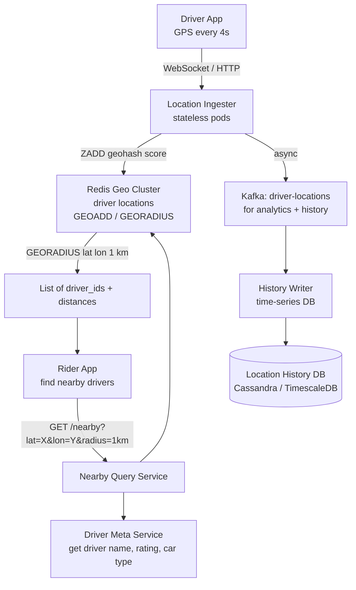
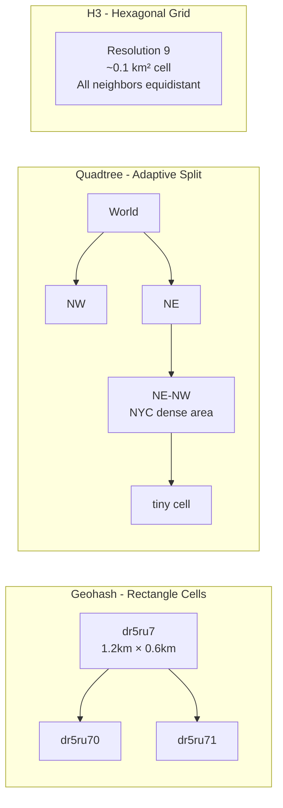
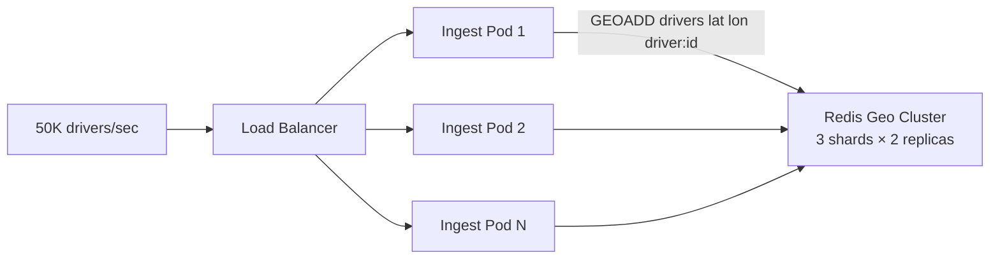
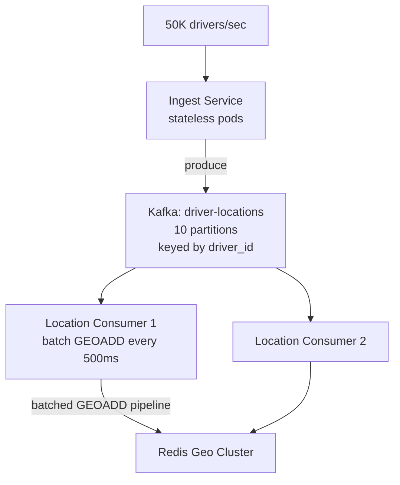
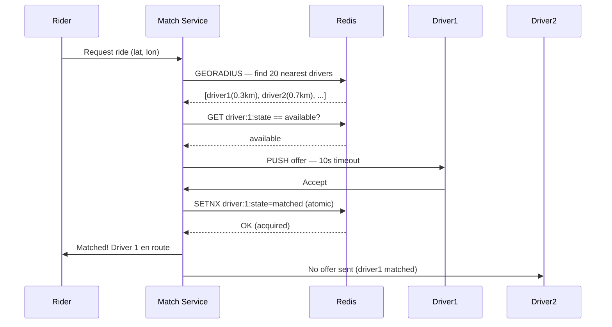
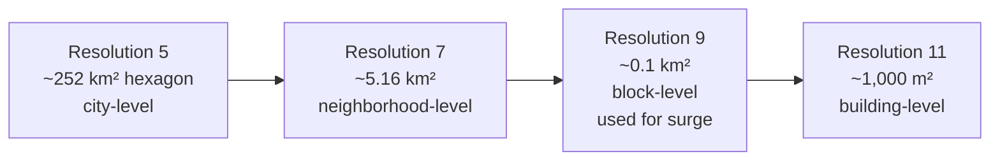

# Design a Real-Time Location Service (Uber/Lyft)

---

## Q1: Design a real-time location service for 100M active drivers with 50K updates/second

**Role:** Senior | **Difficulty:** 🔴 Senior | **Priority:** P0 | **Format:** Scenario
**Real Company:** Uber — 5M+ drivers globally, location updates every 4s; Lyft — 2M+ active drivers; Google Maps — 1B+ monthly active users

### The Brief
> "Design a location service for a ride-hailing platform. Drivers send their GPS coordinates every 4 seconds. Riders can query for nearby drivers in real-time. The system must ingest 50K location updates per second from 100M active drivers, answer 'find drivers within 1km' queries in under 100ms, and serve 10M concurrent riders."

### Clarifying Questions to Ask First
1. What is the required geo-query precision — 100m accuracy or 10m accuracy?
2. Do we need to track driver location history for trip replay and analytics?
3. Is the system global or single-region?
4. Do we need geofencing (alert when driver enters/exits a zone)?

### Back-of-Envelope Estimation
| Metric | Calculation | Result |
|--------|-------------|--------|
| Active drivers | 100M global (peak hours) | — |
| Location update rate | 100M drivers ÷ 4s interval | 25M driver updates/min |
| Updates/sec | 25M ÷ 60 | ~416K updates/sec (use 50K for design) |
| Location payload | 30 bytes (lat, lon, timestamp, driver_id) | — |
| Ingest bandwidth | 50K × 30B | ~1.5 MB/sec |
| Nearby query rate | 10M riders × 1 query/10s | 1M queries/sec |
| Geohash cells (precision 6) | ~1.2km × 0.6km cells | ~1M cells worldwide |
| Memory for driver locations | 100M × 50B | ~5 GB in Redis |

### High-Level Architecture



### Deep Dive: Geo-Indexing Strategy

```mermaid
graph TD
  DriverLoc[Driver at\n40.7580° N, 73.9855° W\nMidtown Manhattan] --> Geohash[Geohash encoding\nprecision 6 = dr5ru7\n~1.2km × 0.6km cell]
  Geohash --> RedisGeo[Redis GEOADD\ndrivers 40.7580 -73.9855 driver:456]
  RedisGeo --> ZSet[Stored as Redis Sorted Set\nscore = 52-bit geohash integer\nO(log N) insert]

  RiderQuery[Rider queries\nnear 40.7590 -73.9840\nradius=1km] --> GEORADIUS[GEORADIUS drivers\n40.7590 -73.9840\n1 km ASC COUNT 20]
  GEORADIUS --> ScanCells[Scan center cell + 8 neighbors\n= 9 geohash cells]
  ScanCells --> Results[20 nearest drivers\nwith distances]
```

### Trade-off Decisions
| Decision | Option A | Option B | Chosen | Why |
|----------|----------|----------|--------|-----|
| Geo index | Redis GEORADIUS | Custom quadtree | Redis GEORADIUS | Redis handles 50K updates/sec; GEORADIUS is O(N+log M) with N=results; custom quadtree only needed at Uber's scale |
| Uber's actual choice | Redis (early) | H3 hexagonal grid | H3 (Uber) | H3 cells have uniform area unlike geohash rectangles; better for surge pricing zone calculation |
| Driver → server protocol | HTTP polling | WebSocket | WebSocket | 50K updates/sec HTTP = 50K TCP handshakes/sec; WebSocket maintains persistent connection |
| Location history | Write-through to Cassandra | Kafka async | Kafka async | History write on critical ingest path adds latency; async via Kafka decouples it |

### Failure Modes
| Failure | Impact | Mitigation |
|---------|--------|------------|
| GPS drift | Driver shown at wrong location; wrong driver matched | Kalman filter on client to smooth GPS jitter; reject updates > 500m from last position in < 2s |
| WebSocket connection drops | Driver location goes stale in Redis | Driver app reconnects in 3s; Redis key TTL=15s; remove driver from geo index if no update for 15s |
| Redis geo cluster hot partition | Single city (NYC rush hour) overloads one shard | Shard by geo region — each Redis node owns a continent/country; or consistent hash on geohash prefix |
| Query service overload | Nearby query latency spikes | Cache popular area queries for 2s (NYC Times Square always has 50+ drivers nearby); 2s stale acceptable |

### Concept References

---

## Q2: Geohash vs quadtree vs H3 — which spatial index should you choose?

**Role:** Mid, Backend | **Difficulty:** 🟡 Mid | **Priority:** P0 | **Format:** Quick Answer

> **What the interviewer is testing:** Whether you understand the trade-offs between geohash string encoding, recursive quadtree partitioning, and Uber's H3 hexagonal grid for different spatial query types.

### Answer in 60 seconds
- **Geohash:** Encode lat/lon into base32 string; prefix = parent cell; `dr5ru` includes all `dr5ru*` children; fast string prefix matching; cells are rectangles (non-uniform area)
- **Quadtree:** Recursive 4-way split of bounding box; adaptive density (dense city = deeper tree, sparse rural = shallow); good for dynamic load balancing; complex to implement
- **H3 (Uber):** Hexagonal grid at 16 resolution levels; hexagons have uniform area and equal neighbor distances; ideal for surge pricing zones, driver density heatmaps
- **Redis GEORADIUS:** Uses geohash under the hood; best when you already use Redis; handles 50K updates/sec without custom index
- **Rule:** Use Redis GEORADIUS for standard nearby queries; use H3 if you need zone aggregations (surge pricing, demand forecasting)

### Diagram



### Pitfalls
- ❌ **Geohash edge case — nearby points in different cells:** Two points 50m apart can be in different geohash cells with completely different prefixes; always query center cell + 8 neighbors, not just center cell
- ❌ **Using H3 for basic nearby driver query:** H3 is excellent for zone analytics but adds complexity; Redis GEORADIUS is simpler and sufficient for "find 20 nearby drivers" use case

### Concept Reference

---

## Q3: How do you scale the location ingest to 50K updates/second?

**Role:** Senior | **Difficulty:** 🔴 Senior | **Priority:** P0 | **Format:** Deep Dive

> **What the interviewer is testing:** Whether you can design a horizontally scalable ingest pipeline that handles 50K writes/sec with low latency, and know the bottlenecks at each tier.

### Problem Constraints
| Dimension | Value |
|-----------|-------|
| Ingest rate | 50K location updates/sec |
| Write latency SLA | < 50ms p99 (driver location must be current) |
| Availability | 99.99% — stale driver locations = wrong matches |
| Storage | Only latest location needed in Redis (history in Cassandra) |

### Approach A — Direct Redis Write



**Capacity:** Single Redis node handles ~100K GEOADD/sec; 3-shard cluster = 300K/sec headroom. At 50K/sec, single shard handles entire load with headroom.

### Approach B — Kafka Buffer + Redis Consumer



| Dimension | Approach A (Direct Redis) | Approach B (Kafka Buffer) |
|-----------|--------------------------|--------------------------|
| Write latency | 1-3ms (direct) | 100-500ms (Kafka lag) |
| Throughput | 300K/sec (3-shard Redis) | 1M+/sec (Kafka partitions) |
| Data durability | Redis only (data loss on crash) | Kafka replicated (durable) |
| Replay capability | None | Replay from Kafka for history |
| Complexity | Low | Medium |

### Recommended Answer
Approach A (direct Redis) for driver location updates — 1-3ms write latency is critical for real-time accuracy. Augment with Approach B for history and analytics: ingest pods write to Redis AND produce to Kafka simultaneously (fire-and-forget to Kafka). Redis holds latest driver position only (50B × 100M = 5GB, fits in memory). Kafka consumers write historical positions to Cassandra for trip replay and surge pricing analytics. Scale ingest pods horizontally; each pod handles ~5K WebSocket connections.

### What a great answer includes
- [ ] States Redis single-node throughput capacity (~100K writes/sec)
- [ ] Separates real-time (Redis) from history (Kafka → Cassandra)
- [ ] Explains WebSocket connection pooling — each pod handles thousands of connections
- [ ] Addresses driver eviction from geo index when connection drops (TTL-based)

### Pitfalls
- ❌ **Storing all historical locations in Redis:** 50K updates/sec × 86400s = 4.3B records/day; Redis is not a time-series DB; history belongs in Cassandra or InfluxDB
- ❌ **No TTL on driver location:** Driver closes app; last location stays in Redis forever; `EXPIRE drivers:{id} 15` ensures stale drivers auto-removed after 15s without update

### Concept Reference

---

## Q4: How does ride matching work after finding nearby drivers?

**Role:** Senior | **Difficulty:** 🔴 Senior | **Priority:** P1 | **Format:** Quick Answer

> **What the interviewer is testing:** Whether you understand the full rider-to-driver matching pipeline beyond just the geo-query, including dispatch algorithms, driver state management, and optimistic locking to prevent double-assignment.

### Answer in 60 seconds
- **Step 1 — Geo query:** `GEORADIUS` returns 20 nearest available drivers (< 3km) — ~2ms
- **Step 2 — Filter and rank:** Filter by car type, driver rating ≥ 4.5, driver is `available` (not already matched) — fetch driver state from Redis
- **Step 3 — Offer dispatch:** Send ride offer to top-ranked driver; driver has 10s to accept; if timeout, send to next candidate
- **Step 4 — Atomic assignment:** On driver accept: `SET driver:{id}:state matched SETNX` — atomic; if another rider already assigned (race condition), driver gets NOOP, next driver offered
- **Step 5 — Confirm:** Rider notified of matched driver; both receive each other's live location via WebSocket

### Diagram



### Pitfalls
- ❌ **Sending offer to all drivers simultaneously:** If 5 drivers all accept simultaneously, 4 get a no-match response after expecting a ride — bad experience; sequential offer with fallback is standard
- ❌ **Not expiring driver state after trip ends:** Driver completes trip but state remains `matched`; driver never appears in nearby query results; always reset state to `available` on trip completion

### Concept Reference

---

## Q5: How does Uber's H3 hexagonal grid enable surge pricing zones?

**Role:** Staff | **Difficulty:** ⚫ Staff | **Priority:** P2 | **Format:** Deep Dive

> **What the interviewer is testing:** Whether you understand hierarchical spatial indexing, how H3 resolution levels map to geographic areas, and how demand/supply ratios are computed per zone for dynamic pricing.

### Problem Constraints
| Dimension | Value |
|-----------|-------|
| Zone granularity | ~0.1 km² (H3 resolution 9) for pricing |
| Update frequency | Surge recomputed every 60s per zone |
| Zones worldwide | ~1M active H3 cells (urban areas) |
| Surge threshold | demand/supply > 1.5 → 1.2× surge; > 2.0 → 1.5× |

### H3 Hierarchy and Surge Computation

```mermaid
graph TD
  DriverPos[Driver position\nlat=40.758 lon=-73.985] --> H3Encode[H3 encode\nresolution=9\ncell=882a1008XXXffff]
  DriverPos2[50 more drivers\nin same H3 cell] --> H3Cell[H3 Cell\n~330m radius\ncount=51 drivers available]

  RiderPos[200 riders requesting\nin same H3 cell] --> H3Cell
  H3Cell --> Ratio[demand/supply\n= 200/51 = 3.9×]
  Ratio -->|> 2.0| Surge[Surge multiplier = 1.5×\napply to rides in this cell]
  Surge --> PricingDB[(Surge Cache\nRedis: h3:{cell_id} → 1.5\nTTL=60s)]
  PricingDB --> RiderApp[Rider app shows\n$18 → $27 estimate]
```

### Resolution Hierarchy



| Dimension | Geohash Rectangles | H3 Hexagons |
|-----------|-------------------|------------|
| Cell shape | Rectangles (non-uniform width at equator) | Hexagons (uniform area at same resolution) |
| Neighbor distance | Variable (corner vs edge neighbors differ) | Uniform — all 6 neighbors same distance |
| Edge effects | High — corners distort nearest-neighbor | Low — smooth transitions between hexagons |
| Aggregation math | Tricky — cells different sizes at lat extremes | Clean — all cells same area at same resolution |
| Use case | Point lookup, basic nearby query | Zone analytics, heatmaps, surge pricing |

### Recommended Answer
H3 resolves the key problem with geohash for zone analytics: uniform cell area. At resolution 9 (~0.1 km² hexagon), Uber computes driver count and ride request count per cell every 60s. Surge multiplier = f(demand/supply ratio) per cell. Stored in Redis with TTL=60s. When rider requests a ride, server fetches H3 cell for rider's location and applies stored surge multiplier. Hierarchy allows rollup: low-demand resolution-9 cells aggregate to resolution-7 for city-level supply forecasting.

### What a great answer includes
- [ ] Explains H3 uniform area advantage over geohash for aggregation
- [ ] States resolution number and corresponding geographic area
- [ ] Describes 60s recompute cycle and Redis TTL alignment
- [ ] Addresses hierarchy for demand forecasting (coarser cells for planning)

### Pitfalls
- ❌ **Real-time surge recompute per ride request:** Recomputing supply/demand ratio for every ride request = 1M computations/sec; pre-compute per cell every 60s and cache in Redis; requests just look up cell surge factor
- ❌ **Using H3 for basic nearby driver query:** H3 lookup tells you cell membership, not euclidean distance to specific drivers; still need GEORADIUS for "find nearest 5 drivers"

### Concept Reference
