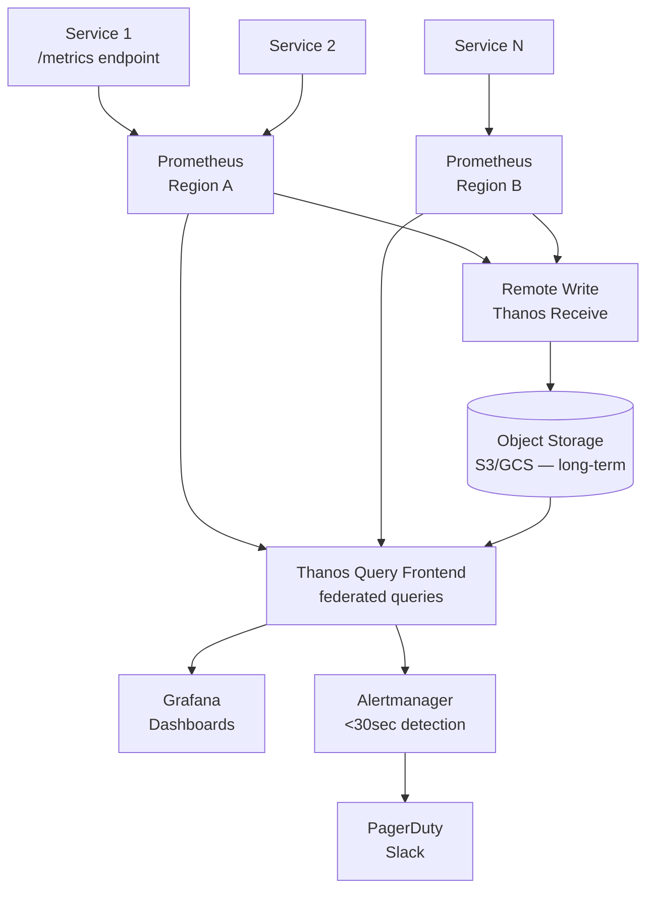
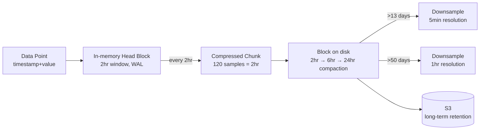
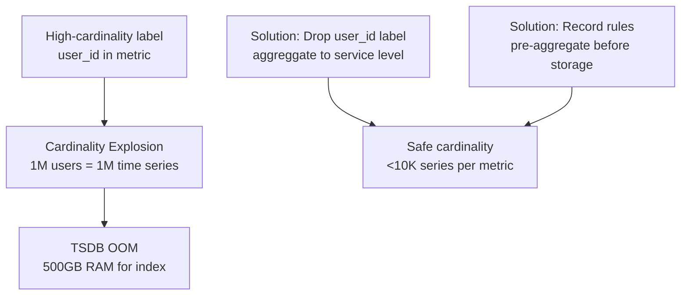

# Design a Metrics & Monitoring System

---

## Q1: Design a metrics and monitoring system for 1,000 microservices

**Role:** Senior, SRE, DevOps | **Difficulty:** 🔴 Senior | **Priority:** P0 | **Format:** Scenario
**Real Company:** Datadog, Prometheus, AWS CloudWatch, Google Monarch

### The Brief
> "Design a metrics collection and monitoring system for 1,000 microservices emitting 1M data points per minute. The system must support real-time dashboards with <1 min metric freshness, alerting with <30 sec detection latency, 13 months data retention with 1-second granularity for recent data and 1-minute for older data."

### Clarifying Questions to Ask First
1. Pull model (Prometheus scrapes) or push model (services push metrics)?
2. What metric types are needed? (counters, gauges, histograms)
3. What is the cardinality limit? (labels/tags per metric)
4. Multi-region or single region? (affects federation strategy)

### Back-of-Envelope Estimation
| Metric | Calculation | Result |
|--------|-------------|--------|
| Services | 1,000 services | — |
| Metrics per service | 1,000 time series | 1M total time series |
| Scrape interval | 15 seconds | 4 scrapes/min |
| Data points/min | 1M × 4 | 4M data points/min |
| Storage per point | 16 bytes (timestamp + value) | — |
| Raw storage/day | 4M × 1440min × 16B | ~92 GB/day |
| 13-month retention | 92GB × 400 days (after downsampling) | ~5 TB total |

### High-Level Architecture

### Deep Dive: TSDB Storage Model

### Cardinality Problem

### Trade-off Decisions
| Decision | Option A | Option B | Chosen | Why |
|----------|----------|----------|--------|-----|
| Collection model | Push (StatsD) | Pull (Prometheus) | Pull | Self-healing; Prometheus discovers dead services |
| Long-term storage | Prometheus local | Thanos + S3 | Thanos + S3 | Unlimited retention; multi-region federation |
| Downsampling | Manual | Automatic (Thanos) | Automatic | Reduce 1-second data to 5-min after 2 weeks |
| Alert evaluation | Per-Prometheus | Centralized | Per-Prometheus | Reduces single point of failure; each Prometheus evaluates its own rules |

### Failure Modes
| Failure | Impact | Mitigation |
|---------|--------|------------|
| Prometheus OOM | All metrics from that cluster lost | Shard by team/namespace; limit series per Prometheus to 2M |
| Cardinality explosion | Ingestion stops, OOM | Hard limit labels; reject metrics >10K unique label combinations |
| Alert flap | Alert fires/resolves every 30sec | Add `for: 5m` to alert rules — must be failing for 5min before firing |
| TSDB compaction delay | Query slowdown | Monitor compaction lag; dedicate separate goroutines |

### What a great answer includes
- [ ] Push vs pull trade-off (pull = self-healing discovery, push = works through firewalls)
- [ ] TSDB storage model: WAL + chunks + blocks + compaction
- [ ] Cardinality problem and why high-cardinality labels (user_id, request_id) kill Prometheus
- [ ] Thanos or Cortex for long-term storage (not just local Prometheus disk)
- [ ] Downsampling strategy for cost-efficient retention

### Real Company Notes
| Company | Scale | Approach |
|---------|-------|----------|
| Google | 1B+ time series | Monarch — purpose-built TSDB with zone-level sharding |
| Datadog | 10T data points/day | Custom TSDB with zstd compression, 5-byte avg per point |
| Netflix | 3B metrics/day | Atlas TSDB — heap-memory optimized, 6-hour retention hot tier |
