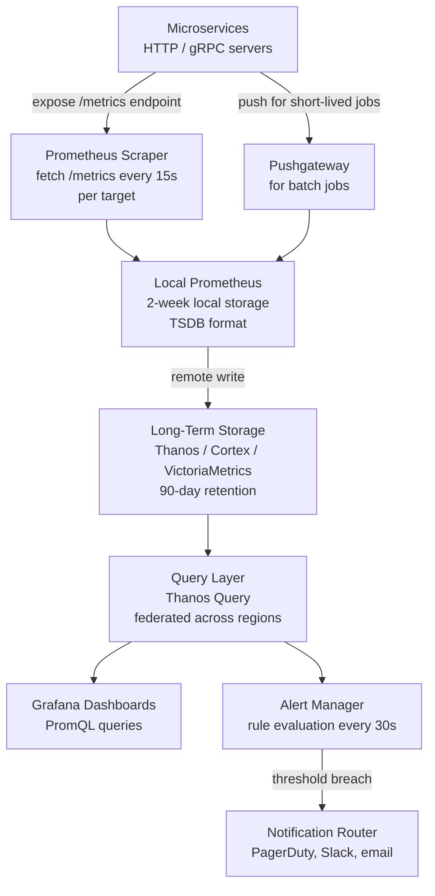
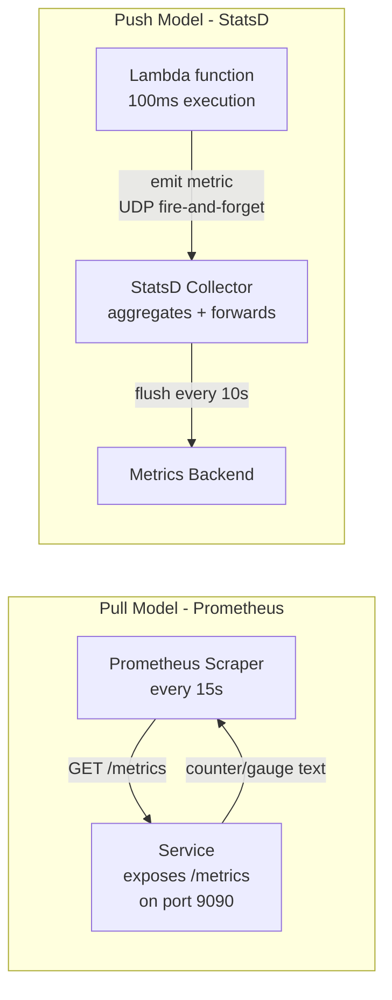
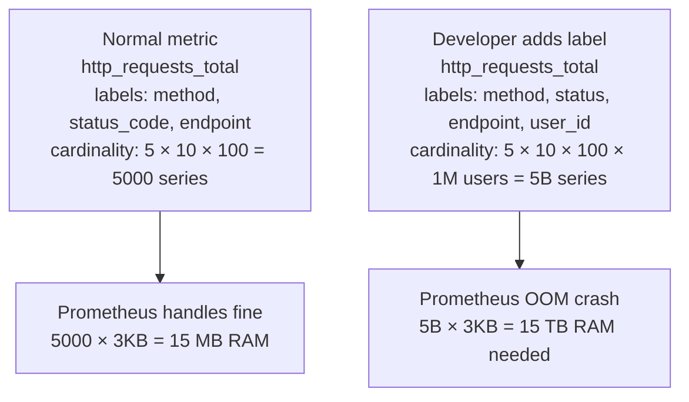
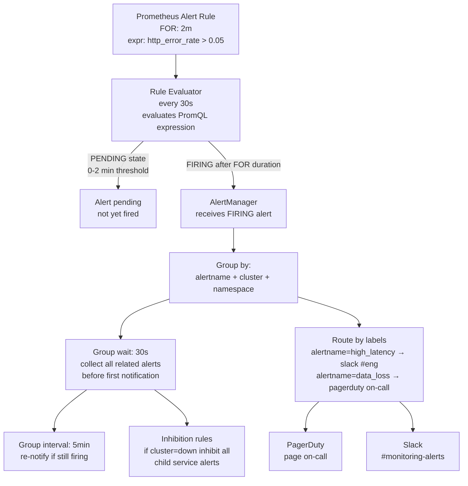
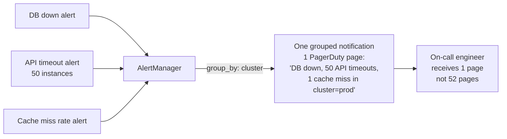
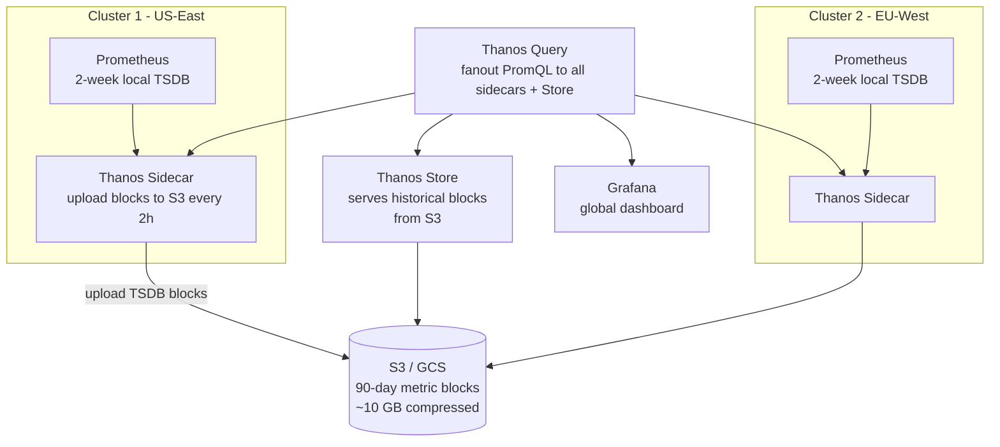
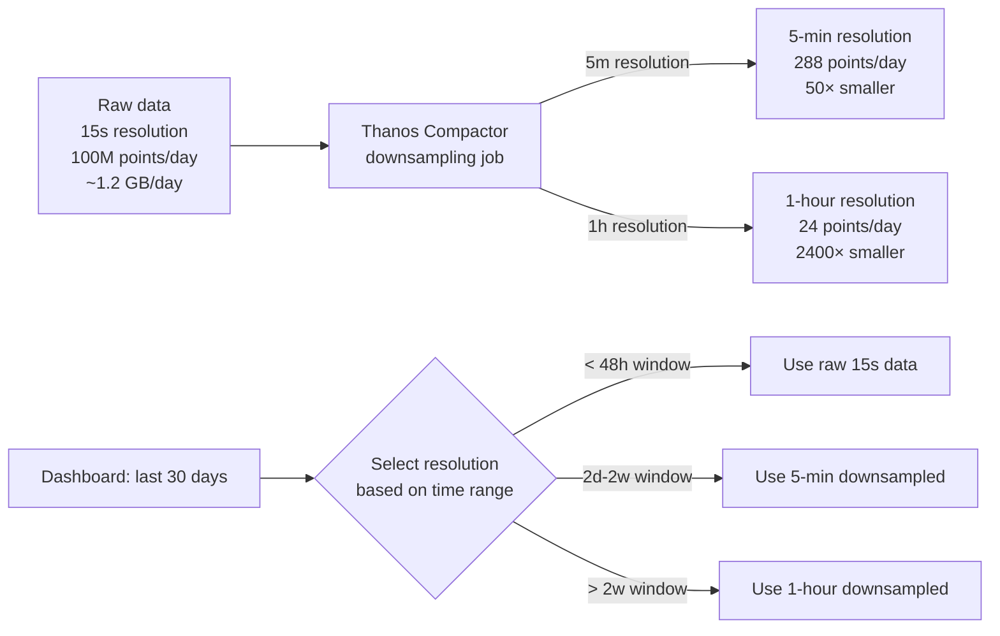

# Design a Metrics & Monitoring System

---

## Q1: Design a metrics and monitoring system for 1M time series with 100M data points/day

**Role:** Senior | **Difficulty:** 🔴 Senior | **Priority:** P0 | **Format:** Scenario
**Real Company:** Datadog — 100B+ metrics/day, 15K+ customers; Prometheus + Thanos at Airbnb — 10M+ time series; Cloudwatch at AWS — millions of metrics per second

### The Brief
> "Design a metrics and monitoring system. Services emit metrics (counters, gauges, histograms) that must be ingested, stored, queried, and alerted on. The system must handle 1 million distinct time series, ingest 100 million data points per day, make metrics queryable within 1 minute of collection, and fire alerts within 30 seconds of a threshold breach. Support dashboards and 90-day metric retention."

### Clarifying Questions to Ask First
1. Push model (services send metrics to us) or pull model (we scrape services on a schedule)?
2. Do we need distributed tracing and logs, or just metrics?
3. What aggregation functions are required — sum, avg, percentiles (p99)?
4. How many alerts and how complex are the alerting rules?

### Back-of-Envelope Estimation
| Metric | Calculation | Result |
|--------|-------------|--------|
| Data points/sec | 100M ÷ 86400 | ~1,160 data points/sec |
| Time series | 1M unique series | — |
| Scrape interval | Every 15s (Prometheus default) | — |
| Bytes per data point | 12 bytes (timestamp 8B + value 4B) | — |
| Raw storage/day | 100M × 12B | ~1.2 GB/day |
| Raw storage/90 days | 1.2 GB × 90 | ~108 GB (before compression) |
| After compression | 108 GB ÷ 10× (Gorilla encoding) | ~10 GB |
| Cardinality check | 1M series × 10 labels × 20 chars | ~200 MB in-memory index |
| Alert evaluations | 1000 alert rules × every 30s | ~33 rule evaluations/sec |

### High-Level Architecture



### Deep Dive: TSDB Storage Format (Gorilla Encoding)

```mermaid
graph TD
  DataPoint[Data point\ntimestamp=1711448400\nvalue=123.45] --> DeltaEncoding[Delta of delta\ntimestamp compression\nfirst delta: 60s\nsecond delta: 0s (= just 1 bit)]
  DeltaEncoding --> XOREncoding[XOR encoding for values\n123.45 XOR 123.46 = small diff\nencode only differing bits]
  XOREncoding --> Compressed[Compressed chunk\n~12 bytes/point → ~1.2 bytes/point\n10× compression ratio]
  Compressed --> Block[TSDB Block\n2-hour time range\nchunk files + index]
  Block --> WAL[Write-Ahead Log\ndurability for in-memory data]
```

### Trade-off Decisions
| Decision | Option A | Option B | Chosen | Why |
|----------|----------|----------|--------|-----|
| Collection model | Pull (Prometheus scrape) | Push (StatsD, Telegraf) | Pull (primarily) | Pull allows central config of scrape targets; easier service discovery; push for short-lived jobs (Pushgateway) |
| Long-term storage | Prometheus TSDB only | Thanos / Cortex | Thanos | Prometheus TSDB limited to 2-week local retention; Thanos adds S3-backed long-term storage and multi-cluster query |
| Alerting | Prometheus AlertManager | External alerting engine | AlertManager | Tight integration with Prometheus rules; supports inhibition, grouping, dedup |
| Cardinality control | No limit | Label allowlist + quota | Label allowlist | Cardinality explosion is most common Prometheus failure mode (see failure modes) |

### Failure Modes
| Failure | Impact | Mitigation |
|---------|--------|------------|
| Cardinality explosion | 1M series explode to 100M due to high-cardinality labels (user_id, request_id) | Label allowlist: only pre-approved label names; reject series with > 1000 unique label values per metric name |
| Alert storm | Single DB failure causes 500 alerts in 30s — on-call is flooded | Alert grouping (AlertManager groups related alerts); inhibition rules (if host down, suppress child service alerts) |
| Prometheus OOM | 1M series × in-memory head block = ~3 GB; spikes to 6 GB during compaction | Horizontal sharding by service group; Prometheus 2.x federation for cross-shard queries |
| TSDB out-of-order writes | Stale data arriving late breaks Prometheus's append-only TSDB | Prometheus 2.39+ supports out-of-order ingestion (10min window); Thanos with out-of-order receive |

### Concept References

---

## Q2: Pull model vs push model for metrics collection — which do you choose?

**Role:** Mid | **Difficulty:** 🟡 Mid | **Priority:** P0 | **Format:** Quick Answer

> **What the interviewer is testing:** Whether you can articulate the trade-offs between Prometheus-style pull and Datadog/StatsD-style push, and know when to use each.

### Answer in 60 seconds
- **Pull model (Prometheus):** Scraper fetches `/metrics` endpoint from each service on schedule (every 15s); service doesn't need to know about monitoring; scraper has complete list of targets; ideal for long-running services
- **Push model (StatsD/Telegraf):** Service emits metrics to a collector; works for ephemeral tasks (Lambda functions, batch jobs); lower latency (push immediately on event vs wait for next scrape)
- **Pull advantages:** Central config; scraper knows if service is down (scrape fails → alert); no firewall rules needed for scraper; Kubernetes service discovery built-in
- **Push advantages:** Works for serverless/batch (no persistent HTTP endpoint); lower latency for event-driven metrics; no need to expose metrics port publicly
- **Recommended:** Prometheus pull for microservices + Pushgateway for batch jobs; Datadog agent (push) in environments where pull is impractical

### Diagram



### Pitfalls
- ❌ **Pull model for serverless/Lambda:** Lambda lives for 100ms; Prometheus scrapes every 15s — function is gone before scrape arrives; use push (Embedded Lambda Extension or Pushgateway)
- ❌ **Push model without backpressure:** Service emits 100K metrics/sec during incident; push floods collector; pull model naturally rate-limits to scrape frequency

### Concept Reference

---

## Q3: What is cardinality explosion and how do you prevent it?

**Role:** Senior | **Difficulty:** 🔴 Senior | **Priority:** P0 | **Format:** Deep Dive

> **What the interviewer is testing:** Whether you understand why high-cardinality labels (user_id, request_id, URL) cause memory exhaustion in TSDBs like Prometheus, and what architectural controls prevent it.

### Problem Constraints
| Dimension | Value |
|-----------|-------|
| Normal cardinality | 1M time series (1K metrics × 1K label combos each) |
| Cardinality explosion | One developer adds `user_id` label → 10M users × 1K metrics = 10B series |
| Prometheus head memory | ~3 KB per active series → 10B × 3KB = 30 TB RAM required |
| Time to OOM | Minutes — Prometheus crashes, metrics unavailable, alerts stop |

### How Cardinality Explosion Happens



### Prevention Architecture

```mermaid
graph TD
  ServiceCode[Service emitting metrics\nwith user_id label] --> Proxy[Metrics Proxy / Relay\nVictoriaMetrics vmagent\nor Prometheus relabeling]
  Proxy --> CardinalityCheck{Label allowlist\nuser_id allowed?}
  CardinalityCheck -->|not in allowlist| StripLabel[Strip user_id label\nor drop metric entirely]
  CardinalityCheck -->|allowed| ForwardMetric[Forward to Prometheus]

  Proxy --> CardinalityAlert{Series count\nfor this metric > 10K?}
  CardinalityAlert -->|yes| FireAlert[Alert to team\ncardinality spike detected]

  CardinalityDashboard[Cardinality Dashboard\nPrometheus: topk(10, count by (metric_name) ({}))\nshow top 10 highest cardinality metrics] --> TeamReview[Engineering review\nweekly cardinality audit]
```

| Control | Mechanism | Catch Rate |
|---------|-----------|------------|
| Label allowlist | Only pre-approved label names forwarded | Prevents all new high-cardinality labels |
| Per-metric series quota | Alert if `count by (metric_name)` > 10K | Catches existing labels going viral |
| Scrape config relabeling | Drop labels matching `user_id|request_id|trace_id` regex | Fast regex at scrape time |
| Sampling | Record 1% of high-cardinality events | Reduces cardinality 100× at cost of accuracy |

### Recommended Answer
Three-layer prevention: (1) Label allowlist in scrape config — relabeling rules strip any label not in the approved set (`user_id`, `request_id`, `trace_id` are always forbidden). (2) Per-metric cardinality quota — VictoriaMetrics and Datadog both allow configuring max unique label combinations per metric; exceeded = drop or aggregate. (3) Cardinality monitoring dashboard — weekly review of top-10 highest-cardinality metrics; spike alert if any metric grows > 50% in 24h. This is the #1 production incident type for Prometheus users.

### What a great answer includes
- [ ] Explains why high-cardinality labels are catastrophic (memory per series × series count)
- [ ] Identifies user_id, request_id, trace_id as the classic dangerous labels
- [ ] Describes label allowlist as prevention at scrape time
- [ ] Mentions monitoring the monitors — cardinality alerting on the metrics system itself

### Pitfalls
- ❌ **Alerting on cardinality only after OOM:** By the time Prometheus OOM crashes, scraping has already stopped; cardinality alerts must fire at 10K series, not 100M
- ❌ **Using unique identifiers (URLs, UUIDs) as label values:** Every unique URL or UUID creates a new series; label values must be bounded (e.g., endpoint labels should be route patterns like `/users/{id}`, not full URLs like `/users/789`)

### Concept Reference

---

## Q4: How do you design an alerting pipeline that fires within 30 seconds?

**Role:** Senior | **Difficulty:** 🔴 Senior | **Priority:** P1 | **Format:** Deep Dive

> **What the interviewer is testing:** Whether you understand alert evaluation cycles, alert deduplication, grouping, routing, and the operational challenges of alert storms.

### Problem Constraints
| Dimension | Value |
|-----------|-------|
| Alert rules | 1,000 rules |
| Evaluation frequency | Every 30s |
| Alert storm scenario | DB failure → 500 alerts fire simultaneously |
| On-call tolerance | Max 10 pages per incident |

### Alert Pipeline Architecture



### Alert Deduplication and Grouping



| Dimension | No Grouping | Grouping + Inhibition |
|-----------|------------|----------------------|
| Alerts fired (DB incident) | 500 individual pages | 1 grouped page |
| Time to acknowledge | Hard — buried in noise | Fast — clear root cause |
| False pages | Many child alerts | Suppressed by inhibition |
| Missing alerts | None | Risk: legitimate alerts inhibited by cascade |

### Recommended Answer
Two-stage alerting: (1) Prometheus evaluates rules every 30s; `FOR: 2m` clause prevents flapping — alert must fire continuously for 2 minutes before routing to AlertManager (prevents brief spikes from waking on-call). (2) AlertManager groups alerts by `{alertname, cluster}` with 30s group wait — batch all related alerts in one notification. Inhibition rule: if `cluster=down` is firing, suppress all `instance=*` alerts from the same cluster — one page for the root cause, not 50 pages for symptoms. Route critical alerts (data loss, SLO breach) to PagerDuty (calls phone); warning alerts to Slack.

### What a great answer includes
- [ ] FOR clause duration to prevent flapping false positives
- [ ] AlertManager grouping and group_wait batch window
- [ ] Inhibition rules for parent-child alert relationships
- [ ] Routing by severity (PagerDuty vs Slack vs email)

### Pitfalls
- ❌ **No `FOR` clause on alert rules:** Without FOR, every 30s evaluation that briefly crosses threshold fires an alert; flapping service causes dozens of pages per hour; always add `FOR: 2m` minimum
- ❌ **Alerting on raw metric values instead of rates:** `http_errors_total > 100` fires when counter reaches 100, then never again (counters only go up); alert on `rate(http_errors_total[5m]) > 1` — errors per second

### Concept Reference

---

## Q5: How does Thanos extend Prometheus for long-term storage and global queries?

**Role:** Staff | **Difficulty:** ⚫ Staff | **Priority:** P2 | **Format:** Deep Dive

> **What the interviewer is testing:** Whether you understand Prometheus's scalability limitations (single-node, 2-week default retention) and how Thanos addresses them with S3-backed long-term storage, sidecar architecture, and global query federation.

### Problem Constraints
| Dimension | Value |
|-----------|-------|
| Retention requirement | 90 days |
| Prometheus local limit | 2-week default (local disk) |
| Multi-cluster | 10 Kubernetes clusters, each with own Prometheus |
| Global query | Dashboard must query across all clusters in one PromQL |

### Thanos Architecture



### Downsampling for Long-Term Query Performance



| Dimension | Prometheus Only | Prometheus + Thanos |
|-----------|----------------|---------------------|
| Retention | 2 weeks (local disk) | 90 days (S3) |
| Global query | No — single cluster | Yes — fan out across clusters |
| Storage cost | Local SSD (expensive) | S3 (cheap, ~$0.023/GB-month) |
| Query latency (30 days) | N/A — data not retained | 500ms–5s (S3 block scan) |
| Complexity | Low | Medium |

### Recommended Answer
Thanos Sidecar runs alongside each Prometheus, uploading immutable 2-hour TSDB blocks to S3 every 2 hours. Thanos Store serves historical blocks from S3 directly (not cached in RAM — uses disk cache). Thanos Query fans out PromQL to all sidecars (recent data) and Thanos Store (historical) simultaneously, deduplicates results (same metric from two Prometheus instances in same cluster), and returns merged response to Grafana. Thanos Compactor continuously downsamples old blocks: raw (15s) → 5-min → 1-hour, reducing S3 storage 50-2400× for old data. Total 90-day storage for 1M series: ~10 GB compressed (Gorilla) vs ~108 GB uncompressed.

### What a great answer includes
- [ ] Explains Thanos Sidecar as S3 upload agent alongside Prometheus
- [ ] Global fan-out query with deduplication
- [ ] Downsampling for long-term query performance
- [ ] States cost difference: local SSD vs S3 for 90-day retention

### Pitfalls
- ❌ **Querying S3 directly for recent metrics:** S3 block scan takes 1-5s per query; real-time dashboards need sub-second response; recent data (< 2h) must come from Prometheus local TSDB via sidecar, not S3
- ❌ **No downsampling:** 90 days × 100M points/day × 12B = 108 GB raw; querying "average latency over last 90 days" scans 108 GB from S3; with 1-hour downsampling, same query scans 216 KB — 500,000× faster

### Concept Reference
