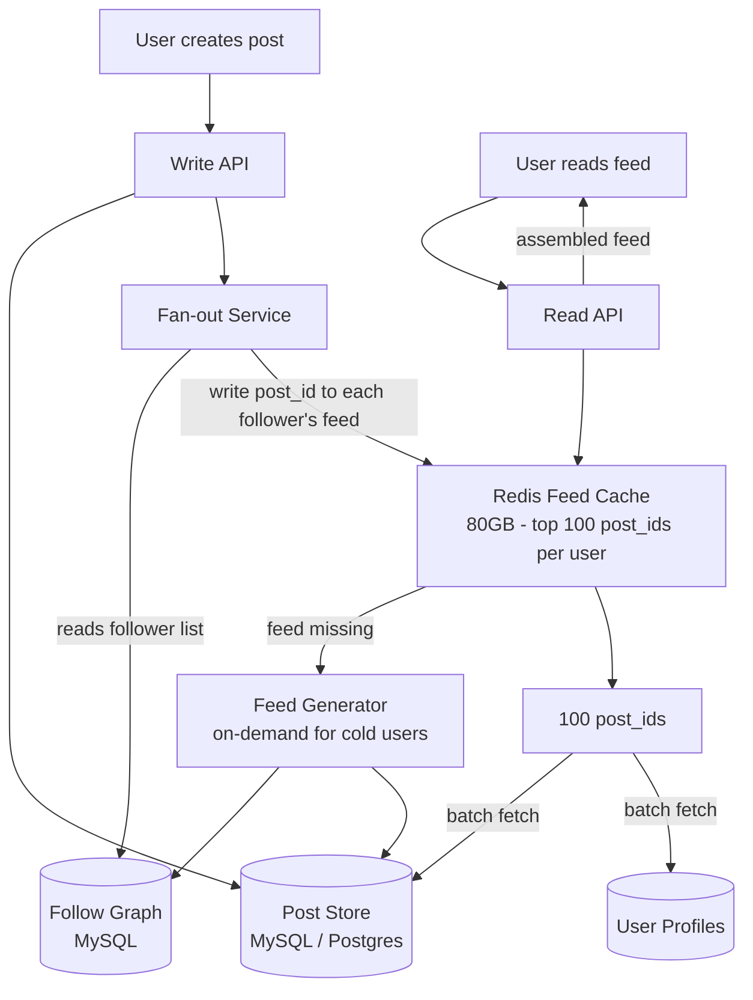
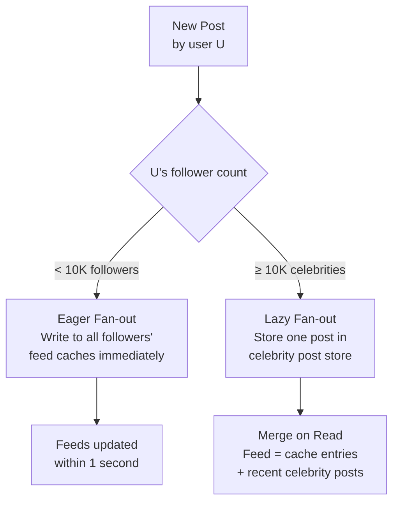
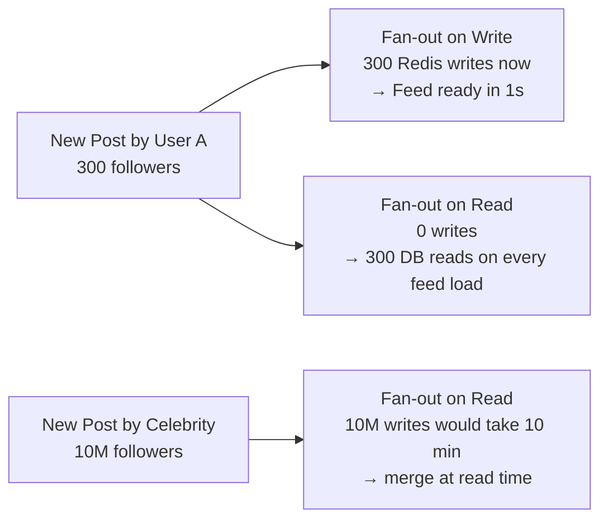
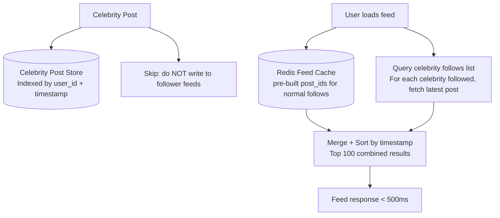
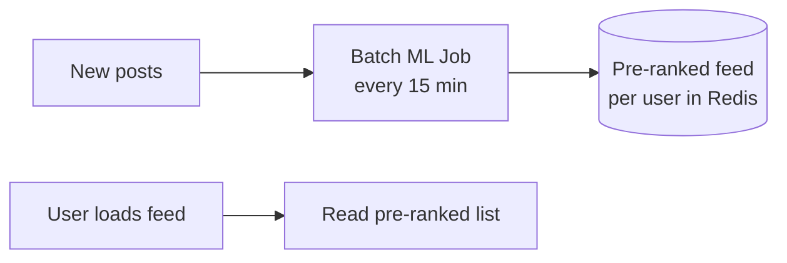
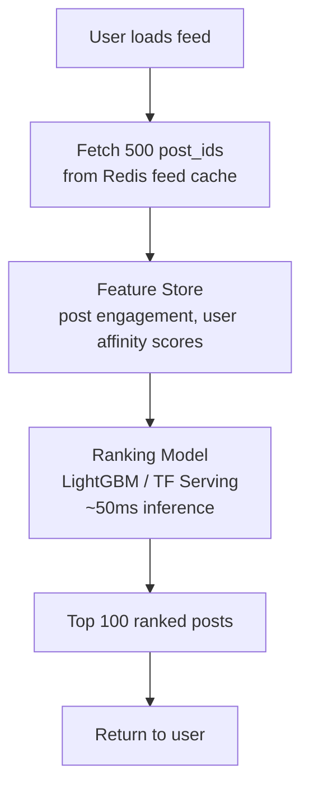
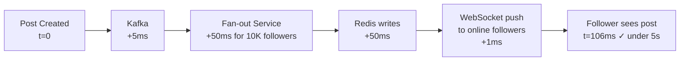
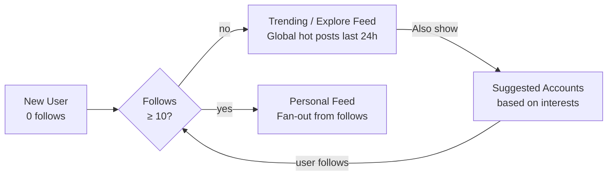

# Design a News Feed

---

## Q1: Design a social news feed like Twitter/Instagram for 100M DAU

**Role:** Senior | **Difficulty:** 🔴 Senior | **Priority:** P0 | **Format:** Scenario
**Real Company:** Instagram — 500M DAU, 100M posts/day; Twitter — 350M MAU, 500M tweets/day

### The Brief
> "Design a news feed system for a social platform with 100M daily active users. When a user posts, it should appear in their followers' feeds. Users can have up to 10M followers (celebrities). A user's feed should show the 100 most recent posts from people they follow. Feed load time must be < 500ms p99."

### Clarifying Questions to Ask First
1. Is the feed chronological or ranked by relevance?
2. What is the max followers per user? (affects fan-out strategy)
3. What's the read:write ratio? (Twitter: ~100:1)
4. Should feed include re-posts / shares from people you don't follow?

### Back-of-Envelope Estimation
| Metric | Calculation | Result |
|--------|-------------|--------|
| DAU | 100M users | 100M/day |
| Posts/DAU | 2 posts/user/day | 200M posts/day |
| Posts/sec | 200M ÷ 86400 | ~2,300 posts/sec |
| Feed reads/sec | 100M × 10 feed loads/day ÷ 86400 | ~11,500 reads/sec |
| Average followers | 300 per user | — |
| Fan-out writes/sec | 2,300 posts × 300 followers | ~690K writes/sec |
| Feed entry size | 8 bytes (post_id) per entry | — |
| Feed cache (100 posts × 100M users) | 100 × 8B × 100M | ~80 GB |

### High-Level Architecture



### Deep Dive: Fan-out Decision Tree



### Trade-off Decisions
| Decision | Option A | Option B | Chosen | Why |
|----------|----------|----------|--------|-----|
| Fan-out strategy | Eager (write time) | Lazy (read time) | Hybrid | Eager for normal users; lazy for celebrities |
| Feed storage | Post full content in cache | Post IDs only in cache | Post IDs | IDs use 8B vs 1KB per entry; fetch content separately |
| Ranking | Reverse chronological | Relevance-ranked (ML) | Chron first, ranked later | Ranked requires ML inference — add as phase 2 |
| Cache miss | Regenerate on demand | Serve empty | Regenerate | Empty feed is bad UX; pay regeneration cost once |

### Failure Modes
| Failure | Impact | Mitigation |
|---------|--------|------------|
| Fan-out lag (Kafka backup) | New posts appear late in feeds | Monitor Kafka lag; alert at 30s lag |
| Feed cache eviction | Cache miss → regenerate feed | LRU with min 48h TTL; pre-warm for active users |
| Post DB slow | Feed assembly slow | Cache post content for 1h separately; serve stale |
| Hot celebrity post | Fan-out overwhelms Redis | Celebrity post in separate store; merge at read time |

### Concept References
→ [Caching Strategies](../../../system-design/fundamentals/caching-strategies)
→ [Kafka / Messaging](../../../system-design/messaging-and-streaming/kafka-rabbitmq)

---

## Q2: Fan-out on write vs fan-out on read — when do you use each?

**Role:** Mid | **Difficulty:** 🟡 Mid | **Priority:** P0 | **Format:** Quick Answer

> **What the interviewer is testing:** Whether you understand the fundamental trade-off between write-time and read-time feed generation, and when each approach breaks down.

### Answer in 60 seconds
- **Fan-out on write (push):** When post is created, pre-populate feed for all followers; read is O(1) — just read pre-built feed list; write is O(followers)
- **Fan-out on read (pull):** On feed load, query all followees, merge their posts by time; read is O(followees) every time; write is O(1)
- **Use write fan-out when:** Average followers < 10K, read:write ratio is high (100:1), low latency feed required
- **Use read fan-out when:** Celebrity users (10M followers) — write fan-out would take hours; or users follow 10K+ accounts (merging is fast)
- **Hybrid:** Instagram — write for normal users, read for celebrities > 1M followers

### Diagram



### Pitfalls
- ❌ **Using write fan-out for accounts with 1M+ followers:** 1M Redis writes per post at 2,300 posts/sec from celebrities = 2.3B writes/sec — system collapse
- ❌ **Using read fan-out for users following 10K accounts:** Merging 10K timelines on every feed load = 10K DB reads per user per page view — unacceptable

### Concept Reference
→ [Caching Strategies](../../../system-design/fundamentals/caching-strategies)

---

## Q3: How does Instagram handle feed for users with 10M followers?

**Role:** Senior | **Difficulty:** 🔴 Senior | **Priority:** P0 | **Format:** Deep Dive

> **What the interviewer is testing:** Whether you understand Instagram's actual hybrid approach and can explain the "celebrity merge" read path.

### Problem Constraints
| Dimension | Value |
|-----------|-------|
| Celebrity followers | 10M+ (Kylie Jenner: 400M on Instagram) |
| Fan-out if eager | 400M Redis writes per post → days |
| Feed load SLA | p99 < 500ms including celebrity posts |
| Regular user feeds | Pre-built in Redis (eager fan-out) |

### Approach A — Pure Eager Fan-out (Broken for Celebrities)


### Approach B — Hybrid: Lazy Merge for Celebrities



| Dimension | Eager for All | Hybrid Lazy Celebrities |
|-----------|--------------|------------------------|
| Write latency for celebrity post | Hours (400M writes) | Milliseconds (1 write) |
| Read latency for follower | O(1) cache read | +N celebrity queries at read time |
| Feed freshness | Immediate after fan-out | Immediate (merged at read) |
| Complexity | Simple | Medium (merge logic) |

### Recommended Answer
Instagram's actual model: Users with > 1M followers trigger lazy fan-out. When follower loads feed, Redis returns pre-built feed (from normal follows), plus a synchronous in-memory merge with the latest 10 posts from each celebrity followed. Celebrity follows stored in `user_celebrity_follows:{user_id}` Redis set (usually < 20 celebrities). Merge is O(20 × 10 posts) — negligible. Total: Redis read (~5ms) + celebrity merge (~10ms) = 15ms well under 500ms SLA.

### What a great answer includes
- [ ] States the threshold for switching to lazy fan-out (1M followers)
- [ ] Explains that typical user follows < 20 celebrities — merge is cheap
- [ ] Calculates read cost: 20 celebrity lookups vs 400M writes
- [ ] Addresses what "celebrity" means — configurable threshold, not hardcoded

### Pitfalls
- ❌ **Not having a threshold — treating all users the same:** 1M-follower user and 300-follower user must be handled differently
- ❌ **Celebrity post not appearing in pre-built cache at all:** Need merge at read time for celebrity posts; without merge, followers never see celebrity posts

### Concept Reference
→ [Caching Strategies](../../../system-design/fundamentals/caching-strategies)

---

## Q4: How do you paginate a news feed efficiently?

**Role:** Mid | **Difficulty:** 🟡 Mid | **Priority:** P1 | **Format:** Quick Answer

> **What the interviewer is testing:** Whether you know cursor-based pagination and why offset pagination breaks at scale.

### Answer in 60 seconds
- **Offset pagination (wrong):** `LIMIT 20 OFFSET 100` — at page 5 of 20 items, DB scans and discards 100 rows; at offset 10000, scans 10K rows — O(offset) cost
- **Cursor-based (correct):** `WHERE post_id < cursor ORDER BY post_id DESC LIMIT 20` — cursor is last seen post_id; O(1) seek via index
- **Feed cursor:** Return `next_cursor = {oldest_post_id_in_page}` in response; client passes on next request
- **Redis sorted set:** Feed stored as sorted set with timestamp as score; `ZREVRANGEBYSCORE key cursor 0 LIMIT 0 20` — O(log N + M)

### Diagram

```mermaid
graph LR
  Page1[Load feed\ncursor: null] -->|ZREVRANGE 0 19| Redis[Redis Sorted Set\nFeed for user 123]
  Redis --> Posts[Post IDs: [p100, p99, p98... p81]]
  Page1 -->|Return| Cursor1[next_cursor: p81]
  Page2[Load more\ncursor: p81] -->|ZREVRANGEBYSCORE p81 0 LIMIT 20| Redis
  Redis --> MorePosts[Post IDs: [p80, p79...p61]]
```

### Pitfalls
- ❌ **SQL OFFSET pagination for feed:** At offset 1000 (page 50 × 20 items), DB scans and discards 1000 rows on every paginate — performance degrades linearly
- ❌ **Using timestamp as cursor:** Clock skew can produce duplicate or missing posts if two posts have same millisecond timestamp — use post_id (monotonic) as cursor

### Concept Reference
→ [SQL vs NoSQL](../../../system-design/storage-and-databases/sql-vs-nosql)

---

## Q5: How do you implement feed ranking (relevance over recency)?

**Role:** Senior | **Difficulty:** 🔴 Senior | **Priority:** P1 | **Format:** Deep Dive

> **What the interviewer is testing:** Whether you understand the architecture for ML-based feed ranking and can separate the ranking pipeline from the feed delivery path.

### Problem Constraints
| Dimension | Value |
|-----------|-------|
| Feed load target | p99 < 500ms |
| ML inference time | 50–200ms per request |
| Candidate pool | 500 recent posts from followees |
| Re-ranking frequency | Each feed load (real-time) |

### Approach A — Offline Batch Ranking



**Problem:** Ranking is 15 min stale; viral post rises in ranking 15 min late.

### Approach B — Online Re-ranking at Read Time



| Dimension | Offline Batch | Online Re-ranking |
|-----------|--------------|------------------|
| Freshness | 15 min stale | Real-time |
| Latency impact | 0 (pre-computed) | +50-200ms inference |
| Compute cost | Batch (cheap) | Per-request (expensive) |
| Personalization | At batch time | At request time |

### Recommended Answer
Two-stage ranking: (1) Retrieve 500 candidates from Redis feed cache (pre-built by fan-out). (2) Re-rank online using lightweight LightGBM model with pre-computed features (engagement rate, user-post affinity, post age). Feature store (Redis) precomputes features asynchronously — model receives feature vectors, returns scores in ~30ms. Total overhead: 30ms re-ranking on top of 5ms cache read = well within 500ms SLA.

### What a great answer includes
- [ ] Separates candidate retrieval (cheap) from ranking (expensive)
- [ ] Precomputes features asynchronously — not computed at request time
- [ ] Names a real algorithm (LightGBM, TF Serving)
- [ ] Quantifies ranking latency budget within 500ms SLA

### Pitfalls
- ❌ **Running ML inference on 10K candidate posts per user:** Inference is O(candidates) — cap candidates at 500; pre-filter by recency before ranking
- ❌ **Ranking every post from scratch at request time:** Compute engagement rate and affinity scores async in background; model inference uses pre-computed features

### Concept Reference
→ [Recommendation System](../../../system-design/business-and-advanced/recommendation-system)

---

## Q6: How do you handle celebrity problem in feed fanout?

**Role:** Senior | **Difficulty:** 🔴 Senior | **Priority:** P1 | **Format:** Quick Answer

> **What the interviewer is testing:** Whether you understand that uniform write fan-out breaks for high-follower accounts and can describe the threshold-based hybrid solution.

### Answer in 60 seconds
- **Celebrity problem:** User with 10M followers posts → fan-out service must write to 10M Redis feed caches; at 100K writes/sec Redis throughput, takes 100 seconds — unacceptable
- **Threshold:** Accounts > 1M followers get "celebrity" flag; no eager fan-out on post
- **Merge at read time:** User who follows celebrity sees their posts merged from `celebrity_posts:{celeb_id}` sorted set at feed load time
- **TTL on celebrity posts:** Keep last 200 posts per celebrity in Redis sorted set; older posts served from DB

### Diagram

```mermaid
graph LR
  CelebPost[Celebrity post\n10M followers] --> Check{Follower count\n> 1M?}
  Check -->|yes| NoPush[Store only in\ncelebrity_posts:{celeb_id}]
  Check -->|no| FanOut[Eager fan-out\nto all followers]
  FeedLoad[Follower loads feed] --> Redis[Pre-built feed\n+ merge celebrity posts]
  NoPush --> Redis
```

### Pitfalls
- ❌ **Hard-coded 1M threshold:** Threshold should be configurable and tuned based on Redis write throughput capacity; 100K writes/sec Redis = threshold is `1 / write_latency` per post
- ❌ **Celebrity posts not appearing until refresh:** Real-time merge at read time means celebrity posts appear instantly on next feed load — not delayed like fan-out

### Concept Reference
→ [Caching Strategies](../../../system-design/fundamentals/caching-strategies)

---

## Q7: How do you ensure a post appears in feeds within 5 seconds?

**Role:** Senior | **Difficulty:** 🔴 Senior | **Priority:** P2 | **Format:** Quick Answer

> **What the interviewer is testing:** Whether you understand end-to-end latency of the fan-out pipeline and what the bottlenecks are that cause delay.

### Answer in 60 seconds
- **Pipeline stages:** Post created → Kafka → Fan-out consumer → Redis writes → follower refreshes feed; each stage adds latency
- **Kafka latency:** < 5ms with `acks=1`; consumer lag is the real risk — monitor consumer lag, alert at > 1s
- **Redis write batch:** Fan-out service writes in batches of 1000 followers at a time using Redis pipeline — 10K followers = 10 pipeline calls = ~50ms
- **Client refresh:** Mobile client polls or uses WebSocket push to know when new posts exist; without push, client won't know to reload
- **5-second SLA:** Requires push notification to client ("new post available") via WebSocket + Kafka fan-out processing < 3s

### Diagram



### Pitfalls
- ❌ **Fan-out for 1M followers in a single Kafka consumer:** Single-threaded fan-out at 100K writes/sec would take 10 seconds for 1M followers; use partitioned parallel consumers
- ❌ **Client polling every 30 seconds:** 30-second polling interval means post appears after up to 30s — use WebSocket push for sub-5s delivery

### Concept Reference
→ [Kafka / Messaging](../../../system-design/messaging-and-streaming/kafka-rabbitmq)

---

## Q8: Design a hybrid fan-out strategy switching on follower count threshold

**Role:** Staff | **Difficulty:** ⚫ Staff | **Priority:** P2 | **Format:** Deep Dive

> **What the interviewer is testing:** Whether you can design the routing logic for a hybrid fan-out system and handle the edge cases around threshold transitions.

### Problem Constraints
| Dimension | Value |
|-----------|-------|
| Normal users | < 1M followers — eager fan-out |
| Celebrities | ≥ 1M followers — lazy merge at read |
| Threshold crossing | User gains 1M followers — must transition |
| Fan-out write throughput | 500K Redis writes/sec target |

### Approach A — Static Flag Set at Account Creation

```mermaid
graph LR
  PostCreated[New Post] --> CheckFlag[(Redis: is_celebrity:{user_id})]
  CheckFlag -->|flag=0| EagerFanout[Eager fan-out to all followers]
  CheckFlag -->|flag=1| CelebStore[Store in celebrity_posts:{user_id}]
```

### Approach B — Dynamic Routing with Follower Count Check

```mermaid
graph TD
  PostCreated[New Post by User U] --> FollowerCount[Redis ZCARD\nfollowers:{user_id}]
  FollowerCount -->|< 1M| EagerFanout[Kafka: eager-fanout topic\nfan-out to all followers]
  FollowerCount -->|>= 1M| CelebRoute[Kafka: celebrity-post topic\nstore in celebrity_posts:{user_id}\nnotify followers via WebSocket push]
  EagerFanout --> FeedWorker[Feed Worker\nwrites post_id to follower caches]
  CelebRoute --> CelebWorker[Celebrity Post Worker\nstores post, sends push notifications]
```

| Dimension | Static Flag | Dynamic Count Check |
|-----------|------------|-------------------|
| Accuracy | Stale if follower count changes | Always current |
| Redis overhead | 0 (cached flag) | ZCARD per post (O(1)) |
| Threshold transitions | Manual backfill needed | Automatic |
| Complexity | Low | Medium |

### Recommended Answer
Dynamic check per post (Approach B). Redis ZCARD on `followers:{user_id}` is O(1) — trivial cost per post. Routes to separate Kafka topics: `fanout-eager` for normal users, `fanout-celebrity` for 1M+ accounts. Celebrity fans get WebSocket push notification ("new post from X") rather than pre-built feed entry. Feed load for celebrity-following user merges from pre-built cache + celebrity sorted sets. Threshold transition is automatic — no manual intervention when account crosses 1M.

### What a great answer includes
- [ ] Separate Kafka topics for each fan-out path
- [ ] Explains how transition happens automatically
- [ ] Describes merge at read time for celebrity posts
- [ ] Handles the edge case: user at exactly 1M followers (use > not >=, tune threshold)

### Pitfalls
- ❌ **Migrating existing eager-fanned feeds when account crosses threshold:** Historical feeds already have the pre-built entries — only new posts after threshold switch use lazy; don't retroactively delete old entries
- ❌ **Celebrity posts never in pre-built feed → followers only see them if they explicitly load feed:** Send push notification on celebrity post so followers know to refresh

### Concept Reference
→ [Caching Strategies](../../../system-design/fundamentals/caching-strategies)
→ [Kafka / Messaging](../../../system-design/messaging-and-streaming/kafka-rabbitmq)

---

## Q9: How do you handle cold start for new users with no follows?

**Role:** Staff | **Difficulty:** ⚫ Staff | **Priority:** P2 | **Format:** Quick Answer

> **What the interviewer is testing:** Whether you understand UX-driven engineering decisions for empty state handling and onboarding flows.

### Answer in 60 seconds
- **Problem:** New user follows 0 people → feed is empty → user churns immediately
- **Trending/explore feed:** Show globally trending posts from past 24h while following-feed is empty — different content source, same UI
- **Suggested follows:** On sign-up, onboarding flow asks interests (sports, tech, music) → seed with 10 recommended accounts → first follow triggers real feed
- **Interest-based interim feed:** Until 10+ follows, serve content from user's selected interest categories (collaborative filtering on interests)
- **Threshold:** Instagram seeds with 15 followed accounts before showing chronological feed; below 15 = explore/trending mode

### Diagram



### Pitfalls
- ❌ **Showing empty feed with only "follow people" prompt:** Blank feed with no content = instant churn; always have fallback content (trending/explore)
- ❌ **Trending feed same for all users:** Trending by geographic region and language improves relevance for cold-start users significantly

### Concept Reference
→ [Recommendation System](../../../system-design/business-and-advanced/recommendation-system)

---

## Q10: How do you A/B test feed ranking without degrading UX?

**Role:** Staff | **Difficulty:** ⚫ Staff | **Priority:** P3 | **Format:** Quick Answer

> **What the interviewer is testing:** Whether you understand how to run ranking experiments safely, guard rails to prevent bad experiments from harming users, and how to measure success.

### Answer in 60 seconds
- **User-level bucketing:** Hash user_id to assign to treatment group (10%) or control (90%); consistent hashing ensures same user always sees same variant
- **Feature flags:** Feed ranking model version stored in feature flag service (LaunchDarkly); retrieved per-request by user_id → no deploy needed
- **Guard rails:** Auto-abort experiment if session length drops > 5%, or scroll depth drops > 10%, or report rate spikes > 2× control — prevents bad experiments running for days
- **Holdout group:** 1% of users permanently in holdout (no ranking changes) — measures cumulative drift from continuous experimentation
- **Metrics:** Primary: engagement rate (likes + comments + shares per session); secondary: session length, DAU retention

### Diagram

```mermaid
graph LR
  FeedLoad[User loads feed\nuser_id=12345] --> Bucket[A/B Bucketing\nhash(12345) % 100]
  Bucket -->|< 10%| Treatment[Ranking Model v2\nMLModel-v2]
  Bucket -->|>= 10%| Control[Ranking Model v1\nMLModel-v1 baseline]
  Treatment --> MetricsT[Collect: engagement,\nsession, scroll depth]
  Control --> MetricsC[Collect: engagement,\nsession, scroll depth]
  MetricsT --> Analysis[Statistical significance\n> 95% before ship]
```

### Pitfalls
- ❌ **A/B testing ranking without guard rails:** A bad ranking model that hides important posts can reduce DAU by 3% before anyone notices — automated guardrails catch regressions in hours not days
- ❌ **Bucketing by session not user:** User sees different rankings each session = noisy data; user-level consistent bucketing is required for clean experiment

### Concept Reference
→ [Recommendation System](../../../system-design/business-and-advanced/recommendation-system)
→ [Observability](../../../system-design/scale-and-reliability/observability)
