# Design a Notification System

---

## Q1: Design a notification system for 100M users (push, email, SMS)

**Role:** Senior, Backend | **Difficulty:** 🔴 Senior | **Priority:** P0 | **Format:** Scenario
**Real Company:** Meta — sends 1B+ push notifications/day; Twilio — 130B messages/year

### The Brief
> "Design a notification service that can send push notifications (iOS/Android), emails, and SMS to 100M users. It must handle OTP alerts (< 5s delivery SLA), marketing blasts (millions of users), and social notifications (someone liked your post). Support user preferences for muting specific channels."

### Clarifying Questions to Ask First
1. What are the delivery SLAs per channel type? (OTP < 5s, marketing < 1h acceptable?)
2. What is the peak notification volume? (single event triggering 10M notifications?)
3. Should notifications be deduped if the same event fires twice?
4. Do we need delivery confirmation / read receipts?

### Back-of-Envelope Estimation
| Metric | Calculation | Result |
|--------|-------------|--------|
| DAU | 100M users, 50M active/day | 50M DAU |
| Notifications/user/day | 20 avg (social + marketing) | — |
| Total/day | 50M × 20 | 1B notifications/day |
| Peak rps | 1B ÷ 86400 × 10 (spike factor) | ~116K rps peak |
| SMS volume | 5% of users opt in | 50M SMS/month |
| Push tokens stored | 100M users × 2 devices | 200M tokens |

### High-Level Architecture

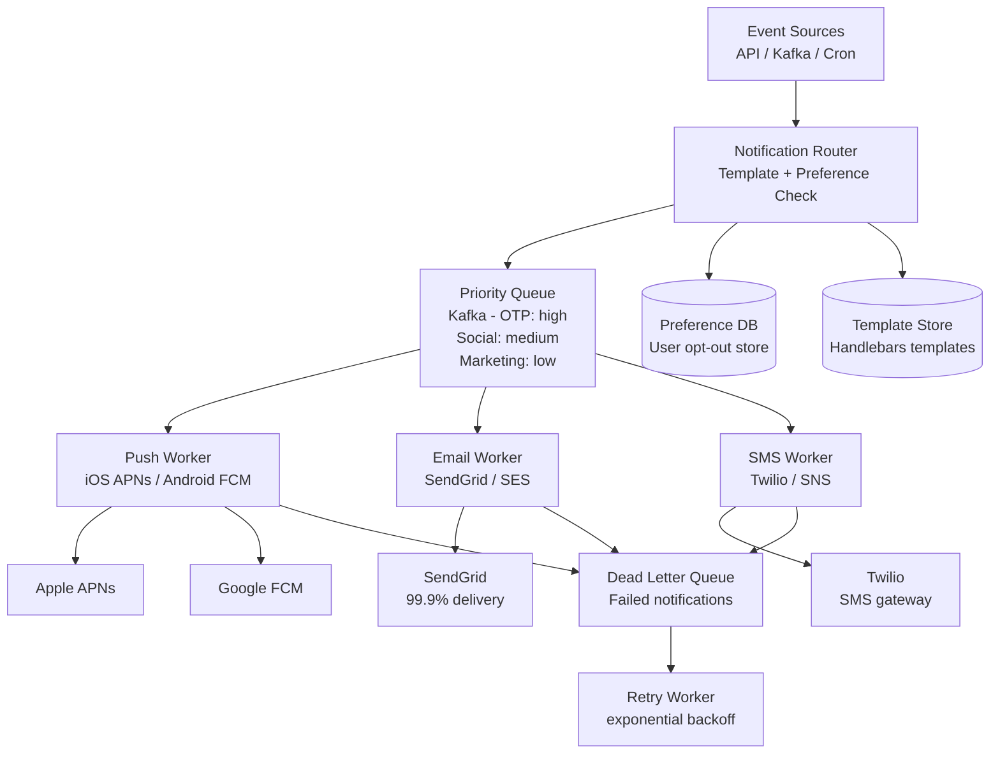

### Deep Dive: Fan-out for 1 Post → 10M Followers

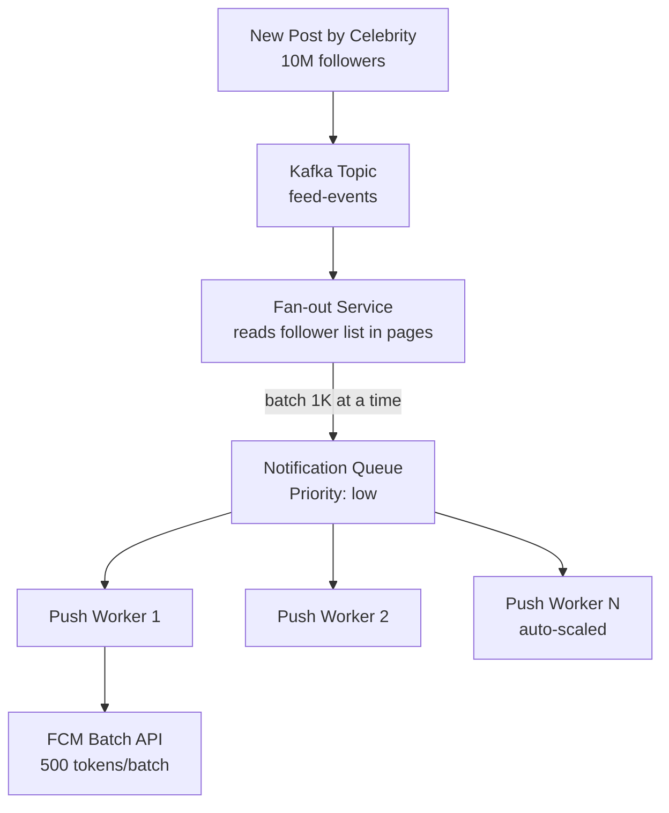

### Trade-off Decisions
| Decision | Option A | Option B | Chosen | Why |
|----------|----------|----------|--------|-----|
| Queue priority | Single queue | Multi-priority Kafka topics | Multi-priority | OTPs must not wait behind marketing |
| Fan-out timing | Fan-out on write (precompute) | Fan-out on read (at delivery) | Write for small, read for celebrities | Pull model for 10M+ follower accounts |
| Delivery guarantee | At-least-once | Exactly-once | At-least-once + dedup | Exactly-once too expensive; dedup at consumer |
| Preference check | Sync on every notification | Cached in Redis | Redis cache 5min TTL | Sync DB call at 100K rps is unacceptable |

### Failure Modes
| Failure | Impact | Mitigation |
|---------|--------|------------|
| APNs / FCM outage | Push not delivered | Retry queue with exponential backoff; fall back to in-app |
| Preference DB down | Risk sending to opted-out users | Fail-closed: skip notification if preference unavailable |
| Fan-out lag | Marketing notifications arrive 2h late | Acceptable SLA; monitor queue depth alert at 30min lag |
| Token stale | Push to uninstalled app | Handle APNs/FCM feedback API to remove stale tokens |

### Concept References
→ [Kafka / Messaging](../../../system-design/messaging-and-streaming/kafka-rabbitmq)
→ [Rate Limiting](../../../system-design/fundamentals/rate-limiting)

---

## Q2: What are the differences between push, email, and SMS at scale?

**Role:** Mid | **Difficulty:** 🟡 Mid | **Priority:** P0 | **Format:** Quick Answer

> **What the interviewer is testing:** Whether you understand the operational constraints, delivery guarantees, and throughput characteristics of each notification channel.

### Answer in 60 seconds
- **Push (APNs/FCM):** Free, ~1–3s delivery, requires app install + permission, no guaranteed delivery (device offline = lost unless TTL set), batch API sends 500 tokens/call
- **Email:** Cheapest at volume ($0.0001/email via SES), 15–60s delivery, universal reach, high spam risk, reputation management critical (SPF/DKIM/DMARC)
- **SMS:** Most reliable ($0.0075/msg via Twilio), 2–10s delivery, no app needed, regulated (TCPA in US), expensive at scale — 1M SMS = $7,500
- **Priority order:** OTP → SMS+Push (2-factor), Transactional → Email, Social → Push only, Marketing → Email only

### Diagram

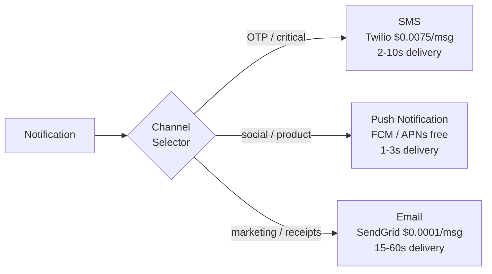

### Pitfalls
- ❌ **Sending marketing via SMS:** $7,500 per 1M messages vs $100 per 1M emails — wrong channel for non-critical content
- ❌ **Not handling APNs feedback loop:** Stale tokens from uninstalled apps cause growing dead-delivery list; process feedback API daily

### Concept Reference
→ [Kafka / Messaging](../../../system-design/messaging-and-streaming/kafka-rabbitmq)

---

## Q3: How do you guarantee at-least-once delivery for critical notifications?

**Role:** Senior | **Difficulty:** 🔴 Senior | **Priority:** P0 | **Format:** Deep Dive

> **What the interviewer is testing:** Whether you understand durable queuing, idempotent consumers, retry strategies, and the difference between at-least-once and exactly-once delivery.

### Problem Constraints
| Dimension | Value |
|-----------|-------|
| Scale | 10K critical notifications/sec (OTP, payment alerts) |
| Latency SLA | p99 < 5s end-to-end delivery |
| Delivery guarantee | At-least-once (duplicates acceptable, but rare) |
| Failure tolerance | No loss even if worker crashes mid-send |

### Approach A — Fire and Forget (unreliable)

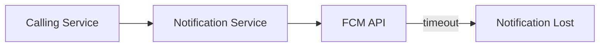

**When to use:** Non-critical marketing where occasional loss is acceptable.

### Approach B — Durable Queue + Idempotent Consumer

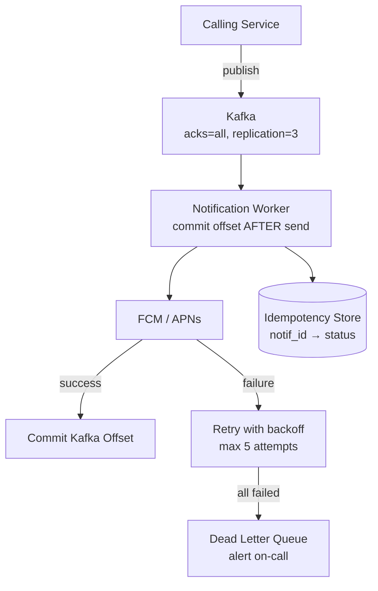

| Dimension | Approach A | Approach B |
|-----------|-----------|-----------|
| Loss on worker crash | Yes | No (Kafka retains message) |
| Duplicate risk | None | Low (idempotency key dedup) |
| Complexity | Minimal | Medium |
| Delivery guarantee | At-most-once | At-least-once |

### Recommended Answer
Use Kafka with `acks=all` and `replication.factor=3`. Worker consumes from Kafka, sends to FCM, and only commits offset **after** successful send confirmation. On worker crash, Kafka re-delivers to another worker. Use idempotency key (`notification_id`) stored in Redis to skip already-delivered messages on retry. DLQ after 5 failed attempts with PagerDuty alert.

### What a great answer includes
- [ ] Offset commit happens AFTER successful delivery (not before)
- [ ] Idempotency key prevents double-send on retry
- [ ] Dead letter queue for permanently failed notifications
- [ ] Monitoring: alert on DLQ depth > 0

### Pitfalls
- ❌ **Committing Kafka offset before send completes:** If send fails after commit, message is lost — always commit after confirmation
- ❌ **Relying on FCM's own retry:** FCM retries internally but has a 4-week TTL and doesn't guarantee delivery to offline devices — own your retry logic

### Concept Reference
→ [Kafka / Messaging](../../../system-design/messaging-and-streaming/kafka-rabbitmq)

---

## Q4: How do you handle user notification preferences?

**Role:** Mid | **Difficulty:** 🟡 Mid | **Priority:** P1 | **Format:** Quick Answer

> **What the interviewer is testing:** Whether you can design a flexible preference system that's fast to check at high throughput without becoming a bottleneck.

### Answer in 60 seconds
- **Data model:** `user_preferences(user_id, channel[push/email/sms], category[social/marketing/security], enabled BOOL)` — fine-grained opt-out per channel × category
- **Mandatory categories:** Security (OTP, account alerts) cannot be disabled — enforce at preference write layer
- **Cache preferences:** Redis hash per user `prefs:{user_id}` → `{email_marketing: 0, push_social: 1}` with 5min TTL
- **Fail-closed:** If cache miss and DB unreachable, skip non-critical notifications; never skip security notifications

### Diagram

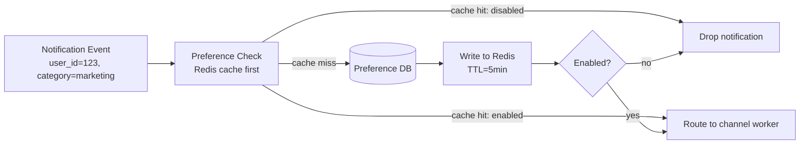

### Pitfalls
- ❌ **Global unsubscribe disables security alerts:** OTP and fraud alerts must be non-suppressible; enforce at code level not just UI
- ❌ **Per-request DB query at 100K rps:** 100K DB reads/sec for preference check will saturate any DB — always use Redis cache

### Concept Reference
→ [Caching Strategies](../../../system-design/fundamentals/caching-strategies)

---

## Q5: How would you implement notification rate limiting per user?

**Role:** Mid | **Difficulty:** 🟡 Mid | **Priority:** P1 | **Format:** Quick Answer

> **What the interviewer is testing:** Whether you understand per-entity rate limiting using sliding windows and can apply it to prevent notification spam to a single user.

### Answer in 60 seconds
- **Limit:** Max 5 marketing notifications/user/day; max 20 social/user/day; OTPs unlimited
- **Implementation:** Redis sorted set sliding window — key: `notif_limit:{user_id}:{category}:{date}`, increment on send, check before routing
- **Token bucket for bursts:** Allow burst of 3 in 1 minute even if daily limit allows 20 — prevents notification spam in rapid succession
- **Bypass for critical:** Security category bypasses all rate limits — implemented at routing layer, not rate limiter

### Diagram

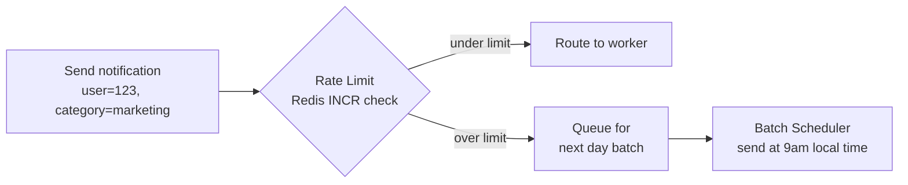

### Pitfalls
- ❌ **Fixed window reset at midnight:** User gets 5 notifications at 11:58pm then 5 more at 12:01am — use sliding window to prevent this
- ❌ **Same rate limit for all categories:** Marketing and OTP have very different urgency — separate rate limits per category

### Concept Reference
→ [Rate Limiting](../../../system-design/fundamentals/rate-limiting)

---

## Q6: How do you handle fan-out for 1 post → 10M followers?

**Role:** Senior | **Difficulty:** 🔴 Senior | **Priority:** P1 | **Format:** Deep Dive

> **What the interviewer is testing:** Whether you understand the celebrity problem in fan-out, and how to use lazy fan-out vs eager fan-out based on follower count thresholds.

### Problem Constraints
| Dimension | Value |
|-----------|-------|
| Celebrity followers | 10M+ (Taylor Swift, Cristiano Ronaldo) |
| Fan-out time SLA | Best-effort; < 30 min for marketing, < 30s for interactive |
| Throughput | 1 post → 10M push notifications in < 5 min |
| Worker capacity | Each push worker sends 500 tokens/FCM batch call, 2K calls/sec |

### Approach A — Eager Fan-out (Fan-out on Write)

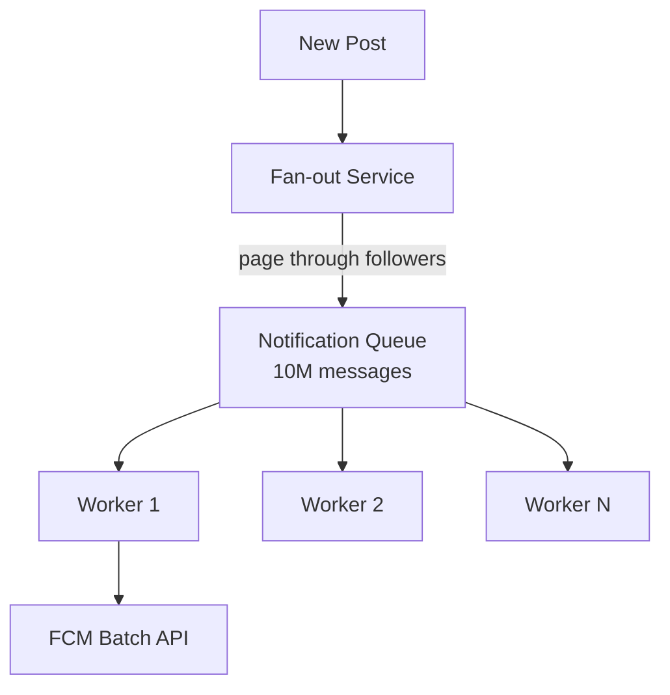

**When to use:** Regular users with < 10K followers — fast, simple.

### Approach B — Lazy Fan-out (Fan-out on Read with Pull)

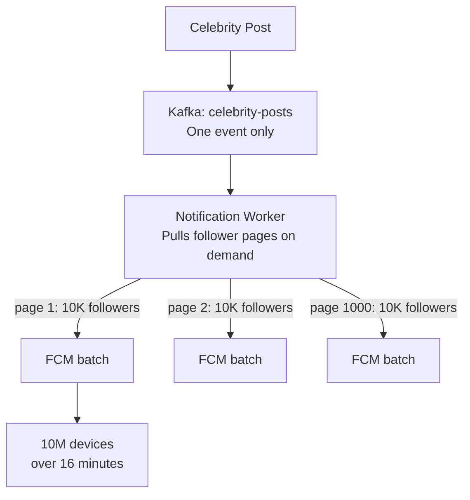

| Dimension | Eager Fan-out | Lazy Fan-out |
|-----------|--------------|-------------|
| Queue depth | 10M messages instantly | 1 message, batched on consume |
| Memory/storage | High (10M messages) | Low (1 event) |
| Latency for followers | Low — all queued immediately | Slightly higher — paged delivery |
| Celebrity problem | Queue explosion | Handles gracefully |

### Recommended Answer
Use hybrid: fans with < 10K followers get eager fan-out (messages pre-queued). Celebrities (> 10K followers) get lazy fan-out — single Kafka event, worker pages through follower table in 10K batches, sends FCM batch requests. At 2K FCM calls/sec × 500 tokens/batch = 1M notifications/sec → 10M followers notified in ~10 seconds with 10 parallel workers.

### What a great answer includes
- [ ] Identifies celebrity problem explicitly
- [ ] Gives a follower-count threshold for switching strategies (e.g., 10K)
- [ ] Calculates time to notify 10M followers
- [ ] Mentions FCM batch API (500 tokens/call)

### Pitfalls
- ❌ **Enqueuing 10M individual messages for one celebrity post:** Queue depth explosion causes latency for all other notifications — use lazy fan-out above 10K followers
- ❌ **Not rate-limiting fan-out workers:** Fan-out at full speed can trigger FCM rate limits (1M rps per project) — respect API quotas

### Concept Reference
→ [Kafka / Messaging](../../../system-design/messaging-and-streaming/kafka-rabbitmq)

---

## Q7: How do you handle notification deduplication?

**Role:** Senior | **Difficulty:** 🔴 Senior | **Priority:** P1 | **Format:** Quick Answer

> **What the interviewer is testing:** Whether you understand idempotency keys and how to implement deduplication in an at-least-once delivery system without expensive global coordination.

### Answer in 60 seconds
- **Idempotency key:** `notification_id = hash(user_id + event_id + channel + timestamp_bucket)` — same event within 1-hour window = same key
- **Dedup store:** Redis SET with 24h TTL — `SETNX notif_dedup:{notification_id}` → skip if key exists
- **Producer dedup:** Upstream services assign stable `event_id` per business event (e.g., payment confirmation ID); notification service uses this as seed
- **TTL window:** 24h dedup window balances storage cost vs duplicate protection — retry after 24h is treated as new

### Diagram

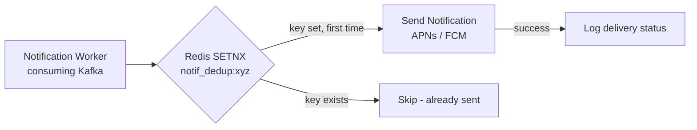

### Pitfalls
- ❌ **Using DB for dedup at 10K rps:** 10K DB writes/sec for dedup check adds latency and load — Redis SETNX is O(1) and handles this trivially
- ❌ **No TTL on dedup keys:** Redis memory fills up — always set TTL proportional to retry window (24h typical)

### Concept Reference
→ [Caching Strategies](../../../system-design/fundamentals/caching-strategies)

---

## Q8: How do you implement scheduled notifications (9am user local time)?

**Role:** Senior | **Difficulty:** 🔴 Senior | **Priority:** P2 | **Format:** Quick Answer

> **What the interviewer is testing:** Whether you understand timezone-aware scheduling, efficient time-based queue processing, and how to distribute scheduled sends across workers.

### Answer in 60 seconds
- **Store scheduled time in UTC:** `send_at = user_local_9am → UTC offset by timezone`; store as UTC timestamp in DB
- **Scheduler query:** Cron job every minute queries `WHERE send_at <= NOW() AND status='pending'` → enqueues to Kafka
- **Efficient polling:** Use `send_at` index; partition by hour bucket to avoid full table scan at scale
- **Timezone handling:** User's timezone stored in profile; recalculate if user changes timezone before send time
- **Scale:** At 100M users × 1 scheduled notification/day = 100M rows; index `(send_at, status)` for efficient range scan

### Diagram

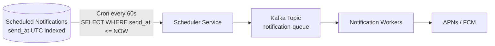

### Pitfalls
- ❌ **Scheduling in user local time without converting to UTC:** DST changes cause double-send or skip — always store and compare in UTC
- ❌ **Polling entire table every minute at 100M rows:** Use time-bucket index + partition; only scan current minute's partition

### Concept Reference
→ [Kafka / Messaging](../../../system-design/messaging-and-streaming/kafka-rabbitmq)

---

## Q9: How do you design priority queues so OTP alerts bypass marketing emails?

**Role:** Staff | **Difficulty:** ⚫ Staff | **Priority:** P2 | **Format:** Deep Dive

> **What the interviewer is testing:** Whether you can architect a multi-priority queue system that guarantees critical notifications are never starved by marketing blasts.

### Problem Constraints
| Dimension | Value |
|-----------|-------|
| OTP SLA | < 5 seconds end-to-end |
| Marketing volume | 10M messages in 2-hour window |
| Worker pool | 100 shared workers |
| Risk | Marketing blast delays OTP delivery to 30s+ |

### Approach A — Single Queue (Wrong)

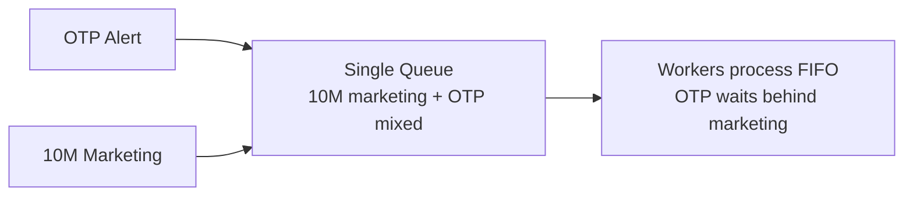

**When to use:** Never for mixed-priority workloads.

### Approach B — Separate Kafka Topics per Priority

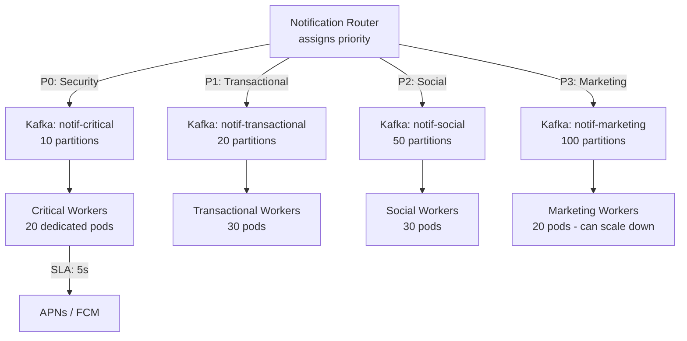

| Dimension | Single Queue | Separate Topics |
|-----------|-------------|----------------|
| OTP p99 latency under marketing load | 30–120s | <3s (dedicated workers) |
| Resource isolation | None | Complete per tier |
| Complexity | Low | Medium |
| Worker auto-scaling | Simple | Per-topic, independent |

### Recommended Answer
Four dedicated Kafka topics by priority with independent worker pools. Critical (OTP) workers are never shared with marketing. Marketing workers auto-scale down during off-peak. Topic lag monitored per priority — alert if critical topic lag > 1K messages. Marketing can be throttled (100 msg/sec) during peak hours to protect critical workers' network bandwidth.

### What a great answer includes
- [ ] Explicitly separates worker pools — not just separate queues with same workers
- [ ] Gives concrete SLA numbers per tier
- [ ] Mentions monitoring topic lag separately per priority
- [ ] Addresses what happens if marketing topic backs up (acceptable)

### Pitfalls
- ❌ **Separate queues but shared workers:** Worker picks from highest-priority queue first — but if workers are all busy with marketing, OTP still waits; need dedicated worker allocation
- ❌ **Too many priority tiers:** 10 priority levels = 10 worker pools = operational overhead; 4 tiers (critical/transactional/social/marketing) is sufficient

### Concept Reference
→ [Kafka / Messaging](../../../system-design/messaging-and-streaming/kafka-rabbitmq)

---

## Q10: How do you measure delivery success and debug failures?

**Role:** Staff | **Difficulty:** ⚫ Staff | **Priority:** P2 | **Format:** Quick Answer

> **What the interviewer is testing:** Whether you can design observability for a notification system — specifically delivery funnel metrics, alerting on SLA violations, and distributed tracing for debugging failures.

### Answer in 60 seconds
- **Delivery funnel metrics:** Track each stage — triggered → routed → queued → sent to provider → delivered (provider callback) → opened (in-app event)
- **Key metrics:** `delivery_rate = delivered / triggered` per channel per priority; alert if push delivery rate < 95%, SMS < 98%
- **Provider callbacks:** APNs/FCM send delivery receipts via webhook — store in `notification_delivery` table with timestamp and status code
- **Distributed tracing:** Trace ID attached to notification from creation to delivery — visible in Jaeger to debug "why did OTP take 8s?"
- **Dead letter monitoring:** Alert PagerDuty if DLQ depth > 100 messages in 5 min window

### Diagram

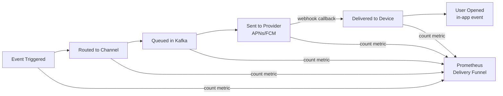

### Pitfalls
- ❌ **Only tracking "sent to provider" as delivery success:** FCM accepts the message but device may be offline — success means device-confirmed delivery, not just API acceptance
- ❌ **Not correlating failures to providers:** APNs vs FCM vs Twilio have independent outage profiles — alert per provider, not aggregated

### Concept Reference
→ [Observability](../../../system-design/scale-and-reliability/observability)
