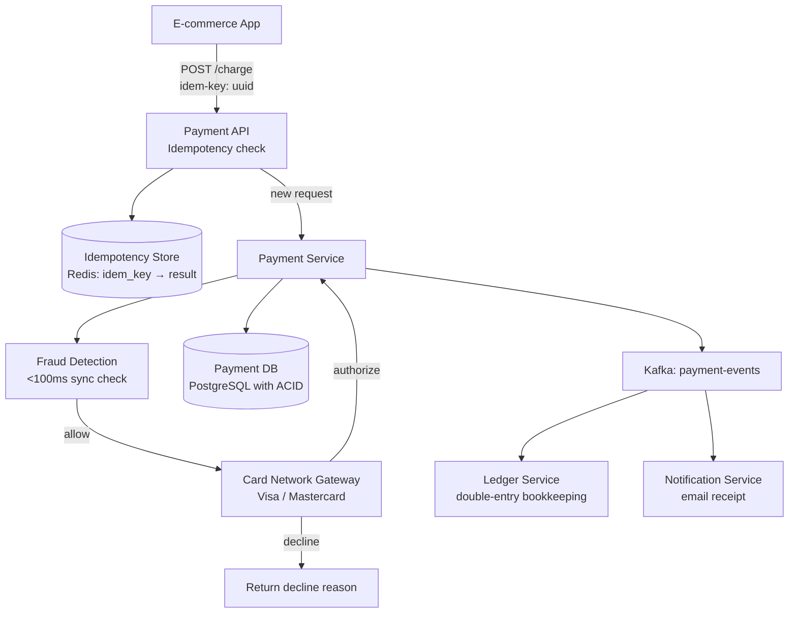
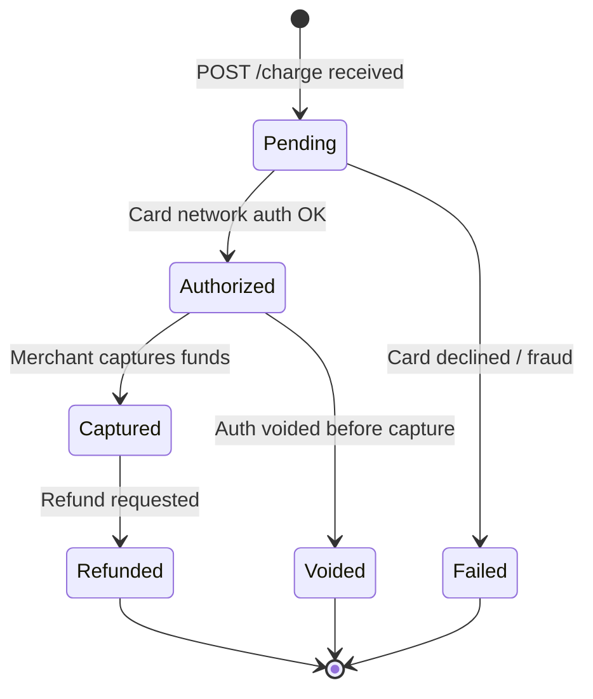
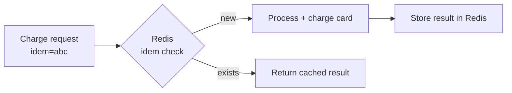
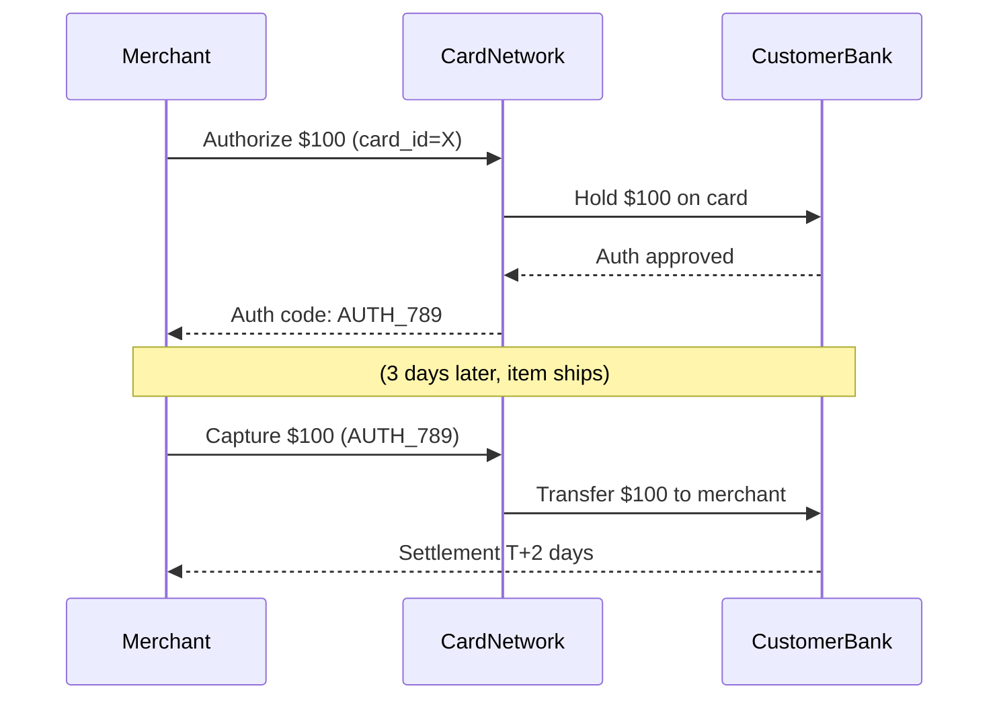
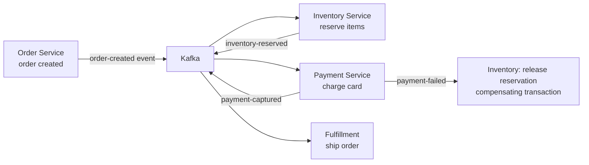
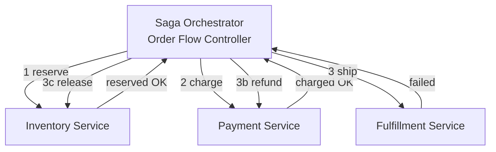
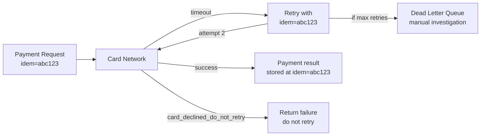
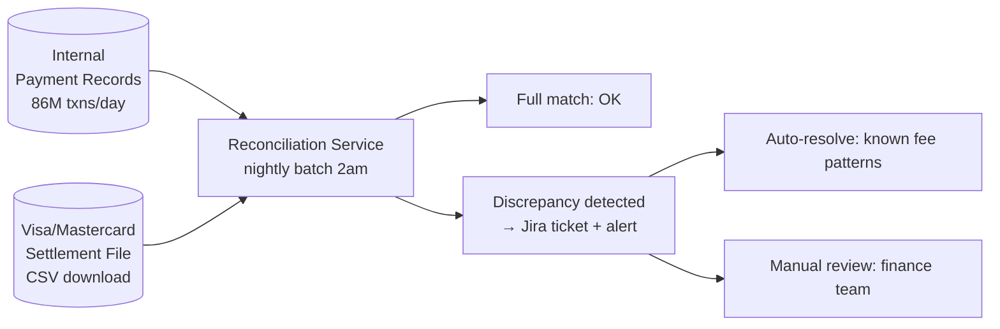
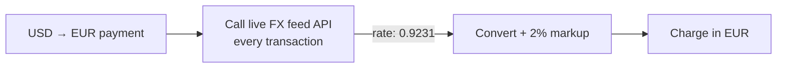
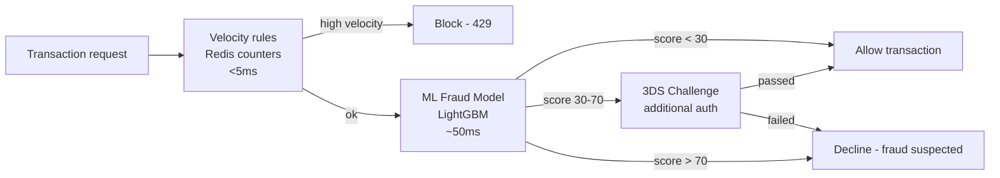

# Design a Payment System

---

## Q1: Design a payment system like Stripe handling 1000 transactions/sec

**Role:** Senior | **Difficulty:** 🔴 Senior | **Priority:** P0 | **Format:** Scenario
**Real Company:** Stripe — $817B total payment volume (2023); PayPal — 22.3B transactions/year

### The Brief
> "Design a payment processing system for an e-commerce platform. It must handle 1000 transactions/sec, prevent double charges, support refunds, and achieve 99.99% uptime. The system connects to card networks (Visa, Mastercard) and must comply with PCI-DSS. Transactions must complete within 3 seconds p99."

### Clarifying Questions to Ask First
1. Are we building the full payment gateway or integrating with Stripe/Braintree?
2. What card types must be supported? (credit, debit, international?)
3. Do we need real-time fraud detection or can it be async?
4. Multi-currency support required?

### Back-of-Envelope Estimation
| Metric | Calculation | Result |
|--------|-------------|--------|
| Transactions/sec | 1000 sustained, 5000 peak | 5000 tps peak |
| Daily transactions | 1000 × 86400 | 86M/day |
| Avg transaction value | $50 | — |
| Daily payment volume | 86M × $50 | $4.3B/day |
| Transaction record size | 500 bytes | — |
| Storage/day | 86M × 500B | ~43 GB/day |
| Idempotency key store | Last 24h transactions | 86M × 100B = ~8.6 GB |

### High-Level Architecture



### Deep Dive: Transaction State Machine



### Trade-off Decisions
| Decision | Option A | Option B | Chosen | Why |
|----------|----------|----------|--------|-----|
| Idempotency storage | Database | Redis | Redis + DB | Redis for fast check; DB for durable persistence |
| Fraud check | Sync (blocking) | Async (post-auth) | Sync | Catching fraud before auth prevents chargeback liability |
| Database | Single PostgreSQL | Distributed (CockroachDB) | PostgreSQL + replicas | ACID required; scale with read replicas |
| Retry strategy | Client-driven | Server-driven | Client with idem key | Server-driven retries can cause double-charges without idempotency |

### Failure Modes
| Failure | Impact | Mitigation |
|---------|--------|------------|
| Network timeout to card network | Payment status unknown | Query card network for final status; reconcile at T+5 min |
| DB write failure after card auth | Auth succeeded, no record | Card auth record in Kafka before DB write; replay on failure |
| Redis idempotency store down | Risk of double charge | Fail-closed: reject if idem check unavailable |
| Card network latency spike | p99 breaches 3s SLA | Circuit breaker; timeout at 2.5s; return retry response |

### Concept References

---

## Q2: What is idempotency and why is it critical for payment APIs?

**Role:** Mid | **Difficulty:** 🟡 Mid | **Priority:** P0 | **Format:** Quick Answer

> **What the interviewer is testing:** Whether you understand that idempotency prevents double charges when clients retry failed requests and can describe implementation with idempotency keys.

### Answer in 60 seconds
- **Definition:** An idempotent operation produces the same result regardless of how many times it's called with the same input — `f(f(x)) = f(x)`
- **Payment problem:** Client sends charge request, network times out — did the charge succeed or not? Client retries → double charge if server processed the first request
- **Solution:** Client generates unique `idempotency_key` (UUID) per payment intent; server returns cached response if same key seen again
- **Storage:** `idempotency_keys(key, result_json, created_at)` in Redis with 24h TTL; on duplicate, return stored result without re-processing
- **Stripe implementation:** `Idempotency-Key` HTTP header; Stripe stores result for 24h; same key within 24h returns identical response

### Diagram

```mermaid
graph LR
  Client[Client\nsends charge\nidem-key=abc] -->|first request| Server[Payment Server]
  Server --> Process[Process charge\n$100 charged]
  Server --> Store[(Store: abc → {charged: $100, txn_id: xyz})]
  Client -->|retry due to timeout\nidem-key=abc| Server
  Server --> Check{idem-key\nalready seen?}
  Check -->|yes| Return[Return stored result\n{charged: $100, txn_id: xyz}]
  Check -->|no| Process
```

### Pitfalls
- ❌ **Using request body hash as idempotency key:** Two different users charging $100 get same hash → same idempotency key → second charge returns first user's result; key must be unique per intent, not per payload
- ❌ **Short idempotency key TTL:** If client retries after 25h due to async retry system, 24h TTL expired → re-processed as new charge; extend TTL for long-running retry systems

### Concept Reference

---

## Q3: How do you prevent double charges in a distributed payment system?

**Role:** Senior | **Difficulty:** 🔴 Senior | **Priority:** P0 | **Format:** Deep Dive

> **What the interviewer is testing:** Whether you can design a multi-layer defense against double charging using idempotency keys, distributed locks, and database constraints.

### Problem Constraints
| Dimension | Value |
|-----------|-------|
| Scale | 1000 tps, 5000 tps peak |
| Risk | Double charge = customer dispute + chargeback fee ($15–$25/dispute) |
| Recovery window | Detect and reverse within 30 minutes |
| Storage | Idempotency store, 24h window |

### Approach A — Optimistic: Idempotency Key Only



**Gap:** If Redis goes down between check and store, race condition possible.

### Approach B — Multi-Layer Defense

```mermaid
graph TD
  Request[Charge request\nidem=abc] --> L1[Layer 1: Redis\nSETNX idem:abc 'processing'\nTTL=5min]
  L1 -->|acquired| L2[Layer 2: DB constraint\nINSERT INTO payments\nON CONFLICT(idem_key) DO NOTHING]
  L2 -->|new insert| CardCharge[Charge card network]
  CardCharge --> L3[Layer 3: Reconciliation\nMatch charge records to card statements]
  L2 -->|conflict - duplicate| ReturnDup[Return original result]
  L1 -->|key exists| InFlight{status=processing?}
  InFlight -->|yes| Wait[Wait + poll 500ms]
  InFlight -->|completed| ReturnResult[Return stored result]
```

| Dimension | Idempotency Key Only | Multi-Layer Defense |
|-----------|---------------------|-------------------|
| Double charge prevention | Strong (single check) | Very strong (3 layers) |
| Redis failure handling | Risk window | DB constraint catches Redis gap |
| Complexity | Low | Medium |
| Performance | 1 Redis round-trip | 1 Redis + 1 DB write |

### Recommended Answer
Multi-layer (Approach B): (1) Redis SETNX `idem:{key}` with 5min TTL to gate concurrent requests. (2) DB INSERT with unique constraint on `idempotency_key` column — if Redis gap allows two requests through, DB constraint ensures only one succeeds. (3) Daily reconciliation: compare internal payment records against card network settlement reports — catch any discrepancies. Three independent layers make double-charge virtually impossible.

### What a great answer includes
- [ ] Two in-memory barriers (Redis) + one durable barrier (DB constraint)
- [ ] Addresses Redis failure scenario
- [ ] Mentions reconciliation as final safety net
- [ ] Explains `SETNX` (set-not-exists) semantics

### Pitfalls
- ❌ **Only using application-level idempotency check:** Race condition if two requests arrive simultaneously, both pass check before either stores result — always add DB unique constraint as backup
- ❌ **Not reconciling against card network:** Internal DB can be wrong; reconciliation against Visa/Mastercard settlement files is the ultimate source of truth

### Concept Reference

---

## Q4: Authorization vs capture in payment flows — what's the difference?

**Role:** Mid | **Difficulty:** 🟡 Mid | **Priority:** P1 | **Format:** Quick Answer

> **What the interviewer is testing:** Whether you understand the two-phase payment flow used for e-commerce, hotels, and car rentals where the final charge amount is unknown at order time.

### Answer in 60 seconds
- **Authorization:** Card network verifies card is valid and funds available; holds the amount on customer's card but does NOT transfer money; auth is valid for 5–7 days
- **Capture:** Actual money movement; merchant submits capture request (can be ≤ authorized amount) to initiate fund transfer via ACH/card settlement
- **Why separate:** E-commerce: authorize at order placement, capture only when item ships — if item out of stock, void auth, no charge; Hotel: authorize $1K at check-in, capture actual spend at checkout
- **Partial capture:** Authorized $100, capture $80 (partial order fulfilled) — valid in most card networks
- **Stripe API:** `stripe.paymentIntents.create({ capture_method: 'manual' })` → auth only; `stripe.paymentIntents.capture(id)` → capture

### Diagram



### Pitfalls
- ❌ **Capturing more than authorized amount:** Card networks reject over-capture; if actual cost exceeds auth, re-authorize for the difference
- ❌ **Not capturing within auth expiry window:** Auth codes expire in 5-7 days; uncaptured auth releases hold automatically — merchant must re-authorize if shipping delayed

### Concept Reference

---

## Q5: How do you implement the Saga pattern for distributed checkout?

**Role:** Senior | **Difficulty:** 🔴 Senior | **Priority:** P1 | **Format:** Deep Dive

> **What the interviewer is testing:** Whether you understand distributed transaction management across microservices using the Saga pattern with compensating transactions.

### Problem Constraints
| Dimension | Value |
|-----------|-------|
| Services involved | Order, Inventory, Payment, Fulfillment |
| Failure scenarios | Payment fails after inventory reserved; fulfillment fails after payment charged |
| Consistency | Eventual (no 2PC distributed locking) |
| Rollback | Compensating transactions per step |

### Approach A — Choreography-Based Saga



### Approach B — Orchestration-Based Saga



| Dimension | Choreography | Orchestration |
|-----------|-------------|--------------|
| Coupling | Low — services react to events | Medium — orchestrator knows all services |
| Observability | Hard — state distributed | Easy — orchestrator holds state |
| Rollback | Each service implements compensation | Orchestrator drives rollback in order |
| Complexity | Simple to start, complex to debug | More upfront, easier to reason at scale |

### Recommended Answer
Orchestration (Approach B) for payment flows — the compensating transaction order matters (must refund before releasing inventory). Saga Orchestrator is a state machine persisted in DB: `{order_id, step, status}`. Each step: call service, await response, transition state. On failure at step N: call compensation for steps N-1 → 1 in reverse order. Circuit breaker on each service call; DLQ for stuck sagas. Stripe Connect and large payment providers use orchestration internally.

### What a great answer includes
- [ ] Names compensating transactions (not rollbacks — these can't be rolled back)
- [ ] Explains why orchestration is preferred when compensation order matters
- [ ] Describes saga state machine persistence
- [ ] Addresses saga timeout (what if service never responds)

### Pitfalls
- ❌ **2-Phase Commit (2PC) instead of Saga:** 2PC requires distributed lock held across network hops; if any service fails, entire transaction blocks; Saga avoids this with eventual consistency
- ❌ **Choreography without correlation ID:** Events from 5 services with no correlation ID — impossible to trace which event belongs to which order; always include `order_id` as correlation ID

### Concept Reference

---

## Q6: How do you handle payment retries safely without charging twice?

**Role:** Senior | **Difficulty:** 🔴 Senior | **Priority:** P1 | **Format:** Quick Answer

> **What the interviewer is testing:** Whether you understand exponential backoff, idempotency key re-use on retries, and the difference between retriable and non-retriable payment failures.

### Answer in 60 seconds
- **Retriable errors:** Network timeout, HTTP 5xx from card network, temporary `insufficient_funds_temporary` — safe to retry with same idempotency key
- **Non-retriable:** `card_declined_do_not_retry`, `fraud_suspected`, invalid card number — retry is futile and may worsen fraud score
- **Same idempotency key:** All retries of same payment use SAME idempotency key — server de-dupes and returns original result if first succeeded
- **Exponential backoff:** Wait 1s, 2s, 4s, 8s... max 5 retries; cap at 32s; add jitter to prevent thundering herd
- **Retry budget:** Max 5 retries for async retries; manual retry after 1h for user-initiated

### Diagram



### Pitfalls
- ❌ **New idempotency key on each retry:** Different key = server treats as new payment = double charge if original succeeded; ALWAYS reuse idempotency key on retry
- ❌ **Retrying non-retriable declines:** `do_not_retry` flag exists for a reason (fraud rules, account closed) — checking again may trigger security escalation at card network

### Concept Reference

---

## Q7: How do you design reconciliation to detect missed transactions?

**Role:** Senior | **Difficulty:** 🔴 Senior | **Priority:** P2 | **Format:** Quick Answer

> **What the interviewer is testing:** Whether you understand financial reconciliation as a system design problem — comparing internal records against external sources to detect discrepancies.

### Answer in 60 seconds
- **Sources to reconcile:** Internal payment DB ↔ card network settlement file ↔ bank statement ↔ Stripe/PayPal dashboard
- **Daily batch:** Every morning, download settlement CSV from Visa/Mastercard; compare transaction IDs and amounts against internal records
- **Discrepancy types:** (1) In internal DB, not in settlement = authorization but no capture; (2) In settlement, not in DB = missed record / bug; (3) Amount mismatch = partial capture or fee discrepancy
- **Automated rules:** Flag discrepancy > $0.01; auto-resolve for known fee structures; escalate unknown discrepancies to finance team
- **SLA:** Reconciliation complete by 9am; discrepancies resolved within 24h

### Diagram



### Pitfalls
- ❌ **Reconciling only daily:** Fraud can run for 24h undetected; run intra-day reconciliation every 4h for high-value transactions
- ❌ **Matching on amount alone:** Same amount, different transaction IDs = false match; always match on transaction ID + amount + timestamp range

### Concept Reference

---

## Q8: How would you handle currency conversion across 135 currencies at scale?

**Role:** Staff | **Difficulty:** ⚫ Staff | **Priority:** P2 | **Format:** Deep Dive

> **What the interviewer is testing:** Whether you understand exchange rate management, FX risk, and the architecture for multi-currency payment processing.

### Problem Constraints
| Dimension | Value |
|-----------|-------|
| Currencies | 135 currencies |
| Exchange rate freshness | Market rate changes every second; acceptable lag 15 min |
| FX risk | Stripe adds ~2% markup on FX; lock rate at authorization |
| Rate source | ECB (European Central Bank) or Bloomberg feed |

### Approach A — Live Rate per Transaction



**Problem:** 1000 tps × FX API call = external API dependency on critical path; 200ms FX call adds to 3s SLA.

### Approach B — Cached Rate + Lock at Authorization

```mermaid
graph TD
  FXService[FX Rate Service\nfetches from ECB every 15 min] --> RateCache[(Redis: fx:{USD}{EUR} = 0.9231\nTTL=15min)]
  Payment[USD → EUR payment\ncustomer pays $100] --> Lookup[Lookup cached rate]
  RateCache --> Lookup
  Lookup --> AuthAmount[Auth: $100 × 0.9231 × 1.02 = €94.16\nLock rate at auth time]
  AuthAmount --> DB[(Store: {txn_id, auth_rate: 0.9231, auth_amount: 94.16})]
  DB --> Capture[Capture same EUR amount\nwithin auth window]
```

| Dimension | Live Rate | Cached Rate + Lock |
|-----------|----------|-------------------|
| Rate accuracy | Market rate (sub-second) | ±15 min stale |
| Latency impact | +200ms per txn | ~0ms (Redis) |
| FX risk to merchant | Minimal (exact rate) | Minimal (locked at auth) |
| External API dependency | Critical path | Background (non-critical) |

### Recommended Answer
Cached rate (Approach B). FX service fetches ECB or OpenExchangeRates API every 15 minutes, stores `135×134 = 18K` currency pairs in Redis (trivially small). Rate locked at authorization time → stored with transaction. Customer sees rate at checkout; no surprise on final bill. Stripe's model: add 1-2% FX markup above interbank rate to cover exchange risk. For very large transactions ($10K+), use live rate from Bloomberg terminal API as override.

### What a great answer includes
- [ ] States rate freshness target (15 min acceptable)
- [ ] Locks rate at authorization time to prevent FX risk between auth and capture
- [ ] Adds FX markup to cover risk (1-2%)
- [ ] Background rate refresh (not on critical path)

### Pitfalls
- ❌ **Applying live rate at capture time (different from auth):** Rate at capture can differ from auth rate; customer sees different final charge than quoted — always lock rate at auth
- ❌ **Fetching all 18K pairs on every transaction lookup:** Pre-compute all pairs in background and store in Redis; lookup is O(1) key read, not API call

### Concept Reference

---

## Q9: How does Stripe handle PCI-DSS compliance architecturally?

**Role:** Staff | **Difficulty:** ⚫ Staff | **Priority:** P2 | **Format:** Quick Answer

> **What the interviewer is testing:** Whether you understand PCI-DSS scope reduction architecture — specifically how tokenization and hosted fields keep raw card data out of merchant systems.

### Answer in 60 seconds
- **PCI-DSS Level 1:** Highest compliance tier; requires annual audit, quarterly scans; Stripe handles this so merchants don't have to
- **Scope reduction:** Stripe.js captures card number directly in Stripe-hosted iframe — raw card data never touches merchant servers; merchant's PCI scope = SAQ-A (simplest)
- **Tokenization:** Stripe converts card number → `tok_xxxxxxxxx` token on their servers; merchant stores token, not card number; token used for future charges
- **Network segmentation:** Stripe's card data vault is in separate network segment from API servers; physical isolation with HSM for key storage
- **Audit trail:** Every access to cardholder data logged; immutable audit logs in separate environment

### Diagram

```mermaid
graph LR
  Browser[Customer Browser] -->|Card number entered| StripeJS[Stripe.js iframe\nHosted by Stripe]
  StripeJS -->|Encrypted card data| StripeVault[Stripe Card Vault\nPCI Level 1 environment]
  StripeVault -->|Return token| MerchantJS[Merchant JS\ntok_xxxxxxxxxxxx]
  MerchantJS -->|POST {token, amount}| MerchantServer[Merchant Backend\nnever sees card number]
  MerchantServer -->|Charge(token, amount)| StripeAPI[Stripe API]
  StripeAPI --> StripeVault
```

### Pitfalls
- ❌ **Building custom card input form and proxying to Stripe:** Merchant form receives card number in browser → JavaScript → merchant server → Stripe; card number passes through merchant = PCI Level 1 scope required; use Stripe.js hosted fields instead
- ❌ **Storing card number in logs "temporarily":** Any log containing PAN (Primary Account Number) makes that logging system in-scope for PCI audit; sanitize logs to `**** **** **** 4242`

### Concept Reference

---

## Q10: How do you detect fraudulent transactions in real-time?

**Role:** Staff | **Difficulty:** ⚫ Staff | **Priority:** P3 | **Format:** Quick Answer

> **What the interviewer is testing:** Whether you understand the architecture for real-time fraud scoring and how it integrates into the payment authorization flow without adding significant latency.

### Answer in 60 seconds
- **Velocity checks:** >3 transactions from same IP in 10 min; > $500 in 1 hour from new card; Redis sliding window counters, O(1)
- **Behavioral signals:** Transaction at 3am local time; new device fingerprint; shipping address ≠ billing country; ML model scores 100+ features
- **ML model:** Pre-trained gradient boosting model (LightGBM); ~50ms inference on 100 features; feature store (Redis) pre-computes historical aggregates
- **Decision:** Score 0–100; < 30: allow; 30–70: 3DS challenge (extra verification); > 70: block; thresholds tunable per merchant
- **False positive cost:** Legitimate transaction declined = lost revenue; Stripe reports < 0.1% false positive rate on fraud blocking

### Diagram



### Pitfalls
- ❌ **Running ML model synchronously on every transaction at 1000 tps:** 50ms × 1000 tps = acceptable, but spike to 5000 tps × 50ms = entire 3s SLA consumed by fraud check; pre-compute features, keep inference < 20ms
- ❌ **Not adapting fraud rules to merchant vertical:** Online gaming fraud patterns differ from airline tickets; per-merchant model calibration dramatically reduces false positives

### Concept Reference
