# Design a Rate Limiter

---

## Q1: Design a distributed rate limiter for public API at 50K req/sec

**Role:** Senior, Backend | **Difficulty:** 🔴 Senior | **Priority:** P0 | **Format:** Scenario
**Real Company:** Stripe — 1000 req/sec per API key (live mode); GitHub — 5000 req/hour for authenticated

### The Brief
> "Design a distributed rate limiter for a public API gateway serving 50K requests/sec. You need to enforce per-user, per-IP, and per-API-key limits. The system must respond in < 5ms overhead, work across 10+ gateway nodes, and gracefully degrade if the rate limiting store is unavailable."

### Clarifying Questions to Ask First
1. What are the rate limit rules? (per second, per minute, per hour?)
2. Should limits be hard (reject at threshold) or soft (delay + allow burst)?
3. What should happen if Redis is down — fail open or fail closed?
4. Do different API tiers have different limits? (free vs paid)

### Back-of-Envelope Estimation
| Metric | Calculation | Result |
|--------|-------------|--------|
| Requests/sec | 50K sustained, 150K peak | 150K rps peak |
| API keys | 1M registered users | 1M keys |
| Redis ops/request | 2 ops (INCR + EXPIRE check) | 300K Redis ops/sec peak |
| Redis throughput | Single Redis handles 500K ops/sec | 1 Redis cluster node sufficient |
| Rate limit overhead | Target < 5ms p99 | Redis p99 ~1ms locally |
| Memory per key | ~64 bytes per sliding window entry | 1M keys × 64B = 64 MB |

### High-Level Architecture

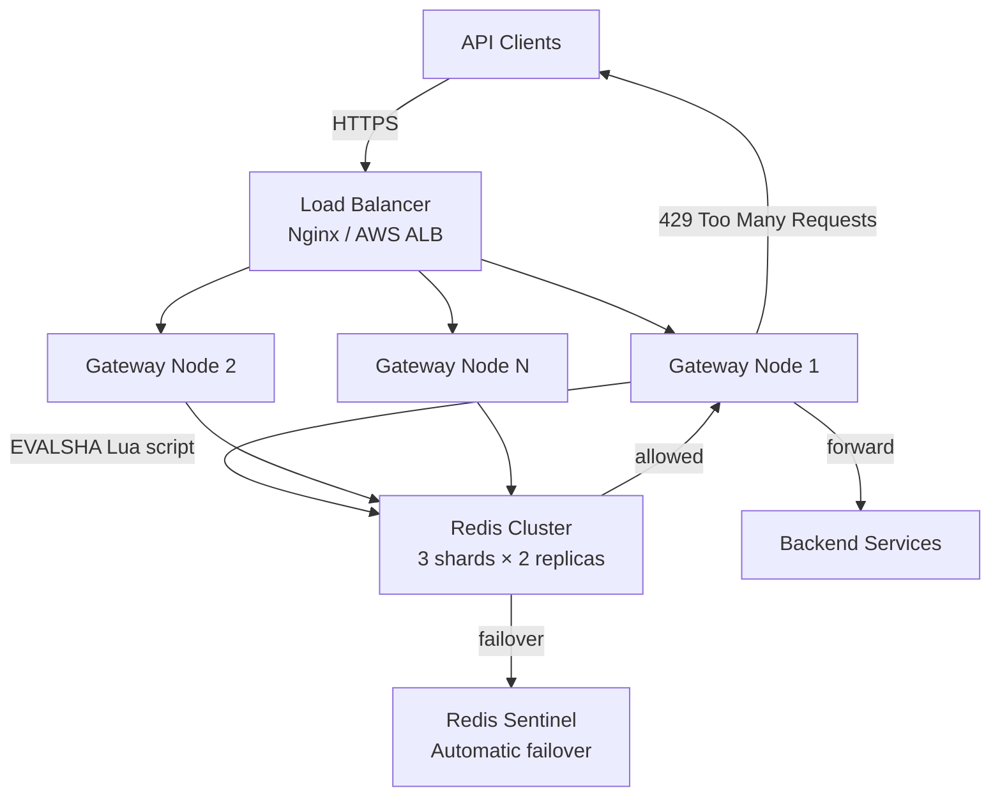

### Deep Dive: Token Bucket per API Key

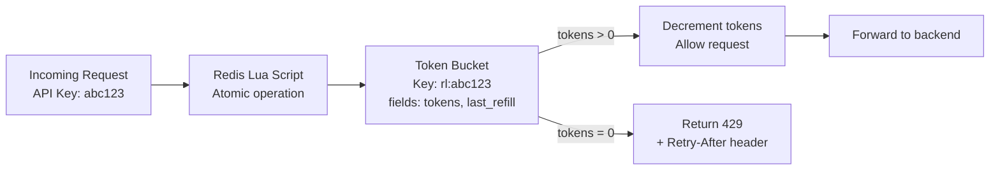

### Trade-off Decisions
| Decision | Option A | Option B | Chosen | Why |
|----------|----------|----------|--------|-----|
| Algorithm | Fixed window counter | Sliding window log | Sliding window | Fixed window allows 2x burst at window boundary |
| Storage | Redis centralized | Local in-process counter | Redis | Local counters don't sync across 10 gateway nodes |
| Failover behavior | Fail open (allow all) | Fail closed (reject all) | Fail open with local fallback | Fail closed kills service if Redis blips |
| Lua vs pipeline | Redis Lua atomic | INCR + EXPIRE pipeline | Lua script | Pipeline has race condition between INCR and EXPIRE |

### Failure Modes
| Failure | Impact | Mitigation |
|---------|--------|------------|
| Redis down | Rate limiting broken | Fail open with local sliding window per gateway node; alert immediately |
| Redis slow (>10ms) | Gateway latency spikes | Circuit breaker: skip rate limit check if Redis p99 > 5ms |
| Hash slot imbalance | One Redis shard overloaded | Prefix API keys with hash tags to distribute evenly |
| Clock skew between nodes | Window boundaries differ | Use Redis server time (TIME command) not local clock |

### Concept References
→ [Rate Limiting](../../../system-design/fundamentals/rate-limiting)
→ [Caching Strategies](../../../system-design/fundamentals/caching-strategies)

---

## Q2: What is a rate limiter and why is it needed?

**Role:** Junior | **Difficulty:** 🟢 Junior | **Priority:** P0 | **Format:** Quick Answer

> **What the interviewer is testing:** Whether you can articulate the purpose of rate limiting in plain terms and name concrete scenarios where it prevents real problems.

### Answer in 60 seconds
- **Definition:** A rate limiter controls how many requests a client can make in a time window — e.g., 100 requests/minute per API key
- **Prevents DoS:** Single bad actor hammering API at 50K rps crashes backend — rate limiter caps them at 100 rps, protects others
- **Controls costs:** LLM APIs cost $0.002/call; unlimited access = unbounded billing exposure
- **Enforces fair use:** Free tier limited to 60 rps, paid tier at 1000 rps — enables tiered monetization (Stripe, GitHub, Twilio model)
- **Protects downstream:** Backend services sized for 10K rps; without rate limiter, a traffic spike to 100K rps cascades failures

### Diagram

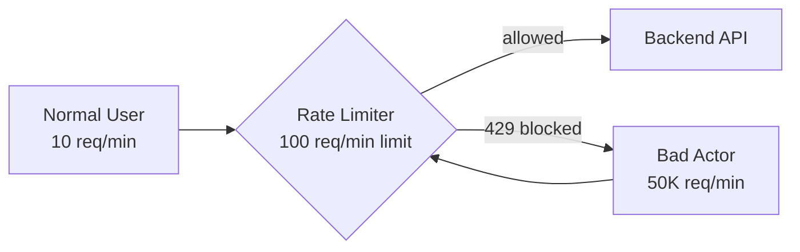

### Pitfalls
- ❌ **Thinking rate limiting only protects against attacks:** It also enables fair resource distribution and tiered pricing — not purely defensive
- ❌ **Implementing rate limits at the application layer only:** Put them at the gateway/reverse proxy layer to protect before traffic hits your code

### Concept Reference
→ [Rate Limiting](../../../system-design/fundamentals/rate-limiting)

---

## Q3: Compare Fixed Window vs Sliding Window vs Token Bucket algorithms

**Role:** Senior | **Difficulty:** 🔴 Senior | **Priority:** P0 | **Format:** Deep Dive

> **What the interviewer is testing:** Whether you know the correctness and performance trade-offs between the three main rate limiting algorithms and can choose the right one for different use cases.

### Problem Constraints
| Dimension | Value |
|-----------|-------|
| Scale | 50K rps, 1M API keys |
| Limit | 100 requests/minute per key |
| Burst allowance | Some burst acceptable, 2× spike not |
| Overhead | < 2ms per check |

### Approach A — Fixed Window Counter

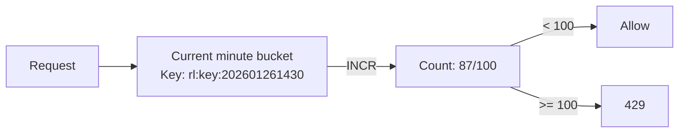

**Flaw:** At 11:59:59 user sends 100 requests → at 12:00:00 window resets → 100 more = **200 requests in 2 seconds**.

### Approach B — Sliding Window Log

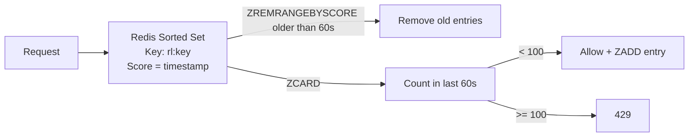

### Approach C — Token Bucket

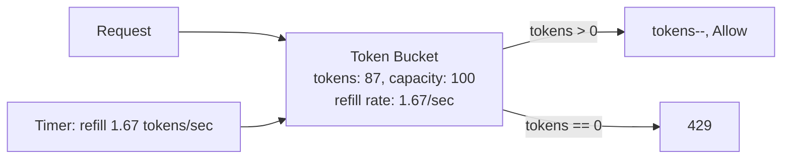

| Dimension | Fixed Window | Sliding Window Log | Token Bucket |
|-----------|-------------|-------------------|-------------|
| Burst at boundary | 2× allowed | None | Configurable burst |
| Memory per key | O(1) | O(n) — n=requests | O(1) |
| Redis ops | 2 (INCR + EXPIRE) | 3 (ZREMRANGE + ZCARD + ZADD) | 2 (GET + SET) |
| Accuracy | Approximate | Exact | Exact |
| Complexity | Low | Medium | Medium |

### Recommended Answer
Token Bucket for most APIs: O(1) memory, handles burst with `burst_capacity > rate_limit`, and is easy to reason about. Sliding Window Log for strict fairness (billing). Fixed Window only for approximate limits where boundary burst is acceptable (e.g., analytics sampling).

### What a great answer includes
- [ ] Explains the fixed window boundary burst problem with numbers
- [ ] States memory trade-off of sliding window log (O(n) vs O(1))
- [ ] Mentions Lua script for atomicity
- [ ] Gives a real-world example (Stripe uses token bucket)

### Pitfalls
- ❌ **Implementing with non-atomic Redis ops:** INCR then EXPIRE is two commands — race condition if server crashes between them; use Lua script
- ❌ **Choosing sliding window log for 1M keys at 50K rps:** Memory: 1M keys × 100 entries × 16 bytes = 1.6 GB just for rate limit logs

### Concept Reference
→ [Rate Limiting](../../../system-design/fundamentals/rate-limiting)

---

## Q4: How do you implement rate limiting across multiple servers?

**Role:** Mid | **Difficulty:** 🟡 Mid | **Priority:** P0 | **Format:** Quick Answer

> **What the interviewer is testing:** Whether you understand the coordination problem when multiple gateway instances each have partial view of request counts, and how a centralized store solves it.

### Answer in 60 seconds
- **Problem:** 10 gateway nodes, each with local counter — user sends 10 req/sec to each node = 100 req/sec total, but each node thinks limit of 100 is not exceeded
- **Solution:** Centralized Redis — all gateway nodes read/write to shared Redis counter atomically via Lua script
- **Sharding:** Hash API key to Redis shard — `HASH_SLOT = crc16(api_key) % 16384`; consistent hashing ensures all requests for same key hit same Redis shard
- **Latency:** Redis call adds ~1ms p99 within same DC — acceptable for 5ms overhead budget

### Diagram

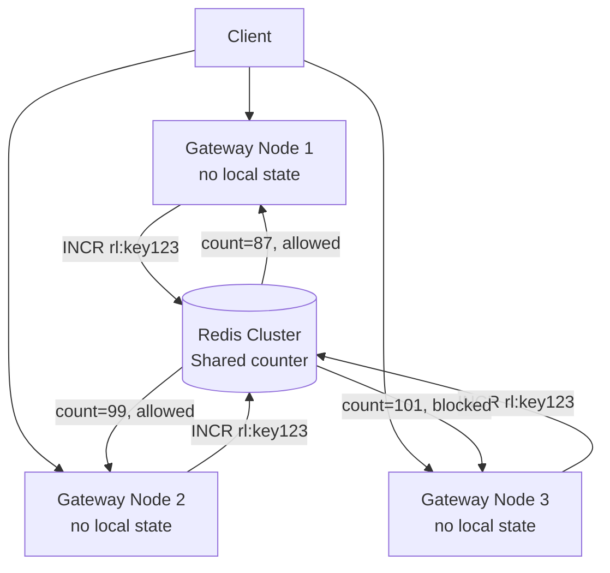

### Pitfalls
- ❌ **Local in-process rate limiting on multi-node gateway:** Each node has 1/N of the actual traffic view — N nodes means N× the configured limit is actually allowed
- ❌ **Not hashing to same Redis shard:** If same key lands on different shards, counters are split — use hash tags `{api_key}` to ensure same slot

### Concept Reference
→ [Rate Limiting](../../../system-design/fundamentals/rate-limiting)

---

## Q5: How do you handle rate limit headers in API responses?

**Role:** Mid | **Difficulty:** 🟡 Mid | **Priority:** P1 | **Format:** Quick Answer

> **What the interviewer is testing:** Whether you know the standard rate limit response headers and how clients use them to implement backoff without hammering the API.

### Answer in 60 seconds
- **Standard headers:** `X-RateLimit-Limit: 100`, `X-RateLimit-Remaining: 13`, `X-RateLimit-Reset: 1706270460` (Unix epoch when limit resets)
- **429 response:** Include `Retry-After: 47` (seconds until retry allowed) — clients use this for exponential backoff
- **IETF draft:** `RateLimit-Limit`, `RateLimit-Remaining`, `RateLimit-Reset` (standard being standardized as RFC 6585)
- **GitHub example:** Returns `X-RateLimit-Limit: 5000`, `X-RateLimit-Used: 4986`, `X-RateLimit-Reset: 1372700873` on every response

### Diagram

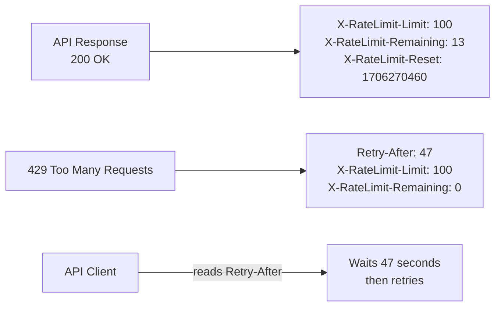

### Pitfalls
- ❌ **Not returning headers on 429 responses:** Clients have no information for backoff — they retry immediately, making the problem worse
- ❌ **Returning reset time in non-UTC or ambiguous format:** Use Unix epoch for `Reset` — timezone-independent, universally parseable

### Concept Reference
→ [API Design](../../../system-design/fundamentals/api-design-rest-graphql-grpc)

---

## Q6: How do you rate limit by user, IP, and API key simultaneously?

**Role:** Senior | **Difficulty:** 🔴 Senior | **Priority:** P1 | **Format:** Deep Dive

> **What the interviewer is testing:** Whether you can design multi-dimensional rate limiting that catches different abuse vectors without creating operational complexity.

### Problem Constraints
| Dimension | Value |
|-----------|-------|
| Limit dimensions | Per IP: 10 rps, Per user: 100 rps, Per API key: 1000 rps |
| Scale | 50K rps, 1M API keys, 10M unique IPs/day |
| Precedence | If any dimension exceeded, reject request |
| Latency | All checks < 3ms combined |

### Approach A — Sequential Check (Waterfall)

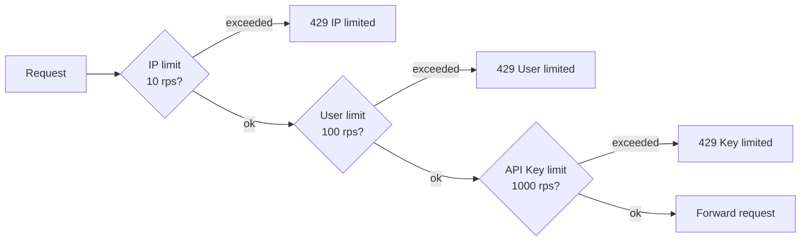

### Approach B — Parallel Pipeline (Lua Multi-Check)

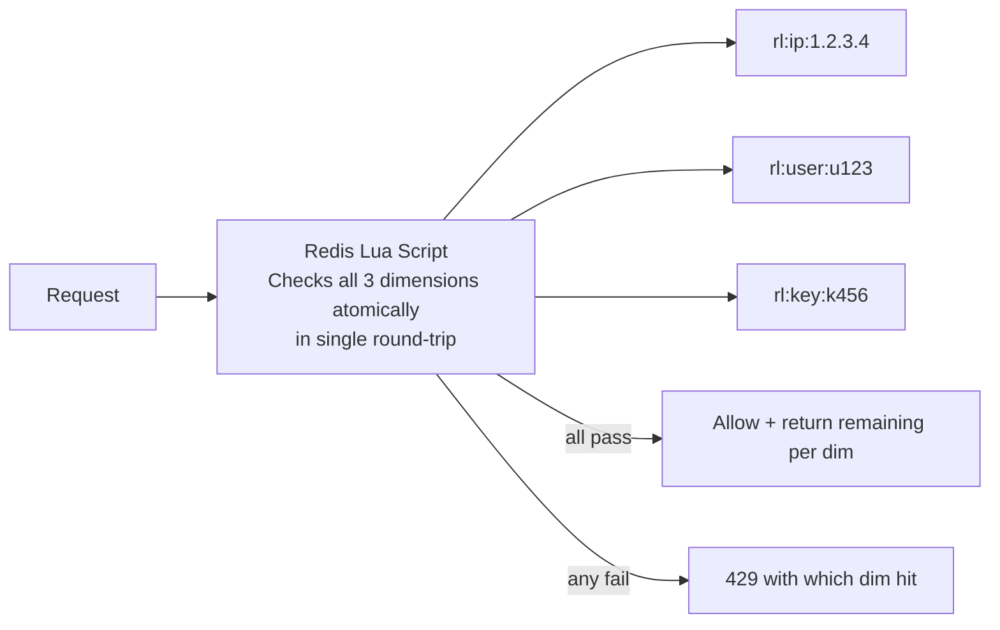

| Dimension | Sequential | Parallel Lua |
|-----------|-----------|-------------|
| Redis round-trips | 1–3 | 1 always |
| Latency | 1–3ms (1ms/check) | ~1.5ms (slightly heavier script) |
| Atomicity | Not guaranteed | Full (Lua is atomic) |
| Error message | Which limit first hit | Which dimension exceeded |

### Recommended Answer
Parallel Lua script that checks all three dimensions in one round-trip. Script returns: `{allowed: true/false, ip_remaining: N, user_remaining: N, key_remaining: N, blocked_by: "ip|user|key|none"}`. Gateway reads result and sets appropriate response headers. Single Redis call is ~1.5ms vs 3× 1ms sequential = same cost with atomicity guarantee.

### What a great answer includes
- [ ] Notes that sequential checks have race conditions (IP check passes, user check fails, IP counter was already decremented)
- [ ] Mentions returning which dimension was exceeded for useful error messages
- [ ] Addresses different limit windows per dimension (IP per second, user per minute)
- [ ] Considers unauthenticated requests (only IP check applies)

### Pitfalls
- ❌ **Decrementing counters for rejected requests:** If IP check passes then user check fails, IP counter was already decremented — check all first, then decrement atomically
- ❌ **Same time window for all dimensions:** IP rate limit should be per-second (burst protection), user per-minute (sustained use), API key per-hour (quota)

### Concept Reference
→ [Rate Limiting](../../../system-design/fundamentals/rate-limiting)

---

## Q7: What happens when Redis for rate limiting goes down?

**Role:** Senior | **Difficulty:** 🔴 Senior | **Priority:** P1 | **Format:** Quick Answer

> **What the interviewer is testing:** Whether you understand graceful degradation vs fail-safe behavior, and how to build a rate limiter that doesn't become a single point of failure.

### Answer in 60 seconds
- **Option 1 — Fail open:** Allow all requests when Redis is down — rate limiting disabled temporarily; protect backend with circuit breakers instead
- **Option 2 — Fail closed:** Reject all requests when Redis is down — safe but kills service if Redis blips for 30s
- **Option 3 — Local fallback:** Each gateway node maintains a local in-memory token bucket — approximately enforces limits without coordination
- **Recommendation:** Fail open + local fallback + circuit breaker; Redis HA via Sentinel (< 30s failover); alert immediately on Redis unavailability

### Diagram

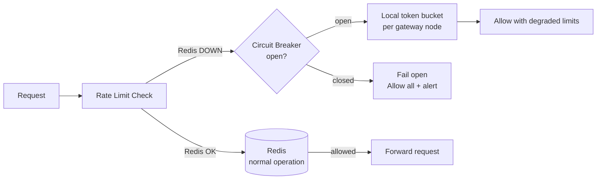

### Pitfalls
- ❌ **No fallback strategy — service goes down when Redis blips:** Redis Sentinel with 3 nodes reduces outage risk; but transient network partition still needs local fallback
- ❌ **Local fallback without coordination allows N× the limit:** 10 nodes × 100 rps local limit = 1000 rps per user — communicate local limits as `limit/N` where N is node count

### Concept Reference
→ [Circuit Breaker Pattern](../../../system-design/fundamentals/circuit-breaker-pattern)

---

## Q8: How do you implement burst allowance above the rate limit?

**Role:** Senior | **Difficulty:** 🔴 Senior | **Priority:** P2 | **Format:** Quick Answer

> **What the interviewer is testing:** Whether you understand token bucket burst capacity configuration and how to communicate burst behavior to API consumers.

### Answer in 60 seconds
- **Token bucket parameters:** `capacity = burst_limit`, `refill_rate = sustained_limit/sec` — e.g., 100 sustained/min = 1.67 tokens/sec refill, capacity = 20 for burst
- **Burst semantics:** User can send 20 requests instantly (burst), then rate drops to 1.67/sec sustained — bucket refills continuously
- **Stripe example:** 100 req/sec sustained, burst up to 200 req/sec for 1 second — uses leaky bucket variant
- **Header communication:** `X-RateLimit-Burst-Remaining: 15` alongside regular remaining headers — lets clients know burst headroom

### Diagram

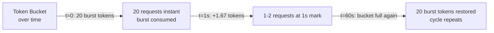

### Pitfalls
- ❌ **Setting burst_capacity = sustained_limit:** No actual burst benefit — set burst at 2–5× sustained rate for meaningful flexibility
- ❌ **Not documenting burst behavior in API docs:** Clients don't know why their 20 rapid requests succeed but the 21st fails — document `burst_capacity` explicitly

### Concept Reference
→ [Rate Limiting](../../../system-design/fundamentals/rate-limiting)

---

## Q9: How does Stripe implement tiered rate limiting (free vs paid)?

**Role:** Staff | **Difficulty:** ⚫ Staff | **Priority:** P2 | **Format:** Deep Dive

> **What the interviewer is testing:** Whether you can design a multi-tier rate limiting system that dynamically applies different limits based on subscription tier without code changes for each new tier.

### Problem Constraints
| Dimension | Value |
|-----------|-------|
| Tiers | Free (100/min), Starter (1000/min), Business (10K/min), Enterprise (custom) |
| API keys | 5M keys across all tiers |
| Dynamic limits | Enterprise customers get custom limits without deploy |
| Latency | < 2ms for tier lookup + rate check |

### Approach A — Hardcoded Tier Limits

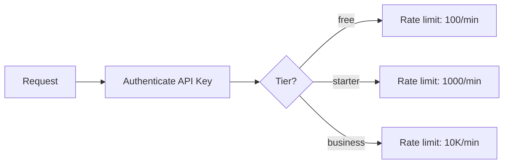

**When to use:** Small number of tiers that rarely change.

### Approach B — Dynamic Limit Config from Redis

```mermaid
graph TD
  Request --> Auth[Auth Service\nVerify API key]
  Auth --> LookupTier[Redis: GET tier:{api_key}\ncached for 5 min]
  LookupTier -->|cache miss| DB[(Account DB\ntier + custom_limit)]
  DB --> Cache[Cache: SET tier:{api_key}\n5min TTL]
  Cache --> RL[Rate Limiter\ntokens = custom_limit ?? tier_default]
  RL -->|Redis EVALSHA| TBucket[Token Bucket\nKey: rl:{api_key}]
  TBucket -->|allowed| Forward[Backend]
  TBucket -->|exceeded| Return429[429 + X-RateLimit-Limit: N]
```

| Dimension | Hardcoded | Dynamic Redis Config |
|-----------|----------|---------------------|
| New tier rollout | Code deploy | Update DB record |
| Enterprise custom limits | Manual code change | Per-key limit in DB |
| Latency | 0 (in-memory) | +0.5ms Redis lookup |
| Operational complexity | Low | Medium |

### Recommended Answer
Dynamic config (Approach B). Tier limit stored in account DB. On request, lookup `tier:{api_key}` in Redis (5min TTL). Cache miss → DB query → cache result. Rate limit key uses API key prefix: `rl:{api_key}`, limit value from tier config. Enterprise customers get per-key custom limits in `api_keys.custom_rate_limit` column — overrides tier default. Zero-downtime limit changes.

### What a great answer includes
- [ ] Separates authentication (verify key) from authorization (get tier limit)
- [ ] Caches tier lookup to avoid DB on every request
- [ ] Supports per-key custom limits for enterprise without code change
- [ ] Mentions how to reflect limit changes without full cache flush (short TTL)

### Pitfalls
- ❌ **Looking up tier from DB on every request at 50K rps:** 50K DB reads/sec for tier lookup — always cache with short TTL (5 min)
- ❌ **Using user tier limit for all their API keys:** User may have dev key (lower limit) and prod key (higher limit) — limits should be per API key, not per user account

### Concept Reference
→ [Rate Limiting](../../../system-design/fundamentals/rate-limiting)

---

## Q10: How do you prevent rate limit bypass via distributed IPs?

**Role:** Staff | **Difficulty:** ⚫ Staff | **Priority:** P2 | **Format:** Quick Answer

> **What the interviewer is testing:** Whether you understand that IP-based rate limiting is insufficient against distributed attackers and what additional signals can be used for effective abuse prevention.

### Answer in 60 seconds
- **Problem:** Attacker uses 1000 IPs (botnet/residential proxy) — each IP under 10 rps limit but collective load = 10K rps
- **User-level limiting:** Bind rate limit to authenticated user/API key, not IP — sophisticated but requires auth for every request
- **Fingerprinting:** Device fingerprint (browser canvas, TLS fingerprint, HTTP/2 stream settings) as additional signal beyond IP
- **Behavioral signals:** Velocity patterns — 1000 IPs sending exactly 9 rps each is suspicious; machine learning anomaly detection
- **CAPTCHA escalation:** IP with unusual patterns gets CAPTCHA before API access — breaks automated scraping
- **Cloudflare WAF:** Turns bot detection into a managed service — bot score 0–100; block if score > 80

### Diagram

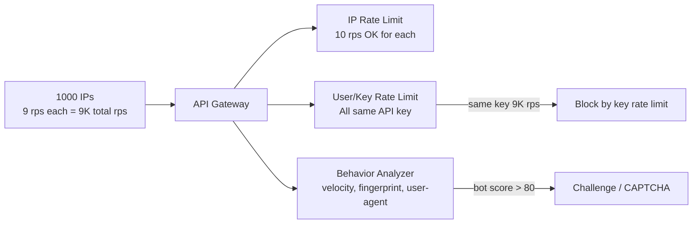

### Pitfalls
- ❌ **Relying solely on IP rate limiting:** Bot networks route through residential proxies with legitimate-looking IPs — IP alone is an insufficient signal
- ❌ **Not binding abuse to authenticated identity:** Unauthenticated IP-based limiting is easily bypassed; require API key for all requests and rate-limit by key

### Concept Reference
→ [Rate Limiting](../../../system-design/fundamentals/rate-limiting)
→ [Fraud Detection](../../../system-design/business-and-advanced/fraud-detection)
