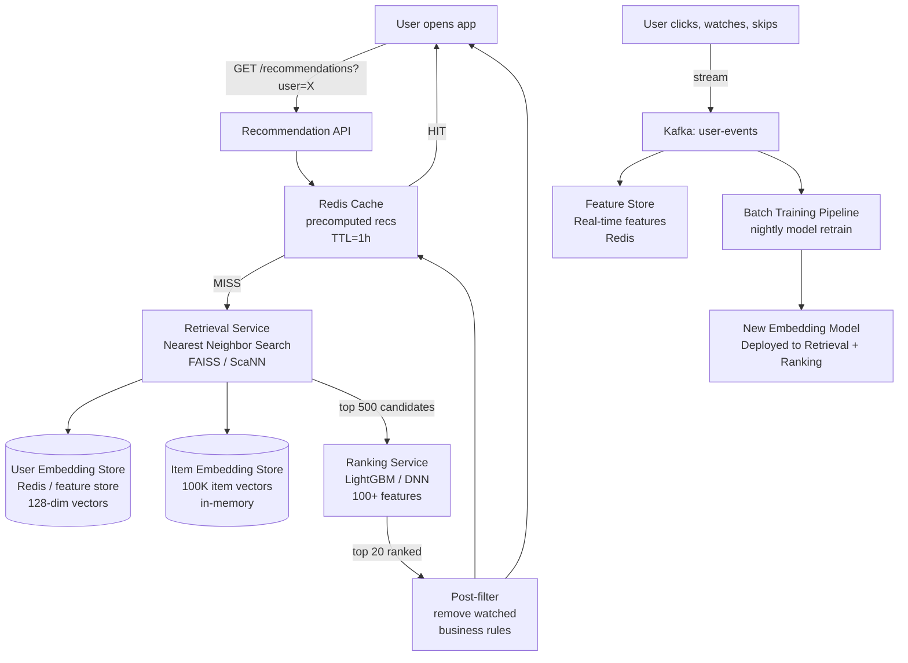
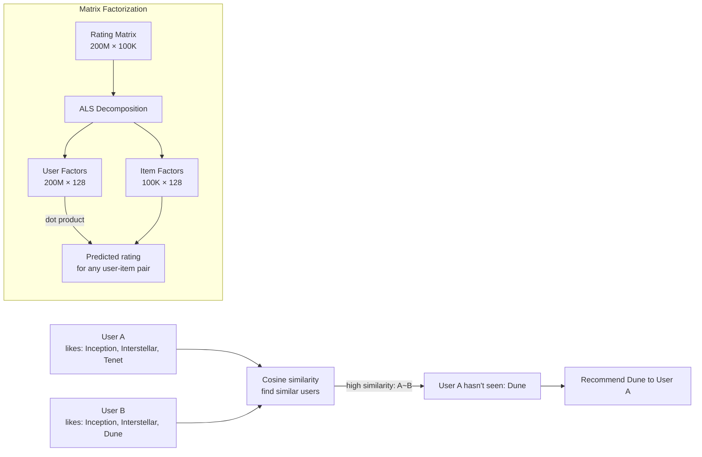
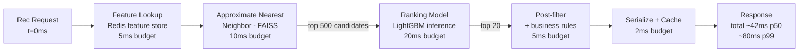
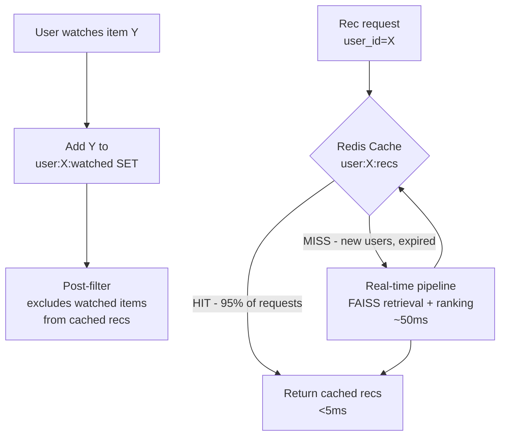
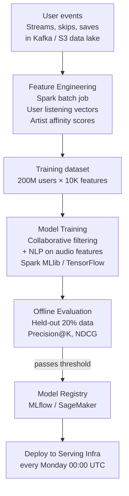

# Design a Recommendation Engine (Netflix/Spotify)

---

## Q1: Design a recommendation engine for 200M users and 100K items with 50M requests/day

**Role:** Senior | **Difficulty:** 🔴 Senior | **Priority:** P0 | **Format:** Scenario
**Real Company:** Netflix — 80% of viewed content comes from recommendations; Spotify Discover Weekly — 40M+ listeners/week; Amazon — 35% of revenue from recommendations

### The Brief
> "Design a recommendation engine for a streaming platform. It must serve personalized content recommendations to 200M users from a catalog of 100K items (movies/songs). The system must handle 50M recommendation requests per day, return results in under 100ms p99, and update recommendations as users interact with content."

### Clarifying Questions to Ask First
1. Real-time personalization (updates within seconds of user action) or daily batch model refresh?
2. Is catalog size stable or rapidly growing (new items added continuously)?
3. Do we need to handle cold start for new users and new items separately?
4. Are there business rules — e.g., must promote new releases, avoid already-watched content?

### Back-of-Envelope Estimation
| Metric | Calculation | Result |
|--------|-------------|--------|
| Requests/sec | 50M ÷ 86400 | ~578 recs/sec avg |
| Peak requests | 578 × 10 (evening spike) | ~5,780 recs/sec |
| Users | 200M users | — |
| Items | 100K items | — |
| User-item matrix | 200M × 100K (if dense) | 20T cells (too large — sparse in practice) |
| Average ratings/user | 100 interactions | 200M × 100 = 20B interactions |
| Embedding size | 128 dimensions, float32 | 4 bytes × 128 × 200M = 100 GB user embeddings |
| Item embeddings | 128 × 100K × 4B | ~50 MB item embeddings (tiny) |
| Response payload | 20 items × 200 bytes | 4 KB per response |

### High-Level Architecture



### Deep Dive: Two-Tower Neural Network

```mermaid
graph TD
  subgraph UserTower[User Tower]
    UserFeatures[User features:\nage, country, watch history,\ntime of day, device] --> UserLayers[Dense Layers\n512 → 256 → 128]
    UserLayers --> UserEmbedding[User Embedding\n128-dim vector]
  end

  subgraph ItemTower[Item Tower]
    ItemFeatures[Item features:\ngenre, cast, duration,\nrelease year, language] --> ItemLayers[Dense Layers\n512 → 256 → 128]
    ItemLayers --> ItemEmbedding[Item Embedding\n128-dim vector]
  end

  UserEmbedding -->|dot product| Score[Relevance Score\n= dot(user_emb, item_emb)]
  ItemEmbedding --> Score
  Score -->|top K| Candidates[Top-K Candidates\nfor ranking stage]
```

### Trade-off Decisions
| Decision | Option A | Option B | Chosen | Why |
|----------|----------|----------|--------|-----|
| Collaborative filtering | Matrix factorization (ALS) | Two-tower neural network | Two-tower | Two-tower handles cold start via content features; neural nets capture non-linear patterns |
| Candidate retrieval | Brute-force cosine similarity (O(N)) | FAISS approximate nearest neighbor | FAISS | At 100K items, FAISS returns top-500 in < 5ms vs O(N)=O(100K) per query |
| Recommendation freshness | Pre-compute daily | Real-time per request | Hybrid (1h cache + real-time fallback) | Pre-compute covers 95% of requests; real-time for cold-start users |
| Feature serving | Training DB (batch) | Feature store (real-time) | Feature store | Serving must read features in < 5ms; batch DB too slow on hot path |

### Failure Modes
| Failure | Impact | Mitigation |
|---------|--------|------------|
| Cold start — new user | No interaction history → generic recommendations | Content-based fallback: recommend popular items in user's declared genre preferences |
| Cold start — new item | Item has no interactions → never recommended | Content-based features (genre, metadata) place item in embedding space; promote new items with business rule boost |
| Popularity bias | Model recommends same top-100 popular items to everyone | Diversity injection: mix top-ranked + serendipitous (medium-rank items the user hasn't seen) |
| Stale recommendations | User watches 10 items in one session; old rec list shows watched items | Real-time watch filter: exclude `user_watched` set (Redis SET) from candidates post-retrieval |

### Concept References
→ [Caching Strategies](../../../system-design/fundamentals/caching-strategies)
→ [Kafka / Messaging](../../../system-design/messaging-and-streaming/kafka-rabbitmq)

---

## Q2: Explain collaborative filtering and its cold start problem

**Role:** Mid | **Difficulty:** 🟡 Mid | **Priority:** P0 | **Format:** Quick Answer

> **What the interviewer is testing:** Whether you can explain collaborative filtering intuitively, its mathematical basis, and the cold start problem with concrete mitigations.

### Answer in 60 seconds
- **User-based CF:** "Users who liked what you liked also liked X" — find K most similar users (cosine similarity on rating vectors), recommend items they liked that you haven't seen
- **Item-based CF:** "Users who liked item A also liked item B" — Amazon's original algorithm (item-to-item CF); more stable than user-based (item similarity changes slowly)
- **Matrix factorization:** Decompose user-item matrix into User_matrix × Item_matrix (latent factors); ALS (Alternating Least Squares) or SVD; Netflix Prize winning approach
- **Cold start — new user:** No rating history → can't find similar users → fall back to: (1) demographic-based popular items, (2) onboarding questionnaire, (3) popularity in region
- **Cold start — new item:** No ratings → never appears in CF recommendations → use content-based features (genre, metadata) for initial placement; CF kicks in after ~50 ratings

### Diagram



### Pitfalls
- ❌ **Building CF without handling cold start:** Every system has new users; a CF-only system shows generic popular content to new users for days/weeks — use hybrid (CF + content-based) from day 1
- ❌ **User-based CF at scale:** Computing pairwise similarity across 200M users = 200M² comparisons — computationally infeasible; use item-based CF or latent factor models instead

### Concept Reference
→ [Caching Strategies](../../../system-design/fundamentals/caching-strategies)

---

## Q3: How do you serve recommendations in under 100ms at 50M requests/day?

**Role:** Senior | **Difficulty:** 🔴 Senior | **Priority:** P0 | **Format:** Deep Dive

> **What the interviewer is testing:** Whether you understand the two-stage retrieval → ranking pipeline and how to make each stage fast enough to meet latency SLAs.

### Problem Constraints
| Dimension | Value |
|-----------|-------|
| Latency SLA | p99 < 100ms |
| Throughput | 5,780 recs/sec peak |
| Users | 200M (embedding store size: 100 GB) |
| Items | 100K (small enough to fit in RAM) |

### Stage Breakdown: Budget Allocation



### Approach A — Pre-computed Recommendations

```mermaid
graph LR
  BatchJob[Nightly Batch Job\n2am - 4am] --> ComputeRecs[Compute recs\nfor all 200M users]
  ComputeRecs --> RecStore[(Rec Store\nRedis / DynamoDB\nuser_id → [item_id × 50])]
  Request[User request] --> RecStore
  RecStore -->|< 5ms| Response[Response]
```

**Problem:** 200M × 50 items × 8 bytes = 80GB storage; recs stale up to 24h; no personalization for in-session actions.

### Approach B — Hybrid (Cache + Real-Time Fallback)



| Dimension | Pre-computed | Real-Time | Hybrid |
|-----------|-------------|-----------|--------|
| Latency p99 | < 5ms (Redis lookup) | 50-100ms | < 5ms (95%), < 100ms (5%) |
| Freshness | 24h stale | Seconds | Real-time filters on cache |
| Infra cost | High (80GB Redis) | High (GPU inference) | Moderate |
| Cold start | Falls back to popular | Handled | Handled |

### Recommended Answer
Hybrid approach: pre-compute recommendations for active users nightly (last 30 days active = ~60M users), serve from Redis with TTL=1h. Add real-time post-filter: Redis SET of watched items per user — filter from cached recs on each request (< 2ms). For cold-start (new users, cache miss), route to real-time FAISS + ranking pipeline. FAISS indexes all 100K item embeddings in ~50MB RAM — exact enough for 128-dim vectors. Ranking model is LightGBM (CPU inference < 20ms for 500 candidates). Total p99 < 80ms.

### What a great answer includes
- [ ] Splits into retrieval (FAISS) + ranking (LightGBM) stages
- [ ] States why FAISS: brute force O(100K) per request at 5K rps = 500M ops/sec — FAISS reduces to O(log N)
- [ ] Real-time watched-item filter applied at serving time, not cache refresh time
- [ ] Quantifies cache hit rate and fallback latency separately

### Pitfalls
- ❌ **Running ranking model on all 100K items:** Ranking requires 100+ features per item; at 100K items × 5K rps = 500M model inferences/sec; always use two-stage (retrieve top-500, rank top-500)
- ❌ **Caching recs without watched-item filter:** User watches 5 items in a session; cached recs still show those 5 items; watched-item filter must run at serving time, not cache population time

### Concept Reference
→ [Caching Strategies](../../../system-design/fundamentals/caching-strategies)
→ [Database Sharding](../../../system-design/storage-and-databases/database-sharding)

---

## Q4: How does Netflix A/B test recommendation algorithms?

**Role:** Senior | **Difficulty:** 🔴 Senior | **Priority:** P1 | **Format:** Quick Answer

> **What the interviewer is testing:** Whether you understand A/B testing infrastructure for ML models — user assignment, metric collection, statistical significance, and the risks of novelty effects.

### Answer in 60 seconds
- **User bucketing:** Consistent hash `user_id % 100` → bucket 0–49 = Control (old model), 50–99 = Treatment (new model); consistent so same user always gets same variant
- **Metric collection:** Primary metric = long-term engagement (7-day retention, hours watched); secondary = CTR on recommendations, skip rate
- **Minimum sample size:** For 5% lift detection at 95% confidence, need ~170K users per variant — Netflix runs experiments for 2–4 weeks
- **Novelty effect:** New UI/model = temporary engagement boost due to novelty, not real improvement; run experiments > 2 weeks to let novelty effect decay
- **Netflix approach:** Uses holdout groups — 1% of users always see old algorithm as long-term holdout; detects model degradation over months even after A/B test concluded

### Diagram

```mermaid
graph TD
  UserReq[User request\nuser_id=789] --> Bucketer[Experiment Service\nhash(789) % 100 = 39]
  Bucketer -->|39 < 50 = Control| OldModel[Old Rec Model\nmatrix factorization]
  Bucketer -->|if 50-99 = Treatment| NewModel[New Rec Model\ntwo-tower neural net]
  OldModel --> RecResponse[Recommendations served]
  NewModel --> RecResponse
  RecResponse --> MetricsCollector[Metrics Collector\nkafka: experiment-events]
  MetricsCollector --> ExperimentDB[(Experiment DB\nClicks, watches, skips\nper user per variant)]
  ExperimentDB --> StatEngine[Statistical Engine\nt-test, Mann-Whitney U\nconfidence intervals]
  StatEngine --> Dashboard[Experiment Dashboard\np-value, lift %, confidence]
```

### Pitfalls
- ❌ **Stopping experiment early when metric looks good:** "Peeking problem" — stopping when p-value < 0.05 inflates false positive rate to ~26% if checked 5 times; use sequential testing (Wald test) or pre-commit to experiment duration
- ❌ **Using CTR as primary metric for recommendation quality:** Users click on thumbnail, watch 30 seconds, abandon — high CTR but poor quality; use completion rate or 7-day retention as primary metric

### Concept Reference
→ [Observability](../../../system-design/scale-and-reliability/observability)

---

## Q5: How does Spotify generate Discover Weekly — offline training vs online serving?

**Role:** Staff | **Difficulty:** ⚫ Staff | **Priority:** P2 | **Format:** Deep Dive

> **What the interviewer is testing:** Whether you understand the ML pipeline from offline training to online serving, including feature pipelines, model versioning, and the trade-offs of weekly batch vs real-time personalization.

### Problem Constraints
| Dimension | Value |
|-----------|-------|
| Users | 200M+ monthly active (Spotify) |
| Discover Weekly | 30-song playlist, refreshed every Monday |
| Training data | User listening history (streams, skips, saves, playlist adds) |
| Model refresh | Weekly batch retrain (not real-time) |
| Success metric | 40M+ users listen to Discover Weekly weekly; avg 30-min session per playlist |

### Offline Training Pipeline



### Online Serving Architecture

```mermaid
graph TD
  Monday[Monday 00:00 UTC] --> BatchInference[Batch Inference Job\ncompute 30-song playlist\nfor 200M users\nSpark on EMR: ~4 hours]
  BatchInference --> PlaylistStore[(Playlist Store\nDynamoDB\nuser_id → [track_id × 30])]

  User[User opens Spotify\nMonday morning] --> API[Discover Weekly API]
  API --> PlaylistStore
  PlaylistStore -->|< 5ms| Playlist[30-song playlist response]
```

| Dimension | Offline Batch (Discover Weekly) | Real-Time (Radio / Auto-Play) |
|-----------|--------------------------------|-------------------------------|
| Freshness | Weekly (Monday refresh) | Per-session (updates every song) |
| Personalization depth | Deep (full history) | Shallow (last 10 songs) |
| Compute cost | High batch (4h Spark job) | Low per-request inference |
| User expectation | Curated weekly playlist | Continuous seamless playback |
| Model complexity | Complex (collaborative + audio features) | Simple (last N tracks → next track) |

### Recommended Answer
Discover Weekly is entirely offline: train weekly on all user interactions (streams, saves, skips), compute playlist for all 200M users in a 4-hour Spark batch job every Sunday night, store in DynamoDB. Monday serving is just a DynamoDB lookup — < 5ms. Real-time personalization applies to radio/auto-play: a lightweight session-based model (last 10 tracks → next track) runs per request. The key architectural insight: match model refresh frequency to user expectation — nobody expects their weekly playlist to change mid-week; radio must change based on current mood.

### What a great answer includes
- [ ] Distinguishes use cases: weekly playlist (batch) vs continuous radio (real-time)
- [ ] States batch inference compute time and storage size
- [ ] Explains why DynamoDB over Redis for 200M × 30 tracks (persistence across pod restarts)
- [ ] Addresses model evaluation pipeline (offline metrics before deploy)

### Pitfalls
- ❌ **Real-time training for Discover Weekly:** 200M user playlist computation in real-time on demand is infeasible; batch compute and serve from key-value store
- ❌ **One model for all recommendation surfaces:** Autoplay (next song) requires very different model than discovery (serendipitous new artists); train and serve models separately per surface

### Concept Reference
→ [Kafka / Messaging](../../../system-design/messaging-and-streaming/kafka-rabbitmq)
→ [Database Sharding](../../../system-design/storage-and-databases/database-sharding)
